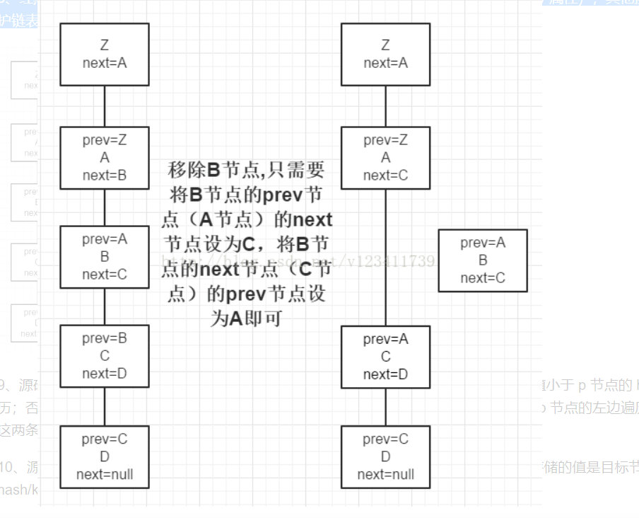
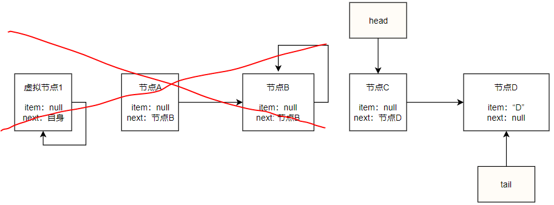
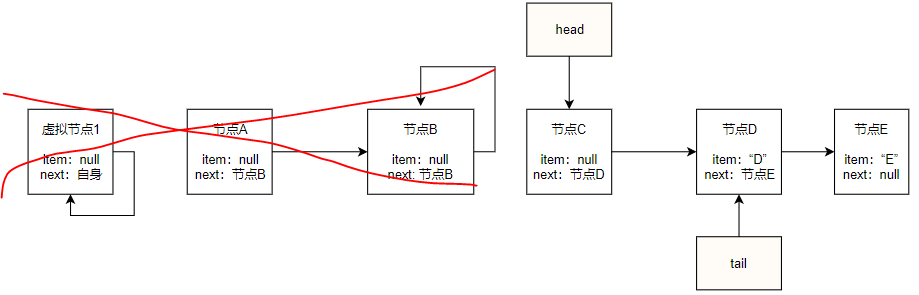
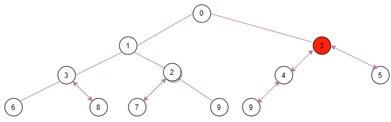
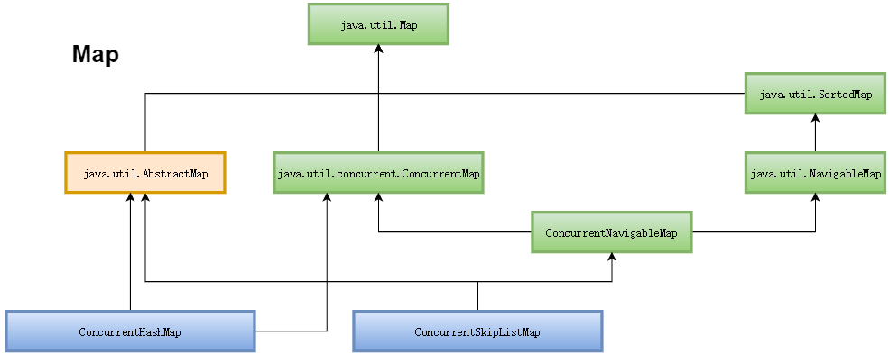

# 1、`java.lang`  

##  1.1  `Object`  

**``Java类的共同祖先,所有对象都默认实现其方法``**

### `registerNatives` ###
```java
    private static native void registerNatives();
    static {
        registerNatives();
    }
```

***总结***

 1. 不光是`Object`类，甚至`System`类、`Class`类、`ClassLoader`类、`Unsafe`类等等，都能在类代码中找到以上代码
 2. `Java`有两种方法：`Java`方法和本地方法。`Java`方法是由`Java`语言编写，编译成字节码，存储在`class`文件中。本地方法是由其他语言（比如`C`，`C++`，或者汇编）编写的，编译成和处理器相关的机器代码。本地方法保存在动态连接库中，格式是各个平台专有的。`Java`方法是平台无关的，单本地方法却不是。运行中的Java程序调用本地方法时，虚拟机装载包含这个本地方法的动态库，并调用这个方法。**本地方法是联系Java程序和底层主机操作系统的连接方法**。
 3. 凡是包含`registerNatives()`本地方法的类，同时也包含了其他本地方法。所以，显然，**当包含`registerNatives()`方法的类被加载的时候，注册的方法就是该类所包含的除了`registerNatives()`方法以外的所有本地方法。**
 4. 一个Java程序要想调用一个本地方法，需要执行两个步骤：第一，通过`System.loadLibrary()`将包含本地方法实现的动态文件加载进内存；第二，当`Java`程序需要调用本地方法时，虚拟机在加载的动态文件中定位并链接该本地方法，从而得以执行本地方法。**`registerNatives()`方法的作用就是取代第二步**，让程序主动将本地方法链接到调用方，当Java程序需要调用本地方法时就可以直接调用，而不需要虚拟机再去定位并链接。

### `hashCode` ###
```java
// 返回当前对象的哈希码，往往作为当前对象的唯一标识，参见System.identityHashCode(Object)和Arrays.hashCode()方法
public native int hashCode();
```
***总结***
  1. `hashCode`的存在主要是用于查找的快捷性，如`Hashtable`，`HashMap`等，`hashCode`是用来在散列存储结构中确定对象的存储地址的；
  2. 如果两个对象相同，就是适用于`equals(Java.lang.Object)` 方法，那么这两个对象的`hashCode`一定要相同；
  3. 如果对象的equals方法被重写，那么对象的`hashCode`也尽量重写，并且产生`hashCode`使用的对象，一定要和equals方法中使用的一致，否则就会违反上面提到的第2点；
  4. 两个对象的`hashCode`相同，并不一定表示两个对象就相同，也就是不一定适用于`equals(java.lang.Object)` 方法，只能够说明这两个对象在散列存储结构中，如`Hashtable`，他们“存放在同一个篮子里”。
  5. 再归纳一下就是**`hashCode`是用于查找使用的，而equals是用于比较两个对象的是否相等的。**

### `clone` ###
```java
/*
 * 浅拷贝，使用时往往需要重写为public形式。
 * 注：要求被克隆的对象所属的类实现Cloneable接口
 */
protected native Object clone() throws CloneNotSupportedException;
```
***总结***
  1. 实现`Cloneable`接口，这是一个标记接口，自身没有方法。
  2. 覆盖`clone()`方法，可见性提升为`public`。

>**` 浅拷贝和深拷贝 `**  
>   浅拷贝：被复制对象的所有值属性都含有与原来对象的相同，而所有的对象引用属性仍然指向原来的对象。简单的说，只能对八种基本类型进行完全的克隆，而对于对象 的引用类型却不能克隆，浅拷贝会导致原对象和浅克隆对象共享对象内的子对象，这是不安全的。当然，也不是所有的引用类型在浅拷贝共享的时候都是不安全的，**像一些不可变的类（比如：`String`）或者 子对象在整个生命期中一直包含不变的常量，且无法改变时，是安全的。**  
>   深拷贝：在浅拷贝的基础上，所有引用其他对象的变量也进行了`clone`，并指向被复制过的新对象。  
> 也就是说，一个默认的`clone()`方法实现机制，仍然是赋值。如果一个被复制的属性都是基本类型，那么只需要实现当前类的`cloneable`机制就可以了，此为浅拷贝。如果被复制对象的属性包含其他实体类对象引用，那么这些实体类对象都需要实现`cloneable`接口并覆盖`clone()`方法。

```java
@Data
public class Address implements Cloneable {
    private String type;
    private String value;
 
    @Override
    protected Object clone() throws CloneNotSupportedException {
        return super.clone();
    }
}
```
这样还不够，`Person`的`clone()`需要显式地`clone`其引用成员。

```java
@Data
public class Person implements Cloneable {
    private String name;
    private Integer age;
    private Address address;
    @Override
    protected Object clone() throws CloneNotSupportedException {
        Object obj=super.clone();
        Address a=((Person)obj).getAddress();
        ((Person)obj).setAddress((Address) a.clone());
        return obj;
    }
}
```

***`clone`方式深拷贝小结***  
① 如果有一个非原生成员，如自定义对象的成员，那么就需要：  

* 该成员实现`Cloneable`接口并覆盖`clone()`方法，不要忘记提升为`public`可见。  
* 同时，修改被复制类的`clone()`方法，增加成员的克隆逻辑。  

② 如果被复制对象不是直接继承`Object`，中间还有其它继承层次，每一层super类都需要实现`Cloneable`接口并覆盖`clone()`方法。
与对象成员不同，继承关系中的`clone`不需要被复制类的`clone()`做多余的工作。

>***一句话来说，如果实现完整的深拷贝，需要被复制对象的继承链、引用链上的每一个对象都实现克隆机制。
>前面的实例还可以接受，如果有N个对象成员，有M层继承关系，就会很麻烦。***

``Orika复制对象``
`orika`的作用不仅仅在于处理`bean`拷贝，更擅长各种类型之间的转换。

`maven`依赖：
`orika`的作用不仅仅在于处理bean拷贝，更擅长各种类型之间的转换。

```xml
<dependency>
  <groupId>ma.glasnost.orika</groupId>
  <artifactId>orika-core</artifactId>
  <version>1.5.0</version>
</dependency>
</dependencies>
```
测试用例：

```java
@Test
public void testOrika() {
  MapperFactory mapperFactory = new DefaultMapperFactory.Builder().build();
 
  mapperFactory.classMap(Person.class, Person.class)
  .byDefault()
  .register();
  ConverterFactory converterFactory = mapperFactory.getConverterFactory();
  MapperFacade mapper = mapperFactory.getMapperFacade();
 
  Person p1=PersonFactory.newPrototypeInstance();
  Person p2 = mapper.map(p1, Person.class);
  System.out.println("p1=" + p1);
  p2.getAddress().setType("Office");
  System.out.println("p2=" + p2);
}
```

###  wait&notify  ###
```java
// 随机唤醒某个具有相同锁的对象从wait状态进入争锁状态
public final native void notify();

// 唤醒所有具有相同锁的对象从wait状态进入争锁状态
public final native void notifyAll();

/*▼ 线程 ████████████████████████████████████████████████████████████████████████████████┓ */
    
/*
 * wait使得调用wait方法的线程放弃锁的持有权，并进入WAITING或TIMED_WAITING状态
 *
 * wait方法应当配合synchronized一起使用：
 *
 * 示例一：
 * synchronized void fun(){
 *   try {
 *      wait(1000);
 *   } catch(InterruptedException e) {
 *      e.printStackTrace();
 *   }
 * }
 *
 * 示例二：
 * synchronized(object) {
 *   try {
 *     object.wait(1000);
 *   } catch(InterruptedException e) {
 *     e.printStackTrace();
 *   }
 * }
 *
 * wait让当前线程陷入等待的同时，释放其持有的锁，以便让其他线程争夺锁的控制权
 * 作为对比，Thread.sleep方法即使陷入等待，也不会释放其持有的锁
 *
 * wait线程醒来的条件：
 * 1. 超时
 * 2. 被notify()或notifyAll()唤醒
 * 3. 在其他线程中调用该线程的interrupt()方法
 *
 * 注：
 * wait方法持有的锁是当前wait所处的上下文的对象（某个栈帧中的对象）
 * 如果wait持有的锁与当前上下文中的锁不一致，或者wait和notify用的锁不一致，会触发InterruptedException
 */

// 永不超时，需要靠上述条件2或条件3唤醒（释放锁）
public final void wait() throws InterruptedException {
    wait(0);
}

// 等待timeoutMillis毫秒之后自动醒来，或者靠上述条件2或条件3唤醒（释放锁）
public final native void wait(long timeout) throws InterruptedException;

/*
 * 至少等待timeoutMillis毫秒，nanos是一个纳秒级的附加时间，用来微调timeoutMillis参数（释放锁）
 * 内部实现可参考Thread中的void sleep(long millis, int nanos)方法
 */
public final void wait(long timeout, int nanos) throws InterruptedException {
    if (timeout < 0) {
        throw new IllegalArgumentException("timeout value is negative");
    }

    if (nanos < 0 || nanos > 999999) {
        throw new IllegalArgumentException(
                            "nanosecond timeout value out of range");
    }
    // 此处对于纳秒的处理不精准，只是简单增加了1毫秒，
    if (nanos > 0) {
        timeout++;
    }

    wait(timeout);
}
```
`jdk`中这五个方法。**其中有 3 个方法是 `native` 的，也就是由虚拟机本地的 `c` 代码执行的。**
有 2 个 `wait` 重载方法最终还是调用了 `wait(long)` 方法。  

1. **`wait`方法：** `wait`是要释放对象锁，进入等待池。**既然是释放对象锁，那么肯定是先要获得锁。**  所以`wait`必须要写在`synchronized`代码块中，否则会报异常。  
2. **`notify`方法：** 也需要写在`synchronized`代码块中，调用对象的这两个方法也需要先获得该对象的锁。**`notify`，`notifyAll`，唤醒等待该对象同步锁的线程，并放入该对象的锁池中。对象的锁池中线程可以去竞争得到对象锁，然后开始执行。**

>1. **如果是通过`notify`来唤起的线程**，那先进入wait的线程会先被唤起来，并非随机唤醒；
>2. **如果是通过`nootifyAll`唤起的线程**，默认情况是最后进入的会先被唤起来，即LIFO的策略；

另外一点比较重要，**`notify`，`notifyAll`调用时并不会释放对象锁。**  比如以下代码：
```java
public void test()
{
    Object object = new Object();
    synchronized (object){
        object.notifyAll();
        while (true){
         
        }
    }
}
```
虽然调用了`notifyAll`，但是紧接着进入了一个死循环。**导致一直不能出临界区，一直不能释放对象锁。**  所以，即使它把所有在等待池中的线程都唤醒放到了对象的锁池中，**但是锁池中的所有线程都不会运行，因为他们始终拿不到锁。**

**``用法``**

```java
public class WaitNotifyCase {
    public static void main(String[] args) {
        final Object lock = new Object();

        new Thread(new Runnable() {
            @Override
            public void run() {
                System.out.println("thread A is waiting to get lock");
                synchronized (lock) {
                    try {
                        System.out.println("thread A get lock");
                        TimeUnit.SECONDS.sleep(1);
                        System.out.println("thread A do wait method");
                        lock.wait();
                        System.out.println("wait end");
                    } catch (InterruptedException e) {
                        e.printStackTrace();
                    }
                }
            }
        }).start();

        new Thread(new Runnable() {
            @Override
            public void run() {
                System.out.println("thread B is waiting to get lock");
                synchronized (lock) {
                    System.out.println("thread B get lock");
                    try {
                        TimeUnit.SECONDS.sleep(5);
                    } catch (InterruptedException e) {
                        e.printStackTrace();
                    }
                    lock.notify();
                    System.out.println("thread B do notify method");
                }
            }
        }).start();
    }
}
```
执行结果：
```java
thread A is waiting to get lock
thread A get lock
thread B is waiting to get lock
thread A do wait method
thread B get lock
thread B do notify method
wait end
```

**前提：必须由同一个`lock`对象调用`wait`、`notify`方法**

>1. 当线程A执行`wait`方法时，该线程会被挂起；
>2. 当线程B执行`notify`方法时，会唤醒一个被挂起的线程A；

**`lock`对象、线程A和线程B三者是一种什么关系？**  根据上面的结论，可以想象一个场景：

>1. `lock`对象维护了一个等待队列`list`；
>2. 线程`A`中执行`lock`的`wait`方法，把线程A保存到list中；
>3. 线程`B`中执行`lock`的`notify`方法，从等待队列中取出线程`A`继续执行；

相关参考：  
[深入分析wait&notify原理](https://www.jianshu.com/p/6b9f260470a2)  
[使用wait和notify](https://www.liaoxuefeng.com/wiki/1252599548343744/1306580911915042)  
[Java 多线程编程之：notify 和 wait 用法](https://segmentfault.com/a/1190000018096174)  
[Java JDK 中提供的线程通信方式](https://blog.csdn.net/hu10131013/article/details/105663468)  

## 1.2  `String` 

```java
public final class String
    implements java.io.Serializable, Comparable<String>, CharSequence {
    /** The value is used for character storage. */
    private final char value[];

    /** Cache the hash code for the string */
    private int hash; 
```
如果你有一定源码分析基础。这里一看就就知道在`JDK8`中，`String`维护的是一个`char`数组，由于实现了`Comparable`可以比较大小。
为什么要把这个拿出来说？常量池中存在大量的字符串，这里又不得不的讨论他的存在方式。
1、`String`的不变可性：  

```java
package com.jvm.stu;

public class Main {
    String str = new String("good");
    char[] ch = {'t','e','s','t'};
    public static void main(String[] args) {
        Main ma = new Main();
        change(ma.str, ma.ch);
        System.out.println(ma.str);  //good
        System.out.println(ma.ch);   //Best

        ma.changeThis(ma.str, ma.ch);
        System.out.println(ma.str);  //change
        System.out.println(ma.ch);   //Best
    }
    public static void change(String str, char[] ch){
        str = "change";
        ch[0] = 'B';
    }
    public void changeThis(String str, char[] ch){
        this.str = "change";
        this.ch[0] = 'B';
    }
}
```
2、字串常量池中不会存在相同的字符串。
字符串常量池存放的是对象引用，不是对象。在`Java`中，对象都创建在堆内存中。
`String`的`String Pool`是一个固定大小`Hashtable`,默认长度60013（不同版本不一样），如果`String Pool`的`String`非常多，就会造成
`Hash`冲突，从而导致链表很长，进而导致调用`String.intern`时性能大幅度降低。
`-XX:StringTableSize`可以设置`StringTable`的长度。
字符串常量放在堆中，两种方式一种`String str="str"`,一种是使用intern方法创建

字符串拼接：
只要其中有一个是变量，结果就在堆中。变量的拼接原理是`StringBuilder`
如果拼接使用`intern`，则主动将常量池中还没有的字符串对象放入池中，并返回地址。

这也是因此
```java
str = str+"iii";
StringBuilder sb = new StringBuilder();
sb.append("iiii");
```
后者更快。因为前缀每次+都会创建一个`StringBuilder`并且返回时`sb.toString()`。效率大大降低了。

金典题目分析：
到底造了几个对象？

```java
String str=new String("aa");
```
>2个。字节码可以明显看出堆空间中new一个String对象，常量池中放入`"aa"`.
```java
String str= new String("a") + new String("b");
```
>5个。字节码可以明显看出堆空间  
>`Stringbuilder`对象   `new String("a")`对象    常量池中的`"a"   new String("b")`对象   常量池中的`"b"`

[基于JDK1.8的String详解](https://blog.csdn.net/Geffin/article/details/90269633)  
[Java中的字符串常量池（图解）](https://blog.csdn.net/qq_42391503/article/details/107779191)  
[Java中字符串拼接的一些细节分析](https://www.jb51.net/article/59934.htm)  


### `intern` ###

```java
   /**
     * Returns a canonical representation for the string object.
     * <p>
     * A pool of strings, initially empty, is maintained privately by the
     * class {@code String}.
     * <p>
     * When the intern method is invoked, if the pool already contains a
     * string equal to this {@code String} object as determined by
     * the {@link #equals(Object)} method, then the string from the pool is
     * returned. Otherwise, this {@code String} object is added to the
     * pool and a reference to this {@code String} object is returned.
     * <p>
     * It follows that for any two strings {@code s} and {@code t},
     * {@code s.intern() == t.intern()} is {@code true}
     * if and only if {@code s.equals(t)} is {@code true}.
     * <p>
     * All literal strings and string-valued constant expressions are
     * interned. String literals are defined in section 3.10.5 of the
     * <cite>The Java&trade; Language Specification</cite>.
     *
     * @return  a string that has the same contents as this string, but is
     *          guaranteed to be from a pool of unique strings.
     */
    public native String intern();
```
这里讲到
>  `All literal strings and string-valued constant expressions are interned`.  
>  所有的字符串字面量（如`"abc"`）和字符串常量表达式(如 `"a"+"bc"`)都是 `interned` 的。 


>如果字符串未在 `Pool` 中，那么就往 `Pool` 中增加一条记录，然后返回 对象中的引用。非`Pool` 中的引用  
>如果已经在 `Pool` 中，直接返回 `Pool` 中的引用。

[深入解析String#intern](http://tech.meituan.com/in_depth_understanding_string_intern.html)  
[《深入理解java虚拟机》String.intern()探究](https://blog.csdn.net/w605283073/article/details/72753494)

## 1.3 `Integer` 

```java

//八大基本数据类型：byte、int、short、long、double、float、boolean、char
//八大包装类型：Byte、Integer、Short、Long、Double、Float、Boolean、Character
//包装类都是被final修饰的,不可以被继承(由于被final修饰)
//继承Number
//实现了比较接口(需要重写compareTo方法)
//继承于Number类(该类继承了Serializable(序列化)接口),需要重写各种xxxValue方法
//Number类是java.lang包下的一个抽象类,提供了将包装类型拆箱成基本类型的方法，所有基本类型的包装类型都继承了该抽象类，并且包装类都用final修饰为不可继承类
//xxxValue方法就是转换成对应的类型(拆箱)
//自动装箱也就是调用了Integer类的一个静态方法valueOf方法(该方法返回Integer对象)
// Integer变量的声明可以通过Integer i = new Integer(100)声明；也可以通过Integer i = 100声明，其实调用的是Intager.valueOf(100)方法。
public final class Integer extends Number implements Comparable<Integer> {

   //最小值常量(十六进制补码形式表示):-2<sup>31</sup>
   @Native public static final int   MIN_VALUE = 0x80000000;  // -2147483648
 
    //最大值常量(十六进制补码形式表示):2<sup>31</sup>-1
   @Native public static final int   MAX_VALUE = 0x7fffffff;  // 2147483647
 
   @SuppressWarnings("unchecked")
   public static final Class<Integer>  TYPE = (Class<Integer>) Class.getPrimitiveClass("int");
 
   final static char[] digits = {
        '0' , '1' , '2' , '3' , '4' , '5' ,
        '6' , '7' , '8' , '9' , 'a' , 'b' ,
        'c' , 'd' , 'e' , 'f' , 'g' , 'h' ,
        'i' , 'j' , 'k' , 'l' , 'm' , 'n' ,
        'o' , 'p' , 'q' , 'r' , 's' , 't' ,
        'u' , 'v' , 'w' , 'x' , 'y' , 'z'
    };
 
　　private final int value;
 
　　public Integer(int value) {
        this.value = value;
　　}
　　public Integer(String s) throws NumberFormatException {
        this.value = parseInt(s, 10);
　　}
 
　　public int compareTo(Integer anotherInteger) {
        return compare(this.value, anotherInteger.value);
   }
 
   public static int compare(int x, int y) {
        return (x < y) ? -1 : ((x == y) ? 0 : 1); 
   }
}
```

### `Integer`缓存 ###

1. `Integer`把[-128,127]的数字放入缓存，以下面代码为例  

当使用`equals()`方法时，无论数字是几，都是`true`。
当使用`new Integer(num)`声明一个变量时， 用`==`比较永远是`false`，因为`new`申请的是两块不同的内存空间，`==`比较的是内存地址，所以肯定不同。
当使用直接赋值声明一个变量时，若变量范围在`[-128，127]`时，`==`比较为`true`，因为它们用的是同一块缓存；超出的话会重新`new`一个`Ingeter()`变量，地址就不同了，就是`false`。

```java
Integer integer1 = new Integer(128);          
Integer integer2 = new Integer(128);
Integer a = 128;
Integer b = 128;
System.out.println(integer1 == integer2);      // -129:false  -128:false  127:false  128:false
System.out.println(integer1.equals(integer2)); // -129:true   -128:true   127:true   128:true
System.out.println(a == b);                    // -129:false  -128:true   127:true   128:false
System.out.println(a.equals(b));               // -129:true   -128:true   127:true   128 true
```

  * `Integer   (-128~127)   32`位，最大数据存储容量是2的32次方减1，数据范围是负的2的31次方到正的2的31次方减1。
          * Boolean   (all)    只有true和false两个取值。
          * Byte      (all)       8位，最大存储数据量是255，存放的数据范围是-128~127（-2^7 ~ 2^7-1）之间。缓存区间[-128,127]
          * Character (<=127)   16位，存储Unicode码，用单引号赋值。
          * Short     (-128~127)  16位，最大数据存储量是65536，数据范围是-32768~32767（-2^15 ~ 2^15-1）之间。缓存区间[-128,127]
          * Long      (-128~127)  64位，最大数据存储容量是2的64次方减1，数据范围为负的2的63次方到正的2的63次方减1。缓存区间[-128,127]
          * Float     (none)  32位，数据范围在1.4e-45~3.4e38，直接赋值时必须在数字后加上f或F。
          * Double    (none)  64位，数据范围在4.9e-324~1.8e308，赋值时可以加d或D也可以不加。

```java
private static class IntegerCache {
        static final int low = -128; // -128
        static final int high;       // 127
        static final Integer cache[];
 
        static {
            // high value may be configured by property
            int h = 127;
            String integerCacheHighPropValue =
                sun.misc.VM.getSavedProperty("java.lang.Integer.IntegerCache.high");
            if (integerCacheHighPropValue != null) {
                try {
                    int i = parseInt(integerCacheHighPropValue);
                    i = Math.max(i, 127);
                    // Maximum array size is Integer.MAX_VALUE
                    h = Math.min(i, Integer.MAX_VALUE - (-low) -1);
                } catch( NumberFormatException nfe) {
                    // If the property cannot be parsed into an int, ignore it.
                }
            }
            high = h;
 
            cache = new Integer[(high - low) + 1];
            int j = low;
            for(int k = 0; k < cache.length; k++)
                cache[k] = new Integer(j++);
 
            // range [-128, 127] must be interned (JLS7 5.1.7)
            assert IntegerCache.high >= 127;
        }
 
        private IntegerCache() {}
    }
```

### `valueOf()` ###
给变量直接赋值的时候（`Integer i = 100`），就是使用`valyeOf()`方法来实现的。
由源码可以看到，若i在缓存范围内，则返回缓存中的数值，否则的话返回一个新的变量。

```java
 public static Integer valueOf(int i) {
        if (i >= IntegerCache.low && i <= IntegerCache.high)
            return IntegerCache.cache[i + (-IntegerCache.low)];
        return new Integer(i);
    }
```

## 1.4 `ThreadGroup`

>许多线程聚集成组即线程组，线程组可以包括其他线程组，线程组随着层级的增加可形成树，其中的每个线程组除了初始化线程组外都存在着父线程组。线程允许访问关于它自己的线程组的信息，但不允许访问其线程组的父线程组或任何其他线程组的信息。当需要锁定策略的时候，线程组成子线程组到父线程组是尽可能地锁定一个级别的树，但是不锁住树的底部。这样可以限制需要持有的锁的数量，特别是避免为根线程组(或全局锁)获取锁，这锁将是多处理器系统中许多线程组争用的资源。这样的锁定策略通常会导致获取一个线程组状态的快照，并在该快照中工作，而不是在执行的时候将线程组锁住。

```java
/**
 * A thread group represents a set of threads. In addition, a thread
 * group can also include other thread groups. The thread groups form
 * a tree in which every thread group except the initial thread group
 * has a parent.
 * <p>
 * A thread is allowed to access information about its own thread
 * group, but not to access information about its thread group's
 * parent thread group or any other thread groups.
 *
 * @author  unascribed
 * @since   JDK1.0
 */
/* The locking strategy for this code is to try to lock only one level of the
 * tree wherever possible, but otherwise to lock from the bottom up.
 * That is, from child thread groups to parents.
 * This has the advantage of limiting the number of locks that need to be held
 * and in particular avoids having to grab the lock for the root thread group,
 * (or a global lock) which would be a source of contention on a
 * multi-processor system with many thread groups.
 * This policy often leads to taking a snapshot of the state of a thread group
 * and working off of that snapshot, rather than holding the thread group locked
 * while we work on the children.
 */
public
class ThreadGroup implements Thread.UncaughtExceptionHandler {
    private final ThreadGroup parent; // 父线程组
    String name;   // 线程组名称
    int maxPriority; // 线程组优先级
    boolean destroyed;  // 当前线程组是否已销毁
    boolean daemon; // 是否为守护线程
    boolean vmAllowSuspension; // 供VM使用

    int nUnstartedThreads = 0; // 创建了但还未start()的线程
    int nthreads;   // 当前线程组内包含的线程数量
    Thread threads[];   // 存储当前线程组内包含的线程

    int ngroups;    // 子线程组数量
    ThreadGroup groups[];   // 存储子线程组

    /**
     * Creates an empty Thread group that is not in any Thread group.
     * This method is used to create the system Thread group.
     */
    private ThreadGroup() {     // called from C code
        this.name = "system";
        this.maxPriority = Thread.MAX_PRIORITY;
        this.parent = null;
    }
    ......

    /**
     * Called by the Java Virtual Machine when a thread in this
     * thread group stops because of an uncaught exception, and the thread
     * does not have a specific {@link Thread.UncaughtExceptionHandler}
     * installed.
     * <p>
     * The <code>uncaughtException</code> method of
     * <code>ThreadGroup</code> does the following:
     * <ul>
     * <li>If this thread group has a parent thread group, the
     *     <code>uncaughtException</code> method of that parent is called
     *     with the same two arguments.
     * <li>Otherwise, this method checks to see if there is a
     *     {@linkplain Thread#getDefaultUncaughtExceptionHandler default
     *     uncaught exception handler} installed, and if so, its
     *     <code>uncaughtException</code> method is called with the same
     *     two arguments.
     * <li>Otherwise, this method determines if the <code>Throwable</code>
     *     argument is an instance of {@link ThreadDeath}. If so, nothing
     *     special is done. Otherwise, a message containing the
     *     thread's name, as returned from the thread's {@link
     *     Thread#getName getName} method, and a stack backtrace,
     *     using the <code>Throwable</code>'s {@link
     *     Throwable#printStackTrace printStackTrace} method, is
     *     printed to the {@linkplain System#err standard error stream}.
     * </ul>
     * <p>
     * Applications can override this method in subclasses of
     * <code>ThreadGroup</code> to provide alternative handling of
     * uncaught exceptions.
     *
     * @param   t   the thread that is about to exit.
     * @param   e   the uncaught exception.
     * @since   JDK1.0
     */
    public void uncaughtException(Thread t, Throwable e) {
        if (parent != null) {
            parent.uncaughtException(t, e);
        } else {
            Thread.UncaughtExceptionHandler ueh =
                Thread.getDefaultUncaughtExceptionHandler();
            if (ueh != null) {
                ueh.uncaughtException(t, e);
            } else if (!(e instanceof ThreadDeath)) {
                System.err.print("Exception in thread \""
                                 + t.getName() + "\" ");
                e.printStackTrace(System.err);
            }
        }
    }
```

>**总结：   
> 1.线程组表示一个线程的结合.此外线程组也可以包含其他线程组.线程组构成一棵树,在树中,除了初始线程组外,每个线程组都有一个父线程组   
> 2.每个线程产生时,都会被归入某个线程组(`Java`中每个线程都是属于某个线程组),视线程是在那个线程组中产生而定.如果没有指定,则归入产生该子线程的线程的线程组中.(如在`main`中初始化一个线程,未指定线程组,则线程所属线程组为`main`)   
> 3.线程一旦归入某个组就无法更换组   
> 4.`main`线程组的`parent`是`system`线程组,而`system`线程组的`parent`为`null`.(参考`ThreadGroup`的私有构造方法).也就是说初始线程组为`system`.                            以`system/main`衍生出一颗树  
> 5.其`activeCount/activeCount/enumerate`方法均为不精确的统计,建议仅用于信息目的  
> 6.可通过`enumerate`获得活动线程的引用并对其进行操作  
> 7.允许线程访问有关自己的线程组的信息{`@link Thread#getThreadGroup()`},但是不允许它访问有关其线程组的父线程组或其他任何线程组的信息  
> 8.线程组的某些方法,将对线程组机器所有子组的所有线程执行,如{`@link ThreadGroup#interrupt()`}  
> 7.`public class ThreadGroup implements Thread.UncaughtExceptionHandler`,即其实现了`UncaughtExceptionHandler`方法.即当`Thread`因未捕获的异常而突然中止时,调用处理程序的接口.当某一线程因未捕获的异常而即将中止时,`JVM`将使用`UncaughtExceptionHandler`查询该线程以获得其`UncaughtExceptionHandler`的线程并调用处理程序的`uncaughtException`方法,将线程和异常作为参数传递.如果某一线程为明确设置其`UncaughtExceptionHandler`,则将它的`ThreadGroup`对象作为`UncaughtExceptionHandler`.如果`ThreadGroup`对象对处理异常没有特殊要求,可以将调用转发给{`@link Thread#getDefaultUncaughtExceptionHandler()`}**

## 1.5 `Thread`

```java
 /**
 * A <i>thread</i> is a thread of execution in a program. The Java Virtual Machine allows an application 
 * to have multiple  threads of execution running concurrently.
 *  线程是运行程序中的一段执行路线，Java虚拟机允许应用多个线程并发执行
 * 
 * <p>
 * Every thread has a priority. Threads with higher priority are executed in preference to threads 
 * with lower priority. 
 * Each thread may or may not also be marked as a daemon. When code running in some thread creates a new 
 * <code>Thread</code> object, the new thread has its priority initially 
 * set equal to the priority of the creating thread, 
 * and is a daemon thread if and only if the creating thread is a daemon.
 * <p>
 *     每个线程有一个优先级，优先级较高的优先被执行，每个线程可能会或者不会被标记为守护线程，当线程运行中由代码创建了一个新线程，
 *     则新线程的优先级一开始是等于创建它的线程的优先级，新创建的线程变成守护线程当且仅当创建它的线程为守护线程
 *     守护线程要么在自己的run方法执行完后结束，要么在其他所有线程都完成后自身也结束。
 * 
 * When a Java Virtual Machine starts up, there is usually a single non-daemon thread 
 * (which typically calls the method  named <code>main</code> of some designated class). 
 * The Java Virtual Machine continues to execute threads until either of 
 * the following occurs:
 * <ul>
 * <li>The <code>exit</code> method of class <code>Runtime</code> has been  called 
 *     and the security manager has permitted the exit operation to take place.
 * <li>All threads that are not daemon threads have died, either by returning from 
 *     the call to the <code>run</code> method    
 *     or by  throwing an exception that propagates beyond the <code>run</code>  method.
 * </ul>
 * <p>
 *   Java虚拟机开启时，通常有一个非守护线程，一般调用某个类的main方法。Java虚拟机一直执行直到下面某个结果发生：
 *      1、Runtime类的exit方法被调用，安全管理器允许执行exit操作
 *      2、所有非守护线程已死亡，要么执行完run方法要么抛出超出run方法的异常
 * 
 * There are two ways to create a new thread of execution. One is to declare a class to be a subclass of 
 * <code>Thread</code>. This subclass should override the <code>run</code> method of class <code>Thread</code>. 
 * An instance of the subclass can then be allocated and started. For example, a thread that computes primes
 * larger than a stated value could be written as follows:
 * <hr><blockquote><pre>
 *     class PrimeThread extends Thread {
 *         long minPrime;
 *         PrimeThread(long minPrime) {
 *             this.minPrime = minPrime;
 *         }
 *
 *         public void run() {
 *             // compute primes larger than minPrime
 *             &nbsp;.&nbsp;.&nbsp;.
 *         }
 *     }
 * </pre></blockquote><hr>
 * <p>
 * The following code would then create a thread and start it running:
 * <blockquote><pre>
 *     PrimeThread p = new PrimeThread(143);
 *     p.start();
 * </pre></blockquote>
 * <p>
 * The other way to create a thread is to declare a class that
 * implements the <code>Runnable</code> interface. That class then
 * implements the <code>run</code> method. An instance of the class can
 * then be allocated, passed as an argument when creating
 * <code>Thread</code>, and started. The same example in this other
 * style looks like the following:
 * <hr><blockquote><pre>
 *     class PrimeRun implements Runnable {
 *         long minPrime;
 *         PrimeRun(long minPrime) {
 *             this.minPrime = minPrime;
 *         }
 *
 *         public void run() {
 *             // compute primes larger than minPrime
 *             &nbsp;.&nbsp;.&nbsp;.
 *         }
 *     }
 * </pre></blockquote><hr>
 * <p>
 * The following code would then create a thread and start it running:
 * <blockquote><pre>
 *     PrimeRun p = new PrimeRun(143);
 *     new Thread(p).start();
 * </pre></blockquote>
 * <p>
 * Every thread has a name for identification purposes. More than
 * one thread may have the same name. If a name is not specified when
 * a thread is created, a new name is generated for it.
 * <p>
 * Unless otherwise noted, passing a {@code null} argument to a constructor
 * or method in this class will cause a {@link NullPointerException} to be
 * thrown.
 *
 */
public class Thread implements Runnable {
    /* Make sure registerNatives is the first thing <clinit> does. */
    private static native void registerNatives();
    static {
        registerNatives();
    }

    private volatile String name;
    private int            priority;
    private Thread         threadQ;
    /* 以下字段由虚拟机设置 */
    private long           eetop;

    /* Whether or not to single_step this thread. */
    private boolean     single_step;

    /* Whether or not the thread is a daemon thread. */
    private boolean     daemon = false;

    /* 以下字段由虚拟机设置 */
    /* JVM state */
    private boolean     stillborn = false;

    /* What will be run. */
    private Runnable target;

    /* The group of this thread */
    private ThreadGroup group;

    /* The context ClassLoader for this thread */
    private ClassLoader contextClassLoader;

    /* The inherited AccessControlContext of this thread */
    private AccessControlContext inheritedAccessControlContext;

    /* For autonumbering anonymous threads. */
    // 线程编号
    private static int threadInitNumber;
    private static synchronized int nextThreadNum() {
        return threadInitNumber++;
    }

    /* ThreadLocal values pertaining to this thread. This map is maintained
     * by the ThreadLocal class. */
    // 线程局部缓存，这是一个键值对组合，为当前线程关联一些“独享”变量，ThreadLocal是key。
    ThreadLocal.ThreadLocalMap threadLocals = null;

    /*
     * InheritableThreadLocal values pertaining to this thread. This map is
     * maintained by the InheritableThreadLocal class.
     */
     // 从父线程继承而来的线程局部缓存，由InheritableThreadLocal维护
    ThreadLocal.ThreadLocalMap inheritableThreadLocals = null;

    /*
     * The requested stack size for this thread, or 0 if the creator did
     * not specify a stack size.  It is up to the VM to do whatever it
     * likes with this number; some VMs will ignore it.
     */
    private long stackSize;

    /*
     * JVM-private state that persists after native thread termination.
     */
     /* 以下字段由虚拟机设置 */
    private long nativeParkEventPointer;

    /*
     * Thread ID
     */
    private long tid;

    /* For generating thread ID */
    private static long threadSeqNumber;

    /* Java thread status for tools,
     * initialized to indicate thread 'not yet started'
     */

    private volatile int threadStatus = 0;


    private static synchronized long nextThreadID() {
        return ++threadSeqNumber;
    }

    /**
     *  此对象不为null时说明线程进入了park（阻塞）状态，参见LockSupport
     * The argument supplied to the current call to
     * java.util.concurrent.locks.LockSupport.park.
     * Set by (private) java.util.concurrent.locks.LockSupport.setBlocker
     * Accessed using java.util.concurrent.locks.LockSupport.getBlocker
     */
    volatile Object parkBlocker;

    /* The object in which this thread is blocked in an interruptible I/O
     * operation, if any.  The blocker's interrupt method should be invoked
     * after setting this thread's interrupt status.
     */
     // 线程中断回调标记，设置此标记后，可在线程被中断时调用标记对象的回调方法
     // 如果有的话，在设置该线程的中断状态后，应该调用阻塞程序的中断方法
    private volatile Interruptible blocker;
    // 临时使用的锁，在设置/获取线程中断回调标记时使用
    private final Object blockerLock = new Object();

    /* Set the blocker field; invoked via sun.misc.SharedSecrets from java.nio code
     */
    void blockedOn(Interruptible b) {
        synchronized (blockerLock) {
            blocker = b;
        }
    }

    /**
     * The minimum priority that a thread can have.
     */
    public final static int MIN_PRIORITY = 1;

   /**
     * The default priority that is assigned to a thread.
     */
    public final static int NORM_PRIORITY = 5;

    /**
     * The maximum priority that a thread can have.
     */
    public final static int MAX_PRIORITY = 10;

    public Thread() {init(null, null, "Thread-" + nextThreadNum(), 0);}
    public Thread(Runnable target) {init(null, target, "Thread-" + nextThreadNum(), 0);}
    Thread(Runnable target, AccessControlContext acc) {init(null, target, "Thread-" + nextThreadNum(), 0, acc, false);}
    public Thread(ThreadGroup group, Runnable target) {init(group, target, "Thread-" + nextThreadNum(), 0);}
    public Thread(String name) {init(null, null, name, 0);}
    public Thread(ThreadGroup group, String name) {init(group, null, name, 0);}
    public Thread(Runnable target, String name) {init(null, target, name, 0);}
    public Thread(ThreadGroup group, Runnable target, String name) {init(group, target, name, 0);}
    public Thread(ThreadGroup group, Runnable target, String name,long stackSize) {init(group, target, name, stackSize);}

    /**
     * Initializes a Thread with the current AccessControlContext.
     * @see #init(ThreadGroup,Runnable,String,long,AccessControlContext,boolean)
     */
    private void init(ThreadGroup g, Runnable target, String name,long stackSize) {
        init(g, target, name, stackSize, null, true);
    }
    /**
     * Initializes a Thread.
     *
     * @param g the Thread group
     * @param target the object whose run() method gets called
     * @param name the name of the new Thread
     * @param stackSize the desired stack size for the new thread, or zero to indicate that 
     *        this parameter is to be ignored
     * @param acc the AccessControlContext to inherit, or AccessController.getContext() if null
     * @param inheritThreadLocals if {@code true}, inherit initial values for
     *            inheritable thread-locals from the constructing thread
     */
    private void init(ThreadGroup g, Runnable target, String name,long stackSize, AccessControlContext acc,
                      boolean inheritThreadLocals) {
        if (name == null) {
            throw new NullPointerException("name cannot be null");
        }

        this.name = name;

        Thread parent = currentThread();
        SecurityManager security = System.getSecurityManager();
        if (g == null) {
            /* Determine if it's an applet or not */

            /* If there is a security manager, ask the security manager
               what to do. */
            if (security != null) {
                g = security.getThreadGroup();
            }

            /* If the security doesn't have a strong opinion of the matter
               use the parent thread group. */
            if (g == null) {
                g = parent.getThreadGroup();
            }
        }

        /* checkAccess regardless of whether or not threadgroup is
           explicitly passed in. */
        g.checkAccess();

        /*
         * Do we have the required permissions?
         */
        if (security != null) {
            if (isCCLOverridden(getClass())) {
                security.checkPermission(SUBCLASS_IMPLEMENTATION_PERMISSION);
            }
        }

        g.addUnstarted();

        this.group = g;
        this.daemon = parent.isDaemon();
        this.priority = parent.getPriority();
        if (security == null || isCCLOverridden(parent.getClass()))
            this.contextClassLoader = parent.getContextClassLoader();
        else
            this.contextClassLoader = parent.contextClassLoader;
        this.inheritedAccessControlContext =
                acc != null ? acc : AccessController.getContext();
        this.target = target;
        setPriority(priority);
        if (inheritThreadLocals && parent.inheritableThreadLocals != null)
            this.inheritableThreadLocals =
                ThreadLocal.createInheritedMap(parent.inheritableThreadLocals);
        /* Stash the specified stack size in case the VM cares */
        this.stackSize = stackSize;

        /* Set thread ID */
        tid = nextThreadID();
    }
    
    // 当前线程让出CPU时间片，大家重新抢占执行权
    public static native void yield();
     // 使线程进入TIMED_WAITING状态，millis毫秒后自己醒来（不释放锁）
    public static native void sleep(long millis) throws InterruptedException;

    // 使join()的调用者所在的线程进入WAITING状态；直到当前线程死亡之后，再去执行上述调用者线程
    public final void join() throws InterruptedException {
        join(0);
    }

    /**
     * Waits at most {@code millis} milliseconds for this thread to die. 
     * A timeout of {@code 0} means to wait forever.
     *
     * <p> This implementation uses a loop of {@code this.wait} calls conditioned on {@code this.isAlive}. 
     * As a thread  terminates the {@code this.notifyAll} method is invoked. 
     * It is recommended that applications not use {@code wait},  
     * {@code notify}, or {@code notifyAll} on {@code Thread} instances.
     *
     * @param millis the time to wait in milliseconds
     *
     * @throws IllegalArgumentException if the value of {@code millis} is negative
     * @throws InterruptedException     if any thread has interrupted the current thread. The
     *                                  <i>interrupted status</i> of the current thread is
     *                                  cleared when this exception is thrown.
     */
    /*
     * 使join()的调用者所在的线程进入WAITING或TIMED_WAITING状态；直到当前线程死亡，或者等待超时之后，再去执行上述调用者线程
     * 注：millis是超时限制，其单位是毫秒，且为非负数
     */
    public final synchronized void join(long millis) throws InterruptedException {
        long base = System.currentTimeMillis();
        long now = 0;
    
        if(millis<0) {
            throw new IllegalArgumentException("timeout value is negative");
        }
    
        // 一直等待
        if(millis == 0) {
            while(isAlive()) {
                wait(0);
            }
        
            // 限时等待
        } else {
            while(isAlive()) {
                long delay = millis - now;
                if(delay<=0) {
                    break;
                }
                
                wait(delay);
                
                // 记录流逝的时间，保证中途不能被唤醒
                now = System.currentTimeMillis() - base;
            }
        }
    }

    /**
     *  弃用原因：调用stop方法无论run()中的逻辑是否执行完，都会释放cpu资源，释放锁资源，导致线程不安全 例如转账
     */
    @Deprecated
    public final void stop() {
       ....
    }

    /**
     *  弃用原因：调用suspend方法暂停线程的时候，线程有running状态变成blocked时，只释放CPU资源，没有释放锁资源，会出现死锁
     */
    @Deprecated
    public final void suspend() {
        checkAccess();
        suspend0();
    }

    /**
     * Interrupts this thread.
     *
     * <p> Unless the current thread is interrupting itself, which is always permitted, the 
     * {@link #checkAccess() checkAccess} method of this thread is invoked, which may cause a 
     * {@link SecurityException} to be thrown.
     *
     * <p> If this thread is blocked in an invocation of the {@link Object#wait() wait()}, 
     * {@link Object#wait(long) wait(long)}, or {@link Object#wait(long, int) wait(long, int)} methods of 
     * the {@link Object} class, or of the {@link #join()}, {@link #join(long)}, {@link #join(long, int)}, 
     * {@link #sleep(long)}, or {@link #sleep(long, int)}, methods of this class, then its interrupt status will 
     * be cleared and it will receive an {@link InterruptedException}.
     *
     * <p> If this thread is blocked in an I/O operation upon an 
     * {@link java.nio.channels.InterruptibleChannelInterruptibleChannel} then the channel will be closed,
     * the thread's  interrupt status will be set, and the thread will 
     * receive a {@link java.nio.channels.ClosedByInterruptException}.
     *
     * <p> If this thread is blocked in a {@link java.nio.channels.Selector} 
     * then the thread's interrupt status will be set 
     * and it will return immediately from the selection operation, 
     * possibly with a non-zero value, just as if the 
     * selector's {@link java.nio.channels.Selector#wakeup wakeup} method were invoked.
     *
     * <p> If none of the previous conditions hold then this thread's interrupt
     * status will be set. </p>
     *
     * <p> Interrupting a thread that is not alive need not have any effect.
     *
     * @throws SecurityException if the current thread cannot modify this thread
     * @revised 6.0
     * @spec JSR-51
     */
    // 中断线程（只是给线程预设一个标记，不是立即让线程停下来）
    // 与interrupted()区别： A线程内，只要A线程能拿到B线程的thread对象，A线程可以去调用B线程的interrupt()打断B线程
    //                        而interrupted()只能时线程自己打断自己
    /**
     *  打断机制：
     *    interrupt()或interrupted()的作用时通知线程应该中断了，到底中断还是继续运行，应该有被通知的线程自己处理，
     *    当对一个线程调用interrupt()时，
     *      1、若线程处于阻塞状态(例如处于sleep、wait、join等状态)，则线程将立即退出被阻塞状态，并抛出一个
     *         InterruptedException异常
     *      2、synchronized在等锁的过程中是不能被interrupt的，等于说如果产生了死锁，则不可能被interrupt中断抛
     *         InterruptedException异常，它只是被设置了中断标记，得获取到锁过后在处理中断
     *         ReentrantLock的lock.lock()也一样
     *         但是ReentrantLock的lock.lockInterruptibly()在等锁的过程中可以立即响应interrupt，并抛出一个
     *         InterruptedException异常
     *      3、若线程处于正常活动状态，那么会将该线程的中断标志设置为true，仅此而已，被设置中断标志的线程将继续正常运行
     *         不受影响。若A线程需要被interrupt()方法结束，需要线程A自己一直查看自己的终端标志(thread.isInterrupted())
     *         是否为true,自己写逻辑为true时做线程结束的逻辑
     *
     */
    public void interrupt() {
        // 如果由别的线程对当前线程发起中断
        if(this != Thread.currentThread()) {
            checkAccess();
            
            // thread may be blocked in an I/O operation
            synchronized(blockerLock) {
                Interruptible b = blocker;
                // 如果存在线程中断回调标记
                if(b != null) {
                    interrupt0();  // set interrupt status
                    b.interrupt(this);
                    return;
                }
            }
        }
        
        // set interrupt status
        interrupt0();
    }
    
    /**
     * Set the blocker field; invoked via jdk.internal.misc.SharedSecrets from java.nio code
     */
    // 为当前线程设置一个线程中断回调标记，以便在线程被中断时调用该标记的回调方法
    static void blockedOn(Interruptible b) {
        Thread me = Thread.currentThread();
        synchronized(me.blockerLock) {
            me.blocker = b;
        }
    }
    
    /**
     * Tests whether this thread has been interrupted.  The <i>interrupted
     * status</i> of the thread is unaffected by this method.
     *
     * <p>A thread interruption ignored because a thread was not alive
     * at the time of the interrupt will be reflected by this method
     * returning false.
     *
     * @return {@code true} if this thread has been interrupted;
     * {@code false} otherwise.
     *
     * @revised 6.0
     * @see #interrupted()
     */
    // （非静态）测试线程是否已经中断，线程的中断状态不受影响
    public boolean isInterrupted() {
        return isInterrupted(false);
    }
    
    /**
     * Tests whether the current thread has been interrupted.  The
     * <i>interrupted status</i> of the thread is cleared by this method.  In
     * other words, if this method were to be called twice in succession, the
     * second call would return false (unless the current thread were
     * interrupted again, after the first call had cleared its interrupted
     * status and before the second call had examined it).
     *
     * <p>A thread interruption ignored because a thread was not alive
     * at the time of the interrupt will be reflected by this method
     * returning false.
     *
     * @return {@code true} if the current thread has been interrupted;
     * {@code false} otherwise.
     *
     * @revised 6.0
     * @see #isInterrupted()
     */
    // （静态）测试当前线程是否已经中断，线程的中断状态会被清除
    // 只是给线程预设一个标记，不是立即让线程停下来,只能时线程自己打断自己
    public static boolean interrupted() {
        return currentThread().isInterrupted(true);
    }
```

### 同步方法(`synchronized`修饰的方法)

>保证程序不会发生**竞态条件**，``即多个线程在相同时间调用同一对象的同一方法``,一旦线程进入一个实例的同步方法，所有其他线程就都不能再进入相同实例的任何同步方法。但是可以继续调用同一实例的非同步方法

### `synchronized`代码块

```java
synchronized(objRef) {
    // statements to be synchronized
}
```
>其中`objRef`是对被同步对象的引用。`synchronized`代码块确保对`objRef`对象的成员方法的调用，只会在当前线程成功进入`objRef`的监视器之后发生

### 线程间通信

> 依赖`wait()、notify()、notifyAll()`实现

### 死锁

>两个线程循环依赖一对同步对象，即线程双方都在等待对方释放锁才能正常运行，否则一直处于阻塞状态


## 1.6 `ThreadLocal` 及 `InheritableThreadLocal`

> `ThreadLocal`：字面上的意思是局部线程变量，每个线程通过`ThreadLocal`的`get`和`set`方法来访问和修改线程自己独有的变量。 简单地说，`ThreadLocal` 的作用就是为每一个线程提供了一个独立的变量副本，每一个线程都可以独立地改变自己的副本， 而不会影响其它线程所对应的副本。**`Thread`中有一个`ThreadLocal.ThreadLocalMap threadLocals = null;`的`threadLocals`变量，`key`为`ThreadLocal`对象本身，`value`为需存储的值对象。本质为弱引用(`WeakReference`)扩展成的数组进行值存储模拟`map`操作但并未实现`Map`接口**

```java
/**
     * Returns the value in the current thread's copy of this
     * thread-local variable.  If the variable has no value for the
     * current thread, it is first initialized to the value returned
     * by an invocation of the {@link #initialValue} method.
     *
     * @return the current thread's value of this thread-local
     */
    public T get() {
        Thread t = Thread.currentThread();
        ThreadLocalMap map = getMap(t);
        if (map != null) {
            ThreadLocalMap.Entry e = map.getEntry(this);
            if (e != null) {
                @SuppressWarnings("unchecked")
                T result = (T)e.value;
                return result;
            }
        }
        return setInitialValue();
    }

    /**
     * Variant of set() to establish initialValue. Used instead
     * of set() in case user has overridden the set() method.
     *
     * @return the initial value
     */
    private T setInitialValue() {
        T value = initialValue();
        Thread t = Thread.currentThread();
        ThreadLocalMap map = getMap(t);
        if (map != null)
            map.set(this, value);
        else
            createMap(t, value);
        return value;
    }

    /**
     * Sets the current thread's copy of this thread-local variable
     * to the specified value.  Most subclasses will have no need to
     * override this method, relying solely on the {@link #initialValue}
     * method to set the values of thread-locals.
     *
     * @param value the value to be stored in the current thread's copy of
     *        this thread-local.
     */
    public void set(T value) {
        Thread t = Thread.currentThread();
        ThreadLocalMap map = getMap(t);
        if (map != null)
            map.set(this, value);
        else
            createMap(t, value);
    }
/**
     * Removes the current thread's value for this thread-local
     * variable.  If this thread-local variable is subsequently
     * {@linkplain #get read} by the current thread, its value will be
     * reinitialized by invoking its {@link #initialValue} method,
     * unless its value is {@linkplain #set set} by the current thread
     * in the interim.  This may result in multiple invocations of the
     * {@code initialValue} method in the current thread.
     *
     * @since 1.5
     */
     public void remove() {
         ThreadLocalMap m = getMap(Thread.currentThread());
         if (m != null)
             m.remove(this);
     }
```

> 基本原理：在`ThreadLocal`类中有一个静态内部类`ThreadLocalMap`(概念上类似于`Map`)，用键值对的形式存储每一个线程的变量副本， 每一个`Thread`维护一个`ThreadLocalMap`, `ThreadLocalMap`中元素的`key`为当前`ThreadLocal`对象，而`value`对应线程的变量副本。

**关于`thread`内存泄露**
     由于`ThreadLocalMap`中的`key`为使用弱引用的`ThreadLocal`实例，势必会被`GC`回收，`value`则还存在着强引用，只有`thread`线程退出后，`value`的强引用链条才会断掉

    若当前线程一直不结束，这些key为null的entry的value就会一直存在一条强引用链：
         Thread Ref -> Thread -> ThreadLocalMap -> Entry -> value
       永远无法回收，造成内存泄漏

**总结内存泄漏前提条件：**
      1、 `ThreadLocal`引用设置为`null`，且后面没有`set、get、remove`操作   
      2、线程一直运行，不停止   
      3、触发了垃圾回收  

**使用 `ThreadLocal`遵循原则：**
      1、`ThreadLocal`申明为`private static final.`  
              `private`与`final`尽可能不让他人修改变更引用   
              `static`即类属性，只有程序结束才会被回收  
       2、`ThreadLocal`使用后调用`remove`方法
    


```java
/**
     * ThreadLocalMap is a customized hash map suitable only for
     * maintaining thread local values. No operations are exported
     * outside of the ThreadLocal class. The class is package private to
     * allow declaration of fields in class Thread.  To help deal with
     * very large and long-lived usages, the hash table entries use
     * WeakReferences for keys. However, since reference queues are not
     * used, stale entries are guaranteed to be removed only when
     * the table starts running out of space.
     */
    static class ThreadLocalMap {

        /**
         * The entries in this hash map extend WeakReference, using
         * its main ref field as the key (which is always a
         * ThreadLocal object).  Note that null keys (i.e. entry.get()
         * == null) mean that the key is no longer referenced, so the
         * entry can be expunged from table.  Such entries are referred to
         * as "stale entries" in the code that follows.
         */
        static class Entry extends WeakReference<ThreadLocal<?>> {
            /** The value associated with this ThreadLocal. */
            Object value;

            Entry(ThreadLocal<?> k, Object v) {
                super(k);
                value = v;
            }
        }

        /**
         * The initial capacity -- MUST be a power of two.
         */
        private static final int INITIAL_CAPACITY = 16;

        /**
         * The table, resized as necessary.
         * table.length MUST always be a power of two.
         */
        private Entry[] table;
        ...
```
>`InheritableThreadLocal`：用于将父线程中变量值传递到子线程中，**对应`Thread`中有一个
>                                     `ThreadLocal.ThreadLocalMap inheritableThreadLocals = null;`的`threadLocals`变量，
>                                      `key`为`ThreadLocal`对象本身，`value`为需存储的值对象。**


```java
public class InheritableThreadLocal<T> extends ThreadLocal<T> {

    protected T childValue(T parentValue) {
        return parentValue;
    }

    ThreadLocalMap getMap(Thread t) {
       return t.inheritableThreadLocals;
    }

    void createMap(Thread t, T firstValue) {
        t.inheritableThreadLocals = new ThreadLocalMap(this, firstValue);
    }
}
```

###  关于父线程创建子线程时，子线程是怎么取到父线程的数据的
  父子线程两者关系要么是`new Thread` 要么是`Thread.start`,看下构造方法：
 ```java
   public Thread() {
        init(null, null, "Thread-" + nextThreadNum(), 0);
    }

   public Thread(Runnable target) {
        init(null, target, "Thread-" + nextThreadNum(), 0);
    }

   private void init(ThreadGroup g, Runnable target, String name,
                      long stackSize) {
        init(g, target, name, stackSize, null, true);
    }

  private void init(ThreadGroup g, Runnable target, String name,
                      long stackSize, AccessControlContext acc,
                      boolean inheritThreadLocals) {
        ........
        Thread parent = currentThread();
        ........
        if (inheritThreadLocals && parent.inheritableThreadLocals != null)
            this.inheritableThreadLocals =
                ThreadLocal.createInheritedMap(parent.inheritableThreadLocals);
        ........
 ```

这里获取了当前线程(父线程)的`inheritableThreadLocals`传进了`ThreadLocal.createInheritedMap`，构造出的
`ThreadLocalMap`对象，赋值给了正在构建的子线程`thread`实例的`inheritableThreadLocals`

```java
    static ThreadLocalMap createInheritedMap(ThreadLocalMap parentMap) {
        return new ThreadLocalMap(parentMap);
    }
```

推荐：[ThreadLocal使用学习](https://mrbird.cc/ThreadLocal.html)


# 2、`java.util`

## 2.1 `HashMap`

### 前言

`JDK 1.8` 对 `HashMap` 进行了比较大的优化，底层实现由之前的 “数组+链表” 改为 “数组+链表+红黑树”，本文就 `HashMap` 的几个常用的重要方法和 `JDK 1.8` 之前的死循环问题展开学习讨论。

`JDK 1.8` 的 `HashMap` 的数据结构如下图所示，当链表节点较少时仍然是以链表存在，当链表节点较多时（大于`8`）会转为红黑树。


先了解以下几个点，有利于更好的理解 `HashMap` 的源码和阅读本文。

1、本文中头节点指的是 `table` 表上索引位置的节点，也就是链表的头节点。

2、根节点（`root` 节点）指的是红黑树最上面的那个节点，也就是没有父节点的节点。

3、红黑树的根节点不一定是索引位置的头节点（也就是链表的头节点），`HashMap` 通过 `moveRootToFront` 方法来维持红黑树的根结点就是索引位置的头结点，但是在 `removeTreeNode` 方法中，当 `movable` 为 `false` 时，不会调用 `moveRootToFront` 方法，此时红黑树的根节点不一定是索引位置的头节点，该场景发生在 `HashIterator` 的 `remove` 方法中。

4、转为红黑树节点后，链表的结构还存在，通过 `next` 属性维持，红黑树节点在进行操作时都会维护链表的结构，并不是转为红黑树节点，链表结构就不存在了。

5、在红黑树上，叶子节点也可能有 `next` 节点，因为红黑树的结构跟链表的结构是互不影响的，不会因为是叶子节点就说该节点已经没有 `next` 节点。

6、源码中一些变量定义：如果定义了一个节点 `p`，则 `pl（p left）`为 `p` 的左节点，`pr（p right）`为 `p` 的右节点，`pp（p parent）`为 `p` 的父节点，`ph（p hash）`为 `p` 的 `hash` 值，`pk（p key）`为 `p` 的 `key` 值，`kc（key class）`为 `key` 的类等等。源码中很喜欢在 `if/for` 等语句中进行赋值并判断，请注意。

7、链表中移除一个节点只需如下图操作，其他操作同理。


8、红黑树在维护链表结构时，移除一个节点只需如下图操作（红黑树中增加了一个 `prev` 属性），其他操作同理。注：此处只是红黑树维护链表结构的操作，红黑树还需要单独进行红黑树的移除或者其他操作。



9、源码中进行红黑树的查找时，会反复用到以下两条规则：1）如果目标节点的 `hash` 值小于 `p` 节点的 `hash` 值，则向 `p` 节点的左边遍历；否则向 `p` 节点的右边遍历。2）如果目标节点的 `key` 值小于 `p` 节点的 `key` 值，则向 `p` 节点的左边遍历；否则向 `p` 节点的右边遍历。这两条规则是利用了红黑树的特性（左节点 < 根节点 < 右节点）。

10、源码中进行红黑树的查找时，会用 `dir（direction）`来表示向左还是向右查找，`dir` 存储的值是目标节点的 `hash/key` 与 `p` 节点的 `hash/key` 的比较结果。

### 基本属性

```java
// 默认容量16
static final int DEFAULT_INITIAL_CAPACITY = 1 << 4; 
 
// 最大容量
static final int MAXIMUM_CAPACITY = 1 << 30;    
 
// 默认负载因子0.75
static final float DEFAULT_LOAD_FACTOR = 0.75f; 
 
// 链表节点转换红黑树节点的阈值, 9个节点转
static final int TREEIFY_THRESHOLD = 8; 
 
// 红黑树节点转换链表节点的阈值, 6个节点转
static final int UNTREEIFY_THRESHOLD = 6;   
 
// 转红黑树时, table的最小长度
static final int MIN_TREEIFY_CAPACITY = 64; 
 
// 链表节点, 继承自Entry
static class Node<K,V> implements Map.Entry<K,V> {  
    final int hash;
    final K key;
    V value;
    Node<K,V> next;
 
    // ... ...
}
 
// 红黑树节点
static final class TreeNode<K,V> extends LinkedHashMap.Entry<K,V> {
    TreeNode<K,V> parent;  // red-black tree links
    TreeNode<K,V> left;
    TreeNode<K,V> right;
    TreeNode<K,V> prev;    // needed to unlink next upon deletion
    boolean red;
   
    // ...
}
```

### 定位哈希桶数组索引位置

不管增加、删除、查找键值对，定位到哈希桶数组的位置都是很关键的第一步。前面说过 `HashMap` 的数据结构是“数组+链表+红黑树”的结合，所以我们当然希望这个 `HashMap` 里面的元素位置尽量分布均匀些，尽量使得每个位置上的元素数量只有一个，那么当我们用 `hash` 算法求得这个位置的时候，马上就可以知道对应位置的元素就是我们要的，不用遍历链表/红黑树，大大优化了查询的效率。`HashMap` 定位数组索引位置，直接决定了 `hash` 方法的离散性能。下面是定位哈希桶数组的源码：

```java
// 代码1
static final int hash(Object key) { // 计算key的hash值
    int h;
    // 1.先拿到key的hashCode值; 2.将hashCode的高16位参与运算
    return (key == null) ? 0 : (h = key.hashCode()) ^ (h >>> 16);
}
// 代码2
int n = tab.length;
// 将(tab.length - 1) 与 hash值进行&运算
int index = (n - 1) & hash;
```

整个过程本质上就是三步：

1. 拿到 `key` 的 `hashCode` 值
2. 将 `hashCode` 的高位参与运算，重新计算 `hash` 值
3. 将计算出来的 `hash` 值与 `(table.length - 1)` 进行 `&` 运算

**方法解读：**

对于任意给定的对象，只要它的 `hashCode()` 返回值相同，那么计算得到的 `hash` 值总是相同的。我们首先想到的就是把 `hash` 值对 `table` 长度取模运算，这样一来，元素的分布相对来说是比较均匀的。

但是模运算消耗还是比较大的，我们知道计算机比较快的运算为位运算，因此 `JDK` 团队对取模运算进行了优化，使用上面代码`2`的位与运算来代替模运算。这个方法非常巧妙，它通过 “`(table.length -1) & h`” 来得到该对象的索引位置，这个优化是基于以下公式：`x mod 2^n = x & (2^n - 1)`。我们知道 `HashMap` 底层数组的长度总是 `2` 的 `n` 次方，并且取模运算为 “`h mod table.length`”，对应上面的公式，可以得到该运算等同于“`h & (table.length - 1)`”。这是 `HashMap` 在速度上的优化，因为 `&` 比 `%` 具有更高的效率。

在 `JDK1.8` 的实现中，还优化了高位运算的算法，将 `hashCode` 的高 `16` 位与 `hashCode` 进行异或运算，主要是为了在 `table` 的 `length` 较小的时候，让高位也参与运算，并且不会有太大的开销。

下图是一个简单的例子：

当 `table` 长度为 `16` 时，`table.length - 1 = 15` ，用二进制来看，此时低 `4` 位全是 `1`，高 `28` 位全是 `0`，与 `0` 进行 `&` 运算必然为 `0`，因此此时 `hashCode` 与 “`table.length - 1`” 的 `&` 运算结果只取决于 `hashCode` 的低 `4` 位，在这种情况下，`hashCode` 的高 `28` 位就没有任何作用，并且由于 `hash` 结果只取决于 `hashCode` 的低 `4` 位，`hash` 冲突的概率也会增加。因此，在 JDK `1.8` 中，将高位也参与计算，目的是为了降低 `hash` 冲突的概率。


### get 方法

```java
public V get(Object key) {
    Node<K,V> e;
    return (e = getNode(hash(key), key)) == null ? null : e.value;
}
 
final Node<K,V> getNode(int hash, Object key) {
    Node<K,V>[] tab; Node<K,V> first, e; int n; K k;
    // 1.对table进行校验：table不为空 && table长度大于0 && 
    // table索引位置(使用table.length - 1和hash值进行位与运算)的节点不为空
    if ((tab = table) != null && (n = tab.length) > 0 &&
        (first = tab[(n - 1) & hash]) != null) {
        // 2.检查first节点的hash值和key是否和入参的一样，如果一样则first即为目标节点，直接返回first节点
        if (first.hash == hash && // always check first node
            ((k = first.key) == key || (key != null && key.equals(k))))
            return first;
        // 3.如果first不是目标节点，并且first的next节点不为空则继续遍历
        if ((e = first.next) != null) {
            if (first instanceof TreeNode)
                // 4.如果是红黑树节点，则调用红黑树的查找目标节点方法getTreeNode
                return ((TreeNode<K,V>)first).getTreeNode(hash, key);
            do {
                // 5.执行链表节点的查找，向下遍历链表, 直至找到节点的key和入参的key相等时,返回该节点
                if (e.hash == hash &&
                    ((k = e.key) == key || (key != null && key.equals(k))))
                    return e;
            } while ((e = e.next) != null);
        }
    }
    // 6.找不到符合的返回空
    return null;
}
```

4.如果是红黑树节点，则调用红黑树的查找目标节点方法 getTreeNode，***见代码块1详解***。

### ***代码块1：getTreeNode***

```java
final TreeNode<K,V> getTreeNode(int h, Object k) {
    // 1.首先找到红黑树的根节点；2.使用根节点调用find方法
    return ((parent != null) ? root() : this).find(h, k, null);
}
```

2.使用根节点调用 find 方法，***见代码块2详解***。

### ***代码块2：find***

```java
/**
 * 从调用此方法的节点开始查找, 通过hash值和key找到对应的节点
 * 此方法是红黑树节点的查找, 红黑树是特殊的自平衡二叉查找树
 * 平衡二叉查找树的特点：左节点<根节点<右节点
 */
final TreeNode<K,V> find(int h, Object k, Class<?> kc) {
    // 1.将p节点赋值为调用此方法的节点，即为红黑树根节点
    TreeNode<K,V> p = this;
    // 2.从p节点开始向下遍历
    do {
        int ph, dir; K pk;
        TreeNode<K,V> pl = p.left, pr = p.right, q;
        // 3.如果传入的hash值小于p节点的hash值，则往p节点的左边遍历
        if ((ph = p.hash) > h)
            p = pl;
        else if (ph < h) // 4.如果传入的hash值大于p节点的hash值，则往p节点的右边遍历
            p = pr;
        // 5.如果传入的hash值和key值等于p节点的hash值和key值,则p节点为目标节点,返回p节点
        else if ((pk = p.key) == k || (k != null && k.equals(pk)))
            return p;
        else if (pl == null)    // 6.p节点的左节点为空则将向右遍历
            p = pr;
        else if (pr == null)    // 7.p节点的右节点为空则向左遍历
            p = pl;
        // 8.将p节点与k进行比较
        else if ((kc != null ||
                  (kc = comparableClassFor(k)) != null) && // 8.1 kc不为空代表k实现了Comparable
                 (dir = compareComparables(kc, k, pk)) != 0)// 8.2 k<pk则dir<0, k>pk则dir>0
            // 8.3 k<pk则向左遍历(p赋值为p的左节点), 否则向右遍历
            p = (dir < 0) ? pl : pr;
        // 9.代码走到此处, 代表key所属类没有实现Comparable, 直接指定向p的右边遍历
        else if ((q = pr.find(h, k, kc)) != null) 
            return q;
        // 10.代码走到此处代表“pr.find(h, k, kc)”为空, 因此直接向左遍历
        else
            p = pl;
    } while (p != null);
    return null;
}
```

8.将 `p` 节点与 `k` 进行比较。如果传入的 `key`（即代码中的参数 `k`）所属的类实现了 `Comparable` 接口（`kc` 不为空，`comparableClassFor` 方法见代码块`3`详解），则将 `k` 跟 `p` 节点的 `key` 进行比较（`kc` 实现了 `Comparable` 接口，因此通过 `kc` 的比较方法进行比较），并将比较结果赋值给 `dir`，如果 `dir<0` 则代表 `k<pk`，则向 `p` 节点的左边遍历（`pl`）；否则，向 `p` 节点的右边遍历`（pr）`。

### ***代码块3：comparableClassFor***

```java
static Class<?> comparableClassFor(Object x) {
    // 1.判断x是否实现了Comparable接口
    if (x instanceof Comparable) {
        Class<?> c; Type[] ts, as; Type t; ParameterizedType p;
        // 2.校验x是否为String类型
        if ((c = x.getClass()) == String.class) // bypass checks
            return c;
        if ((ts = c.getGenericInterfaces()) != null) {
            // 3.遍历x实现的所有接口
            for (int i = 0; i < ts.length; ++i) {
                // 4.如果x实现了Comparable接口，则返回x的Class
                if (((t = ts[i]) instanceof ParameterizedType) &&
                    ((p = (ParameterizedType)t).getRawType() ==
                     Comparable.class) &&
                    (as = p.getActualTypeArguments()) != null &&
                    as.length == 1 && as[0] == c) // type arg is c
                    return c;
            }
        }
    }
    return null;
}
```

### put 方法

```java
public V put(K key, V value) {
    return putVal(hash(key), key, value, false, true);
}
 
final V putVal(int hash, K key, V value, boolean onlyIfAbsent,
               boolean evict) {
    Node<K,V>[] tab; Node<K,V> p; int n, i;
    // 1.校验table是否为空或者length等于0，如果是则调用resize方法进行初始化
    if ((tab = table) == null || (n = tab.length) == 0)
        n = (tab = resize()).length;
    // 2.通过hash值计算索引位置，将该索引位置的头节点赋值给p，如果p为空则直接在该索引位置新增一个节点即可
    if ((p = tab[i = (n - 1) & hash]) == null)
        tab[i] = newNode(hash, key, value, null);
    else {
        // table表该索引位置不为空，则进行查找
        Node<K,V> e; K k;
        // 3.判断p节点的key和hash值是否跟传入的相等，如果相等, 则p节点即为要查找的目标节点，将p节点赋值给e节点
        if (p.hash == hash &&
            ((k = p.key) == key || (key != null && key.equals(k))))
            e = p;
        // 4.判断p节点是否为TreeNode, 如果是则调用红黑树的putTreeVal方法查找目标节点
        else if (p instanceof TreeNode)
            e = ((TreeNode<K,V>)p).putTreeVal(this, tab, hash, key, value);
        else {
            // 5.走到这代表p节点为普通链表节点，则调用普通的链表方法进行查找，使用binCount统计链表的节点数
            for (int binCount = 0; ; ++binCount) {
                // 6.如果p的next节点为空时，则代表找不到目标节点，则新增一个节点并插入链表尾部
                if ((e = p.next) == null) {
                    p.next = newNode(hash, key, value, null);
                    // 7.校验节点数是否超过8个，如果超过则调用treeifyBin方法将链表节点转为红黑树节点，
                    // 减一是因为循环是从p节点的下一个节点开始的
                    if (binCount >= TREEIFY_THRESHOLD - 1)
                        treeifyBin(tab, hash);
                    break;
                }
                // 8.如果e节点存在hash值和key值都与传入的相同，则e节点即为目标节点，跳出循环
                if (e.hash == hash &&
                    ((k = e.key) == key || (key != null && key.equals(k))))
                    break;
                p = e;  // 将p指向下一个节点
            }
        }
        // 9.如果e节点不为空，则代表目标节点存在，使用传入的value覆盖该节点的value，并返回oldValue
        if (e != null) {
            V oldValue = e.value;
            if (!onlyIfAbsent || oldValue == null)
                e.value = value;
            afterNodeAccess(e); // 用于LinkedHashMap
            return oldValue;
        }
    }
    ++modCount;
    // 10.如果插入节点后节点数超过阈值，则调用resize方法进行扩容
    if (++size > threshold)
        resize();
    afterNodeInsertion(evict);  // 用于LinkedHashMap
    return null;
}
```

1.校验 `table` 是否为空或者 `length` 等于`0`，如果是则调用 `resize` 方法进行初始化，**见`resize`方法详解**。

4.如果 `p` 节点不是目标节点，则判断 `p` 节点是否为 `TreeNode`，如果是则调用红黑树的 `putTreeVal` 方法查找目标节点，**见代码块`4`详解**。

7.校验节点数是否超过 `8` 个，如果超过则调用 `treeifyBin`方法 将链表节点转为红黑树节点，**见代码块`6`详解**。

### ***代码块4：putTreeVal***

```java
/**
 * 红黑树的put操作，红黑树插入会同时维护原来的链表属性, 即原来的next属性
 */
final TreeNode<K,V> putTreeVal(HashMap<K,V> map, Node<K,V>[] tab,
                               int h, K k, V v) {
    Class<?> kc = null;
    boolean searched = false;
    // 1.查找根节点, 索引位置的头节点并不一定为红黑树的根节点
    TreeNode<K,V> root = (parent != null) ? root() : this;
    // 2.将根节点赋值给p节点，开始进行查找
    for (TreeNode<K,V> p = root;;) {
        int dir, ph; K pk;
        // 3.如果传入的hash值小于p节点的hash值，将dir赋值为-1，代表向p的左边查找树
        if ((ph = p.hash) > h)
            dir = -1;
        // 4.如果传入的hash值大于p节点的hash值， 将dir赋值为1，代表向p的右边查找树
        else if (ph < h)
            dir = 1;
        // 5.如果传入的hash值和key值等于p节点的hash值和key值, 则p节点即为目标节点, 返回p节点
        else if ((pk = p.key) == k || (k != null && k.equals(pk)))
            return p;
        // 6.如果k所属的类没有实现Comparable接口 或者 k和p节点的key相等
        else if ((kc == null &&
                  (kc = comparableClassFor(k)) == null) ||
                 (dir = compareComparables(kc, k, pk)) == 0) {
            // 6.1 第一次符合条件, 从p节点的左节点和右节点分别调用find方法进行查找, 如果查找到目标节点则返回
            if (!searched) {
                TreeNode<K,V> q, ch;
                searched = true;
                if (((ch = p.left) != null &&
                     (q = ch.find(h, k, kc)) != null) ||
                    ((ch = p.right) != null &&
                     (q = ch.find(h, k, kc)) != null))
                    return q;
            }
            // 6.2 否则使用定义的一套规则来比较k和p节点的key的大小, 用来决定向左还是向右查找
            dir = tieBreakOrder(k, pk); // dir<0则代表k<pk，则向p左边查找；反之亦然
        }
 
        TreeNode<K,V> xp = p;   // xp赋值为x的父节点,中间变量,用于下面给x的父节点赋值
        // 7.dir<=0则向p左边查找,否则向p右边查找,如果为null,则代表该位置即为x的目标位置
        if ((p = (dir <= 0) ? p.left : p.right) == null) {
            // 走进来代表已经找到x的位置，只需将x放到该位置即可
            Node<K,V> xpn = xp.next;    // xp的next节点
            // 8.创建新的节点, 其中x的next节点为xpn, 即将x节点插入xp与xpn之间
            TreeNode<K,V> x = map.newTreeNode(h, k, v, xpn);
            // 9.调整x、xp、xpn之间的属性关系
            if (dir <= 0)   // 如果时dir <= 0, 则代表x节点为xp的左节点
                xp.left = x;
            else        // 如果时dir> 0, 则代表x节点为xp的右节点
                xp.right = x;
            xp.next = x;    // 将xp的next节点设置为x
            x.parent = x.prev = xp; // 将x的parent和prev节点设置为xp
            // 如果xpn不为空,则将xpn的prev节点设置为x节点,与上文的x节点的next节点对应
            if (xpn != null)
                ((TreeNode<K,V>)xpn).prev = x;
            // 10.进行红黑树的插入平衡调整
            moveRootToFront(tab, balanceInsertion(root, x));
            return null;
        }
    }
}
```

6.1 第一次符合条件，从 `p` 节点的左节点和右节点分别调用 `find` 方法（**见代码块`2`详解**）进行查找，如果查找到目标节点则返回

6.2 否则使用定义的一套规则来比较 `k` 和 `p` 节点的 `key` 的大小，用来决定向左还是向右查找，**见代码块`5`详解**。

10.进行红黑树的插入平衡调整，**见文末的解释`2`**。

### ***代码块5：tieBreakOrder***

```java
// 用于不可比较或者hashCode相同时进行比较的方法, 只是一个一致的插入规则，用来维护重定位的等价性。
static int tieBreakOrder(Object a, Object b) {  
    int d;
    if (a == null || b == null ||
        (d = a.getClass().getName().
         compareTo(b.getClass().getName())) == 0)
        d = (System.identityHashCode(a) <= System.identityHashCode(b) ?
             -1 : 1);
    return d;
}
```

### ***代码块6：treeifyBin***

```java
/**
 * 将链表节点转为红黑树节点
 */
final void treeifyBin(Node<K,V>[] tab, int hash) {
    int n, index; Node<K,V> e;
    // 1.如果table为空或者table的长度小于64, 调用resize方法进行扩容
    if (tab == null || (n = tab.length) < MIN_TREEIFY_CAPACITY)
        resize();
    // 2.根据hash值计算索引值，将该索引位置的节点赋值给e，从e开始遍历该索引位置的链表
    else if ((e = tab[index = (n - 1) & hash]) != null) {
        TreeNode<K,V> hd = null, tl = null;
        do {
            // 3.将链表节点转红黑树节点
            TreeNode<K,V> p = replacementTreeNode(e, null);
            // 4.如果是第一次遍历，将头节点赋值给hd
            if (tl == null)	// tl为空代表为第一次循环
                hd = p;
            else {
                // 5.如果不是第一次遍历，则处理当前节点的prev属性和上一个节点的next属性
                p.prev = tl;    // 当前节点的prev属性设为上一个节点
                tl.next = p;    // 上一个节点的next属性设置为当前节点
            }
            // 6.将p节点赋值给tl，用于在下一次循环中作为上一个节点进行一些链表的关联操作（p.prev = tl 和 tl.next = p）
            tl = p;
        } while ((e = e.next) != null);
        // 7.将table该索引位置赋值为新转的TreeNode的头节点，如果该节点不为空，则以以头节点(hd)为根节点, 构建红黑树
        if ((tab[index] = hd) != null)
            hd.treeify(tab);
    }
}
```

7.将 `table` 该索引位置赋值为新转的 `TreeNode` 的头节点 `hd`，如果该节点不为空，则以 `hd` 为根节点，构建红黑树，**见代码块7详解**。

### ***代码块7：treeify***

```java
/**
 * 构建红黑树
 */
final void treeify(Node<K,V>[] tab) {
    TreeNode<K,V> root = null;
    // 1.将调用此方法的节点赋值给x，以x作为起点，开始进行遍历
    for (TreeNode<K,V> x = this, next; x != null; x = next) {
        next = (TreeNode<K,V>)x.next;   // next赋值为x的下个节点
        x.left = x.right = null;    // 将x的左右节点设置为空
        // 2.如果还没有根节点, 则将x设置为根节点
        if (root == null) {
            x.parent = null;    // 根节点没有父节点
            x.red = false;  // 根节点必须为黑色
            root = x;   // 将x设置为根节点
        }
        else {
            K k = x.key;	// k赋值为x的key
            int h = x.hash;	// h赋值为x的hash值
            Class<?> kc = null;
            // 3.如果当前节点x不是根节点, 则从根节点开始查找属于该节点的位置
            for (TreeNode<K,V> p = root;;) {
                int dir, ph;
                K pk = p.key;
                // 4.如果x节点的hash值小于p节点的hash值，则将dir赋值为-1, 代表向p的左边查找
                if ((ph = p.hash) > h)
                    dir = -1;
                // 5.如果x节点的hash值大于p节点的hash值，则将dir赋值为1, 代表向p的右边查找
                else if (ph < h)
                    dir = 1;
                // 6.走到这代表x的hash值和p的hash值相等，则比较key值
                else if ((kc == null && // 6.1 如果k没有实现Comparable接口 或者 x节点的key和p节点的key相等
                          (kc = comparableClassFor(k)) == null) ||
                         (dir = compareComparables(kc, k, pk)) == 0)
                    // 6.2 使用定义的一套规则来比较x节点和p节点的大小，用来决定向左还是向右查找
                    dir = tieBreakOrder(k, pk);
 
                TreeNode<K,V> xp = p;   // xp赋值为x的父节点,中间变量用于下面给x的父节点赋值
                // 7.dir<=0则向p左边查找,否则向p右边查找,如果为null,则代表该位置即为x的目标位置
                if ((p = (dir <= 0) ? p.left : p.right) == null) {
                    // 8.x和xp节点的属性设置
                    x.parent = xp;  // x的父节点即为最后一次遍历的p节点
                    if (dir <= 0)   // 如果时dir <= 0, 则代表x节点为父节点的左节点
                        xp.left = x;
                    else    // 如果时dir > 0, 则代表x节点为父节点的右节点
                        xp.right = x;
                    // 9.进行红黑树的插入平衡(通过左旋、右旋和改变节点颜色来保证当前树符合红黑树的要求)
                    root = balanceInsertion(root, x);
                    break;
                }
            }
        }
    }
    // 10.如果root节点不在table索引位置的头节点, 则将其调整为头节点
    moveRootToFront(tab, root);
}
```

3.如果当前节点 `x` 不是根节点, 则从根节点开始查找属于该节点的位置，该段代码跟**代码块2**和**代码块4**的查找代码类似。

8.如果 `root` 节点不在 `table` 索引位置的头节点, 则将其调整为头节点，**见代码块8详解**。

### ***代码块8：moveRootToFront***

```java
/**
 * 将root放到头节点的位置
 * 如果当前索引位置的头节点不是root节点, 则将root的上一个节点和下一个节点进行关联,
 * 将root放到头节点的位置, 原头节点放在root的next节点上
 */
static <K,V> void moveRootToFront(Node<K,V>[] tab, TreeNode<K,V> root) {
    int n;
    // 1.校验root是否为空、table是否为空、table的length是否大于0
    if (root != null && tab != null && (n = tab.length) > 0) {
        // 2.计算root节点的索引位置
        int index = (n - 1) & root.hash;
        TreeNode<K,V> first = (TreeNode<K,V>)tab[index];
        // 3.如果该索引位置的头节点不是root节点，则该索引位置的头节点替换为root节点
        if (root != first) {
            Node<K,V> rn;
            // 3.1 将该索引位置的头节点赋值为root节点
            tab[index] = root;
            TreeNode<K,V> rp = root.prev;   // root节点的上一个节点
            // 3.2 和 3.3 两个操作是移除root节点的过程
            // 3.2 如果root节点的next节点不为空，则将root节点的next节点的prev属性设置为root节点的prev节点
            if ((rn = root.next) != null)
                ((TreeNode<K,V>)rn).prev = rp;
            // 3.3 如果root节点的prev节点不为空，则将root节点的prev节点的next属性设置为root节点的next节点
            if (rp != null)
                rp.next = rn;
            // 3.4 和 3.5 两个操作将first节点接到root节点后面
            // 3.4 如果原头节点不为空, 则将原头节点的prev属性设置为root节点
            if (first != null)
                first.prev = root;
            // 3.5 将root节点的next属性设置为原头节点
            root.next = first;
            // 3.6 root此时已经被放到该位置的头节点位置，因此将prev属性设为空
            root.prev = null;
        }
        // 4.检查树是否正常
        assert checkInvariants(root);
    }
}
```

4.检查树是否正常，**见代码块9详解**。

### ***代码块9：checkInvariants***

```java
/**
 * Recursive invariant check
 */
static <K,V> boolean checkInvariants(TreeNode<K,V> t) { // 一些基本的校验
    TreeNode<K,V> tp = t.parent, tl = t.left, tr = t.right,
        tb = t.prev, tn = (TreeNode<K,V>)t.next;
    if (tb != null && tb.next != t)
        return false;
    if (tn != null && tn.prev != t)
        return false;
    if (tp != null && t != tp.left && t != tp.right)
        return false;
    if (tl != null && (tl.parent != t || tl.hash > t.hash))
        return false;
    if (tr != null && (tr.parent != t || tr.hash < t.hash))
        return false;
    if (t.red && tl != null && tl.red && tr != null && tr.red)  // 如果当前节点为红色, 则该节点的左右节点不能同时为红色
        return false;
    if (tl != null && !checkInvariants(tl))
        return false;
    if (tr != null && !checkInvariants(tr))
        return false;
    return true;
}
```

将传入的节点作为根节点，遍历所有节点，校验节点的合法性，主要是保证该树符合红黑树的规则。

### resize 方法

```java
final Node<K,V>[] resize() {
    Node<K,V>[] oldTab = table;
    int oldCap = (oldTab == null) ? 0 : oldTab.length;
    int oldThr = threshold;
    int newCap, newThr = 0;
    // 1.老表的容量不为0，即老表不为空
    if (oldCap > 0) {
        // 1.1 判断老表的容量是否超过最大容量值：如果超过则将阈值设置为Integer.MAX_VALUE，并直接返回老表,
        // 此时oldCap * 2比Integer.MAX_VALUE大，因此无法进行重新分布，只是单纯的将阈值扩容到最大
        if (oldCap >= MAXIMUM_CAPACITY) {
            threshold = Integer.MAX_VALUE;
            return oldTab;
        }
        // 1.2 将newCap赋值为oldCap的2倍，如果newCap<最大容量并且oldCap>=16, 则将新阈值设置为原来的两倍
        else if ((newCap = oldCap << 1) < MAXIMUM_CAPACITY &&
                 oldCap >= DEFAULT_INITIAL_CAPACITY)
            newThr = oldThr << 1; // double threshold
    }
    // 2.如果老表的容量为0, 老表的阈值大于0, 是因为初始容量被放入阈值，则将新表的容量设置为老表的阈值
    else if (oldThr > 0)
        newCap = oldThr;
    else {
        // 3.老表的容量为0, 老表的阈值为0，这种情况是没有传初始容量的new方法创建的空表，将阈值和容量设置为默认值
        newCap = DEFAULT_INITIAL_CAPACITY;
        newThr = (int)(DEFAULT_LOAD_FACTOR * DEFAULT_INITIAL_CAPACITY);
    }
    // 4.如果新表的阈值为空, 则通过新的容量*负载因子获得阈值
    if (newThr == 0) {
        float ft = (float)newCap * loadFactor;
        newThr = (newCap < MAXIMUM_CAPACITY && ft < (float)MAXIMUM_CAPACITY ?
                  (int)ft : Integer.MAX_VALUE);
    }
    // 5.将当前阈值设置为刚计算出来的新的阈值，定义新表，容量为刚计算出来的新容量，将table设置为新定义的表。
    threshold = newThr;
    @SuppressWarnings({"rawtypes","unchecked"})
    Node<K,V>[] newTab = (Node<K,V>[])new Node[newCap];
    table = newTab;
    // 6.如果老表不为空，则需遍历所有节点，将节点赋值给新表
    if (oldTab != null) {
        for (int j = 0; j < oldCap; ++j) {
            Node<K,V> e;
            if ((e = oldTab[j]) != null) {  // 将索引值为j的老表头节点赋值给e
                oldTab[j] = null; // 将老表的节点设置为空, 以便垃圾收集器回收空间
                // 7.如果e.next为空, 则代表老表的该位置只有1个节点，计算新表的索引位置, 直接将该节点放在该位置
                if (e.next == null)
                    newTab[e.hash & (newCap - 1)] = e;
                // 8.如果是红黑树节点，则进行红黑树的重hash分布(跟链表的hash分布基本相同)
                else if (e instanceof TreeNode)
                    ((TreeNode<K,V>)e).split(this, newTab, j, oldCap);
                else { // preserve order
                    // 9.如果是普通的链表节点，则进行普通的重hash分布
                    Node<K,V> loHead = null, loTail = null; // 存储索引位置为:“原索引位置”的节点
                    Node<K,V> hiHead = null, hiTail = null; // 存储索引位置为:“原索引位置+oldCap”的节点
                    Node<K,V> next;
                    do {
                        next = e.next;
                        // 9.1 如果e的hash值与老表的容量进行与运算为0,则扩容后的索引位置跟老表的索引位置一样
                        if ((e.hash & oldCap) == 0) {
                            if (loTail == null) // 如果loTail为空, 代表该节点为第一个节点
                                loHead = e; // 则将loHead赋值为第一个节点
                            else
                                loTail.next = e;    // 否则将节点添加在loTail后面
                            loTail = e; // 并将loTail赋值为新增的节点
                        }
                        // 9.2 如果e的hash值与老表的容量进行与运算为非0,则扩容后的索引位置为:老表的索引位置＋oldCap
                        else {
                            if (hiTail == null) // 如果hiTail为空, 代表该节点为第一个节点
                                hiHead = e; // 则将hiHead赋值为第一个节点
                            else
                                hiTail.next = e;    // 否则将节点添加在hiTail后面
                            hiTail = e; // 并将hiTail赋值为新增的节点
                        }
                    } while ((e = next) != null);
                    // 10.如果loTail不为空（说明老表的数据有分布到新表上“原索引位置”的节点），则将最后一个节点
                    // 的next设为空，并将新表上索引位置为“原索引位置”的节点设置为对应的头节点
                    if (loTail != null) {
                        loTail.next = null;
                        newTab[j] = loHead;
                    }
                    // 11.如果hiTail不为空（说明老表的数据有分布到新表上“原索引+oldCap位置”的节点），则将最后
                    // 一个节点的next设为空，并将新表上索引位置为“原索引+oldCap”的节点设置为对应的头节点
                    if (hiTail != null) {
                        hiTail.next = null;
                        newTab[j + oldCap] = hiHead;
                    }
                }
            }
        }
    }
    // 12.返回新表
    return newTab;
}
```

2.老表的容量为 `0`，并且老表的阈值大于 `0`：这种情况是新建 `HashMap` 时传了初始容量，例如：`new HashMap<>(32)`，使用这种方式新建 `HashMap` 时，由于 `HashMap` 没有 `capacity` 属性，所以此时的 `capacity` 会被暂存在 `threshold` 属性。因此此时的 `threshold` 的值就是我们要新创建的 `HashMap` 的 `capacity`，所以将新表的容量设置为 `threshold`。

4.如果新表的阈值为空，则通过新的容量 * 负载因子获得阈值（这种情况是初始化的时候传了初始容量，跟第2点相同情况，或者初始容量设置的太小导致老表的容量没有超过 `16` 导致的）。

8.如果是红黑树节点，则进行红黑树的重 `hash` 分布，**见代码块10详解。**

9.1 如果 `e` 的 `hash` 值与老表的容量进行位与运算为 `0`，则说明 `e` 节点扩容后的索引位置跟老表的索引位置一样（**见例子1详解**），进行链表拼接操作：如果 `loTail` 为空，代表该节点为第一个节点，则将 `loHead` 赋值为该节点；否则将节点添加在 `loTail` 后面，并将 `loTail` 赋值为新增的节点。

9.2 如果 `e` 的 `hash` 值与老表的容量进行位与运算为 `1`，则说明 `e` 节点扩容后的索引位置为：老表的索引位置`＋oldCap`（**见例子1详解**），进行链表拼接操作：如果 `hiTail` 为空，代表该节点为第一个节点，则将 `hiHead` 赋值为该节点；否则将节点添加在 `hiTail` 后面，并将 `hiTail` 赋值为新增的节点。

### ***代码块10：split***

```java
/**
 * 扩容后，红黑树的hash分布，只可能存在于两个位置：原索引位置、原索引位置+oldCap
 */
final void split(HashMap<K,V> map, Node<K,V>[] tab, int index, int bit) {
    TreeNode<K,V> b = this;	// 拿到调用此方法的节点
    TreeNode<K,V> loHead = null, loTail = null; // 存储索引位置为:“原索引位置”的节点
    TreeNode<K,V> hiHead = null, hiTail = null; // 存储索引位置为:“原索引+oldCap”的节点
    int lc = 0, hc = 0;
    // 1.以调用此方法的节点开始，遍历整个红黑树节点
    for (TreeNode<K,V> e = b, next; e != null; e = next) {	// 从b节点开始遍历
        next = (TreeNode<K,V>)e.next;   // next赋值为e的下个节点
        e.next = null;  // 同时将老表的节点设置为空，以便垃圾收集器回收
        // 2.如果e的hash值与老表的容量进行与运算为0,则扩容后的索引位置跟老表的索引位置一样
        if ((e.hash & bit) == 0) {
            if ((e.prev = loTail) == null)  // 如果loTail为空, 代表该节点为第一个节点
                loHead = e; // 则将loHead赋值为第一个节点
            else
                loTail.next = e;    // 否则将节点添加在loTail后面
            loTail = e; // 并将loTail赋值为新增的节点
            ++lc;   // 统计原索引位置的节点个数
        }
        // 3.如果e的hash值与老表的容量进行与运算为非0,则扩容后的索引位置为:老表的索引位置＋oldCap
        else {
            if ((e.prev = hiTail) == null)  // 如果hiHead为空, 代表该节点为第一个节点
                hiHead = e; // 则将hiHead赋值为第一个节点
            else
                hiTail.next = e;    // 否则将节点添加在hiTail后面
            hiTail = e; // 并将hiTail赋值为新增的节点
            ++hc;   // 统计索引位置为原索引+oldCap的节点个数
        }
    }
    // 4.如果原索引位置的节点不为空
    if (loHead != null) {   // 原索引位置的节点不为空
        // 4.1 如果节点个数<=6个则将红黑树转为链表结构
        if (lc <= UNTREEIFY_THRESHOLD)
            tab[index] = loHead.untreeify(map);
        else {
            // 4.2 将原索引位置的节点设置为对应的头节点
            tab[index] = loHead;
            // 4.3 如果hiHead不为空，则代表原来的红黑树(老表的红黑树由于节点被分到两个位置)
            // 已经被改变, 需要重新构建新的红黑树
            if (hiHead != null)
                // 4.4 以loHead为根节点, 构建新的红黑树
                loHead.treeify(tab);
        }
    }
    // 5.如果索引位置为原索引+oldCap的节点不为空
    if (hiHead != null) {   // 索引位置为原索引+oldCap的节点不为空
        // 5.1 如果节点个数<=6个则将红黑树转为链表结构
        if (hc <= UNTREEIFY_THRESHOLD)
            tab[index + bit] = hiHead.untreeify(map);
        else {
            // 5.2 将索引位置为原索引+oldCap的节点设置为对应的头节点
            tab[index + bit] = hiHead;
            // 5.3 loHead不为空则代表原来的红黑树(老表的红黑树由于节点被分到两个位置)
            // 已经被改变, 需要重新构建新的红黑树
            if (loHead != null)
                // 5.4 以hiHead为根节点, 构建新的红黑树
                hiHead.treeify(tab);
        }
    }
}
```

2.如果 `e` 的 `hash` 值与老表的容量进行位与运算为 `0`，则说明 `e` 节点扩容后的索引位置跟老表的索引位置一样（**见例子1详解**），进行链表拼接操作：如果 `loTail` 为空，代表该节点为第一个节点，则将 `loHead` 赋值为该节点；否则将节点添加在 `loTail` 后面，并将 `loTail` 赋值为新增的节点，并统计原索引位置的节点个数。

3.如果 `e` 的 `hash` 值与老表的容量进行位与运算为 `1`，则说明 `e` 节点扩容后的索引位置为：老表的索引位置`＋oldCap`（**见例子1详解**），进行链表拼接操作：如果 `hiTail` 为空，代表该节点为第一个节点，则将 `hiHead` 赋值为该节点；否则将节点添加在 `hiTail` 后面，并将 `hiTail` 赋值为新增的节点，并统计索引位置为原索引 `+ oldCap` 的节点个数。

4.1 如果节点个数 `<= 6` 个则将红黑树转为链表结构，**见代码块11详解**。

4.4 以 `loHead` 为根节点，构建新的红黑树，**见代码块7详解**。

### ***代码块11：untreeify***

```java
/**
 * 将红黑树节点转为链表节点, 当节点<=6个时会被触发
 */
final Node<K,V> untreeify(HashMap<K,V> map) {
    Node<K,V> hd = null, tl = null; // hd指向头节点, tl指向尾节点
    // 1.从调用该方法的节点, 即链表的头节点开始遍历, 将所有节点全转为链表节点
    for (Node<K,V> q = this; q != null; q = q.next) {
        // 2.调用replacementNode方法构建链表节点
        Node<K,V> p = map.replacementNode(q, null);
        // 3.如果tl为null, 则代表当前节点为第一个节点, 将hd赋值为该节点
        if (tl == null)
            hd = p;
        // 4.否则, 将尾节点的next属性设置为当前节点p
        else
            tl.next = p;
        tl = p; // 5.每次都将tl节点指向当前节点, 即尾节点
    }
    // 6.返回转换后的链表的头节点
    return hd;
}
```

### ***例子1：扩容后，节点重 hash 为什么只可能分布在 “原索引位置” 与 “原索引 + oldCap 位置” ？***

扩容代码中，使用 `e` 节点的 `hash` 值跟 `oldCap` 进行位与运算，以此决定将节点分布到 “原索引位置” 或者 “原索引 `+ oldCap` 位置” 上，这是为什么了？

假设老表的容量为 `16`，即 `oldCap = 16`，则新表容量为 `16 * 2 = 32`，假设节点 `1` 的 `hash` 值为：`0000 0000 0000 0000 0000 1111 0000 1010`，节点 `2` 的 `hash` 值为：`0000 0000 0000 0000 0000 1111 0001 1010`，则节点 `1` 和节点 `2` 在老表的索引位置计算如下图计算`1`，由于老表的长度限制，节点 `1` 和节点 `2` 的索引位置只取决于节点 `hash` 值的最后 `4` 位。

再看计算`2`，计算`2`为新表的索引计算，可以知道如果两个节点在老表的索引位置相同，则新表的索引位置只取决于节点`hash`值倒数第`5`位的值，而此位置的值刚好为老表的容量值 `16`，此时节点在新表的索引位置只有两种情况：“原索引位置” 和 “原索引 `+ oldCap`位置”，在此例中即为 `10` 和 `10 + 16 = 26`。

由于结果只取决于节点 `hash` 值的倒数第 `5` 位，而此位置的值刚好为老表的容量值 `16`，因此此时新表的索引位置的计算可以替换为计算`3`，直接使用节点的 `hash` 值与老表的容量 `16` 进行位于运算，如果结果为 `0` 则该节点在新表的索引位置为原索引位置，否则该节点在新表的索引位置为 “原索引 `+ oldCap` 位置”。


### remove 方法

```java
/**
 * 移除某个节点
 */
public V remove(Object key) {
    Node<K,V> e;
    return (e = removeNode(hash(key), key, null, false, true)) == null ?
        null : e.value;
}
 
final Node<K,V> removeNode(int hash, Object key, Object value,
                           boolean matchValue, boolean movable) {
    Node<K,V>[] tab; Node<K,V> p; int n, index;
    // 1.如果table不为空并且根据hash值计算出来的索引位置不为空, 将该位置的节点赋值给p
    if ((tab = table) != null && (n = tab.length) > 0 &&
        (p = tab[index = (n - 1) & hash]) != null) {
        Node<K,V> node = null, e; K k; V v;
        // 2.如果p的hash值和key都与入参的相同, 则p即为目标节点, 赋值给node
        if (p.hash == hash &&
            ((k = p.key) == key || (key != null && key.equals(k))))
            node = p;
        else if ((e = p.next) != null) {
            // 3.否则将p.next赋值给e，向下遍历节点
            // 3.1 如果p是TreeNode则调用红黑树的方法查找节点
            if (p instanceof TreeNode)
                node = ((TreeNode<K,V>)p).getTreeNode(hash, key);
            else {
                // 3.2 否则，进行普通链表节点的查找
                do {
                    // 当节点的hash值和key与传入的相同,则该节点即为目标节点
                    if (e.hash == hash &&
                        ((k = e.key) == key ||
                         (key != null && key.equals(k)))) {
                        node = e;	// 赋值给node, 并跳出循环
                        break;
                    }
                    p = e;  // p节点赋值为本次结束的e，在下一次循环中，e为p的next节点
                } while ((e = e.next) != null); // e指向下一个节点
            }
        }
        // 4.如果node不为空(即根据传入key和hash值查找到目标节点)，则进行移除操作
        if (node != null && (!matchValue || (v = node.value) == value ||
                             (value != null && value.equals(v)))) {
            // 4.1 如果是TreeNode则调用红黑树的移除方法
            if (node instanceof TreeNode)
                ((TreeNode<K,V>)node).removeTreeNode(this, tab, movable);
            // 4.2 如果node是该索引位置的头节点则直接将该索引位置的值赋值为node的next节点，
            // “node == p”只会出现在node是头节点的时候，如果node不是头节点，则node为p的next节点
            else if (node == p)
                tab[index] = node.next;
            // 4.3 否则将node的上一个节点的next属性设置为node的next节点,
            // 即将node节点移除, 将node的上下节点进行关联(链表的移除)
            else
                p.next = node.next;
            ++modCount;
            --size;
            afterNodeRemoval(node); // 供LinkedHashMap使用
            // 5.返回被移除的节点
            return node;
        }
    }
    return null;
}
```

3.1 如果 `p` 是 `TreeNode` 则调用红黑树的方法查找节点，**见代码块1详解**。

4.1 如果是 `TreeNode` 则调用红黑树的移除方法，**见代码块12详解**。

### ***代码块12：removeTreeNode***

这块代码比较长，目的就是移除调用此方法的节点，也就是该方法中的 `this` 节点。移除包括链表的处理和红黑树的处理。可以结合下文的图解理解。

```java
/**
 * 红黑树的节点移除
 */
final void removeTreeNode(HashMap<K,V> map, Node<K,V>[] tab,
                          boolean movable) {
    // --- 链表的处理start ---
    int n;
    // 1.table为空或者length为0直接返回
    if (tab == null || (n = tab.length) == 0)
        return;
    // 2.根据hash计算出索引的位置
    int index = (n - 1) & hash;
    // 3.将索引位置的头节点赋值给first和root
    TreeNode<K,V> first = (TreeNode<K,V>)tab[index], root = first, rl;
    // 4.该方法被将要被移除的node(TreeNode)调用, 因此此方法的this为要被移除node节点,
    // 将node的next节点赋值给succ节点，prev节点赋值给pred节点
    TreeNode<K,V> succ = (TreeNode<K,V>)next, pred = prev;
    // 5.如果pred节点为空，则代表要被移除的node节点为头节点，
    // 则将table索引位置的值和first节点的值赋值为succ节点(node的next节点)即可
    if (pred == null)
        tab[index] = first = succ;
    else
        // 6.否则将pred节点的next属性设置为succ节点(node的next节点)
        pred.next = succ;
    // 7.如果succ节点不为空，则将succ的prev节点设置为pred, 与前面对应
    if (succ != null)
        succ.prev = pred;
    // 8.如果进行到此first节点为空，则代表该索引位置已经没有节点则直接返回
    if (first == null)
        return;
    // 9.如果root的父节点不为空, 则将root赋值为根节点
    if (root.parent != null)
        root = root.root();
    // 10.通过root节点来判断此红黑树是否太小, 如果是则调用untreeify方法转为链表节点并返回
    // (转链表后就无需再进行下面的红黑树处理)
    if (root == null || root.right == null ||
        (rl = root.left) == null || rl.left == null) {
        tab[index] = first.untreeify(map);  // too small
        return;
    }
    // --- 链表的处理end ---
 
    // --- 以下代码为红黑树的处理 ---
    // 11.将p赋值为要被移除的node节点，pl赋值为p的左节点，pr赋值为p 的右节点
    TreeNode<K,V> p = this, pl = left, pr = right, replacement;
    // 12.如果p的左节点和右节点都不为空时
    if (pl != null && pr != null) {
        // 12.1 将s节点赋值为p的右节点
        TreeNode<K,V> s = pr, sl;
        // 12.2 向左一直查找，跳出循环时,s为没有左节点的节点
        while ((sl = s.left) != null)
            s = sl;
        // 12.3 交换p节点和s节点的颜色
        boolean c = s.red; s.red = p.red; p.red = c;
        TreeNode<K,V> sr = s.right; // s的右节点
        TreeNode<K,V> pp = p.parent;    // p的父节点
        // --- 第一次调整和第二次调整：将p节点和s节点进行了位置调换 ---
        // 12.4 第一次调整
        // 如果p节点的右节点即为s节点，则将p的父节点赋值为s，将s的右节点赋值为p
        if (s == pr) {
            p.parent = s;
            s.right = p;
        }
        else {
            // 将sp赋值为s的父节点
            TreeNode<K,V> sp = s.parent;
            // 将p的父节点赋值为sp
            if ((p.parent = sp) != null) {
                // 如果s节点为sp的左节点，则将sp的左节点赋值为p节点
                if (s == sp.left)
                    sp.left = p;
                // 否则s节点为sp的右节点，则将sp的右节点赋值为p节点
                else
                    sp.right = p;
            }
            // s的右节点赋值为p节点的右节点
            if ((s.right = pr) != null)
                // 如果pr不为空，则将pr的父节点赋值为s
                pr.parent = s;
        }
        // 12.5 第二次调整
        // 将p的左节点赋值为空，pl已经保存了该节点
        p.left = null;
        // 将p节点的右节点赋值为sr，如果sr不为空，则将sr的父节点赋值为p节点
        if ((p.right = sr) != null)
            sr.parent = p;
        // 将s节点的左节点赋值为pl，如果pl不为空，则将pl的父节点赋值为s节点
        if ((s.left = pl) != null)
            pl.parent = s;
        // 将s的父节点赋值为p的父节点pp
        // 如果pp为空，则p节点为root节点, 交换后s成为新的root节点
        if ((s.parent = pp) == null)
            root = s;
        // 如果p不为root节点, 并且p是pp的左节点，则将pp的左节点赋值为s节点
        else if (p == pp.left)
            pp.left = s;
        // 如果p不为root节点, 并且p是pp的右节点，则将pp的右节点赋值为s节点
        else
            pp.right = s;
        // 12.6 寻找replacement节点，用来替换掉p节点
        // 12.6.1 如果sr不为空，则replacement节点为sr，因为s没有左节点，所以使用s的右节点来替换p的位置
        if (sr != null)
            replacement = sr;
        // 12.6.1 如果sr为空，则s为叶子节点，replacement为p本身，只需要将p节点直接去除即可
        else
            replacement = p;
    }
    // 13.承接12点的判断，如果p的左节点不为空，右节点为空，replacement节点为p的左节点
    else if (pl != null)
        replacement = pl;
    // 14.如果p的右节点不为空,左节点为空，replacement节点为p的右节点
    else if (pr != null)
        replacement = pr;
    // 15.如果p的左右节点都为空, 即p为叶子节点, replacement节点为p节点本身
    else
        replacement = p;
    // 16.第三次调整：使用replacement节点替换掉p节点的位置，将p节点移除
    if (replacement != p) { // 如果p节点不是叶子节点
        // 16.1 将p节点的父节点赋值给replacement节点的父节点, 同时赋值给pp节点
        TreeNode<K,V> pp = replacement.parent = p.parent;
        // 16.2 如果p没有父节点, 即p为root节点，则将root节点赋值为replacement节点即可
        if (pp == null)
            root = replacement;
        // 16.3 如果p不是root节点, 并且p为pp的左节点，则将pp的左节点赋值为替换节点replacement
        else if (p == pp.left)
            pp.left = replacement;
        // 16.4 如果p不是root节点, 并且p为pp的右节点，则将pp的右节点赋值为替换节点replacement
        else
            pp.right = replacement;
        // 16.5 p节点的位置已经被完整的替换为replacement, 将p节点清空, 以便垃圾收集器回收
        p.left = p.right = p.parent = null;
    }
    // 17.如果p节点不为红色则进行红黑树删除平衡调整
    // (如果删除的节点是红色则不会破坏红黑树的平衡无需调整)
    TreeNode<K,V> r = p.red ? root : balanceDeletion(root, replacement);
 
    // 18.如果p节点为叶子节点, 则简单的将p节点去除即可
    if (replacement == p) {
        TreeNode<K,V> pp = p.parent;
        // 18.1 将p的parent属性设置为空
        p.parent = null;
        if (pp != null) {
            // 18.2 如果p节点为父节点的左节点，则将父节点的左节点赋值为空
            if (p == pp.left)
                pp.left = null;
            // 18.3 如果p节点为父节点的右节点， 则将父节点的右节点赋值为空
            else if (p == pp.right)
                pp.right = null;
        }
    }
    if (movable)
        // 19.将root节点移到索引位置的头节点
        moveRootToFront(tab, r);
}
```

7.如果 `succ` 节点不为空，则将 `succ` 的 `prev` 节点设置为 `pred`，与前面对应（`TreeNode` 链表的移除，**见开头第8点**）。

12.6 寻找 `replacement`，用来替换掉 `p` 节点。为什么 `sr` 是 `replacement` 的首选，`p` 为备选？**见解释1**。

PS：代码中的第一次调整和第二次调整是将 `p` 节点和 `s` 节点进行了位置调换，然后找出要替换掉 `p` 节点的 `replacement`；第三次调整是将 `replacement` 节点覆盖掉 `p` 节点；这部分的代码逻辑非常复杂，建议自己动手画图模拟。（下文图解`1`即为这三次调整的例子）

### **解释1：**为什么 sr 是 replacement 的首选，p 为备选？

解析：首先我们看 sr 是什么？从代码中可以看到 sr 第一次被赋值时，是在 s 节点进行了向左穷遍历结束后，因此此时 s 节点是没有左节点的，sr 即为 s 节点的右节点。而从上面的第一次调整和第二次调整我们知道，p 节点已经跟 s 节点进行了位置调换，所以此时 sr 其实是 p 节点的右节点，并且 p 节点没有左节点，因此要移除 p 节点，只需要将 p 节点的右节点 sr 覆盖掉 p 节点即可，因此 sr 是 replacement 的首选，而如果 sr 为空，则代表 p 节点为叶子节点，此时将 p 节点直接移除即可。

### ***图解1：removeTreeNode 图解***

本图解忽略红黑树的颜色，请注意。

下面的图解是代码中的最复杂的情况，即流程最长的那个，p 节点不为根节点，p 节点有左右节点，s 节点不为 pr 节点，s 节点有右节点。

另外，第一次调整和第二次调整的是本人根据代码而设定的，将第一次调整和第二次调整合起来看会更容易理解，如下：

第一次调整 + 第二次调整：将 p 节点和 s 节点进行了位置调换，选出要替换掉 p 节点的 replacement
第三次调整：将 replacement 节点覆盖掉 p 节点


### ***解释2：关于红黑树的平衡调整？***

答：红黑树的操作涉及的操作比较复杂，三言两语无法说清。有兴趣的可以去单独学习，本文由于篇幅关系暂不详细介绍红黑树的具体操作，在这简单的介绍：红黑树是一种自平衡二叉树，拥有优秀的查询和插入/删除性能，广泛应用于关联数组。

对比 AVL 树，AVL 要求每个节点的左右子树的高度之差的绝对值（平衡因子）最多为 1，而红黑树通过适当的放低该条件（红黑树限制从根到叶子的最长的可能路径不多于最短的可能路径的两倍长，结果是这个树大致上是平衡的），以此来减少插入/删除时的平衡调整耗时，从而获取更好的性能，而这虽然会导致红黑树的查询会比 AVL 稍慢，但相比插入/删除时获取的时间，这个付出在大多数情况下显然是值得的。

在 HashMap 中的应用：HashMap 在进行插入和删除时有可能会触发红黑树的插入平衡调整（balanceInsertion 方法）或删除平衡调整（balanceDeletion 方法），调整的方式主要有以下手段：左旋转（rotateLeft 方法）、右旋转（rotateRight 方法）、改变节点颜色（x.red = false、x.red = true），进行调整的原因是为了维持红黑树的数据结构。

### ***死循环问题***

在 JDK 1.8 以前，Java 语言在并发情况下使用 HashMap 造成 Race Condition，从而导致死循环。程序经常占了 100% 的 CPU，查看堆栈，你会发现程序都 Hang 在了 “HashMap.get()” 这个方法上了，重启程序后问题消失。具体分析可以查看这篇文章：疫苗：JAVA HASHMAP的死循环，有人将这个问题当成一个 bug 提给了 Sun，但是 Sun 认为这并不是个 bug，因为HashMap 本来就不保证并发的线程安全性，在并发下，要用 ConcurrentHashMap 来代替。

那么，在JDK 1.8 的时候，这个问题解决了吗？

我们知道，JDK 1.8 以前，导致死循环的主要原因是扩容后，节点的顺序会反掉，如下图：扩容前节点 A 在节点 C 前面，而扩容后节点 C 在节点 A 前面。


### ***JDK 1.8扩容过程***

JDK1.8 普通链表的扩容代码，如下图所示，在上文已经分析过了：主要是在一个 do/while 中处理同一个位置的所有节点。


**举个例子**

**前提**：我们假设有3个节点，节点 A，节点 B，节点 C，并且假设他们的 hash 值等于 key 值，则按上图扩容的过程模拟如下。

先看下老表和新表计算索引位置的过程：（hash 计算省略前面 28 位 0，只看最后 4 位）


### ***具体扩容过程：***


***结果：***可以看出，扩容后，节点 A 和节点 C 的先后顺序跟扩容前是一样的。因此，即使此时有多个线程并发扩容，也不会出现死循环的情况。当然，这仍然改变不了 HashMap 仍是非并发安全，在并发下，还是要使用 ConcurrentHashMap 来代替。

### HashMap 和 Hashtable 的区别

HashMap 允许 key 和 value 为 null，Hashtable 不允许。
HashMap 的默认初始容量为 16，Hashtable 为 11。
HashMap 的扩容为原来的 2 倍，Hashtable 的扩容为原来的 2 倍加 1。
HashMap 是非线程安全的，Hashtable是线程安全的。
HashMap 的 hash 值重新计算过，Hashtable 直接使用 hashCode。
HashMap 去掉了 Hashtable 中的 contains 方法。
HashMap 继承自 AbstractMap 类，Hashtable 继承自 Dictionary 类。

### 总结

1. HashMap 的底层是个 Node 数组（Node<K,V>[] table），在数组的具体索引位置，如果存在多个节点，则可能是以链表或红黑树的形式存在。
2. 增加、删除、查找键值对时，定位到哈希桶数组的位置是很关键的一步，源码中是通过下面3个操作来完成这一步：1）拿到 key 的 hashCode 值；2）将 hashCode 的高位参与运算，重新计算 hash 值；3）将计算出来的 hash 值与 “table.length - 1” 进行 & 运算。
3. HashMap 的默认初始容量（capacity）是 16，capacity 必须为 2 的幂次方；默认负载因子（load factor）是 0.75；实际能存放的节点个数（threshold，即触发扩容的阈值）= capacity * load factor。
4. HashMap 在触发扩容后，阈值会变为原来的 2 倍，并且会对所有节点进行重 hash 分布，重 hash 分布后节点的新分布位置只可能有两个：“原索引位置” 或 “原索引+oldCap位置”。例如 capacity 为16，索引位置 5 的节点扩容后，只可能分布在新表 “索引位置5” 和 “索引位置21（5+16）”。
5. 导致 HashMap 扩容后，同一个索引位置的节点重 hash 最多分布在两个位置的根本原因是：1）table的长度始终为 2 的 n 次方；2）索引位置的计算方法为 “(table.length - 1) & hash”。HashMap 扩容是一个比较耗时的操作，定义 HashMap 时尽量给个接近的初始容量值。
6. HashMap 有 threshold 属性和 loadFactor 属性，但是没有 capacity 属性。初始化时，如果传了初始化容量值，该值是存在 threshold 变量，并且 Node 数组是在第一次 put 时才会进行初始化，初始化时会将此时的 threshold 值作为新表的 capacity 值，然后用 capacity 和 loadFactor 计算新表的真正 threshold 值
7. 当同一个索引位置的节点在增加后达到 9 个时，并且此时数组的长度大于等于 64，则会触发链表节点（Node）转红黑树节点（TreeNode），转成红黑树节点后，其实链表的结构还存在，通过 next 属性维持。链表节点转红黑树节点的具体方法为源码中的 treeifyBin 方法。而如果数组长度小于64，则不会触发链表转红黑树，而是会进行扩容。
8. 当同一个索引位置的节点在移除后达到 6 个时，并且该索引位置的节点为红黑树节点，会触发红黑树节点转链表节点。红黑树节点转链表节点的具体方法为源码中的 untreeify 方法。
9. HashMap 在 JDK 1.8 之后不再有死循环的问题，JDK 1.8 之前存在死循环的根本原因是在扩容后同一索引位置的节点顺序会反掉
10. HashMap 是非线程安全的，在并发场景下使用 ConcurrentHashMap 来代替

## 2.2  `HashSet`  

特点： 无序、无重复元素、非线程安全，集合元素可以为 `null`

------

`HashSet` 添加元素判断两个元素相等的标准：**两个对象通过 `equals()`方法比较相等，并且两个对象的 `hashCode()`  方法返回值也相等**

原理：`HashSet`所有读写操作都是基于`HashMap`实现，只是在`HashMap`中`value`都是同一个值`PRESENT`，`key`对应`HashSet`中的元素

```java
public class HashSet<E>
    extends AbstractSet<E>
    implements Set<E>, Cloneable, java.io.Serializable
{
    static final long serialVersionUID = -5024744406713321676L;
    private transient HashMap<E,Object> map;
    private static final Object PRESENT = new Object();
    public HashSet() { map = new HashMap<>(); }
    public HashSet(Collection<? extends E> c) {
        map = new HashMap<>(Math.max((int) (c.size()/.75f) + 1, 16));
        addAll(c);
    }
    public HashSet(int initialCapacity, float loadFactor) {
        map = new HashMap<>(initialCapacity, loadFactor);
    }
    public HashSet(int initialCapacity) {  map = new HashMap<>(initialCapacity);}
    // 该构造器只是给LinkedHashSet调用
    HashSet(int initialCapacity, float loadFactor, boolean dummy) {
        map = new LinkedHashMap<>(initialCapacity, loadFactor);
    }
    public Iterator<E> iterator() { return map.keySet().iterator(); }
    public int size() { return map.size(); }
    public boolean isEmpty() { return map.isEmpty(); }
    public boolean contains(Object o) {   return map.containsKey(o);}
    public boolean add(E e) {  return map.put(e, PRESENT)==null; }
    public boolean remove(Object o) {   return map.remove(o)==PRESENT;}
    public void clear() { map.clear(); }
```

## 2.3  `LinkedHashMap`

*`LinkedHashMap`*实现了*`Map`*接口，即允许放入`key`为`null`的元素，也允许插入`value`为`null`的元素。从名字上可以看出该容器是*`LinkedList`*和*`HashMap`*的混合体，也就是说它同时满足*`HashMap`*和*LinkedList*的某些特性。**可将`LinkedHashMap`看作采用`LinkedList`增强的`HashMap`。**


事实上*`LinkedHashMap`*是*`HashMap`*的直接子类，**二者唯一的区别是`LinkedHashMap`在`HashMap`的基础上，采用双向链表(doubly-linked list)的形式将所有`entry`连接起来，这样是为保证元素的迭代顺序跟插入顺序相同**。上图给出了*LinkedHashMap*的结构图，主体部分跟*HashMap*完全一样，多了`header`指向双向链表的头部(是一个哑元)，**该双向链表的迭代顺序就是`entry`的插入顺序**。

除了可以保迭代历顺序，这种结构还有一个好处 : **迭代LinkedHashMap时不需要像HashMap那样遍历整个`table`，而只需要直接遍历`header`指向的双向链表即可**，也就是说*`LinkedHashMap`*的迭代时间就只跟`entry`的个数相关，而跟`table`的大小无关。

有两个参数可以影响*`LinkedHashMap`*的性能: 初始容量(inital capacity)和负载系数(load factor)。初始容量指定了初始`table`的大小，负载系数用来指定自动扩容的临界值。当`entry`的数量超过`capacity*load_factor`时，容器将自动扩容并重新哈希。对于插入元素较多的场景，将初始容量设大可以减少重新哈希的次数。

将对象放入到*`LinkedHashMap`*或*`LinkedHashSet`*中时，有两个方法需要特别关心: `hashCode()`和`equals()`。**`hashCode()`方法决定了对象会被放到哪个`bucket`里，当多个对象的哈希值冲突时，`equals()`方法决定了这些对象是否是“同一个对象”**。所以，如果要将自定义的对象放入到`LinkedHashMap`或`LinkedHashSet`中，需要@Override `hashCode()`和`equals()`方法。

通过如下方式可以得到一个跟源*Map* **迭代顺序**一样的*LinkedHashMap*:

```java
void foo(Map m) {
    Map copy = new LinkedHashMap(m);
    ...
}

```

出于性能原因，*LinkedHashMap*是非同步的(not synchronized)，如果需要在多线程环境使用，需要程序员手动同步；或者通过如下方式将*LinkedHashMap*包装成(wrapped)同步的:

```java
Map m = Collections.synchronizedMap(new LinkedHashMap(...));
```

### get()

`get(Object key)`方法根据指定的`key`值返回对应的`value`。该方法跟`HashMap.get()`方法的流程几乎完全一样，这里不再赘述。

### put()

`put(K key, V value)`方法是将指定的`key, value`对添加到`map`里。该方法首先会对`map`做一次查找，看是否包含该元素，如果已经包含则直接返回，查找过程类似于`get()`方法；如果没有找到，则会通过`addEntry(int hash, K key, V value, int bucketIndex)`方法插入新的`entry`。

注意，这里的**插入有两重含义**:

1. 从`table`的角度看，新的`entry`需要插入到对应的`bucket`里，当有哈希冲突时，采用头插法将新的`entry`插入到冲突链表的头部。
2. 从`header`的角度看，新的`entry`需要插入到双向链表的尾部。


`addEntry()`代码如下:

```java
// LinkedHashMap.addEntry()
void addEntry(int hash, K key, V value, int bucketIndex) {
    if ((size >= threshold) && (null != table[bucketIndex])) {
        resize(2 * table.length);// 自动扩容，并重新哈希
        hash = (null != key) ? hash(key) : 0;
        bucketIndex = hash & (table.length-1);// hash%table.length
    }
    // 1.在冲突链表头部插入新的entry
    HashMap.Entry<K,V> old = table[bucketIndex];
    Entry<K,V> e = new Entry<>(hash, key, value, old);
    table[bucketIndex] = e;
    // 2.在双向链表的尾部插入新的entry
    e.addBefore(header);
    size++;
}
```

上述代码中用到了`addBefore()`方法将新`entry e`插入到双向链表头引用`header`的前面，这样`e`就成为双向链表中的最后一个元素。`addBefore()`的代码如下:

```java
// LinkedHashMap.Entry.addBefor()，将this插入到existingEntry的前面
private void addBefore(Entry<K,V> existingEntry) {
    after  = existingEntry;
    before = existingEntry.before;
    before.after = this;
    after.before = this;
}
```

上述代码只是简单修改相关`entry`的引用而已。

### remove()

`remove(Object key)`的作用是删除`key`值对应的`entry`，该方法的具体逻辑是在`removeEntryForKey(Object key)`里实现的。`removeEntryForKey()`方法会首先找到`key`值对应的`entry`，然后删除该`entry`(修改链表的相应引用)。查找过程跟`get()`方法类似。

注意，这里的**删除也有两重含义**:

1. 从`table`的角度看，需要将该`entry`从对应的`bucket`里删除，如果对应的冲突链表不空，需要修改冲突链表的相应引用。
2. 从`header`的角度来看，需要将该`entry`从双向链表中删除，同时修改链表中前面以及后面元素的相应引用。


`removeEntryForKey()`对应的代码如下:

```java
// LinkedHashMap.removeEntryForKey()，删除key值对应的entry
final Entry<K,V> removeEntryForKey(Object key) {
	......
	int hash = (key == null) ? 0 : hash(key);
    int i = indexFor(hash, table.length);// hash&(table.length-1)
    Entry<K,V> prev = table[i];// 得到冲突链表
    Entry<K,V> e = prev;
    while (e != null) {// 遍历冲突链表
        Entry<K,V> next = e.next;
        Object k;
        if (e.hash == hash &&
            ((k = e.key) == key || (key != null && key.equals(k)))) {// 找到要删除的entry
            modCount++; size--;
            // 1. 将e从对应bucket的冲突链表中删除
            if (prev == e) table[i] = next;
            else prev.next = next;
            // 2. 将e从双向链表中删除
            e.before.after = e.after;
            e.after.before = e.before;
            return e;
        }
        prev = e; e = next;
    }
    return e;
}
```

### LinkedHashMap经典用法

*LinkedHashMap*除了可以保证迭代顺序外，还有一个非常有用的用法: 可以轻松实现一个采用了FIFO替换策略的缓存。具体说来，LinkedHashMap有一个子类方法`protected boolean removeEldestEntry(Map.Entry<K,V> eldest)`，该方法的作用是告诉Map是否要删除“最老”的Entry，所谓最老就是当前Map中最早插入的Entry，如果该方法返回`true`，最老的那个元素就会被删除。在每次插入新元素的之后LinkedHashMap会自动询问removeEldestEntry()是否要删除最老的元素。这样只需要在子类中重载该方法，当元素个数超过一定数量时让removeEldestEntry()返回true，就能够实现一个固定大小的FIFO策略的缓存。示例代码如下:

```java
/** 一个固定大小的FIFO替换策略的缓存 */
class FIFOCache<K, V> extends LinkedHashMap<K, V>{
    private final int cacheSize;
    public FIFOCache(int cacheSize){
        this.cacheSize = cacheSize;
    }

    // 当Entry个数超过cacheSize时，删除最老的Entry
    @Override
    protected boolean removeEldestEntry(Map.Entry<K,V> eldest) {
       return size() > cacheSize;
    }
}
```


## 2.4  `LinkedHashSet`

特点： 继承`HashSet`，有序、无重复元素、非线程安全，集合元素可以为 `null`

原理：`LinkedHashSet`所有读写操作都是基于`LinkedHashMap`实现，只是在`LinkedHashMap`中`value`都是同一个值`PRESENT`，`key`对应`LinkedHashSet`中的元素

```java
public class LinkedHashSet<E>
    extends HashSet<E>
    implements Set<E>, Cloneable, java.io.Serializable {
    private static final long serialVersionUID = -2851667679971038690L;
    public LinkedHashSet(int initialCapacity, float loadFactor) {
        super(initialCapacity, loadFactor, true);
    }
    public LinkedHashSet(int initialCapacity) {
        super(initialCapacity, .75f, true);
    }
    public LinkedHashSet() {super(16, .75f, true);}
    public LinkedHashSet(Collection<? extends E> c) {
        super(Math.max(2*c.size(), 11), .75f, true);
        addAll(c);
    }
}
```

# 3、`java.util.concurrent.locks`

## 3.1   `Condition`

```java
/**
  1. Condition接口将 Object 监视器方法(wait、notify 和 notifyAll)分解成截然不同的对象，以便通过将这些对象与任意 Lock 实现      组合使用，为每个对象提供多个等待 set (wait-set)。
     主要通过Lock接口中newCondition方法可得到多个Condition实例实现休眠和唤醒功能。
     其中，Lock 替代了 synchronized 方法和语句的使用，Condition 替代了Object 监视器方法的使用。
     可以通过await(),signal()来休眠/唤醒线程。
  2. Conditions也称condition queues(条件队列)或者condition variables(条件变量)，提供一种方法使一个线程暂停执行("等待")
     直到另一线程通知某些状态条件现在可能为true，由于访问该共享状态信息发生在不同的线程中，故必须对其进行保护，所以某种形式
     锁与该条件相关联。等待条件提供的关键属性是它原子释放关联的锁并挂起当前线程，就像Object.wait
  3. Condition实例本质上绑定到锁。要获取Condition实例使用Lock.newCondition()方法
  4. 注意Condition实例只是普通对象，本身可以作为目标(syn锁)用在synchronized语句中并拥有自己的监视器wait和notify方法
     获取Condition实例监视器锁或使用其监视器方法(wait或notify)与获取与该Condition关联的Lock或者使用其await和signal方法没有      特定关系，建议避免混淆，除非可能在它们自己的实现中，否则不要以这种方式使用ondition实例
  5. 除非有说明，任何参数传入null值都会导致抛出NullPointerException
*/
public interface Condition {
    /**
      使当前线程等待，直到收到信号或被中断，即 Thread#interrupt interrupted
      与该Condition关联的锁被原子释放，当前线程被禁用处于休眠状态，直到以下四件事发生：
         1. 其他线程调用了该Condition的signal方法且当前线程恰好被选中为唤醒线程
         2. 其他线程调用了该Condition的signalAll方法
         3. 当前线程被其他线程中断(Thread#interrupt) 且当前线程支持中断挂起
         4. 发生"虚假唤醒"
         
      在所有情况下，该方法返回前，当前线程必须重新获取与此condition关联的lock锁，该方法返回时要保证已经拿到锁
      如果当前线程在进入该方法时设置了中断状态或者在等待过程中且支持线程挂起中断的时候，被中断
      则抛出中断异常InterruptedException并清除当前中断状态
    */
    void await() throws InterruptedException;
    // 同await 但是不支持被中断，当被其他线程中断时 继续等待直到收到信号，不会清除中断状态
    void awaitUninterruptibly();
    // 同await 设置等待时长，返回值大于0 代表正常  <= 0 代表超时
    long awaitNanos(long nanosTimeout) throws InterruptedException;
    // 等价于 awaitNanos(unit.toNanos(time)) > 0
    boolean await(long time, TimeUnit unit) throws InterruptedException;
    // 同await 设置截止时间 截止时间过了才返回 则返回true 在截止时间之前返回 则返回false
    boolean awaitUntil(Date deadline) throws InterruptedException;
    // 唤醒 一个正在该condition实例上 await 的线程，该线程需先拿到lock 锁 才能从await 返回
    void signal();
    // 唤醒 所有正在该condition实例上 await 的线程，该线程需先拿到lock 锁 才能从await 返回
    void signalAll();
}
```


## 3.2     `Lock`

```java
/**
    1. 相比使用synchronized方法和语句可获得的锁操作，Lock实现能提供更广泛的锁定操作. 此实现允许更灵活的结构，可以具有差别很        大的属性，可以支持多个相关的Condition对象。
    2. 一个锁是一个控制多个线程同时访问一个共享资源的工具。一个锁通常提供排他访问一个共享资源，即同一时间只有一个线程能得到          锁，访问共享资源的线程均需先得到锁才能访问。 然而有一些锁允许并发访问，如ReadWriteLock中的读锁
    3. 使用synchronized方法或者声明提供了访问每个对象内置的监视器锁的方法，但是要强制以一种结构化代码块方式取锁和释放锁，
       获取多个锁的顺序和释放多个锁的顺序必须相反，且所有锁的释放和获取必须在相同的作用域中。

    4. synchronized使编程更容易，有助于避免与锁相关的编程错误。Lock实现允许在不同作用域中获取和释放锁，允许以不同的次序进行        获取和释放锁
    5. Lock的灵活性带来了额外的义务。由于没有结构化块，也就没有synchronized的锁自动释放的功能。大多数情况下是这样使用：
       Lock l = ...;
       l.lock();
 	   try {
         // access the resource protected by this lock
       } finally {
         l.unlock();
       }}
       当取锁和释放锁出现在不同的代码域中，则必须保证取锁和释放锁一定被执行
    6. Lock实现提供了一种以非阻塞的方式获取锁，即tryLock()，以及可中断的获取锁lockInterruptibly和带超时时间获取锁                tryLock(long, TimeUnit)
    7. 注意Lock实例只是普通对象，本身可以作为目标(syn锁)用在synchronized语句中与使用其Lock方法没有特定关系，
       建议避免混淆，除非可能在它们自己的实现中，否则不要以这种方式使用Lock实例
    8. 除非有说明，任何参数传入null值都会导致抛出NullPointerException
*/
public interface Lock {
    // 获取锁，若没有取到将一直到取到锁返回
    void lock();
    // 获取锁，若没有取到将一直到取到锁或者被中断
    void lockInterruptibly() throws InterruptedException;
    /**
      进行一次尝试性的获取锁，取到返回true，取不到返回false，不会阻塞
      用法：
        Lock lock = ...;
        if (lock.tryLock()) {
          try {
            // manipulate protected state
          } finally {
          lock.unlock();
        }
      } else {
        // perform alternative actions
      }}
    */
    boolean tryLock();
    // 同tryLock  设置超时时间
    boolean tryLock(long time, TimeUnit unit) throws InterruptedException;
    // 释放锁
    void unlock();
    // 返回一个与Lock绑定的Condition
    Condition newCondition();
}
```


## 3.3   `LockSupport`

```java
/**
   1. 创建锁和其他同步类的线程阻塞基础
   2. 该类和每个使用许可证(从java.util.concurrent.Semaphore意义上说)，调用park方法过程中若能取到许可证，则会消费许可证
      立即返回，否则就会阻塞。调用unpark方法，若许可证不可获得则会使许可证可获得 释放该线程的许可,重复执行unpark()的时候也不       会再增加许可证，最多只有一个许可证
*/
public class LockSupport {
    private LockSupport() {} // Cannot be instantiated.

    // 如果给定线程的许可尚不可用，则使其可用。
    // 如果线程在 park 上受阻塞，则它将解除其阻塞状态。否则，保证下一次调用 park 不会受阻塞。
    // 如果给定线程尚未启动，则无法保证此操作有任何效果。
    public static void unpark(Thread thread) {
        if (thread != null)
            UNSAFE.unpark(thread);
    }
    // 获取许可，设置时间为无限长，直到可以获取许可  类似于park(Object blocker)
    public static void park() {
        UNSAFE.park(false, 0L);
    }
    // 类似于parkNanos(Object blocker, long nanos)
    public static void parkNanos(long nanos) {
        if (nanos > 0)
            UNSAFE.park(false, nanos);
    }
    // 类似于parkUntil(Object blocker, long deadline)
    public static void parkUntil(long deadline) {
        UNSAFE.park(true, deadline);
    }
    //阻塞当前线程直到其获得许可，若能获得许可则立马返回，否则一直阻塞到发生以下情况：
    // 1. 其他某个线程将当前线程作为目标调用 unpark。  2.其他线程中断(interrupt)当前线程  
    // 3.该调用不合逻辑地(即毫无理由地)返回
    // 入参增加一个Object对象，用来记录导致线程阻塞的阻塞对象，方便进行问题排查
    public static void park(Object blocker) {
        Thread t = Thread.currentThread();
        setBlocker(t, blocker);
        // 若能获得许可则立马返回，否则一直阻塞到
        UNSAFE.park(false, 0L);
        setBlocker(t, null);
    }
    // 在许可可用前禁用当前线程，并最多等待指定的等待时间
    public static void parkNanos(Object blocker, long nanos) {
        if (nanos > 0) {
            Thread t = Thread.currentThread();
            setBlocker(t, blocker);
            UNSAFE.park(false, nanos);
            setBlocker(t, null);
        }
    }
    //  在指定的时限前禁用当前线程，除非许可可用
    public static void parkUntil(Object blocker, long deadline) {
        Thread t = Thread.currentThread();
        setBlocker(t, blocker);
        UNSAFE.park(true, deadline);
        setBlocker(t, null);
    }
    public static Object getBlocker(Thread t) {
        if (t == null)
            throw new NullPointerException();
        return UNSAFE.getObjectVolatile(t, parkBlockerOffset);
    }
    
    private static void setBlocker(Thread t, Object arg) {
        // 设置线程t的parkBlocker字段的值为arg
        UNSAFE.putObject(t, parkBlockerOffset, arg);
    }
    
        // Hotspot implementation via intrinsics API
    private static final sun.misc.Unsafe UNSAFE;
    private static final long parkBlockerOffset;
    ...
    static {
        try {
            UNSAFE = sun.misc.Unsafe.getUnsafe();
            Class<?> tk = Thread.class;
            parkBlockerOffset = UNSAFE.objectFieldOffset
                (tk.getDeclaredField("parkBlocker"));
            ...
        } catch (Exception ex) { throw new Error(ex); }
    }
}
```

### 核心函数分析

在分析`LockSupport`函数之前，先引入`sun.misc.Unsafe`类中的`park`和`unpark`函数，因为`LockSupport`的核心函数都是基于`Unsafe`类中定义的`park`和`unpark`函数，下面给出两个函数的定义:

```java
public native void park(boolean isAbsolute, long time);
public native void unpark(Thread thread);
```

- `park`函数，阻塞线程，并且该线程在下列情况发生之前都会被阻塞: 

  ​        ① 调用`unpark`函数，释放该线程的许可。

  ​        ② 该线程被中断。

  ​        ③ 设置的时间到了。并且，当`time`为绝对时间时，`isAbsolute`为`true`，否则，`isAbsolute`为`false`。

  ​             当`time`为`0`时，表示无限等待，直到`unpark`发生。

- `unpark`函数，释放线程的许可，即激活调用`park`后阻塞的线程。这个函数不是安全的，调用这个函数时要确保线程依旧存活。

### 扩展

[interrupt()中断对LockSupport.park()的影响](https://blog.csdn.net/anlian523/article/details/106752414)


## 3.4   `AbstractQueuedSynchronizer`

> 队列同步器`AbstractQueuedSynchronizer`（以下简称同步器），是用来构建锁或者其他同步组件的基础框架，它**使用了一个`int`成员变量表示同步状态，通过内置的`FIFO`队列来完成资源获取线程的排队工作**，并发包的作者（`Doug Lea`）期望它能够成为实现大部分同步需求的基础
>
> **同步器的主要使用方式是继承，子类通过继承同步器并实现它的抽象方法来管理同步状态，在抽象方法的实现过程中免不了要对同步状态进行更改，这时就需要使用同步器提供的3个方法（`getState()、setState(int newState)`和`compareAndSetState(int expect,int update)`）来进行操作，因为它们能够保证状态的改变是安全的。子类推荐被定义为自定义同步组件的静态内部类，同步器自身没有实现任何同步接口，它仅仅是定义了若干同步状态获取和释放的方法来供自定义同步组件使用，同步器既可以支持独占式地获取同步状态，也可以支持共享式地获取同步状态，这样就可以方便实现不同类型的同步组件（`ReentrantLock、ReentrantReadWriteLock`和`CountDownLatch`等）**

### 3.4.1    `AQS`底层使用了模板方法模式

> `AQS`的设计是使用模板方法设计模式，它将**一些方法开放给子类进行重写，而同步器给同步组件所提供的模板方法又会重新调用被子类重写的方法**

如`AQS`中需要重写的方法**`tryAcquire`** :

```java
    protected boolean tryAcquire(int arg) {
        throw new UnsupportedOperationException();
    }
```

 `ReentrantLock`中`NonfairSync`(继承`AQS`)会重写该方法为：

```java
    protected final boolean tryAcquire(int acquires) {
        return nonfairTryAcquire(acquires);
    }
```

而`AQS`中的模板方法`acquire()` :  

```java
    public final void acquire(int arg) {
        if (!tryAcquire(arg) &&
            acquireQueued(addWaiter(Node.EXCLUSIVE), arg))
            selfInterrupt();
    }
```

会调用 `tryAcquire` 方法，而此时当继承 `AQS` 的 `NonfairSync` 调用模板方法acquire时就会调用已经被 `NonfairSync` 重写的 `tryAcquire` 方法

*总结归纳* ：

1. 同步组件（不仅仅是锁，还包括`CountDownLatch`等）的实现依赖于同步器`AQS`，在同步器组件实现中，使用`AQS`的方法被推荐为`AQS`的静态内部类
2. `AQS`采用模板方法进行设计，`AQS`的`protected`修饰的方法需要由继承`AQS`的子类进行重写实现，当调用`AQS`的子类的方法时就会调用被重写的方法
3. `AQS`负责同步状态的管理，线程的排队，等待和唤醒这些底层操作，而`Lock`的同步组件主要专注于实现同步语义
4. 在重写`AQS`的方式时，使用`AQS`提供的`getState()、setState(int newState)`和`compareAndSetState(int expect,int update)` 方法进行修改同步状态
5. 以`ReentrantLock`为例，`state`初始化为`0`，表示未锁定状态。`A`线程`lock()`时，会调用`tryAcquire()`独占该锁并将`state+1`。此后，其他线程再`tryAcquire()`时就会失败，直到`A`线程`unlock()`到`state=0`(即释放锁)为止，其它线程才有机会获取该锁。当然，释放锁之前，`A`线程自己是可以重复获取此锁的(`state`会累加)，**这就是可重入的概念**。但要注意，获取多少次就要释放多么次，这样才能保证state是能回到零态的。


### 3.4.2   `AQS`数据结构

`AQS` 类底层的数据结构是使用`CLH(Craig,Landin,and Hagersten)`队列是一个**虚拟的双向队列(虚拟的双向队列即不存在队列实例，仅存在结点之间的关联关系)**。**`AQS`是将每条请求共享资源的线程封装成一个`CLH`锁队列的一个结点(`Node`)来实现锁的分配。其中`Sync queue`，即同步队列，是双向链表，包括`head`结点和`tail`结点，`head`结点主要用作后续的调度。而`Condition queue`不是必须的，其是一个单向链表，只有当使用`Condition`时，才会存在此单向链表。并且可能会有多个`Condition queue`。**


### 3.4.3   源码分析

#### 3.4.3.1  类的继承关系

`AbstractQueuedSynchronizer`继承自`AbstractOwnableSynchronizer`抽象类，并且实现了`Serializable`接口，可以进行序列化。

```java
public abstract class AbstractQueuedSynchronizer extends AbstractOwnableSynchronizer implements java.io.Serializable
```

其中`AbstractOwnableSynchronizer`抽象类的源码如下 :  

```java
public abstract class AbstractOwnableSynchronizer implements java.io.Serializable {
    // 版本序列号
    private static final long serialVersionUID = 3737899427754241961L;
    // 构造方法
    protected AbstractOwnableSynchronizer() { }
    // 独占模式下的线程
    private transient Thread exclusiveOwnerThread;
    
    // 设置独占线程 
    protected final void setExclusiveOwnerThread(Thread thread) {
        exclusiveOwnerThread = thread;
    }
    
    // 获取独占线程 
    protected final Thread getExclusiveOwnerThread() {
        return exclusiveOwnerThread;
    }
}

```

`AbstractOwnableSynchronizer`抽象类中，可以设置独占资源线程和获取独占资源线程。分别为`setExclusiveOwnerThread`与`getExclusiveOwnerThread`方法，这两个方法会被子类调用。

#### 3.4.3.2  类的属性

属性中包含了头结点`head`，尾结点`tail`，状态`state`、自旋时间`spinForTimeoutThreshold`，还有`AbstractQueuedSynchronizer`抽象的属性在内存中的偏移地址，通过该偏移地址，可以获取和设置该属性的值，同时还包括一个静态初始化块，用于加载内存偏移地址。

```java
public abstract class AbstractQueuedSynchronizer extends AbstractOwnableSynchronizer
    implements java.io.Serializable {    
    // 版本号
    private static final long serialVersionUID = 7373984972572414691L;    
    // 头结点
    private transient volatile Node head;    
    // 尾结点
    private transient volatile Node tail;    
    // 状态
    private volatile int state;    
    // 自旋时间
    static final long spinForTimeoutThreshold = 1000L;
    
    // Unsafe类实例
    private static final Unsafe unsafe = Unsafe.getUnsafe();
    // state内存偏移地址
    private static final long stateOffset;
    // head内存偏移地址
    private static final long headOffset;
    // state内存偏移地址
    private static final long tailOffset;
    // tail内存偏移地址
    private static final long waitStatusOffset;
    // next内存偏移地址
    private static final long nextOffset;
    // 静态初始化块
    static {
        try {
            stateOffset = unsafe.objectFieldOffset
                (AbstractQueuedSynchronizer.class.getDeclaredField("state"));
            headOffset = unsafe.objectFieldOffset
                (AbstractQueuedSynchronizer.class.getDeclaredField("head"));
            tailOffset = unsafe.objectFieldOffset
                (AbstractQueuedSynchronizer.class.getDeclaredField("tail"));
            waitStatusOffset = unsafe.objectFieldOffset
                (Node.class.getDeclaredField("waitStatus"));
            nextOffset = unsafe.objectFieldOffset
                (Node.class.getDeclaredField("next"));

        } catch (Exception ex) { throw new Error(ex); }
    }
}

```

`AbstractQueuedSynchronizer`类有两个内部类，分别为Node类与`ConditionObject`类。下面分别做介绍。

#### 3.4.3.3  类的内部类 - `Node`类

```java
static final class Node {
    // 模式，分为共享与独占
    // 共享模式
    static final Node SHARED = new Node();
    // 独占模式
    static final Node EXCLUSIVE = null;        
    // 结点状态
    // CANCELLED，值为1，表示当前的线程被取消
    // SIGNAL，值为-1，表示当前节点的后继节点包含的线程需要运行，也就是unpark
    // CONDITION，值为-2，表示当前节点在等待condition，也就是在condition队列中
    // PROPAGATE，值为-3，表示当前场景下后续的acquireShared能够得以执行
    // 值为0，表示当前节点在sync队列中，等待着获取锁
    static final int CANCELLED =  1;
    static final int SIGNAL    = -1;
    static final int CONDITION = -2;
    static final int PROPAGATE = -3;        

    // 结点状态
    volatile int waitStatus;        
    // 前驱结点
    volatile Node prev;    
    // 后继结点
    volatile Node next;        
    // 结点所对应的线程
    volatile Thread thread;        
    // 下一个等待者
    Node nextWaiter;
    
    // 结点是否在共享模式下等待
    final boolean isShared() {
        return nextWaiter == SHARED;
    }
    
    // 获取前驱结点，若前驱结点为空，抛出异常
    final Node predecessor() throws NullPointerException {
        // 保存前驱结点
        Node p = prev; 
        if (p == null) // 前驱结点为空，抛出异常
            throw new NullPointerException();
        else // 前驱结点不为空，返回
            return p;
    }
    
    // 无参构造方法
    Node() {    // Used to establish initial head or SHARED marker
    }
    
    // 构造方法
        Node(Thread thread, Node mode) {    // Used by addWaiter
        this.nextWaiter = mode;
        this.thread = thread;
    }
    
    // 构造方法
    Node(Thread thread, int waitStatus) { // Used by Condition
        this.waitStatus = waitStatus;
        this.thread = thread;
    }
}

```

**每个线程被阻塞的线程都会被封装成一个`Node`结点，放入队列。每个节点包含了一个`Thread`类型的引用，并且每个节点都存在一个状态**.

------

#### 3.4.3.4  队列同步器的实现分析

同步器依赖内部的同步队列（一个`FIFO`双向队列）来完成同步状态的管理，当前线程获取同步状态失败时，同步器会将当前线程以及等待状态等信息构造成为一个节点（`Node`）并将其加入同步队列，同时会阻塞当前线程，当同步状态释放时，会把首节点中的线程唤醒，使其再次尝试获取同步状态。同步队列中的节点（`Node`）用来保存获取同步状态失败的线程引用、等待状态以及前驱和后继节点，节点的属性类型与名称以及描述如表5-5所示。


#### 3.4.3.5  `Node`节点的 独占模式和共享模式

- 独占模式（`exclusive`）：线程对资源的访问是排他的，即某个时间只能一个线程单独访问资源
- 共享模式（`shared`）：与独占模式不同，多个线程可以同时访问资源

##### 3.4.3.5.1    独占模式

主要有以下几个方法（可与前面分析的 **`Lock`** 接口的方法类比）：

```java
acquire(int arg)  // 以独占模式获取资源，忽略中断；可以类比 Lock 接口的 lock 方法
acquireInterruptibly(int arg) // 以独占模式获取资源，响应中断；可以类比 Lock 接口的 lockInterruptibly 方法；
// 以独占模式获取资源，响应中断，且有超时等待；可以类比 Lock 接口的 tryLock(long, TimeUnit) 方法；
tryAcquireNanos(int arg, long nanosTimeout)  
release(int arg) // 释放资源，可以类比 Lock 接口的 unlock 方法。
```

总流程


###### 独占模式获取资源

```java
/**
    通过调用同步器的acquire(int arg)方法可以获取同步状态，该方法对中断不敏感，也就是由于线程获取同步状态失败后进入同步队列中，后续对线程进行中断操作时，线程不会从同步队列中移出
    代码主要完成了同步状态获取、节点构造、加入同步队列以及在同步队列中自旋等待的相关工作，其主要逻辑是：首先调用自定义同步器实现的tryAcquire(int arg)方法，该方法保证线程安全的获取同步状态，如果同步状态获取失败，则构造同步节点（独占式Node.EXCLUSIVE，同一时刻只能有一个线程成功获取同步状态）并通过addWaiter(Node node)方法将该节点加入到同步队列的尾部，最后调用acquireQueued(Node node,int arg)方法，使得该节点以“死循环”的方式获取同步状态。如果获取不到则阻塞节点中的线程，而被阻塞线程的唤醒主要依靠前驱节点的出队或阻塞线程被中断来实现。
*/
public final void acquire(int arg) {
    if (!tryAcquire(arg) && acquireQueued(addWaiter(Node.EXCLUSIVE), arg))
        selfInterrupt();
}

```

下面分析一下相关工作

```java
/**
 * 在队列中新增一个节点。
 */
private Node addWaiter(Node mode) {
    Node node = new Node(Thread.currentThread(), mode);
    Node pred = tail;
    // 快速尝试
    if (pred != null) {
        node.prev = pred;
        // 通过CAS在队尾插入当前节点
        if (compareAndSetTail(pred, node)) {
            pred.next = node;
            return node;
        }
    }
    // 初始情况或者在快速尝试失败后插入节点
    enq(node);
    return node;
}
 
/**
 * 通过循环+CAS在队列中成功插入一个节点后返回。
 */
private Node enq(final Node node) {
    for (;;) {
        Node t = tail;
        // 初始化head和tail
        if (t == null) {
            if (compareAndSetHead(new Node()))
                tail = head;
        } else {
            /*
             * AQS的精妙就是体现在很多细节的代码，比如需要用CAS往队尾里增加一个元素
             * 此处的else分支是先在CAS的if前设置node.prev = t，而不是在CAS成功之后再设置。
             * 一方面是基于CAS的双向链表插入目前没有完美的解决方案，另一方面这样子做的好处是：
             * 保证每时每刻tail.prev都不会是一个null值，否则如果node.prev = t
             * 放在下面if的里面，会导致一个瞬间tail.prev = null，这样会使得队列不完整。
             */
            node.prev = t;
            // CAS设置tail为node，成功后把老的tail也就是t连接到node。
            if (compareAndSetTail(t, node)) {
                t.next = node;
                return t;
            }
        }
    }
}

/**
 * 在队列中的节点通过此方法获取锁，对中断不敏感。
 */
final boolean acquireQueued(final Node node, int arg) {
    boolean failed = true;
    try {
        boolean interrupted = false;
        for (;;) {
            final Node p = node.predecessor();
            /*
             * 检测当前节点前驱是否head，这是试获取锁的资格。
             * 如果是的话，则调用tryAcquire尝试获取锁,
             * 成功，则将head置为当前节点。
             */
            if (p == head && tryAcquire(arg)) {
                setHead(node);
                p.next = null; // help GC
                failed = false;
                return interrupted;
            }
            /*
             * 如果未成功获取锁则根据前驱节点判断是否要阻塞。
             * 如果阻塞过程中被中断，则置interrupted标志位为true。
             * shouldParkAfterFailedAcquire方法在前驱状态不为SIGNAL的情况下都会循环重试获取锁。
             */
            if (shouldParkAfterFailedAcquire(p, node) &&
                parkAndCheckInterrupt())
                interrupted = true;
        }
    } finally {
        if (failed)
            cancelAcquire(node);
    }
}
 
/**
 * 根据前驱节点中的waitStatus来判断是否需要阻塞当前线程。
 */
private static boolean shouldParkAfterFailedAcquire(Node pred, Node node) {
    int ws = pred.waitStatus;
    if (ws == Node.SIGNAL)
        /*
         * 前驱节点设置为SIGNAL状态，在释放锁的时候会唤醒后继节点，
         * 所以后继节点（也就是当前节点）现在可以阻塞自己。
         */
        return true;
    if (ws > 0) {
        /*
         * 前驱节点状态为取消,向前遍历，更新当前节点的前驱为往前第一个非取消节点。
         * 当前线程会之后会再次回到循环并尝试获取锁。
         */
        do {
            node.prev = pred = pred.prev;
        } while (pred.waitStatus > 0);
        pred.next = node;
    } else {
         /**
          * 等待状态为0或者PROPAGATE(-3)，设置前驱的等待状态为SIGNAL,
          * 并且之后会回到循环再次重试获取锁。
          */
        compareAndSetWaitStatus(pred, ws, Node.SIGNAL);
    }
    return false;
}
 
 
/**
 * 该方法实现某个node取消获取锁。
 */
private void cancelAcquire(Node node) {
 
   if (node == null)
       return;
 
   node.thread = null;
 
   // 遍历并更新节点前驱，把node的prev指向前部第一个非取消节点。
   Node pred = node.prev;
   while (pred.waitStatus > 0)
       node.prev = pred = pred.prev;
 
   // 记录pred节点的后继为predNext，后续CAS会用到。
   Node predNext = pred.next;
 
   // 直接把当前节点的等待状态置为取消,后继节点即便也在cancel可以跨越node节点。
   node.waitStatus = Node.CANCELLED;
 
   /*
    * 如果CAS将tail从node置为pred节点了
    * 则剩下要做的事情就是尝试用CAS将pred节点的next更新为null以彻底切断pred和node的联系。
    * 这样一来就断开了pred与pred的所有后继节点，这些节点由于变得不可达，最终会被回收掉。
    * 由于node没有后继节点，所以这种情况到这里整个cancel就算是处理完毕了。
    *
    * 这里的CAS更新pred的next即使失败了也没关系，说明有其它新入队线程或者其它取消线程更新掉了。
    */
   if (node == tail && compareAndSetTail(node, pred)) {
       compareAndSetNext(pred, predNext, null);
   } else {
       // 如果node还有后继节点，这种情况要做的事情是把pred和后继非取消节点拼起来。
       int ws;
       if (pred != head &&
           ((ws = pred.waitStatus) == Node.SIGNAL ||
            (ws <= 0 && compareAndSetWaitStatus(pred, ws, Node.SIGNAL))) &&
           pred.thread != null) {
           Node next = node.next;
           /* 
            * 如果node的后继节点next非取消状态的话，则用CAS尝试把pred的后继置为node的后继节点
            * 这里if条件为false或者CAS失败都没关系，这说明可能有多个线程在取消，总归会有一个能成功的。
            */
           if (next != null && next.waitStatus <= 0)
               compareAndSetNext(pred, predNext, next);
       } else {
           /*
            * 这时说明pred == head或者pred状态取消或者pred.thread == null
            * 在这些情况下为了保证队列的活跃性，需要去唤醒一次后继线程。
            * 举例来说pred == head完全有可能实际上目前已经没有线程持有锁了，
            * 自然就不会有释放锁唤醒后继的动作。如果不唤醒后继，队列就挂掉了。
            * 
            * 这种情况下看似由于没有更新pred的next的操作，队列中可能会留有一大把的取消节点。
            * 实际上不要紧，因为后继线程唤醒之后会走一次试获取锁的过程，
            * 失败的话会走到shouldParkAfterFailedAcquire的逻辑。
            * 那里面的if中有处理前驱节点如果为取消则维护pred/next,踢掉这些取消节点的逻辑。
            */
           unparkSuccessor(node);
       }
       
       /*
        * 取消节点的next之所以设置为自己本身而不是null,
        * 是为了方便AQS中Condition部分的isOnSyncQueue方法,
        * 判断一个原先属于条件队列的节点是否转移到了同步队列。
        *
        * 因为同步队列中会用到节点的next域，取消节点的next也有值的话，
        * 可以断言next域有值的节点一定在同步队列上。
        *
        * 在GC层面，和设置为null具有相同的效果。
        */
       node.next = node; 
   }
}
 
/**
 * 唤醒后继线程。
 */
private void unparkSuccessor(Node node) {
    int ws = node.waitStatus;
    // 尝试将node的等待状态置为0,这样的话,后继争用线程可以有机会再尝试获取一次锁。
    if (ws < 0)
        compareAndSetWaitStatus(node, ws, 0);
 
    Node s = node.next;
    /*
     * 这里的逻辑就是如果node.next存在并且状态不为取消，则直接唤醒s即可
     * 否则需要从tail开始向前找到node之后最近的非取消节点。
     *
     * 这里为什么要从tail开始向前查找也是值得琢磨的:
     * 如果读到s == null，不代表node就为tail，参考addWaiter以及enq函数中的我的注释。
     * 不妨考虑到如下场景：
     * 1. node某时刻为tail
     * 2. 有新线程通过addWaiter中的if分支或者enq方法添加自己
     * 3. compareAndSetTail成功
     * 4. 此时这里的Node s = node.next读出来s == null，但事实上node已经不是tail，它有后继了!
     */
    if (s == null || s.waitStatus > 0) {
        s = null;
        for (Node t = tail; t != null && t != node; t = t.prev)
            if (t.waitStatus <= 0)
                s = t;
    }
    if (s != null)
        LockSupport.unpark(s.thread);
}
```

###### 独占模式释放资源

```java
public final boolean release(int arg) {
    if (tryRelease(arg)) {
        /*
         * 此时的head节点可能有3种情况:
         * 1. null (AQS的head延迟初始化+无竞争的情况)
         * 2. 当前线程在获取锁时new出来的节点通过setHead设置的
         * 3. 由于通过tryRelease已经完全释放掉了独占锁，有新的节点在acquireQueued中获取到了独占锁，并设置了head
         * 第三种情况可以再分为两种情况：
         * （一）时刻1:线程A通过acquireQueued，持锁成功，set了head
         *          时刻2:线程B通过tryAcquire试图获取独占锁失败失败，进入acquiredQueued
         *          时刻3:线程A通过tryRelease释放了独占锁
         *          时刻4:线程B通过acquireQueued中的tryAcquire获取到了独占锁并调用setHead
         *          时刻5:线程A读到了此时的head实际上是线程B对应的node
         * （二）时刻1:线程A通过tryAcquire直接持锁成功，head为null
         *          时刻2:线程B通过tryAcquire试图获取独占锁失败失败，入队过程中初始化了head，进入acquiredQueued
         *          时刻3:线程A通过tryRelease释放了独占锁，此时线程B还未开始tryAcquire
         *          时刻4:线程A读到了此时的head实际上是线程B初始化出来的傀儡head
         */
        Node h = head;
        // head节点状态不会是CANCELLED，所以这里h.waitStatus != 0相当于h.waitStatus < 0
        if (h != null && h.waitStatus != 0)
            // 唤醒后继线程，此函数在acquire中已经分析过，不再列举说明
            unparkSuccessor(h);
        return true;
    }
    return false;
}
```

> 对于释放一个独占锁，首先会调用**`tryRelease`**，在完全释放掉独占锁后，这时后继线程是可以获取到独占锁的，因此释放者线程需要做的事情是唤醒一个队列中的后继者线程，让它去尝试获取独占锁。完全释放掉锁的含义，简单来说就是当前锁处于无主状态，等待线程有可能可以获取。 比如：对于可重入锁**`ReentrantLock`**，每次**`tryAcquire`**后，state会+1，每次**`tryRelease`**后，`state`会`-1`，如果`state`变为`0`了，则此时称独占锁被完全释放了。

##### 3.4.3.5.2    共享模式

###### 共享模式获取资源

```java
public final void acquireShared(int arg) {
    if (tryAcquireShared(arg) < 0)
        doAcquireShared(arg);
}
 
private void doAcquireShared(int arg) {
    final Node node = addWaiter(Node.SHARED);
    boolean failed = true;
    try {
        boolean interrupted = false;
        for (;;) {
            final Node p = node.predecessor();
            if (p == head) {
                int r = tryAcquireShared(arg);
                // 一旦共享获取成功，设置新的头结点，并且唤醒后继线程
                if (r >= 0) {
                    setHeadAndPropagate(node, r);
                    p.next = null; // help GC
                    if (interrupted)
                        selfInterrupt();
                    failed = false;
                    return;
                }
            }
            if (shouldParkAfterFailedAcquire(p, node) &&
                parkAndCheckInterrupt())
                interrupted = true;
        }
    } finally {
        if (failed)
            cancelAcquire(node);
    }
}
 
/**
 * 这个函数做的事情有两件:
 * 1. 在获取共享锁成功后，设置head节点
 * 2. 根据调用tryAcquireShared返回的状态以及节点本身的等待状态来判断是否要需要唤醒后继线程。
 */
private void setHeadAndPropagate(Node node, int propagate) {
    // 把当前的head封闭在方法栈上，用以下面的条件检查。
    Node h = head;
    setHead(node);
    /*
     * propagate是tryAcquireShared的返回值，这是决定是否传播唤醒的依据之一。
     * h.waitStatus为SIGNAL或者PROPAGATE时也根据node的下一个节点共享来决定是否传播唤醒，
     * 这里为什么不能只用propagate > 0来决定是否可以传播在本文下面的思考问题中有相关讲述。
     */
    if (propagate > 0 || h == null || h.waitStatus < 0 ||
        (h = head) == null || h.waitStatus < 0) {
        Node s = node.next;
        if (s == null || s.isShared())
            doReleaseShared();
    }
}
 
/**
 * 这是共享锁中的核心唤醒函数，主要做的事情就是唤醒下一个线程或者设置传播状态。
 * 后继线程被唤醒后，会尝试获取共享锁，如果成功之后，则又会调用setHeadAndPropagate,将唤醒传播下去。
 * 这个函数的作用是保障在acquire和release存在竞争的情况下，保证队列中处于等待状态的节点能够有办法被唤醒。
 */
private void doReleaseShared() {
    /*
     * 以下的循环做的事情就是，在队列存在后继线程的情况下，唤醒后继线程；
     * 或者由于多线程同时释放共享锁由于处在中间过程，读到head节点等待状态为0的情况下，
     * 虽然不能unparkSuccessor，但为了保证唤醒能够正确稳固传递下去，设置节点状态为PROPAGATE。
     * 这样的话获取锁的线程在执行setHeadAndPropagate时可以读到PROPAGATE，从而由获取锁的线程去释放后继等待线程。
     */
    for (;;) {
        Node h = head;
        // 如果队列中存在后继线程。
        if (h != null && h != tail) {
            int ws = h.waitStatus;
            if (ws == Node.SIGNAL) {
                if (!compareAndSetWaitStatus(h, Node.SIGNAL, 0))
                    continue;
                unparkSuccessor(h);
            }
            // 如果h节点的状态为0，需要设置为PROPAGATE用以保证唤醒的传播。
            else if (ws == 0 &&
                     !compareAndSetWaitStatus(h, 0, Node.PROPAGATE))
                continue;
        }
        // 检查h是否仍然是head，如果不是的话需要再进行循环。
        if (h == head)
            break;
    }
}
```

> 与获取独占锁的实现不同的关键在于，共享锁允许多个线程持有。如果需要使用**`AQS`**中的共享锁，在实现**`tryAcquireShared`**方法时需要注意，返回负数表示获取失败;返回0表示成功，但是后继争用线程不会成功;返回正数表示获取成功，并且后继争用线程也可能成功。

###### 共享模式释放资源

```java
public final boolean releaseShared(int arg) {
    if (tryReleaseShared(arg)) {
        // doReleaseShared的实现上面获取共享锁已经介绍
        doReleaseShared();
        return true;
    }
    return false;
}
```

> 该方法在释放同步状态之后，将会唤醒后续处于等待状态的节点。对于能够支持多个线程同时访问的并发组件（比如**`Semaphore`**），它和独占式主要区别在于**`tryReleaseShared(int arg)`**方法必须确保同步状态（或者资源数）线程安全释放，一般是通过循环和`CAS`来保证的，因为释放同步状态的操作会同时来自多个线程。

####  3.4.3.6  类的内部类 - `ConditionObject`类

任意一个Java对象，都拥有一组监视器方法（定义在`java.lang.Object`上），主要包括`wait()、wait(long timeout)、notify()`以及`notifyAll()`方法，这些方法与`synchronized`同步关键字配合，可以实现等待/通知模式。`Condition`接口也提供了类似`Object`的监视器方法，与`Lock`配合可以实现等待/通知模式，但是这两者在使用方式以及功能特性上还是有差别的。


> **`Condition`必须被绑定到一个独占锁上使用**

`ConditionObject`是同步器`AbstractQueuedSynchronizer`的内部类，因为`Condition`的操作需要获取相关联的锁，所以作为同步器的内部类也较为合理。每个Condition对象都包含着一个队列（以下称为等待队列），该队列是Condition对象实现等待/通知功能的关键。

###### 同步队列 和 条件队列

​       ***相同***： `AQS`有一个同步队列；`ConditionObject`维护了一个等待队列，二者节点的类型都是`AQS.Node`。两者是相对独立的队列，          因此一个`Lock`可以有多个`Condition`，`Lock(AQS)`的队列主要是阻塞线程的，而`Condition`的队列也是阻塞线程，但是它是有阻                         塞和通知解除阻塞的功能 

​        ***不同***：**1，**`Condition`队列是一个单向链表，而`Sync`队列是一个双向链表；2，`Sync`队列的头节点一直是个空节点，而`Condition`队列初始化时，头结点就开始持有等待线程了。 

这里叉开说说`sync`同步队列头节点的变化：

初始头节点为`null`时，第一个进队列的节点会进入到`enq`方法逻辑，在这里空头节点被创建`new Node()`

```java
private Node enq(final Node node) {
    for (;;) {
        Node t = tail;
        if (t == null) { // Must initialize
            if (compareAndSetHead(new Node()))
                tail = head;
```

之后当前运行线程`release`，`head.next`节点线程被唤醒并成功获取到锁，代码逻辑在`acquireQueued`中，`tryAcquire`获取锁成功后，`setHead`将节点设为头节点，当然这里还存在插队的情况

```java
private void setHead(Node node) {
    head = node;
    node.thread = null;
    node.prev = null;
}
```

置空该节点。所以说**同步队列的头节点一直为空**。

在`Object`的监视器模型上，一个对象拥有一个同步队列和一个等待队列，而并发包中的同步器（`AQS`的同步器都会继承`AQS`）拥有一个同步队列和多个等待队列。


从队列的角度来看`await`方法，它的调用相当于将同步队列的首节点即获取了锁正在运行的线程节点移动到`Condition`的等待队列尾。


接下来看看`signal`的调用对两个队列的影响。该方法的调用线程必须首先获取锁，之后将等待队列的头节点移到同步队列尾部。


大致上就是一个线程正在运行，但是因为某些条件未满足需要等待，我们就把他放到等待队列中等待，其他线程就有机会执行，当条件满足就从等待队列中取出一个或全部等待的线程，把他放回同步队列中等待获取执行资格；
 接下来看看实现细节：

###### `await`

首先执行`await`的线程此时已经获取到了**独占锁**（成功改变同步状态），该线程要么是`head`节点，要么是插队情况下的新线程（未入队列），总之创建该线程的节点放到`ConditionObject`的等待队列尾部，之后`release`唤醒同步队列的下一个线程。

```java
        /** Mode meaning to reinterrupt on exit from wait */
        private static final int REINTERRUPT =  1;
        /** Mode meaning to throw InterruptedException on exit from wait */
        private static final int THROW_IE    = -1;        
 
        public final void await() throws InterruptedException {
            if (Thread.interrupted())
                throw new InterruptedException();
//创建当前线程的Node节点，放入等待队列尾部
// 这里如果lastWaiter是cancel状态，那么会清理条件队列中waitStatus不为CONDITION的节点
            Node node = addConditionWaiter();
//释放当前持有的全部锁，同步队列head.next节点线程被唤醒，返回值代表重入的深度
//不管当前线程重入锁多少次，都要释放干净
//保存该重入深度，在该节点被唤醒后重新获取该深度的锁
            int savedState = fullyRelease(node);
            int interruptMode = 0;
//isOnSyncQueue检测节点是否在同步队列，例如此时节点已经在等待队列，isOnSyncQueue返回false，之后LockSupport挂起该线程，
//之后signal方法将该节点放回同步队列，一般不会唤醒该线程，在同步队列中等待直到被唤醒，
//或者是中断发生唤醒该线程，检查中断状态，跳出，代码往下执行。
            while (!isOnSyncQueue(node)) {
                LockSupport.park(this);
                // 之前介绍过LockSupport.park返回有几种情况，所以需要检查返回原因。
                //检查在等待过程中线程是否被中断
                if ((interruptMode = checkInterruptWhileWaiting(node)) != 0)
                    break;
            }
//代码运行到这有三种情况：1，节点线程是在等待队列中被唤醒，acquireQueued返回值代表中断与否
//2，线程被中断唤醒，之后会在同步队列中阻塞等待。
//3，在signal中检测到节点状态为CANCELLED或CAS设置节点状态为SIGNAL失败，唤醒节点线程
// 关于acquireQueued在AQS文章中分析过。返回true代表线程被中断，这里interruptMode等于
//THROW_IN说明中断发生在signal之前，等于REINTERRUPT说明是之后，等于0说明中断发生在节点在同步队列等待实期
            if (acquireQueued(node, savedState) && interruptMode != THROW_IE)
                interruptMode = REINTERRUPT;
            //当线程是因为中断的原因被唤醒，它会被放入到同步队列，但是此时他将存在于同步与等待两个队列
            //该种情况下线程在同步队列中被唤醒后，需要处理这一情况
            if (node.nextWaiter != null) // clean up if cancelled
                unlinkCancelledWaiters();
            if (interruptMode != 0)
                reportInterruptAfterWait(interruptMode); //根据interruptMode来选择是throw或是回复中断标记位
        }
 
        // 创建当前线程的节点放在条件队列尾部，状态为CONDITION，
       // 这里如果lastWaiter是cancel状态，那么会清理条件队列中waitStatus不为CONDITION的节点
        private Node addConditionWaiter() {
            Node t = lastWaiter;
            // If lastWaiter is cancelled, clean out.
            if (t != null && t.waitStatus != Node.CONDITION) {
                unlinkCancelledWaiters(); //清理条件队列中waitStatus不为CONDITION的节点
                t = lastWaiter;
            }
            Node node = new Node(Thread.currentThread(), Node.CONDITION);
            if (t == null)
                firstWaiter = node;
            else
                t.nextWaiter = node;
            lastWaiter = node;
            return node;
        }
 
        //清理条件队列中waitStatus不为CONDITION的节点
        private void unlinkCancelledWaiters() {
            Node t = firstWaiter;
            Node trail = null;
            while (t != null) {
                Node next = t.nextWaiter;
                if (t.waitStatus != Node.CONDITION) {
                    t.nextWaiter = null;
                    if (trail == null)
                        firstWaiter = next;
                    else
                        trail.nextWaiter = next;
                    if (next == null)
                        lastWaiter = trail;
                }
                else
                    trail = t;
                t = next;
            }
        }
 
    // 由于重入，这里释放当前节点所持有的所有锁，同步队列的head.next节点线程被唤醒
    // 成功返回重入的深度，失败抛异常并将该节点状态改为CANCEL
    final int fullyRelease(Node node) {
        boolean failed = true;
        try {
            int savedState = getState();
            if (release(savedState)) {
                failed = false;
                return savedState;
            } else {
                throw new IllegalMonitorStateException();
            }
        } finally {
            if (failed)
                node.waitStatus = Node.CANCELLED;
        }
    }
```

如上面注释，一个原本同步队列中正在运行的**`HEAD`**节点，执行**`await`**，创建Node节点加入到等待队列尾部，之后**`release`**释放锁，这一步也删除了同步队列中它的节点，之后就**`LockSupport.park`**挂起该线程。

**`LockSupport.park(this)`**可能是被**`unpark`**唤醒，还有可能是中断**`interrupt`**唤醒，返回后会调用**`checkInterruptWhileWaiting`**，该方法检测线程中断，没有返回**`0`**，若是在**`signal`**之前中断的返回**`THROW_IN`**，之后返回**`REINTERUPT`**，返回值代表对中断采取的不同策略：直接抛出或恢复中断标记位

```java
   /**
     * Checks for interrupt, returning THROW_IE if interrupted
     * before signalled, REINTERRUPT if after signalled, or
     * 0 if not interrupted.
     */
     private int checkInterruptWhileWaiting(Node node) {
         return Thread.interrupted() ?
              (transferAfterCancelledWait(node) ? THROW_IE : REINTERRUPT) :
             0;
    }

    /**
     * Transfers node, if necessary, to sync queue after a cancelled wait.
     * Returns true if thread was cancelled before being signalled.
     *
     * @param node the node
     * @return true if cancelled before the node was signalled
     */
    final boolean transferAfterCancelledWait(Node node) {
        if (compareAndSetWaitStatus(node, Node.CONDITION, 0)) {
            enq(node);
            return true;
        }
        /*
         * If we lost out to a signal(), then we can't proceed
         * until it finishes its enq().  Cancelling during an
         * incomplete transfer is both rare and transient, so just
         * spin.
         */
        while (!isOnSyncQueue(node))
            Thread.yield();
        return false;
    }
```

若`signal`之前中断，线程苏醒后节点仍在等待队列中，`CAS`更改`CODITION`状态为`0`，`enq`将节点放回同步队列，返回`true`。此时节点同时存在于两个队列中，回到`checkInterruptWhileWaiting`返回`THROW_IN`，往上回到`await`，跳出循环，进入`acquireQueued`在同步队列中等待，唤醒后检查`node.nextWaiter != null`节点的`nextWaiter`仍指向其在等待队列中的下一个节点，所以执行`unlinkCancelledWaiters`方法，该方法会从头到尾遍历等待队列删除状态不为`CONDITION`的节点。

```java
while (!isOnSyncQueue(node)) {
    LockSupport.park(this);
    if ((interruptMode = checkInterruptWhileWaiting(node)) != 0)
        break;
    }
    if (acquireQueued(node, savedState) && interruptMode != THROW_IE)
        interruptMode = REINTERRUPT;
    if (node.nextWaiter != null) // clean up if cancelled
        unlinkCancelledWaiters();
```

接下来分析中断发生在`signal`之后的情况，回到`transferAfterCancelledWait`，`CAS`返回`false`，因为`signal`一开始便将节点状态改为`0`，之后循环知道节点被放入到同步队列为止，不满足则让出执行权限以等待调用`signal`的线程将节点放回同步队列，之后返回`false`，`checkInterruptWhileWaiting`返回`REINTERRUPT`。

接下来分析`await`方法最后对这两种中断情况的处理，`reportInterruptAfterWait(interruptMode)`

```java
        private void reportInterruptAfterWait(int interruptMode)
            throws InterruptedException {
            if (interruptMode == THROW_IE)
                throw new InterruptedException();
            else if (interruptMode == REINTERRUPT)
                selfInterrupt();
        }
 
        static void selfInterrupt() {
            Thread.currentThread().interrupt();
        }
```

###### `signal`

```java
        public final void signal() {
//isHeldExclusively返回true代表当前线程是获取锁的线程
            if (!isHeldExclusively())
                throw new IllegalMonitorStateException();
            Node first = firstWaiter; // 获取等待队列的首节点
            if (first != null)
                doSignal(first);
        }
 
        private void doSignal(Node first) {
            do {
                if ( (firstWaiter = first.nextWaiter) == null)
                    lastWaiter = null;
                first.nextWaiter = null;
//这里利用循环直到将firstWaiter放回同步队列为止
            } while (!transferForSignal(first) &&  
                     (first = firstWaiter) != null);
        }
 
    // 将节点放回同步队列尾，可能会唤醒该节点线程
    final boolean transferForSignal(Node node) {
        /*
         * 将节点状态改为0
         */
        if (!compareAndSetWaitStatus(node, Node.CONDITION, 0))
            return false;
 
        Node p = enq(node); //将节点加入到同步队列尾部。enq为AQS的方法，在上一篇文章中有详细分析。
        int ws = p.waitStatus;
//如果该结点的状态为cancel，唤醒该节点线程，它会回到await代码逻辑中执行acquireQueued，若其等于head.next则会尝试获取锁，
//若其不是或者获取锁失败会被删除，在shouldParkAfterFailedAcquire方法中。
// CAS修改waitStatus,若失败（例如并发下有新的节点之后添加到同步队列，
//会被新加入的节点改为SIGNAL，代码逻辑在shouldParkAfterFailedAcquire中），同样会LockSupport唤醒该节点线程。
//这里一般ws=0，所以会执行更改节点状态，改为SIGNAL，返回true
        if (ws > 0 || !compareAndSetWaitStatus(p, ws, Node.SIGNAL))
            LockSupport.unpark(node.thread);
        return true;
    }
```

`signal`主要逻辑就是将等待队列的第一个节点`firstWaiter`加入到同步队列尾部，一般不会唤醒该线程，

###### `awaitNanos` 限时的在条件变量上等待

```java
        public final long awaitNanos(long nanosTimeout)
                throws InterruptedException {
            if (Thread.interrupted())
                throw new InterruptedException();
            Node node = addConditionWaiter();
            int savedState = fullyRelease(node);
            // 终止时间
            final long deadline = System.nanoTime() + nanosTimeout;
            int interruptMode = 0;
            while (!isOnSyncQueue(node)) {
                if (nanosTimeout <= 0L) { //到时间就将节点放回同步队列
                    transferAfterCancelledWait(node);
                    break;
                }
                // 剩余时间小于等于1000纳秒，不值得阻塞，循环以等待到期
                if (nanosTimeout >= spinForTimeoutThreshold)
                    LockSupport.parkNanos(this, nanosTimeout);
                if ((interruptMode = checkInterruptWhileWaiting(node)) != 0)
                    break;
                nanosTimeout = deadline - System.nanoTime(); // 计算剩余时间
            }
            // 所有情况下发生的中断都将在这里被处理，不会遗漏发生过的中断
            if (acquireQueued(node, savedState) && interruptMode != THROW_IE)
                interruptMode = REINTERRUPT;
            if (node.nextWaiter != null)
                unlinkCancelledWaiters();
            if (interruptMode != 0)
                reportInterruptAfterWait(interruptMode);
            return deadline - System.nanoTime();
        }
```

基本逻辑与`await`相同，加入了时间限制条件。返回值代表剩余时间，大于`0`说明中断发生。

## 3.5   `ReentrantLock`

> 互斥的重入锁`ReentrantLock`，顾名思义，就是支持重进入的锁，它表示该锁能够支持一个线程对资源的重复加锁。虽然没能像`synchronized`关键字一样支持隐式的重进入，但是在调用`lock()`方法时，已经获取到锁的线程，能够再次调用`lock()`方法获取锁而不被阻塞。除此之外，该锁的还支持获取锁时的公平和非公平性选择。

### 构造器

```java
// 默认使用的是非公平锁
public ReentrantLock() {
    sync = new NonfairSync();
}    
// 支持选择使用公平锁还是非公平锁
public ReentrantLock(boolean fair) {
    sync = fair ? new FairSync() : new NonfairSync();
}
```

### 非公平锁获取

```Java
static final class NonfairSync extends Sync {
    private static final long serialVersionUID = 7316153563782823691L;

    /**
     * Performs lock.  Try immediate barge, backing up to normal
     * acquire on failure.
     */
    final void lock() {
        if (compareAndSetState(0, 1))
            setExclusiveOwnerThread(Thread.currentThread());
        else
            acquire(1);
    }

    protected final boolean tryAcquire(int acquires) {
        return nonfairTryAcquire(acquires);
    }
}

abstract static class Sync extends AbstractQueuedSynchronizer {
    /**
     * Performs non-fair tryLock.  tryAcquire is implemented in
     * subclasses, but both need nonfair try for trylock method.
     */
    final boolean nonfairTryAcquire(int acquires) {
        final Thread current = Thread.currentThread();
        int c = getState();
        if (c == 0) {
            // 若state=0，则锁被释放将再次尝试cas操作获取锁
            if (compareAndSetState(0, acquires)) {
                setExclusiveOwnerThread(current);
                return true;
            }
        }
        // 非公平锁的重入功能实现
        else if (current == getExclusiveOwnerThread()) {
            int nextc = c + acquires;
            // state变量是 int 型，若 nextc < 0 则已超出int 最大值
            if (nextc < 0) // overflow
                throw new Error("Maximum lock count exceeded");
            setState(nextc);
            return true;
        }
        return false;
    }
  ........   
}
```

### 公平锁获取

```java
static final class FairSync extends Sync {
    final void lock() {
        acquire(1);
    }
    /**
     * Fair version of tryAcquire.  Don't grant access unless
     * recursive call or no waiters or is first.
     */
    protected final boolean tryAcquire(int acquires) {
        final Thread current = Thread.currentThread();
        int c = getState();
        if (c == 0) {
            // 这里多一步，判断当前线程是否是下一个能够优先获得锁的线程
            if (!hasQueuedPredecessors() &&
                compareAndSetState(0, acquires)) {
                setExclusiveOwnerThread(current);
                return true;
            }
        }
        // 锁重入功能与非公平锁一致
        else if (current == getExclusiveOwnerThread()) {
            int nextc = c + acquires;
            if (nextc < 0)
                throw new Error("Maximum lock count exceeded");
            setState(nextc);
            return true;
        }
        return false;
    }
}


public abstract class AbstractQueuedSynchronizer
    extends AbstractOwnableSynchronizer
    implements java.io.Serializable {
    // 若队列中有等待更久的线程，即是否还有节点排在当前节点前面，有返回true，代表不允许执行
    // 若队列为空或当前线程即为head节点，返回false
    // 
        public final boolean hasQueuedPredecessors() {
        // The correctness of this depends on head being initialized
        // before tail and on head.next being accurate if the current
        // thread is first in queue.
        // 1、下面enq方法中有一个线程刚执行完 if (compareAndSetHead(new Node())) 未执行tail = head时当前线程执行了                     Node t = tail;Node h = head;此时head不为null tail=null，其他情况要么都为null要么都不为null
        // 2、返回情况：1)  h != t为false,则h=t=null,队列为空，没有node入队。或者h和t指向同一个node,此时队列中只有一个dummy node,没有线程在队列
        //             2)  h != t为true且(s = h.next) == null为true要么为上面1、中特殊情况说明有另一个线程正在执行enq方法，而当前线程连enq方法还未执行，已经有别的线程排在当前线程前面了要么h和t都不为null，则队列中至少有一个等待中的线程
            //         3)   h != t为true且(s = h.next) == null为false则直接判断第一个等待的线程即存放在head.next里的(head为dummy node,不存放线程)是否是当前线程，不是则队列中至少有一个等待中的线程排在当前节点前面
        Node t = tail; // Read fields in reverse initialization order
        Node h = head;
        Node s;
        return h != t &&
            ((s = h.next) == null || s.thread != Thread.currentThread());
    }
    
    private Node enq(final Node node) {
        for (;;) {
            Node t = tail;
            if (t == null) { // Must initialize
                if (compareAndSetHead(new Node()))
                    tail = head;
            } else {
                node.prev = t;
                if (compareAndSetTail(t, node)) {
                    t.next = node;
                    return t;
                }
            }
        }
    }
   ........   
}
```

> 该方法与`nonfairTryAcquire(int acquires)`比较，唯一不同的位置为判断条件多了`hasQueuedPredecessors()`方法，即加入了同步队列中当前节点是否有前驱节点的判断，如果该方法返回true，则表示有线程比当前线程更早地请求获取锁，因此需要等待前驱线程获取并释放锁之后才能继续获取锁。

### 公平锁和非公平锁释放

```java
public class ReentrantLock implements Lock, java.io.Serializable {
    public void unlock() {
        sync.release(1);
    }
    abstract static class Sync extends AbstractQueuedSynchronizer {
        protected final boolean tryRelease(int releases) {
            int c = getState() - releases;
            if (Thread.currentThread() != getExclusiveOwnerThread())
                throw new IllegalMonitorStateException();
            boolean free = false;
            if (c == 0) {
                free = true;
                setExclusiveOwnerThread(null);
            }
            setState(c);
            return free;
        }
        .......
    }
    ........
}
```

## 3.6  `ReentrantReadWriteLock`

> 读写锁，同一时刻可以允许多个读线程访问，但是在写线程访问时，所有的读线程和其他写线程均被阻塞。读写锁维护了一对锁，一个读锁和一个写锁，通过分离读锁和写锁，使得并发性相比一般的排他锁有了很大提升。适用于读多写少的场景


### 源码分析

#### 继承关系

```java
public interface ReadWriteLock {
    Lock readLock();
    Lock writeLock();
}
public class ReentrantReadWriteLock
        implements ReadWriteLock, java.io.Serializable {}
```

#### 构造器

```java
public class ReentrantReadWriteLock
        implements ReadWriteLock, java.io.Serializable {
    // 提供读锁的内部类
    private final ReentrantReadWriteLock.ReadLock readerLock;
    // 提供写锁的内部类
    private final ReentrantReadWriteLock.WriteLock writerLock;
    // 执行所有的同步机制
    final Sync sync;
    // 默认非公平策略 类似 ReentrantLock
    public ReentrantReadWriteLock() {
        this(false);
    }
    public ReentrantReadWriteLock(boolean fair) {
        sync = fair ? new FairSync() : new NonfairSync();
        readerLock = new ReadLock(this);
        writerLock = new WriteLock(this);
    }
 ......   
}
```

#### `Sync`内部类

**读写锁将变量切分成了两个部分，高16位表示读，低16位表示写，划分方式如图5-8所示。**


```java
abstract static class Sync extends AbstractQueuedSynchronizer {
        private static final long serialVersionUID = 6317671515068378041L;
	    // 使用 AQS 中的 state 变量 (int 类型)记录读写锁的占用情况
        // 其中高 16 位记录读锁持有次数，低 16 位记录写锁的重入次数
        static final int SHARED_SHIFT   = 16;
        static final int SHARED_UNIT    = (1 << SHARED_SHIFT);
        static final int MAX_COUNT      = (1 << SHARED_SHIFT) - 1;
        static final int EXCLUSIVE_MASK = (1 << SHARED_SHIFT) - 1;

        /** 共享锁（读锁）的持有次数  */
        static int sharedCount(int c)    { return c >>> SHARED_SHIFT; }
        /** 互斥锁（写锁）的重入次数  */
        static int exclusiveCount(int c) { return c & EXCLUSIVE_MASK; }

        /**
         * 每个线程持有读锁的计数器
         * 以ThreadLocal形式保存，缓存在 cachedHoldCounter
         * cachedHoldCounter 实际上保存的是最后一个成功获取读锁的线程的计数器
         */
        static final class HoldCounter {
            int count = 0;
            // Use id, not reference, to avoid garbage retention
            final long tid = getThreadId(Thread.currentThread());
        }

        static final class ThreadLocalHoldCounter
            extends ThreadLocal<HoldCounter> {
            public HoldCounter initialValue() {
                return new HoldCounter();
            }
        }

        /**
         * 当前线程持有的可重入读锁的数量（数量为0时删除）。
         * 只在构造器和 readObject方法中被初始化
         */
        private transient ThreadLocalHoldCounter readHolds;

        /**
         * cachedHoldCounter 实际上保存的是最后一个成功获取读锁的线程的计数器，
         * 当最后一个成功获取读锁的线程释放读锁时将直接从该变量中获取计数
         * 该变量的存在性只是避免过多的操作ThreadLocal
         */
        private transient HoldCounter cachedHoldCounter;


        /**
         * firstReader：第一个获取读锁的线程；
         * firstReaderHoldCount：firstReader 的持有计数。
         * 该变量的存在性只是避免过多的操作ThreadLocal
         */
        private transient Thread firstReader = null;
        private transient int firstReaderHoldCount;

        Sync() {
            readHolds = new ThreadLocalHoldCounter();
            setState(getState()); // ensures visibility of readHolds
        }

        /*
         * 对于公平锁和非公平锁，获取和释放锁使用的代码相同；
         * 但在队列非空时，它们是否或如何允许插入的方式不同。
         */

        /**
         * 当前线程在尝试（或有资格）获取读锁时，是否应该由于策略原因而阻塞。
         */
        abstract boolean readerShouldBlock();

        /**
         * 当前线程在尝试（或有资格）获取写锁时，是否应该由于策略原因而阻塞。
         */
        abstract boolean writerShouldBlock();

       // 释放写锁
        protected final boolean tryRelease(int releases) {
            if (!isHeldExclusively())
                throw new IllegalMonitorStateException();
            int nextc = getState() - releases;
            boolean free = exclusiveCount(nextc) == 0;
            if (free)
                setExclusiveOwnerThread(null);
            setState(nextc);
            return free;
        }

        // 获取写锁
        protected final boolean tryAcquire(int acquires) {
            /*
             * 写锁是一个支持重进入的排它锁。如果当前线程已经获取了写锁，则增加写状态。如果当
             * 前线程在获取写锁时，读锁已经被获取（读状态不为0）或者该线程不是已经获取写锁的线程，
             * 则当前线程进入等待状态
             */
            Thread current = Thread.currentThread();
            int c = getState();
            int w = exclusiveCount(c);
            if (c != 0) {
                // (Note: if c != 0 and w == 0 then shared count != 0)
                if (w == 0 || current != getExclusiveOwnerThread())
                    return false;
                if (w + exclusiveCount(acquires) > MAX_COUNT)
                    throw new Error("Maximum lock count exceeded");
                // Reentrant acquire
                setState(c + acquires);
                return true;
            }
            if (writerShouldBlock() ||
                !compareAndSetState(c, c + acquires))
                return false;
            setExclusiveOwnerThread(current);
            return true;
        }

       /**
       读锁是一个支持重进入的共享锁，它能够被多个线程同时获取，在没有其他写线程访问（或者写状态为0）时，读锁总会被成功地获取，而所做的也只是（线程安全的）增加读状态。如果当前线程已经获取了读锁，则增加读状态。如果当前线程在获取读锁时，写锁已被其他线程
获取，则进入等待状态。获取读锁的实现从Java 5到Java 6变得复杂许多，主要原因是新增了一些功能，例如getReadHoldCount()方法，作用是返回当前线程获取读锁的次数。读状态是所有线程获取读锁次数的总和，而每个线程各自获取读锁的次数只能选择保存在ThreadLocal中，由
线程自身维护，这使获取读锁的实现变得复杂。
       */
    
        // 释放读锁
        protected final boolean tryReleaseShared(int unused) {
            Thread current = Thread.currentThread();
            if (firstReader == current) {
               // 若当前线程是第一个持有读锁的线程
                if (firstReaderHoldCount == 1)
                    firstReader = null;
                else
                    firstReaderHoldCount--;
            } else {
               // 对readHolds进行修改
                HoldCounter rh = cachedHoldCounter;
                if (rh == null || rh.tid != getThreadId(current))
                    rh = readHolds.get();
                int count = rh.count;
                if (count <= 1) {
                    readHolds.remove();
                    if (count <= 0)
                        throw unmatchedUnlockException();
                }
                --rh.count;
            }
            for (;;) {//自旋CAS修改 state 返回true代表 state == 0，表示既没有读锁也没有写锁。
                int c = getState();
                int nextc = c - SHARED_UNIT;
                if (compareAndSetState(c, nextc))
                    // Releasing the read lock has no effect on readers,
                    // but it may allow waiting writers to proceed if
                    // both read and write locks are now free.
                    return nextc == 0;
            }
        }

        private IllegalMonitorStateException unmatchedUnlockException() {
            return new IllegalMonitorStateException(
                "attempt to unlock read lock, not locked by current thread");
        }
        // 获取读锁
        protected final int tryAcquireShared(int unused) {
            /*
             * 流程：
             * 1. 如果其他线程持有写锁，获取失败；
             * 2. 否则，该线程有资格获取，因此请询问它是否由于队列策略而阻塞；
             *    若不阻塞，尝试通过 CAS 更新状态计数。
             *    注意：这一步没有检查可重入的获取，推迟到完整版本，
             *         以避免在明显不可重入的情况下检查持有计数。
             * 3. 如果第二步失败，要么是因为线程明显不符合条件、CAS 失败或计数饱和，
             *    则进行完整重试版本。
             */
            Thread current = Thread.currentThread();
            int c = getState();
        // step1. 若写锁被其他线程占用，则获取失败
        //        exclusiveCount(c) != 0表示写锁被占用
            if (exclusiveCount(c) != 0 &&
                getExclusiveOwnerThread() != current)
                return -1;
            int r = sharedCount(c);
            /* 判断当前获取读锁的线程是否需要阻塞 */
    		// 共享锁的持有线程的数量是否超过了最大值
    		// CAS 增加共享锁的持有线程的数量是否成功
            if (!readerShouldBlock() &&
                r < MAX_COUNT &&
                compareAndSetState(c, c + SHARED_UNIT)) {
            // 读锁未被占用，设置该线程是第一个持有读锁的线程
                if (r == 0) {
                    firstReader = current;
                    firstReaderHoldCount = 1;
                } else if (firstReader == current) {// 该线程已持有读锁，计数加1
                    firstReaderHoldCount++;
                } else {
//这里就能看出cachedHoldCounter的作用，它存储的是上一个获取锁的线程的HoldCount
//该变量也是种优化手段，总之是得到当前线程的HoldCounter 将其count++
                    HoldCounter rh = cachedHoldCounter// 取缓存
                    // 若未初始化，或者拿到的不是当前线程的计数，则从 ThreadLocal 中获取
                    if (rh == null || rh.tid != getThreadId(current))
                        cachedHoldCounter = rh = readHolds.get();
                    else if (rh.count == 0)
                        readHolds.set(rh);
                    rh.count++;// 增加计数
                }
                return 1;
            }
            return fullTryAcquireShared(current);
        }

        /**
         * 获取读锁的完整版，处理 tryAcquireShared 中未处理的 CAS 丢失和可重入读取。
         */
        final int fullTryAcquireShared(Thread current) {
            /*
             * This code is in part redundant with that in
             * tryAcquireShared but is simpler overall by not
             * complicating tryAcquireShared with interactions between
             * retries and lazily reading hold counts.
             */
            HoldCounter rh = null;
            for (;;) {
                int c = getState();
                if (exclusiveCount(c) != 0) {// 如果其他线程占用写锁，获取失败
                    if (getExclusiveOwnerThread() != current)
                        return -1;
                     // 上面的这个 if 不满足，证明当前线程持有写锁，并在申请获取读锁，这时应该放行，否则会造成死锁
                } else if (readerShouldBlock()) {
            // 这部分处理的含义是，要确定当前线程是否持有读锁，也就是判断本次申请读锁是不是重入
            // 如果是重入，即使 readerShouldBlock 返回 true 代表需要阻塞也不能阻塞，不然会发生死锁
                    if (firstReader == current) {
                        // assert firstReaderHoldCount > 0;
                    } else {
                        if (rh == null) {
                            rh = cachedHoldCounter;
                            if (rh == null || rh.tid != getThreadId(current)) {
                                rh = readHolds.get();
                                // 这里如果当前线程持有的共享锁重入计数为0，则移除锁重入计数对象
                                if (rh.count == 0)
                                    readHolds.remove();
                            }
                        }
                   // 锁重入计数为0时，证明当前线程当前没有持有读锁，并且需要阻塞，这时返回-1代表获取共享锁失败，要进行排队
                        if (rh.count == 0)
                            return -1;
                    }
                }
                if (sharedCount(c) == MAX_COUNT)
                    throw new Error("Maximum lock count exceeded");
                // 再次尝试获取共享锁，判断 CAS 增加共享锁的持有线程的数量是否成功
        // 整体共享锁获取成功的处理逻辑与 tryAcquireShared 方法基本一致
                if (compareAndSetState(c, c + SHARED_UNIT)) {
                    if (sharedCount(c) == 0) {
                        firstReader = current;
                        firstReaderHoldCount = 1;
                    } else if (firstReader == current) {
                        firstReaderHoldCount++;
                    } else {
                        if (rh == null)
                            rh = cachedHoldCounter;
                        if (rh == null || rh.tid != getThreadId(current))
                            rh = readHolds.get();
                        else if (rh.count == 0)
                            readHolds.set(rh);
                        rh.count++;
                        cachedHoldCounter = rh; // cache for release
                    }
                    return 1;
                }
            }
        }

        /**
         * Performs tryLock for write, enabling barging in both modes.
         * This is identical in effect to tryAcquire except for lack
         * of calls to writerShouldBlock.
         */
        final boolean tryWriteLock() {
            Thread current = Thread.currentThread();
            int c = getState();
            if (c != 0) {
                int w = exclusiveCount(c);
                if (w == 0 || current != getExclusiveOwnerThread())
                    return false;
                if (w == MAX_COUNT)
                    throw new Error("Maximum lock count exceeded");
            }
            if (!compareAndSetState(c, c + 1))
                return false;
            setExclusiveOwnerThread(current);
            return true;
        }

        /**
         * Performs tryLock for read, enabling barging in both modes.
         * This is identical in effect to tryAcquireShared except for
         * lack of calls to readerShouldBlock.
         */
        final boolean tryReadLock() {
            Thread current = Thread.currentThread();
            for (;;) {
                int c = getState();
                if (exclusiveCount(c) != 0 &&
                    getExclusiveOwnerThread() != current)
                    return false;
                int r = sharedCount(c);
                if (r == MAX_COUNT)
                    throw new Error("Maximum lock count exceeded");
                if (compareAndSetState(c, c + SHARED_UNIT)) {
                    if (r == 0) {
                        firstReader = current;
                        firstReaderHoldCount = 1;
                    } else if (firstReader == current) {
                        firstReaderHoldCount++;
                    } else {
                        HoldCounter rh = cachedHoldCounter;
                        if (rh == null || rh.tid != getThreadId(current))
                            cachedHoldCounter = rh = readHolds.get();
                        else if (rh.count == 0)
                            readHolds.set(rh);
                        rh.count++;
                    }
                    return true;
                }
            }
        }
    ...
}
```

## 3.7  `StampedLock`

> `StampedLock` 是`Java.util.concurrent`并发包里`JDK1.8`版本新增的一个锁，该锁是对读写锁`ReentrantReadWriteLock`的增强，优化了读锁、写锁的访问，同时使写锁之间可以相互转换，更细粒度控制并发。

`StampedLock`的主要特点概括一下，有以下几点：

1. 所有获取锁的方法，都返回一个邮戳（`Stamp`），`Stamp`为`0`表示获取失败，其余都表示成功；
2. 所有释放锁的方法，都需要一个邮戳（`Stamp`），这个`Stamp`必须是和成功获取锁时得到的`Stamp`一致；
3. `StampedLock`是不可重入的；（如果一个线程已经持有了写锁，再去获取写锁的话就会造成死锁）
4. `StampedLock`有三种访问模式：
   ①`Reading`（读模式）：功能和`ReentrantReadWriteLock`的读锁类似
   ②`Writing`（写模式）：功能和`ReentrantReadWriteLock`的写锁类似
   ③`Optimistic reading`（乐观读模式）：这是一种优化的读模式。
5. `StampedLock`支持读锁和写锁的相互转换
    我们知道`RRW`中，当线程获取到写锁后，可以降级为读锁，但是读锁是不能直接升级为写锁的。
    `StampedLock`提供了读锁和写锁相互转换的功能，使得该类支持更多的应用场景。
6. 无论写锁还是读锁，都不支持`Conditon`等待


`StampedLock`基本包含了`ReentrantLock`和`ReentrantReadWriteLock`的所有方法，是对`ReentrantReadWriteLock`锁的增强方法。他的出现是要解决`ReentrantReadWriteLock`在读写分离时的线程饥饿问题。当`ReentrantReadWriteLock`对其写锁想要获取的话，就必须没有任何其他读写锁存在才可以，这实现了悲观读取。如果读操作很多，写很少的情况下，线程有可能就会遭遇饥饿问题，而`StampedLock`正是解决了这个问题，优化了读锁和写锁之间的相互转换。

### `StampedLock`的三种模式

1. 写入（`Writing`）：`writeLock`是一个独占锁，也是一个悲观锁。
2. 读取（`Reading`）：`readLock`这时候是一个悲观锁。
3. 乐观读取（`Optimistic Reading`）：提供了`tryOptimisticRead`方法返回一个非`0`的`stamp`，只有当前同步状态没有被写模式所占有时才能获取到。他是在获取`stamp`值后对数据进行读取操作，最后验证该`stamp`值是否发生变化，如果发生变化则读取无效，代表有数据写入。这种方式能够降低竞争和提高吞吐量。

不同的是：`StampedLock` 里的写锁和悲观读锁加锁成功之后，都会返回一个 `stamp`；然后解锁的时候，需要传入这个 `stamp`。 `try`系列获取锁的函数，当获取锁失败后会返回为`0`的`stamp`值。当调用释放锁和转换锁的方法时候需要传入获取锁时候返回的`stamp`值。 `StampedLock`的内部实现是基于`CLH`锁的，`CLH`锁原理：锁维护着一个等待线程队列，所有申请锁且失败的线程都记录在队列。一个节点代表一个线程，保存着一个标记位`locked`,用以判断当前线程是否已经释放锁。当一个线程试图获取锁时，从队列尾节点作为前序节点，循环判断所有的前序节点是否已经成功释放锁。 它的核心思想在于，在乐观读的时候如果发生了写操作，应该通过重试的方式来获取新的值，而不应该阻塞写操作。这种模式也就是典型的无锁编程思想，和`CAS`自旋的思想一样。这种操作方式决定了`StampedLock`在读线程非常多而写线程非常少的场景下非常适用，同时还避免了写饥饿情况的发生。并且`StampedLock`不支持可重入，并且不支持`Condition`


### 属性

```java
public class StampedLock implements java.io.Serializable {
	
	//处理器数量
	private static final int NCPU = Runtime.getRuntime().availableProcessors();
	//在当前节点加入队列前，如果队列头尾节点相等，即属性whead和wtail相等，
	//先让其自旋一定的大小，自旋的值 (1 << 6)=2^6=64
	private static final int SPINS = (NCPU > 1) ? 1 << 6 : 0;
	/** 等待head节点释放锁时第一轮for循环自旋(自旋通过内层的for循环实现)的最大次数，若是多核，则最多自旋1024次
	    如果还是无法获取锁，则进入第二轮for循环，自旋的次数扩容一倍，直到达到
	    MAX_HEAD_SPINS为止不再扩容  */
	private static final int HEAD_SPINS = (NCPU > 1) ? 1 << 10 : 0;
	//HEAD_SPINS的最大值(1 << 16)=2^16=65536，即等待head节点释放锁时一轮for循环自旋的最大次数，最多自旋65536次
	private static final int MAX_HEAD_SPINS = (NCPU > 1) ? 1 << 16 : 0;
    
    
	//读锁大小溢出时，超过126，线程自增的随机数&上OVERFLOW_YIELD_RATE时会yeild，
	//下面具体实现中会解释道
	private static final int OVERFLOW_YIELD_RATE = 7; // must be power 2 - 1
	// 读线程的个数占有低7位
	private static final int LG_READERS = 7;
	// 读线程个数每次增加的单位
	private static final long RUNIT = 1L;
	// 写线程个数所在的位置，写锁标志位（1<<7）=2^7= 128 = 1000 0000
    //然后通过第8位的位运算是否为1判断是否占有写锁
	private static final long WBIT  = 1L << LG_READERS;
	//重入读锁的理论最大次数，127= 00...00 0111 1111
	private static final long RBITS = WBIT - 1L;
	//实际允许重入读锁的最大次数，126
	private static final long RFULL = RBITS - 1L;
	//ABITS就是8个1，将state与之求且，若结果为0表示读锁和写锁都没有被占用
	//若结果大于WBIT,即第8位为1，表示写锁被占有了
    //若结果等于RFULL,则说明读锁重入次数达到最大值，多余次数通过readerOverflow属性记录
	private static final long ABITS = RBITS | WBIT;
    //前57位是1，后7位是0，将state与之求且可以获得写锁的累计次数
	//用于在乐观锁和释放锁使用，SBITS = 111...1100 0000
	private static final long SBITS = ~RBITS; // note overlap with ABITS
	//StampedLock初始化,state的初始值100000000=((1<<7)<<1)=(1<<8)=2^8=256
	private static final long ORIGIN = WBIT << 1;
	//如果当前线程被中断，获取读写锁时，返回的值
	private static final long INTERRUPTED = 1L;
	//节点的等待状态
	private static final int WAITING   = -1;
	//节点的取消状态
	private static final int CANCELLED =  1;
	//节点属于读模式
	private static final int RMODE = 0;
	//节点属于写模式
	private static final int WMODE = 1;
    
    
	//stampedLock队列中的头节点
	private transient volatile WNode whead;
	//stampedLock队列中的尾节点
	private transient volatile WNode wtail;
	//读锁的视图，不可重入，并且不支持condition
	transient ReadLockView readLockView;
	//写锁的视图，不可重入，并且不支持condition
	transient WriteLockView writeLockView;
	//读写锁的视图
	transient ReadWriteLockView readWriteLockView;
	//stampedLock的状态，用于判断当前stampedLock是属于读锁还是写锁还是乐观锁
	private transient volatile long state;
	//读锁溢出时，记录额外的读锁大小
    private transient int readerOverflow;
	//UnSafe的使用，如果不清楚的话，可以看我分享的美团的UnSafe介绍
	private static final sun.misc.Unsafe U;
	//属性state的偏移量，定义成静态的原因是所有的实例的内存布局是一样的，偏移量大小都是相等的
	private static final long STATE;
	//属性whead的偏移量
	private static final long WHEAD;
	//属性wtail的偏移量
	private static final long WTAIL;
	//内部类WNode的next属性偏移量
	private static final long WNEXT;
	//内部类WNode的status的属性偏移量
	private static final long WSTATUS;
	//内部类WNode的cowait属性偏移量，读模式的节点队列
	private static final long WCOWAIT;
	//Thread类中的parkBlocker属性偏移量，记录当前线程被那个对象阻塞起来
	private static final long PARKBLOCKER;
	static {    
	     try {        
	        U = sun.misc.Unsafe.getUnsafe();        
	        Class<?> k = StampedLock.class;        
	        Class<?> wk = WNode.class;        
	        STATE = U.objectFieldOffset(k.getDeclaredField("state"));        
	        WHEAD = U.objectFieldOffset(k.getDeclaredField("whead"));        
	        WTAIL = U.objectFieldOffset(k.getDeclaredField("wtail"));        
	        WSTATUS = U.objectFieldOffset(wk.getDeclaredField("status"));        
	        WNEXT = U.objectFieldOffset(wk.getDeclaredField("next"));        
	        WCOWAIT = U.objectFieldOffset(wk.getDeclaredField("cowait"));        
	        Class<?> tk = Thread.class;        
	        PARKBLOCKER = U.objectFieldOffset(tk.getDeclaredField("parkBlocker"));    
	} catch (Exception e) {        throw new Error(e);    }}

}

```

### 构造函数

```java
//state被初始化为256=1<<8，写锁标志位128
public StampedLock() {    
	//注意state的类型是long
	state = ORIGIN;
}
```

`StampedLock`并没有什么参数需要设置，所以构造函数非常简单，但看起来莫名其妙，为什么`state`直接等于`256`。不过可以推测`StampedLock`也是类似于`ReentrantReadWriteLock`使用一个`state`的二进制位来标识锁的状态，这里为了方便理解代码，我直接说明它是如何使用二进制位的。


**`StampedLock`用了`long`型作为`state`，这里是将其`64`位划分为`3`部分使用。低`7`位作为读锁的标志位，可以由多个线程共享，每有一个线程加了读锁，低`7`位就加`1`，那是不是只能有`127`个读者？当然不是，还有其他机制可以额外记录超过`127`的读者。第`8`位是写锁位，由线程独占。其余位是`stamp`位，记录有没有写锁状态的变化，每使用一次写锁，`stamped`位就会增加1，相当于整个`state`加了256。**

### 内部类

```java
//等待节点类
static final class WNode {
    //前驱节点    
    volatile WNode prev;
    //当前节点的下一个节点    
    volatile WNode next;
    //等待的读模式节点    
    volatile WNode cowait;    // list of linked readers
    //节点对应的线程    
     volatile Thread thread;   // non-null while possibly parked
    //节点的状态    
    volatile int status;      // 0, WAITING, or CANCELLED
    //当前节点是处于读锁模式还是写锁模式    
    final int mode;           // RMODE or WMODE
    //构造函数，传入读写锁模式和前驱节点    
     WNode(int m, WNode p) { mode = m; prev = p; }
}
 
 
//读锁视图
final class ReadLockView implements Lock {    
    public void lock() {
         //调用StampedLock的readLock方法,下面会介绍 
         readLock(); 
    }    
    public void lockInterruptibly() throws InterruptedException {
        //调用StampedLock的readLockInterruptibly方法，下面会介绍        
         readLockInterruptibly();    
    }    
    public boolean tryLock() { 
         //调用StampedLock的tryReadLock方法，下面会介绍
         return tryReadLock() != 0L; 
    }    
    
    public boolean tryLock(long time, TimeUnit unit) throws InterruptedException {
        //调用StampedLock的tryReadLock（time, unit)方法        
        return tryReadLock(time, unit) != 0L;    
    }    
    public void unlock() {
        //调用StampedLock的unstampedUnlockRead方法
        unstampedUnlockRead(); 
    }    
    //不支持Condition，和ReadWriteLock的区别
    public Condition newCondition() {        
        throw new UnsupportedOperationException();    
    }
}
   
 
//写锁视图
final class WriteLockView implements Lock {    
    public void lock() { 
       //调用StampedLock的writeLock方法，下面会详细介绍
       writeLock(); 
    }    
    public void lockInterruptibly() throws InterruptedException {
        //调用StampedLock的writeLockInterruptibly方法，下面会详细介绍        
        writeLockInterruptibly();    
   }    
   public boolean tryLock() {
        //调用StampedLock的tryWriteLock方法，下面会详细介绍
        return tryWriteLock() != 0L; 
   }    
   //调用StampedLock的tryWriteLock(time, unit)方法，下面会详细介绍
   public boolean tryLock(long time, TimeUnit unit) throws InterruptedException {
        return tryWriteLock(time, unit) != 0L;    
   }    
    public void unlock() { 
        //调用StampedLock的unstampedUnlockWrite方法        
        unstampedUnlockWrite(); 
    }    
    //不支持Condition
    public Condition newCondition() {        
        throw new UnsupportedOperationException();    
     }
}
 
//读写锁视图
final class ReadWriteLockView implements ReadWriteLock {    
    //获取读锁视图，如果读锁视图未初始化，初始化读锁视图
    public Lock readLock() { 
    	//return ((v = readLockView)!=null?v:(readLockView = new ReadLockView()));
        return asReadLock();
    }
    //获取写锁视图，如果写锁视图未初始化，初始化写锁视图    
    public Lock writeLock() { 
    	//((v = writeLockView) != null ?v:(writeLockView = new WriteLockView()));
       return asWriteLock(); 
    }
}
```

### 写锁的获取

```java
/**
* 获取排他锁，如果不能马上获取到，必要的时候会将其阻塞，writeLock方法不支持中断操作
  只有当不存在任何读写锁时，才通过CAS尝试获取写锁，获取成功设置state为1 1000 0000，即384并返回，否则都执行acquireWrite方法，进行入队操作。
**/
public long writeLock() {    
    long s, next;  // bypass acquireWrite in fully unlocked case only    
   // state & ABITS =>> 1 XXXX XXXX & 0 1111 1111,只有在state为1 0000 0000即无任何锁的时候才为0  
    //即无任何锁时才尝试获取写锁，获取成功，state + WBIT, 其实就是在初始化256的基础上将第8位也置为1.  
    return ((((s = state) & ABITS) == 0L
    			&& U.compareAndSwapLong(this, STATE, s, next = s + WBIT)) ? next 
		    	: acquireWrite(false, 0L));
}
 
/**
* 非阻塞的获取写锁，如果获取写锁失败返回stamp为0，如果当前处于无锁状态并且cas更新StampedLock
* 的state属性成功，返回s+WBIT(1<<7)的stamp
**/
public long tryWriteLock() {
    long s, next;
    return ((((s = state) & ABITS) == 0L &&
             U.compareAndSwapLong(this, STATE, s, next = s + WBIT)) ?
            next : 0L);
}
 
//超时的获取写锁，并且支持中断操作
public long tryWriteLock(long time, TimeUnit unit)
    throws InterruptedException {
    //将其时间转成纳秒  
    long nanos = unit.toNanos(time);
    if (!Thread.interrupted()) {
        long next, deadline;
        //先调用上面介绍的非阻塞tryWriteLock获取写锁，如果能加锁成功直接返回
        if ((next = tryWriteLock()) != 0L)
            return next;
        //如果时间小于等于0直接返回，加写锁失败  
        if (nanos <= 0L)
            return 0L;
        //System.nanoTime（）可能返回负，如果和传入的时间相加等于0，deadline等于1
        if ((deadline = System.nanoTime() + nanos) == 0L)
            deadline = 1L;
        //调用下面介绍的acquireWrite方法，如果超时，返回的结果不是中断的值INTERRUPTED,
        //加锁成功，返回对应的Stamp值（state+WBIT）
        if ((next = acquireWrite(true, deadline)) != INTERRUPTED)
            return next;
    }
    //否则抛出中断异常
    throw new InterruptedException();
}
 
//中断的获取写锁，获取不到写锁抛出中断异常
public long writeLockInterruptibly() throws InterruptedException {
        long next;
        //当前线程没有被中断，并且调用acquireWrite方法不是返回INTERRUPTED中断标志位，
        //否则抛出中断异常，如果返回的标志位是0，也表示获取写锁失败
        if (!Thread.interrupted() &&
            (next = acquireWrite(true, 0L)) != INTERRUPTED)
            return next;
        //抛出中断异常
        throw new InterruptedException();
}
 
/**
    第一段自旋——入队：
      （1）如果头节点等于尾节点，说明没有其它线程排队，那就多自旋一会，看能不能尝试获取到写锁；
      （2）否则，自旋次数为0，直接让其入队；
    第二段自旋——阻塞并等待被唤醒 + 第三段自旋——不断尝试获取写锁：
      （1）第三段自旋在第二段自旋内部；
      （2）如果头节点等于前置节点，那就进入第三段自旋，不断尝试获取写锁；
      （3）否则，尝试唤醒头节点中等待着的读线程；
      （4）最后，如果当前线程一直都没有获取到写锁，就阻塞当前线程并等待被唤醒；
**/
private long acquireWrite(boolean interruptible, long deadline) {    
    WNode node = null, p;    // node为新增节点，p为尾节点（即将成为node的前置节点）
    for (int spins = -1;;) { // 入队前的自旋行为  
          long m, s, ns;        
          if ((m = (s = state) & ABITS) == 0L) {//如果不存在任何读写锁，再次尝试获取写锁              
               if (U.compareAndSwapLong(this, STATE, s, ns = s + WBIT)) 
                   return ns;        
          } 
          else if (spins < 0) //首次自旋，如果写锁已经被其他线程占用且队列为空，就根据CPU核心数设置自旋次数  
               spins = (m == WBIT && wtail == whead) ? SPINS : 0; 
          else if (spins > 0) {//自旋进行中，获取一个随机数之后，递减自旋次数。  
               // LockSupport.nextSecondarySeed() >= 0永真             
               if (LockSupport.nextSecondarySeed() >= 0)                
                   --spins;        
          }else if ((p = wtail) == null) {// 自旋次数为0，并且队列为空时，初始化队列  
               WNode hd = new WNode(WMODE, null);//专门额外创建了一个写模式的节点作为头节点同时也是尾节点  
               if (U.compareAndSwapObject(this, WHEAD, null, hd))  
                   wtail = hd;//如果当前头结点设置成功，将其尾节点设置为头结点            
          }else if (node == null)// 如果新增节点还未初始化，则新建之，并赋值其前置节点为尾节点                   
               node = new WNode(WMODE, p);
          else if (node.prev != p) //操作过程中，如果队列发生了变化，重新设置前驱为新的尾节点             
               node.prev = p;
          else if (U.compareAndSwapObject(this, WTAIL, p, node)) {// 尝试更新新增节点为新的尾节点成功，则退出循环
               p.next = node;            
               break;        
          }    
	  }
//执行第二个自旋的时候，node表示当前线程的节点，p节点表示当前节点的前驱 
	  for (int spins = -1;;) { //入队后的自旋行为  
            WNode h, np, pp; int ps;// h为头节点，np为新增节点的前置节点，pp为前前置节点，ps为前置节点的状态
            if ((h = whead) == p) {// 如果头节点等于前置节点，说明快轮到自己了
                if (spins < 0)
                    spins = HEAD_SPINS;//设置自旋次数，1024  
                else if (spins < MAX_HEAD_SPINS) //新一轮自旋还没有超出最大自旋次数65536  
                    spins <<= 1;//自旋次数每一次增加2倍，spins = spins * 2  
                for (int k = spins;;) {  // 在头节点处自旋  
                    long s, ns;
                    if (((s = state) & ABITS) == 0L) {//如果不存在任何读写锁，再次尝试获取写锁  
                        if (U.compareAndSwapLong(this, STATE, s, ns = s + WBIT)) {
                            whead = node;// 尝试获取写锁成功，将新增节点设置为新头节点并清除其前置节点(gc)
                            node.prev = null;
                            return ns;
                        }
                    }
                    //LockSupport.nextSecondarySeed() >= 0永真，k做自减操作    
                    else if (LockSupport.nextSecondarySeed() >= 0 &&
                             --k <= 0)
                        break;
                }
            } else if (h != null) {//若当前节点的前驱非头节点，依次唤醒头节点的cowait队列中那些读线程  
                WNode c; Thread w;
                while ((c = h.cowait) != null) {
                    if (U.compareAndSwapObject(h, WCOWAIT, c, c.cowait) &&
                        (w = c.thread) != null)
                        U.unpark(w);
                }
            }
            //走到这里说明，当前节点的前驱不是头节点或者超过了自旋最大次数都没能成功获取写锁，并且头节点还没被改变  
            if (whead == h) { //检查前驱是否被改变  
                //如果当前节点的前驱节点和尾节点不一致，将p设置为当前节点的前驱节点，
                //可以使节点往头节点移动
                if ((np = node.prev) != p) {
                    if (np != null)
                        //将其p设置为当前节点的前驱节点
                        (p = np).next = node;
                }
                //如果当前节点的前驱节点状态为0，将其前驱节点设置为等待状态
                else if ((ps = p.status) == 0)
                    U.compareAndSwapInt(p, WSTATUS, 0, WAITING);
                else if (ps == CANCELLED) {
                    // 如果当前节点的前驱节点状态为取消，则把它从链表中删除
                    if ((pp = p.prev) != null) {
                        node.prev = pp;
                        pp.next = node;
                    }
                }
                else {
                    long time; 
                    //如果传入的时间为0，阻塞直到UnSafe.unpark唤醒
                    if (deadline == 0L)
                        time = 0L;
                    //如果时间已经超时，取消当前的等待节点
                    else if ((time = deadline - System.nanoTime()) <= 0L)
                        //取消节点的cancelWaiter方法下面会介绍
                        return cancelWaiter(node, node, false);
                    //获取当前线程
                    Thread wt = Thread.currentThread();
                    //设置线程Thread的parkblocker属性，表示当前线程被谁阻塞，用于
                    //监控线程使用
                    U.putObject(wt, PARKBLOCKER, this);
                    //将其当前线程设置为当前节点
                    node.thread = wt;
                    //当前节点的前驱节点为等待状态，并且队列的头节点和尾节点不相等或者
                    //StampedLock当前状态为有锁状态，队列头节点不变，当前节点的前驱
                    //节点不变，阻塞当前线程
                    if (p.status < 0 && (p != h || (state & ABITS) != 0L) &&
                        whead == h && node.prev == p)
                        //模拟阻塞当前线程，只有调用UnSafe.unpark()唤醒，如果time不等于0，
                        //时间到也会自动唤醒
                        U.park(false, time);
                    node.thread = null;//当前节点的线程置为空  
                    U.putObject(wt, PARKBLOCKER, null);//当前线程的监控对象也置为空
                    //如果传入的参数interruptible为true，并且当前线程中断，取消当前节点
                    if (interruptible && Thread.interrupted())
                        //取消节点的cancelWaiter方法下面会介绍
                        return cancelWaiter(node, node, true);
                }
            }
        }
```

整个过程大致是这样的：

1. 首先，在不存在任何悲观读锁和写锁时才会通过`CAS`直接尝试获取写锁，成功返回写锁标识的`stamp`变量(第`9`位，第`8`位都为`1`，其他低`7`位都为`0`，即十进制`384`)，失败进入第一个自旋；
2. 在第一个自旋中，首先再次在不存在任何读写锁的情况尝试获取写锁，否则在写锁被占用队列为空的情况下，进行随机递减的自旋操作；
3. 在第一个自旋中，若步骤`（2）`未能成功获取写锁时，就将其作为新的尾节点直接入队。之后进入第二个自旋；
4. 在第二个自旋中，若当前节点的前驱为头节点，就会在随机递减的自旋中不断尝试获取写锁，失败或者前驱不是头节点那么就进行阻塞等待被唤醒。
5. 在第二个自旋中，若超时或发生了需要被响应的中断，依然使用cancelWaiter方法进行清理及善后工作。

### 写锁的释放

```java
//根据传入的stamp释放写锁
public void unlockWrite(long stamp) {
        WNode h;
        //如果当前StampedLock的锁状态state和传入进来的stamp不匹配或者传入进来的
        //不是写锁标志位，往外抛出IllegalMonitorStateException异常
        if (state != stamp || (stamp & WBIT) == 0L)
            throw new IllegalMonitorStateException();
        /** * 释放写锁为什么不直接减去stamp，再加上ORIGIN，而是
        (stamp += WBIT) == 0L ? ORIGIN : stamp来释放写锁，
        位操作表示如下：  stamp += WBIT 即
        0010 0000 0000 = 0001 1000 0000 + 0000 1000 0000 这一步操作是重点！！！
        写锁的释放并不是像ReentrantReadWriteLock一样+1然后-1，而是通过再次加0000 1000 0000
        来使高位每次都产生变化，为什么要这样做？直接减掉0000 1000 0000不就可以了吗？
        这就是为了后面乐观锁做铺垫，让每次写锁都留下痕迹。 大家知道cas ABA的问题，
        字母A变化为B能看到变化，如果在一段时间内从A变到B然后又变到A，在内存中自会显示A，
        而不能记录变化的过程。在StampedLock中就是通过每次对高位加0000 1000 0000来达到记录写锁
        操作的过程，可以通过下面的步骤理解： 
        第一次获取写锁： 0001 0000 0000 + 0000 1000 0000 = 0001 1000 0000 
        第一次释放写锁： 0001 1000 0000 + 0000 1000 0000 = 0010 0000 0000 
        第二次获取写锁： 0010 0000 0000 + 0000 1000 0000 = 0010 1000 0000 
        第二次释放写锁： 0010 1000 0000 + 0000 1000 0000 = 0011 0000 0000 
        第n次获取写锁：  1110 0000 0000 + 0000 1000 0000 = 1110 1000 0000
        第n次释放写锁：  1110 1000 0000 + 0000 1000 0000 = 1111 0000 0000 
        可以看到第8位在获取和释放写锁时会产生变化，也就是说第8位是用来表示写锁状态的，
        前7位是用来表示读锁状态的，8位之后是用来表示写锁的获取次数的。这样就有效的解决了ABA问题
        ，留下了每次写锁的记录，也为后面乐观锁检查变化提供了基础。 */
        state = (stamp += WBIT) == 0L ? ORIGIN : stamp;
        //头结点不为空，并且头结点的状态不为0
        if ((h = whead) != null && h.status != 0)
            //看上面release方法的介绍 
            release(h);
}

//无需传入stamp释放写锁
public boolean tryUnlockWrite() {
        long s; WNode h;
        //如果当前StampedLock的锁状态state不是写锁状态，直接返回释放失败
        if (((s = state) & WBIT) != 0L) {
            //看上面解释 释放写锁为什么不直接减去stamp，再加上ORIGIN           
            state = (s += WBIT) == 0L ? ORIGIN : s;
            //头结点不为空，并且头结点的状态不为0           
            if ((h = whead) != null && h.status != 0)
                //看上面release方法的介绍
                release(h);
            return true;
        }
        return false;
}

/**读写锁都可以释放，如果锁状态匹配给定的邮票,释放锁的相应模式，StampedLock的state处于乐观读时，
* 不能调用此方法，因为乐观读不是锁
**/
public void unlock(long stamp) {
        long a = stamp & ABITS, m, s; WNode h;
        //
        while (((s = state) & SBITS) == (stamp & SBITS)) {
            //如果当前处于无锁状态，或者乐观读状态，直接退出，抛出异常
            if ((m = s & ABITS) == 0L)
                break;
            //如果当前StampedLock的状态为写模式
            else if (m == WBIT) {
                //传入进来的stamp不是写模式，直接退出，抛出异常
                if (a != m)
                    break;
                //否则的话释放写锁，看上面解释为什么不是直接减去WBIT，再加上ORIGIN
                state = (s += WBIT) == 0L ? ORIGIN : s;
                //头结点不为空，并且头结点的状态不为0   
                if ((h = whead) != null && h.status != 0)
                    //看看上面release方法的介绍 
                    release(h);
                return;
            }
            //如果传入进来的状态是无锁模式，或者是乐观读模式，直接退出，抛出异常
            else if (a == 0L || a >= WBIT)
                break;
            //如果处于读锁模式，并且读锁没有溢出
            else if (m < RFULL) {
                //cas操作使StampedLock的state状态减1，释放一个读锁，失败时，重新循环
                if (U.compareAndSwapLong(this, STATE, s, s - RUNIT)) {
                    //如果当前读锁只有一个，并且头结点不为空，并且头结点的状态不为0
                    if (m == RUNIT && (h = whead) != null && h.status != 0)
                        //看上面的release方法介绍
                        release(h);
                    return;
                }
            }
            //tryDecReaderOverflow方法看下面介绍
            else if (tryDecReaderOverflow(s) != 0L)
                return;
        }
        //抛出异常
        throw new IllegalMonitorStateException();
}
```

### 悲观读锁的获取

```java
//获取非排它性锁，读锁，如果获取不到读锁，阻塞直到可用，并且该方法不支持中断操作
//获取读锁的时候先看看现在有没有其它线程占用着写锁，如果没有的话再检测读锁被获取的次数有没有达到最大，如果没有的话直接尝试获取一次读锁，如果成功了直接返回版本号，如果没成功就调用acquireRead()排队。
public long readLock() {
        long s = state, next;
       //队列为空，并且(s & ABITS) < RFULL时即无写锁，并且当前读锁数量没有溢出126才直接尝试获取读锁  
       // 1 XXXX XXXX & 0 1111 1111 < 126，要使这个成立，只有 state < 126时才成立  
       // 条件成立时，尝试将读锁计数器加1，所以第126个成功获取读锁的线程，其实也是由state保存的。  
       // 第127个尝试获取读锁的计数器就需要由溢出计数器存储。  
        return ((whead == wtail && (s & ABITS) < RFULL &&
                 U.compareAndSwapLong(this, STATE, s, next = s + RUNIT)) ?
                next : acquireRead(false, 0L));//acquireRead方法会在下面进行介绍
}

//非阻塞的获取非排他性锁，读锁，如果获取成功直接返回stamp的long值，否则返回0
public long tryReadLock() {
        for (;;) {
            long s, m, next;
            //如果目前StampedLock的状态为写锁状态，直接返回0，获取读锁失败
            if ((m = (s = state) & ABITS) == WBIT)
                return 0L;
            //如果当前状态处于读锁状态，并且读锁没有溢出 
            else if (m < RFULL) {
                //使用cas操作使state进行加1操作，如果cas成功，直接返回next，否则重新进行循环
                if (U.compareAndSwapLong(this, STATE, s, next = s + RUNIT))
                    return next;
            }
            //如果读锁溢出，调用下面介绍的tryIncReaderOverflow方法，如果操作成功，直接返回，
            //否则重新进行循环操作
            else if ((next = tryIncReaderOverflow(s)) != 0L)
                return next;
        }
}

//记录溢出读锁的个数
private long tryIncReaderOverflow(long s) {
        // s & RBITS => 0111 1110 & 1111 1111 => 0111 1110=126  
        //没有写锁被占用，读锁数量达到了低7位所限制的最大数126 
        if ((s & ABITS) == RFULL) {
            // s | RBITS => 0111 1110 | 0111 1111 => 0111 1110=126  
            //将state超过 RFULL=126的值放到readerOverflow字段中，state保持不变  
            if (U.compareAndSwapLong(this, STATE, s, s | RBITS)) {
                //将其记录额外溢出的读锁个数进行加1操作
                ++readerOverflow;
                //将其state重新置为原来的值
                state = s;
                //返回传进来的值
                return s;
            }
        }
        //否则锁状态发生了变化，例如写锁被占用或读锁被释放等，就随机出让CPU  
        //如果当前线程的随机数增加操作&上7等于0，将其线程进行让步操作
        else if ((LockSupport.nextSecondarySeed() &
                  OVERFLOW_YIELD_RATE) == 0)
            Thread.yield();
        //否则直接返回0失败
        return 0L;
}

//超时的获取非排他性锁，读锁，并且支持中断操作
public long tryReadLock(long time, TimeUnit unit)
        throws InterruptedException {
        long s, m, next, deadline;
        long nanos = unit.toNanos(time);
        //如果当前线程没有被中断
        if (!Thread.interrupted()) {
            //并且当前StampedLock的状态不处于写锁状态 
            if ((m = (s = state) & ABITS) != WBIT) {
                //并且读锁没有溢出，使用cas操作state加1，如果成功直接返回
                if (m < RFULL) {
                    if (U.compareAndSwapLong(this, STATE, s, next = s + RUNIT))
                        return next;
                }
                //如果读锁溢出，调用tryIncReaderOverflow方法，看上面的介绍 
                else if ((next = tryIncReaderOverflow(s)) != 0L)
                    return next;
            }
            //如果超时时间小于等于0，直接返回0，获取读锁失败
            if (nanos <= 0L)
                return 0L;
            //如果System.nanoTime加上nanos等于0，将其deadline时间设置为1，
            //因为System.nanoTime可能为负数
            if ((deadline = System.nanoTime() + nanos) == 0L)
                deadline = 1L;
            //如果调用acquireRead方法返回不是中断的标志位INTERRUPTED,直接返回，
            //next不等于0获取读锁成功，否则获取读锁失败
            if ((next = acquireRead(true, deadline)) != INTERRUPTED)
                return next;
        }
   //抛出中断异常            
    throw new InterruptedException();
}

//获取非排它性锁，读锁，如果获取不到读锁，阻塞直到可用，并且该方法支持中断操作       
public long readLockInterruptibly() throws InterruptedException {
        long next;
        //如果当前线程没有被中断，并且调用acquireRead方法没有返回被中断的标志位INTERRUPTED
        //回来,直接退出，next值不等于0获取读锁成功
        if (!Thread.interrupted() &&
            (next = acquireRead(true, 0L)) != INTERRUPTED)
            return next;
        //抛出被中断异常
        throw new InterruptedException();
}    


private long acquireRead(boolean interruptible, long deadline) {
        WNode node = null, p;
        for (int spins = -1;;) {//第一个自旋操作 
            WNode h;
            if ((h = whead) == (p = wtail)) {//队列为空  
                for (long m, s, ns;;) {//自旋内循环  
             //赋值运算符优先级最低，m = s & ABITS，其实就是取state的低8位  
             //首先如果既无写锁被占用，而且读锁数量没有超过126就直接尝试获取读锁（1）  
             //否则，m < WBIT时(表示没有写锁被占用)，执行tryIncReaderOverflow尝试将读锁数量溢出部分记录到溢出字段上去（2） 
                    if ((m = (s = state) & ABITS) < RFULL ?
                        U.compareAndSwapLong(this, STATE, s, ns = s + RUNIT) :
                        (m < WBIT && (ns = tryIncReaderOverflow(s)) != 0L))
                        return ns;//（1）或（2）成功之后，返回  
                    else if (m >= WBIT) {//写锁被占用  
                        if (spins > 0) {
                            if (LockSupport.nextSecondarySeed() >= 0)
                                --spins;//随机递减自旋数 
                        } else {
                            if (spins == 0) {
                                //如果一直尝试获取失败，或者有其他线程进入队列，退出内循环，准备加入等待队列  
                                WNode nh = whead, np = wtail;
                                if ((nh == h && np == p) || (h = nh) != (p = np))
                                	break;
                            }
                            spins = SPINS;//初始化自旋周期，64  
                        }
                    }
                }
            }
            
            if (p == null) {  //如果尾节点为空，初始化队列
               // 队列为空时，初始化队列，专门额外创建了一个写模式的节点作为头节点同时也是尾节点  
                WNode hd = new WNode(WMODE, null);
                if (U.compareAndSwapObject(this, WHEAD, null, hd))
                    wtail = hd;
            }
            else if (node == null)//如果当前节点为空，构造当前节点，前驱为队列的尾节点  
                node = new WNode(RMODE, p);
            else if (h == p || p.mode != RMODE) {//如果队列为空，或者现在的尾节点不是读线程，就把当前读线程节点加入队尾  
                if (node.prev != p)//如果当前节点的前驱节点不是尾节点，重新设置当前节点的前驱节点
                    node.prev = p;
                else if (U.compareAndSwapObject(this, WTAIL, p, node)) {
                    p.next = node;
                    break;//将其当前节点加入到队尾，并且当前节点做为尾节点，如果成功，直接退出循环操作
                }
            }
//队列不为空，当前节点不为空，并且头结点和尾节点不相等，并且其尾节点是一个读线程的节点，就把当前节点挂载到它的cowait链上去  
            else if (!U.compareAndSwapObject(p, WCOWAIT, node.cowait = p.cowait, node))
                node.cowait = null; //如果失败，将其当前节点的cowait置为null
            else {
      //执行到这，说明成功将当前节点挂载到读模式的尾节点的cowait链上，node成为cowait中的顶元素，cowait构成了一个LIFO队列。 
                for (;;) { //又一个自旋内循环  
                    WNode pp, c; Thread w;
                    //如果头结点的cowait队列不为空，并且其线程也不为null，
                    //将其cowait队列唤醒
                    if ((h = whead) != null && (c = h.cowait) != null &&
                        U.compareAndSwapObject(h, WCOWAIT, c, c.cowait) &&
                        (w = c.thread) != null) //辅助唤醒现任头节点cowait链上的读线程，若有的话  
                        U.unpark(w);
                    //如果当前头结点为尾节点的前驱节点，或者头尾节点相等，或者尾节点的前驱节点为空
                    if (h == (pp = p.prev) || h == p || pp == null) {
                 //当前节点的前驱已经是最有效的头节点或者队列空了甚至自己已经是头节点了，总之就是自己差不多已经有资格获取锁了 
                        long m, s, ns;
                        do {//若写锁没被占用，就尝试获取读锁，同时若读锁数量溢出126了，就将读锁数量溢出部分记录到溢出字段上 
                            if ((m = (s = state) & ABITS) < RFULL ?
                                U.compareAndSwapLong(this, STATE, s, ns = s + RUNIT) :
                                (m < WBIT && (ns = tryIncReaderOverflow(s)) != 0L))
                                return ns;
                        //当前StampedLock的state状态不是写模式，才能进行循环操作
                        } while (m < WBIT);
                    }
                    //如果头结点没有改变，并且尾节点的前驱节点不变(新节点加入正常队列尾部), 说明暂时还没有希望能够获取锁，
                    if (whead == h && p.prev == pp) {
                        long time;
                        //如果尾节点的前驱节点为空，或者头尾节点相等，或者尾节点的状态为取消
                        if (pp == null || h == p || p.status > 0) {
                            node = null; // 若队列有变化或有节点取消了，退出内循环重新开始  
                            break;
                        }
                        //如果超时时间为0，会一直阻塞，直到调用UnSafe的unpark方法
                        if (deadline == 0L)
                            time = 0L;
                        //如果传入的超时时间已经过期，将当前节点取消，
                        else if ((time = deadline - System.nanoTime()) <= 0L)
                            return cancelWaiter(node, p, false);
                        //获取当前线程 
                        Thread wt = Thread.currentThread();
                        //设置当前线程被谁阻塞的监控对象
                        U.putObject(wt, PARKBLOCKER, this);
                        //将其当前节点的线程设置为当前线程
                        node.thread = wt;
                        //如果头节点和尾节点的前驱节点不相等，或者当前StampedLock的
                        //state状态为写锁，并且头结点不变，尾节点的前驱节点不变
                        if ((h != pp || (state & ABITS) == WBIT) &&
                            whead == h && p.prev == pp)//条件一大堆，总之就是队列和写锁没有任何变化，自己必须进入阻塞
                            //调用UnSafe的park来进行阻塞当前线程 
                            U.park(false, time);
                        node.thread = null;
                        U.putObject(wt, PARKBLOCKER, null);//被唤醒之后，清除掉节点对应的线程和阻塞标识  
                        //如果传入进来的interruptible是要求中断的，并且当前线程被中断
                        if (interruptible && Thread.interrupted())//若被中断并且需要响应中断，就取消等待  
                            return cancelWaiter(node, p, true);
                    }
                }
            }
        }
        //从第一个自旋跳出，说明当前节点被加入到了正常队列的尾部    
        for (int spins = -1;;) {//第二个自旋  
            WNode h, np, pp; int ps;
            if ((h = whead) == p) {//若当前线程的节点的前驱为头节点，表明可能下一个马上就会轮到了  
                if (spins < 0)
                    spins = HEAD_SPINS;//设置自旋次数，1024  
                else if (spins < MAX_HEAD_SPINS)//新一轮自旋还没有超出最大自旋次数65536  
                    spins <<= 1;//自旋次数每一次增加2倍，spins = spins * 2  
                //自旋一段时间获取读锁
                for (int k = spins;;) { // 在头节点处自旋  
                    long m, s, ns;
                    if ((m = (s = state) & ABITS) < RFULL ?
                        U.compareAndSwapLong(this, STATE, s, ns = s + RUNIT) :
                        (m < WBIT && (ns = tryIncReaderOverflow(s)) != 0L)) {
                        //若写锁没被占用，以CAS获取到锁或将溢出记录到溢出字段上的方式获取到读锁  
                        WNode c; Thread w;
                        //将其节点设置为头结点
                        whead = node;
                        //将其当前节点的前驱节点设置为空
                        node.prev = null;
                        //如果当前节点的cowait队列不为空，循环的唤醒cowait队列中，
                        //线程不为空的线程
                        while ((c = node.cowait) != null) { //将等待在当前节点cowait链上的等待读线程全部唤醒  
                            if (U.compareAndSwapObject(node, WCOWAIT, c, c.cowait) &&
                                (w = c.thread) != null)
                                U.unpark(w);
                        }
                        return ns;
                    }//若前驱是一个写线程，那么就随机递减自旋  
                    else if (m >= WBIT && LockSupport.nextSecondarySeed() >= 0 && --k <= 0)
                        break;
                }
            }//当前节点的前驱非头节点，依次唤醒头节点的cowait队列中那些读线程，若有的话  
            else if (h != null) {
                WNode c; Thread w;
                while ((c = h.cowait) != null) {
                    if (U.compareAndSwapObject(h, WCOWAIT, c, c.cowait) && (w = c.thread) != null)
                        U.unpark(w);
                }
            }
            if (whead == h) {//若还是没能获取到读锁，并且头节点没变化  
                //如果当前节点的前驱节点不等于尾节点
                if ((np = node.prev) != p) {
                    //当前节点的前驱节点不为空 
                    if (np != null)
                        //将其p设置为当前节点的前驱节点，如果前面的节点已经被唤醒，将p设置
                        //为当前节点的前驱节点，有可能其前驱节点就是头结点，重新进行循环操作
                        (p = np).next = node;   // stale
                }
                else if ((ps = p.status) == 0)//若前驱节点状态为0(新节点)，将其设置成WAITING(-1)状态  
                    U.compareAndSwapInt(p, WSTATUS, 0, WAITING); 
                //如果当前节点的前驱节点已经取消，重新设置当前节点的前驱节点
                else if (ps == CANCELLED) {
                    if ((pp = p.prev) != null) {
                        node.prev = pp;
                        pp.next = node;
                    }
                }
                else {
                    long time;
                    //如果超时时间为0，永久阻塞，直到调用UnSafe的unpark()方法
                    if (deadline == 0L)
                        time = 0L;
                    //如果当前时间已经过期，取消当前节点
                    else if ((time = deadline - System.nanoTime()) <= 0L)
                        //cancelWaiter方法可以看上面对此方法的介绍
                        return cancelWaiter(node, node, false);
                    //获取当前线程
                    Thread wt = Thread.currentThread();
                    //将其当前线程的监控对象设置为当前StampedLock，监控此线程被那个对象阻塞
                    U.putObject(wt, PARKBLOCKER, this);
                    //将其当前线程设置为当前队列中的线程
                    node.thread = wt;
                    //如果当前节点的前驱节点为等待状态，并且头尾节点不相等或者当前
                    //StampedLock的状态为写锁状态，并且头结点不变，当前节点的前驱节点不变
                    if (p.status < 0 &&
                        (p != h || (state & ABITS) == WBIT) &&
                        whead == h && node.prev == p)
                        //调用UnSafe的park方法阻塞当前线程
                        U.park(false, time);
                    //将其当前节点对应的线程置为空
                    node.thread = null;
                    //将其当前线程的监控对象置为空
                    U.putObject(wt, PARKBLOCKER, null);
                    //如果传入进来的参数interruptible为true，并且当前线程被中断 
                    if (interruptible && Thread.interrupted())
                        //取消当前节点，cancelWaiter方法可以看上面对此方法的介绍
                        return cancelWaiter(node, node, true);
                }
            }
        }
}
```

读锁的逻辑很长，大致由两个自旋组成，两个自旋内部分别又会在队列为空或前驱为头节点时进行随机递减的自旋等待操作，减少了线程状态从用户态切换到内核态的几率。读锁的获过过程大致是这样的：

1. 首先，在队列为空，无写锁占用，并且读锁数量没溢出126时直接尝试获取读锁，成功返回最新的`stamp`变量(第`9`位为`1`，第`8`位为`0`，后`7`位记录读锁数量：`1 0XXX XXXX`)，失败进入第一个自旋；
2. 在第一个自旋中，若队列为空，就在随机递减的自旋中不断尝试获取读锁，若读锁数量溢出，会将溢出部分记录到溢出字段，成功返回最新的`stamp`变量（若溢出返回值恒为`126`）；
3. 在第一个自旋中，若操作`（2）`的自旋没有成功获取读锁或队列有变化，就需要做入队操作了：若当时队列尾节点是一个读模式的，就把当前节点加入到它的`cowait`链中，否则将当前节点直接设置成队列新的尾节点并退出第一个自旋；
4. 在第一个自旋中，若操作`（3）`将当前节点加入的是`cowait`链，那么就在此处进行阻塞/唤醒机制的尝试获取读锁，只要队列空了或当前节点或其前驱成为了新的头节点，就会尝试获取读锁。
5. 在第一个自旋中，若操作`（3）`将当前节点加入的是等待队列的尾节点，那么进入第二个自旋；
6. 在第二个自旋中，当前节点会阻塞直到其前驱成为了新的头节点，然后在头节点处进行随机递减自旋中不断尝试获取读锁，成功的话会唤醒其`cowait`链中的读线程，失败继续阻塞。

从以上的分析，最值得注意的除了读锁数量超出了`state`低`7`位能存放的最大数`126`之后，需要将超出的读锁数量记录到溢出字段`readerOverflow`上之外，更重要的是节点在入队的过程中，只有在等待队列尾节点是也是读操作的时候才会加入到它的`FIFO`的`cowait`链，否则将直接成为等待队列新的尾节点。另外，我们看到在有超时和中断发生需要处理的情况下，执行了一个`cancelWaiter`方法进行节点清理和善后工作，我们就来看看它到底是如何进行节点清理的。

有意思的是在获取悲观读和写锁的过程中，都会有意识的辅助头节点唤醒它的`cowait`链中的读线程。阻塞式的读写锁获取方法在成功获取相关的锁之后都会返回一个反应锁信息的`long`型`stamp`变量，这个返回值对于上层调用者来说基本上是没有什么作用的，主要是为了用于作为释放锁的参数，通过对读写锁的分析，我们大致也可以得出它对整个等待队列的维护结构如下：


### 等待节点取消(`cancelWaiter`)

```java
//三个参数，node表示需要被清理的当前节点，interrupted为true表示发生需要处理的中断，为false表示超时  
//group表示需要被清理的当前节点或者它所在的一组cowait的组节点  
private long cancelWaiter(WNode node, WNode group, boolean interrupted) {
       if (node != null && group != null) {
            Thread w;
            //将其当前节点的状态设置为取消状态
            node.status = CANCELLED;
            //如果当前要取消节点的cowait队列不为空，将其cowait队列中取消的节点去除
            for (WNode p = group, q; (q = p.cowait) != null;) {
                if (q.status == CANCELLED) {
                    U.compareAndSwapObject(p, WCOWAIT, q, q.cowait);
                    p = group; 
                }
                else
                    p = q;
            }
            
            if (group == node) {
                //group == node说明取消的是等待队列中的节点（写模式），也是cowait组节点的根节点（读模式）  
                //如果是读模式，依次唤醒cowait链中所有节点（肯定是非取消状态，因为取消状态的节点已经被清理了）  
                for (WNode r = group.cowait; r != null; r = r.cowait) {
                    if ((w = r.thread) != null)
                        U.unpark(w); 
                }
                //将其当前取消节点的前驱节点的下一个节点设置为当前取消节点的next节点
                for (WNode pred = node.prev; pred != null; ) { // unsplice
                    WNode succ, pp;
                    //如果当前取消节点的下一个节点为空或者是取消状态，
                    //从尾节点开始，寻找有效的节点 
                    while ((succ = node.next) == null ||
                           succ.status == CANCELLED) {
                        WNode q = null;    // find successor the slow way
                        //从尾节点开始寻找当前取消节点的下一个节点
                        for (WNode t = wtail; t != null && t != node; t = t.prev)
                            if (t.status != CANCELLED)
                                q = t;     
                        //如果当前取消节点的next节点和从尾节点寻找的节点相等，
                        //或者将其寻找的节点q设置为下一个节点成功
                        if (succ == q ||   
                            U.compareAndSwapObject(node, WNEXT,
                                                   succ, succ = q)) {
                            //判断当前取消节点的曾经的下一个节点为空并且当前取消节点为尾节点
                            if (succ == null && node == wtail)
                                //将其尾节点设置为当前取消节点的前驱节点
                                U.compareAndSwapObject(this, WTAIL, node, pred);
                            break;
                        }
                    }
                    //如果当前取消节点的前驱节点的下一节点为当前取消节点
                    if (pred.next == node) // unsplice pred link
                        //将其前驱节点的下一节点设置为当前取消节点的next有效节点
                        U.compareAndSwapObject(pred, WNEXT, node, succ);
                    //唤醒当前取消节点的下一节点，观察其新的前驱节点 
                    if (succ != null && (w = succ.thread) != null) {
                        succ.thread = null;
                        U.unpark(w);       
                    }
                    //如果当前取消节点的前驱节点状态不是取消状态，或者其前驱节点的前驱节点
                    //为空，直接退出循环 
                    if (pred.status != CANCELLED || (pp = pred.prev) == null)
                        break;
                    //重新设置当前取消节点的前驱节点
                    node.prev = pp;
                    //重新设置pp的下一节点  
                    U.compareAndSwapObject(pp, WNEXT, pred, succ);
                    //将其前驱节点设置为pp，重新循环
                    pred = pp;
                }
            }
        }
        WNode h; // Possibly release first waiter
        //头节点不为空
        while ((h = whead) != null) {
            long s; WNode q; // similar to release() but check eligibility
            //头节点的下一节点为空或者是取消状态，从尾节点开始寻找有效的节点（包括等待状态，
            //和运行状态）
            if ((q = h.next) == null || q.status == CANCELLED) {
                for (WNode t = wtail; t != null && t != h; t = t.prev)
                    if (t.status <= 0)
                        q = t;
            }
            //如果头节点没有改变
            if (h == whead) {
                //头节点的下一有效节点不为空，并且头节点的状态为0，并且当前StampedLock的
                //不为写锁状态，并且头节点的下一节点为读模式，唤醒头结点的下一节点
                if (q != null && h.status == 0 &&
                    ((s = state) & ABITS) != WBIT && // waiter is eligible
                    (s == 0L || q.mode == RMODE))
                    //唤醒头结点的下一有效节点，下面会介绍release方法
                    release(h);
                break;
            }
        }
        //如果当前线程被中断或者传入进来的interrupted为true，直接返回中断标志位，否则返回0 
        return (interrupted || Thread.interrupted()) ? INTERRUPTED : 0L;
    }
}
 
 
//唤醒头结点的下一有效节点
private void release(WNode h) {
        //头结点不为空
        if (h != null) {
            WNode q; Thread w;
            //如果头结点的状态为等待状态，将其状态设置为0
            U.compareAndSwapInt(h, WSTATUS, WAITING, 0);
            //从尾节点开始，到头节点结束，寻找状态为等待或者0的有效节点
            if ((q = h.next) == null || q.status == CANCELLED) {
                for (WNode t = wtail; t != null && t != h; t = t.prev)
                    if (t.status <= 0)
                        q = t;
            }
            //如果寻找到有效节点不为空，并且其对应的线程也不为空，唤醒其线程
            if (q != null && (w = q.thread) != null)
                U.unpark(w);
        }
}
```

通过`cancelWaiter`的分析，我们大致可以知道，它在清理无效节点过程中对处于`cowait`链中非根节点和等待队列中的节点(`group == node`)，这两种类型的节点处理方式是不一样的，如果是`cowait`链中非根节点那么只需要将所在`cowait`链中的取消节点进行清理即可，如果是`cowait`的根节点也就是等待队列中的节点，它不但要对其`cowait`链进行清理，还要将`cowait`链中剩下的有效节点线程进行唤醒(这些被唤醒的读线程节点将通过`acquireRead`的自旋方法重新找寻节点位置)，之后还要对整个等待队列中当前节点的所有前驱和直接后驱进行清理并重新整队。当然不论是什么节点，最终都会在队列不为空，锁可用时辅助唤醒头节点的后驱节点线程。

### 悲观读锁的释放

```java
//传入stamp进行读锁的释放
public void unlockRead(long stamp) {
        long s, m; WNode h;
        for (;;) {
            //传进来的stamp和当前stampedLock的state状态不一致，或者当前处于乐观读、
            //无锁状态，或者传进来的参数是乐观读、无锁的stamp，又或者当前状态为写锁状态，
            //抛出非法的锁状态异常
            if (((s = state) & SBITS) != (stamp & SBITS) ||
                (stamp & ABITS) == 0L || (m = s & ABITS) == 0L || m == WBIT)
                throw new IllegalMonitorStateException();
            //如果当前StampedLock的state状态为读锁状态，并且读锁没有溢出
            if (m < RFULL) {
                //state使用cas进行减1操作
                if (U.compareAndSwapLong(this, STATE, s, s - RUNIT)) {
                    //如果减一操作成功，并且当前处于无锁状态，并且头结点不为空，
                    //并且头结点的状态为非0状态
                    if (m == RUNIT && (h = whead) != null && h.status != 0)
                        //可以看上面对release方法的介绍 
                        release(h);
                    break;
                }
            }
            //可以看下面对tryDecReaderOverflow方法的介绍，如果不等于0直接退出，
            ///否则重新进行循环
            else if (tryDecReaderOverflow(s) != 0L)
                break;
        }
}

//读锁溢出进行减操作的方法
private long tryDecReaderOverflow(long s) {
        // assert (s & ABITS) >= RFULL;
        //如果当前状态s&上255等于126，当前读锁已满， 
        if ((s & ABITS) == RFULL) {
            //将其当前state状态设置为127
            if (U.compareAndSwapLong(this, STATE, s, s | RBITS)) {
                int r; long next;
                //如果设置成功，并且溢出的锁数目大于0，将其额外的读锁数进行减1操作
                if ((r = readerOverflow) > 0) {
                    readerOverflow = r - 1;
                    //将其next设置为传上来的state状态
                    next = s;
                }
                else
                    //如果当前溢出数为0，将其当前状态进行减1操作
                    next = s - RUNIT;
                 //将其state重新设置为next 
                 state = next;
                 return next;
            }
        }
        //如果当前线程的随机数&上7等于0，当前线程进行让步
        else if ((LockSupport.nextSecondarySeed() &
                  OVERFLOW_YIELD_RATE) == 0)
            //线程让步 
            Thread.yield();
        return 0L;
}

//无需传入stamp进行释放读锁
public boolean tryUnlockRead() {
        long s, m; WNode h;
        //如果当前状态处于读锁状态，而不是乐观读状态，或者无锁状态，或者写锁状态
        while ((m = (s = state) & ABITS) != 0L && m < WBIT) {
            //如果当前state处于读锁状态，并且读锁没有溢出
            if (m < RFULL) {
                //stampedLock状态state使用cas进行减1操作，如果成功，跳出循环，直接返回
                if (U.compareAndSwapLong(this, STATE, s, s - RUNIT)) {
                    //如果操作成功，并且当前状态处于无锁状态，并且头结点不为空，
                    //及头结点的状态不为0
                    if (m == RUNIT && (h = whead) != null && h.status != 0)
                        //看上面对release方法的介绍
                        release(h);
                    return true;
                }
            }
            //如果当前处于读锁模式，并且读锁溢出，使用上面介绍的tryDecReaderOverflow方法，
            //如果返回非0，直接退出，返回成功，否则重新进行循环
            else if (tryDecReaderOverflow(s) != 0L)
                return true;
        }
        return false;
}
```

### 乐观读的获取

```java
public long tryOptimisticRead() {
     //WBIT为写锁标识：1000 0000，所以state 按位与 WBIT 只有当表示写锁被占用的第8位是1的时候，才不等于0  
    //所以当写锁被占用时，返回0，否则第8位为0，第9位不变，其余位表示读锁数量  
    //state & SBITS =》 1 0XXX XXXX & ...1111 1000 0000，所以结果一定是10000 0000,即初始值256  
        long s;
        return (((s = state) & WBIT) == 0L) ? (s & SBITS) : 0L;
}
```

### 乐观读的校验

```java
public boolean validate(long stamp) {
        //在校验逻辑之前，会通过Unsafe的loadFence方法加入一个load内存屏障，目的是避免
        //copy变量到工作内存中和StampedLock.validate中锁状态校验运算发生重排序导致
        //锁状态校验不准确的问题
        U.loadFence();
       //根据上面，stamp要么为0(写锁被占用)，要么为256；为0时，stamp & SBITS还是0；为256时，stamp & SBITS还是256，  
        //现在state被写锁占用时，state & SBITS=》...0001 1000 0000 & ...1111 1000 0000=256+128 =384  
       //现在state没被写锁占用时，state & SBITS=》 1 0XXX XXXX & ...1111 1000 0000 = 256  
        return (stamp & SBITS) == (state & SBITS);
}
```

乐观读锁的获取非常简单，它并没有修改`state`的值，而仅仅是获取一个`state`的当前状态（因此乐观锁是不需要锁释放操作的），然后再检测这个状态标志有没有被一个写锁更改，更改就尝试普通读获取锁，否则直接运行下去就可以了。而验证乐观读锁是否有效的条件就是写锁是否在验证之前或验证进行时被占用，若验证之前存在写锁，那么不论验证时是否依然存在写锁，乐观读锁的验证都将失败；若验证之前不存在写锁，在验证时发现存在写锁，乐观读锁的验证也将失败

### 转换为写锁

```java
/**
     * state匹配stamp时, 执行下列操作之一. 
     *   1、stamp 已经持有写锁，直接返回.  
     *   2、读模式，但是没有更多的读取者，并返回一个写锁stamp.
     *   3、有一个乐观读锁，只在即时可用的前提下返回一个写锁stamp
     *   4、其他情况都返回0
     */
public long tryConvertToWriteLock(long stamp) {
        long a = stamp & ABITS, m, s, next;
        //如果传入进来的stamp和当前StampedLock的状态相同
        while (((s = state) & SBITS) == (stamp & SBITS)) {//锁状态无变化  
            //如果当前处于无锁状态，或者乐观读状态
            if ((m = s & ABITS) == 0L) {//无任何读写锁  
                if (a != 0L)//发现存在读或者写锁，升级失败退出  
                    break;
                //获取state使用cas进行写锁的获取，如果获取写锁成功直接退出
                if (U.compareAndSwapLong(this, STATE, s, next = s + WBIT))
                    return next;
            }
            //如果当前stampedLock处于写锁状态
            else if (m == WBIT) {
                //传入进来的stamp不处于写锁状态，直接退出
                if (a != m)
                    break;
                //否则直接返回当前处于写锁状态的stamp
                return stamp;
            }
            else if (m == RUNIT && a != 0L) {//只存在一个读线程  
                if (U.compareAndSwapLong(this, STATE, s, next = s - RUNIT + WBIT))//直接释放读并该成写锁  
                    return next;
            }
            //否则直接退出
            else
                break;
        }
        return 0L;
}
```

**tryConvertToWriteLock**只有在这三种情况下才能升级写锁成功：①只存在乐观读；②当前线程已经是写模式，即已经获得写锁；③当前线程已经是悲观读模式，即已经获得到悲观读锁，并且没有其他线程获取到悲观读锁，也就是当且仅有当前线程获取了悲观读锁。

### 转换为读锁

```java
/**
    *   state匹配stamp时, 执行下列操作之一.
        1、stamp 表示持有写锁，释放写锁，并持有读锁
		2、stamp 表示持有读锁 ，返回该读锁
		3、有一个乐观读锁，只在即时可用的前提下返回一个读锁stamp
        4、其他情况都返回0，表示失败
     *
     */
public long tryConvertToReadLock(long stamp) {
        long a = stamp & ABITS, m, s, next; WNode h;
        //如果传入进来的stamp和当前StampedLock的状态相同
        while (((s = state) & SBITS) == (stamp & SBITS)) {
            //如果当前StampedLock处于无锁状态或者乐观读状态
            if ((m = s & ABITS) == 0L) {
                //如果传入进来的stamp不处于无锁或者乐观读状态，直接退出，升级读锁失败
                if (a != 0L)
                    break;
                //如果当前StampedLock处于读锁、无锁或者乐观读状态，并且读锁数没有溢出
                else if (m < RFULL) {
                    //state使用cas操作进行加1操作，如果操作成功直接退出
                    if (U.compareAndSwapLong(this, STATE, s, next = s + RUNIT))
                        return next;
                }
                //如果读锁溢出，调用tryIncReaderOverflow方法的溢出操作，
                //此方法可以看上面的介绍，如果返回非0，表明升级读锁成功，直接退出
                else if ((next = tryIncReaderOverflow(s)) != 0L)
                    return next;
            }
            //如果当前StampedLock的state处于写锁状态，如果锁升级成功，直接返回，否则重新循环
            else if (m == WBIT) {
                //传入进来的stamp不处于写锁状态
                if (a != m)
                    break;
                //释放写锁，上面在写锁的释放有解释，为什么不直接减去WBIT，再加上ORIGIN，
                //释放写锁加读锁
                state = next = s + (WBIT + RUNIT);
                //如果头结点不为空，并且头结点的状态不等于0 
                if ((h = whead) != null && h.status != 0)
                    //释放头结点的下一个有效节点，在上面release方法时有介绍
                    release(h);
                return next;
            }
            //如果传进来的stamp是读锁状态，直接返回传进来的stamp
            else if (a != 0L && a < WBIT)
                return stamp;
            //否则直接退出
            else
                break;
        }
        return 0L;
}
```

**tryConvertToReadLock**则尝试降级给定的stamp对应的锁为悲观读，根据Java Doc, 它执行如下的四种逻辑：①如果给定的stamp表示持有写锁即写模式，则释放写锁并获取一个悲观读锁再返回；②若表示处于悲观读模式，则直接返回本身；③若处于乐观读，则立即获取一个悲观读锁；④ 出现了其他任何情况都将返回0，表示操作失败。

### 转换乐观读

```java
//转换为乐观读
public long tryConvertToOptimisticRead(long stamp) {
        long a = stamp & ABITS, m, s, next; WNode h;
        //通过Unsafe的loadFence方法加入一个load内存屏障，目的是避免copy变量到工作内存中
        //和升级乐观读的中锁状态校验运算发生重排序导致锁状态校验不准确的问题    
        U.loadFence();
        for (;;) {
            //如果传入进来的stamp和当前的StampedLock的状态state不一致的话直接退出
            if (((s = state) & SBITS) != (stamp & SBITS))
                break;
            //如果当前处于无锁状态，或者乐观读状态
            if ((m = s & ABITS) == 0L) {
                //如果传入进来的stamp不是无锁或者乐观读状态直接退出
                if (a != 0L)
                    break;
                return s;
            }
            //如果当前处于写锁状态
            else if (m == WBIT) {
                //传入进来的stamp不是写锁状态，直接退出
                if (a != m)
                    break;
                //释放写锁，上面有解释为什么释放写锁的时候不是直接减去1再加上ORIGIN
                state = next = (s += WBIT) == 0L ? ORIGIN : s;
                //如果头结点不为空，并且头结点的状态不为0
                if ((h = whead) != null && h.status != 0)
                     //看上面release方法的介绍
                     release(h);
                return next;
            }
            //如果传入的进来stamp&上255等于0，或者大于写锁状态，直接退出
            else if (a == 0L || a >= WBIT)
                break;
            //如果读锁没有溢出，StampedLock的状态state使用cas进行-1操作
            else if (m < RFULL) {
                if (U.compareAndSwapLong(this, STATE, s, next = s - RUNIT)) {
                    //如果状态cas操作完，变为无锁，并且头结点不为空，以及头结点的状态不为0
                    if (m == RUNIT && (h = whead) != null && h.status != 0)
                        //看上面release方法的介绍
                        release(h);
                    return next & SBITS;
                }
            }
            //如果读锁溢出，看上面对tryDecReaderOverflow方法的介绍
            else if ((next = tryDecReaderOverflow(s)) != 0L)
                return next & SBITS;
        }
        return 0L;
}
```

**tryConvertToOptimisticRead**则尝试降级给定的stamp对应的锁为乐观读，根据Java Doc, 它执行如下的三种逻辑：①如果给定的stamp表示持有悲观读/写锁，释放它返回一个乐观读锁；②已经是一个乐观读锁，在验证validated成功时直接返回它；③其他任何情况都将返回0，表示失败。所以tryConvertToOptimisticRead也是一种有用的尝试解锁tryUnlock的方式。

另外 `StampedLock` 的读写锁都是不可重入锁，所以当获取锁后释放锁前，不应该再调用会获取锁的操作，以避免产生死锁。

当多个线程同时尝试获取读锁和写锁的时候，谁先获取锁没有一定的规则，完全都是尽力而为，是随机的，并且该锁不是直接实现 `Lock` 或 `ReadWriteLock` 接口，而是内部自己维护了一个双向阻塞队列。
总结：`StampedLock` 提供的读写锁与 `ReentrantReadWriteLock` 类似，只是前者的都是不可重入锁。但是前者通过提供乐观读锁在多线程多读的情况下提供更好的性能，这是因为获取乐观读锁时候不需要进行 `CAS` 操作设置锁的状态，而只是简单的测试状态。

### 最后的总结

1. **不支持**`ReadWriteLock`读写锁具备的**可重入性**，使用不当可能造成死锁；
2. 在读少写多这种不适用乐观读的场景下，据说使用`StampedLock`的悲观读写锁反而没有直接使用`ReadWriteLock`的效率高；当然在这种情况下使用`ReadWriteLock`估计也没有直接使用`synchronize`关键字效率高；
3. `StampedLock`提供的**乐观读**只用于**耗时极短的读操作，并且写操作较少的场景**时才能够降低竞争和提高吞吐量。
4. 使用`StampedLock`的乐观读的时候还需要你对进行操作的数据有熟悉的认识，确保能够在数据发生变化时，能够通过重复执行`validate()`来进行数据一致性问题的发现与更正。
5. `StampedLock`还存在一些隐藏的`bug`，使用不当会造成`CPU`超负荷运行。

# 4、`java.util.concurrent`

## 4.1  `CountDownLatch`

> 并发包中的一个工具类，允许一个或多个线程等待其他几个线程执行结束之后再执行。可以理解为一个倒数的计数器，初始值为线程数，每个线程结束时执行减一操作，当计数器减到0时等待的线程再继续执行

```java
public class CountDownLatch {
    private final Sync sync;
    // 设置AQS的state为给定值
    public CountDownLatch(int count) {
        if (count < 0) throw new IllegalArgumentException("count < 0");
        this.sync = new Sync(count);
    }
    // 由sync类可知 state值若不为0 线程将一直阻塞，直到state=0或被中断
    public void await() throws InterruptedException {
        sync.acquireSharedInterruptibly(1);
    }
    
    public boolean await(long timeout, TimeUnit unit)
        throws InterruptedException {
        return sync.tryAcquireSharedNanos(1, unit.toNanos(timeout));
    }
    // 该方法每调用一次，AQS的state值就减一，一直减到0 才会唤醒同步队列中的阻塞线程，即这里的调用await方法的线程
    public void countDown() {
        sync.releaseShared(1);
    }
    
    private static final class Sync extends AbstractQueuedSynchronizer {
        private static final long serialVersionUID = 4982264981922014374L;

        Sync(int count) {
            setState(count);
        }

        int getCount() {
            return getState();
        }

        protected int tryAcquireShared(int acquires) {
            return (getState() == 0) ? 1 : -1;
        }

        protected boolean tryReleaseShared(int releases) {
            // Decrement count; signal when transition to zero
            for (;;) {
                int c = getState();
                if (c == 0)
                    return false;
                int nextc = c-1;
                if (compareAndSetState(c, nextc))
                    return nextc == 0;
            }
        }
    }
}
```

## 4.2  `CyclicBarrier`

> 可循环使用（`Cyclic`）的屏障（`Barrier`）。它要做的事情是，让一组线程到达一个屏障（也可以叫同步点）时被阻塞，直到最后一个线程到达屏障时，屏障才会开门，所有被屏障拦截的线程才会继续运行。

```Java
public class CyclicBarrier {
    //参数表示屏障拦截的线程数量，每个线程调用await方法告诉CyclicBarrier我已经到达了屏障，然后当前线程被阻塞
    public CyclicBarrier(int parties) {
        this(parties, null);
    }
    
    public CyclicBarrier(int parties, Runnable barrierAction) {
        if (parties <= 0) throw new IllegalArgumentException();
        this.parties = parties;
        this.count = parties;
        this.barrierCommand = barrierAction;
    }
    // Barrier(屏障)每次都是作为一个generation实例来使用的，不管barrier什么时候被破环或者重置，generation实例就会改变
    private static class Generation {
        boolean broken = false;// 表示当前屏障是否损坏
    }
    /** The lock for guarding barrier entry */
    private final ReentrantLock lock = new ReentrantLock();
    /** Condition to wait on until tripped */
    private final Condition trip = lock.newCondition();
    /** The number of parties */
    private final int parties;
    /* The command to run when tripped */
    private final Runnable barrierCommand;
    /** The current generation */
    private Generation generation = new Generation();
    /**
     * Number of parties still waiting. Counts down from parties to 0
     * on each generation.  It is reset to parties on each new
     * generation or when broken.
     */
    private int count;
    /**
     * Updates state on barrier trip and wakes up everyone.
     * Called only while holding lock.
     */
    private void nextGeneration() {
        // signal completion of last generation
        trip.signalAll();
        // set up next generation
        count = parties;
        generation = new Generation();
    }

    /**
     * Sets current barrier generation as broken and wakes up everyone.
     * Called only while holding lock.
     */
    private void breakBarrier() {
        generation.broken = true;
        count = parties;
        trip.signalAll();
    }
    
    public int await() throws InterruptedException, BrokenBarrierException {
        try {
            return dowait(false, 0L);
        } catch (TimeoutException toe) {
            throw new Error(toe); // cannot happen
        }
    }
    
    public int await(long timeout, TimeUnit unit)
        throws InterruptedException,
               BrokenBarrierException,
               TimeoutException {
        return dowait(true, unit.toNanos(timeout));
    }
    
    private int dowait(boolean timed, long nanos)
        throws InterruptedException, BrokenBarrierException,
               TimeoutException {
        final ReentrantLock lock = this.lock;
        lock.lock();
        try {
            final Generation g = generation;//当前代
            if (g.broken)
                throw new BrokenBarrierException();
            if (Thread.interrupted()) {
                breakBarrier();
                throw new InterruptedException();
            }
            int index = --count;
            if (index == 0) {  // tripped
                boolean ranAction = false;
                try {
                    final Runnable command = barrierCommand;
                    if (command != null)
                        command.run();
                    ranAction = true;
                    nextGeneration();
                    return 0;
                } finally {
                    if (!ranAction)
                        breakBarrier();
                }
            }

            // loop until tripped, broken, interrupted, or timed out
            for (;;) {
                try {
                    if (!timed)
                        trip.await();
                    else if (nanos > 0L)
                        nanos = trip.awaitNanos(nanos);
                } catch (InterruptedException ie) {
                    if (g == generation && ! g.broken) {
                        breakBarrier();
                        throw ie;
                    } else {
                        // We're about to finish waiting even if we had not
                        // been interrupted, so this interrupt is deemed to
                        // "belong" to subsequent execution.
                        Thread.currentThread().interrupt();
                    }
                }

                if (g.broken)
                    throw new BrokenBarrierException();

                if (g != generation)
                    return index;

                if (timed && nanos <= 0L) {
                    breakBarrier();
                    throw new TimeoutException();
                }
            }
        } finally {
            lock.unlock();
        }
    }
}
```

## 4.3  `CountDownLatch` 与 `CyclicBarrier` 的比较

1. `CountDownLatch` 一般用于某个线程A等待若干个其他线程执行完任务之后，它才执行；
   而 `CyclicBarrier ` 一般用于一组线程互相等待至某个临界状态（屏障，也可以叫同步点），然后这一组线程再同时执行
   `CountDownLatch` 强调一个线程等多个线程完成某件事情。`CyclicBarrier` 是多个线程互相等待，等大家都完成，再同时往下执行
2. 调用 `CountDownLatch` 的 `countDown` 方法后，当前线程不会阻塞，会继续往下执行；
   而调用 `CyclicBarrier` 的 `await` 方法会阻塞当前线程，直到`CyclicBarrier` 指定的线程全部都到达指定点的时候，才继续往下执行
3. `CountDownLatch` 是不能复用的，而`CyclicBarrier` 是可以复用的

## 4.4  `Semaphore`

> `Semaphore` 是并发包中的一个工具类，可理解为信号量。通常可作为限流器使用，即限制访问某个资源的线程个数，比如用于限制连接池的连接数
>
> 可以把`Semaphore` 理解为一辆公交车：车上的座位数（初始的`“许可” permits` 数量）是固定的，行驶期间如果有人上车（获取许可），座位数（许可数量）就会减少，当人满的时候不能再继续上车了（获取许可失败）；而有人下车（释放许可）后就会空出了一些座位，其他人就可以继续上车了

```java
public class Semaphore implements java.io.Serializable {
    private static final long serialVersionUID = -3222578661600680210L;
    /** All mechanics via AbstractQueuedSynchronizer subclass */
    private final Sync sync;
    public Semaphore(int permits) {// 传入指定数量许可，默认非公平
        sync = new NonfairSync(permits);
    }

    public Semaphore(int permits, boolean fair) {// 传入指定数量许可，指定是非公平
        sync = fair ? new FairSync(permits) : new NonfairSync(permits);
    }
    
    abstract static class Sync extends AbstractQueuedSynchronizer {
        private static final long serialVersionUID = 1192457210091910933L;

        Sync(int permits) {
            setState(permits);
        }

        final int getPermits() {
            return getState();
        }

        final int nonfairTryAcquireShared(int acquires) {
            for (;;) {
                int available = getState();
                int remaining = available - acquires;
                if (remaining < 0 ||
                    compareAndSetState(available, remaining))
                    return remaining;
            }
        }

        // 这里可知 release方法会增加许可数量
        protected final boolean tryReleaseShared(int releases) {
            for (;;) {
                int current = getState();
                int next = current + releases;
                if (next < current) // overflow
                    throw new Error("Maximum permit count exceeded");
                if (compareAndSetState(current, next))
                    return true;
            }
        }
        .....
    }
     /**
     * NonFair version
     */
    static final class NonfairSync extends Sync {
        private static final long serialVersionUID = -2694183684443567898L;

        NonfairSync(int permits) {
            super(permits);
        }

        protected int tryAcquireShared(int acquires) {
            return nonfairTryAcquireShared(acquires);
        }
    }

    /**
     * Fair version
     */
    static final class FairSync extends Sync {
        private static final long serialVersionUID = 2014338818796000944L;

        FairSync(int permits) {
            super(permits);
        }

        protected int tryAcquireShared(int acquires) {
            for (;;) {
                if (hasQueuedPredecessors())
                    return -1;
                int available = getState();
                int remaining = available - acquires;
                if (remaining < 0 ||
                    compareAndSetState(available, remaining))
                    return remaining;
            }
        }
    }
    
    public void acquire() throws InterruptedException {
        sync.acquireSharedInterruptibly(1);
    }
    public void acquireUninterruptibly() {
        sync.acquireShared(1);
    }
    public boolean tryAcquire() {
        return sync.nonfairTryAcquireShared(1) >= 0;
    }
    public boolean tryAcquire(long timeout, TimeUnit unit)
        throws InterruptedException {
        return sync.tryAcquireSharedNanos(1, unit.toNanos(timeout));
    }
    public void release() {
        sync.releaseShared(1);
    }
    // 指定许可数量
    public void acquire(int permits) throws InterruptedException {
        if (permits < 0) throw new IllegalArgumentException();
        sync.acquireSharedInterruptibly(permits);
    }
    public void acquireUninterruptibly(int permits) {
        if (permits < 0) throw new IllegalArgumentException();
        sync.acquireShared(permits);
    }
    public boolean tryAcquire(int permits) {
        if (permits < 0) throw new IllegalArgumentException();
        return sync.nonfairTryAcquireShared(permits) >= 0;
    }
    public boolean tryAcquire(int permits, long timeout, TimeUnit unit)
        throws InterruptedException {
        if (permits < 0) throw new IllegalArgumentException();
        return sync.tryAcquireSharedNanos(permits, unit.toNanos(timeout));
    }
    public void release(int permits) {
        if (permits < 0) throw new IllegalArgumentException();
        sync.releaseShared(permits);
    }
```

## 4.5   `Exchanger`

> `Exchanger`用于进行两个线程之间的数据交换。它提供一个同步点，在这个同步点，两个线程可以交换彼此的数据。这两个线程通过`exchange()`方法交换数据，当一个线程先执行`exchange()`方法后，它会一直等待第二个线程也执行`exchange()`方法，当这两个线程到达同步点时，这两个线程就可以交换数据了。
>
> **`Exchanger` 有单槽位和多槽位之分，单个槽位在同一时刻只能用于两个线程交换数据，这样在竞争比较激烈的时候，会影响到性能，多个槽位就是多个线程可以同时进行两个的数据交换，彼此之间不受影响，这样可以很好的提高吞吐量。**

### 重要的属性

```Java
//ThreadLocal变量，每个线程都有自己的一个副本
private final Participant participant;
 
//高并发下使用的，保存待匹配的Node实例
private volatile Node[] arena;
 
//低并发下，arena未初始化时使用的保存待匹配的Node实例
private volatile Node slot;

//初始值为0，当创建arena后会被赋值成SEQ，用来记录arena数组的可用最大索引，会随着并发的增大而增大直到等于最大值FULL，会随着并行的线程逐一匹配成功而减少恢复成初始值
private volatile int bound;
```

还有多个表示字段偏移量的静态属性，通过`static`代码块初始化，如下：

```java
 private static final sun.misc.Unsafe U;
    private static final long BOUND;
    private static final long SLOT;
    private static final long MATCH;
    private static final long BLOCKER;
    private static final int ABASE;
    static {
        int s;
        try {
            U = sun.misc.Unsafe.getUnsafe();
            Class<?> ek = Exchanger.class;
            Class<?> nk = Node.class;
            Class<?> ak = Node[].class;
            Class<?> tk = Thread.class;
            BOUND = U.objectFieldOffset
                (ek.getDeclaredField("bound"));
            SLOT = U.objectFieldOffset
                (ek.getDeclaredField("slot"));
            MATCH = U.objectFieldOffset
                (nk.getDeclaredField("match"));
            BLOCKER = U.objectFieldOffset
                (tk.getDeclaredField("parkBlocker"));
            s = U.arrayIndexScale(ak);
            // ABASE absorbs padding in front of element 0
            ABASE = U.arrayBaseOffset(ak) + (1 << ASHIFT);

        } catch (Exception e) {
            throw new Error(e);
        }
        if ((s & (s-1)) != 0 || s > (1 << ASHIFT))
            throw new Error("Unsupported array scale");
    }
```

### 常量介绍

```java
// 初始化arena时使用，1 << ASHIFT是一个缓存行的大小，避免不同的Node落入到同一个高速缓存行
// 这里实际是把数组容量扩大了8倍，原来索引相邻的两个元素，扩容后中间隔了7个元素，从元素的起始地址上看就隔了8个元素，中间的7个都是空的，为了避免原来相邻的两个元素落到同一个缓存行中
//因为arena是对象数组，一个元素占8字节，8个就是64字节
private static final int ASHIFT = 7;

//arena数组元素的索引最大值即255
private static final int MMASK = 0xff;

//arena数组的最大长度即256
private static final int SEQ = MMASK + 1;

//获取CPU核数
private static final int NCPU = Runtime.getRuntime().availableProcessors();

//实际的数组长度，因为是线程两两配对的，所以最大长度是核数除以2
static final int FULL = (NCPU >= (MMASK << 1)) ? MMASK : NCPU >>> 1;

//自旋等待的次数
private static final int SPINS = 1 << 10;

//如果交换的对象是null，则返回此对象
private static final Object NULL_ITEM = new Object();

//如果等待超时导致交换失败，则返回此对象
private static final Object TIMED_OUT = new Object();
```

### 内部类

`Exchanger` 中定义了两个内部类：`Node、Participant`

```java
// 使用 @sun.misc.Contended 注解避免出现伪共享
@sun.misc.Contended static final class Node {
    int index;              // Arena 中的索引
    int bound;              // Exchanger.bound的最后记录值
    int collides;           // 当前 bound 的CAS 失败数
    int hash;               // Pseudo-random for spins
    Object item;            // 线程的当前数据项
    volatile Object match;  // 由释放线程提供的项目
    volatile Thread parked; // 当阻塞（parked）时，设置此线程，否则为null
}

/** 继承了ThreadLocal，并初始化了Node对象 */
static final class Participant extends ThreadLocal<Node> {
    public Node initialValue() { return new Node(); }
}
```

### `exchange()`方法

低并发，`arena`未初始化的情形下通过`slotExchange`进行交换，如果`arena`已经初始化了或者`slotExchange`因为并发的问题导致交换失败了，则通过`arenaExchange`进行交换。我们调用`exchange`方法时传入的对象可以是`null`，为了跟交换失败做区分，`exchange`方法会将其转换成`NULL_ITEM`，一个常量值，同理，如果交换后的结果是`NULL_ITEM`，则返回`null`。

```java
public V exchange(V x) throws InterruptedException {
    Object v;
    Object item = (x == null) ? NULL_ITEM : x; // translate null args
    //private volatile Node[] arena;
    //arena是一个node数组，而且是标记有volatile关键字
    //单槽操作通过slotExchange实现的
    //arena为空，说明是单槽操作，如果不为空，那么是多槽操作，单槽操纵失败
    //多槽操作是通过arenaExchange实现的
    if ((arena != null || (v = slotExchange(item, false, 0L)) == null) && 
        ((Thread.interrupted() || (v = arenaExchange(item, false, 0L)) == null))) 
        throw new InterruptedException();
    //如果交换的结果是NULL_ITEM，则返回null    
    return (v == NULL_ITEM) ? null : (V)v;
}
```

### `slotExchange()`方法

> 1.当一个线程来交换数据时，如果发现槽位（`solt`）有数据时，说明其它线程已经占据了槽位，等待交换数据，那么当前线程就和该槽位进行数据交换，设置相应字段。
>
> 2.如果交换失败，则说明其它线程抢先了该线程一步和槽位交换了数据，那么这个时候就存在竞争了，这个时候就会生成多槽位（`area`）,后面就会进行多槽位交换了。 
>
> 3.如果来交换的线程发现槽位没有被占据，啊哈，这个时候自己就把槽位占据了，如果占据失败，则有可能其他线程抢先了占据了槽位，重头开始循环。 
>
> 4.当来交换的线程占据了槽位后，就需要等待其它线程来进行交换数据了，首先自己需要进行一定时间的自旋，因为自旋期间有可能其它线程就来了，那么这个时候就可以进行数据交换工作，而不用阻塞等待了；如果不幸，进行了一定自旋后，没有其他线程到来，那么还是避免不了需要阻塞（如果设置了超时等待，发生了超时或中断异常，则退出，不阻塞等待）。当准备阻塞线程的时候，发现槽位值变了，那么说明其它线程来交换数据了，但是还没有完全准备好数据，这个时候就不阻塞了，再稍微等那么一会；如果始终没有等到其它线程来交换，那么就挂起当前线程。 
>
> 5.当其它线程到来并成功交换数据后，会唤醒被阻塞的线程，阻塞的线程被唤醒后，拿到数据（如果是超时，或中断，则数据为null）返回，结束。

```java
//arena为null时会调用此方法，返回null表示交换失败
//item是交换的对象，timed表示是否等待指定的时间，为false表示无期限等待
private final Object slotExchange(Object item, boolean timed, long ns) {
        //获取当前线程关联的participant Node
        Node p = participant.get();
        Thread t = Thread.currentThread();
        if (t.isInterrupted()) //被中断，返回null
            return null;
 
        for (Node q;;) {
            if ((q = slot) != null) { //slot不为null
                if (U.compareAndSwapObject(this, SLOT, q, null)) { //将slot置为null，slot对应的线程与当前线程匹配成功
                    Object v = q.item;
                    q.match = item;  //保存item，即完成交互
                    Thread w = q.parked; //唤醒q对应的处于休眠状态的线程
                    if (w != null)
                        U.unpark(w);
                    return v;
                }
                //slot修改失败，其他某个线程抢占了该slot，多个线程同时调用exchange方法会触发此逻辑
                //bound等于0表示未初始化，此处校验避免重复初始化
                // 初始化arena 时会设置bound为SEQ(SEQ=MMASK + 1)。MMASK 值为255，二进制：8个1 
                // arena的大小为(FULL + 2) << ASHIFT，因为1 << ASHIFT 是用于避免伪共享的，
                // 因此实际有效的Node 只有FULL + 2 个
                if (NCPU > 1 && bound == 0 &&
                    U.compareAndSwapInt(this, BOUND, 0, SEQ)) //将bound修改成seq成功
                    arena = new Node[(FULL + 2) << ASHIFT]; //创建数组，下一次for循环就因为arena不为null，返回null了
            }
            else if (arena != null)
                return null; //arena不为null了，通过arenaExchange交换
            else {
                //slot和arena都为null
                p.item = item;
                if (U.compareAndSwapObject(this, SLOT, null, p)) //修改slot为p，修改成功则终止循环
                    break;
                //修改失败则继续for循环，将item恢复成null    
                p.item = null;
            }
        }
 
        //将slot修改为p后会进入此分支
        int h = p.hash; //hash初始为0
        long end = timed ? System.nanoTime() + ns : 0L;
        int spins = (NCPU > 1) ? SPINS : 1;
        Object v;
        //match保存着同其他线程交换的对象，如果不为null，说明交换成功了
        while ((v = p.match) == null) {
            //执行自旋等待
            if (spins > 0) {
                h ^= h << 1; h ^= h >>> 3; h ^= h << 10;
                if (h == 0)
                    h = SPINS | (int)t.getId(); //初始化h
                //只有生成的h小于0时才减少spins，
                else if (h < 0 && (--spins & ((SPINS >>> 1) - 1)) == 0)
                    Thread.yield();
            }
            else if (slot != p) //slot被修改了，已经有匹配的线程了，重新自旋，读取属性，因为是先修改slot再修改属性的，两者因为CPU调度的问题可能有时间差
                spins = SPINS;
            else if (!t.isInterrupted() && arena == null && //线程没有被中断且arena为null
                     (!timed || (ns = end - System.nanoTime()) > 0L)) { //需要等待
                U.putObject(t, BLOCKER, this);
                p.parked = t;
                if (slot == p)
                    U.park(false, ns);
                //线程被唤醒，继续下一次for循环    
                //如果是因为等待超时而被唤醒，下次for循环进入下面的else if分支，返回TIMED_OUT
                p.parked = null;
                U.putObject(t, BLOCKER, null);
            }
            else if (U.compareAndSwapObject(this, SLOT, p, null)) { //将slot修改成p
                //timed为false，无期限等待，因为中断被唤醒返回null
                //timed为true，因为超时被被唤醒，返回TIMED_OUT，因为中断被唤醒返回null
                v = timed && ns <= 0L && !t.isInterrupted() ? TIMED_OUT : null;
                break;
            }
        }
        //修改match为null，item为null，保存h，下一次exchange是h就不是初始值0了
        U.putOrderedObject(p, MATCH, null);
        p.item = null;
        p.hash = h;
        return v;
    }
```

单槽位交换的逻辑比较简单，该方法里面有一个for循环和一个while循环，在单槽交换时，先执行该方法的线程两个循环都会执行，后执行该方法的线程只会执行第一个for循环。

先执行的线程，在单槽位逻辑中会先带着自己需要交换的数据占据槽位slot，然后等待另一个线程执行该方法来交换数据，在等待过程中先尽量通过自旋+yield方式等待，迫不得已才进行阻塞等待另一个交换线程来唤醒。
后执行的线程，发现单槽位已经被占据，表示别人已经准备好了，那么在交换之前先将槽位置空，然后交换数据，最后把先执行的那个线程唤醒。

在单槽位逻辑中，先执行的线程如果在等待交换的过程中发生了中断或者等待超时或等待中发现产生了竞争，那么会清空被自己占据的槽位然后立即返回（如果是被中断或者超时最终会抛出相应的异常）。当然任何线程在交换之前发生了中断也会抛出中断异常。在单槽位交换中，只要发生了竞争那么所有线程都将立即从该方法返回，然后转入多槽位交换逻辑。

注意Node对象的item属性并没有被volatile修饰，这是因为对它的读操作都是发生在CAS操作之后，对其的写操作都是发生在CAS操作之前，所以能够保证对该变量的可见性，所以就没有必要将其用volatile修饰，从而减小系统运行开支。 

### `arenaExchange()`方法

`arenaExchange`是基于`arena`属性完成交换的，整体逻辑比较复杂，有以下几个要点：

> 1.  `m`的初始值就是`0`，`index`的初始值也是`0`，两个都是大于等于`0`且`i`不大于`m`，当某个线程多次尝试抢占`index`对应数组元素的`Node`都失败的情形下则尝试将`m`加`1`，然后抢占`m`加`1`对应的新数组元素，将其由`null`修改成当前线程关联的`Node`，然后自旋等待匹配；如果自旋结束，没有匹配的线程，则将`m`加`1`对应的新数组元素重新置为`null`，将`m`减`1`，然后再次`for`循环抢占其他为`null`的数组元素。极端并发下`m`会一直增加直到达到最大值`FULL`为止，达到`FULL`后只能通过`for`循环不断尝试与其他线程匹配或者抢占为`null`的数组元素，然后随着并发减少，`m`会一直减少到`0`。通过这种动态调整m的方式可以避免过多的线程基于`CAS`修改同一个元素导致`CAS`失败，提高匹配的效率，这种思想跟`LongAdder`的实现是一致的。
> 2. 只有当`m`等于`0`的时候才会通过`Unsafe park`方法让线程休眠，如果不等于`0`，即此时存在多个并行的等待匹配的线程，则主要通过自旋的方式等待其他线程到来，这是因为交换动作本身是很快的很短暂的，通过自旋等待就可以让多个等待的线程快速的完成匹配；只有当前只剩下一个线程的时候，此时`m`肯定等于`0`，短期内没有匹配的线程，才会考虑通过`park`方法阻。

```java
if (NCPU > 1 && bound == 0 && U.compareAndSwapInt(this, BOUND, 0, SEQ))
         arena = new Node[(FULL + 2) << ASHIFT];
```

可以看到，在初始化槽位数组arena之前，先要进行CPU核心个数判断，单核心CPU是不能开启多槽位交换模式的，然后对bound进行了初始化成SEQ，SEQ= MMASK+1=256=100000000(二进制)，这个bound其实由两部分组成，二进制低8位用于表示当前arean数组的最大有效索引值，例如现在，bound二进制100000000的低8位都是0，通过bound&MMASK运算，MMASK二进制是8个1，结果就是bound低8位表示的数值0，即在初始化之后数组的最大有效索引就是0，就是只能存放一个有效槽位，这里的有效槽位是什么意思呢？其实就是为了避免伪共享，由于数组元素在分配内存的时候大都是地址连续的，为了避免伪共享，所以在实际存放数据的时候并不会将我们的槽位按顺序存储，而是会按间隔一个缓存行的长度进行存储，两个有效数据之间就由填充数据占据，所以数组中真正可用于存储的下标会很少。

解决了bound的低8位，那么高8位呢？高8位其实是一个版本号的概念，虽然这里的arean数组初始化的长度为 (FULL + 2) << ASHIFT，但是并不是说我们从开始到结束都可以利用该数组所有可利用的下标进行存取，为什么呢？试想如果竞争不是很激烈，数组长度又很大，某个线程占据了某个槽位，剩下空的槽位很多，所以其他来交换的线程很难刚好也寻找到了同一个槽位从而交换成功，很大可能是重新找了一个空槽位也傻傻的等待着别人来交换，虽然Exchanger在实现中会把那些等待太久的线程不断往下标0压缩，从而迫使它们尽快发生交换，但这明显不是最高效的，所以arean数组表面上看起来大小是固定的，其实在内部存储的时候会动态的对数组的大小进行限制，竞争激烈的时候它就扩张，竞争稍缓或者等待交换的线程等待太久就会压缩数组大小，对于扩张的策略是，只有当线程在当前数组的特定有效槽位(bound低8位)情况下，如果线程已经在每一个有效槽位上都进行了尝试交换但是都由于竞争激烈而失败时才扩张数组的实际有效槽位(扩张不会超过初始化的长度)，交换失败的次数可以由CAS失败之后Node对象的collides字段记录，那么对应的特定有效槽位则就是bound的高8位来记录，数组的实际有效槽位在不断的变大变小，例如加1后再减1，如果没一个版本号的概念，就相当于存在了ABA的问题。每一个版本的bound都需要重新记录CAS失败的次数collides，所以当bound发生变化之后，都会将collides重置为0.

关于数组实际有效槽位的扩张和缩减是由下面这两个个计算逻辑进行的：

```java
U.compareAndSwapInt(this, BOUND, b, b + SEQ + 1)  //扩张1
U.compareAndSwapInt(this, BOUND, b, b + SEQ - 1)  //缩减1
```

 每一次都是在原来的基础上 增加 SEQ +1 , 其实就是分别将bound的低8位和高8位都增加了1，例如：100000000 (初始值) -> 1000000001 (扩张1)-> 1100000010 (再扩张1) -> 10000000001 (缩减1) ......, 不论低8位的实际有效槽位怎么变化，高8位表示的版本号都是不断增长的。

接下来，看看arean数组的有效索引以及对有效索引位的存取方式。上面arean的初始长度是 (FULL + 2) << ASHIFT， 其实实际最多有效索引就是FULL+2个，因为Exchanger按每两个有效索引位之间间隔一个缓存行 1 << ASHIFT的大小来存储，例如：我的笔记本是双核四线程的，NCPU=4，FULL=2, arean数组的长度 (FULL + 2) << ASHIFT = 512， 每两个有效索引间隔 1 << ASHIFT = 128, 假设数组的第一个元素内存偏移地址是0， 那么有效的索引位依次就是：...(填充)..128...(填充)..256.....384.....512. 即最多只有4个有效索引，Exchanger内部其实限制最大只能到FULL，因此不会发生越界。从下面的根据线程取索引编号也可以印证这一点：

```java
Node q = (Node)U.getObjectVolatile(a, j = (i << ASHIFT) + ABASE); //i 从0 开始最多递增到 m，m = bound & MMASK，不就是128， 256， 384， 512吗
```

关于避免伪共享，Exchanger只是以大多数常见缓存行都是128个地址偏移来编写代码，而且Exchanger还对不满足这种情况进行了处理，那就是在构造实例的时候就会抛出异常：

```java
static {
   try {
            ......//省略
             s = U.arrayIndexScale(ak); //arean数组元素的增量地址长度
            // ABASE absorbs padding in front of element 0。数组首元素偏移地址
            ABASE = U.arrayBaseOffset(ak) + (1 << ASHIFT);
         } catch (Exception e) {
                throw new Error(e);
        }
        if ((s & (s-1)) != 0 || s > (1 << ASHIFT)) //不支持避免伪共享，抛异常
            throw new Error("Unsupported array scale");
```

OK, 将多槽位交换相关的东西介绍完了，下面看真正的实现逻辑：

```java
//抢占slot失败后进入此方法，arena不为空
private final Object arenaExchange(Object item, boolean timed, long ns) {
    Node[] a = arena;
    Node p = participant.get(); //获取当前线程对于的Node对象
    for (int i = p.index;;) {                      // 根据线程对于的index访问数组的有效槽位
        int b, m, c; long j;                       // j 是包括填充在内的偏移
        //获取偏移地址为(i << ASHIFT) + ABASE的内存值，就是实际有效的槽位
        Node q = (Node)U.getObjectVolatile(a, j = (i << ASHIFT) + ABASE);
        if (q != null && U.compareAndSwapObject(a, j, q, null)) {
        //这里说明已经有线程在等着交换了，当前线程先重置该槽位，然后再和它交换
            Object v = q.item;        // 取出等待线程携带的数据
            q.match = item;           // 将当前线程携带的数据交给等待线程
            Thread w = q.parked;
            if (w != null)
                U.unpark(w);        // 唤醒等待线程
            return v;     // 交换成功，返回得到的数据
        }
        //否则，当前位置再实际有效索引之内，并且槽位还没被占据
        //m = bound & MMASK, 就是bound低8位表示的当前最大有效索引
        else if (i <= (m = (b = bound) & MMASK) && q == null) {
            p.item = item;   // 把准备交换的数据设置好，一旦占据槽位成功就可以等着被交换了
            if (U.compareAndSwapObject(a, j, null, p)) { // 槽位占据成功
                long end = (timed && m == 0) ? System.nanoTime() + ns : 0L; //计算超时时间
                Thread t = Thread.currentThread(); // wait
                for (int h = p.hash, spins = SPINS;;) {
                    Object v = p.match; //match就是来交换的线程携带的数据
                    if (v != null) {  //已经有线程来交换了
                        U.putOrderedObject(p, MATCH, null);
                        p.item = null;     // 清空，下次接着使用
                        p.hash = h;
                        return v;    // 交换成功，返回得到的数据
                    }
                    else if (spins > 0) { //自旋 + yield
                        h ^= h << 1; h ^= h >>> 3; h ^= h << 10; // xorshift
                        if (h == 0)                // initialize hash
                            h = SPINS | (int)t.getId();
                        else if (h < 0 &&          // approx 50% true
                                 (--spins & ((SPINS >>> 1) - 1)) == 0)
                            Thread.yield();        // two yields per wait
                    }
                    else if (U.getObjectVolatile(a, j) != p)
                        spins = SPINS;       //交换线程已经来了，正在准备数据，继续自旋，马上就可以交换成功
                    else if (!t.isInterrupted() && m == 0 &&
                             (!timed ||
                              (ns = end - System.nanoTime()) > 0L)) {
                    //等太久了，没有打断，没有超时，而且已经再0这个最左侧的有效索引位了
                        U.putObject(t, BLOCKER, this); // emulate LockSupport
                        p.parked = t;              // minimize window
                        if (U.getObjectVolatile(a, j) == p)
                            U.park(false, ns); //只有阻塞等待唤醒了
                        p.parked = null;
                        U.putObject(t, BLOCKER, null);
                    }
                    else if (U.getObjectVolatile(a, j) == p &&
                             U.compareAndSwapObject(a, j, p, null)) {
                    //超时或打断或不是在最左侧0这个有效索引位
                        if (m != 0)  // 不是在最左侧的0索引位，那么有效索引位减1，bound版本号会加1
                            U.compareAndSwapInt(this, BOUND, b, b + SEQ - 1);
                        p.item = null;
                        p.hash = h;
                        i = p.index >>>= 1;  // 索引也减半，这样可以快速找到交换点
                        if (Thread.interrupted())
                            return null;      //中断返回
                        if (timed && m == 0 && ns <= 0L)
                            return TIMED_OUT;  //超时返回
                        break;  // 跳出等待内循环，重新开始
                    }
                }
            }
            else
                p.item = null; //槽位占据失败，清理之后重试
        }
        else {
        //到这里还是失败，那只有重新从右往左遍历，以期望能够发生交换了
            if (p.bound != b) {  //bound已经发生变化了，
                p.bound = b;     //更新自身的bound
                p.collides = 0;  //重置CAS失败次数
                i = (i != m || m == 0) ? m : m - 1;
                //这里的i，其实就是当i已经在最右边的最大有效索引了，就减一继续往左查找，否则重新从最右侧的最大索引开始往左查找
            }
            //CAS失败次数已经达到最大了，也就是在每一个有效索引位都失败了，并且当前最大有效索引位还没有到达FULL，就扩大有效索引位
            else if ((c = p.collides) < m || m == FULL ||
                     !U.compareAndSwapInt(this, BOUND, b, b + SEQ + 1)) {
                p.collides = c + 1;  //本次失败了，CAS失败次数加1
                i = (i == 0) ? m : i - 1;       // 还是在左移i，i已经到最左侧了，重新从最右侧开始往左遍历
            }
            else
                i = m + 1;  //bound加1成功了，实际最大有效索引位扩张了，那么可以去占据新出炉的空的有效索引位
            p.index = i;
        }
    }
}
```

多槽位交换的源码分析印证了上面的描述，但是实现的过程真的有点难懂，也可以用精妙来形容，通过上面的源码可以得出以下几个重要的实现细节：

1. 关于槽位的增长，由U.compareAndSwapInt(this, BOUND, b, b + SEQ + 1)语句完成，分别对高8位版本号加1和低8位最大有效索引加1，只有在当前线程在每一个有效索引位都尝试失败（这时候collides==m，m就是当前bound下最大有效索引）之后才会触发槽位的增长，当然有效槽位最大不能超过FULL，槽位增长之后，如果当前处于最左侧0索引，那么就定位到最大索引m处，否则 i-1 即继续往左侧移动进行尝试。

2. 关于槽位的缩减，由U.compareAndSwapInt(this, BOUND, b, b + SEQ - 1)语句完成，分别对高8位版本号加1和低8位最大有效索引减1，只有在当前线程在非0索引位处等待了一段时间都没有等到线程来交换才会尝试缩减槽位（由于实际使用槽位并没有真正到达FULL +2，而是到FULL截至，所以不用担心丢失有效节点），槽位缩减之后，当前线程的索引也会减半，使其往左寻找槽位，这样就增大了交换成功的机率。

3. 关于线程的动态移动，不论槽位缩减还是增长之后，都会重置还没有占据槽位的那些线程的索引以及冲突失败次数collides，对于索引的重置策略是只要不是处于最大索引 m 处，那么就会将其重新定位到最右侧m处，否则定位到m-1，总之线程节点都是在不停的从右往左流动的过程。如果失败次数还没有达到最大（collides < m）或者槽位已经到达最大FULL，或者扩张槽位失败，那么当前线程只要还没到达最左侧的0索引位，那么就将索引减1，继续往左靠。

4. 关于0索引位，这是一个很关键的槽位，你会发现所有的线程节点都会在等待交换的过程中，只要没有成功就向左靠近，所有的线程阻塞都只会发生在0索引槽位，所以在该处交换成功的几率非常高，而在其它有效槽位只会以 spin + yield 的方式进行等待。

### 内存一致性

由于Exchanger内部在实现交换的时候采用了CAS+volatile对槽位进行更新替换，所以很容易得出通过Exchanger成功交换的每一对线程，每一个线程在调用exchange()方法之前的操作都 happen-before 另一个线程在exchange()方法返回之后的操作。

所以交换成功的每对线程中的任何一方在其exchange方法返回之后都**可见**另一个线程在调用exchange方法之前的操作。

### 总结

Exchanger的数据交换内部实现策略支持两个线程情况下的单槽位交换，以及多线程情况下的多槽位交换，在多槽位交换过程中，每个线程最终会和哪一个线程交换是不能确定的，它只能保证能够两两成功交换。单槽位交换很简单，当线程来交换数据的时候，如果发现槽位为空，则以spin + yield + block的方式进行等待，否则就和占据槽位的线程进行交换，然后唤醒等待的线程拿着数据返回。

多槽位的思想其实也好理解，只是它的实现过程非常精细而复杂，当线程来交换数据的时候，如果第一个有效槽位为空，那么占据槽位以spin + yield + block的方式等待，如果发现第一个有效槽位非空，那么就尝试和其进行交换，如果交换失败，说明已经有其它线程抢先尝试与其交换了，那么就往后移动一个有效槽位，如果此处被占据则尝试与其交换，否则就以spin + yield的方式等待，注意此时不会进入block状态，如果等待自旋结束依然没有线程来交换，则往左移动索引，如果在往左移动的过程中一直没有成功与那些槽位交换，最终移动到第一个有效槽位，那又以spin + yield + block的方式进行等待, 当然内部实现机制还会涉及到对多槽位数组有效容量的动态扩展和缩减，以及移动线程节点的过程中的数组容量版本号与交换失败记录的对比等等精密逻辑。

## 4.6  `Phaser`

> `Phaser`表示“阶段器”，用来解决控制多个线程分阶段共同完成任务的情景问题。其作用相比`CountDownLatch`和`CyclicBarrier`更加灵活。适用于这样的场景，一个大任务可以分为多个阶段完成，且每个阶段的任务可以多个线程并发执行，但是必须上一个阶段的任务都完成了才可以执行下一个阶段的任务

### 全览图


如上图所示，`phaser`，支持`phaser`树（图中，简化为`phaser`链表模式，独子单传，后文也称`phaser`链）模式，分摊并发的压力。每个`phaser`结点的`father`指针指向前一个`phaser`结点，最前头的结点成为`root`结点，其`father`指针指向`null`， 每一个结点的`root`指针指向`root`结点，`root`结点的`root`指针指向它自己。

只有`root`结点的`evenQ`和`oddQ`分别指向两个`QNode`链表。每个`QNode`结点包含有`phaser`和`thread`等关键熟悉，其中，`thread`指向当前线程，`phaser`指向当前线程所注册的`phaser`。

这两个链表里的线程所对应的`phase`（阶段）要么都为奇数，要么都为偶数，相邻阶段的两组线程一定在不同的链表里面，这样在新老阶段更迭时，操作的是不同的链表，不会错乱。整个`phaser`链，共用这两个`QNode`链。

而且，线程也只会在`root`结点上被封装进`QNode`结点入栈（`QNode`链，入栈，`FIFO`，后文有时也叫入队，不影响功能），每个`phaser`在初始时（被第一个线程注册时）以当前线程向其父`phaser`注册的方式与其父`phaser`建立联系，当此`phaser`上的线程都到达了，再以当前线程（最后一个抵达的线程）通知其父`phaser`，自己这边`OK`了，每个`phaser`都以同样的方式通知其父`phaser`，最后到达`root` `phaser`，开始唤醒睡在栈里（`QNode`链表）的线程，准备进入下一阶段。

`phaser`的关键属性`state`，是一个64位的`long`类型数据，划分为4个域：


特别地，初始时，`state`的值为1，称为`EMPTY`，也即是`unarrived` =  1，其余都为0，这是一个标记，表示此phaser还没有线程来注册过，EMPTY =  1，而不是0，是因为0有特殊的含意，可能表示所有的线程都到达屏障了，此时`unarrived`也为0（而不是初始状态），正常来讲，`parties`表示总的注册的线程的个数，大于等于`unarrived`，初始时，parties = 0，而`unarrived` = 1，更易于辨别。

### 总结

1. Phaser适用于多阶段多任务的场景，每个阶段的任务都可以控制的很细；
2. Phaser内部使用state变量及队列实现整个逻辑；
3. state的高32位存储当前阶段phase，中16位存储当前阶段参与者（任务）的数量parties，低16位存储未完成参与者的数量`unarrived`；
4. 队列会根据当前阶段的奇偶性选择不同的队列；
5. 当不是最后一个参与者到达时，会自旋或者进入队列排队来等待所有参与者完成任务；
6. 当最后一个参与者完成任务时，会唤醒队列中的线程并进入下一阶段。

### 源码分析

#### 主要`API`

```Java
常用api
register() 增加一个参与者，需要同时增加parties和unarrived两个数值，也就是state中的16位和低16位
onAdvance(int phase, int registeredParties)，当前阶段所有线程完成时，会调用OnAdvance(),可重写
bulkRegister(int parties)，指定参与者数目注册到Phaser中，同时增加parties和unarrived两个数值
arrive()，作用使parties值加1，并且不在屏障处等待，直接运行下面的代码
awaitAdvance(int phase)，如果传入的参数与当前阶段一致，这个方法会将当前线程置于休眠，直到这个阶段的参与者都完成运行。如果传入的阶段参数与当前阶段不一致，立即返回
arriveAndAwaitAdvance()，当前线程当前阶段执行完毕，等待其它线程完成当前阶段
arriveAndDeregister()，当一个线程调用此方法时，parties将减1，并且通知这个线程已经完成来当前预警，不会参加到下一个阶段中，因此Phaser对象在开始下一个阶段时不会等待这个线程。
awaitAdvanceInterruptibly(int phase)，这个方法跟awaitAdvance(int phase)一样，不同之处是，如果这个方法中休眠的线程被中断，它将抛出InterruptedException异常。
getPhase()，当前阶段
getRegisteredParties()，总数
getArrivedParties()，到达总数
getUnarrivedParties()，未到达总数
```

#### 内部类`QNode`

`QNode`用来跟踪当前线程的信息的。`QNode`被组织成**单向链表**的形式。用来管理是否阻塞或者被中断。

`QNode`继承自`ForkJoinPool.ManagedBlocker`。`ForkJoinPool`来管理是否阻塞和中断状态。这里只需要重写`isReleasable`和`block`。

- `isReleaseable`用于判断是否释放当前节点。
- `block`用于阻塞。

```java
static final class QNode implements ForkJoinPool.ManagedBlocker {
        final Phaser phaser;
        final int phase; //等待的phase
        final boolean interruptible; //是否响应中断
        final boolean timed;  //是否等待指定的时间
        boolean wasInterrupted; //是否被中断了
        long nanos; //等待的时间
        final long deadline; //等待的终止时间
        volatile Thread thread; // 关联的线程
        QNode next; //下一个节点
 
        QNode(Phaser phaser, int phase, boolean interruptible,
              boolean timed, long nanos) {
            this.phaser = phaser;
            this.phase = phase;
            this.interruptible = interruptible;
            this.nanos = nanos;
            this.timed = timed;
            //计算终止时间
            this.deadline = timed ? System.nanoTime() + nanos : 0L;
            thread = Thread.currentThread();
        }
        
        //返回true表示终止等待
        public boolean isReleasable() {
            if (thread == null)
                return true;
            if (phaser.getPhase() != phase) { //phase改变了，所有线程都到达了
                thread = null;
                return true;
            }
            if (Thread.interrupted()) //线程被中断了
                wasInterrupted = true;
            if (wasInterrupted && interruptible) { //如果线程被中断了且需要响应线程中断
                thread = null;
                return true;
            }
            if (timed) {
                if (nanos > 0L) {
                   //计算剩余的等待时间
                    nanos = deadline - System.nanoTime();
                }
                if (nanos <= 0L) { //等待超时
                    thread = null;
                    return true;
                }
            }
            return false;
        }
        
        //调用此方法将线程阻塞掉
        public boolean block() {
            if (isReleasable()) //终止等待
                return true;
            else if (!timed)
                LockSupport.park(this); //无期限等待
            else if (nanos > 0L)
                LockSupport.parkNanos(this, nanos);//等待指定的时间
            //线程被唤醒，判断是否可以终止等待    
            return isReleasable();
        }
    }
```

#### 主要属性

```java
/*
 * unarrived  -- 还没有抵达屏障的参与者的个数 (bits 0-15)
 * parties    -- 需要等待的参与者的个数      (bits 16-31)
 * phase      -- 屏障所处的阶段             (bits 32-62)
 * terminated -- 屏障的结束标记             (bit 63 / sign)
 */
// 状态变量，用于存储当前阶段phase、参与者数parties、未完成的参与者数unarrived_count	
private volatile long state;
// 最多可以有多少个参与者，即每个阶段最多有多少个任务
private static final int  MAX_PARTIES     = 0xffff;
// 最多可以有多少阶段
private static final int  MAX_PHASE       = Integer.MAX_VALUE;
// 参与者数量的偏移量
private static final int  PARTIES_SHIFT   = 16;
// 当前阶段的偏移量
private static final int  PHASE_SHIFT     = 32;
// 未完成的参与者数的掩码，低16位
private static final int  UNARRIVED_MASK  = 0xffff;      // to mask ints
// 参与者数，中间16位
private static final long PARTIES_MASK    = 0xffff0000L; // to mask longs
// counts的掩码，counts等于参与者数和未完成的参与者数的 '｜' 操作
private static final long COUNTS_MASK     = 0xffffffffL;
private static final long TERMINATION_BIT = 1L << 63;

// 一次一个参与者完成
private static final int  ONE_ARRIVAL     = 1;
// 增加减少参与者时使用
private static final int  ONE_PARTY       = 1 << PARTIES_SHIFT;
// 减少参与者时使用
private static final int  ONE_DEREGISTER  = ONE_ARRIVAL|ONE_PARTY;
// 没有参与者使用
private static final int  EMPTY           = 1;
// 用于求未完成参与者数量
private static int unarrivedOf(long s) {
	int counts = (int)s;
    return (counts == EMPTY) ? 0 : (counts & UNARRIVED_MASK);
}
// 用于求参与者数量（中间16位），注意int的为止
private static int partiesOf(long s) {
	return (int)s >>> PARTIES_SHIFT;
}
// 用于求阶段数（高32位），注意int的位置
private static int phaseOf(long s) {
	return (int)(s >>> PHASE_SHIFT);
}
// 已完成参与者数量
private static int arrivedOf(long s) {
	int counts = (int)s;
	return (counts == EMPTY) ? 0 :
		(counts >>> PARTIES_SHIFT) - (counts & UNARRIVED_MASK);
}

/**
* The parent of this phaser, or null if none
*/
private final Phaser parent;

/**
* The root of phaser tree. Equals this if not in a tree.
*/
private final Phaser root;

// 分别保存当阶段数phase为奇偶数时的等待参与者线程节点，这样奇偶分离的方式能够在一定程度上避免释放和添加线程节点的竞争
private final AtomicReference<QNode> evenQ;
private final AtomicReference<QNode> oddQ;

```

#### 构造方法

```java
public Phaser() {
	this(null, 0);
}

public Phaser(int parties) {
	this(null, parties);
}

public Phaser(Phaser parent) {
	this(parent, 0);
}

public Phaser(Phaser parent, int parties) {
	if (parties >>> PARTIES_SHIFT != 0)
		throw new IllegalArgumentException("Illegal number of parties");
    int phase = 0;
    this.parent = parent;
    if (parent != null) { // 父phaser不为空
    	final Phaser root = parent.root;
        this.root = root; // 指向root phaser
        this.evenQ = root.evenQ; // 两个栈，整个phaser链只有一份
        this.oddQ = root.oddQ;
        if (parties != 0)
        	phase = parent.doRegister(1); // 向父phaser注册当前线程
    }
    else {
    	this.root = this; // 否则，自己是root phaser
        this.evenQ = new AtomicReference<QNode>(); // 负责创建两个栈（QNode链）
        this.oddQ = new AtomicReference<QNode>();
    }
    // 状态变量state的存储分为三段
    this.state = (parties == 0) ? (long)EMPTY :
            ((long)phase << PHASE_SHIFT) |
            ((long)parties << PARTIES_SHIFT) |
            ((long)parties);
}

```

#### `register`方法

增加一个参与者，需要同时增加`parties`和`unarrived`两个数值，也就是`state`中的中间16位和低16位（中间16位存储参与者的数量，低16位存储未完成参与者的数量）

其实就是一次注册一个或多个的区别，只是批量注册方法里面多个对参数的校验，当为0时，不会出错而是返回阶段数。  注册和后文的撤销只会影响内部的参与者计数，他们不会在`Phaser`内部保留对注册对象的跟踪，所以参与者线程不能通过查询得知自身是否被注册。（但是，你可以通过继承该类在子类中实现这样的跟踪逻辑）。

```java
public int register() {
	return doRegister(1);
}

public int bulkRegister(int parties) {//一次性注册多个参与者  
    if (parties < 0)  
        throw new IllegalArgumentException();  
    if (parties == 0)  
        return getPhase();  
    return doRegister(parties);  
}  
```

#### `doRegister`方法

```java
private int doRegister(int registrations) {  
    // adjustment to state   
    long adjust = ((long)registrations << PARTIES_SHIFT) | registrations;  
    final Phaser parent = this.parent;  
    int phase;  
    for (;;) {  
        long s = (parent == null) ? state : reconcileState(); //获取最新state  
        int counts = (int)s;  
        int parties = counts >>> PARTIES_SHIFT;  //得到高16位  
        int unarrived = counts & UNARRIVED_MASK; //得到低16位  
                //注册的参与者数量和已存在的参与者数量加起来不能超过最大参与者数量  
        if (registrations > MAX_PARTIES - parties)  
            throw new IllegalStateException(badRegister(s));  
        phase = (int)(s >>> PHASE_SHIFT); //得到高32位  
        if (phase < 0)  //当前Phaser已经终止了，退出循环  
            break;  
        if (counts != EMPTY) {                  // 如果不是第一次注册  
                        //如果有父节点，需再次确认根节点的state没有变化  
            if (parent == null || reconcileState() == s) {  
                if (unarrived == 0) //如果本阶段所有线程都到达了，等待root完成advance任务之后进入下一阶段之后才再次尝试注册  
                    root.internalAwaitAdvance(phase, null);  
                                //否则尝试CAS直接将新注册的个数同时加到总参与个数和未到达数量上去  
                else if (UNSAFE.compareAndSwapLong(this, stateOffset, s, s + adjust))  
                    break;  
            }  
        }  
        else if (parent == null) {   //否则是第一次注册，但没有父节点  
            long next = ((long)phase << PHASE_SHIFT) | adjust;  
            if (UNSAFE.compareAndSwapLong(this, stateOffset, s, next))  
                break; //直接尝试CAS更新当前state  
        }  
        else { //否则是第一次注册到子节点Phaser  
            synchronized (this) {               // 锁定当前Phaser实例  
                if (state == s) {               // 再次确认状态无变化  
                                        //由于是第一次注册子节点Phaser的参与者，需要将当前子节点注册到父节点，作为父节点的一个参与者  
                    phase = parent.doRegister(1);  
                    if (phase < 0)  //如果根Phaser已经终止了，也就没有必要继续注册了。  
                        break;  
                    // finish registration whenever parent registration  
                    // succeeded, even when racing with termination,  
                    // since these are part of the same "transaction".  
                                        //不停尝试更新当前state，直到成功为止，不论是否已经终止。  
                    while (!UNSAFE.compareAndSwapLong  
                           (this, stateOffset, s,  
                            ((long)phase << PHASE_SHIFT) | adjust)) {  
                        s = state;  
                        phase = (int)(root.state >>> PHASE_SHIFT);  
                        // assert (int)s == EMPTY;  
                    }  
                    break;  
                }  
            }  
        }  
    }  
    return phase; //返回当前的阶段数  
}  

//协调state，根据JavaDoc，这种情况发生在当根Phaser的阶段数phase已经递增，但是子Phaser的阶段数phase还没有，即根阶段数的滞后传播问题。  这个方法要做的事情就是将当前Phaser和root Phaser的phase值调整为一致的。
//协调的办法是：  
//若根Phaser已经终止了，则不变；若当前Phaser的参与者都被注销了（即总参与者为0），则高32位不变，低32位回到初始化Empty状态；  
//否则是其他情况的滞后，则state的阶段数更新为与根相同，总参与者个数不变，并且将所有参与者都标记为未到达状态。  
//由于协调之后的state的高32位是来自root的state的高32位，所以子Phaser的阶段数和是否终止的标识都是和根是一致的。根终止了，所有的子Phaser也终止了。  
private long reconcileState() {  
        final Phaser root = this.root;  
        long s = state;  
        if (root != this) {  
            int phase, p;  
            // CAS to root phase with current parties, tripping unarrived  
//这里是while循环+CAS的方式，不断尝试更新当前Phaser的state，当CAS失败之后，重新拿当前Phaser的最新state进行操作，  
//直到CAS成功（成功的同时局部变量s也被更新为当前Phaser的最新state值），返回最终的state值。  
            while ((phase = (int)(root.state >>> PHASE_SHIFT)) != (int)(s >>> PHASE_SHIFT) && //根的阶段数与当前Phaser不匹配  
                   !UNSAFE.compareAndSwapLong  
                   (this, stateOffset, s,  
                    s = (((long)phase << PHASE_SHIFT) |  //这是根state的高32位;  
                         ((phase < 0) ? (s & COUNTS_MASK) : //根root已经终止，取当前Phaser的state低32位.  
                          (((p = (int)s >>> PARTIES_SHIFT) == 0) ? EMPTY : //根未终止，但总参与者个数为0，取Empty.  
                           ((s & PARTIES_MASK) | p))))))   //根未终止，总参与者个数不变，未达到个数重置为所有参与者均未达到。即抛弃了原有的unarrived值。  
                s = state;   //CAS失败之后，更新局部变量s为当前Phaser的最新state值。  
        }  
        return s;  
```

根据以上的注册参与者方法简单梳理逻辑如下：

首先**如果是存在父节点的树形`Phaser`结构，需要根据`root`节点的`Phaser`协调当前`Phaser`的状态`state`**，具体的协调方式在上面注释已然很清楚，值得注意的是，**协调之后当前`Phaser`的`state`高32位会保证与`root`一致，也就是说，当前`Phaser`的阶段数和终止标识会与`root`节点一致，所以终止`root`节点其实也会终止它的子节点。**
**接下来会对当前`Phaser`的状态进行判断，主要就是参与者个数不能超过最大值`65535`，如果已经终止了，也就没必要进行注册了，直接返回。**
**如果不是第一次注册参与者，那么如果本阶段所有线程都已经到达，那么需要等待root完成阶段数的递增，进入下一个阶段才能继续尝试注册；否则可以直接尝试将注册的数量同时加到当前总参与者个数和未到达个数上去。**
**如果是第一次注册参与者但不是存在父节点的树形结构，那么可以直接尝试将注册的数量同时加到当前总参与者个数和未到达个数上去。**
**如果是第一次注册参与者并且是存在父节点的树形结构，那么在锁定当前`Phaser`实例之后，先要将当前`Phaser`作为一个参与者注册到它的父节点中，然后在将注册的数量同时加到当前总参与者个数和未到达个数上去。**
**返回值是`state`的高`32`位，即阶段数和是否终止的标识，所以如果已经终止了，返回值小于0. 否则返回值表示当前参与者被注册到的阶段数。**

从上面的逻辑发现，**当且仅当第一次向子节点`Phaser`注册参与者时，都会自动向其父节点注册一个参与者（如果存在父节点的话），这样就构成了一个类似二叉树的结构，即每一个子节点`Phaser`都作为一个参与者被注册到父节点。所以每一个节点能被注册的参与者个数=`65535` - 子节点个数。**

#### `AwaitAdvance`阻塞等待

回到`register`方法的第一步，如果当前未到达数为0，说明上一个注册线程是当前阶段最后一个到达的线程，正在进行到达操作，当前阶段已经完成，那么注册需要阻塞等待直到`root`完成`advance`结束（就是阶段数增加），才能进行，下面继续分析`internalAwaitAdvance`方法。

**`internalAwaitAdvance`方法。实际上`Phaser`中阻塞都是通过这个语句实现的。这个语句必须通过根相移器调用。换句话说所有的阻塞都是在根相移器阻塞的。**

**输入参数中`phase`是需要阻塞的阶段。`node`是用来跟踪可能中断的阻塞节点。**

```java
// 等待onAdvance()方法执行完毕
// 原理是先自旋一定次数，如果进入下一个阶段，这个方法直接返回了，
// 如果自旋一定次数还没有进入下一个阶段，则当前线程入队列，等待onAdvance()执行完成唤醒
private int internalAwaitAdvance(int phase, QNode node) {  
    // assert root == this;  
    releaseWaiters(phase-1);          //将前一阶段的等待队列中的线程都唤醒
    boolean queued = false;           // 节点入队标识  
    int lastUnarrived = 0;            // 在发生变化时增加自旋次数  
    int spins = SPINS_PER_ARRIVAL;  
    long s;  
    int p;  
        //循环操作，直到当前阶段数发生变化，与指定的阶段数不一致  
    while ((p = (int)((s = state) >>> PHASE_SHIFT)) == phase) {  
        if (node == null) {           //不可中断的自旋  
                        //这里的代码是指当未到达参与者数量发生变化，且变化后的未到达数量小于CPU核数时，增加自旋次数  
                        //其实就是为了在CPU资源可用时尽量通过自旋等待，从而避免线程状态在用户态和内核态之间切换带来的性能消耗。  
            int unarrived = (int)s & UNARRIVED_MASK;  
            if (unarrived != lastUnarrived &&  
                (lastUnarrived = unarrived) < NCPU)  
                spins += SPINS_PER_ARRIVAL;  
                        //自旋等待结束，或者当前线程被中断，就创建一个不可中断的节点  
            boolean interrupted = Thread.interrupted();//获取并清除线程的中断标记  
            if (interrupted || --spins < 0) { // need node to record intr  
                node = new QNode(this, phase, false, false, 0L);  
                node.wasInterrupted = interrupted;  
            }  
        } //node不为null，判断是否需要终止等待，如果线程被中断且需要响应中断或者等待超时则可以通过此分支终止while循环
        else if (node.isReleasable()) // 如果当前节点可以释放，退出  
            break;  
        else if (!queued) {           // 节点不可释放，且还没入队  
            AtomicReference<QNode> head = (phase & 1) == 0 ? evenQ : oddQ;  
            QNode q = node.next = head.get();  
                        //在队列为空，或头节点阶段数与指定的阶段数一致，并且当前阶段数无变化时，入队作为新的头节点  
            if ((q == null || q.phase == phase) &&  
                (int)(state >>> PHASE_SHIFT) == phase) // avoid stale enq  
                queued = head.compareAndSet(q, node);  
        }  
        else { //node节点入队之后，阻塞等待，直到节点isReleasable或block返回true  
                      //这里就是为什么QNode类要实现ForkJoinPool.ManagedBlocker的原因，因为ForkJoinPool.managedBlock控制同步阻塞的内部会通过执行被QNode重写的那两个方法来判断是否需要退出阻塞  
            try {  
              //会调用node的block方法将当前线程阻塞，直到node的isReleasable方法返回true，线程被唤醒则继续下一个while循环
                ForkJoinPool.managedBlock(node);  
            } catch (InterruptedException ie) {  
                node.wasInterrupted = true;  
            }  
        }  
    }  
  
    if (node != null) { //对于进入队列的node，重置一些属性  
        if (node.thread != null)  
            node.thread = null;       //释放线程  
        if (node.wasInterrupted && !node.interruptible)  
            Thread.currentThread().interrupt(); //不可中断的节点发生了中断时，要补一个中断  
                //阶段数依旧没有发生变化，表明阻塞过程超时或者发生中断  
        if (p == phase && (p = (int)(state >>> PHASE_SHIFT)) == phase)  
            return abortWait(phase); // 释放清理超时或中断而不再等待当前阶段的节点  
    }  
    releaseWaiters(phase);//释放另一个队列中无效等待的节点  
    return p;  
}  

public static void managedBlock(ManagedBlocker blocker)
        throws InterruptedException {
        ForkJoinPool p;
        ForkJoinWorkerThread wt;
        Thread t = Thread.currentThread();
        //如果当前线程是ForkJoinWorkerThread
        if ((t instanceof ForkJoinWorkerThread) &&
            (p = (wt = (ForkJoinWorkerThread)t).pool) != null) {
            WorkQueue w = wt.workQueue;
            while (!blocker.isReleasable()) {
                if (p.tryCompensate(w)) {
                    try {
                        do {} while (!blocker.isReleasable() &&
                                     !blocker.block());
                    } finally {
                        U.getAndAddLong(p, CTL, AC_UNIT);
                    }
                    break;
                }
            }
        }
        else {
            //如果是普通的Thread
            //不断循环直到可以终止等待
            do {} while (!blocker.isReleasable() &&
                         !blocker.block());
        }
    }

//释放那些无效的等待队列节点（就是那些阶段数与当前阶段数不一致的节点），并唤醒节点对应的线程  
private void releaseWaiters(int phase) {  
    QNode q;   // first element of queue  
    Thread t;  // its thread  
        //参数phase仅仅用于取奇数或偶数队列  
    AtomicReference<QNode> head = (phase & 1) == 0 ? evenQ : oddQ;  
    while ((q = head.get()) != null &&  
           q.phase != (int)(root.state >>> PHASE_SHIFT)) {  
                //如果节点对应的阶段数不等于当前阶段数，释放节点并转到下一个节点  
        if (head.compareAndSet(q, q.next) &&  
            (t = q.thread) != null) {  
            q.thread = null;//释放节点线程  
            LockSupport.unpark(t); //通知线程结束等待  
        }  
    }  
}  
  
//该方法是releaseWaiters的变体，释放那些因为超时或者中断而不再等待当前阶段的节点，目前只释放位于队列前端的以减小内存占用  
private int abortWait(int phase) {  
    AtomicReference<QNode> head = (phase & 1) == 0 ? evenQ : oddQ;  
    for (;;) {  
        Thread t;  
        QNode q = head.get();  
        int p = (int)(root.state >>> PHASE_SHIFT);  
        if (q == null || ((t = q.thread) != null && q.phase == p))  
            return p;  
        if (head.compareAndSet(q, q.next) && t != null) {  
            q.thread = null;  
            LockSupport.unpark(t);  
        }  
    }  
} 
```

`internalAwaitAdvance`的逻辑有点复杂，因为整个`Phaser`中所有的阻塞等待系列方法都是调用的这个方法实现的，它的作用就是阻塞当前参与者直至：①阶段数增加，即进入下一个阶段，或②节点线程被释放（这种情况只是理论上的，但是应该不会发生），或③可中断节点等待超时或中断。同时它还会对所有Phaser共享的这两个奇偶队列中的节点进行清理并唤醒对应的线程，让它们被移除队列或者继续下一个阶段的执行。

> `internalAwaitAdvance`中的主要逻辑过程就是当前(参与者)线程等待`Phaser`进入下一个阶段(就是`phase`值变化)。有些细节需要注意一下。
>    如果传入的`node`为`null`，过程如下：
>    第1步，等待分两个阶段，自旋等待和阻塞等待，首先自旋给定的次数，如果自旋过程中未到达参与者数量发生变化，且变化后的未到达参与者数量小于`CPU`处理器核数，那么自选次数会增加`SPINS_PER_ARRIVAL`次。如果自旋次数用完后或者当前线程被中断了，那么会创建一个不可中断模式的节点，节点中保存当前线程及其他信息。
>    第2步，将上面创建的节点加入线程等待队列的首部(类似于压栈，因为线程等待队列就是`Treiber Stack`)。
>    第3步，当前线程开始阻塞等待。
>    第4步，当前线程被唤醒后，如果是不可中断模式的节点，需要向上层传递中断状态；如果当前`phaser`还是没有进入下一阶段，那么调用`abortWait`，做放弃等待操作。
>
>    如果传入的`node`不为`null`，过程和上面类似，只是没有第1步。 

```java
    public int awaitAdvance(int phase) {  
        final Phaser root = this.root;  
        long s = (root == this) ? state : reconcileState();  
        int p = (int)(s >>> PHASE_SHIFT);  
        if (phase < 0) //已经终止了，直接返回  
            return phase;  
        if (p == phase) //指定的阶段数与当前阶段数相等，则进行阻塞等待直至阶段数增加  
            return root.internalAwaitAdvance(phase, null);  
        return p;  
    }  
    public int awaitAdvanceInterruptibly(int phase) throws InterruptedException{  
	    final Phaser root = this.root;
        long s = (root == this) ? state : reconcileState();
        int p = (int)(s >>> PHASE_SHIFT);
        if (phase < 0)
            return phase;
        if (p == phase) {
            QNode node = new QNode(this, phase, true, false, 0L);
            p = root.internalAwaitAdvance(phase, node);
            if (node.wasInterrupted)
                throw new InterruptedException();
        }
        return p;  
    }  
     public int awaitAdvanceInterruptibly(int phase, long timeout, TimeUnit unit)  
        throws InterruptedException, TimeoutException {  
        long nanos = unit.toNanos(timeout);
        final Phaser root = this.root;
        long s = (root == this) ? state : reconcileState();
        int p = (int)(s >>> PHASE_SHIFT);
        if (phase < 0)
            return phase;
        if (p == phase) {
            QNode node = new QNode(this, phase, true, true, nanos);
            p = root.internalAwaitAdvance(phase, node);
            if (node.wasInterrupted)
                throw new InterruptedException();
            else if (p == phase)
                throw new TimeoutException();
        }
        return p;  
    }  
```

 `AwaitAdvance`系列方法是用来阻塞当前线程直到参数指定的阶段数增长，它们的实现大同小异，不同的是增加了对中断和超时机制的支持。它们的实现中前面部分都是一样的，都需要对当前阶段数进行`check`，如果当前`Phaser`已经终止了或者当前阶段数与传入的阶段数参数不相等，则立即返回；否则阻塞当前线程直到阶段数增长，或者当前线程等待被中断或超时。这些方法正常返回的返回值是下一个阶段数，否则要么小于0，要么抛出中断或者超时异常。在抛出中断或超时异常之后。将不会改变Phaser的状态，所以通常如果需要都会在捕捉到这些异常之后通过执行`forceTermination`方法来强制终结整个`Phaser`。`Phaser`也可以被在`ForkJoinPool`中执行的任务使用，这样可以在当其他任务在一个阶段上阻塞时确保充足的并行性。

#### `Arrive/Deregister`到达与撤销实现

`Phaser`提供了表示“到达”以及“到达并撤销”的非阻塞方法（并没有直接撤销的方法），它们会立即返回一个表示当前到达的阶段数（正常情况下返回之后的内部实际阶段数已经被递增了），它们是：

```java
public int arrive() { //一个参与者到达  
    return doArrive(ONE_ARRIVAL);  
}  

public int arriveAndDeregister() { //一个参与者到达，并且撤销该参与者  
    return doArrive(ONE_DEREGISTER);  
}  
```

这两个方法都调用的`doArrive`方法，不同的是通过传入的`int`值区分不同的含义。`arrive`传入的是1，`arriveAndDeregister`传入的是`65537`，在`JDK8`以前的源码实现是传入的布尔值，在`JDK8`开始传入的`int`值，这样就可以只通过不同`int`数值直接作用到`Phaser`的`state`变量上去来完成对应的操作，而不需要根据参数的不同编写不同的代码逻辑，显得简洁的多，下面看看具体实现。

```java
    private int doArrive(int adjust) {  
        final Phaser root = this.root;  
        for (;;) {  
            long s = (root == this) ? state : reconcileState();  
            int phase = (int)(s >>> PHASE_SHIFT);  
            if (phase < 0) //Phaser已经终止，立即返回  
                return phase;  
            int counts = (int)s;  
            int unarrived = (counts == EMPTY) ? 0 : (counts & UNARRIVED_MASK);  
            if (unarrived <= 0) //所有的参与者都到达了，抛异常表示本次到达非法  
                throw new IllegalStateException(badArrive(s));  
                    //直接CAS更新当前state，未到达参与者减一或者总参与者和未到达参与者都减一，阶段数还未加一  
            if (UNSAFE.compareAndSwapLong(this, stateOffset, s, s-=adjust)) {  
                if (unarrived == 1) {//更新当前state成功，且此次到达的刚好是最后一个参与者  
                    long n = s & PARTIES_MASK;  // 当前Phaser总参与者个数  
                    int nextUnarrived = (int)n >>> PARTIES_SHIFT;//作为下一个阶段总参与者个数  
                    if (root == this) { //是根Phaser  
                                            //onAdvance是可以被重写的方法，该方法返回true表示需要终止Phaser  
                        if (onAdvance(phase, nextUnarrived))   
                            n |= TERMINATION_BIT;  
                        else if (nextUnarrived == 0) //没有参与者了，重置为EMPTY  
                            n |= EMPTY;  
                        else   //否则直接作为下一个阶段的总参与者个数  
                            n |= nextUnarrived;  
                        int nextPhase = (phase + 1) & MAX_PHASE; //阶段数递增1变成下一个阶段  
                        n |= (long)nextPhase << PHASE_SHIFT; //下一个阶段数再结合下一个阶段的总参与者个数，n就是下一个阶段的state值  
                        UNSAFE.compareAndSwapLong(this, stateOffset, s, n); //将根的state更新为下一个阶段的state值  
                        releaseWaiters(phase);  //唤醒等待线程  
                    }  
                    else if (nextUnarrived == 0) { // 如果不是根节点，且没有参与者了，将该子Phaser整个从父节点注销  
                        phase = parent.doArrive(ONE_DEREGISTER);  
                        UNSAFE.compareAndSwapLong(this, stateOffset, s, s | EMPTY);  
                    }  
                    else  //非根节点所有参与者都到达了，执行父类的doArrive(1)方法  
                                          //因为注册的时候，每一个子Phaser都会作为父节点的一个参与者，所以当子Phaser的所有参与者都到达之后，父节点也需要将自己的未到达个数减1。  
                        phase = parent.doArrive(ONE_ARRIVAL);  
                }  
                return phase; //更新state成功之后返回  
            }  
        }  
    }  
```

以上`doArrive`方法看似复杂，其实很好理解，其逻辑梳理如下:

1. 如果当前`Phaser`已经终止，那么立即返回，如果当前`Phaser`所有参与者都已经到达当前阶段数将会抛出非法异常（因此不要在同一个线程的同一阶段内重复调用多次`arrive`）。
2. 直接`CAS`方式尝试更新当前`state`，直到成功。更新成功之后，如果当前线程不是最后一个到达的参与者，就直接返回了；否则如果发现当前线程刚好是所有参与者中最后一个到达的线程则：

- ​     如果存在父节点，会根据计算出来的下一个阶段的参与者数量作不同的处理：如果下一个阶段已经没有参与者了，那么就向父节点发起到达并撤销操作；否则向父节点发起简单的到达操作，告知作为父节点的一个参与者的当前子`Phaser`已经到达。
- ​     如果不存在父节点（这种情况要么不是树形结构，要么是根节点），根据计算出来的下一个阶段的参与者数量要么终止`Phaser`，要么重置为`Empty`状态，要么调整`state`为下一个阶段的值。

通过`doArrive`方法可见，**阶段数的递增是由根节点完成的，在树形`Phaser`结构中，任何一个子节点`Phaser`中的所有参与者到达之后都需要将到达传递到父节点，这是很好理解的，因为在注册参与者的时候，子节点`Phaser`也是作为一个独立的参与者注册到父节点的，这种到达机制最终就像冒泡一样，从最底层一直到根节点，最后当整棵树的参与者都到达之后，才由根节点来完成对阶段数的递增，从而使整个树形`Phaser`进入下一个阶段。** 

由注册和到达撤销操作可见，在一个分层`phasers`的树型结构中，向父`phaser`节点注册和撤销子`phaser`节点都是被自动管理的，即：当被注册的子`phaser`的参与者个数变成非零时（通过构造方法，`register`或`bulkRegister`方法），该子`phaser`将会向其父`phaser`注册。当调用`arriveAndDeregister`方法导致子`phaser`的参与者个数变为0时，子`phaser`会从父`phaser`中被撤销。

#### `ArriveAndAwaitAdvance`到达与等待的结合

上面介绍了`arrive`（到达）和`awaitAdvance`（阻塞等待）两种`Phaser`的机制，最后还有一个特殊的方法，它把到达与等待两种效果结合到了一起，它就是`arriveAndAwaitAdvance`：

```java
    public int arriveAndAwaitAdvance() {  
        // Specialization of doArrive+awaitAdvance eliminating some reads/paths  
        final Phaser root = this.root;  
        for (;;) {  
            long s = (root == this) ? state : reconcileState();  
            int phase = (int)(s >>> PHASE_SHIFT);  
            if (phase < 0)  
                return phase; //如果Phaser终止了直接返回  
            int counts = (int)s;  
            int unarrived = (counts == EMPTY) ? 0 : (counts & UNARRIVED_MASK);  
            if (unarrived <= 0) //如果所有参与者都到达了，抛异常  
                throw new IllegalStateException(badArrive(s));  
                    //CAS更新当前state以减少一个未到达者  
            if (UNSAFE.compareAndSwapLong(this, stateOffset, s, s -= ONE_ARRIVAL)) {  
                if (unarrived > 1) //不是最后一个到达者，则阻塞等待阶段数增长  
                    return root.internalAwaitAdvance(phase, null);  
                if (root != this) //是最后一个到达者，交给根节点来处理  
                    return parent.arriveAndAwaitAdvance();  
                            //下面的逻辑将被根Phaser执行  
                long n = s & PARTIES_MASK;  // base of next state  
                int nextUnarrived = (int)n >>> PARTIES_SHIFT;  
                if (onAdvance(phase, nextUnarrived))  
                    n |= TERMINATION_BIT;  
                else if (nextUnarrived == 0)  
                    n |= EMPTY;  
                else  
                    n |= nextUnarrived;  
                int nextPhase = (phase + 1) & MAX_PHASE;  
                n |= (long)nextPhase << PHASE_SHIFT;  
                if (!UNSAFE.compareAndSwapLong(this, stateOffset, s, n))  
                    return (int)(state >>> PHASE_SHIFT); // terminated  
                releaseWaiters(phase);  
                return nextPhase;  
            }  
        }  
    }  
```

 `arriveAndAwaitAdvance`的逻辑与`doArrive`差不多，不同的是，为了达到阻塞等待的效果，任何非最后一个到达的参与者都通过执行根`Phaser`的`internalAwaitAdvance`方法将自己阻塞起来直到阶段数递增，当最后一个未到达参与者到达之后，通过就像冒泡一样的机制交给其父节点进行执行到达处理，当树形结构中的（如果是树形结构的话）所有参与者都到达之后，冒泡机制最终将会把执行更新`state`的工作交由根`Phaser`来完成，更新`state`阶段数的逻辑与`doArrive`中的相关代码片段一摸一样，要么重置为`empty`，要么终止`Phaser`，要么递增阶段数。  最后唤醒所有阻塞在当前阶段上的所有节点线程。`arriveAndAwaitAdvance`方法有类似于`CyclicBarrier.await`的效果。

 由此可见，阶段数的递增始终是被`root`根`Phaser`来更新的。而且执行这个更新操作的线程是由最晚到达的参与者来完成的。在大多数情况下，`arriveAndAwaitAdvance`都比单纯的`arrive`方法好用，因为`arrive`方法不是一个同步方法，而`arriveAndAwaitAdvance`这种同步方法更有利于进行同步控制，以达到多个线程之间相互等待的目的。

 由上面的`doArrive`和 `arriveAndAwaitAdvance`方法可以发现，`onAdvance`方法是在所有参与者都达到之后，在阶段数递增之前由最后一个到达的线程调用执行的，它的返回值决定着是否需要终结整个Phaser树形结构（如果是树形结构的话），从这里可以看出，其实`onAdvance`方法也可以用来实现类似`CyclicBarrier`的屏障点特殊任务。`arriveAndAwaitAdvance`正常情况下的返回值是递增之后的阶段数`nextPhase`.

#### 终结`Phaser`

`Phaser`可以进入一个终结状态，当终止`Phaser`之后，所有的同步方法（例如`awaitAdvance`系列方法）都不会再继续等待下一个阶段的到来而是直接返回，`Phaser`支持***动态终结***与***强制立即终结***两种方式。通过重写`Phaser`的`onAdvance`方法可以实现动态终结，因为在同步的过程中，**`Phaser`内部会调用该方法用于对终结的控制，如果该方法返回true就会触发Phaser的终结**，以下是`onAdvance`的默认实现：

重写`onadvance`可以动态终结`phaser`代码  

```java
    protected boolean onAdvance(int phase, int registeredParties) {  
        return registeredParties == 0;  
    }  
```

通过上面的源码分析，`onAdvance`会被`arrive(), arriveAndDeregister()`  和`arriveAndAwaitAdvance()`方法调用，默认只会在当整个树形结构中（如果是树形结构的话）总的参与者个数都被撤销，即总的参与者个数为0的时候才会返回true，从而导致整个树形`Phaser`被终结。当我们想通过Phaser控制一个固定的执行迭代次数时，就可以很方便地重写这个方法，以使程序运行中在当前阶段数到达阀值的时候就返回true来触发终结。

 另一个强制立即终结`Phaser`的方式就是执行`forceTermination`方法，它的源码如下：

```java
    public void forceTermination() {  
        // Only need to change root state  
        final Phaser root = this.root;  
        long s;  
        while ((s = root.state) >= 0) {  
            if (UNSAFE.compareAndSwapLong(root, stateOffset, s, s | TERMINATION_BIT)) {  
                // signal all threads  
                releaseWaiters(0); // Waiters on evenQ  
                releaseWaiters(1); // Waiters on oddQ  
                return;  
            }  
        }  
    }  
```

很简单，就是不断尝试将根的状态置为终止状态，直到成功之后唤醒所有的线程再退出。可见，**终结任意一个树形结构中的`Phaser`都将导致终结整颗树形结构中的所有`Phaser`**。

##    ---------------  并    发    容    器    分    界    线   -----------------------------

## 4.7   `Queue`

```java
/*
  Queue 属于 Collection。设计为更偏向于存储元素，而不是处理元素。除了基本的 Collection 操作之外，
  还提供了额外的插入、取出、查看操作。
  这些方法均以两种形式存在：一种在操作失败时引发异常，另一种返回特殊值 null 或 false，具体取决于操作）。
  插入操作的后一种形式专门设计用于容量受限的 Queue 实现；在大多数实现中，插入操作不会失败。
   
  通常（但不一定）以FIFO（先进先出）的方式对元素进行排序。例外情况包括优先级队列 priority queues（根据提供
    的比较器对元素进行排序或元素的自然顺序）和LIFO队列（或堆栈stack），对LIFO进行排序（后进先出）。 
    无论使用哪种排序，队列的 head 都是通过调用remove（）或poll（）来删除的元素。
    在FIFO队列中，所有新元素都插入队列的 tail 中。
    其他种类的队列可能使用不同的放置规则。每个 Queue 实现都必须指定其排序属性。
    
offer 方法在可能的情况下插入一个元素，否则返回 false。这与Collection.add 方法不同，add方法只会因为 抛出未经检查的异常 而导致添加元素失败。offer方法设计用于在正常情况下（而不是在例外情况下）发生故障，例如在固定容量（或“有界”）队列中。

remove（）和 poll（）方法删除并返回队列的开头。确切地说，从队列中删除了哪个元素是队列的排序策略的函数，每个实现的实现方式不同。remove（）和 poll（）方法的区别仅在于队列为空时它们的行为不同：remove（）方法引发异常，而 poll（）方法返回 null。

element()和peek()方法 会返回但是不会移除queue头部的元素。

Queue接口没有定义阻塞queue的方法，而这些方法在并行的程序中很常见。这些方法等待元素出现或者等待空间可行。它们定义在BlockingQueue接口中，BlockingQueue是这个接口的子接口。

Queue 的实现通常不允许插入 null 元素，尽管某些实现 LinkedList 不禁止插入 null。即使在允许的实现中，也不应将 null 插入 Queue 中，因为 poll方法还将 null 用作特殊的返回值，以指示队列不包含任何元素。
*/
public interface Queue<E> extends Collection<E> {
   /**
     * 如果可以立即添加元素并不受到容量限制，立即添加指定元素到queue。
     * 成功则返回true。如果空间不足则抛出 IllegalStateException 异常。
     */
    boolean add(E e);  // Insert
    /**
      如果可以立即添加元素并不收到容量限制，立即添加指定元素到queue，如果空间不足则抛出 IllegalStateException 异常。
      成功则返回true。否则返回 false
     */
    boolean offer(E e); // Insert
    E remove();   // 检索并移除queue头部的元素成功返回头部元素。如果队列是空，抛出异常。
    E poll();    // 检索并移除queue头部的元素成功返回头部元素。如果队列是空，返回null。
    E element();  // 检索queue头部的元素，但是不会移除元素。成功返回头部元素, queue为空则抛出异常。
    E peek();    // 检索queue头部的元素，但是不会移除元素。成功返回头部元素,queue为空则返回null。
}
```

## 4.8   `BlockingQueue`

```java
/*
java.util.Queue另外还支持以下操作：在检索元素时等待队列变为非空，并在存储元素时等待队列中的空间变为可用。
BlockingQueue方法有四种形式，它们以不同的方式处理操作，这些方法无法立即满足，但将来可能会满足：
一种抛出异常，第二种返回一个特殊值 null 或 false 具体取决于操作 
第三个无限期阻塞当前线程，直到操作成功为止；第四个阻塞仅一个给定的最大时间限制，然后再放弃。

BlockingQueue不接受 null 元素。对add，put或offer一个 null进行尝试时，抛出 NullPointerException。
null 用作标记值，以指示poll操作失败。 BlockingQueue可能受容量限制。
在任何给定时间，它都可能具有leftCapacity，超过该值之前，任何其他元素都不能被 put 阻塞。
没有任何内部容量约束的 BlockingQueue 始终报告 Integer.MAX_VALUE 的剩余容量。

BlockingQueue 实现被设计为主要用于生产者－消费者队列，但还支持 Collection 接口。
因此，例如，可以使用 remove（x）从队列中删除任意元素。但是，这样的操作通常不能非常有效地执行，
并且仅用于偶尔的使用，例如在取消排队的消息时。 

BlockingQueue 实现是线程安全的。所有排队方法都可以使用内部锁或其他形式的并发控制来原子地实现其效果。
但是，除非在实现中另行指定，否则不一定要自动执行批量Collection操作addAll，containsAll，retainAll，removeAll
因此，例如，仅在 c 中添加一些元素之后， addAll（c）可能会失败（引发异常）。

BlockingQueue本质上不支持任何类型的“close”或“shutdown”操作，以表示不会再添加任何项目。这些功能的需求和使用往往取决于实现

*/
public interface BlockingQueue<E> extends Queue<E> {
    /*
      如果可以立即将指定的元素插入此队列，而不会违反容量限制，则在成功时返回 true ，如果当前没有可用空间，
      则会抛出 IllegalStateException。使用容量受限的队列时最好使用 offer 
    */
    boolean add(E e);
    /*
      如果可以立即将指定的元素插入此队列，而不会违反容量限制，则在成功时返回 true ，如果当前没有可用空间，返回 false
      使用容量受限的队列时 比 add 方法更可取，add方法只能通过抛出异常而无法插入元素
    */
    boolean offer(E e);
    void put(E e) throws InterruptedException;// 将指定元素插入此队列，如有必要，等待空间可用
    boolean offer(E e, long timeout, TimeUnit unit)// 将指定元素插入此队列，如有必要，等待指定时间使空间可用
        throws InterruptedException;
    E take() throws InterruptedException;// 检索并移除queue头部的元素成功返回头部元素。如有必要，等待元素可用
    // 检索并移除queue头部的元素成功返回头部元素。如有必要，等待指定时间使元素可用如果超时，返回null。
    E poll(long timeout, TimeUnit unit)
        throws InterruptedException;
    /*
      返回队列在理想情况下(在没有内存或资源限制下)可以无阻塞接受的其他元素的数量。如果没有其他限制，则返回Integer.MAX_VALUE
      注意 无法始终通过检查 missingCapacity 来判断尝试插入元素是否会成功，因为可能是另一个线程在尝试插入或删除
    */
    int remainingCapacity();
    boolean remove(Object o);
    public boolean contains(Object o);
    /*
      从此队列中删除所有可用元素，并将它们添加到指定的集合中。此操作可能比重复轮询 poll 此队列更有效。
      尝试将元素添加到集合 c 中时发生故障，可能会导致在发生关联异常时元素不在两个集合中。
      队列尝试清空本身会导致 IllegalArgumentException ，此外在操作过程中指定集合被修改了则此行为是不确定的
    */
    int drainTo(Collection<? super E> c);
    // 指定了删除此队列中可用元素的最大值
    int drainTo(Collection<? super E> c, int maxElements);
}
```

## 4.9  `ArrayBlockingQueue`(有界数组阻塞队列)

`ArrayBlockingQueue`是通过数组实现的`FIFO`**先进先出** **有界阻塞队列**，它的**大小在实例被初始化的时候就被固定了，不能更改**。该类支持一个可选的公平策略，用于被阻塞等待的线程获取独占锁的排序，因为`ArrayBlockingQueue`内部的操作都需要获取一个`ReentrantLock`锁，该锁是支持公平策略的，所以`ArrayBlockingQueue`的公平策略就直接作用于`ReentrantLock`锁，决定线程是否有公平获取锁的权利。默认情况下是非公平的，公平模式下队列按照`FIFO`顺序授予线程访问权。公平性通常会降低吞吐量，但会降低可变性并避免饥饿。

ArrayBlockingQueue最重要的特性之一：**队列实现中的数组会被循环利用**，当放满之后，前面的位置如果空下来了，又会将putIndex指向0，在前面的位置依次放数据。

### 属性与构造器

```java
/*
 ArrayBlockingQueue是基于数组实现的有界阻塞队列，该队列元素按先进先出顺序排列。该队列头元素是队列中等待时间最长的元素，为元素是队列中等待时间最短的元素。从队列尾部插入新元素，从队列头部删除元素
 
 这是一个传统的有界缓存，里面有一个固定大小的数组装有生产者插入的元素，消费者可以删除数组中的元素。数组一旦创建容量就不可更改。试图向已被填满的队列中添加（put）元素会导致阻塞，同样试图删除（take）空的队列中的元素会导致阻塞
*/
public class ArrayBlockingQueue<E> extends AbstractQueue<E>
        implements BlockingQueue<E>, java.io.Serializable {
    final Object[] items;//真正存入数据的数组
    int takeIndex;//take，poll，peek or remove 的下一个索引
    int putIndex;//put，offer，or add 下一个索引
    int count;//队列中元素个数
    final ReentrantLock lock;//可重入锁 
    private final Condition notEmpty;//如果数组是空的，在该Condition上等待
    private final Condition notFull;//如果数组是满的，在该Condition上等待  
    transient Itrs itrs = null;//遍历器实现
    
    public ArrayBlockingQueue(int capacity) {//构造函数，设置队列的初始容量,重入锁的类型默认是非公平锁
        this(capacity, false);
    }
    public ArrayBlockingQueue(int capacity, boolean fair) {//构造函数，设置队列的初始容量和重入锁的类型
        if (capacity <= 0)
            throw new IllegalArgumentException();
        this.items = new Object[capacity];
        lock = new ReentrantLock(fair);// 是否为公平锁，如果是的话，那么先到的线程先获得锁对象
        notEmpty = lock.newCondition();// 否则，由操作系统调度由哪个线程获得锁，一般为false，性能会比较高
        notFull =  lock.newCondition();
    }
    public ArrayBlockingQueue(int capacity, boolean fair, Collection<? extends E> c) {//构造函数，带有初始内容的队列
        this(capacity, fair);
        final ReentrantLock lock = this.lock;
        //加锁的目的是为了其他CPU能够立即看到修改 加锁和解锁底层都是CAS，会强制修改写回主存，对其他CPU可见
        // 这里为何要加锁呢？因为虽然用于保存元素的数组items是final修饰的，根据final关键字内存语义，不需要加锁，这里的循环将元素添加至数组中的操作也可以保证初始化结束之后数组元素对其它任何线程都可见，但是这里操作的count以及putIndex变量只是普通变量，所以这里加锁只是为了保证这些普通变量的内存可见性。
        lock.lock(); // Lock only for visibility, not mutual exclusion
        try {
            int i = 0;
            try {
                for (E e : c) {
                    checkNotNull(e);
                    items[i++] = e;
                }
            } catch (ArrayIndexOutOfBoundsException ex) {
                throw new IllegalArgumentException();
            }
            count = i;
            putIndex = (i == capacity) ? 0 : i;
        } finally {
            lock.unlock();
        }
    }
}
```

### 入队方法

```java
//add方法依赖于offer方法实现添加元素到队列尾部，如果队列满了则抛出异常，否则添加成功返回true；
public boolean add(E e) { return super.add(e); }
//offer方法有两个重载版本，只有一个参数的版本，如果队列满了就返回false，否则加入到队列中，返回true，add方法就是调用此版本的offer方法；另一个带时间参数的版本，如果队列满了则等待，可指定等待的时间，如果这期间中断了则抛出异常，如果等待超时了则返回false，否则加入到队列中返回true；
public boolean offer(E e) {
    checkNotNull(e);
    final ReentrantLock lock = this.lock;
    lock.lock();
    try {
        if (count == items.length)
            return false;
        else {
            enqueue(e);
            return true;
        }
    } finally {
        lock.unlock();
    }
}
//put方法跟带时间参数的offer方法逻辑一样，不过没有等待的时间限制，会一直等待直到队列有空余位置了，再插入到队列中，返回true
public void put(E e) throws InterruptedException {
    checkNotNull(e);
    final ReentrantLock lock = this.lock;
    lock.lockInterruptibly();
    try {
        // 如果数组满了，使用notFull等待  notFull等待的意思是说现在队列满了  只有取走一个元素后，队列才不满
        // 然后唤醒notFull，然后继续现在的逻辑 这里之所以使用while而不是if 是因为有可能多个线程阻塞在lock上
        // 即使唤醒了可能其它线程先一步修改了队列又变成满的了 这时候需要再次等待
        while (count == items.length)
            notFull.await();
        enqueue(e);
    } finally {
        lock.unlock();
    }
}

private void enqueue(E x) {
    // assert lock.getHoldCount() == 1;
    // assert items[putIndex] == null;
    final Object[] items = this.items;
    items[putIndex] = x;// 把元素直接放在放指针的位置上
    if (++putIndex == items.length)// 如果放指针到数组尽头了，就返回头部
        putIndex = 0;//这是ArrayBlockingQueue最重要的特性之一：队列实现中的数组会被循环利用，当放满之后，前面的位置如果空下来了，又会将putIndex指向0，在前面的位置依次放数据。
    count++;
    notEmpty.signal();// 唤醒notEmpty，因为入队了一个元素，所以肯定不为空了
}

public boolean offer(E e, long timeout, TimeUnit unit)
    throws InterruptedException {
    checkNotNull(e);
    long nanos = unit.toNanos(timeout);
    final ReentrantLock lock = this.lock;
    lock.lockInterruptibly();
    try {
        while (count == items.length) {
            if (nanos <= 0)
                return false;
            nanos = notFull.awaitNanos(nanos);
        }
        enqueue(e);
        return true;
    } finally {
        lock.unlock();
    }
}
```

### 出队方法

```Java
public E poll() {// 实现的方法，如果当前队列为空，返回null 否则移除并返回队列头部元素
    final ReentrantLock lock = this.lock;
    lock.lock();
    try {
        return (count == 0) ? null : dequeue();
    } finally {
        lock.unlock();
    }
}
// take方法同带时间参数的poll方法，但是不能指定等待时间，会一直等待直到队列中有元素为止，然后移除并返回栈顶元素
public E take() throws InterruptedException {
    final ReentrantLock lock = this.lock;
    lock.lockInterruptibly();
    try {
        while (count == 0)
            notEmpty.await();// 队列为空，阻塞方法
        return dequeue();
    } finally {
        lock.unlock();
    }
}
//只是返回队列头部元素，不移除
public E peek() {
    final ReentrantLock lock = this.lock;
    lock.lock();
    try {
        return itemAt(takeIndex); // 队列为空时返回null
    } finally {
        lock.unlock();
    }
}

private E dequeue() {
    // assert lock.getHoldCount() == 1;
    // assert items[takeIndex] != null;
    final Object[] items = this.items;
    @SuppressWarnings("unchecked")
    E x = (E) items[takeIndex];
    items[takeIndex] = null;
    if (++takeIndex == items.length)
        takeIndex = 0;// 取指针前移，如果数组到头了就返回数组前端循环利用
    count--;
    if (itrs != null)
        itrs.elementDequeued();//通知所有迭代器做相关清理工作
    notFull.signal();
    return x;
}
 // 带有超时时间的取元素方法，如果栈为空则等待，可以指定等待的时间，如果等待超时了则返回null，
//如果被中断了则抛出异常，否则移除并返回栈顶元素
public E poll(long timeout, TimeUnit unit) throws InterruptedException {
    long nanos = unit.toNanos(timeout);
    final ReentrantLock lock = this.lock;
    lock.lockInterruptibly();
    try {
        while (count == 0) {
            if (nanos <= 0)
                return null;
            nanos = notEmpty.awaitNanos(nanos);// 超时等待
        }
        return dequeue();
    } finally {
        lock.unlock();
    }
}
```

### 删除元素方法

```java
public boolean remove(Object o) {//从队列中删除一个元素的方法。删除成功返回true，否则返回false
    if (o == null) return false;
    final Object[] items = this.items;
    final ReentrantLock lock = this.lock;
    lock.lock();
    try {
        if (count > 0) {
            final int putIndex = this.putIndex;
            int i = takeIndex;
            do {//从takeIndex开始往后遍历直到等于putIndex
                if (o.equals(items[i])) {
                    removeAt(i);// 真正删除的方法
                    return true;
                }
                if (++i == items.length)
                    i = 0;//走到数组末尾了又从头开始，put时也按照这个规则来
            } while (i != putIndex);
        }
        return false;//如果数组为空，返回false
    } finally {
        lock.unlock();
    }
}

void removeAt(final int removeIndex) {//指定删除索引上的元素.
    // assert lock.getHoldCount() == 1;
    // assert items[removeIndex] != null;
    // assert removeIndex >= 0 && removeIndex < items.length;
    final Object[] items = this.items;
    if (removeIndex == takeIndex) {
        // removing front item; just advance
        items[takeIndex] = null;//如果移除的就是栈顶的元素
        if (++takeIndex == items.length)
            takeIndex = 0;
        count--;
        if (itrs != null)
            itrs.elementDequeued();
    } else {
        // an "interior" remove

        // slide over all others up through putIndex.
        final int putIndex = this.putIndex;// 如果移除的是栈中间的某个元素，需要将该元素后面的元素往前挪动
        for (int i = removeIndex;;) {
            int next = i + 1;
            if (next == items.length)
                next = 0;//到数组末尾了，从头开始
            if (next != putIndex) {
                items[i] = items[next];//将后面一个元素复制到前面来
                i = next;
            } else {//如果下一个元素的索引等于putIndex，说明i就是栈中最后一个元素了，直接将该元素置为null
                items[i] = null;
                this.putIndex = i;//重置putIndex为i
                break;
            }
        }
        count--;
        if (itrs != null)//通知itrs节点移除了
            itrs.removedAt(removeIndex);
    }//唤醒因为栈满了而等待的线程
    notFull.signal(); // 有一个元素删除成功，那肯定队列不满
}
//清空队列
public void clear() {
    final Object[] items = this.items;
    final ReentrantLock lock = this.lock;
    lock.lock();
    try {
        int k = count;
        if (k > 0) {
            final int putIndex = this.putIndex;
            int i = takeIndex;
            do {//从takeIndex开始遍历直到i等于putIndex，将数组元素置为null
                items[i] = null;
                if (++i == items.length)
                    i = 0;
            } while (i != putIndex);
            takeIndex = putIndex;//注意此处没有将这两个index置为0，只是让他们相等，因为只要相等就可以实现栈先进先出了
            count = 0;
            if (itrs != null)
                itrs.queueIsEmpty();
            //如果有因为栈满了而等待的线程，则将其唤醒
            //注意这里没有使用signalAll而是通过for循环来signal多次，单纯从唤醒线程来看是可以使用signalAll的，效果跟这里的for循环是一样的
            //如果有等待的线程，说明count就是当前线程的最大容量了，这里清空了，最多只能put count次，一个线程只能put 1次，只唤醒最多count个线程就使栈填满而避免了
            //线程被唤醒后再次因为栈满了而阻塞
            for (; k > 0 && lock.hasWaiters(notFull); k--)
                notFull.signal();
        }
    } finally {
        lock.unlock();
    }
}
// 取出所有元素到指定集合
public int drainTo(Collection<? super E> c) {
    return drainTo(c, Integer.MAX_VALUE);
}
// 取出指定数量元素到指定集合
public int drainTo(Collection<? super E> c, int maxElements) {
    checkNotNull(c);
    if (c == this)
        throw new IllegalArgumentException();
    if (maxElements <= 0)
        return 0;
    final Object[] items = this.items;
    final ReentrantLock lock = this.lock;
    lock.lock();
    try {
        int n = Math.min(maxElements, count);
        int take = takeIndex;
        int i = 0;
        try {//从takeIndex开始遍历，取出元素然后添加到c中，直到满足个数要求为止
            while (i < n) {
                @SuppressWarnings("unchecked")
                E x = (E) items[take];
                c.add(x);
                items[take] = null;
                if (++take == items.length)
                    take = 0;
                i++;
            }
            return n;
        } finally {
            // Restore invariants even if c.add() threw
            if (i > 0) {
                count -= i;//取完了，修改count减去i
                takeIndex = take;
                if (itrs != null) {
                    if (count == 0)
                        itrs.queueIsEmpty();//通知itrs 栈空了
                    else if (i > take)//说明take中间有变成0了，通知itrs
                        itrs.takeIndexWrapped();
                }//唤醒在因为栈满而等待的线程，最多唤醒i个，同上避免线程被唤醒了因为栈又满了而阻塞
                for (; i > 0 && lock.hasWaiters(notFull); i--)
                    notFull.signal();
            }
        }
    } finally {
        lock.unlock();
    }
}
```

### 迭代器    Itr

```java
private class Itr implements Iterator<E> {
        /** Index to look for new nextItem; NONE at end */
        private int cursor;//指向下一个迭代元素的游标，可以循环最大后归0后继续增大，到达结束时为NONE对象即-1。
        //就是用于获得下一次调用next的返回对象。

        /** Element to be returned by next call to next(); null if none */
        private E nextItem;//下一个将拿到的元素，即调用Iterator.next()方法的返回值，没有元素则为null

        /** Index of nextItem; NONE if none, REMOVED if removed elsewhere */
        private int nextIndex;//nextItem 下一个元素的索引，如果没有则为-1，如果已经通过其他方式删除了则为-2.

        /** Last element returned; null if none or not detached. */
        private E lastItem;//上一次调用Iterator.next()返回的元素，没有或者不是“分离模式”就是null，
    //lastItem是为了处理在hasNext()返回false之后调用iterator.remove()的极端情况删除预期的元素，确保不会删除不该删除的元素，当然在这种其实迭代器已经处于分离模式下，有可能还会发生其他内部元素的交叉删除而移动位置，有可能无法删除预期的元素，但是绝不会删除不该删除的元素。

        /** Index of lastItem, NONE if none, REMOVED if removed elsewhere */
        private int lastRet;//lastItem 即上一个调用Iterator.next()返回的元素的索引，为了在调用next之后，调用remove的时候删除正确的元素，如果没有则为-1，如果已经通过其他方式删除了则为-2.

        /** Previous value of takeIndex, or DETACHED when detached */
        private int prevTakeIndex;//上一个takeIndex值，当detached时为-3.

        /** Previous value of iters.cycles */
        private int prevCycles;//上一个cycles值。takeIndex绕到0时的循环次数

        /** Special index value indicating "not available" or "undefined" */
        private static final int NONE = -1;//指示不可用或未定义的特殊索引值。

        /**
         * Special index value indicating "removed elsewhere", that is,
         * removed by some operation other than a call to this.remove().
         */
        private static final int REMOVED = -2;//特殊的索引值，指示“已在别处删除”，即已经通过调用除了this.remove()之外的其他操作删除了。

        /** Special value for prevTakeIndex indicating "detached mode" */
        private static final int DETACHED = -3;//指示“分离模式”prevTakeIndex特殊值。

        Itr() {
            // assert lock.getHoldCount() == 0;
            lastRet = NONE;
            final ReentrantLock lock = ArrayBlockingQueue.this.lock;
            lock.lock();
            try {
                if (count == 0) {//队列为空
                    // assert itrs == null;
                    cursor = NONE;
                    nextIndex = NONE;
                    prevTakeIndex = DETACHED;
                } else {
                    //takeIndex 指向的是下一个将被获取元素的索引，因为每一次获取元素之后，takeIndex都会被加1，指向下一处。
                    final int takeIndex = ArrayBlockingQueue.this.takeIndex;
                    prevTakeIndex = takeIndex;
                    //nextItem就是takeIndex指向的下一个将会被获取的元素，也是下一次调用迭代器next时要返回的元素。
                    //这里在初始化的时候都已经拿到了调用next将会返回的元素，所以即使在获取迭代器实例之后，在调用next之前该元素被移除队列，迭代器在调用next时依然会返回该元素。这里这样做的原因是为了避免在调用hasNext返回true报告有元素之后，在调用next之前由于出队操作导致元素被移除从而调用next的时候没有元素返回这种情况。
                    nextItem = itemAt(nextIndex = takeIndex);
                    cursor = incCursor(takeIndex);//游标 指向的 takeIndex+1，如果该值已经到达队尾(但是队列不为空)则cursor为0，如果队列为空则-1.
                    if (itrs == null) {
                        itrs = new Itrs(this);//初始化迭代器列表维护器。
                    } else {
                        // 注册到迭代器链表中。
                        itrs.register(this); // in this order
                        itrs.doSomeSweeping(false);//清理过时的迭代器。普通清理
                    }
                    prevCycles = itrs.cycles;
                    // assert takeIndex >= 0;
                    // assert prevTakeIndex == takeIndex;
                    // assert nextIndex >= 0;
                    // assert nextItem != null;
                }
            } finally {
                lock.unlock();
            }
        }
        boolean isDetached() {//指示当前迭代器用完了，即可分离了。
            // assert lock.getHoldCount() == 1;
            return prevTakeIndex < 0;
        }

        private int incCursor(int index) {//增加游标值，指向下一个takeIndex
            // assert lock.getHoldCount() == 1;
            if (++index == items.length)//该值已经到达队尾(但是队列不为空)则cursor为0，如果队列为空则-1.
                index = 0;
            if (index == putIndex)//到了下一个该入队元素的位置表示已经没有元素了。
                index = NONE;//注意这里的 putIndex 会随着队列出入队操作不断变化，所以迭代器也会跟着变化
            return index;
        }
}
```

以上源码就是`ArrayBlockingQueue`的内部类迭代器Itr关于其成员变量以及构造方法相关的代码，内部类Itr直接实现了 `Iterator`接口，在它的构造方法中首先初始化了其成员变量`prevTakeIndex`、`nextItem`、`cursor`，然后创建了一个Itrs实例，并将当前迭代器实例注册到了`Itrs`。这里的`Itrs`一个队列实例只有一个实例，它就充当了队列的所有迭代器的维护员，负责清理失效的迭代器，以及同步迭代器与队列的数据一致。最后初始化了`prevCycles`变量。

### 迭代器链表   Itrs

```java
class Itrs {

        /**
            一个迭代器的弱引用链表节点。
         * Node in a linked list of weak iterator references.
         */
        private class Node extends WeakReference<Itr> {
            Node next;
            Node(Itr iterator, Node next) {
                super(iterator);
                this.next = next;
            }
        }

        /** Incremented whenever takeIndex wraps around to 0 */
        int cycles = 0;//当takeIndex绕到0时增加，就是循环次数

        /** Linked list of weak iterator references */
        private Node head;//弱迭代器引用的链表头节点。

        /** Used to expunge stale iterators */
        private Node sweeper = null;//用于删除过时的迭代器.

        private static final int SHORT_SWEEP_PROBES = 4;//普通清理
        private static final int LONG_SWEEP_PROBES = 16;//tryHarder模式

        Itrs(Itr initial) {
            register(initial);
        }

        /**
         * Sweeps itrs, looking for and expunging stale iterators.
         * If at least one was found, tries harder to find more.
         * Called only from iterating thread.
           清理迭代器列表，查找并删除过时的迭代器，如果至少找到了一个，就努力寻找更多。仅被迭代线程调用。
         *
         * @param tryHarder whether to start in try-harder mode, because
         * there is known to be at least one iterator to collect
           是否以try-hard模式启动，因为已知至少要收集一个迭代器
         */
        void doSomeSweeping(boolean tryHarder) {
            // assert lock.getHoldCount() == 1;
            // assert head != null;
            int probes = tryHarder ? LONG_SWEEP_PROBES : SHORT_SWEEP_PROBES;
            Node o, p;//o指向有效的itr对象，p为遍历指针
            final Node sweeper = this.sweeper;
            boolean passedGo;   // to limit search to one full sweep  将搜索限制为一次完整的扫描

            if (sweeper == null) {
                o = null;
                p = head;
                passedGo = true;//注册的迭代器引用失效了就从头开始一次完整的清理
            } else {
                o = sweeper;
                p = o.next;
                passedGo = false;//注册的迭代器引用未失效继续未完成的清理
            }

            // 循环迭代器链表 去除迭代器链表引用失效的迭代器链
            for (; probes > 0; probes--) {
                if (p == null) {//下一个节点为空
                    if (passedGo)
                        break;//如果是一次从头开始的完整扫描则退出，
                    o = null;
                    p = head;//说明是从上次扫描结束的地方进行的一次扫描，所以要再从头再全部扫描一遍。
                    passedGo = true;
                }
                final Itr it = p.get();//获取弱引用的迭代器
                final Node next = p.next;//下一个迭代器节点
                if (it == null || it.isDetached()) {//被用完GC回收之后为null
                    // found a discarded/exhausted iterator
                    // 发现一个丢弃或耗尽的迭代器，这里会在后面努力尝试寻找更多
                    probes = LONG_SWEEP_PROBES; // "try harder"
                    // unlink p
                    p.clear();
                    p.next = null;//清除该节点
                    if (o == null) {//如果当前节点是头节点
                        head = next;//将下一个节点设置成新的头节点
                        if (next == null) {//已经没有一个还有用的迭代器了，退出循环。
                            // We've run out of iterators to track; retire
                            itrs = null;
                            return;
                        }
                    }
                    else
                        o.next = next;//重新设置上一个节点的下一个节点。
                } else {
                    o = p;//该节点迭代器有效，将当前节点保存下来，下一个节点失效之后要重新设置其next。
                }
                p = next;
            }
			//到这里说明迭代器列表中还存在活动的迭代器，p表示最后
            this.sweeper = (p == null) ? null : o;//设置下一次清理的起始位置。
        }

        /**   将新迭代器添加到跟踪迭代器的链表中。
         * Adds a new iterator to the linked list of tracked iterators.
         */
        void register(Itr itr) {
            // assert lock.getHoldCount() == 1;
            head = new Node(itr, head); //可见总是在头部添加新节点。
        }
    }
```

 通过`Itrs`的上面部分源码，迭代器管理器将所有的迭代器都用链表的形式进行保存，每一次有新的迭代器被注册时都将其加到该迭代器链表的头节点。值得注意的是，这里的迭代器链表使用了迭代器的弱引用，这可以在迭代器实例被使用完时（例如将其置为`null`）被`GC`及时的回收掉。方法`doSomeSweeping`用于对迭代器链表中的迭代器进行清理，如果发现迭代器被`GC`回收（`it == null`）或者迭代器已经用完（`it.isDetached()`）了，就将其从迭代器链表中移除。值得一提的时，`doSomeSweeping`方法支持两种方式的清理，一是从头节点开始往后依次`check`并清理整个链表，另一种是从上次结束的位置开始清理整个链表，有意思的是，一旦发现一个迭代器失效被清理，那么Itrs会努力尝试寻找更多，默认只会进行少量的节点check。

在进行迭代器的更多细节之前，通过Java Doc 我们可以了解到如下信息，提前了解这些信息有助于对后面的源码的理解，不然可能会不明所以：

**因为ArrayBlockingQueue内部数组的循环使用特性，以及它支持内部元素的移除操作（即不是在队列头进行移除），为了避免迭代器在出现这些复杂情况时丢失定位或重新报告不应该报告的元素，它通过以下这些方式保持迭代器的状态一致：**

1. **跟踪循环的次数，即takeIndex绕到0的次数，这是通过Itrs.cycles以及Itr.prevCycles变量保存的。**
2. **每当一个内部元素被移除时(因此，其他元素可能会发生位移)，通过回调 removedAt方法通知所有的迭代器，让它们各自重新进行同步状态。**

**通过这些办法以及以下3种不同的机制清理迭代器列表：**

1. **每当创建新的迭代器时，执行一些O(1)复杂度为1的检查过时的迭代器列表元素。这就是doSomeSweeping方法干的事情。**
2. **每当takeIndex重新指向到0时，检查超过一次循环中未使用的迭代器。这条规则会强制失效那些还未被迭代器迭代的元素已经被轮换了超过1遍的迭代器。例如，迭代器在hasNext返回true之后，在调用next之前，ArrayBlockingQueue内部的数组元素已经被轮换了两遍了，这时候即使队列不为空，迭代器在调用next完之后也会失效，即hasNext返回false，这可能时一种数据及时性的处理，认为当前迭代器在当初被建立时的数据已经过时了，就每必要存活了。这条规则就是takeIndexWrapped方法的职责。**
3. **每当队列变成空时，通知所有的迭代器丢弃所有的数据结构。即队列为空之后，使迭代器hasNext返回false，终止迭代。这就是shutdown方法的职责。**

**因此，除了保证正确所必需的removedAt回调之外，迭代器还有shutdown和takeIndexWrapped回调，这些回调有助于从列表中删除过时的迭代器。**

**每当检查迭代器链表时，如果确定GC已经回收了迭代器（it == null），或者迭代器报告它被“分离”（即不需要任何进一步的状态更新）（it.isDetached()），那么它就会被删除。**

通过以上Java Doc的注释，大致能够了解Itrs迭代器维护迭代器列表的机制，下面的Itrs的相关源码充分诠释了这些机制：

```java
/**
     * Called whenever takeIndex wraps around to 0.
     *
     * Notifies all iterators, and expunges any that are now stale.
       当takeIndex环绕到0时调用。通知所有迭代器，并删除所有过时的迭代器
     */
    void takeIndexWrapped() {
        // assert lock.getHoldCount() == 1;
        cycles++; //循环次数加1.
        for (Node o = null, p = head; p != null;) {
            final Itr it = p.get();
            final Node next = p.next;
            if (it == null || it.takeIndexWrapped()) {//循环调用每个迭代器自己的takeIndexWrapped，返回true表示需要被清除
                // unlink p
                // assert it == null || it.isDetached();
                p.clear();
                p.next = null;
                if (o == null)
                    head = next;
                else
                    o.next = next;
            } else {
                o = p;
            }
            p = next;
        }
        if (head == null)   // no more iterators to track
            itrs = null;   //没有一个活动迭代器了，清空itrs
    }

    /**
     * Called whenever an interior remove (not at takeIndex) occurred.
     * 该方法在每当发生了队列内部删除时(不是在takenIndex处)被调用
     * Notifies all iterators, and expunges any that are now stale.
       通知所有迭代器，并删除所有过时的迭代器
     */
    void removedAt(int removedIndex) {
        for (Node o = null, p = head; p != null;) {
            final Itr it = p.get();
            final Node next = p.next;
            if (it == null || it.removedAt(removedIndex)) {//循环调用每个迭代器自己的removedAt，返回true表示需要被清除
                // unlink p
                // assert it == null || it.isDetached();
                p.clear();
                p.next = null;
                if (o == null)
                    head = next;
                else
                    o.next = next;
            } else {
                o = p;
            }
            p = next;
        }
        if (head == null)   // no more iterators to track
            itrs = null;  //没有一个活动迭代器了，清空itrs
    }

    /**
     * Called whenever the queue becomes empty.
     * 当队列为空时调用
     * Notifies all active iterators that the queue is empty,
     * clears all weak refs, and unlinks the itrs datastructure.
       通知所有的迭代器丢弃所有的数据结构。
     */
    void queueIsEmpty() {
        // assert lock.getHoldCount() == 1;
        for (Node p = head; p != null; p = p.next) {
            Itr it = p.get();
            if (it != null) {
                p.clear();
                it.shutdown(); //还是循环调用的每一个迭代器自己的清理方法shutdown
            }
        }
        head = null;
        itrs = null;
    }

    /**
     * Called whenever an element has been dequeued (at takeIndex).
       当一个在takeIndex的元素出队时调用，即调用take、poll时。
     */
    void elementDequeued() {
        // assert lock.getHoldCount() == 1;
        if (count == 0)
            queueIsEmpty(); //队列空了，则调用queueIsEmpty。
        else if (takeIndex == 0) //takeIndex绕到0时
            takeIndexWrapped();//否则调用takeIndexWrapped。
    }
```

 其中`removedAt`方法被`ArrayBlockingQueue`的`removeAt`方法调用同步各个迭代器的状态，每当`ArrayBlockingQueue`有在`takeIndex`处的元素出队时，`elementDequeued`方法会被调用，如果队列为空，`queueIsEmpty`中`shutdown`方法会丢弃迭代器的所有数据使其失效，当`takeIndex`绕到0时，`takeIndexWrapped`方法被调用用来检测循环次数超过1次未使用的迭代器。这些与上面的注释内容不谋而合，值得注意的是，虽然`Itrs`负责维护所有的迭代器状态，但是这些方法最终还是由各个迭代器自己的实现来完成相关的处理，所有这些方法都是以遍历迭代器队列，分别调用其相关的方法来进行同步其状态，`Itrs`只是触发了它们各自的状态同步动作，以及将失效的迭代器从整个列表中清理掉。

有了上面的分析，然后再来看迭代器内部的实现将会简单的多。继续`Itr`的源码分析，在迭代器分析之前，先大概说一下`Itr`的内部变量的意义：

- 迭代器内部的变量`cursor`即游标，它指向下一个迭代元素的位置，即用于获取下一次调用`next`方法的返回对象，由于数组是循环使用的，所有游标也是循环的，增大到最大后归零然后继续增长，没有元素可用时为`-1`.
- `nextItem`即是下一次调用`next`的返回对象，为了保存`put`和`take`的弱一致性，迭代器在创建的时候就会设置该值（`Itr`的构造方法可见），这样就不会出现在`hasNext`返回`true`之后，在调用`next`之前队列被清空之后调用`next`返回`null`这种情况，因此其实在每一次调用`next`的时候就已经准备好了下一次要返回的值。
- `nextIndex`即是调用`next`返回对象的索引，它的作用主要是用于在进行内部元素删除之后，重新定位迭代器的起始位置，不至于再次返回不该返回的值。
- `lastItem`即是上一次调用`next`的返回对象，它的作用主要是用于在在`hasNext()`返回`false`之后调用`iterator.remove()`的极端情况删除预期的元素，确保不会删除不该删除的元素。
- `lastRet`即是`lastItem`的索引，它的作用就是在调用`next`之后调用`remove`的时候删除正确的元素。
- `prevTakeIndex`就是上一次 `takeIndex`值，用于当元素出队之后对迭代器进行重新验证和定位。`prevCycles`就是当前迭代器的上一次记录的数组循环次数，作用也是用于元素出队之后的迭代器有效性校验。

```Java
/**
     * Called when itrs should stop tracking this iterator, either
     * because there are no more indices to update (cursor < 0 &&
     * nextIndex < 0 && lastRet < 0) or as a special exception, when
     * lastRet >= 0, because hasNext() is about to return false for the
     * first time.  Call only from iterating thread.
       当itrs应该停止跟踪这个迭代器时调用，这可能是因为没有更多的索引要更新(游标< 0 && nextIndex < 0 && lastRet < 0)，也可能是lastRet >= 0时的一个特殊异常，因为hasNext()第一次返回false。
       该方法用于主动终结本迭代器。
     */
    private void detach() {
        // Switch to detached mode
        // assert lock.getHoldCount() == 1;
        // assert cursor == NONE;
        // assert nextIndex < 0;
        // assert lastRet < 0 || nextItem == null;
        // assert lastRet < 0 ^ lastItem != null;
        if (prevTakeIndex >= 0) {
            // assert itrs != null;
            prevTakeIndex = DETACHED;
            // try to unlink from itrs (but not too hard)
            itrs.doSomeSweeping(true); //来一次全列表的迭代器列表清理。
        }
    }

    /**
     * For performance reasons, we would like not to acquire a lock in
     * hasNext in the common case.  To allow for this, we only access
     * fields (i.e. nextItem) that are not modified by update operations
     * triggered by queue modifications.
       出于性能原因，我们不希望在常见情况下获得hasNext中的锁。为此，我们只访问不被队列修改触发的更新操作修改的字段(如nextItem)。
     */
    public boolean hasNext() {
        // assert lock.getHoldCount() == 0;
        if (nextItem != null)
            return true;
        noNext();
        return false;
    }
    //没有元素了，清理使分离。
    private void noNext() {
        final ReentrantLock lock = ArrayBlockingQueue.this.lock;
        lock.lock();
        try {
            // assert cursor == NONE;
            // assert nextIndex == NONE;
            if (!isDetached()) {
                // assert lastRet >= 0;
                incorporateDequeues(); // might update lastRet
                if (lastRet >= 0) {
                    lastItem = itemAt(lastRet);
                    //这里拿到lastItem是为了在hasNext()返回false之后调用iterator .remove()的极端情况，防止删除错误的元素
                    // assert lastItem != null;
                    detach();
                }
            }
            // assert isDetached();
            // assert lastRet < 0 ^ lastItem != null;
        } finally {
            lock.unlock();
        }
    }

    //第一次的返回值nextItem由初始化的时候已经设置好。
    //下一次的返回值由本次通过游标进行获取并设置。如果没有元素了就设置nextIndex为-1.
    //同时还会更新游标使其指向下下次的值，为后面的返回值做指导。
    //在更新下次的返回值前先将当前返回值的索引保存至lastRet，供接下来可能会执行的remove操作使用，以删除指定的元素。
    public E next() {
        // assert lock.getHoldCount() == 0;
        final E x = nextItem; //这就是本次调用next打算返回的值（如果是第一次调用该值是在初始化的时候设置的）
        if (x == null)
            throw new NoSuchElementException();
        final ReentrantLock lock = ArrayBlockingQueue.this.lock;
        lock.lock();
        try {
            if (!isDetached())
                incorporateDequeues();
            // assert nextIndex != NONE;
            // assert lastItem == null;
            lastRet = nextIndex; //将nextIndex通过lastRet保存，以备在next调用之后调用remove删除元素的时候使用。
            final int cursor = this.cursor; //当前游标就是下一次next打算返回的位置
            if (cursor >= 0) { //下次的元素还存在
                nextItem = itemAt(nextIndex = cursor); //拿到下一次调用next的返回值
                // assert nextItem != null;
                this.cursor = incCursor(cursor); //游标加1，指示下下次的位置。
            } else {
                nextIndex = NONE;
                nextItem = null;
            }
        } finally {
            lock.unlock();
        }
        return x;
    }
```

`hasNext`只是简单的判断事先准备好的`nextItem`是否为空。因为`nextItem`在初始化迭代器和每一次调用`next`的时候就会准备好，调用`next`的时候还会更新用于更新下下次的`nextItem`的游标，以及保存当前`nextItem`的索引至`lastRet`以备接下来可能调用的`remove`使用。最后在`hasNext`返回false的时候还会执行`noNext`，对迭代器进行索引更新以及使其失效即所谓的`detached`，这时候依然要执行`incorporateDequeues`来更新索引是为了通过`lastRet`拿到正确的`lastItem`。以便在`hasNext`返回`false`之后调用`remove`不至于删除错误的元素（不保证一定能删除成功，但至少不会删除不该删除的元素）。

```Java
public void remove() {
        // assert lock.getHoldCount() == 0;
        final ReentrantLock lock = ArrayBlockingQueue.this.lock;
        lock.lock();
        try {
            if (!isDetached())
                incorporateDequeues(); // might update lastRet or detach
            final int lastRet = this.lastRet;
            this.lastRet = NONE;
            if (lastRet >= 0) {
                if (!isDetached())
                    removeAt(lastRet);
                else {
                    //这里处理在hasNext()返回false之后调用iterator .remove()的极端情况
                    //hasNext()返回false时会在noNext方法中设置预期将要删除的元素lastItem
                    final E lastItem = this.lastItem;
                    // assert lastItem != null;
                    this.lastItem = null;
                    if (itemAt(lastRet) == lastItem) //发现了预期的元素才删除
                        removeAt(lastRet);
                }
            } else if (lastRet == NONE)
                throw new IllegalStateException();
            // else lastRet == REMOVED and the last returned element was
            // previously asynchronously removed via an operation other
            // than this.remove(), so nothing to do.

            if (cursor < 0 && nextIndex < 0)
                detach();
        } finally {
            lock.unlock();
            // assert lastRet == NONE;
            // assert lastItem == null;
        }
    }

/**
     * Returns true if index is invalidated by the given number of
     * dequeues, starting from prevTakeIndex.
       如果索引由给定的排队列次数无效(从prevTakeIndex开始)，则返回true。
     */
    private boolean invalidated(int index, int prevTakeIndex,
                                long dequeues, int length) {
        if (index < 0)  //初始化时小于0，并不是无效。
            return false;
        int distance = index - prevTakeIndex; //与上次takeIndex的距离
        if (distance < 0) //小于0说明发生了循环，将要操作的索引指向了循环后的前面某个位置，所以与数组长度求和就是首尾索引的距离。
            distance += length;  //这里只加了一倍的数组长度，对于循环超过一次的也会重新设置索引。
        return dequeues > distance; //如果距离小于当前实际的有效的元素之间，说明索引无效。
    }

    /**
     * Adjusts indices to incorporate all dequeues since the last operation on this iterator.
     * Call only from iterating thread.
       在有元素出队之后，重新调整索引。
     */
    private void incorporateDequeues() {
        // assert lock.getHoldCount() == 1;
        // assert itrs != null;
        // assert !isDetached();
        // assert count > 0;

        final int cycles = itrs.cycles;
        final int takeIndex = ArrayBlockingQueue.this.takeIndex;
        final int prevCycles = this.prevCycles;
        final int prevTakeIndex = this.prevTakeIndex;

        if (cycles != prevCycles //队列已经被循环利用过了，
                || takeIndex != prevTakeIndex) { //或者在迭代的过程中有元素出队了，从而需要更新迭代的起始位置
            final int len = items.length;
            // how far takeIndex has advanced since the previous operation of this iterator

            // 自上次以来，takeIndex上涨了多少，也就是 takeIndex 的总的偏移量，循环一次就是一个数组的长度len，
            // 两次就是2倍数组的长度len， 再加上新老takeIndex的差距。
            long dequeues = (cycles - prevCycles) * len
                + (takeIndex - prevTakeIndex);

            // Check indices for invalidation 分别检测索引是否失效
            if (invalidated(lastRet, prevTakeIndex, dequeues, len))
                lastRet = REMOVED; //调整lastRet索引，避免调用remove的时候删除错误的元素
            if (invalidated(nextIndex, prevTakeIndex, dequeues, len))
                nextIndex = REMOVED; //调整nextIndex索引，避免下一次调用next时拿到已经出队的元素。
            if (invalidated(cursor, prevTakeIndex, dequeues, len))
                cursor = takeIndex; //调整游标cursor

            if (cursor < 0 && nextIndex < 0 && lastRet < 0)
                detach(); //在没有更多的索引要更新时，主动分离当前迭代器。
            else {
                this.prevCycles = cycles;      //更新循环次数
                this.prevTakeIndex = takeIndex; //更新take索引
            }
        }
    }
```

正常情况`remove`是使用`lastRet`来删除指定的元素，在迭代器已经失效的情况下使用`lastItem`来做删除尝试。其中的`incorporateDequeues`方法就是在队列由元素出队之后更新迭代器的内部的索引状态，结合循环次数，在必要时直接使迭代器失效。

接下来继续迭代器维护器`Itrs`维护迭代器的状态的相关代码，首先是removedAt（注意和removeAt的区别，容易看错）：

```Java
private int distance(int index, int prevTakeIndex, int length) {
        int distance = index - prevTakeIndex;
        if (distance < 0)
            distance += length;
        return distance;
    }

    /**
     * Called whenever an interior remove (not at takeIndex) occurred.
     *  每当发生了内部元素删除时(不是在takenIndex处)调用。
     * @return true if this iterator should be unlinked from itrs
        如果当前迭代器应该被分离时返回true。
     */
    boolean removedAt(int removedIndex) {
        // assert lock.getHoldCount() == 1;
        if (isDetached()) //已经处于分离状态直接返回true。
            return true;

        final int cycles = itrs.cycles;
        final int takeIndex = ArrayBlockingQueue.this.takeIndex;
        final int prevCycles = this.prevCycles;
        final int prevTakeIndex = this.prevTakeIndex;
        final int len = items.length;
        int cycleDiff = cycles - prevCycles;
        if (removedIndex < takeIndex) //被删除的索引位置小于当前的takeIndex，将循环次数加1.
            cycleDiff++;
        final int removedDistance =
            (cycleDiff * len) + (removedIndex - prevTakeIndex); //
        // assert removedDistance >= 0;
        int cursor = this.cursor;
        if (cursor >= 0) {
            int x = distance(cursor, prevTakeIndex, len);
            if (x == removedDistance) { //游标刚好已经指向被删除的位置
                if (cursor == putIndex) //被删元素后面已经没有元素了，即异常的是队尾节点
                    this.cursor = cursor = NONE;
            }
            else if (x > removedDistance) { //游标和被删除元素之间还有距离
                // assert cursor != prevTakeIndex;
                this.cursor = cursor = dec(cursor);
                //因为游标和被删除之间的元素要向0索引处挪一个位置，索引游标也要减1，
                //不然会漏掉一个被向0索引方向移动了一个索引位置的元素。
            }
        }
        //同理，lastRet也要向索引方向挪一个位置，不然迭代器的remove方法会删除错误位置的元素。
        int lastRet = this.lastRet;
        if (lastRet >= 0) {
            int x = distance(lastRet, prevTakeIndex, len);
            if (x == removedDistance)
                this.lastRet = lastRet = REMOVED;
            else if (x > removedDistance)
                this.lastRet = lastRet = dec(lastRet);
        }
        //同理，下一个迭代元素的索引也要减1，由于每一次调用next之后都会确定下一个元素的位置nextIndex，
        //所以nextIndex大于等于0，表示还有至少一个元素在队列中，所以迭代器可以继续存活
        int nextIndex = this.nextIndex;
        if (nextIndex >= 0) {
            int x = distance(nextIndex, prevTakeIndex, len);
            if (x == removedDistance)
                this.nextIndex = nextIndex = REMOVED;
            else if (x > removedDistance)
                this.nextIndex = nextIndex = dec(nextIndex);
        }
        else if (cursor < 0 && nextIndex < 0 && lastRet < 0) { //如果所有状态都走到尽头了
            this.prevTakeIndex = DETACHED;   //迭代器可以被终结分离了。
            return true;
        }
        return false;
    }
```

在内部元素被删除时， `removedAt`方法要根据被删除元素与当前迭代器的位置关系对迭代器的内部索引进行调整，主要就是因为当数组的内部元素被删除之后，它后面的元素都会向前挪动一个位置，所以如果迭代器的相关索引也可能需要向前缩减1，以免遗漏。

```Java
/**
     * Called whenever takeIndex wraps around to zero.
     * 每当takeIndex循环到0是调用。
     * @return true if this iterator should be unlinked from itrs
       如果当前迭代器应该被分离时返回true。
     */
    boolean takeIndexWrapped() {
        // assert lock.getHoldCount() == 1;
        if (isDetached())
            return true;
        if (itrs.cycles - prevCycles > 1) {
            // All the elements that existed at the time of the last operation are gone, so abandon further iteration.上次操作时存在的所有元素都消失了，因此放弃进一步的迭代。
            shutdown();
            return true;
        }
        return false;
    }

    /**
     * Called to notify the iterator that the queue is empty, or that it
     * has fallen hopelessly behind, so that it should abandon any
     * further iteration, except possibly to return one more element
     * from next(), as promised by returning true from hasNext().
       通知迭代器队列是空的，或者队列已经无可避免地落后了，因此它应该放弃任何进一步的迭代，
       除了可能从next()返回另一个元素之外，就像hasNext()返回true所承诺的那样。

       要么在队列为空的时候调用，或者当前迭代器已经被至少两次的循环利用将数据变得面目全非了，主动终结本迭代器。
     */
    void shutdown() {
        // assert lock.getHoldCount() == 1;
        cursor = NONE;
        if (nextIndex >= 0)
            nextIndex = REMOVED;
        if (lastRet >= 0) {
            lastRet = REMOVED;
            lastItem = null;
        }
        prevTakeIndex = DETACHED;
        // Don't set nextItem to null because we must continue to be
        // able to return it on next().
        //
        // Caller will unlink from itrs when convenient.
    }
```

每当`takeIndex`绕到0都会调用的 `takeIndexWrapped`方法如果发现当前迭代器的数据已经超过两次被循环替换了，迭代器就是会调用`shutdown`使迭代器失效。另外，虽然只有在元素出队的时候会显示的调用`Itrs`迭代器维护方法更新迭代器的内部状态，元素进入队列的过程中并没有调用更新迭代器的方法，仅仅是更新了`putIndex`索引，其实在迭代器每一次递增游标时（方法`incCursor(index)`）都会读取全局的`putIndex`，所以也相当于动态的更新了迭代器。

### `Spliterator`可拆分迭代器

`JDK8`新增的主要用于并发迭代操作的新特性，大意就是可以将一个迭代器拆分为多个迭代器，这有利用在数据量超大的时候使用并发迭代加快效率。关于`Spliterator`也时一个新的课题，这里只大概介绍一下，`Spliterator`只能用于迭代，并不能像旧的`Iterator`迭代器那样可以在迭代的时候进行移除操作。`Java8` 为每一个集合对象都实现了可拆分迭代器，`ArrayBlockingQueue`的实现如下：

```java
//返回一个弱一致的可拆分迭代器，关于弱一致是与快速失败相对的另一种遍历，弱一致遍历有如下三个特性：
//1. 遍历可以与其它操作并行执行，也就是支持在迭代的过程中并行的修改数据源。
//2.永远不会抛出ConcurrentModificationException异常。
//3.它们保证只遍历构造时存在的元素一次，并且可以(但不能保证)反映构造之后的任何修改。
public Spliterator<E> spliterator() {
    return Spliterators.spliterator
      (this, Spliterator.ORDERED | Spliterator.NONNULL | Spliterator.CONCURRENT); //支持顺序的、元素非空、并发的特性。
}
```

 直接使用可拆分迭代器工具类`Spliterators`返回了一个默认的实现，通过继续查看它的源码，可以发现该实现就是`IteratorSpliterator`，所以它的顶层`Spliterator`迭代器其实还是调用的`Iterator`的实现，即`hasNext + next`的方式进行迭代，但是拆分后的迭代器则是`ArraySpliterator`实例，它是直接根据数组下标进行迭代的。

```java
@Override
public Spliterator<T> trySplit() {
    Iterator<? extends T> i;
    long s;
    if ((i = it) == null) {
        i = it = collection.iterator();
        s = est = (long) collection.size();
    }
    else
        s = est;
    if (s > 1 && i.hasNext()) {
        int n = batch + BATCH_UNIT;
        if (n > s)
            n = (int) s;
        if (n > MAX_BATCH)
            n = MAX_BATCH;
        Object[] a = new Object[n];
        int j = 0;
        do { a[j] = i.next(); } while (++j < n && i.hasNext());
        batch = j;
        if (est != Long.MAX_VALUE)
            est -= j;
        return new ArraySpliterator<>(a, 0, j, characteristics);
    }
    return null;
}
```

 方法forEachRemaining就是用于可拆分迭代器的迭代，tryAdvance仅仅是对下一个可被迭代的元素进行指定的操作。estimateSize方法返回当前可拆分迭代器的估计size，为何是估计而不是精确值呢，一方面是数据源可能是不限制size的，另一方面是在迭代器开始工作只后该size会被改变。所以另一个精确size的方法getExactSizeIfKnown仅仅只会在大小固定的时拥有SIZED特性的迭代器才会返回有效的值，否则返回-1，但是getExactSizeIfKnown还是直接调用的estimateSize方法。ArrayBlockingQueue仅仅支持ORDERED、NONNULL、CONCURRENT三种特性，所以getExactSizeIfKnown只会返回-1.

关于拆分迭代器， IteratorSpliterator只会当数据源大小大于1024的时候才有效，否则仅仅是将原数据源全部转移成ArraySpliterator，因为拆分迭代器的原理就是将原迭代器的数据源分出一部分（具体如何拆分，不同的实现不同）产生新的迭代器，被拆分出来的迭代器的数据将会从原迭代器中移除，拆分后的迭代器可以继续拆分，直到数据量小到不能再次拆分为止，trySplit将会返回null。这里的IteratorSpliterator实现就是每一次拆分一半，直到只剩下1个元素的时候将无法再被拆分。值得注意的是，由于**IteratorSpliterator的迭代实现forEachRemaining是直接采用传统的Iterator迭代根数据源ArrayBlockingQueue（就是利用的ArrayBlockingQueue本身的Iterator实现），所以在迭代的过程中，队列如果发生更新，迭代器也会同步更新状态。但是拆分后的迭代器ArraySpliterator是在拆分的时候将顶层迭代器的数据的一半直接拷贝到一个新的数组中，在迭代的时候直接通过数组下标访问该数组，所以这已经脱离了源数据ArrayBlockingQueue，其内部元素并不会随着队列的变化而被更新。**

### 总结 

`ArrayBlockingQueue`以一个循环使用的内部数组实现，借助`ReentrantLock`以及`putIndex`、`takeIndex`两个存取元素索引来对数组进行可阻塞的操作，它的内部元素删除`remove(Object)`会将被删除元素后面的元素向前挪一个位置。`ArrayBlockingQueue`支持公平策略，这中公平策略是直接作用在`ReentrantLock`上的。`ArrayBlockingQueue`的迭代器实现相对来说就复杂的太多了，`ArrayBlockingQueue`内部不但有迭代器`Iterator`的接口实现，还有一个迭代器列表维护类Itrs，Itrs会在每一次创建新的迭代器以及`ArrayBlockingQueue`队列的数据有变化的时候对迭代器进行清理以及状态同步。而`Java8`才新增的可拆分迭代器`Spliterator`主要是为了实现并发迭代，提高效率，不能对元素进行移除操作，而且拆分后的迭代器并不能同步队列的元素变化状态，但是`spliterator()`方法返回的顶层可拆分迭代器的迭代实现其实内部还是调用的`ArrayBlockingQueue`原生的`Iterator`迭代实现，所以在`JDK8`流式编程的的时候，完全可以使用`spliterator`方法返回的可拆分迭代器进行线程安全的迭代操作。

[Java同步数据结构之ArrayBlockingQueue]: https://www.cnblogs.com/txmfz/p/10289507.html


## 4.10   `LinkedBlockingQueue`(可选容量的阻塞队列)

比起`ArrayBlockingQueue`，`LinkedBlockingQueue`应该是最被大家常用的阻塞队列，`LinkedBlockingQueue`是基于链表的一种**可选容量的阻塞队列**，也就是说，在构造`LinkedBlockingQueue`实例的时候，你可以像`ArrayBlockingQueue`那样指定队列大小，也可以不指定大小（这时候默认就是`Integer.MAX_VALUE`），指定队列的大小是为了防止队列过度的扩张，导致内存被过度占用或溢出。链表的节点是在每一次插入时动态的创建的，除非这会导致队列超出容量限制。`LinkedBlockingQueue`的容量在实例被构造完成之后也是不允许被更改的。

与`ArrayBlockingQueue`一样`LinkedBlockingQueue`不允许插入`null`值，也是**先进先出**`FIFO`队列，队列的头部是队列中存在时间最长的元素，新元素被插入到队尾，队列出队从头部开始。与`ArrayBlockingQueue`相比，`LinkedBlockingQueue`通常具有更高的吞吐量，但在大多数并发应用程序中性能的可预测性较差。

**`LinkedBlockingQueue`采用了“双锁队列” 算法，元素的入队和出队分别由`putLock、takeLock`两个独立的可重入锁来实现**。所以比起`ArrayBlockingQueue`明显提高了吞吐量。

### 成员变量

```java
static class Node<E> {
    E item;

    /**
     * One of:
     * - the real successor Node
     * - this Node, meaning the successor is head.next
     * - null, meaning there is no successor (this is the last node)
     */
    Node<E> next;

    Node(E x) { item = x; }
}

/** The capacity bound, or Integer.MAX_VALUE if none */
private final int capacity;

/** Current number of elements */
private final AtomicInteger count = new AtomicInteger();

/**
 * Head of linked list.
 * Invariant: head.item == null
 */
transient Node<E> head;

/**
 * Tail of linked list.
 * Invariant: last.next == null
 */
private transient Node<E> last;

/** Lock held by take, poll, etc */
private final ReentrantLock takeLock = new ReentrantLock();

/** Wait queue for waiting takes */
private final Condition notEmpty = takeLock.newCondition();

/** Lock held by put, offer, etc */
private final ReentrantLock putLock = new ReentrantLock();

/** Wait queue for waiting puts */
private final Condition notFull = putLock.newCondition();
```

上面的`Node`节点内部类显然就是用于实现链表的节点实体，`item`就是当前节点携带的真正对象，`next`指向下一个节点。`head、last`分别表示链表的首尾节点，值得注意的是，在`LinkedBlockingQueue`内部实现的时候，`head`节点不会参与到链表的实体绑定，也就是说，真正的有效节点挂载都在`head`节点之后，所以`head.item` 永远都为`null`。`takeLock`和`putLock`两把锁以及各自的`Condition`实例分别用于队列元素的出队和入队，可以看到表示队列当前元素个数的`count`是由一个原子变量来保存的，这是为了避免在维护该变量的时候需要同时获取`takeLock、putLock`两个锁。当然`LinkedBlockingQueue`内部还是有一些方法需要同时获取两个锁才能执行，后面会介绍。

`LinkedBlockingQueue`实例在构造的时候可以指定容量也可以不指定，另外和`ArrayBlockingQueue`一样也可以在初始化的时候用一个指定的集合初始化队列：

```java
public LinkedBlockingQueue(int capacity) {
    if (capacity <= 0) throw new IllegalArgumentException();
    this.capacity = capacity;
    last = head = new Node<E>(null); //初始化首尾节点
}

public LinkedBlockingQueue(Collection<? extends E> c) {
    this(Integer.MAX_VALUE);
    final ReentrantLock putLock = this.putLock;
    putLock.lock(); // Never contended, but necessary for visibility
    try {
        int n = 0;
        for (E e : c) {
            if (e == null)
                throw new NullPointerException();
            if (n == capacity)
                throw new IllegalStateException("Queue full");
            enqueue(new Node<E>(e));
            ++n;
        }
        count.set(n);
    } finally {
        putLock.unlock();
    }
}
```

通过以上的构造方法可见一开始首尾节点其实是同一个节点，使用一个集合构造实例的时候，容量是无限的即`Integer.MAX_VALUE`，在入队操作之前先获取`putLock`，再循环遍历每一个元素一个一个的入队，一旦队列满了就会抛出`IllegalStateException`异常。

### 可阻塞入队操作

```java
public void put(E e) throws InterruptedException {
    if (e == null) throw new NullPointerException();
    // Note: convention in all put/take/etc is to preset local var
    // holding count negative to indicate failure unless set.
    int c = -1;
    Node<E> node = new Node<E>(e);
    final ReentrantLock putLock = this.putLock;
    final AtomicInteger count = this.count;
    putLock.lockInterruptibly();
    try {
        /*
         * Note that count is used in wait guard even though it is
         * not protected by lock. This works because count can
         * only decrease at this point (all other puts are shut
         * out by lock), and we (or some other waiting put) are
         * signalled if it ever changes from capacity. Similarly
         * for all other uses of count in other wait guards.
         */
        while (count.get() == capacity) {
            notFull.await();
        }
        enqueue(node);
        c = count.getAndIncrement();
        if (c + 1 < capacity)
            notFull.signal();
    } finally {
        putLock.unlock();
    }
    if (c == 0)
        signalNotEmpty();
}
```

通过入队的元素构造一个`Node`实例，入队先获取`putLock`，如果队列满了就等待，入队完成之后如果队列还没有满就唤醒其它可能被阻塞的入队操作，然后释放`putLock`。注意在最后如果队列从空变成非空还要唤醒消费线程即阻塞在`takeLock`锁的线程（即`signalNotEmpty`方法）这就是所谓的级联通知。另一个入队方法`offer`的原理大同小异就不介绍了，实现都差不多，但最终也都是会调用`enqueue`做入队操作：

```java
/**
 * Links node at end of queue.
 *
 * @param node the node
 */
private void enqueue(Node<E> node) {
    // assert putLock.isHeldByCurrentThread();
    // assert last.next == null;
    last = last.next = node;
}
```

入队操作其实就是将原来的尾节点的`next`指向新加入的节点，并且把这个新加入的节点设置成尾节点，由于初始化的时候`head==last`，所以第一个节点其实就是挂载到`head.next`的，最终的数据结构如下：`head->n1->n2->n3......`

### 可阻塞出队操作

```java
public E take() throws InterruptedException {
    E x;
    int c = -1;
    final AtomicInteger count = this.count;
    final ReentrantLock takeLock = this.takeLock;
    takeLock.lockInterruptibly();
    try {
        while (count.get() == 0) {
            notEmpty.await();//队列为空等待
        }
        x = dequeue(); //获取头元素
        c = count.getAndDecrement();
        if (c > 1) //队列中至少还有一个元素，唤醒其它可能被阻塞的出队操作
            notEmpty.signal();
    } finally {
        takeLock.unlock();
    }
    if (c == capacity) //队列从满变成不满状态，唤醒其它可能被阻塞的入队操作
        signalNotFull();
    return x;
}
```

先获取`takeLock`锁，队列为空则阻塞等待，队列不为空时获取一个头元素，如果队列中至少还有一个元素的话就唤醒其它可能被阻塞的出队操作，注意这里的`c-1`才是当前真正的队列中元素的个数，所以`c == capacity`表示的就是队列从满变成了不满状态，所以需要唤醒其它可能被阻塞的入队操作。另外的出队方法`poll`原理差不多，但最终也都是调用`dequeue`做出队操作：

```java
private E dequeue() {
    // assert takeLock.isHeldByCurrentThread();
    // assert head.item == null;
    Node<E> h = head;
    Node<E> first = h.next; //头节点的next才是真正的第一个节点
    h.next = h; // help GC
    head = first;
    E x = first.item;
    first.item = null;
    return x;
}
```

**出队的逻辑很巧妙，由于`head.next`才是真正的第一个节点，所以拿到第一个节点的数据`item`之后，会让原来的`head.next`指向自己，把本该被移除的第一个节点的`item`清空，然后把它变成新的`head`节点。这样保证`head.next`才是真正的第一个有效节点，而将原来的`head.next`指向自己是为了让`GC`能够快速的回收(为什么不将`head.next`直接置为`null` 是为了在迭代器迭代到当前节点时区分到底是被`take`了还是队列已经结束，如果为`null` 就会被判断为队列结束)。可以说移除的其实是`head`节点，而原来的`head.next`成了新的`head`。**

这里这种移除节点的方式很关键，为什么出入队操作使用两个独立的锁不会出问题呢？因为`take` 操作拿到的虽然确实是`head.next`即第一个有效节点的数据，但是真正移除的节点却是`head`节点，原来那个本应该被移除的节点还存在于队列中只是它变成了`head` ,试想现在的队列只有一个元素即队列长这样：`head -> n1` ，现在两个线程同时分别进行`take` 和`put` 操作，`put`会将新节点`n2`挂到`n1.next`, `take` 拿走`n1.item`,移除`head`,最终变成这样: `n1 (head) -> n2`. 因此并不会存在同步问题。

### 内部节点出队操作

```java
public boolean remove(Object o) {
    if (o == null) return false;
    fullyLock();
    try {
        for (Node<E> trail = head, p = trail.next;
             p != null;
             trail = p, p = p.next) {
            if (o.equals(p.item)) {
                unlink(p, trail);
                return true;
            }
        }
        return false;
    } finally {
        fullyUnlock();
    }
}

void unlink(Node<E> p, Node<E> trail) {
    // assert isFullyLocked();
    // p.next is not changed, to allow iterators that are
    // traversing p to maintain their weak-consistency guarantee.
    p.item = null; //仅仅是将被移除的p节点的数据移除，并没有设置其next为空
    trail.next = p.next;
    if (last == p)
        last = trail;
    if (count.getAndDecrement() == capacity)
        notFull.signal();
}

/**
 * Locks to prevent both puts and takes.
 */
void fullyLock() {
    putLock.lock();
    takeLock.lock();
}

/**
 * Unlocks to allow both puts and takes.
 */
void fullyUnlock() {
    takeLock.unlock();
    putLock.unlock();
}
```

`remove(object)`可以移除指定的元素，该元素可能位于链表的任何位置。值得注意的是，这里获取了`fullyLock`，不允许所有的其它出入队操作，因为在移除节点的时候会破坏链表的结构，这时候如果有出入队操作很可能会导致元素被挂载到被删除的节点后面，或者将`head`指向被删除的节点，从而导致链表节点丢失。`unlink`方法就是用于将要移除的节点从链表中断开，并让它的上一个节点指向它的下一个节点。如果队列从满变成不满状态，那么唤醒可能阻塞的入队操作。**这里并没有改变被移除节点的`next`指向，这是为了保证刚好迭代到`p`节点的迭代器能够继续往下迭代操作，而不会因为节点的移除而导致迭代器中途停止**，即所谓的**弱一致**。值得注意的是，不论是从头节点处出队还是内部节点移除，都没有将它们的`next`指向重置为`null`其实都是为了方便迭代器实现.

**除了`remove`，还有`clear、contains、toArray、toString`方法都会在操作的时候会取`fullLock`，这些方法会阻塞所有的其它方法，所以执行这些方法无疑会降低吞吐量的，在并发量高的场景尽量少使用，这或许也是为何说它在高并发下的性能可预测性差的原因吧**。另外值得注意的是，`toArray(T[] a)`方法与`ArrayBlockingQueue`一样，如果传入的数组的长度`length`小于当前队列实际的`size`，会重新创建一个新的长度为`size`的数组来拷贝数据组合返回这个新的数组。

而方法 `drainTo()` 即从队列中移除全部的(或指定量的)元素到指定的集合中，仅仅是获取了`takeLock`，因为该方法其实也仅仅是出队操作，只是它是通过从`head`节点遍历的方式来转移节点。

最后关于写读线程之间的**可见性**(读读，写写线程之间的可见性是通过都需要获取相同的锁来保证)，由于它们分别获取的是不同的锁`putLock`以及`takeLock`，所以可见性是由其它方式来保证的：当一个节点入队时需要获取`putLock`并且原子计数器`count+1`，那么接下来的读线程可以通过获取`fullLock` (包含同一个锁`putLock`)来对刚刚入队的那个节点可见，或者读线程通过获取了`takeLock`锁，然后读取了`n=count.get()`来对前`n`个节点立即可见(其中也包含了刚刚入队的节点)，总而言之要么通过获取的同一个锁，要么由读写原子变量`count`来保证可见性。

### 关于GC的问题

为了实现迭代器的弱一致性，我们不能直接将出队的节点的下一个节点设置为`null`，因为这会导致迭代器终止，但是这样就给GC带来了难度，假设一个节点`X`在队列中待的足够久以至于已经进入老年代，然后新创建的位于新生代的`Y`进入队列即`X.Next = Y`，这时候即使`X`出队了但是老年代的`Major GC`发生的频率较低，导致`X`暂时驻留老年代，紧接着`Y`出队，但是由于被`X`引用导致新生代的`minor GC`没有回收`Y`，这时候就出现了所谓的**跨代引用**，跨代引用造成像`Y`这样的新生代对象也被复制进入老年代，而且依然不能被老年代的`Major GC` 回收掉。所以在`LinkedBlockingQueue`的实现中将出队的节点的下一个节点指向自己来避免这种情况，         这就是所谓的`self-link`。

但是，这只针对正常从头部出队的节点，通过`remove`的方式移除的节点它的`next`依然指向了另一个节点，依然会导致跨代引用`GC`无法回收的问题，因此一定要谨慎使用`remove (object)`方法。

### 迭代器

`LinkedBlockingQueue`的迭代器实现比起`ArrayBlockingQueue`简单的多，但迭代的实现也有相类似的地方，例如在创建迭代器的时候就已经拿到了第一个有效节点的元素，每一次执行`next`的时候又准备好下一次迭代的返回对象，同`ArrayBlockingQueue`一样，它也有一个`lastRet`变量用来暂时存储当前迭代的节点，用于在`it.next`调用完成之后，调用`it.remove()`时避免删除不应该删除的元素。

```java
private class Itr implements Iterator<E> {
    /*
     * Basic weakly-consistent iterator.  At all times hold the next
     * item to hand out so that if hasNext() reports true, we will
     * still have it to return even if lost race with a take etc.
     */

    private Node<E> current;
    private Node<E> lastRet;
    private E currentElement;

    Itr() {
        fullyLock();
        try {
            current = head.next;
            if (current != null)
                currentElement = current.item;
        } finally {
            fullyUnlock();
        }
    }

    public boolean hasNext() {
        return current != null;
    }
    
   /**
     * Returns the next live successor of p, or null if no such.
     *
     * Unlike other traversal methods, iterators need to handle both:
     * - dequeued nodes (p.next == p)
     * - (possibly multiple) interior removed nodes (p.item == null)
     */
    private Node<E> nextNode(Node<E> p) {
        for (;;) {
            Node<E> s = p.next;
            if (s == p) //如果p节点作为首个有效节点已经出队
                return head.next; //直接返回新的第一个有效节点
            if (s == null || s.item != null)
                return s; //s就是正常的下一个有效节点，为null表示结束
            p = s; //s.item ==null 说明已经被remove方法移除了，继续找它的下一个节点
        }
    }

    public E next() {
        fullyLock();
        try {
            if (current == null)
                throw new NoSuchElementException();
            E x = currentElement;
            lastRet = current; //保留当前遍历的节点，为接下来调用it.remove时使用。
            current = nextNode(current);
            currentElement = (current == null) ? null : current.item;
            return x;
        } finally {
            fullyUnlock();
        }
    }
```

`next`方法没有什么好说的，而`nextNode`方法很关键，它会处理两种情况，1、当前节点`p`已经作为首个有效节点出队了，即`p.next == p`，这时候下一个节点其实就是新的首节点即`head.next`。2、如果当前节点`p`的下一个节点`s`已被内部删除了即通过`remove (object)`移除，那么`s.next`不为空，但是`s.item`为空(具体请看`unlink`方法)，所以需要继续寻找`s.next`节点，这里使用了无条件的`for`自旋，就可以跳过这种中间的一个或多个被`remove`方法移除的节点。

迭代器`it.remove`方法就不贴源码了，很简单，获取`fullLock`，根据事先保存的`next`的返回节点`lastRet`遍历整个队列，发现了就`unlink`，没有发现就什么也不做。

`LinkedBlockingQueue`的迭代器保证了其弱一致性，除了首个有效节点在创建迭代器实例的时候就已经被保留下来之外（所以在获取迭代器实例之后，就算移除了头节点`it.next`也会返回该节点），队列中其它节点的变更都能被迭代器同步更新。`LinkedBlockimgQueue`的迭代器少了`ArrayBlockingQueue`那样很多精密的实现例如对于`GC`的友好性，所以使用多个迭代器实例可能内存性能有不可预测性。

### 可拆分迭代器`Spliterator`

`LinkedBlockingQueue`实现了自己的可拆分迭代器`LBQSpliterator`，从`spliterator`方法就可以看到：

```java
public Spliterator<E> spliterator() {
    return new LBQSpliterator<E>(this);
}

```

可拆分迭代器的 `tryAdvance、forEachRemaining、trySplit`方法都是需要获取`fullLock`的，所以注意对吞吐量的影响，`tryAdvance`获取第一个`item`不为空的节点数据做指定的操作，`forEachRemaining`循环遍历当前迭代器中所有没有被移除的节点（`item`不为空）做指定的操作源码都很简单，它的拆分方法`trySplit`相对来说有意思的多：

```java
static final class LBQSpliterator<E> implements Spliterator<E> {
        static final int MAX_BATCH = 1 << 25;  // max batch array size;
        final LinkedBlockingQueue<E> queue;
        Node<E> current;    // current node; null until initialized
        int batch;          // batch size for splits
        boolean exhausted;  // true when no more nodes
        long est;           // size estimate
        LBQSpliterator(LinkedBlockingQueue<E> queue) {
            this.queue = queue;
            this.est = queue.size();
        }

        public long estimateSize() { return est; }

       public Spliterator<E> trySplit() {
            Node<E> h;
            final LinkedBlockingQueue<E> q = this.queue;
            int b = batch; //batch初始值为0　　　　 //n第一次为1，第二次为2，依次加1，直到MAX_BATCH就固定下来
            int n = (b <= 0) ? 1 : (b >= MAX_BATCH) ? MAX_BATCH : b + 1;
            if (!exhausted && //还有节点
                ((h = current) != null || (h = q.head.next) != null) &&
                h.next != null) {
                Object[] a = new Object[n];
                int i = 0;
                Node<E> p = current; //上一次拆分的结尾
                q.fullyLock();
                try {
                    if (p != null || (p = q.head.next) != null) {
                        do {
                            if ((a[i] = p.item) != null) //如果没有被移除就放到数组中
                                ++i;
                        } while ((p = p.next) != null && i < n); //继续从上一次拆分的结尾往后循环
                    }
                } finally {
                    q.fullyUnlock();
                }
                if ((current = p) == null) { //更新这一次的结尾到current
                    est = 0L;
                    exhausted = true;
                }
                else if ((est -= i) < 0L) //如果已经没有元素了，设置est为0.
                    est = 0L;
                if (i > 0) { //这一次拆出了元素，生成新的迭代器
                    batch = i; //更新batch
                    return Spliterators.spliterator
                        (a, 0, i, Spliterator.ORDERED | Spliterator.NONNULL |
                         Spliterator.CONCURRENT);
                }
            }
            return null;
        }
//循环遍历当前迭代器中所有没有被移除的节点（`item`不为空）做指定的操作
        public void forEachRemaining(Consumer<? super E> action) {
            if (action == null) throw new NullPointerException();
            final LinkedBlockingQueue<E> q = this.queue;
            if (!exhausted) {
                exhausted = true;
                Node<E> p = current;
                do {
                    E e = null;
                    q.fullyLock();
                    try {
                        if (p == null)
                            p = q.head.next;
                        while (p != null) {
                            e = p.item;
                            p = p.next;
                            if (e != null)
                                break;
                        }
                    } finally {
                        q.fullyUnlock();
                    }
                    if (e != null)
                        action.accept(e);
                } while (p != null);
            }
        }

        public boolean tryAdvance(Consumer<? super E> action) {
            if (action == null) throw new NullPointerException();
            final LinkedBlockingQueue<E> q = this.queue;
            if (!exhausted) {
                E e = null;
                q.fullyLock();
                try {
                    if (current == null)
                        current = q.head.next;
                    while (current != null) {
                        e = current.item;
                        current = current.next;
                        if (e != null)//第一个item不为空的节点数据
                            break;
                    }
                } finally {
                    q.fullyUnlock();
                }
                if (current == null)
                    exhausted = true;
                if (e != null) {
                    action.accept(e);
                    return true;
                }
            }
            return false;
        }

        public int characteristics() {
            return Spliterator.ORDERED | Spliterator.NONNULL |
                Spliterator.CONCURRENT;
        }
    }
```

`LinkedBlockingQueue`的迭代器拆分很特别，它不是像`ArrayBlockingQueue`那样每次分一半，而是第一次只拆一个元素，第二次拆2个，第三次拆三个，依次内推，拆分的次数越多，后面的迭代器分的得元素越多，直到一个很大的数`MAX_BATCH`（33554432） ，后面的迭代器每次都分到这么多的元素，拆分的实现逻辑很简单，每一次拆分结束都记录下拆分到哪个元素，下一次拆分从上次结束的位置继续往下拆分，直到没有元素可拆分了返回null。

### 总结

`LinkedBlockingQueue`使用了链表的方式实现队列，还有一个专门的`head`节点，所有的有效节点都移除挂载到`head`节点之后，采用两个独立的可重入锁分别对出入队进行加锁，而不像`ArrayBlockingQueue`那样所有操作都需要唯一的锁，所以吞吐量有了很大的提高，这也是`LinkedBlockingQueue`最被广泛使用的原因吧，但是它还是有很多方法(`remove ,clear ,toArray, toString`以及迭代器相关的方法)需要同时获取两个锁才能操作，这无疑会影响吞吐量，所以要合理使用。另外它在实现的时候创建了额外的`Node`节点实例来绑定真实数据，所以对内存的消耗稍微要多一些。最后它通过将从头部出队的节点的下一个节点指向自身的方法不但保障了迭代器的弱一致性而且解决了GC的跨代引用无法回收的问题，但是`remove`方法依然可能会导致GC无法释放，所以需要慎重使用。

## 4.11  `ConcurrentLinkedQueue` (无界线程安全队列)

前面介绍的`Queue`都是通过`Lock`锁实现的阻塞队列，今天介绍一种**非阻塞队列`ConcurrentLinkedQueue`**，所谓非阻塞，其实就是通过`CAS`代替加锁来实现的高效的非阻塞队列。当许多线程共享对公共集合的访问时，`ConcurrentLinkedQueue`是一个合适的选择。与大多数其他并发集合实现一样，该类不允许使用空元素。

`ConcurrentLinkedQueue`是一个基于链表的**无界线程安全的先进先出队列**。虽然前面介绍的队列也有基于链表的实现，例如`LinkedBlockingQueue`以及`SynchronousQueue`的公平队列实现，但是`ConcurrentLinkedQueue`的链表实现与它们有本质的差别，`LinkedBlockingQueue`的链表实现存在总是指向第一个节点的虚拟`head`节点，以及始终指向队列最后一个节点的`tail`节点，但是`ConcurrentLinkedQueue`的`head`与`tail`则更加灵活多变，**ConcurrentLinkedQueue有如下一些基本约束特性**：

1.`CAS`入队的最后一个节点的`next`指向为`null`。
2.队列中的所有未删除节点是那些`item`不为`null`，并且都能从`head`节点访问到的节点，因为删除节点是通过`CAS`将其`item`引用置为`null`。迭代器会跳过那些`item`为`null`的节点。所以如果队列是空的，那么所有`item`当然都必须为空。
3.**`head`并不总是指向队列的第一个元素，`tail`也并不总是指向队列的最后一个节点。**

针对ConcurrentLinkedQueue的**`head`**与**`tail`**节点，有如下一些特性：

|        | 不变性                                                       | 可变性                                                       |
| ------ | ------------------------------------------------------------ | ------------------------------------------------------------ |
| `head` | 1.所有未删除的节点都可以从`head`节点通过`succ()`方法访问到<br />2.`head`不会为`null`<br />3.`head`节点的`next`不会指向自身 | 1.`head`的item可能为`null`，也可能不为`null`<br />2.允许`tail`滞后于`head`，即允许从`head`通过`succ()`不能访问到`tail`。 |
| `tail` | 1.最后一个节点总是可以从`tail`通过`succ()`方法访问到<br />2.`tail`不会为`null` | 1.`tail`的`item`可能为`null`，也可能不为`null`<br />2.允许`tail`滞后于`head`，即允许从`head`通过`succ()`不能访问到`tail`。<br />3.`tail`节点的`next`可以指向自身，也可以不指向自身。 |

### 成员变量

```java
/**
 * A node from which the first live (non-deleted) node (if any)
 * can be reached in O(1) time.
 * Invariants:
 * - all live nodes are reachable from head via succ()
 * - head != null
 * - (tmp = head).next != tmp || tmp != head
 * Non-invariants:
 * - head.item may or may not be null.
 * - it is permitted for tail to lag behind head, that is, for tail
 *   to not be reachable from head!
 */
private transient volatile Node<E> head;
/**
  * A node from which the last node on list (that is, the unique
  * node with node.next == null) can be reached in O(1) time.
  * Invariants:
  * - the last node is always reachable from tail via succ()
  * - tail != null
  * Non-invariants:
  * - tail.item may or may not be null.
  * - it is permitted for tail to lag behind head, that is, for tail
  *   to not be reachable from head!
  * - tail.next may or may not be self-pointing to tail.
  */
private transient volatile Node<E> tail;

private static class Node<E> {
    volatile E item;
    volatile Node<E> next;

    /**
      * Constructs a new node.  Uses relaxed write because item can
      * only be seen after publication via casNext.
      */
    Node(E item) {
        UNSAFE.putObject(this, itemOffset, item);
    }

    boolean casItem(E cmp, E val) {
        return UNSAFE.compareAndSwapObject(this, itemOffset, cmp, val);
    }

    void lazySetNext(Node<E> val) {
        UNSAFE.putOrderedObject(this, nextOffset, val);
    }

    boolean casNext(Node<E> cmp, Node<E> val) {
        return UNSAFE.compareAndSwapObject(this, nextOffset, cmp, val);
    }

    // Unsafe mechanics
    private static final sun.misc.Unsafe UNSAFE;
    private static final long itemOffset;
    private static final long nextOffset;

    static {
        try {
            UNSAFE = sun.misc.Unsafe.getUnsafe();
            Class<?> k = Node.class;
            itemOffset = UNSAFE.objectFieldOffset
                (k.getDeclaredField("item"));
            nextOffset = UNSAFE.objectFieldOffset
                (k.getDeclaredField("next"));
        } catch (Exception e) {
            throw new Error(e);
        }
    }
}
```

### 构造方法

```java
public ConcurrentLinkedQueue() {//构造空队列的实例时，其head于tail都指向同一个item为null的虚拟节点
    head = tail = new Node<E>(null);
}
//以给定集合构造实例时，head指向第一个元素，tail指向最后一个元素。
public ConcurrentLinkedQueue(Collection<? extends E> c) {
    Node<E> h = null, t = null;
    for (E e : c) {
        checkNotNull(e);
        Node<E> newNode = new Node<E>(e);
        if (h == null)
            h = t = newNode;
        else { //这里使用延迟赋值是因为后面对head、tail的写是volatile写所以可以保证可见性
            t.lazySetNext(newNode);//延迟赋值采用putOrderedObject方法只关注不被重排序即可。
            t = newNode;
        }
    }
    if (h == null)
        h = t = new Node<E>(null);
    head = h;
    tail = t;
}
```

### 入队offer

`ConcurrentLinkedQueue`的入队操作`add、offer`都是通过`offer`方法实现的，它将指定的元素插入到队列的最后一个元素后面

```java
/**
 * 将指定的元素插入到此队列的末尾。
 * 因为队列是无界的，所以这个方法永远不会返回false。
 *
 * 如果指定的元素为null，抛出NullPointerException
 */
public boolean offer(E e) {
    checkNotNull(e);
    final Node<E> newNode = new Node<E>(e);

    for (Node<E> t = tail, p = t;;) {//死循环，直到成功
        Node<E> q = p.next;
        //第一个if块
        if (q == null) { //p是最后一个节点，尝试加入到队列最后一个元素后面
            if (p.casNext(null, newNode)) { //CAS 尝试将新节点挂载到最后一个节点的next
                // Successful CAS is the linearization point
                // for e to become an element of this queue,
                // and for newNode to become "live".
                if (p != t) //最后一个节点距离tail大于1个节点时，更新tail指向最后一个节点
                    casTail(t, newNode);  // Failure is OK. 为什么允许失败。因为tail可能被其它操作抢先设置好了
                return true;
            } //CAS失败，重新循环尝试。
            // Lost CAS race to another thread; re-read next
        }//第二个if块
        else if (p == q) //到这里说明p节点已经被移除了。
            // We have fallen off list.  If tail is unchanged, it
            // will also be off-list, in which case we need to
            // jump to head, from which all live nodes are always
            // reachable.  Else the new tail is a better bet.
            //tail节点已经被更新就取新的tail，否则取head，重新循环寻找最后一个节点尝试。
            p = (t != (t = tail)) ? t : head;
        else //第三个if块
            //到这里说明tail并不是指向的队列中最后一个元素。

            //这时候如果tail已经被其它操作更新了则取最新的tail，否则取p的next节点继续循环尝试。
            // Check for tail updates after two hops.
            p = (p != t && t != (t = tail)) ? t : q;
    }
}
```

因为队列的无界的，所以操作在一个死循环中尝试，直到成功返回`true`。入队操作主要分三种情况（三个`if`块）：

1. 找到了队列的最后一个元素（其`next`指向`null`），尝试将新节点加到其`next`，成功返回失败继续循环尝试。
2. 当前节点被移除了，需要重新定位起点进行循环找到最后一个元素，定位到哪儿取决于操作期间`tail`是否改变，`tail`改变则从新`tail`开始，否则只能从`head`开始。
3. 当前节点不是最后一个元素也没有被移除，这时候如果`tail`改变了则从新`tail`开始，否则直接从当前节点的`next`节点开始继续循环查找最后一个元素。

**值得注意的是，在将新元素节点插入到最后一个节点之后，如果当前tail指向的节点距离队列最后一个节点超过一个节点时需要更新`tail`使其指向队列最后一个节点，否则不对`tail`做更新。由此可见，`tail`要么指向队列最后一个节点，要么指向队列的倒数第二个节点。如果发现有节点`next`指向自身则会认为是被移除的节点，从而摒弃它重新定位起点寻找最后一个节点。**

*下面以入队操作的图例来说明这个队列的变化过程*，首先假设队列最开始是一个空队列，那么其`head、tail`都指向一个`item`为`null`的虚拟节点，如下所示：


**offer("A")**

按照入队的逻辑分析过程为：`tail`指向的虚拟节点`p`的`next`为`null`，即`q==p.next==null`，所以直接执行第一个if块：`p.casNext(null, newNode)`将新节点挂载到虚拟节点`p`的`next`，成功之后由于`tail`指向的虚拟节点`p==t`，所以不会执行             `casTail(t, newNode)`来更新`tail`指向刚才入队的节点，结束返回true，这时候队列的状态如下：


如上图所示，在入队第一个元素之后，`head`和`tail`亦然指向的当初的虚拟节点，虚拟节点指向刚才入队的节点`A`，这时候节点`A`就是队列的最后一个节点，`tail`并没有指向它。

**offer("B")**

接着我们再入队一个元素B，按照入队逻辑分析过程为：`tail`指向的虚拟节点`p`的`next`为`A`不为空，所以第一个if块不成立，并且`q=p.next=A !=p`，所以第二个`if`块也不成立，进入第三个`if`块执行`p = (p != t && t != (t = tail)) ? t : q`，假设此时`tail`并没有被其它线程更新，所以三目运算的条件不成立，`p=q`即`p==A`，进入第二轮循环。第二轮循环此时`p`指向节点`A`，其`next`为`null`，所以第一个`if`块成立，将新节点`B`插入`A`节点的`next`，这时候因为`p`指向节点`A`，`t`即`tail`依然指向虚拟节点`1`.所以`p != t` 执行`casTail(t, newNode)`将更新`tail`执行新入队的节点`B`，结束返回`true`，这时候队列的状态如下：


如上图所示，在节点`B`入队之后，`head`依然指向当初的虚拟节点，但`tail`节点被更新指向到了最后一个节点，所以`ConcurrentLinkedQueue`会保证`tail`节点与队列最后一个节点直接的距离不超过一个节点，当超过时会更新`tail`指向最后一个节点，依次类推，加入我们再执行`offer("C")`，那么队列将变成这样：


`tail`的这种并不是每次都需要更新的策略可以提高程序的并发度，尽量减少不必要的CAS操作，但是程序的复杂度不言而喻变得更复杂难懂。

### 出队poll()

```java
public E poll() {
    restartFromHead:
    for (;;) {
        for (Node<E> h = head, p = h, q;;) {
            E item = p.item;
            //第一个if块，p.item 不为null，则将item 设置为null
            if (item != null && p.casItem(item, null)) {
                //出队的p节点不是head，如果p后面还有节点更新head指向p.next，否则指向p，原head指向自身
                if (p != h) // hop two nodes at a time
                    updateHead(h, ((q = p.next) != null) ? q : p);
                return item;
            }//第二个if块，到这里说明p节点item为null或者已经被其它线程抢先拿走（casItem失败）,
            // p.next == null 说明被其它线程抢先拿走的p是队列中最后一个有效节点，现在队列已经空了
            else if ((q = p.next) == null) {
                updateHead(h, p); //更新head指向p，将原来的head的next指向自身
                return null;
            }//第三个if块，到这里说明p已经被其它线程抢先拿走了，需要重新开始循环
            else if (p == q)
                continue restartFromHead;
            else//第四个if块，到这里说明p是一个虚拟节点，并且队列不为空，继续看它的下一个节点q
                p = q;
        }
    }
}

/**
 * Tries to CAS head to p. If successful, repoint old head to itself
 * as sentinel for succ(), below.
 */
final void updateHead(Node<E> h, Node<E> p) {
    if (h != p && casHead(h, p))
        h.lazySetNext(h);
}
```

入队逻辑主要在`tail`节点处做处理，而出队当然是从头部出队，所以在`head`节点处做处理，出队的逻辑也是由包含4个`if`块的死循环构成：

1. 从`head`处出发发现第一个`item`不为空的节点，则`CAS`更新`item`为`null`，如果出队的节点不是指向`head`就需要将`head`指向新的节点（队列不为空指向下一个节点，为空指向出队的节点），原`head`的`next`指向自身。
2. 发现队列为空了，更新`head`指向最后一个无效节点（`item，next`都为`null`），原`head`的`next`指向自身。
3. 节点抢先被其它线程拿走了，则重新从`head`处开始寻找第一个有效节点（`item`不为空）
4. 如果当前节点是一个虚拟节点（比如第一次）并且队列不为空，那么指向下一个节点继续尝试。

由于队列实际是以一个节点实例包装实际数据存储在队列中的，出队时只需要拿到实际的节点数据而不关心其依附的节点，所以出队时其依附的节点并不一定会被移除，而仅仅是将其`item`置空了，下面以实际的操作来观察队列的变化。

**第一次poll()**

以上面包含`A,B,C`三个节点的队列为例，执行第一次`poll`操作：由于`head`指向的是一个虚拟节点，其`item`为`null`所以第一个`if`块不成立，队列不为空第二个`if`也不成立，虚拟节点的`next`为节点A不为空第三个`if`块也不成立，所以进入第四个`if`块`p`指向虚拟节点的`next`即节点`A`，进入下一次循环，节点`A`的`item`不为空，执行第一个`if`块的`p.casItem(item, null)`，假设成功，此时`head`指向虚拟节点，而`p`指向的节点`A`，并且`A`节点的`next`为节点`B`不为空，所以执行`updateHead(h, 节点B)`，所以`head`会指向节点`B`，原来的`head`即虚拟节点`1`会指向自身，而节点`A`除了其`item`被置为`null`没有任何变化，最终队列如下：


由上图看出，`poll`拿走`A`之后，节点`A`并没有被移除而仅仅是其`item`被置空，而是原`head`指向的虚拟节点`1`把`next`指向了自身从而脱离了队列，新的`head`指向了节点`B`.

**第二次poll()**

如果再次`poll`：此时`head`指向节点`B`，其`item`不为空，第一个`if`块成立，执行第一个`if`块的`p.casItem(item, null)`，假设成功，此时`head`指向节点`B`，所以`p != h`不成立直接返回B，此时队列状态如下：


此时由于`head`指向的节点`B`即是被出队的节点数据，所以`head`并不会被更新，`head`这种类似`tail`一样并不是每次都更新的策略也一样能够减少`CAS`的次数提高并发度。

**第三次poll()**

此时`head`指向`item`为`null`的节点`B`，所以同第一次`poll`一样，前三个`if`块都不成立，第四个`if`块将`p`定位到下一个节点`C`，第二次循环开始，第一个`if`块满足，执行`p.casItem(item, null)`将节点`C`的`item`置为`null`，由于此时`p`指向节点`C`，`head`指向节点`B`，所以`p !=h`成立，并且节点`C`的`next`为`null`，所以执行`updateHead(h, 节点C)`;最终`head`指向节点`C`，节点B指向自身，队列状态如下：


上图证明了`ConcurrentLinkedQueue`允许`tail`滞后于`head`，即允许从`head`通过`succ()`不能访问到`tail`这一特性，以及`tail`节点的`next`可以指向自身的特性。

**offer("D")**

在三次`poll`之后，队列其实已经空了，并且根据上图`head`指向`C`，`tail`指向的`B`，如果这时候我们入队元素`D`，会怎么样？此时`tail`指向节点`B`，节点`B`的next为本身，满足第二个`if`块，执行`p = (t != (t = tail)) ? t : head;`不满足三目运算符`p=head`，进入下一个循环，`q = p.next = null`满足第一个`if`块，执行`p.casNext(null, newNode)`将节点`D`挂载到节点`C`之后，并且因为`tail`指向的节点`B`，所以`p!=t`执行`casTail(t, newNode)`将`tail`指向了节点`D`.此时队列的状态如下：



此时`head`指向节点`C`，`tail`指向节点`D`.左边的链表部分已经脱离了队列变得无意义。

**offer("E")**

如果再次入队一个元素`E`，此时`tail`指向节点`D`，节点`D`的`next`为`null`，所以满足第一个`if`块，执行`p.casNext(null, newNode)`将新节点`E`插入到节点`D`后面，并且`p`即节点`D == t`即`tail`，所以不会更新`tail`，直接返回`true`，最后队列如下：



### 其它辅助方法

**获取但不移除peek()**

```java
public E peek() {
    restartFromHead:
    for (;;) {
        for (Node<E> h = head, p = h, q;;) {
            E item = p.item;
            //item不为空，或者队列为空
            if (item != null || (q = p.next) == null) {
                updateHead(h, p); //更新head指向p，原head指向自身
                return item; //返回
            }//到这里说明当前节点item为空并且队列不为空，如果当前节点p已经被移除，重新循环
            else if (p == q)
                continue restartFromHead;
            else //到这里说明当前节点是一个item为空的节点，并且队列不为空那么循环其下一个节点
                p = q;
        }
    }
}
```

`peek`虽然仅仅是获取但不移除节点，但是也会在返回去更新`head`，以上面`offer("A")`之后的队列为例，此时执行`peek：head`指向虚拟节点`1`，其`item`为`null`，其`next`指向节点`A`不为`null`，第一个`if`条件不成立，假设此时没有其它线程将虚拟节点移除，自然第二个`if`块也不成立，到第三个`if`块使`p`指向节点`A`，继续下一轮循环，此时`p`指向的节点`A`其`item`不为`null`，第一个if条件成立，执行`updateHead(h, p)`，将`head`指向节点`A`，原来的`head`指向自身，最后返回`“A”`，最终队列的状态如下：


此时从`head`不可访问`tail`，如果此时继续执行`peek`，那么`head`指向节点`A`，其`item`不为`null`，第一个`if`条件成立，执行`updateHead(h, p);`由于`updateHead`里面存在 `if (h != p && casHead(h, p))`这样的判断，此时`h == p`所以并不会执行更新`head`的操作。当队列为空时，`peek`将返回`null`。

**Node<E> first()**

另一个first方法和peek方法其实逻辑完全一样，不同的是first返回的是包装数据的节点，而peek返回的是节点包装的数据，这里就不做分析了。

**final Node<E> succ(Node<E> p)** 

如果p节点的next指向自身则返回head，否则返回p.next。

**public int size()**

返回此队列中的元素数量，如果超过了Integer.MAX_VALUE，返回Integer.MAX_VALUE，由于队列的异步性，此方法返回结果并不一定正确，或者说仅仅是一个舜态值。

**public boolean contains(Object o)**

如果此队列包含指定的元素，则返回true。更正式地说，当且仅当此队列包含至少一个元素e，使得o.equals(e)时返回true。注意比较的是真正的数据而不是节点哦。

**public boolean remove(Object o)**

从队列中移除一个与指定元素数据相等的实例，即使队列中存在多个相等的也仅仅只移除一个，注意比较的是节点数据。remove方法会使对应节点的item被置为null，并且使该节点的前一个节点的next指向被移除节点的下一个节点，即修改next跳过了这个被置空了item的节点。

**public boolean addAll(Collection<? extends E> c)**

将指定集合中的所有元素按照指定集合的迭代器返回的顺序追加到此队列的末尾。试图将队列添加到自身会导致IllegalArgumentException即c == this。该方法先把指定集合C中的元素构造成一个链表，最后再把这个链表的head链接到当前ConcurrentLinkedQueue队列的尾部，然后更新tail指向新的尾节点。

**public Object[] toArray()**

按适当的顺序返回包含此队列中所有非空元素（item不为null）的数组。该方法会分配一个新数组存储队列中每个节点的item引用，所以调用者可以随意修改返回的数组并不会对原队列产生任何影响。此方法充当数组和集合之间的桥梁API。

**public <T> T[] toArray(T[] a)**

与**toArray()**方法不同在于它会尝试将队列中的item数据的类型转换成指定的类型并存储在指定的数组中，如果类型匹配并且指定的数组容量足够的话。否则将按照指定数组的运行时类型和该队列的大小分配一个新数组用于存储队列中item不为null的元素。数组中紧跟在队列末尾的元素将会被设置成null，因此调用者可以通过判断数组中出现的第一个null来判断队列元素已经结束。这种方法允许对输出数组的运行时类型进行精确控制，在某些情况下，还可以用来节省分配成本。toArray(new Object[0])在形式上与toArray()是完全相同的。

*该类不能保证批量操作addAll、removeAll、retainAll、containsAll、equals和toArray的原子性。例如，与addAll操作并发操作的迭代器可能只会看到一部分添加的元素。*

*内存一致性影响:*
*与其他并发集合一样, 一个线程先将一个对象放入ConcurrentLinkedQueue的动作 happen-before 后来的线程从ConcurrentLinkedQueue中执行访问或者删除该元素的操作。*

### 迭代器

`ConcurrentLinkedQueue`的迭代器在创建实例的时候就已经拿到了第一个节点以及节点`item`数据，每一次执行`next`的时候又准备好下一次迭代的返回对象，同`ArrayBlockingQueue`一样，它也有一个`lastRet`变量用来暂时存储当前迭代的节点，用于在`it.next`调用完成之后，调用`it.remove()`时避免删除不应该删除的元素。

```java
public Iterator<E> iterator() {
    return new Itr();
}

private class Itr implements Iterator<E> {

    /**
     * 下一次调用next时对应的节点
     */
    private Node<E> nextNode;

    /**
     * nextItem引用item对象，因为一旦我们声明hasNext()中存在一个元素，我们必须在下一个next()调用中返回它，即使它在hasNext()过程中被删除。
     */
    private E nextItem;

    /**
     * 上一次next返回的item对应的节点，用于remove()
     */
    private Node<E> lastRet;

    Itr() {
        advance();
    }

    /**
     * 移动到下一个有效节点并返回调用next()时的返回值，如果没有，则返回null。
     */
    private E advance() {
        lastRet = nextNode;
        E x = nextItem;

        Node<E> pred, p;
        if (nextNode == null) {
            p = first();
            pred = null;
        } else {
            pred = nextNode;
            p = succ(nextNode);
        }

        for (;;) {
            if (p == null) {
                nextNode = null;
                nextItem = null;
                return x;
            }
            E item = p.item;
            if (item != null) {
                nextNode = p;
                nextItem = item;
                return x;
            } else {
                // 跳过item为null的节点
                Node<E> next = succ(p);
                if (pred != null && next != null)
                    pred.casNext(p, next);//辅助断开无效节点
                p = next;
            }
        }
    }
```

在创建迭代器实例的时候执行了一次`advance()`方法，准备好了第一个有效节点`nextNode`，以及其`item`引用，`hasNext`直接判断`nextNode`不为空即可，保证了迭代器的弱一致性，一旦`hasNext`返回`true`，那么调用`next`一定会得到相对应的`item`，即使在者之间该节点`item`已经被置为空了。

```java
public boolean hasNext() {
    return nextNode != null; //检测的nextNode节点
}

public E next() {
    if (nextNode == null) throw new NoSuchElementException();
    return advance(); //还是调用的advance();
}

public void remove() {
    Node<E> l = lastRet;
    if (l == null) throw new IllegalStateException();
    // rely on a future traversal to relink.
    l.item = null; //将item置为null
    lastRet = null;
}
```

`next`方法还是调用的`advance()`方法，`remove`方法借助了`lastRet`来将`item`置为`null`，由于直接操作的队列中的节点，所以迭代器的`remove`会真正的将队列中的节点`item`置为空，从而影响`ConcurrentLinkedQueue`队列本身。

## 4.12  `SynchronousQueue`(数据传输队列)

严格来说`SynchronousQueue`并不是像它的名字那样是一种`Queue`，它更像是一个数据接力的交汇点，还记得在介绍`Exchanger`的时候提到过`Exchanger`可以看作是`SynchronousQueue`的双向形式吗，**`Exchanger`是一种可以同时容纳多对线程进行两两交换数据的场所**，所以`Exchanger`的重点是交换（双向）数据，而**`SynchronousQueue`只是一方将自己的数据交给另一方，并不会接收来自另一方的数据**，即`SynchronousQueue`是对数据的一种**单向传递**，所以`Exchanger`可用看着是`SynchronousQueue`的双向形式。

虽然`Exchanger`与`SynchronousQueue`有这种相似性，但是它们两者的实现是完全不同的，只是最终达到的效果有这种类比性而已。**`Exchanger`的实现是通过一个长度在约束的最大范围内不断伸缩的数组来存储一方的数据，当另一方到来时，通过将其映射到特定数组下标来实现数据交换或等待，当然这只是最简单的思想。`SynchronousQueue`的实现分别针对公平/非公平性的支持采用双队列/双堆栈来实现数据存储**，虽然采用的数据结构不同，但是中心思想是一致的：**当相同类型的线程（都是数据提供方或者数据接收者）到来时都将它们排队进入队列/堆栈，当与上一次入队的操作互补的线程（一方是数据提供者，另一方是数据接收者）到来时，就完成数据传递，然后它们双双出队返回。**

**`SynchronousQueue`的实现目标主要就是阻塞每一个操作，直到与其互补的操作出现，才完成数据传递交接返回。**例如，当一个线程执行`put`（提供数据的生产者）操作，如果队列/堆栈中上一次入队的操作是`take`（请求数据的消费者），这时它们形成互补，那么它们进行数据交接，双双出队并返回；如果队列/堆栈为空或上一次入队的操作也是`put`操作，那么当前线程只能入队等待，反之亦然。当然`SynchronousQueue`同时也提供了相应的非阻塞以及指定超时时间的互补操作 `offer/poll`，它们在执行的时候或在指定的超时时间内，如果没有出现与其互补的操作则立即返回，例如，一个线程执行无超时时间的`offer`操作，这时候如果队列/堆栈中不存在与其互补的操作 `poll`或`take`，那么它将立即出队返回（`offer`提供的数据也不会保留在队列/堆栈中），而不是像`put`那样非要等到一个与其互补的操作出现拿走它的数据，反之亦然。

由此可见**`SynchronousQueue`其实是一种阻塞队列**，实际上**`SynchronousQueue`虽然也是集合框架的实现类，但是它并没有容量，即`size`返回`0`，`isEmpty`返回`true`，所有`Collection`的相关方法（包括迭代器）都将把`SynchronousQueue`当成一个空队列处理，因为只有存在互补操作的瞬间，才会发生数据的交接，这时候才可以说存在数据，其它时候都是无意义的。**在`SynchronousQueue`的实现中，将这种互补操作的数据交接称之为“`fulfill`”，正在交接称之为“`fulfilling`”，还没有开始交接为“`unfulfilled`”，交接完成为“`fulfilled`”，后到达的互补线程称之为“`Fulfillers`”，了解这些对源码的了解将容易的多。

### 源码解读

根据Java Doc， SynchronousQueue为了支持可选的公平策略，即为等待的生产者和消费者线程排序，分别扩展了W. N. Scherer III和M. L. Scott在2004年10月的第18届分布式计算年会上提出的“Nonblocking Concurrent Objects with Condition Synchronization”中描述的**双堆栈和双队列算法**。**LIFO的堆栈用于非公平模式，FIFO的队列用于公平模式，两者的性能大体相似**。FIFO通常在争用情况下支持更高的吞吐量，但LIFO在普通应用程序中维护更高的线程局部性。**双队列/双堆栈的解释是指在任何给定时间要么持有数据（被`put`操作提供），要么请求数据（`take`操作），要么为空的队列。`fulfill`操作即是出队一个互补的节点，SynchronousQueue的内部是无锁的实现，都是基于CAS + Park 来实现线程的阻塞等待。**

总之，`SynchronousQueue`内部有两种实现，**堆栈用于非公平模式，队列用于公平模式，它们都扩展了内部抽象类Transferer，该抽象类只定义了一个抽象方法transfer，因为put和take操作是对称的，所以把它们的实现都统一到了这一个方法中，所以不论是put/offer还是take/poll都是调用的相应的transfer实现**，该抽象类的定义如下：

```java
/**
 * Shared internal API for dual stacks and queues. 用于双堆栈和队列共享内部API。
 */
abstract static class Transferer<E> {

    /**
     * Performs a put or take. 执行put或take操作。
     *
     * @param e if non-null, the item to be handed to a consumer;//如果非空，则是被传递给消费者的数据；
     *          if null, requests that transfer return an item offered by producer.
     *          // 如果为空，则请求该transfer返回生产者提供的数据。

     * @param timed if this operation should timeout //如果该操作应该超时
     * @param nanos the timeout, in nanoseconds
     * @return if non-null, the item provided or received; if null,
     *         the operation failed due to timeout or interrupt --
     *         the caller can distinguish which of these occurred
     *         by checking Thread.interrupted.
       返回值如果非空，就是被提供或者接受的数据；如果返回值为空，则操作因为超时或者线程中断而失败，
       调用者可以通过Thread.interrupted查看中断标记来区分是中断还是超时。
     */
    abstract E transfer(E e, boolean timed, long nanos);
}
```

从`Transferer`的定义可以看出，该方法就是被`take/poll`或`put/offer`调用，如果是`put/offer`操作，该方法的第一个参数`e`就是提供的数据，如果是`take/poll`操作，第一个参数`e`就是`null`；布尔值`timed`表示是否是定时等待。如果操作超时或者被中断，那么该方法返回`null`，否则返回`put/offer`提供的数据，下面就来分析下堆栈和队列的不同实现。

### 非公平堆栈实现

```java
/** Dual stack 双堆栈*/ 
static final class TransferStack<E> extends Transferer<E> {
/*
 * This extends Scherer-Scott dual stack algorithm, differing,
 * among other ways, by using "covering" nodes rather than
 * bit-marked pointers: Fulfilling operations push on marker
 * nodes (with FULFILLING bit set in mode) to reserve a spot
 * to match a waiting node.

   这扩展了scher - scott双堆栈算法，不同的是，它使用“覆盖”节点而不是位标记指针:
   在标记节点上执行push操作(在模式位上标记Fulfilling标志)来保留一个位置来匹配等待的节点。

   Fulfilling操作将标记成Fulfilling的节点压入堆栈来匹配等待的节点。
 */

/* Modes for SNodes, ORed together in node fields */ //snode的模式，在节点字段中组合在一起
/** Node represents an unfulfilled consumer */ //表示unfulfilled的消费者
static final int REQUEST    = 0;

/** Node represents an unfulfilled producer */ //表示unfulfilled的生产者
static final int DATA       = 1;

/** Node is fulfilling another unfulfilled DATA or REQUEST */ //节点正在fulfilling另一个unfulfilled的数据或请求
static final int FULFILLING = 2;

/** Returns true if m has fulfilling bit set. */ //如果 m 有fulfilling标记位返回true，表示正在交接数据即fulfilling
static boolean isFulfilling(int m) { return (m & FULFILLING) != 0; }

/** Node class for TransferStacks. */
static final class SNode {
    volatile SNode next;        // next node in stack           栈中的下一个节点
    volatile SNode match;       // the node matched to this   与此匹配的节点
    volatile Thread waiter;     // to control park/unpark     阻塞当前节点的线程
    Object item;                // data; or null for REQUESTs 节点数据；对于消费者来说为null
    int mode;                   //节点的模式

    //注意：item和mode字段不需要被volatile修饰，因为它们总是在其他volatile/原子操作之前写，之后读。
    // Note: item and mode fields don't need to be volatile
    // since they are always written before, and read after,
    // other volatile/atomic operations.

    SNode(Object item) {
        this.item = item;
    }

    boolean casNext(SNode cmp, SNode val) {//将当前节点的下一个节点从cmp更新成val
        return cmp == next &&
            UNSAFE.compareAndSwapObject(this, nextOffset, cmp, val);
    }

    /**
     * Tries to match node s to this node, if so, waking up thread. 尝试将s节点与当前节点匹配，如果匹配成功则唤醒线程。
     * Fulfillers call tryMatch to identify their waiters. Fulfillers
     * Waiters block until they have been matched.
       Fulfillers 通过调用 tryMatch 确定它们的等待者。Fulfillers等待者被阻塞直到它们被匹配。
     *
     * @param s the node to match
     * @return true if successfully matched to s
     */
    boolean tryMatch(SNode s) {  //如果match为nul，尝试将节点s设置成当前节点的match
        if (match == null &&  //还没有被其它Fulfillers 匹配，那么尝试与它配对
            UNSAFE.compareAndSwapObject(this, matchOffset, null, s)) {
            Thread w = waiter;
            if (w != null) {    // waiters need at most one unpark
                waiter = null;
                LockSupport.unpark(w);  //唤醒等待的线程Waiters。
            }
            return true; //返回true
        }
        /*
         * 已经和s匹配过了也返回true、否则返回false。
         * match == s这种情况就发生在transfer的情况3：即当前节点与s的匹配被其它线程抢先帮助完成了
         * 所以当该方法再次调用的时候，match其实已经指向了s。
         */
        return match == s;
    }

    /**
     * Tries to cancel a wait by matching node to itself. 尝试通过将节点与自身匹配来取消等待。
     */
    void tryCancel() {
        UNSAFE.compareAndSwapObject(this, matchOffset, null, this); //将match设置成自己，避免被其它线程匹配
    }

    boolean isCancelled() {//如果节点match指向自己的话就是已经取消等待
        return match == this;
    }

    // Unsafe mechanics
    private static final sun.misc.Unsafe UNSAFE;
    private static final long matchOffset;
    private static final long nextOffset;

    static {
        try {
            UNSAFE = sun.misc.Unsafe.getUnsafe();
            Class<?> k = SNode.class;
            matchOffset = UNSAFE.objectFieldOffset
                (k.getDeclaredField("match"));
            nextOffset = UNSAFE.objectFieldOffset
                (k.getDeclaredField("next"));
        } catch (Exception e) {
            throw new Error(e);
        }
    }
}

/** The head (top) of the stack */  //栈顶节点head
volatile SNode head;

boolean casHead(SNode h, SNode nh) { //更新栈顶节点，尝试将栈顶节点从h 更新成nh
    return h == head &&
        UNSAFE.compareAndSwapObject(this, headOffset, h, nh);
}

/**
 * Creates or resets fields of a node. Called only from transfer
 * where the node to push on stack is lazily created and
 * reused when possible to help reduce intervals between reads
 * and CASes of head and to avoid surges of garbage when CASes
 * to push nodes fail due to contention.

   创建或重置节点的字段。只有在要推入堆栈的节点是延迟创建并且可重用的时候从transfer调用，
   以帮助减少读操作和CAS置换head之间的间隔，并避免由于竞争而导致push节点的CAS操作失败时出现垃圾激增。

 */
static SNode snode(SNode s, Object e, SNode next, int mode) {
    if (s == null) s = new SNode(e);//s为空才创建新节点，否则更新原节点的字段。
    s.mode = mode;
    s.next = next;
    return s;
}
```

以上代码是堆栈实现类`TransferStack`的一些基础定义，它确实扩展了抽象类`Transferer`，这里我们先不研究它的具体实现，先看看它的基础定义，`TransferStack`有个内部类`SNode`即是将入队操作入队时封装的节点类，采用了链表的方式进行节点维护，即包括下一个节点`next`，还有一个与其互补节点`match`（当互补节点达到时设置），以及节点数据项`item`（`put/offer`提供的），最重要的`mode`字段，表示当前节点的模式，即当前节点代表的操作是数据提供（`put/offer`）还是数据消费（`take/poll`）。

**关于堆栈实现中的`int`型节点模式字段`mode`，其实它由两部分组成（两个二进制位），二进制位的最低位表示当前节点的操作类型（即是数据提供还是数据消费），第二位表示当前节点是否找到与其互补的节点**，例如，当`mode`为`0`（`REQUEST`常量）表示当前节点是数据消费者（即`take/poll`操作），为`1`（`DATA`常量）表示数据提供者（`put/offer`操作），当与其互补节点到达时，`mode`的二进制将变成 `1X`：消费者的二进制即`10`，生产者的二进制即`11`，所以源码中的`isFulfilling`方法通过将`mode`与`2`（二进制`10`）按位与就可以得到二进制的高位指示的值，即是否找到互补节点，正在完成数据交接。

**`head`变量指向堆栈的栈顶，即最近入栈的节点**，因为堆栈是后进先出，所以**总是后进入的节点（栈顶）首先被互补节点匹配出栈，即数据交接的匹配总是发生在栈顶head节点上**。只有栈顶`head`出栈之后，那些之前入栈的节点才会依次往上移动一个位置。下面看看它的核心实现：

```java
/**
 * Puts or takes an item. 放置或者拿出一个item
 */
@SuppressWarnings("unchecked")
E transfer(E e, boolean timed, long nanos) {
    /*
     * Basic algorithm is to loop trying one of three actions:
     *    基本算法是循环尝试下面三个动作之一:
     *
     * 1. If apparently empty or already containing nodes of same
     *    mode, try to push node on stack and wait for a match,
     *    returning it, or null if cancelled.
     *
     *      如果栈为空或者栈中已经存在了模式相同的节点（都是读或写），就尝试将当前节点压入栈顶等待被匹配，最后返回。
     *    如果当前节点在等待过程中被取消，则返回null。
     *
     * 2. If apparently containing node of complementary mode,
     *    try to push a fulfilling node on to stack, match
     *    with corresponding waiting node, pop both from
     *    stack, and return matched item. The matching or
     *    unlinking might not actually be necessary because of
     *    other threads performing action 3:
     *
     *      如果栈包含一个与当前操作模式互补（即可以匹配）的节点，则尝试将当前线程作为作为满足匹配条件（模式打上fulfilling标记）的新节点入栈，
     *    并和栈中相应的等待节点进行匹配，匹配完成之后将这一对相匹配的节点都从栈中弹出，返回匹配的数据。
     *      实际上匹配和出栈这两个节点不是必须的，因为可能其它线程执行了行为3，即帮助它们完成了匹配和出栈。
     *
     * 3. If top of stack already holds another fulfilling node,
     *    help it out by doing its match and/or pop
     *    operations, and then continue. The code for helping
     *    is essentially the same as for fulfilling, except
     *    that it doesn't return the item.
     *
     *      如果当前栈顶元素找到了和它匹配的节点（即栈顶节点处于fulfilling模式），当前线程会尝试帮助它们完成匹配和弹出操作，
     *      然后继续处理当前线程自己的操作。帮助的代码与情况2中匹配的代码本质上是相同的，只是它不返回匹配的对象。
     *
     */

    SNode s = null; // constructed/reused as needed
    int mode = (e == null) ? REQUEST : DATA; //传入对象为空表示消费者（take），不为空表示生产者（put）

    for (;;) {
        SNode h = head;
        // 情况1：如果栈为空或与栈顶节点模式相同
        if (h == null || h.mode == mode) {
            //如果定时等待已经超时或者时间本身为0（offer）
            if (timed && nanos <= 0) {
                if (h != null && h.isCancelled()) //栈顶节点已经取消了，清除它，继续循环比较新的栈顶节点
                    casHead(h, h.next);     // pop cancelled node
                else
                    //这里直接返回null，针对已经超时或者等待时间为0（offer），栈为空或栈顶节点模式相同，返回null
                    return null;
            }
            //构造新节点，压入栈顶。这里延迟创建节点实例可以避免CAS失败导致垃圾快速增长
            else if (casHead(h, s = snode(s, e, h, mode))) {
                SNode m = awaitFulfill(s, timed, nanos); //自旋+阻塞等待被匹配或者取消（中断或超时）才返回
                //在返回后,如果发现返回的结果等于自身，则说明在等待过程中已经取消了,则将节点从栈中清除
                if (m == s) {               // wait was cancelled
                    clean(s);
                    return null;
                }
                /*
                 * 阻塞醒来后，如果发现有新的节点插入到当前节点s的前面成为了新的栈顶节点
                 * 那么该新节点就是与当前节点s匹配的节点
                 */
                if ((h = head) != null && h.next == s)
                    //同时将两个节点都出队，辅助s的匹配操作
                    casHead(h, s.next);     // help s's fulfiller
                //是消费者（读）就返回匹配到的对象，是生产者（写）就返回本身携带的对象
                return (E) ((mode == REQUEST) ? m.item : s.item);
            }
        }
        /*
         * 情况2：栈不为空，并且与栈顶节点模式不同，并且栈顶节点还没有找到可以匹配节点（模式中没有Fulfilling标记）
         * 说明当前操作与栈顶节点h是可以匹配的互补节点。
         */
        else if (!isFulfilling(h.mode)) { // try to fulfill
            //栈顶节点已经取消了，重置栈顶节点继续循环，会重新判断当前操作与新的Head是否可以匹配
            if (h.isCancelled())            // already cancelled
                casHead(h, h.next);         // pop and retry
            //构造新匹配节点（模式打上fulfilling标记），压入栈顶
            else if (casHead(h, s=snode(s, e, h, FULFILLING|mode))) {
                /*
                 * 循环，让s与原来的head（h）进行匹配，匹配成功则返回匹配的数据，
                 * 匹配失败（等待被匹配者取消了等待）则移除那个与s互补的节点，继续与它的下一个节点进行匹配，
                 * 直到成功或到达堆栈结尾。若最终都没成功则重新外层循环。
                 */
                for (;;) { // loop until matched or waiters disappear
                    //s.next 就是要与s匹配的模式不同的那个节点，也就是原来的栈顶节点
                    SNode m = s.next;       // m is s's match
                    /*
                     * m == null，表示事先准备与s匹配的节点m取消了等待,并且后面已经没有节点了
                     * 因为如果m取消了，m.next不为空，那么此时m就将指向m.next，所以m == null，
                     * 其实也表示栈空（all waiters are gone）
                     */
                    if (m == null) {        // all waiters are gone
                        //把s节点从栈顶弹出，重新循环。
                        casHead(s, null);   // pop fulfill node
                        //将s重置为空，下一次循环重新创建实例
                        s = null;           // use new node next time
                        //退出内循环，继续外层主循环
                        break;              // restart main loop
                    }
                    SNode mn = m.next;
                    //尝试匹配，匹配成功会唤醒m节点对应的线程
                    if (m.tryMatch(s)) {
                        //匹配成功，将s、m都出队，m.next成为新的栈顶
                        casHead(s, mn);     // pop both s and m
                        //是消费者就返回匹配到的对象，是生产者就返回本身携带的对象
                        return (E) ((mode == REQUEST) ? m.item : s.item);
                    } else                  // lost match
                        /*
                         * 没有匹配成功，可能是s与m匹配的过程中,m节点取消了等待，将match指向了自己
                         * 将m节点移除，让s.next指向m.next即mn，继续循环让s与新的next进行匹配
                         */
                        s.casNext(m, mn);   // help unlink
                }
            }
        }
        //情况3：说明栈顶节点正在被匹配，mode变量的二进制位第2位为1，则辅助栈顶节点与其next节点完成匹配
        else {                            // help a fulfiller
            //m 和 h 就是理论上正在匹配的一对节点
            SNode m = h.next;               // m is h's match
            //m == null，表示事先准备与h匹配的节点m取消了等待
            if (m == null)                  // waiter is gone
                //把栈顶节点弹出，重新循环
                casHead(h, null);           // pop fulfilling node
            else {
                //否则，帮助它们完成匹配
                SNode mn = m.next;
                //尝试匹配m 、 h
                if (m.tryMatch(h))          // help match
                    //匹配成功，将h、m都出队，m.next成为新的栈顶
                    casHead(h, mn);         // pop both h and m
                else                        // lost match
                    //没有匹配成功，可能是h与m匹配的过程中,m节点取消了等待，将match指向了自己
                    h.casNext(m, mn);       // help unlink
            }
        }
    }
}

/**
 * Spins/blocks until node s is matched by a fulfill operation.
 * 自旋/阻塞，直到节点s被fulfill操作匹配。

 * @param s the waiting node
 * @param timed true if timed wait true为定时等待
 * @param nanos timeout value
 * @return matched node, or s if cancelled 返回匹配的节点，或者如果取消返回s
 */
SNode awaitFulfill(SNode s, boolean timed, long nanos) {
    /*
     * When a node/thread is about to block, it sets its waiter
     * field and then rechecks state at least one more time
     * before actually parking, thus covering race vs
     * fulfiller noticing that waiter is non-null so should be
     * woken.
       当一个节点/线程将要阻塞时，它会设置它的waiter字段，然后在实际阻塞之前至少要重新检查一次状态，
       fulfiller会注意到waiter是非空的，因此应该被唤醒。

     *
     * When invoked by nodes that appear at the point of call
     * to be at the head of the stack, calls to park are
     * preceded by spins to avoid blocking when producers and
     * consumers are arriving very close in time.  This can
     * happen enough to bother only on multiprocessors.
       当调用点上出现在堆栈顶部的节点调用park时，调用之前会有自旋，以避免在生产者和消费者到达非常接近时阻塞。
       这种情况只会发生在多处理器上。
     *
     * The order of checks for returning out of main loop
     * reflects fact that interrupts have precedence over
     * normal returns, which have precedence over
     * timeouts. (So, on timeout, one last check for match is
     * done before giving up.) Except that calls from untimed
     * SynchronousQueue.{poll/offer} don't check interrupts
     * and don't wait at all, so are trapped in transfer
     * method rather than calling awaitFulfill.
       从主循环返回的检查顺序反映了这样一个事实:中断优先于正常返回，而正常返回优先于超时。
       (因此，在超时时，要在放弃之前进行最后一次匹配检查。) 除了来自非定时同步队列的调用。
       poll/offer的非定时调用不检查中断且根本不需要等待，因此只会在transfer方法中返回，而不会调用awaitFulfill。

     */
    final long deadline = timed ? System.nanoTime() + nanos : 0L;//如果有等待时间，计算超时截至时间
    Thread w = Thread.currentThread();
    int spins = (shouldSpin(s) ?  //如果应该自旋，获取定时等待或非定时等待的自旋次数
                 (timed ? maxTimedSpins : maxUntimedSpins) : 0);
    for (;;) {
        if (w.isInterrupted())
            s.tryCancel(); //如果中断则尝试取消。尝试将match指向自己，避免再被其它线程匹配。
        SNode m = s.match;
        if (m != null)
            return m; //取消了则返回自身s，否则返回匹配的节点。
        if (timed) { //如果还没有被匹配或取消，是定时等待
            nanos = deadline - System.nanoTime();
            if (nanos <= 0L) { //等待时间已经超时，尝试取消。
                s.tryCancel();
                continue; //使用continue，在放弃之前会再循环一次，避免漏掉已经匹配的节点。
            }
        }
        //没有中断，没有取消，或定时等待没有超时
        if (spins > 0) //应该自旋，每次自旋都会判断下一次是否还需要自旋，以及自旋的次数。
            spins = shouldSpin(s) ? (spins-1) : 0;
        else if (s.waiter == null) //准备进入阻塞之前先设置waiter，下一次循环再次检测状态之后才阻塞
            s.waiter = w; // establish waiter so can park next iter
        else if (!timed)
            LockSupport.park(this); //非定时阻塞
        else if (nanos > spinForTimeoutThreshold)
            LockSupport.parkNanos(this, nanos); //定时阻塞
    }
}

/**
   判断节点s是否应该自旋。
 * Returns true if node s is at head or there is an active fulfiller.
 * 如果s是栈顶节点或者堆栈为空或者当前时刻正好存在一个活动的fulfiller，返回true。
 *
 * 堆栈为空或者s是栈顶节点应该自旋很好理解，因为s就是栈中当前时刻最优先出队/被匹配的节点。
 * 因此在自旋的过程中，随时可能有新的线程进来就可以完成与当前线程的匹配，从而减少当前线程的一次挂起；
 *
 * 但是当前时刻存在一个活动的fulfiller为什么也应该自旋呢？存在的fulfiller当然是优先尝试与栈顶节点匹配，
 * 如果节点s不是栈顶，那么理论上来说是不大可能被该fulfiller线程匹配的，
 * 只有在该fulfiller匹配的过程中刚好位于该fulfiller与s节点之间的所有节点都取消了，自然而然就轮到s节点了。
 */
boolean shouldSpin(SNode s) {
    SNode h = head;
    return (h == s || h == null || isFulfilling(h.mode));
}

/**
 * Unlinks s from the stack. 从堆栈中分离s节点，
   会清除栈顶至s.next(如果next已经取消，则至next.next)之间所有已经取消的节点。
 */
void clean(SNode s) {
    // 将引用置null，方便垃圾回收。
    s.item = null;   // forget item
    s.waiter = null; // forget thread

    /*
     * At worst we may need to traverse entire stack to unlink
     * s. If there are multiple concurrent calls to clean, we
     * might not see s if another thread has already removed
     * it. But we can stop when we see any node known to
     * follow s. We use s.next unless it too is cancelled, in
     * which case we try the node one past. We don't check any
     * further because we don't want to doubly traverse just to
     * find sentinel.
     * 在最坏的情况下，我们可能需要遍历整个堆栈来分离s节点。
     * 因为如果有多个线程并发调用clean方法，由于另一个线程可能已经移除了s节点，我们可能找不到s节点。
     * 但是我们可以在遍历到s的下一个节点或者下下个节点(s.next已经取消)时停止。
     * 我们使用s的下一个节点s.next,除非它也被取消了，在这种情况下，我们尝试下下个节点。
     * 我们不再进一步检查该下下个节点是否取消，因为我们不想为了找到它而重复遍历。
     *
     * 如果它的下下个节点也取消了，那么就是最坏的情况，要遍历整个堆栈。
     */

    SNode past = s.next;
    if (past != null && past.isCancelled()) //s.next已经取消，取下下个节点，不论它是否也取消了
        past = past.next;

    // Absorb cancelled nodes at head 移除堆栈头部已经取消的连续节点，重新确定栈顶节点
    SNode p;
    while ((p = head) != null && p != past && p.isCancelled())
        casHead(p, p.next);


    // Unsplice embedded nodes
    while (p != null && p != past) { //移除当前有效栈顶节点与past节点之间已经取消的节点
        SNode n = p.next;
        if (n != null && n.isCancelled())
            p.casNext(n, n.next);
        else
            p = n;
    }
}
```

简单来说，如果堆栈为空或当前操作与栈顶节点模式相同（都是生产者或都是消费者）那么构造成新的节点入栈成为新的栈顶以 自旋 + 阻塞的方式进行等待，如果发现当前操作与栈顶节点模式互补，那么将当前操作的模式打上`fulfilling`标记，然后入栈成为新的栈顶(入栈抢占栈顶的过程是可以被其它互补操作抢先的，但一旦入栈成功那么其它操作再也不能抢走与其匹配的next节点，除非它的next节点自己取消了等待)，接着再完成该栈顶节点与其next节点的数据匹配交接，成功就唤醒等待节点将两个节点都出栈返回，失败（说明与其互补的节点中断或超时而取消了）则继续与栈中下下个节点（因为那些后续节点肯定都是与当前操作模式互补的）匹配交接数据，直到成功或者堆栈结尾，另外当标记为`fulfilling`的互补节点入栈之后，再还没完成匹配之前，后续到达的其它操作也会帮助它们完成数据交接匹配。

在节点取消之后会将`match`指向自身，这样不但可以用于检测取消的标志，还可以方便垃圾回收。在节点取消之后，需要执行`clean`清理方法对节点进行清除，清理的时候需要遍历堆栈直到被清理节点的下一个或下下个节点为止。


上图例展示了堆栈中原来是三个`put`操作，后来的互补操作`take`完成匹配的过程，最终堆栈中还剩下两个`put`操作等待互补的操作来匹配，如果匹配过程中`put（C）`由于中断或超时取消了，那么流程变成：


 最终如果`take`与`put（B）`完成了匹配，那么堆栈中最后只剩下put （A）在等待被互补操作匹配交接数据。

以上对于后进先出`LIFO`堆栈的实现，通过将一个个操作根据是否提供了数据构造成不同模式的节点推入堆栈，如果新节点与入栈前的栈顶节点操作是互补的，即一个是数据提供方，一个是数据获取方，那么新入栈的节点将被标记成“`Fulfilling`”，表示它找到了与之操作的互补的节点，将要完成数据匹配，当它们完成匹配之后，唤醒与其互补的等待节点线程，让这对互补操作的节点都出栈，最后各自的线程返回。在新入栈节点被标记成“`Fulfilling`”之后，还没有完成匹配出栈之前，其它到达的操作都会帮助它们完成匹配过程，注意并不是抢占匹配的优先权，而是等（或帮助）它们完成匹配出栈之后，与栈中剩下的节点进行比较看是否是入栈等待还是匹配。在堆栈实现中，无论新达到的操作是否与栈顶节点互补都会被构造成节点入栈，然后再继续等待，或者匹配之后出栈。

堆栈实现中对由于超时或中断而取消的节点的清理，需要遍历堆栈直到被取消节点s的下一个`s.next`或下下目标节点`s.next.next`（当`s.next`也取消了），遍历的过程中就会移除所有那些从栈顶到目标节点之间已经取消的节点，由于多线程的并行性，很可能该目标节点在遍历过程中提前被其它调用清理方法的线程清理掉了，这种最坏的情况下就可能需要遍历完整个堆栈。

堆栈是后进先出的数据结构，`SynchronousQueue`在对节点进行匹配时是从栈顶开始的，所以它是非公平的`SynchronousQueue`实现。

### 公平队列实现

```java
/** Dual Queue */ //双队列
static final class TransferQueue<E> extends Transferer<E> {
    /*
     * This extends Scherer-Scott dual queue algorithm, differing,
     * among other ways, by using modes within nodes rather than
     * marked pointers. The algorithm is a little simpler than
     * that for stacks because fulfillers do not need explicit
     * nodes, and matching is done by CAS'ing QNode.item field
     * from non-null to null (for put) or vice versa (for take).
     *
     * 这扩展了scher - scott双队列算法，与其他方法不同的是，它使用节点内的模式而不是标记指针。
     * 由于fulfillers不需要构造成新节点，匹配由互补节点自己完成的对节点数据的CAS更新操作，因此该算法比堆栈算法简单一些。
     * item字段从非null到null(用于put)，反之亦然(用于take)。
     */

    /** Node class for TransferQueue. */
    static final class QNode {
        volatile QNode next;          // next node in queue     队列中的下一个节点
        volatile Object item;         // CAS'ed to or from null 节点数据
        volatile Thread waiter;       // to control park/unpark 阻塞当前节点的线程
        final boolean isData;         // 节点的读写标记，类似堆栈的模式

        QNode(Object item, boolean isData) {
            this.item = item;
            this.isData = isData;
        }

        boolean casNext(QNode cmp, QNode val) {//将当前节点的下一个节点从cmp更新成val
            return next == cmp &&
                UNSAFE.compareAndSwapObject(this, nextOffset, cmp, val);
        }

        boolean casItem(Object cmp, Object val) {//将当前节点的数据从cmp更新成val
            return item == cmp &&
                UNSAFE.compareAndSwapObject(this, itemOffset, cmp, val);
        }

        /**
         * Tries to cancel by CAS'ing ref to this as item. 尝试通过将节点数据指向自身来取消等待。
         */
        void tryCancel(Object cmp) {
            UNSAFE.compareAndSwapObject(this, itemOffset, cmp, this);
        }

        boolean isCancelled() { //如果节点数据item指向自己的话就是已经取消等待
            return item == this;
        }

        /**
         * Returns true if this node is known to be off the queue
         * because its next pointer has been forgotten due to
         * an advanceHead operation.
         * 如果当前节点已经不在队列中，即通过advanceHead操作将next指向自己了，则返回true。
         */
        boolean isOffList() {
            return next == this;
        }

        // Unsafe mechanics
        private static final sun.misc.Unsafe UNSAFE;
        private static final long itemOffset;
        private static final long nextOffset;

        static {
            try {
                UNSAFE = sun.misc.Unsafe.getUnsafe();
                Class<?> k = QNode.class;
                itemOffset = UNSAFE.objectFieldOffset
                    (k.getDeclaredField("item"));
                nextOffset = UNSAFE.objectFieldOffset
                    (k.getDeclaredField("next"));
            } catch (Exception e) {
                throw new Error(e);
            }
        }
    }

    /** Head of queue */
    transient volatile QNode head; //队列头
    /** Tail of queue */
    transient volatile QNode tail; //队列尾
    /**
     * Reference to a cancelled node that might not yet have been
     * unlinked from queue because it was the last inserted node
     * when it was cancelled.
     * 指向一个已取消的节点，该节点可能尚未从队列中解除链接，因为它是在取消时最后插入的节点。
     */
    transient volatile QNode cleanMe;

    //初始化队列的时候，创建一个虚拟节点，既是头节点也是尾节点。
    TransferQueue() {
        QNode h = new QNode(null, false); // initialize to dummy node.
        head = h;
        tail = h;
    }

    /**
     * Tries to cas nh as new head; if successful, unlink
     * old head's next node to avoid garbage retention.
     * 尝试将头节点从h设置成nh，如果成功将原来的节点next指向自己，方便垃圾回收。
     */
    void advanceHead(QNode h, QNode nh) {
        if (h == head &&
            UNSAFE.compareAndSwapObject(this, headOffset, h, nh))
            h.next = h; // forget old next
    }

    /**
     * Tries to cas nt as new tail. 尝试将尾节点从t设置成nt
     */
    void advanceTail(QNode t, QNode nt) {
        if (tail == t)
            UNSAFE.compareAndSwapObject(this, tailOffset, t, nt);
    }

    /**
     * Tries to CAS cleanMe slot.尝试将cleanMe从cmp重置为val
     */
    boolean casCleanMe(QNode cmp, QNode val) {
        return cleanMe == cmp &&
            UNSAFE.compareAndSwapObject(this, cleanMeOffset, cmp, val);
    }
```

以上代码是队列实现类`TransferQueue`的一些基础定义，它同样扩展了抽象类`Transferer`，从以上的基础定义看出队列的节点类实现是静态内部类`QNode`，相比起堆栈实现的`SNode`，队列的`QNode`要简单一些，它只由下一个节点引用`next`、节点数据`item`、阻塞的相关线程`waiter`、以及布尔型的节点模式字段组成，对比`SNode`，它少了匹配节点引用`match`，以及二进制位表示的模式字段，这是因为队列的实现比起堆栈要简单，堆栈实现需要将每一个操作都封装成节点入栈，而队列的实现则只有在当操作与队列尾节点模式不互补时才需要被封装成节点入队，否则就直接尝试完成匹配返回。下面来看看它的具体实现：

```java
/**
     * Puts or takes an item. 放置或者拿出一个item
     */
    @SuppressWarnings("unchecked")
    E transfer(E e, boolean timed, long nanos) {
        /* Basic algorithm is to loop trying to take either of
         * two actions:
         * 基本算法是循环尝试下面两个动作之一：
         *
         * 1. If queue apparently empty or holding same-mode nodes,
         *    try to add node to queue of waiters, wait to be
         *    fulfilled (or cancelled) and return matching item.
         *
         *    如果队列为空或者持有相同模式的节点，则尝试将节点加入到等待队列中，等待被fulfilled（或者取消）并返回匹配的数据。
         *
         * 2. If queue apparently contains waiting items, and this
         *    call is of complementary mode, try to fulfill by CAS'ing
         *    item field of waiting node and dequeuing it, and then
         *    returning matching item.
         *
         *    如果队列中包含等待节点，并且当前操作是与其模式互补的，尝试通过CAS设置等待节点的item字段来fulfill，并将等待节点出队，然后返回匹配的数据。
         *
         * In each case, along the way, check for and try to help
         * advance head and tail on behalf of other stalled/slow
         * threads.
         *
         * 在每一种情况下，在整个过程中，检查并试图帮助推进头和尾代表其他停滞/缓慢的线程。
         *
         * The loop starts off with a null check guarding against
         * seeing uninitialized head or tail values. This never
         * happens in current SynchronousQueue, but could if
         * callers held non-volatile/final ref to the
         * transferer. The check is here anyway because it places
         * null checks at top of loop, which is usually faster
         * than having them implicitly interspersed.
         *
         * 循环以null检查开始，以防止看到未初始化的头节点和尾节点。
         * 这在当前的同步队列中从未发生过，但如果调用者持有 非volatile/final的transferer引用，则可能发生。
         * 无论如何，检查都在这里，因为它将null检查放在循环的顶部，这通常比隐式地穿插检查要快。
         */

        QNode s = null; // constructed/reused as needed
        boolean isData = (e != null); //传入对象为空表示消费者（take），不为空表示生产者（put）

        for (;;) {
            QNode t = tail;
            QNode h = head;
            //如果transferer还未初始化完成，自旋等待。
            //这里只会在调用者持有的transferer引用没有被volatile/final修饰的时候才可能发生。
            //因为构造transferer实例与将其赋值给一个非volatile/final变量之间不存在happens-before 关系。
            if (t == null || h == null)         // saw uninitialized value
                continue;                       // spin

            //情况1：队列为空或者持有（队尾节点）相同模式的节点
            if (h == t || t.isData == isData) { // empty or same-mode
                QNode tn = t.next;
                if (t != tail)                  // inconsistent read 有新节点入队，重新循环
                    continue;
                if (tn != null) {               // lagging tail 有新节点入队，但还没来得及将新节点设置成尾节点。
                    advanceTail(t, tn);         //帮助新入队的节点完成成为新的尾节点，然后重新循环
                    continue;
                }
                if (timed && nanos <= 0)        // can't wait  定时等待超时，直接返回null
                    return null;
                if (s == null)
                    s = new QNode(e, isData);    //构造新节点
                //先尝试将该新节点挂在当前尾节点的后面，失败表示被其它新节点抢先入队，重新循环重试。
                if (!t.casNext(null, s))        // failed to link in
                    continue;
                //在将新节点挂到当前尾节点的后面只后，再将其设为新的尾节点。
                advanceTail(t, s);              // swing tail and wait

                //等待互补的节点来匹配或者等待中断超时
                Object x = awaitFulfill(s, e, timed, nanos);
                //在等待返回后,如果发现返回的结果等于自身，则说明在等待过程中已经取消了（中断或超时）,则将节点从队列中清除
                if (x == s) {                   // wait was cancelled
                    clean(t, s);
                    return null;
                }
                //等待等到了互补的节点，如果当前节点还没有出队，将其出队
                if (!s.isOffList()) {           // not already unlinked
                    //如果当前节点是排在最头部的节点，即 head->s-s1-s2...这种情况，那么既然s要出队，就需要重新设置head
                    //就是把原来的head出队了，当前节点变成了新的head节点。
                    advanceHead(t, s);          // unlink if head
                    if (x != null)              // and forget fields
                        s.item = s;              //如果当前节点是一个请求数据的消费者，需要把获取到的数据忘记，方便垃圾回收。
                    s.waiter = null;
                }
                return (x != null) ? (E)x : e; //消费者返回获取的数据，生产者返回自己提供的数据

            }
            //情况2：队列不为空，并且当前操作与其（尾节点）模式互补的
            else {                            // complementary-mode
                //head.next就是与其互补的节点，稍后会尝试与其匹配
                QNode m = h.next;               // node to fulfill
                //队列这时候发生了变化：
                //（1）有新节点入队 t != tail，（2）等待的节点取消（中断或超时）了等待 m == null，（3）已经被其它线程抢先匹配了 h != head
                if (t != tail || m == null || h != head)
                    continue;                   // inconsistent read 重新循环

                //只有在m还没有被其它线程匹配，也没有取消时才尝试与其配对（m.casItem(x, e)）
                //否则不论m是取消了，还是被其它线程抢先匹配了，都将其出队（advanceHead(h, m)）
                Object x = m.item;
                if (isData == (x != null) ||    // m already fulfilled
                    x == m ||                   // m cancelled
                    !m.casItem(x, e)) {         // lost CAS
                    advanceHead(h, m);          // dequeue and retry
                    continue;
                }
                //成功匹配，将被匹配的m出队（其实还是出队的head，m变成了新的head）
                advanceHead(h, m);              // successfully fulfilled
                LockSupport.unpark(m.waiter);    //唤醒等待线程，使其返回
                return (x != null) ? (E)x : e;    //当前操作是消费者则返回获取的数据，否则返回自己提供的数据
            }
        }
    }

    /**
     * Spins/blocks until node s is fulfilled.
     *
     * @param s the waiting node
     * @param e the comparison value for checking match
     * @param timed true if timed wait
     * @param nanos timeout value
     * @return matched item, or s if cancelled
     */
    Object awaitFulfill(QNode s, E e, boolean timed, long nanos) {
        /* Same idea as TransferStack.awaitFulfill */
        final long deadline = timed ? System.nanoTime() + nanos : 0L;
        Thread w = Thread.currentThread();
        //如果当前节点s就是排在最前面的（head.next），很可能立即就有互补线程来匹配，所以应该自旋
        int spins = ((head.next == s) ?
                     (timed ? maxTimedSpins : maxUntimedSpins) : 0);
        for (;;) {
            if (w.isInterrupted()) //如果中断了就取消（将item指向自身）
                s.tryCancel(e);
            Object x = s.item;
            if (x != e) //节点已经取消（中断或超时）或者被互补线程匹配了数据，可用返回了
                return x;
            if (timed) {
                nanos = deadline - System.nanoTime();
                if (nanos <= 0L) { //定时等待超时了，也取消，然后返回
                    s.tryCancel(e);
                    continue;
                }
            }
            if (spins > 0) //自旋
                --spins;
            else if (s.waiter == null) // 准备进入阻塞之前先设置waiter，下一次循环再次检测状态之后才阻塞
                s.waiter = w;
            else if (!timed)
                LockSupport.park(this);    //非定时阻塞
            else if (nanos > spinForTimeoutThreshold)
                LockSupport.parkNanos(this, nanos); //定时阻塞
        }
    }

    /**
     * Gets rid of cancelled node s with original predecessor pred.使用原来的前驱节点pred删除已取消的节点s。
     */
    void clean(QNode pred, QNode s) {
        s.waiter = null; // forget thread
        /*
         * At any given time, exactly one node on list cannot be
         * deleted -- the last inserted node. To accommodate this,
         * if we cannot delete s, we save its predecessor as
         * "cleanMe", deleting the previously saved version
         * first. At least one of node s or the node previously
         * saved can always be deleted, so this always terminates.
         *
         * 清理节点的时候，只有非尾节点才能立即被清理，对于尾节点（也即最后一个入队的节点）不能立即清理，
         * 而是将其前驱节点保存到 cleanMe字段，等下一次调用clean方法的时候，发现尾节点已经变化了，
         * 即上一次保存的节点由尾节点变成了非尾节点的时候才将其清理掉，这是对尾节点的延迟清理方式。

         * 在任意时刻，都不能删除队列中最后插入的那个节点。为了适应这种情况，
         * 如果我们不能删除节点s，我们将其前驱节点保存到"cleanMe"字段，先删除之前保存的版本。
         * 至少节点s或者之前保存的节点总是能够被删除，所以结束。
         */

         //如果s与其前驱节点已经断开连接，不做处理，直接返回。
        while (pred.next == s) { // Return early if already unlinked
            QNode h = head;
            QNode hn = h.next;   // Absorb cancelled first node as head
            /*
             * 如果第一个有效节点（head.next）已经取消了，需要将其出队。
             * 这里并不是直接使head.next出队，而是使head出队，使head.next成为head。
             * advanceHead还会将出队的head.next指向自身（h.next = h）使原来的head出队.
             */
            if (hn != null && hn.isCancelled()) {
                advanceHead(h, hn);
                continue;
            }
            QNode t = tail;      // Ensure consistent read for tail
            if (t == h)
                return; //队列为空，返回
            QNode tn = t.next;
            if (t != tail) //尾节点已经变化，即有新节点加入到队列中,重新循环
                continue;
            //这里说明有新节点入队，但是它只是将新节点设置为原来tail的next,还未来得及将新节点设置为新的tail
            if (tn != null) {
                advanceTail(t, tn); //帮助它完成身份的转变--改变tail指向新的尾节点
                continue;
            }
            //s不是尾节点，尝试将s从队列中断开连接，即将pred.next指向s.next，成功返回
            if (s != t) {        // If not tail, try to unsplice
                QNode sn = s.next;
                if (sn == s || pred.casNext(s, sn))
                    return;
            }
            //s是尾节点，
            QNode dp = cleanMe;
            /*
             * cleanMe表示上一次推迟清理的节点的前驱节点。
             * cleanMe不为空，表示已经有需要清理的节点，就先尝试清理上一次取消的节点
             *
             */
            if (dp != null) {    // Try unlinking previous cancelled node
                QNode d = dp.next;  //d就是上一次需要被清理的节点
                QNode dn;
                /*
                 * 下面一大堆判断条件，其实就是只有在需要被清理的节点d：
                 * （1）还存在队列中，（2）确实已经取消了，（3）并且不是尾节点，这些情况下才清理。
                 *  注意清理的方法dp.casNext(d, dn)是直接放在if判断条件里面的，
                 *  如果d已经不存在了或者被本次调用清理了就将cleanMe还原成null
                 */
                if (d == null ||               // d is gone or          d消失了
                    d == dp ||                 // d is off list or      d已经出队了
                    !d.isCancelled() ||        // d not cancelled or    d没有被取消
                    (d != t &&                 // d not tail and    d不是尾节点
                     (dn = d.next) != null &&  //   has successor    d还有后继节点
                     dn != d &&                //   that is on list    d还没有断开与队列的连接
                     dp.casNext(d, dn)))       // d unspliced        尝试断开d与队列的连接

                    casCleanMe(dp, null);         //重置cleanMe为空
                /*
                 * 与上一次取消的节点是同一个前驱节点，如果上面的if语句已经清理成功，那么s已经被清理
                 * 否则，s的前驱依然保存在cleanMe字段中，只有等下一次在清理。
                 */
                if (dp == pred)
                    return;      // s is already saved node
            } else if (casCleanMe(null, pred)) //将前驱节点保存到cleanMe字段，返回
                return;          // Postpone cleaning s 推迟清理s节点
        }
    }

    private static final sun.misc.Unsafe UNSAFE;
    private static final long headOffset;
    private static final long tailOffset;
    private static final long cleanMeOffset;
    static {
        try {
            UNSAFE = sun.misc.Unsafe.getUnsafe();
            Class<?> k = TransferQueue.class;
            headOffset = UNSAFE.objectFieldOffset
                (k.getDeclaredField("head"));
            tailOffset = UNSAFE.objectFieldOffset
                (k.getDeclaredField("tail"));
            cleanMeOffset = UNSAFE.objectFieldOffset
                (k.getDeclaredField("cleanMe"));
        } catch (Exception e) {
            throw new Error(e);
        }
    }
}
```

首先队列的数据存取方式与`LinkedBlockingQueue`相类似，最开始队列有指向同一个实例的首尾节点`head`和`tail`，一但有节点入队（总是从尾部入队）则成为新的尾节点`tail`，某一个时刻不为空的队列数据像这样：`head- > n1- > n2 ->n3 ....nN(tail)`，即队列有一个非实际的`head`节点，所有真正的实例节点都在它后面排列；队列中元素的出队都是从对头开始的，假设现在`n1`要出队，那么实际出队的节点其实是`head`，只不过将`n1`携带的数据剥离掉使其成为了新的不携带数据的`head：n1(head) -> n2 -> n3....nN(tail)。`

队列实现的`SynchronousQueue`逻辑是这样的：**如果队列为空或者当前操作与尾节点（注意是与尾节点比较）模式相同，则将其构造成新的节点从尾部入队，成为新的尾节点；如果当前操作与尾节点模式互补，那么就用`head.next`（注意是对头节点）与其尝试匹配，匹配就是将当前操作的数据与互补节点的数据`item`互换，所以`item`要么从`null`变成了非空，要么从非空变成`null`，匹配成功唤醒等待节点，出队那个`head.next`节点，最后各自线程返回。匹配失败（`head.next`节点线程超时或中断或被其它线程抢先匹配了）则继续与新的尾节点比较模式，决定是入队等待还是与新的`head.next`进行尝试匹配。可见队列中的所有节点其实都是模式相同的，一旦互补操作达到，就尝试从队头取走一个节点完成匹配，与堆栈不同的是，队列的节点匹配是可以被其它线程抢占的，所以也不像堆栈实现那样有被后来的操作辅助完成匹配的过程。**

队列实现对由于中断或超时而取消的节点的清理与堆栈的实现也是不一样的，对于非尾节点的清理可以直接修改它的前驱节点`next`指向被取消节点的`next`即可(被清理的节点真正出队是在当它成为`head`之后由`advanceHead`方法完成的)，但是**对于尾节点的清理则不是这么容易的，这里对尾节点的清理采用了延迟清理的策略，即先将其前驱记录到一个cleanMe的字段，等下一次调用清理时如果发现上一次打算清理的节点从当初的尾节点变成了非尾节点，那么就可以直接通过修改其前驱节点的next指针来达到清理的目得，否则只能继续推迟清理。这里之所以采用这种延迟清理尾节点的策略是因为队列实现中，新节点的入队分两步完成，并且这两个步骤不是原子的：步骤①将当前尾节点tail.next指向新节点；步骤②将新节点设置成新的尾节点tail。所以对于尾节点的清理只能等它成为非尾节点的时候才能进行，否则将可能丢失那些只完成了步骤①，还没来得及完成步骤②的新入队节点。**

队列实现的逻辑相对简单一些，即与尾节点模式相同则入队，否则直接尝试与对头节点（head.next）完成数据交接传递，成功则都返回，失败继续与尾节点比较考虑是进行与新的头节点匹配还是入队等待，执行的过程就不再画图举例。

### 构造方法

```java
private transient volatile Transferer<E> transferer;

/**
 * Creates a {@code SynchronousQueue} with nonfair access policy. 默认创建非公平策略的实例
 */
public SynchronousQueue() {
    this(false);
}

/**
 * Creates a {@code SynchronousQueue} with the specified fairness policy.
 * 传入true，创建公平的实例，等待线程使用FIFO队列排队
 */
public SynchronousQueue(boolean fair) {
    transferer = fair ? new TransferQueue<E>() : new TransferStack<E>();
}
```

### 数据放入

```java
/**
 * 将指定的元素添加到此队列中，等待另一个线程接收它或者被中断。
 * 不允许放入null元素，
 */
public void put(E e) throws InterruptedException {
    if (e == null) throw new NullPointerException();
    if (transferer.transfer(e, false, 0) == null) {
        Thread.interrupted();
        throw new InterruptedException();
    }
}

/**
 * 如果另一个线程正在等待接收指定的元素，则将其插入此队列。
 * 只有当已经有一个线程正在等待接收数据，该方法立即返回true，否则立即返回false
 */
public boolean offer(E e) {
    if (e == null) throw new NullPointerException();
    return transferer.transfer(e, true, 0) != null;
}
```

`offer`的超时版本的方法并没有贴出来，`put`的实现是`transferer.transfer(e, false, 0)`，第二个参数`timed`是`false`，所以`put`是非定时的无限制等待方法，直到有线程取走该线程放入的数据或被中断。而`offer`的实现是`transferer.transfer(e, true, 0)`，第二个参数`timed`是`true`，所以是定时等待，但是第三个表示等待时长的参数是`0`，所以`offer`会立即返回，如果调用`offer`的时候存在一个线程正在等待接收数据，则`offer`方法立即返回`true`，否则立即返回`false`。

### 数据接收

```java
/**
 * 检索并删除此队列的头，等待直到另一个线程插入它或者被中断
 */
public E take() throws InterruptedException {
    E e = transferer.transfer(null, false, 0);
    if (e != null)
        return e;
    Thread.interrupted();
    throw new InterruptedException();
}


/**
 * 如果另一个线程当前正在放入数据，则检索并删除此队列的头。
 */
public E poll() {
    return transferer.transfer(null, true, 0);
}
```

`poll`的超时版本的方法并没有贴出来，`take`的实现是`transferer.transfer(null, false, 0)`，第二个参数`timed`是`false`，所以`take`是非定时的无限制等待方法，直到有线程放入数据被该线程获取到或被中断。而`poll`的实现是`transferer.transfer(null, true, 0)`，第二个参数`timed`是`true`，所以是定时等待，但是第三个表示等待时长的参数是`0`，所以`poll`会立即返回，如果调用`poll`的时候存在一个线程正在放入数据，并被当前线程接收则`poll`返回接收到的数据，否则返回`null`。

 总之，`put/take`方法的调用只有等到与其互补的操作出现并完成数据的交接传递才会返回，否则一直等待，除了被中断也会立即返回；而`offer/poll`这种非阻塞的方法不论数据是否成功交接传递都会立即返回。`SynchronousQueue`还提供了`offer`和`poll`的指定等待超时时长的重载方法，可用于等待指定的时长。

### 总结

 `SynchronousQueue`是一种特殊的阻塞队列，我们可以把它看作是一种容量为`0`的集合，因为所有`Collection`的相关方法（包括迭代器）都将把`SynchronousQueue`当成一个空队列处理，**`SynchronousQueue`的主要特点就是当一个操作试图放入数据或取走数据的时候，只有出现相应的互补操作才能成功返回，`SynchronousQueue`可以看作是一种数据交接的工具**，例如：一个线程执行了`put`操作打算放入数据，那么只有出现或者已经存在一个线程试图取走数据（`take`或`poll`），并且它们完成了数据的传递才会返回，反之亦然，当然线程被中断也可以使线程立即返回。**`SynchronousQueue`还提供了非阻塞的立即返回操作例如`offer、poll`，这种方法一般只有在事先已经存在一个互补的阻塞等待操作才有可能奏效，否则多半无功而返。**

## 4.13  `LinkedTransferQueue`(无界阻塞传输队列)

### 前言

`LinkedTransferQueue`是`Java`并发包中**最强大**的**基于链表的无界FIFO阻塞传输队列**。从`JDK7`开始出现，`Doug Lea`说`LinkedTransferQueue`是`ConcurrentLinkedQueue`、`SynchronousQueue` (公平模式下)、无界的`LinkedBlockingQueues`等的超集，这句话就已经说明了`LinkedTransferQueue`的特性了，首先`LinkedTransferQueue`是基于链表的无界`FIFO`阻塞队列，它是接口`TransferQueue`的实现类，而`TransferQueue`又继承了接口`BlockingQueue`，所以说它有无界的`LinkedBlockingQueues`的特性，它通过`CAS`实现，并且队列的`head`与`tail`指针如同`ConcurrentLinkedQueue`一样并不总是指向队列的头和尾节点，所以它有`ConcurrentLinkedQueue`的特性，最后它实现的接口`TransferQueue`定义的`transfer`接口方法实现了类似`SynchronousQueue`的特性，即生产者（调用`transfer`的线程）必须等到一个消费者（调用`BlockingQueue.take()`或定时`poll`的线程）接收指定的元素完成数据的单向传递才返回，否则阻塞等待。

我们知道`SynchronousQueue`虽然被设计成数据的单向传递工具，但是它其实并不是一个真正意义上的队列（对外部使用者来说），因为所有`Collection`的相关方法（包括迭代器）都将把`SynchronousQueue`当成一个空队列处理，然而**`LinkedTransferQueue`却同时具有队列容量与`SynchronousQueue`的特性**，这在某些时候是非常有用的，例如在消息传递应用程序中，生产者有时(使用`TransferQueue`的`transfer`方法)需要等待调用`take`或`poll`的消费者接收元素，而在其他时候又不需要等待接收就可以(通过`put`等`BlockingQueue`的方法)加入队列元素。还可以通过`hasWaitingConsumer`查询`TransferQueue`中是否有线程在等待数据。

### TransferQueue接口

`TransferQueue`接口继承了`BlockingQueue`，它定义了如下几个自己特有的方法，`TransferQueue`被设计成类似`SynchronousQueue`的功能，即生产者可以等待消费者接收元素。

```java
public interface TransferQueue<E> extends BlockingQueue<E> {
    //如果存在一个消费者已经在等待接收元素(通过BlockingQueue.take()或定时poll)，
    //则立即传输指定的元素，否则返回false而不入队该元素。
    boolean tryTransfer(E e);
    //如果存在一个消费者已经在等待接收元素(通过BlockingQueue.take()或定时poll)，
    //则立即传输指定的元素，否则等待直到该元素被一个消费者接收。
    void transfer(E e) throws InterruptedException;
    //超时版本的tryTransfer。
    boolean tryTransfer(E e, long timeout, TimeUnit unit)
        throws InterruptedException;
    // 如果至少有一个消费者在通过BlockingQueue.take()或定时poll等待接收元素，则返回true。返回值表示事件的瞬时状态。
    boolean hasWaitingConsumer();
    //返回通过BlockingQueue.take()或定时poll等待接收元素的消费者数量的估计值。返回值是对事件瞬间状态的近似，如果消费者已经完成或放弃等待，则返回值可能不准确。该值可能对监视和启发有用，但对同步控制没用。此方法的实现可能比hasWaitingConsumer()方法的实现要慢得多。
    int getWaitingConsumerCount();
}
```

与其他阻塞队列一样，`TransferQueue`可能有容量限制。如果是这样，尝试的传输操作可能首先阻塞等待可用空间，然后阻塞等待消费者接收。注意，在容量为零的队列中，例如`SynchronousQueue`, `put`和`transfer`实际上是同义词。

### LinkedTransferQueue原理简介

`JavaDoc`中使用了大量的说明来阐述其整个设计想法与具体实现，从中可以看出**`LinkedTransferQueue`采用基于松弛阈值的双队列实现**，所谓双队列即它的节点既可以表示数据，也可以表示请求，这和`SynchronousQueue`的节点定义是一样的，甚至其内部节点的源码都与`SynchronousQueue`的公平模式下的节点字段一样，当然其实现元素传递的过程也与`SynchronousQueue`的原理差不多：当一个线程试图入队一个数据节点，但遇到一个请求节点时，它会与其完成“匹配”并出队,反之亦然。具体来说，对`BlockingQueue`的实现部分会使未被匹配的请求节点入队阻塞直到其它数据线程来与其完成匹配，而对`TransferQueue`的实现同步队列部分也会使未被匹配的数据节点入队阻塞直到其它请求线程来与其完成匹配，`LinkedTransferQueue`可以通过调用者传递的参数来同时对这两种模式进行支持。

而所谓的松弛阈值其实指，在对`head、tail`两个指针的维护时，允许它们距离第一个未匹配节点/最后一个节点的距离，`ConcurrentLinkedQueue`中也有相应的设计，即`head`不总是指向队列第一个节点，`tail`也不总是指向队列的最后一个节点，因为当维护(通过`CAS`)这些`head`和`tail`指针时，容易受到可伸缩性和开销限制，这种基于松弛阈值的策略减少了对队列指针更新的开销和争用，`LinkedTransferQueue`与`ConcurrentLinkedQueue`中该阈值都为`2`，即只要距离超过`1`就需要更新`head/tail`，这时候可以通过检查遍历指针的相等性来实现大于`1`的路径，除非队列只有一个元素，在这种情况下，我们将阈值保持为`1`。该松弛阈值的最佳取值是一个经验问题，在`1-3`的范围内使用非常小的常量在各种平台上工作得最好。较大的值会增加缓存未命中的成本和长遍历链(即，遍历时遇到无效节点需要从`head`重遍历)的风险，而较小的值会增加`CAS`争用和开销。

作为对松弛阈值技术的扩展，通过将无效节点的`next`指向自身（即自链接）限制了死链接的长度，这对垃圾回收也是一种优化考虑，然而这将使得遍历过程变得复杂化，在遍历过程中遇到这种自链接节点就表明当前线程落后于`head`的更新，遍历必须重新从`head`开始，另外试图从“`tail`”开始查找当前真正的尾节点的遍历可能也会遇到自链接，在这种情况下，它们也会重新从“`head`”开始遍历。

`LinkedTransferQueue`使`head`和`tail`在第一个节点进入队列之前都为`null`（即初始化状态），而在第一次入队节点时才初始化`head`和`tail`。这简化了其他一些逻辑，并提供了更有效的显式路径控制。

`LinkedTransferQueue`的所有入队/出队操作都由单个方法“`xfer`”处理，其参数指示是作为哪种形式的`offer、put、poll、take`还是`transfer`(每个可能都有超时)，而整个出入队的过程由三个阶段也就是三个方法实现分别是`xfer`，`tryAppend`，`awaitMatch`。

**阶段1. 尝试匹配一个存在的节点（xfer方法中的内部for循环）**

- 从`head`开始，跳过已经匹配的节点，直到找到一个模式相反的未匹配节点，如果存在的话完成匹配并返回，如有必要，会将`head`更新到匹配节点的下一个节点(如果列表中没有其他未匹配的节点，则是节点本身)，以保证松弛阀值不超过`1`。匹配过程中如果发现当前循环到的节点已经出队，则从head重新开始。
- 如果没有找到候选节点，并且是被`poll`，`tryTransfer`调用，则立即返回。

**阶段2. tryAppend --- 尝试添加一个新节点**

- 从当前`tail`指针开始，找到实际的最后一个节点，并尝试添加一个新节点(如果`head`为`null`，则创建第一个节点)。只有当节点的前驱节点已经匹配或具有相同的模式时，才可以添加节点。如果检测到其他情况，则说明在遍历期间有模式相反的节点进入了队列中，因此必须重新尝试阶段`1`，遍历和更新步骤与阶段`1`类似：在`CAS`失败时重试并检查过期。如果遇到自链接，则可以通过从当前`head`重新遍历，安全地跳转到列表中的节点。
- 如果节点成功入队，并且调用是异步而不是同步，则立即返回。

**阶段3. awaitMatch --- 等待匹配或取消**

- 等待另一个线程匹配节点，如果当前线程被中断或等待超时，则取消。在多处理器上，我们使用`front-of-queue`自旋：即如果一个节点是队列中第一个不匹配的节点，它会在阻塞之前自旋一会。不论发生何种情况，在阻塞之前，它都会尝试将当前“`head`”和第一个未匹配节点之间的任何节点断开链接。
- 阻塞前这种自旋策略极大地提高了竞争激烈的队列的性能。而且如果自旋足够快和短暂，对竞争较少的队列的性能影响也不大。在自旋期间，线程会检查它们的中断状态，并生成一个线程本地随机数，以决定是否偶尔执行`Thread.yield`出让`CPU`。这种随机出让`CPU`的方式有可能降低自旋对竞争繁忙的队列造成的影响。此外，针对后面的更多链式的自旋节点采用更小（`1/2`）的自旋，从而避免大量节点的交替自旋和阻塞。

对于内部已删除或由于中断/超时而取消节点的清理，通常采用将其前驱的`next`指向被移除节点的`next`来清理它。但有两种情况下，我们不能保证能够通过这种方式清理该节点使其不可达：①如果`s`队列的尾节点（即，其`next`为`null`），它被认为是入队节点的目标节点，所以我们只有在有新节点入队之后才能清理它。②如果其前驱是已经被匹配(或被取消)的节点，这时候其前驱可能已经从队列中断开了链接，并且更前面的可达节点可能依然指向`s`。如果不考虑这些因素可能将会导致无限数量的可能已删除的节点仍然可访问，虽然这种情况并不多见，但在实践中是真实可能发生的例如，当一系列的带短时间超时时间的`poll`调用重复超时时，由于存在一个不定时的`take`操作导致那些超时`poll`不会从队列中移除。当出现这种情况时，并不会总是重新遍历整个队列，以找到一个要取消节点的真实前驱节点（这对情况①是没有任何作用的），而是记录清理失败的估计次数（通过`sweepvote`变量），当这个次数超过一个阀值（“`SWEEP_THRESHOLD`”）时，才触发一次完整的清理。这个阀值（“`SWEEP_THRESHOLD`”）的选取也是一个经验值，它平衡了浪费精力和争用的可能性，而不是将无效节点长期保留在队列中的最坏情况界限。

### 源码解析

通过上面的原理简介其实已经把`LinkedTransferQueue`的原理说的很清楚了，接下来看源码会容易的多，首先看看其基础字段属性和节点内部类`Node`：

```java
//是否是多处理器
private static final boolean MP = Runtime.getRuntime().availableProcessors() > 1;

//第一个等待入队节点在阻塞之前在多处理器上自旋的次数
private static final int FRONT_SPINS   = 1 << 7;

//当一个节点前面已经有一个明显在自旋的节点时，在阻塞之前自旋的次数。该值是第一个自旋节点自旋次数的一半。
private static final int CHAINED_SPINS = FRONT_SPINS >>> 1;

//在必须清理队列之前要容忍的最大估计清理失败次数阀值(sweepvote)，该值必须至少为2，以避免在删除尾节点时进行无用的清理。
static final int SWEEP_THRESHOLD = 32;

/** 队列的head，第一个节点入队之前该值为null */
transient volatile Node head;

/** 队列的tail，第一个节点入队之前该值为null */
private transient volatile Node tail;

/** 清理已删除节点失败的次数 */
private transient volatile int sweepVotes;

// 字段的CAS方法 --- tail
private boolean casTail(Node cmp, Node val) {
    return UNSAFE.compareAndSwapObject(this, tailOffset, cmp, val);
}

// 字段的CAS方法 --- head
private boolean casHead(Node cmp, Node val) {
    return UNSAFE.compareAndSwapObject(this, headOffset, cmp, val);
}

// 字段的CAS方法 --- sweepVotes
private boolean casSweepVotes(int cmp, int val) {
    return UNSAFE.compareAndSwapInt(this, sweepVotesOffset, cmp, val);
}

/*
 * xfer方法中“how”参数的可能值。
 */
private static final int NOW   = 0; // 非定时的poll和tryTransfer
private static final int ASYNC = 1; // 对offer, put, add方法使用
private static final int SYNC  = 2; // 对transfer, take方法使用
private static final int TIMED = 3; // 定时版本的poll和tryTransfer

@SuppressWarnings("unchecked")
static <E> E cast(Object item) { //数据类型转换方法
    // assert item == null || item.getClass() != Node.class;
    return (E) item;
}


//创建初始为空的LinkedTransferQueue。
public LinkedTransferQueue() {
}
//创建一个最初包含给定集合元素的LinkedTransferQueue，按集合迭代器的遍历顺序添加。
public LinkedTransferQueue(Collection<? extends E> c) {
    this();
    addAll(c);
}

//队列的节点类，允许在使用之后忘记节点数据item，
static final class Node {
    final boolean isData;   // 如果这是一个请求节点，则为false
    volatile Object item;   // 如果是数据节点item不为空，通过CAS进行交换该数据
    volatile Node next;     // 下一个节点引用
    volatile Thread waiter; // 阻塞等待的线程

    // 对字段next进行更新的CAS方法
    final boolean casNext(Node cmp, Node val) {
        return UNSAFE.compareAndSwapObject(this, nextOffset, cmp, val);
    }

    // 对节点数据item进行更新的CAS方法
    final boolean casItem(Object cmp, Object val) {
        // assert cmp == null || cmp.getClass() != Node.class;
        return UNSAFE.compareAndSwapObject(this, itemOffset, cmp, val);
    }

    /**
     * 构造一个新节点。使用普通写而不是volatile写，因为只有在通过CAS执行了casNext将其加入到队列中之后才需要被可见，而casNext本身就会顺带着完成item的可见性。
     */
    Node(Object item, boolean isData) {
        UNSAFE.putObject(this, itemOffset, item);
        this.isData = isData;
    }

    /**
     * 将next指向自身以避免垃圾存留，因为只会在casHead之后调用，所以这里也使用普通写。
     */
    final void forgetNext() {
        UNSAFE.putObject(this, nextOffset, this);
    }

    /**
     * 将item指向自身，将waiter置为null，以避免在匹配和取消之后的对引用的持有（垃圾存留）。
     * 使用普通写，因为有序性已经在其调用的上下文中得到保证：只有在volatile/atomic的item操作之后才会调用该方法，
     * 同样，清理waiter要么在CAS操作之后，要么从阻塞唤醒之后（如果没有阻塞过，则没有任何影响）。
     */
    final void forgetContents() {
        UNSAFE.putObject(this, itemOffset, this);
        UNSAFE.putObject(this, waiterOffset, null);
    }

    /**
     * 如果该节点已经被匹配则返回true，包括由于取消而导致的伪造匹配。
     */
    final boolean isMatched() {
        Object x = item;
        return (x == this) || ((x == null) == isData);
    }

    /**
     * 如果这是一个未匹配的请求节点，则返回true。
     */
    final boolean isUnmatchedRequest() {
        return !isData && item == null;
    }

    /**
     * 如果无法将一个给定模式的节点链接到该节点，则返回true，因为该节点未被匹配，并且具有与其相反的节点模式。
     */
    final boolean cannotPrecede(boolean haveData) {
        boolean d = isData;
        Object x;
        //模式相反 && 未取消 && 未匹配
        return d != haveData && (x = item) != this && (x != null) == d;
    }

    /**
     * 尝试人为匹配一个数据节点(由remove使用)
     */
    final boolean tryMatchData() {
        // assert isData;
        Object x = item;
        //是数据节点 && 未匹配和取消，清空数据
        if (x != null && x != this && casItem(x, null)) {
            LockSupport.unpark(waiter); //唤醒等待线程
            return true;
        }
        return false;
    }

    private static final long serialVersionUID = -3375979862319811754L;

    // Unsafe mechanics
    private static final sun.misc.Unsafe UNSAFE;
    private static final long itemOffset;
    private static final long nextOffset;
    private static final long waiterOffset;
    static {
        try {
            UNSAFE = sun.misc.Unsafe.getUnsafe();
            Class<?> k = Node.class;
            itemOffset = UNSAFE.objectFieldOffset
                (k.getDeclaredField("item"));
            nextOffset = UNSAFE.objectFieldOffset
                (k.getDeclaredField("next"));
            waiterOffset = UNSAFE.objectFieldOffset
                (k.getDeclaredField("waiter"));
        } catch (Exception e) {
            throw new Error(e);
        }
    }
}
```

通过构造方法可见`LinkedTransferQueue`是无界队列，`Node`节点的字段`isData、item、next、waiter`与`SynchronousQueue`的公平模式下的节点字段一样。其它都很简单就不一一说明。

### 入队操作

`LinkedTransferQueue`提供了`add、put、offer`以及超时版本的`offer`三类方法，用于将元素插入队列中：

```java
//将指定的元素插入到此队列的末尾。因为队列是无界的，所以这个方法永远不会阻塞。
public void put(E e) {
    xfer(e, true, ASYNC, 0);
}
//超时版本的offer
public boolean offer(E e, long timeout, TimeUnit unit) {
    xfer(e, true, ASYNC, 0);
    return true;
}
//将指定的元素插入到此队列的末尾。由于队列是无界的，这个方法永远不会返回false。
public boolean offer(E e) {
    xfer(e, true, ASYNC, 0);
    return true;
}
//将指定的元素插入到此队列的末尾。由于队列是无界的，这个方法永远不会抛出IllegalStateException或返回false。
public boolean add(E e) {
    xfer(e, true, ASYNC, 0);
    return true;
}
```

`LinkedTransferQueue`的入队方法都是通过`xfer(e, true, ASYNC, 0)`实现，所以`add、put、offer`、超时`offer`这几个方法完全可以看作一个方法，它们没有任何区别，由于`LinkedTransferQueue`是无界的，不会阻塞，所以在调用`xfer`方法是传入的是`ASYNC`(异步)，同时直接返回`true`.

### 出队操作

`LinkedTransferQueue`提供了`take、poll`以及超时版本的`poll`方法用于出列元素：

```java
public E take() throws InterruptedException {
    E e = xfer(null, false, SYNC, 0);
    if (e != null)
        return e;
    Thread.interrupted();
    throw new InterruptedException();
}

//超时版本的poll
public E poll(long timeout, TimeUnit unit) throws InterruptedException {
    E e = xfer(null, false, TIMED, unit.toNanos(timeout));
    if (e != null || !Thread.interrupted())
        return e;
    throw new InterruptedException();
}

public E poll() {
    return xfer(null, false, NOW, 0);
}
```

`take`是阻塞方法，必须拿到一个元素才返回所以传入 `xfer`的"`how`"参数为`SYNC`（同步），方法`poll`传入的`NOW`所以不论如何都会立即返回，毕竟它的定义是直接拿走队列的头部有效元素，如果没有就算了，超时版本的poll传入的`TIMED`.

### 数据传输操作

`LinkedTransferQueue`实现了`TransferQueue`的数据传递方法：

```java
//传输指定的数据元素给一个消费者，阻塞直到成功。
//更精确地说，如果已经有消费者在等待接收指定的元素(通过take或超时版本的poll方法)，则立即传输指定的元素，否则将指定的元素插入队列的末尾，并阻塞等待直到有消费者接收到该元素。
public void transfer(E e) throws InterruptedException {
    if (xfer(e, true, SYNC, 0) != null) {
        Thread.interrupted(); // failure possible only due to interrupt
        throw new InterruptedException();
    }
}

//如果可能，立即将指定的数据元素传递给一个正在等待的消费者。
//更精确地说，如果已经有消费者在等待接收指定的元素(通过take或超时版本的poll方法)，则立即传输指定的元素，否则返回false，而不需要将元素加入队列。
public boolean tryTransfer(E e) {
    return xfer(e, true, NOW, 0) == null;
}

//如果可能在超时之前将元素传输给使用者，则将该元素传输给使用者。
//更准确地说,如果已经有消费者在等待接收指定的元素(通过take或超时版本的poll方法)，则立即传输指定的元素，否则将指定的元素插入队列的末尾并阻塞等待直到有消费者接收到该元素。如果在指定的超时时间到底之后依然没有被消费者接收则立即返回false
public boolean tryTransfer(E e, long timeout, TimeUnit unit)
    throws InterruptedException {
    if (xfer(e, true, TIMED, unit.toNanos(timeout)) == null)
        return true;
    if (!Thread.interrupted())
        return false;
    throw new InterruptedException();
}
```

`transfer`是一个阻塞方法，所以传入 `xfer`的"`how`"参数为`SYNC`（同步），方法`tryTransfer`传入的`NOW`所以不论如何都会立即返回，超时版本的`tryTransfer`传入的`TIMED`.

### 核心方法

### `Exfer（E e, boolean haveData, int how, long nanos）`

通过上面几个核心方法的源码我们可以清楚的看到，最终都是调用`xfer()`方法，该方法接受四个参数，数据`item`或者是`null`的数据`E`，`put`操作为`true`、`take`操作为`false`的`havaData`，`how`（有四个值`NOW, ASYNC, SYNC, or TIMED`，分别表示不同的操作），超时纳秒数`nanos`。

先说说总体首先思路吧：
 1.一次操作，先从队列头开始检查，看节点是否已经匹配，并且模式是否与本次操作相匹配，如果模式匹配，则进行配对CAS操作。
 2.如果头节点已经被匹配，则循环查找下一个节点
 3.如果队列为空，或者操作模式与队列中的节点的模式一样，则本次操作构造为节点进入队列成为等待者
 4.等待者在队列中睡眠或者自旋，当有调用者将其唤醒后匹配成功出队列


```java
/**
 * 实现所有队列方法。见上面的解释。
 *
 * @param e 入队数据或null（执行take时）
 * @param haveData true表示put操作，否则表示take操作
 * @param how NOW, ASYNC, SYNC, or TIMED
 * @param nanos 超时纳秒数，仅仅用于超时模式
 * @return 返回匹配的数据item，否则返回参数e
 * @throws NullPointerException 如果是put操作但是e为null则抛出空指针异常
 */
private E xfer(E e, boolean haveData, int how, long nanos) {
    if (haveData && (e == null))//判断参数操作模式和e是否匹配，如果是put，则e不为空
        throw new NullPointerException();
    Node s = null;                        // the node to append, if needed

    retry:
    for (;;) {                            // restart on append race

       //代码1：从头节点开始遍历，直到队列为空
        for (Node h = head, p = h; p != null;) { // find & match first node
            boolean isData = p.isData;//头节点操作模式（false为消费，true为生产）
            Object item = p.item; //头节点数据
            
            //代码2
            //代码2-1：如果头节点的数据不等于自己（节点未被匹配，见awaitMatch方法代码1）
            // item != null 有2种情况，一是put操作，二是take的item被修改了(匹配成功)
            //(item != null) == isData 要么表示p是一个put操作，要么表示p是一个还没匹配成功的take操作 
            // 表明节点的操作模式要与节点的数据对应，这样节点才是正常的
            
            if (item != p && (item != null) == isData) {// p节点未被匹配，并且节点模式合符规定
                                                        //如果头节点已经被匹配，则去到代码3，继续循环下一个节点
                 // can't match //如果头节点的模式和本次操作的模式一样，则不能匹配，所以跳出循环来到代码4（入队列）
                if (isData == haveData)
                    break;
                // 到这里说明当前节点与待处理数据模式互补，故进行匹配即交换数据
                if (p.casItem(item, e)) { // match
                    //n1(head: h)->n2->n3->n4->n5(p)->n6->n7(tail)  假如找到n5才匹配上,则说明n1,n2,n3,n4都已经被匹配
                    for (Node q = p; q != h;) {
                        Node n = q.next;  // update by 2 unless singleton
                        //维护head与第一个未匹配节点之间的阈值不超过1
                        //如果当前节点已经是最后一个节点了则head指向该节点，否则指向该节点的下一个节点
                        //将头节点指向p节点(p为尾节点)或者指向p.next，从而p之前的那些节点出队列
                        //这里为什么不是直接指向p.next？为什么有可能指向p，p不是已经被匹配了么 ？
                        //因为如果让head指向null的话还需要cas改变tail，两个cas没办法保证原子性），否则指向q的下一个节点。                          这里在代码3处得到补偿
                        if (head == h && casHead(h, n == null ? q : n)) {
                            h.forgetNext(); //让原head的next指向自身，形成自链接
                            break;
                        }
                        
                        //重新判断队列里面是否至少还有2个节点，并且第二个是已经被匹配了的，这种情况，再次进入循环，尝试将已                          经匹配的节点出队列。
                        //  if((h = head) != null && (q = h.next) != null && q.isMatched()){
                        //  continue;
                        //  }else break;
                        //如果head已经变化，或者更新head失败，则重新查看head与第一个未匹配节点的距离
                        //注意这里通过 q = h.next改变了q的指向
                        if ((h = head)   == null ||
                            (q = h.next) == null || !q.isMatched())
                            break;        // if条件成立说明head距离第一个未匹配节点没有超过1，所以不需要更新head
                    }

                    //匹配完成之后唤醒被阻塞在当前节点的线程，返回节点数据
                    LockSupport.unpark(p.waiter);
                    return LinkedTransferQueue.<E>cast(item);
                }
            }
            //如果当前节点已经被匹配或者匹配失败则继续看下一个节点
            //如果当前节点已经出队了，则从head重新开始
            //代码3，如果p!=p.next(p没有出队列），则取下一个节点继续尝试，否则从“头”开始
            Node n = p.next;
            p = (p != n) ? n : (h = head); // Use head if p offlist
        }
        //代码4：如果入队节点模式与等待者相同，或者队列中已经没有待匹配的等待者
        //NOW代表不等待的poll操作，除此之外
        //how不为NOW（put，offer，add，take、超时poll，transfer，超时tryTransfer），说明需要入队
        if (how != NOW) {                 // No matches available
            if (s == null)
                s = new Node(e, haveData); //创建节点实例
            Node pred = tryAppend(s, haveData); //尝试加入队尾，返回其前驱节点
            if (pred == null) //前驱为null，说明有与其互补的未匹配节点入队
                continue retry;           // 这个时候需要重新尝试匹配（万一刚刚有模式互补的节点入队呢）
            if (how != ASYNC) //how 不是异步即是同步或者超时等待（take，超时poll，transfer，超时tryTransfer），说明需要阻塞等待
                return awaitMatch(s, pred, e, (how == TIMED), nanos);
        }
        return e; //不需要等待直接返回数据e（put，offer，超时offer，add入队之后返回；poll，tryTransfer不入队返回）
}
```

 xfer方法的核心算法就是寻找互补未匹配节点进行匹配，匹配成功就唤醒对应节点的线程然后返回，匹配失败就考虑是不是需要入队，以及需不需要阻塞等待的问题，具体逻辑如下：

1. 从`head`开始依次往后尝试找到一个与当前操作互补的未匹配节点进行匹配。匹配成功之后在返回之前有两件事需要考虑做：①维护松弛阀值即保证`head`与第一个未匹配节点之间的距离不超过`1`一个节点；②唤醒阻塞在匹配节点的线程。
2. 如果步骤`1`没有找到可以匹配的节点，就看要不要将当前操作（生产者或消费者）构造新节点入队等待，如果`how`是`"NOW"（poll，tryTransfer）`则不需要入队所以立即返回数据`e`；
3. 否则若步骤`2`判断需要入队`（put，offer，add，take、超时poll，transfer，超时tryTransfer）`，则构造新节点通过`tryAppend`方法入队。
4. 步骤`3`入队完成之后再看需不需要等待，如果`how`不是`“ASYNC” （take，超时poll，transfer，超时tryTransfer）`则需要阻塞等待，否则入队完成之后就可以立即返回`e`了`（put，offer，超时版本offer，add）`。

**从xfer方法可以看出，①所有入队操作都不会被阻塞，但在入队之前会尝试从队列头部开始往后找与其互补的未匹配节点进行匹配交换数据，如果成功了就不需要入队从而立即返回，否则需要入队链接到队尾，当然在入队过程中如果有互补节点入队导致入队失败，也会继续尝试匹配，否则入队成功或继续尝试匹配还是失败之后则立即返回。②take、超时poll、transfer，超时tryTransfer需要入队并阻塞等待。③poll，tryTransfer这种非阻塞方法不需要入队，不论步骤1成功失败都将立即返回。**

### `Node tryAppend(Node s, boolean haveData)`

从上面的`xfer`方法实现可以看到在需要入队节点的时候需要执行另一个核心方法`tryAppend`，`s`表示当前需要入队的节点本身，`haveData`指示当前节点的模式。

```java
/**
 * 尝试将节点s追加为尾部。
 * 返回值：
 * 1. 队列为空，刚刚入队的s是队列中唯一的节点，返回s本身
 * 2. 队列不为空，成功将s链接到最后一个节点p之后，返回s的前驱p
 * 3. 队列不为空，但是队列中存在与其互补的未匹配节点，返回null
 */
private Node tryAppend(Node s, boolean haveData) {
    for (Node t = tail, p = t;;) {        // move p to last node and append
        Node n, u;                        // temps for reads of next & tail
        //队列为空，则直接将s设置成head，返回s本身
        if (p == null && (p = head) == null) {
            if (casHead(null, s))
                return s;                 // initialize
        }
        //当前节点p是一个模式互补且未被匹配的节点则不能链接到该节点之后
        //因为它完全可以和节点s完成匹配使它们都返回
         //2.来到这里说明队列不为空，此时理论上p!=null
        //p节点未被匹配，并且模式与putData相反，则说明s节点无法接入队列
        else if (p.cannotPrecede(haveData))
            return null;
        //当前节点p不是实际的最后一个节点，继续循环寻找最后一个节点
        //2.1 如果已经有新节点入队列了，或者队尾出队了（p.next == p)
        else if ((n = p.next) != null)
            p = p != t && t != (u = tail) ? (t = u) : // tail被更新了则取新的tail
                (p != n) ? n : null;      // 取p的下一个节点或者若p已经失效重新从head开始
        //p是最后一个节点，将s链接到它的下一个节点
        //如果被其它线程抢先入队则p指向其next继续循环
        else if (!p.casNext(null, s))
            p = p.next;
        else {
        //到这里说明成功将s链接到p的next，根据需要维护尾节点的松弛阀值不超过1
            if (p != t) {                 // update if slack now >= 2
                while ((tail != t || !casTail(t, s)) && //tail还没被更新则更新指向新的尾节点s
                       (t = tail)   != null &&
                       (s = t.next) != null && // advance and retry
                       (s = s.next) != null && s != t);
            }
            return p; //返回s的前驱
        }
    }
}
```

`tryAppend`的逻辑很简单，主要就是从`tail`开始寻找最后一个模式相同的节点，然后将其链接到它的`next`。在遍历过程中：

1. 如果队列为空，则直接将节点`s`设置成`head`，返回`s`本身。
2. 如果发现一个与`s`模式互补的未匹配节点则返回`null`，在`xfer`中将会继续尝试匹配。
3. 如果遍历到的当前节点不是队列的最后一个节点（`tail`可以不指向最后一个节点），则将遍历指针指向下一个节点（如果发现`tail`被更新了就重新从`tail`出开始遍历）。
4. 否则`p`是最后一个节点，尝试将`s`链接到它的`next`，如果失败则将遍历指针指向`p`的`next`继续遍历。成功则根据需要维护`tail`节点的松弛阀值，使其距离队列最后一个节点的距离不超过一个节点。最后返回`s`的前驱节点`p`。

tryAppend的返回值有以下几种情况：

1. 队列为空，刚刚入队的`s`是队列中唯一的节点，返回`s`本身
2. 队列不为空，成功将`s`链接到最后一个节点`p`之后，返回`s`的前驱`p`
3. 队列不为空，但是队列中存在与其互补的未匹配节点，返回`null`

### `E awaitMatch(Node s, Node pred, E e, boolean timed, long nanos)`

```java
/**
 * 自旋/出让CPU/阻塞，直到节点s被匹配或调用者放弃。
 * 返回匹配的数据，或者e如果在中断或超时发生时依然还没有匹配成功
 */
private E awaitMatch(Node s, Node pred, E e, boolean timed, long nanos) {
    final long deadline = timed ? System.nanoTime() + nanos : 0L;
    Thread w = Thread.currentThread();
    int spins = -1; // initialized after first item and cancel checks
    ThreadLocalRandom randomYields = null; // bound if needed

    for (;;) {
        Object item = s.item;
        //数据已经发生变化说明已经被匹配了
        if (item != e) {                  // matched
            // assert item != s;
            s.forgetContents();           // 消除垃圾存留
            return LinkedTransferQueue.<E>cast(item); //返回被匹配的数据项
        }
        //如果发生了中断或超时，则取消节点，即将数据item指向自身，返回e
        if ((w.isInterrupted() || (timed && nanos <= 0)) &&
                s.casItem(e, s)) {        // cancel
            unsplice(pred, s); //断开s节点的链接
            return e;
        }

        //到这里说明节点没有发生异常，要进行阻塞
        //先获取阻塞前的自旋次数，以及随机出让CPU的随机数实例
        //关于自旋次数：
        if (spins < 0) {
            if ((spins = spinsFor(pred, s.isData)) > 0)
                randomYields = ThreadLocalRandom.current();
        }
        //自旋，过程中随机出让CPU
        else if (spins > 0) {             // spin
            --spins;
            if (randomYields.nextInt(CHAINED_SPINS) == 0)
                Thread.yield();           // occasionally yield
        }
        //自旋结束，做阻塞前准备，将线程设置到waiter
        else if (s.waiter == null) {
            s.waiter = w;                 // request unpark then recheck
        }
        //已经做好了阻塞准备，根据不同情况分别做无限期阻塞或者定时阻塞
        else if (timed) {
            nanos = deadline - System.nanoTime();
            if (nanos > 0L)
                LockSupport.parkNanos(this, nanos); 定时阻塞
        }
        else {
            LockSupport.park(this); 无限期阻塞
        }
    }
}

//返回具有给定前驱节点和数据模式的节点s的自旋次数
private static int spinsFor(Node pred, boolean haveData) {
    if (MP && pred != null) { //是多处理器才需要自旋
        //这种情况什么时候发生，说明什么？我确实没有搞懂
        if (pred.isData != haveData)
            return FRONT_SPINS + CHAINED_SPINS;
        // 前驱已经被匹配了，即当前节点是第一个自旋节点，自旋次数为FRONT_SPINS
        if (pred.isMatched())
            return FRONT_SPINS;
        // 前驱也处于自旋状态，则自旋次数为其一半
        if (pred.waiter == null)
            return CHAINED_SPINS;
    }
    return 0; //单核CPU不需要自旋，自旋次数为0
}
```

在`xfer`中节点入队之后，如果`how`不是`ASYNC`则需要入队等待，即执行`awaitMatch`方法，该方法的逻辑很简单，主要分三个阶段：

- 第一阶段：进行状态检测，是否已经被匹配，是否已经被中断、超时，已经被匹配则说明匹配之后被对方唤醒所以直接返回匹配的数据即可，中断或超时则返回自身`e`；
- 第二阶段：若第一阶段的情况未发生，则根据情况进行不同的自旋次数，在自旋过程中随机出让CPU, 自旋完成过程中若第一阶段的情况依然没有发生，则准备阻塞（将当前线程引用赋值给节点的`waiter`字段）；
- 第三阶段：第二阶段完成之后，根据不同的情况做无限期阻塞或定时阻塞，等待唤醒或超时自动醒来。

在awaitMatch的第一阶段中，若发生了超时或中断，在返回之前还需要断开该节点的链接，即**unsplice**方法：

```java
/**
 * 断开已经取消或删除的节点s与其前驱节点的链接
 *
 * @param pred a node that was at one time known to be the
 * predecessor of s, or null or s itself if s is/was at head
 * @param s the node to be unspliced
 */
final void unsplice(Node pred, Node s) {
    s.forgetContents(); // 防止垃圾引用持有
    /*
     * 1. 如果前驱依然指向s，尝试断开与s的链接。
     * 2. 如果操作失败（由于s是尾节点或者前驱已经断开了），并且前驱和s都不是head也没有出队，则积累失败次数
     *  3. 当失败次数累计到临界值就进行清理
     */
    if (pred != null && pred != s && pred.next == s) {//前驱的依然next指向s
        Node n = s.next;
        //s是尾节点 或者 （为何pred.casNext(s, n)成功了还要执行下面这些逻辑？？？）前驱已经被匹配
        if (n == null ||
            (n != s && pred.casNext(s, n) && pred.isMatched())) {
            // 看是否是head或将要成为新的head，根据需要更新head指向第一个未匹配节点
            for (;;) {
                Node h = head;
                if (h == pred || h == s || h == null)
                    return;          // 是头节点或者队列为空，直接返回
                if (!h.isMatched())   //head未被匹配，则不需对head进行处理
                    break;
                Node hn = h.next;
                if (hn == null)
                    return;          // 队列为空，返回
                if (hn != h && casHead(h, hn)) //使head指向第一个未匹配节点
                    h.forgetNext();
            }
            //重新检查节点是否已经出队，若没有对失败次数进行累计，
            //当失败次数达到临界值SWEEP_THRESHOLD，执行sweep进行清理
            //sweep就是从head开始遍历清除队列中那些已经匹配过的节点
            if (pred.next != pred && s.next != s) {

                for (;;) {
                    int v = sweepVotes;
                    if (v < SWEEP_THRESHOLD) {
                        if (casSweepVotes(v, v + 1))
                            break;
                    }
                    else if (casSweepVotes(v, 0)) {
                        sweep();
                        break;
                    }
                }
            }
        }
    }
}
```

说实话，unsplice中的第二个if条件没有看明白，n == null 表示s是尾节点，作为下次入队节点的前驱，所以不能断开s的链接这个可以理解，后面的条件n != s && pred.casNext(s, n) && pred.isMatched() 就没有看懂了，为什么pred.casNext(s, n) 成功将s与其前驱的节点断开了还要执行里面的逻辑？？？不过if块里面的逻辑很简单：for (;;) 维护head使其在必要是被更新指向第一个未匹配节点；对断开链接的失败次数进行累计，当达到临界值SWEEP_THRESHOLD，执行sweep进行对整个队列的无效节点进行清理。

### 内部节点移除方法：boolean remove(Object o)

```java
//从此队列中删除指定元素的单个实例(如果存在)。
public boolean remove(Object o) {
    return findAndRemove(o);
}

private boolean findAndRemove(Object e) {
    if (e != null) {
        for (Node pred = null, p = head; p != null; ) {
            Object item = p.item;
            //如果是数据节点
            if (p.isData) {
                //与数据节点进行数据比较，找到之后进行人为的伪匹配，
                //并唤醒对应的阻塞线程，然后尝试断开节点与其前驱的链接，返回true
                if (item != null && item != p && e.equals(item) &&
                    p.tryMatchData()) {
                    unsplice(pred, p);
                    return true;
                }
            }
            //第一个节点若不是数据节点，则表示队列中都是请求节点。直接返回false
            else if (item == null)
                break;
            //到这里说明队列中是数据节点，但是当前遍历节点数据不是目标数据
            //更新遍历指针到下一个节点，或者从head重新开始遍历（当前节点已经失效）
            pred = p;
            if ((p = p.next) == pred) { // stale
                pred = null;
                p = head;
            }
        }
    }
    return false;
}
```

 内部节点移除方法，就是找到队列中第一个数据item与其相等（item.equals(o)）的节点并移除，通过源码可见移除是通过伪匹配实现的，即伪造成被请求线程匹配，然后唤醒对应的阻塞线程，尝试断开该节点与其前驱的链接。

### boolean hasWaitingConsumer()方法

```java
//是否存在等待的消费者
public boolean hasWaitingConsumer() {
        return firstOfMode(false) != null;
    }

//返回队列中第一个未匹配的指定模式的节点
private Node firstOfMode(boolean isData) {
    for (Node p = head; p != null; p = succ(p)) {
        if (!p.isMatched()) //未匹配
            return (p.isData == isData) ? p : null;//模式相同则返回节点，否则返回null
    }
    return null;
}
```

如果队列中存在至少一个未匹配的数据请求节点则返回true，否则返回false。

### getWaitingConsumerCount() 和size()方法

```java
//返回队列中未匹配的数据节点个数
public int size() {
    return countOfMode(true);
}
//返回队列中未匹配的请求节点个数
public int getWaitingConsumerCount() {
    return countOfMode(false);
}

//返回队列中指定模式的未匹配节点的个数
private int countOfMode(boolean data) {
    int count = 0;
    for (Node p = head; p != null; ) {
        if (!p.isMatched()) {//未匹配的节点
            //第一个节点模式相反就表示没有该模式的节点
            if (p.isData != data)
                return 0;
            //否则计数器加1，直到增大到Integer.MAX_VALUE为止
            if (++count == Integer.MAX_VALUE) // saturated
                break;
        }
        //更新遍历指针
        Node n = p.next;
        if (n != p)
            p = n; //p的next
        else { //p已经无效了，从head重新开始数
            count = 0;
            p = head;
        }
    }
    return count;
}
```

 getWaitingConsumerCount方法返回队列中未匹配的请求节点的个数，size与其相反，返回的是队列中未匹配的数据节点的个数，如果超过了Integer.MAX_VALUE个，就返回Integer.MAX_VALUE；size只是一个瞬时值，因为队列随时都在异步变化。

另外一些方法：

peek()方法返回的是队列中的第一个未匹配的数据节点的数据；isEmpty() 方法判断的是队列中是否存在未匹配的数据节点；remainingCapacity()返回的总是Integer.MAX_VALUE，因为队列的无界的；drainTo方法转移所有或最多多少个的队列中的数据元素到指定的集合中，该集合不能是当前队列本身；contains(o)查看队列中是否存在数据item与其相等的数据节点，不论是否已经被匹配；

不能保证批量操作addAll、removeAll、retainAll、containsAll、equals和toArray是原子执行的。例如，与addAll操作并发操作的迭代器可能只能查看到部分添加的元素。

### 迭代器

LinkedTransferQueue的迭代器与ConcurrentLinkedQueue结构类似，但是比ConcurrentLinkedQueue的实现要复杂的多，但是都是在创建迭代器实例的时候就已经拿到了第一个节点以及节点数据，每一次执行next的时候又准备好下一次迭代的返回对象，但是LinkedTransferQueue在迭代的过程中会对队列中的无效节点进行清理，由于LinkedTransferQueue队列是双队列，既可以存放数据节点，也可以存放请求节点，但同一时刻，队列中只能是一种节点，其迭代器只会对数据节点进行遍历，由于LinkedTransferQueue对节点的清理比起ConcurrentLinkedQueue来说要复杂的多，ConcurrentLinkedQueue只需要将节点数据item清空即可，但是LinkedTransferQueue则需要通过其前驱节点来对节点进行清理，所以其迭代器还需要对前驱节点lastPred

进行维护，以用于调用迭代器的remove方法使用。LinkedTransferQueue的迭代器的remove方法会进行伪匹配，唤醒对应的阻塞线程，并执行unsplice对节点进行清理。其代码有点复杂难懂，就不贴源码咯。

### 可拆分迭代器Spliterator

LinkedTransferQueue是Java同步包队列（非双端队列）中最强大的队列，它是一种双队列，即节点存在数据节点，请求节点这种互补模式，这两种模式代表可以完成数据交换，但大多时候其实现的集合方法在没有特别强调的情况下都是对有效数据节点的数据进行处理而非请求节点，因为请求节点携带的数据为null，它同时满足了ConcurrentLinkedQueue那样的非阻塞（CAS）实现的无界链表队列实现，它的所有入队方法包括带有超时时间的offer都是相同的实现，所以调用任意一个都是相同的效果，最主要的是它还实现了类似SynchronousQueue那样的数据传递的阻塞方法，通常来说无界队列的入队方法都是非阻塞的，因为无容量限制，只要内存足够就可以无限制的往里面加入元素，它无法确定丢进去的数据是否/什么时候被消费掉的，但LinkedTransferQueue实现类似SynchronousQueue的功能即TransferQueue接口特有的**transfer/超时tryTransfer**方法提供了这种特性，它是一个阻塞入队方法，直到入队数据被消费或超时才返回，另外还能对正在等待消费线程的个数进行估计，它可以说是ConcurrentLinkedQueue + SynchronousQueue的综合体，其代码实现所以也相对的复杂的多，但一般来说不需要这种传输特性的时候使用ConcurrentLinkedQueue 完全足以，虽然据说LinkedTransferQueue的性能要比ConcurrentLinkedQueue 好很多，但我没有去去验证。使用的时候就按照这个优先顺序吧：LinkedTransferQueue/ConcurrentLinkedQueue -> LinkedBlockingQueues -> ArrayBlockingQueue. 

## 4.15  `PriorityQueue`(非线程安全无界优先级队列)

队列是遵循先进先出（`First-In-First-Out`）模式的，但有时需要在队列中基于优先级处理对象。

举两个例子：

1、作业系统中的调度程序，当一个作业完成后，需要在所有等待调度的作业中选择一个优先级最高的作业来执行，并且也可以添加一个新的作业到作业的优先队列中。
2、每日交易时段生成股票报告的应用程序中，需要处理大量数据并且花费很多处理时间。客户向这个应用程序发送请求时，实际上就进入了队列。我们需要首先处理优先客户再处理普通用户。在这种情况下，`Java`的`PriorityQueue`(优先队列)会很有帮助。
`PriorityQueue`类在`Java1.5`中引入并作为 `Java Collections Framework` 的一部分。**`PriorityQueue`是基于优先堆的一个无界队列，这个优先队列中的元素可以默认自然排序或者通过提供的`Comparator`（比较器）在队列实例化时排序。**

**优先队列不允许空值，而且不支持`non-comparable`（不可比较）的对象，比如用户自定义的类。优先队列要求使用`Java Comparable`和`Comparator`接口给对象排序，并且在排序时会按照优先级处理其中的元素。**

**优先队列的头是基于自然排序或者`Comparator`排序的最小元素。如果有多个对象拥有同样的排序，那么就可能随机地取其中任意一个。当我们获取队列时，返回队列的头对象。**

**优先队列的大小是不受限制的，但在创建时可以指定初始大小。当我们向优先队列增加元素的时候，队列大小会自动增加。**

**`PriorityQueue`不是有序的，只有堆顶存储着最小的元素；**

**`PriorityQueue`是非线程安全的，所以`Java`提供了`PriorityBlockingQueue`（实现`BlockingQueue`接口）用于`Java`多线程环境。**

### 实现原理：

`Java`中`PriorityQueue`通过二叉小顶堆实现，可以用一棵完全二叉树表示（**任意一个非叶子节点的权值，都不大于其左右子节点的权值**），也就意味着可以通过数组来作为*`PriorityQueue`*的底层实现。


上图中我们给每个元素按照层序遍历的方式进行了编号，如果你足够细心，会发现父节点和子节点的编号是有联系的，更确切的说父子节点的编号之间有如下关系：

```java
// 如下标为4值nodeNo = 9的节点
leftNo = parentNo*2+1   // leftNo=4*2+1=9
rightNo = parentNo*2+2   // rightNo=4*2+2=10
parentNo = (nodeNo-1)/2   // parentNo=(9-1)/2=4
```

通过上述三个公式，可以轻易计算出某个节点的父节点以及子节点的下标。这也就是为什么可以直接用数组来存储堆的原因。

`PriorityQueue`的`peek()`和`element`操作是常数时间，`add(), offer()`, 无参数的`remove()`以及`poll()`方法的时间复杂度都是`log(N)`。

### 主要属性

```java
// 默认容量
private static final int DEFAULT_INITIAL_CAPACITY = 11;
// 存储元素的地方
transient Object[] queue; // non-private to simplify nested class access
// 元素个数
private int size = 0;
// 比较器
private final Comparator<? super E> comparator;
// 修改次数
transient int modCount = 0; // non-private to simplify nested class access
```


### add()和offer()

`add(E e)`和`offer(E e)`的语义相同，都是向优先队列中插入元素，只是`Queue`接口规定二者对插入失败时的处理不同，前者在插入失败时抛出异常，后则则会返回`false`。对于*PriorityQueue*这两个方法其实没什么差别。


新加入的元素可能会破坏小顶堆的性质，因此需要进行必要的调整。

```java
//offer(E e)
public boolean offer(E e) {
    if (e == null)//不允许放入null元素
        throw new NullPointerException();
    modCount++;
    int i = size;
    if (i >= queue.length)
        grow(i + 1);//自动扩容
    size = i + 1;
    if (i == 0)//队列原来为空，这是插入的第一个元素
        queue[0] = e;
    else
        siftUp(i, e);//调整
    return true;
}
```

上述代码中，扩容函数`grow()`类似于`ArrayList`里的`grow()`函数，就是再申请一个更大的数组，并将原数组的元素复制过去，这里不再赘述。需要注意的是`siftUp(int k, E x)`方法，该方法用于插入元素`x`并维持堆的特性。

```java
private void siftUp(int k, E x) {
    if (comparator != null)
        siftUpUsingComparator(k, x);
    else
        siftUpComparable(k, x);
}

@SuppressWarnings("unchecked")
private void siftUpComparable(int k, E x) {
    Comparable<? super E> key = (Comparable<? super E>) x;
    while (k > 0) {
        // 找到父节点的位置
        // 因为元素是从0开始的，所以减1之后再除以2
        int parent = (k - 1) >>> 1;
        // 父节点的值
        Object e = queue[parent];
        // 比较插入的元素与父节点的值
        // 如果比父节点大，则跳出循环
        // 否则交换位置
        if (key.compareTo((E) e) >= 0)
            break;
        // 与父节点交换位置
        queue[k] = e;
        // 现在插入的元素位置移到了父节点的位置
        // 继续与父节点再比较
        k = parent;
    }
    // 最后找到应该插入的位置，放入元素
    queue[k] = key;
}

@SuppressWarnings("unchecked")
private void siftUpUsingComparator(int k, E x) {
    while (k > 0) {
        int parent = (k - 1) >>> 1;
        Object e = queue[parent];
        if (comparator.compare(x, (E) e) >= 0)
            break;
        queue[k] = e;
        k = parent;
    }
    queue[k] = x;
}
```

新加入的元素`x`可能会破坏小顶堆的性质，因此需要进行调整。调整的过程为：**从`k`指定的位置开始，将`x`逐层与当前点的`parent`进行比较并交换，直到满足`x >= queue[parent]`为止**。注意这里的比较可以是元素的自然顺序，也可以是依靠比较器的顺序。

### 扩容

```java
private void grow(int minCapacity) {
    // 旧容量
    int oldCapacity = queue.length;
    // Double size if small; else grow by 50%
    // 旧容量小于64时，容量翻倍
    // 旧容量大于等于64，容量只增加旧容量的一半
    int newCapacity = oldCapacity + ((oldCapacity < 64) ?
                                     (oldCapacity + 2) :
                                     (oldCapacity >> 1));
    // overflow-conscious code
    // 检查是否溢出
    if (newCapacity - MAX_ARRAY_SIZE > 0)
        newCapacity = hugeCapacity(minCapacity);
        
    // 创建出一个新容量大小的新数组并把旧数组元素拷贝过去
    queue = Arrays.copyOf(queue, newCapacity);
}

private static int hugeCapacity(int minCapacity) {
    if (minCapacity < 0) // overflow
        throw new OutOfMemoryError();
    return (minCapacity > MAX_ARRAY_SIZE) ?
        Integer.MAX_VALUE :
        MAX_ARRAY_SIZE;
}
```

（1）当数组比较小（小于64）的时候每次扩容容量翻倍；

（2）当数组比较大的时候每次扩容只增加一半的容量；

### element()和peek()

`element()`和`peek()`的语义完全相同，都是获取但不删除队首元素，也就是队列中权值最小的那个元素，二者唯一的区别是当方法失败时前者抛出异常，后者返回`null`。根据小顶堆的性质，堆顶那个元素就是全局最小的那个；由于堆用数组表示，根据下标关系，`0`下标处的那个元素即是堆顶元素。所以直接返回数组`0`下标处的那个元素即可。


```java
//peek()
public E peek() {
    if (size == 0)
        return null;
    return (E) queue[0];//0下标处的那个元素就是最小的那个
}
```

### remove()和poll()

`remove()`和`poll()`方法的语义也完全相同，都是获取并删除队首元素，区别是当方法失败时前者抛出异常，后者返回`null`。由于删除操作会改变队列的结构，为维护小顶堆的性质，需要进行必要的调整。


```java
public E poll() {
    if (size == 0)
        return null;
    int s = --size;
    modCount++;
    E result = (E) queue[0];//0下标处的那个元素就是最小的那个
    E x = (E) queue[s];
    queue[s] = null;
    if (s != 0)
        siftDown(0, x);//调整
    return result;
}
```

上述代码首先记录`0`下标处的元素，并用最后一个元素替换`0`下标位置的元素，之后调用`siftDown()`方法对堆进行调整，最后返回原来`0`下标处的那个元素（也就是最小的那个元素）。重点是`siftDown(int k, E x)`方法，该方法的作用是从`k`指定的位置开始，将`x`逐层向下与当前点的左右孩子中较小的那个交换，直到`x`小于或等于左右孩子中的任何一个为止。

```java
private void siftDown(int k, E x) {
    // 根据是否有比较器，选择不同的方法
    if (comparator != null)
        siftDownUsingComparator(k, x);
    else
        siftDownComparable(k, x);
}

@SuppressWarnings("unchecked")
private void siftDownComparable(int k, E x) {
    Comparable<? super E> key = (Comparable<? super E>)x;
    // 只需要比较一半就行了，因为叶子节点占了一半的元素
    int half = size >>> 1;        // loop while a non-leaf
    while (k < half) {
        // 寻找子节点的位置，这里加1是因为元素从0号位置开始
        int child = (k << 1) + 1; // assume left child is least
        // 左子节点的值
        Object c = queue[child];
        // 右子节点的位置
        int right = child + 1;
        if (right < size &&
            ((Comparable<? super E>) c).compareTo((E) queue[right]) > 0)
            // 左右节点取其小者
            c = queue[child = right];
        // 如果比子节点都小，则结束
        if (key.compareTo((E) c) <= 0)
            break;
        // 如果比最小的子节点大，则交换位置
        queue[k] = c;
        // 指针移到最小子节点的位置继续往下比较
        k = child;
    }
    // 找到正确的位置，放入元素
    queue[k] = key;
}

@SuppressWarnings("unchecked")
private void siftDownUsingComparator(int k, E x) {
    int half = size >>> 1;
    while (k < half) {
        int child = (k << 1) + 1;
        Object c = queue[child];
        int right = child + 1;
        if (right < size &&
            comparator.compare((E) c, (E) queue[right]) > 0)
            c = queue[child = right];
        if (comparator.compare(x, (E) c) <= 0)
            break;
        queue[k] = c;
        k = child;
    }
    queue[k] = x;
}
```

### remove(Object o)

`remove(Object o)`方法用于删除队列中跟`o`相等的某一个元素（**如果有多个相等，只删除一个**），该方法不是`Queue`接口内的方法，而是`Collection`接口的方法。由于删除操作会改变队列结构，所以要进行调整；又由于删除元素的位置可能是任意的，所以调整过程比其它函数稍加繁琐。具体来说，`remove(Object o)`可以分为`2`种情况：1. 删除的是最后一个元素。直接删除即可，不需要调整。2. 删除的不是最后一个元素，从删除点开始以最后一个元素为参照调用一次`siftDown()`即可。此处不再赘述。


```java
//remove(Object o)
public boolean remove(Object o) {
    //通过遍历数组的方式找到第一个满足o.equals(queue[i])元素的下标
    int i = indexOf(o);
    if (i == -1)
        return false;
    int s = --size;
    if (s == i) //情况1
        queue[i] = null;
    else {
        E moved = (E) queue[s];
        queue[s] = null;
        siftDown(i, moved);//情况2
        ......
    }
    return true;
}
```

## 4.16  `PriorityBlockingQueue`(无界优先级阻塞队列)

### 前言

接下来继续`BlockingQueue`的另一个实现，优先级阻塞队列`PriorityBlockingQueue`。`PriorityBlockingQueue`是一个**无限容量的阻塞队列**，由于容量是无限的所以`put`等入队操作其实不存在阻塞，只要内存足够都能够立即入队成功，当然多个入队操作的线程之间还是存在竞争唯一锁的互斥访问。虽然`PriorityBlockingQueue`逻辑上是无界的，但是尝试添加元素时还是可能因为资源耗尽而抛出`OutOfMemoryError`。

该队列也不允许放入`null`值，它使用与类`java.util.PriorityQueue` 相同的排序规则，也不允许放入不可比较的对象，这样做会导致`ClassCastException`。

**值得注意的是，虽然`PriorityBlockingQueue`叫优先级队列，但是并不是说元素一入队就会按照排序规则被排好序，而是只有通过调用`take、poll`方法出队或者`drainTo`转移出的队列顺序才是被优先级队列排过序的。所以通过调用 `iterator()` 以及可拆分迭代器 `spliterator()` 方法返回的迭代器迭代的元素顺序都没有被排序。如果需要有序遍历可以通过 `Arrays.sort(pq.toArray())` 方法来排序。注意`peek`方法永远只获取且不删除第一个元素，所以多次调用`peek`都是返回同样的值。**

`PriorityBlockingQueue`其实是通过`Comparator`来排序的，要么入队的元素实现了`Comparator`接口（即所谓的自然排序），要么构造`PriorityBlockingQueue`实例的时候传入一个统一的`Comparator`实例，如果两者兼备那么以后者为准。`PriorityBlockingQueue`不保证具有相同优先级的元素顺序，但是你可以定义自定义类或比较器，通过辅助属性来决定优先级相同的元素的顺序，后文会举例说明。

**`PriorityBlockingQueue`的实现使用了基于数组的平衡二叉堆（小的在上，大的在下方，即最小堆），使用单个`ReentrantLock`锁来保护公共操作，它虽然被设计成无界的，但是初始容量只有`11`，会随着元素的入队空间不够用再扩容，在扩容的时候使用了一个单独的自旋锁而不需要一直占用`ReentrantLock`锁，以保证消费线程的`take`等出队操作能够同时进行，避免了消费线程的反复延迟和随之而来的其它入队操作的元素积累**，该类虽然有用到`java.util.PriorityQueue`，但是只是用于本队列的序列化与反序列化，以兼容老版本的实现，但是这种兼容性的维护将以开销瞬间翻倍为代价。所以没有学习过`java.util.PriorityQueue`也不影响对`PriorityBlockingQueue`的理解。

在队列不为空的任意时刻，`PriorityBlockingQueue`只保证队列中的第一个节点即`head`是当前最小或者是最高优先级的节点，`peek、take、poll`都是直接返回该`head`，至于`head`出队之后谁最小或者说谁最该被优先出队是由`take`或者`poll`方法在返回之前通过平衡二叉堆算法排序得出的，这个节点有可能就是队列中的某一个，也可能是在这段时间之内新入队的一个具有更高优先级的节点。

### 成员属性

```java
/**
 * Default array capacity. 默认的数组容量。
 */
private static final int DEFAULT_INITIAL_CAPACITY = 11;

/**
 * The maximum size of array to allocate. 要分配的数组的最大大小。
 * Some VMs reserve some header words in an array. 一些vm在数组中保留一些头信息
 * Attempts to allocate larger arrays may result in
 * OutOfMemoryError: Requested array size exceeds VM limit
   尝试分配更大的数组可能会导致OutOfMemoryError:请求的数组大小超过VM限制
 */
private static final int MAX_ARRAY_SIZE = Integer.MAX_VALUE - 8;

/**
 * Priority queue represented as a balanced binary heap: the two
 * children of queue[n] are queue[2*n+1] and queue[2*(n+1)].  The
 * priority queue is ordered by comparator, or by the elements'
 * natural ordering, if comparator is null: For each node n in the
 * heap and each descendant d of n, n <= d.  The element with the
   lowest value is in queue[0], assuming the queue is nonempty.

   优先级队列表现为一个平衡的二进制堆：queue[n]的两个子队列是queue[2*n+1]和queue[2*(n+1)]。

   优先级队列通过comparator或元素的自然顺序排序，如果comparator为null:对于堆中的每个节点n和n的每个子节点d, n <= d。假设队列非空，则queue[0]中的值最小。

 */
private transient Object[] queue;

/**
 * The number of elements in the priority queue. 优先级队列中的元素个数。
 */
private transient int size;

/**
 * The comparator, or null if priority queue uses elements'
 * natural ordering. 比较器，如果优先级队列使用元素的自然顺序排序，则为null。
 */
private transient Comparator<? super E> comparator;

/**
 * Lock used for all public operations 用于所有公共操作的锁
 */
private final ReentrantLock lock;

/**
 * Condition for blocking when empty
 */
private final Condition notEmpty;

/**
 * Spinlock for allocation, acquired via CAS. 用于分配的自旋锁，通过CAS获取。
 */
private transient volatile int allocationSpinLock;

/**
 * A plain PriorityQueue used only for serialization,
 * to maintain compatibility with previous versions
 * of this class. Non-null only during serialization/deserialization.
   一个普通的PriorityQueue，仅用于序列化，以保持与该类以前版本的兼容性。
   仅在序列化/反序列化期间非空。
 */
private PriorityQueue<E> q;
```

成员属性很简单一目了然，`PriorityBlockingQueue`理论上队列的容量最大可以到 `Integer.MAX_VALUE - 8` （减`8`是因为某些`JVM`实现会在数组中保存对象头信息），`Object[] queue` 这个对象数组就是实际用来存放队列元素的，这一点和`ArrayBlockingQueue`类似都是采用数组存放队列元素，但是**`PriorityBlockingQueue`不是先进先出队列，实际采用了平衡二叉堆的方式来存放**，这个怎么理解呢，虽然数组是一个一维数据结构，但是它的存储顺序则是按二叉树从上到下，从左到右的顺序依次存放到数组中的。该平衡二叉树有一个根节点即`queue[0]`也是最小的元素, 根节点下面有两个子节点，左子节点对应`queue[1]`，右子节点对应`queue[2]`，然后左右子节点又各自有自己的两个子节点，依次类推就将该二叉树与数组对应起来了。平衡二叉堆中的每一个节点都 小于等于 它的两个子节点。

### 构造方法

```java
/**
  * Creates a {@code PriorityBlockingQueue} with the default
  * initial capacity (11) that orders its elements according to
  * their {@linkplain Comparable natural ordering}.
  */
public PriorityBlockingQueue() {
    this(DEFAULT_INITIAL_CAPACITY, null);
}

/**
  * Creates a {@code PriorityBlockingQueue} with the specified
  * initial capacity that orders its elements according to their
  * {@linkplain Comparable natural ordering}.
  *
  * @param initialCapacity the initial capacity for this priority queue
  * @throws IllegalArgumentException if {@code initialCapacity} is less
  *         than 1
  */
public PriorityBlockingQueue(int initialCapacity) {
    this(initialCapacity, null);
}

/**
  * Creates a {@code PriorityBlockingQueue} with the specified initial
  * capacity that orders its elements according to the specified
  * comparator.
  *
  * @param initialCapacity the initial capacity for this priority queue
  * @param  comparator the comparator that will be used to order this
  *         priority queue.  If {@code null}, the {@linkplain Comparable
  *         natural ordering} of the elements will be used.
  * @throws IllegalArgumentException if {@code initialCapacity} is less
  *         than 1
  */
public PriorityBlockingQueue(int initialCapacity,
                             Comparator<? super E> comparator) {
    if (initialCapacity < 1)// 初始容量小于1将会抛出异常
        throw new IllegalArgumentException();
    this.lock = new ReentrantLock();
    this.notEmpty = lock.newCondition();
    this.comparator = comparator;
    this.queue = new Object[initialCapacity];
}

/**
 * Creates a {@code PriorityBlockingQueue} containing the elements
 * in the specified collection.  If the specified collection is a
 * {@link SortedSet} or a {@link PriorityQueue}, this
 * priority queue will be ordered according to the same ordering.
 * Otherwise, this priority queue will be ordered according to the
 * {@linkplain Comparable natural ordering} of its elements.
   创建包含指定集合中的元素的PriorityBlockingQueue。
   如果指定的集合是SortedSet或PriorityQueue，则此优先级队列将按照相同的顺序排序。
   否则，此优先级队列将根据其元素的自然顺序进行排序。
 *
 * @param  c the collection whose elements are to be placed
 *         into this priority queue
 * @throws ClassCastException if elements of the specified collection
 *         cannot be compared to one another according to the priority
 *         queue's ordering 如果指定集合中的元素不能根据优先级队列的顺序相互比较
 * @throws NullPointerException if the specified collection or any
 *         of its elements are null  如果指定的集合或其任何元素为空抛出NullPointerException
 */
public PriorityBlockingQueue(Collection<? extends E> c) {
    this.lock = new ReentrantLock();
    this.notEmpty = lock.newCondition();
    boolean heapify = true; // true if not known to be in heap order 需要重新排序，即堆化。
    boolean screen = true;  // true if must screen for nulls 空值校验
    if (c instanceof SortedSet<?>) { //SortedSet
        SortedSet<? extends E> ss = (SortedSet<? extends E>) c;
        this.comparator = (Comparator<? super E>) ss.comparator();
        heapify = false;
    }
    else if (c instanceof PriorityBlockingQueue<?>) { //PriorityBlockingQueue
        PriorityBlockingQueue<? extends E> pq = (PriorityBlockingQueue<? extends E>) c;
        this.comparator = (Comparator<? super E>) pq.comparator();
        screen = false;
        if (pq.getClass() == PriorityBlockingQueue.class) // exact match
            heapify = false;
    }
    Object[] a = c.toArray();
    int n = a.length;
    // If c.toArray incorrectly doesn't return Object[], copy it.
    if (a.getClass() != Object[].class) //如果c.toArray不正确返回Object[]，复制它。
        a = Arrays.copyOf(a, n, Object[].class);
    if (screen && (n == 1 || this.comparator != null)) { //n == 1 不需要排序 这里只校验空值
        for (int i = 0; i < n; ++i)
            if (a[i] == null) //空值校验
                throw new NullPointerException();
    }
    this.queue = a;
    this.size = n;
    if (heapify)
        heapify(); //堆化，即需要根据比较器重新排序，不考虑调用之前元素的顺序。
}
```

这个构造方法的大概逻辑就是如果传入的集合本身是具有特定的排序规则例如`SortedSet、PriorityBlockingQueue`那么在转换成数组之后，在可能的`null`元素校验通过之后直接将`queue`指向该数组，对于非`SortedSet、PriorityBlockingQueue`类型的集合，最后还需要进行堆化，即根据元素的自然排序重新生成平衡二叉堆结构对应的数组。总之就是需要按照`PriorityBlockingQueue`的排序规则重新组织数组元素的顺序。

```java
/**
 * Establishes the heap invariant (described above) in the entire tree,
 * assuming nothing about the order of the elements prior to the call.
   假设在调用之前元素的顺序没有任何变化，
 */
private void heapify() {
    Object[] array = queue;
    int n = size;
    int half = (n >>> 1) - 1; //非叶子节点
    Comparator<? super E> cmp = comparator;
    if (cmp == null) {
        for (int i = half; i >= 0; i--)  //遍历所有非叶子节点
            siftDownComparable(i, (E) array[i], array, n);
    }
    else {
        for (int i = half; i >= 0; i--)
            siftDownUsingComparator(i, (E) array[i], array, n, cmp);
    }
}
```

堆化的过程由`heapify`方法完成，该方法通过从下到上遍历每一个非叶子节点（源码中所有 小于`half`的节点都是非叶子节点）执行`siftDownComparable`或者`siftDownUsingComparator`，这两个方法的逻辑是一样的，不同的是一个使用的元素自己实现的比较器方法，另一个使用统一的比较器实例来进行比较得出优先级。这两个方法也是`PriorityBlockingQueue`的精髓之一，我们来了解一下这个方法：

### `siftDownComparable/siftDownUsingComparator`

```java
/**
 * Inserts item x at position k, maintaining heap invariant by
 * demoting x down the tree repeatedly until it is less than or
 * equal to its children or is a leaf.
   将项x插入到位置k处，通过重复地将x从树中降级来保持堆不变，直到它小于或等于其子元素或叶节点。
 *
   用x元素与k的最小的子节点比较（如果左子节点比右子节点大，就拿右子节点），如果x小或相等就将x设置为k位置的元素，否则k的最小子节点升级为父节点。
   如果是k的子节点小，继续用刚才升级的子节点（如果是右节点小那就是右子节点）的子节点与x比较，找到最小的一个填充因为k的最小子元素升级空出来的位置，
   直到将x元素插到某个非叶子节点或者已经到达叶子节点了，那么就将x插入最后升级为父节点的叶子节点处。

 * @param k the position to fill
 * @param x the item to insert
 * @param array the heap array
 * @param n heap size
 */
private static <T> void siftDownComparable(int k, T x, Object[] array,
                                           int n) {
    if (n > 0) { //队列不为空
        Comparable<? super T> key = (Comparable<? super T>)x;
        int half = n >>> 1;           // loop while a non-leaf 非叶节点时执行循环
        while (k < half) { // k 属于非叶子节点。
            int child = (k << 1) + 1; // assume left child is least（假设左子结点最小） k的左子节点
            Object c = array[child]; // 左子节点元素
            int right = child + 1;   // 右子节点索引
            if (right < n &&
                ((Comparable<? super T>) c).compareTo((T) array[right]) > 0)
                c = array[child = right]; //如果左子节点比右子节点大，就转到更小的右子节点。
            if (key.compareTo((T) c) <= 0)
                break;  //x比k的最小的子节点都小，退出
            array[k] = c; //子节点就是最小的了，将其子节点升级为父节点。
            k = child;    //继续以子节点为父节点往下找子节点的子节点
        }
        array[k] = key; //将x插入到k
    }
}
```

**`siftDownComparable`方法所要表达的意思其方法`doc`只有一句话：将项`x`插入到位置`k`处，通过重复地将`x`从树中降级来保持堆不变，直到它小于或等于其子元素或叶节点。第`7`到第`9`行是我的理解，说白了就是尝试将`x`元素插入到`k`位置，但是如果`k`的某个子节点更小，就把该子节点提升到`k`位置，`x`当然就只能尝试插入到被提升的那个子节点处，同理如果该子节点的子节点有比x更小的，那只好有又把更小的孙子提上来，`x`继续往下，以此类推，最终要么`x`在中间找到一个合适的位置插入，要么顺着那条路径下来所有的子孙节点都比`x`小，那x肯定只能插入到最末端那个子节点因为升级而空下来的位置了。**

举例说明，构造方法传入的`ArrayList [5, 1, 4, 8, 7, 9, 0, 6, 3, 2, 9]`，那么在没有调用堆化方法之前，`queue`数组中的顺序就是一样的，对应的平衡二叉树如下：


即从上到下，从左到右的顺序。堆化heapify就是从下到上从右至左循环遍历所有非叶子节点，本例的非叶子节点调用顺序分别是：⑦、⑧、④、①、⑤。

以倒数第一个非叶子节点⑦执行`siftDownComparable(4, 7, array, 11)`为例，左子节点② < 右子节点⑨，就拿左子节点与⑦比较，子节点小，所以②升级到k的位置，⑦插入原来②的位置，已经到最底了所以结束，最终变成这样：


然后，倒数第二个非叶子节点⑧执行`siftDownComparable(3, 8, array, 11)`，左子节点⑥ > 右子节点③，就拿右子节点与⑧比较，又是子节点小，所以③升级到`k`位置，⑧插入到原来③的位置，又到最底了，最终变成：


其次，倒数第三个非叶子节点④执行`siftDownComparable(2, 4, array, 11)`，左子节点⑨ > 右子节点零，就拿右子节点与④比较，又是子节点小，所以零升级到`k`位置，④插入到原来零的位置，又到最底了，最终变成：


再次，倒数第四个非叶子节点①执行`siftDownComparable(1, 1, array, 11)`，左子节点③ > 右子节点②，就拿右子节点与①比较，这次是①更小，所以不做交换将①就放到原位`k`退出`siftDownComparable`方法，最终变成无变化。

最后，倒数第五个非叶子节点⑤执行`siftDownComparable(0, 5, array, 11)`，左子节点① < 右子节点零，就拿右子节点与⑤比较，子节点零更小，所以零升级到`k`位置，⑤插入到原来零的位置，`k`也移动到被升级的零的位置即`2`，注意这时候⑤还是处于非叶子节点处，所以继续看它新的子节点，左子节点⑨ > 右子节点④，就拿右子节点与⑤比较，又是子节点小，所以④再次升级到`k（k==2）`的位置，⑤插入到原来④的位置，这时候已经到达叶子节点了，退出`siftDownComparable`方法，并且这次已经是顶层根节点了，所以堆化方法`heapify`也结束，最终的结构变成：


即，最终的数组`queue`中的元素顺序是：`[0, 1, 4, 3, 2, 9, 5, 6, 8, 7, 9]`，可以看到入队后的元素并没有完成最后真正的排序，如果你通过迭代器迭代的话，反应的元素顺序也是这样的乱序（只能保证`head`节点是最小的节点）。只有通过`take`等从队列头部依次出队的元素才会是真正想要的顺序（当然`drainTo`方法转移出的集合元素的顺序也是被最终排序的），因为执行出队方法的时候还会进行一次排序，暂不表，我们继续看`PriorityBlockingQueue`的其它方法。

### 入队方法`add/put/offer`

入队方法最终都是调用的`offer`，我们直接看`offer`方法的源码：

```java
/**
 * Inserts the specified element into this priority queue.
 * As the queue is unbounded, this method will never return {@code false}.
 * 将指定的元素插入此优先级队列。由于队列是无界的，因此该方法永远不会返回false。

 * @param e the element to add
 * @return {@code true} (as specified by {@link Queue#offer})
 * @throws ClassCastException if the specified element cannot be compared
 *         with elements currently in the priority queue according to the
 *         priority queue's ordering
           如果无法根据优先级队列的顺序将指定的元素与当前优先级队列中的元素进行比较。

 * @throws NullPointerException if the specified element is null
 */
public boolean offer(E e) {
    if (e == null)
        throw new NullPointerException();
    final ReentrantLock lock = this.lock;
    lock.lock();
    int n, cap;
    Object[] array;
    while ((n = size) >= (cap = (array = queue).length))
        tryGrow(array, cap); //队列中的实际元素个数已经满了，扩容。
    try {
        //从 n(最末尾) 开始往上找一个刚好比它小或者相等的祖父节点，
        //然后将其插入到该祖父节点的下方（作为其子节点）
        Comparator<? super E> cmp = comparator;
        if (cmp == null)
            siftUpComparable(n, e, array);
        else
            siftUpUsingComparator(n, e, array, cmp);
        size = n + 1; //size加1
        notEmpty.signal(); //唤醒可能阻塞的消费线程
    } finally {
        lock.unlock();
    }
    return true;
}
```

入队操作`offer`方法有两个重要的地方，第一个就是如果队列满了`size`(实际元素个数) `>= queue.length` (当前数组长度)，那么要进行扩容，直到扩容成功或者抛出`OutOfMemoryError`；第二个就是入队的实现`siftUpComparable/siftUpUsingComparator`方法。

### 扩容

```java
/**
 * Tries to grow array to accommodate at least one more element
 * (but normally expand by about 50%), giving up (allowing retry)
 * on contention (which we expect to be rare). Call only while
 * holding lock.
   尝试扩展数组以容纳至少一个以上元素(但通常扩展50%)，在争用时放弃(允许重试)(我们希望这种情况很少见)。
   只有在持有锁的状态下才调用。
 *
 * @param array the heap array
 * @param oldCap the length of the array
 */
private void tryGrow(Object[] array, int oldCap) {
    lock.unlock(); // must release and then re-acquire main lock 必须释放并重新获取主锁。
    Object[] newArray = null;
    if (allocationSpinLock == 0 &&
        UNSAFE.compareAndSwapInt(this, allocationSpinLockOffset,
                                 0, 1)) { //CAS 获取扩容的能力，标记我要扩容了
        try {
            int newCap = oldCap + ((oldCap < 64) ?
                                   (oldCap + 2) : // grow faster if small 如果容量比较小扩的多一些。
                                   (oldCap >> 1));//本身已经超过64了，每次只扩张一半
            if (newCap - MAX_ARRAY_SIZE > 0) {    // possible overflow 超出了最大限制
                int minCap = oldCap + 1;
                if (minCap < 0 || minCap > MAX_ARRAY_SIZE)
                    throw new OutOfMemoryError(); //已经最大了，抛出OutOfMemoryError
                newCap = MAX_ARRAY_SIZE; //否则扩容到允许的最大限制
            }
            if (newCap > oldCap && queue == array) //扩容成功，并且当前的源数组没有被其他线程扩容。
                newArray = new Object[newCap]; //创建一个新的数组
        } finally {
            allocationSpinLock = 0; //扩容完成，还原标记
        }
    }
    if (newArray == null) // back off if another thread is allocating
        Thread.yield(); //正好有另一个线程已经在扩容了，放弃CPU
    lock.lock(); //真正要开始扩容才获取锁，
    if (newArray != null && queue == array) {//新数组已经申请好，并且当前并没有被其他线程扩容
        queue = newArray; //改变当前数组指向新的数组
        System.arraycopy(array, 0, newArray, 0, oldCap); //拷贝元素
    }
}
```

 扩容的逻辑很简单，在计算出本次扩容的大小之前，先释放唯一的锁，使其它消费线程不至于被阻塞，使由于被消费，队列已经不满后随后的入队线程也不被阻塞，然后再通过一个`allocationSpinLock`竞争扩容的执行权，拿到这个标记的线程就可以计算本次应该被扩容到多大，否则就出让`CPU`；拿到标记的线程计算出新数组的长度之后，还是先要获取到唯一的锁之后才能执行数组扩容操作（即把原来的数组拷贝的新数组，使`queue`指向这个新数组）。有意思的是如果刚开始队列的容量小于`64`，那么每次扩张一倍，否则扩张原来的一半，毕竟越到后面资源越紧张了。扩容的精髓就是尽量不阻塞其它出入队操作，只有拷贝数据到新数组的时候才会阻塞其它操作。

### 入队`siftUpComparable/siftUpUsingComparator`

上面介绍过的`siftDownXXX`方法是`PriorityBlockingQueue`的精髓之一，另一个就是这两个`siftUpXXX`方法了，这两组方法就是`PriorityBlockingQueue`实现的平衡二叉堆排序算法的核心。

```java
/**
 * Inserts item x at position k, maintaining heap invariant by
 * promoting x up the tree until it is greater than or equal to
 * its parent, or is the root.
   将项x插入到位置k处，通过向上提升x直到它大于或等于它的父元素或根元素，从而保持堆不变。
 *
 * To simplify and speed up coercions and comparisons. the
 * Comparable and Comparator versions are separated into different
 * methods that are otherwise identical. (Similarly for siftDown.)
 * These methods are static, with heap state as arguments, to
 * simplify use in light of possible comparator exceptions.
   简化和加速强制和比较。Comparable和Comparator版本被分为不同的方法，这些方法在其他方面是相同的。
 * 这些方法是静态的，使用堆状态作为参数，以便根据可能的comparator异常简化使用。

   siftUp就是从k开始往上找一个刚好比它小或者相等的祖父节点，然后将其插入到该祖父节点的下方（作为其子节点）。
   在寻找的过程中也会将比它大的祖父节点的位置下移。

 * @param k the position to fill 填补位置
 * @param x the item to insert  要插入的项
 * @param array the heap array  堆数组
 */
private static <T> void siftUpComparable(int k, T x, Object[] array) {
    Comparable<? super T> key = (Comparable<? super T>) x;
    while (k > 0) {
        int parent = (k - 1) >>> 1; //父节点索引
        Object e = array[parent]; //父节点元素
        if (key.compareTo((T) e) >= 0) //找到一个比key小或者相等的父节点跳出循环
            break;
        array[k] = e; //父节点下移
        k = parent;  //继续往上找父节点的父节点
    }
    array[k] = key; //将x插入到比它小或者相等的父节点下方（作为其子节点）。
}
```

 `siftUpComparable`方法就是尝试将`x`插入到`k`位置，如果`x` 比 `k`位置节点的父节点大，`x`理所应当的占据`k`位置，否则，将该父节点降级到`k`位置，`x`上升到刚才父节点的位置，然后继续往上比较它新的父节点，如果`x`依然比此时的新的父节点更小，继续将该新父节点降级到`x`的位置，`x`又升级到该位置，直到`x`发现它大于等于其父节点或者`x`已经跑到顶变成根节点才结束。其实就是一个`x`从最后一个元素开始上冒的一个过程。以上面的`queue`状态`[0, 1, 4, 3, 2, 9, 5, 6, 8, 7, 9]`为例，此时如果`offer(3)`，即入队一个`3`，会怎样呢？

根据`offer`方法，这时候容量刚好已经等于默认初始容量，所以先要扩容一倍，变成`11 + （11+2）=24`. 然后执行`siftUpUsingComparator(11, 3, array)`，将`3`插入`11`的位置，即二叉树最下面的一排，②已经有两个子节点了，⑨还没有子节点，就插到⑨的下面作为其左子节点先：


然后③与其父节点⑨比较，③更小，所以③和⑨换位，变成：


继续看新的父节点④，还是③更小，所以③和④再换位，变成：



最后，③和其父节点零比较，③更大了，所以③就占据该位置，结束。最终数组变成`[0, 1, 3, 3, 2, 4, 5, 6, 8, 7, 9, 9]`，`siftUpXXX`的算法就是先尝试将`x`插入`k`处，并通过向上冒泡来找到一个`x`真正合适的位置。运用到入队操作`offer`，就是将新元素插入队列的末尾，然后通过向上冒泡来调整自己的位置。入队操作能够保证`queue[0]`即`head`节点是最小的节点，次优先级节点将随着`head`节点的出队而确立。

### **出队方法`take/poll`**

除了`peek`是因为它是获取但不删除数组的第一个元素，所以同时多次调用`peek`都是返回同一个值即`head`，例如上面的数组，无论你连续执行多少次`peek`，得到的都是`queue[0]` 即`0`，任意时刻队列只保证`queue[0]`节点即`head`是最小的节点，所以`peek`拿到的节点就是当前队列中最小的节点即最高优先级的节点. 而`take`和`poll`在将`head`节点出队的同时还会将次优先级的节点提升到`head`处供下一次出队的时候使用，在队列为空时，`poll()`立即返回`null`，其它阻塞方法则等待队列不为空或超时，真正的出队逻辑都调用的`dequeue`

```java
/**
 * Mechanics for poll().  Call only while holding lock. 只有在锁定状态下才调用
 */
private E dequeue() {
    int n = size - 1;
    if (n < 0) //已经没有元素了
        return null;
    else {
        Object[] array = queue;
        E result = (E) array[0]; //取最开头的元素
        E x = (E) array[n]; //最后一个元素
        array[n] = null; //将最后一个元素位置置空
        Comparator<? super E> cmp = comparator;
        if (cmp == null)
            siftDownComparable(0, x, array, n);
        else
            siftDownUsingComparator(0, x, array, n, cmp);
        size = n; //修改size
        return result;
    }
}
```

出队的逻辑：先直接拿走第一个位置`queue[0]`的元素，因为队列已经保证在入队的时候，最顶端的根节点就是最小的元素，但是其它节点不一定是按顺序排好的，拿走第一个元素之后，直接把最后一个元素也拿出来，然后调用`siftDownXXX`方法，尝试把最后那个元素放到`queue[0]`位置，最后一个元素当然`90%`的情况下不是最小的，所以`siftDownXXX`会不断将其降级来把真正最小的元素提升到`queue[0]`这个位置。

以上面的例子`[0, 1, 3, 3, 2, 4, 5, 6, 8, 7, 9, 9]`举例，第一次调用`take()` 返回`0`，然后把最后一个元素⑨放到`queue[0]` 的位置：


然后，⑨的左子节点① < 右子节点③，就拿左子节点① 与 ⑨比较，左子节点更小，所以交换①和⑨交换位置：


其次，⑨的左子节点③ > 右子节点②，就拿右子节点② 与 ⑨比较，右子节点更小，所以交换②和⑨交换位置：


最后，⑨的左子节点 ⑦< 右子节点⑨，就拿左子节点⑦ 与 ⑨比较，左子节点更小，所以交换⑦和⑨交换位置：


自此，已经到达叶子节点了，`siftDownXXX`方法结束，`take`方法才真正返回，所以每一次`take`执行的时候，拿走最小的`queue[0]`元素时，还会将剩下的元素中最小的一个冒泡到`queue[0]`位置，以备下一次出队的时候使用，依次类推，每次调用`take`的时候才会准备下一次的返回，而不是入队的时候就已经排好序，这样做可能为了节省不必要的执行。至此，`PriorityBlockingQueue`的出入队逻辑已经清楚了。

### `remove(Object)`

另一个比较复杂的方法就是内部删除`remove(Object)`，它先通过`indexOf(Object)`遍历拿到对应的索引，然后再通过`removeAt(index)`的方法来真正执行删除逻辑，直接看`removeAt`：

```java
/**
 * Removes the ith element from queue.从队列中删除第i个元素
 */
private void removeAt(int i) {
    Object[] array = queue;
    int n = size - 1;
    if (n == i) // removed last element 删除最后一个元素
        array[i] = null;
    else {
        E moved = (E) array[n]; //最后一个有效元素
        array[n] = null; //将最后一个有效元素的位置置空
        Comparator<? super E> cmp = comparator;

        //尝试将最后一个元素覆盖i位置，并向下降级来调整位置。
        if (cmp == null)
            siftDownComparable(i, moved, array, n);
        else
            siftDownUsingComparator(i, moved, array, n, cmp);

        //如果向下无可调整，那就需要向上冒泡再次尝试调整。
        if (array[i] == moved) {
            if (cmp == null)
                siftUpComparable(i, moved, array);
            else
                siftUpUsingComparator(i, moved, array, cmp);
        }
    }
    size = n;
}
```

 `remove`的时候，如果删除的是最后一个元素的时候直接将`queue[i]` 置为空，如果删除的不是最后一个元素那么就拿走最后一个元素，先执行`siftDown`直接将最后一个元素覆盖到`i`位置，然后通过`siftUp`向下降级来调整位置，如果无可调整即最后一个元素还在`i`位置，那么还要向上冒泡来调整自己的位置。同时运用了`siftDown`和`siftUp`来调整二叉堆的结构。

其它方法就简单了，就不一一列举了。由于`PriorityBlockingQueue`的无界的，所以调用`remainingCapacity()`永远返回`Integer.MAX_VALUE`。`toArray`方法是拷贝的当前数组中的元素到新的数组返回，所以返回的数组没有排序，并且不会对源队列产生任何影响，`drainTo`方法再执行元素转移的时候，每转移一个元素都执行了`dequeue`方法对二叉堆进行了排序，所以`drainTo`最后返回的数组的排好序的。`drainTo`传入的数组会被队列元素覆盖，而且超出队列长度的位置都将被重置为`null`。

### 迭代器

**`PriorityBlockingQueue`的迭代器是无优先级顺序的，并且当原队列元素有变化的时候，迭代器也不能得到同步更新，因为构造迭代器的实例的时候是直接拷贝了原数组的元素产生一个新的数组来进行遍历：**

```java
public Iterator<E> iterator() {
    return new Itr(toArray()); //toArray拷贝数组元素创建新数组
}
```

这样的迭代器只能反映当时的一个队列快照，用处应该不是很大。值得注意的是，虽然该迭代器脱离了原队列的同步更新，但是通过迭代器的`remove`方法却可以删除原队列中的元素：

```java
public void remove() {
    if (lastRet < 0)
        throw new IllegalStateException();
    removeEQ(array[lastRet]); //移除队列中上一次迭代的元素。
    lastRet = -1;
}

/**
  * Identity-based version for use in Itr.remove
  */
void removeEQ(Object o) {
    final ReentrantLock lock = this.lock;
    lock.lock();
    try {
        Object[] array = queue;
        for (int i = 0, n = size; i < n; i++) {
            if (o == array[i]) {
                removeAt(i);
                break;
            }
        }
    } finally {
        lock.unlock();
    }
}
```

 迭代器`remove`方法中调用的`removeEG`方法是属于 `PriorityBlockingQueue`的方法，它会尝试到真正的队列中通过`remove(Object)`删除对应的元素。

### 可拆分迭代器`spliterator`

```java
public Spliterator<E> spliterator() {
    return new PBQSpliterator<E>(this, null, 0, -1);
}
```

 `PBQSpliterator`是`PriorityBlockingQueue`的内部类实现，下面是它的源码：

```java
static final class PBQSpliterator<E> implements Spliterator<E> {
    final PriorityBlockingQueue<E> queue;
    Object[] array;
    int index;
    int fence;

    PBQSpliterator(PriorityBlockingQueue<E> queue, Object[] array,
                   int index, int fence) {
        this.queue = queue;
        this.array = array;
        this.index = index;
        this.fence = fence;
    }

    final int getFence() {
        int hi;
        if ((hi = fence) < 0) //只有顶层迭代器的fence为-1
            hi = fence = (array = queue.toArray()).length; //hi=fence=array.length
        return hi;
    }

    public Spliterator<E> trySplit() {
        int hi = getFence(), lo = index, mid = (lo + hi) >>> 1;
        return (lo >= mid) ? null :
            new PBQSpliterator<E>(queue, array, lo, index = mid);
    }

    @SuppressWarnings("unchecked")
    public void forEachRemaining(Consumer<? super E> action) {
        Object[] a; int i, hi; // hoist accesses and checks from loop
        if (action == null)
            throw new NullPointerException();
        if ((a = array) == null)
            fence = (a = queue.toArray()).length;
        if ((hi = fence) <= a.length &&
            (i = index) >= 0 && i < (index = hi)) {
            do { action.accept((E)a[i]); } while (++i < hi);
        }
    }

    public boolean tryAdvance(Consumer<? super E> action) {
        if (action == null)
            throw new NullPointerException();
        if (getFence() > index && index >= 0) {
            @SuppressWarnings("unchecked") E e = (E) array[index++];//取第一个元素
            action.accept(e);
            return true;
        }
        return false;
    }

    public long estimateSize() { return (long)(getFence() - index); }//当前迭代器的元素个数

    public int characteristics() {
        return Spliterator.NONNULL | Spliterator.SIZED | Spliterator.SUBSIZED;
    }
}
```

 `PBQSpliterator`迭代器一旦开始工作，也不能同步原队列数据的更新，因为他内部的实现使用了`toArray()`方法来产生新的数组，迭代器迭代的时候只会遍历该数组，而与原来的队列没有关系。可拆分迭代器的顺序也不是排序后的，这都和顺序迭代器`iterator`一致，迭代器拆分的时候返回的是同类型的`PBQSpliterator`迭代器，并且每次拆分之后形成的新的迭代器都会分走原迭代器数组中前一半的元素。

通过可拆分迭代器的`characteristics`方法也可以看出可拆分迭代器的特性：`Spliterator.NONNULL | Spliterator.SIZED | Spliterator.SUBSIZED`，即迭代器不支持空值，不支持多线程修改原队列的数据同步（`CONCURRENT`），支持顶层迭代器的`SIZE`以及拆分后的子迭代器的`SUBSIZED`，因为迭代器要迭代的元素是固定不变的。

**关于具有相同优先级的元素的顺序**，`PriorityBlockingQueue`本身是不保证这种元素的顺序的，但是你可以定义一个包装类或者新的比较器来实现，下面这个例子中的两个元素`Student`和`Person`对象，本身是按照年龄`age`来排序的，当年龄相同的时候对于`PriorityBlockingQueue`就是具有相同优先级，这时候谁先谁后是无法预知的，但是我们可以重新定义一个包装类，依赖第二属性来处理这种具有相同优先级的元素的顺序：

```java
package com.Queue;

import java.util.concurrent.PriorityBlockingQueue;
import java.util.concurrent.atomic.AtomicLong;

/**
 * <E extends Comparable> 是上限通配符，限定接受的类型E必须实现了 Comparable 接口。
 * <? super E> 是下限通配符，限定接受的类型？必须是E的父类。
 * <E extends Comparable<? super E>> 合起来表示接受实现了Comparable接口并且可以和其父类进行比较的类型E及其父类型。
 * 说白了就是可以是父与父，子与子，父与子之间都可以进行比较的父子关系类型
 *
 * @param <E>
 */
public class FIFOEntry<E extends Comparable<? super E>> implements Comparable<FIFOEntry<E>> {

    static final AtomicLong seq = new AtomicLong(0);
    final long seqNum;

    final E entry;

    public FIFOEntry(E entry) {
        seqNum = seq.getAndIncrement();
        this.entry = entry;
    }

    public E getEntry() {
        return entry;
    }

    public int compareTo(FIFOEntry<E> other) {
        int res = entry.compareTo(other.entry);
        if (res == 0 && other.entry != this.entry)
            res = (seqNum < other.seqNum ? -1 : 1);
        return res;
    }

    @Override
    public String toString() {
        return "FIFOEntry{" +
                "seqNum=" + seqNum +
                ", entry=" + entry +
                '}';
    }

    public static void main(String[] args) throws Exception{

        FIFOEntry tom = new FIFOEntry(new Student(12, "Tom"));

        FIFOEntry tony = new FIFOEntry(new Person(12, "Tony"));

        PriorityBlockingQueue<FIFOEntry> pbQueue = new PriorityBlockingQueue<>();

        pbQueue.offer(tony);
        pbQueue.offer(tom);

        System.out.println(pbQueue.take());//FIFOEntry{seqNum=0, entry=Student{age=12, name='Tom'}}
        System.out.println(pbQueue.take());//FIFOEntry{seqNum=1, entry=Person{age=12, name='Tony'}}

    }
}

class Person implements Comparable<Person> {

    Integer age;

    String name;

    public Person(Integer age, String name) {
        this.age = age;
        this.name = name;
    }

    @Override
    public int compareTo(Person o) {
        return this.age.compareTo(o.age);
    }

    @Override
    public String toString() {
        return "Person{" +
                "age=" + age +
                ", name='" + name + '\'' +
                '}';
    }
}


class Student extends Person {

    public Student(Integer age, String name) {
        super(age, name);
    }

    @Override
    public String toString() {
        return "Student{" +
                "age=" + age +
                ", name='" + name + '\'' +
                '}';
    }
}
```

上例中的决定排序顺序的第二属性`seq`是一个静态原子变量，所以谁先构造`FIFOEntry`实例谁就优先级更高，因此虽然入队的顺序是`tony、tom`，但是出队的顺序始终是`tom`优先级更高。

### `java.util.PriorityQueue`

顺便介绍一下这个类吧，从名字也可以看出来，`PriorityBlockingQueue`是`java.util.PriorityQueue`的线程安全版本，加入了阻塞等待操作，其实它们的内部实现都是一样的，都是采用基于数组的平衡二叉堆实现，除了线程安全你完全可以把它们看成就是一样的东西。

除此之外，它们两者实现的`iterator`迭代器以及可拆分迭代器是不一样的，由于`PriorityQueue`被设计非线程安全的，所以它们的迭代器都不是像`PriorityBlockingQueue`那样为了保证线程安全而将原数组拷贝出来脱离原队列进行遍历，而是直接遍历的是原始队列中的数组，所以在实现`iterator`迭代器的remove的时候就要更小心一些，例如：

`PriorityQueue`的迭代器在做`remove`的时候，假设迭代器当前迭代的位置是`n`，那么`remove`将移除`n-1`位置的元素，通过上面的源码可以知道在`remove`的时候，会尝试将最后一个元素插入到被移除的元素的位置，先`siftDown`尝试在后面找个合适的位置，如果没有找到再通过`siftUp`向上找一个合适的位置，如果`siftUp`成功在上面找到一个合适的位置，那么意味着最后那个还没有被迭代器迭代的元素跑到当前迭代器已经迭代过的位置上去了，如果不记录下来，迭代器将遗漏它，因此`PriorityQueue`的迭代器在遇到这种情况的时候用了一个`forgetMeNot`队列变量来记录，当迭代器迭代完原始数组之后还会依次拿出这个队列中记录的元素。

### 总结

`PriorityBlockingQueue`是一个无界阻塞队列，但是容量是随着放入的元素空间不够来逐步扩容的，只支持放入可比较的对象即直接或间接实现了`Comparator`接口的元素，`PriorityBlockingQueue`内部使用基于数组的平衡二叉堆来存储队列元素，元素入队之后内部数组中元素顺序除了`queue[0]`是最小的并不保证其它节点是按优先级排好序的（所以`peek`拿到的元素就是当前时刻最小或者最高优先级的元素），而`take、poll`出队的时候直接拿走`queue[0]`即`head`节点，然后将剩下的节点中的最小的节点提升为`head`，所以只有通过`take、poll`方法或`drainTo`出队的元素序列才是真正按优先级排过序的，不论是`iterator`迭代器还是可拆分迭代器迭代的顺序都不是按优先级排序的，并且迭代器都不是与原队列的变化同步的。 

`PriorityBlockingQueue`与`PriorityQueue`采用了同样的排序算法即平衡二叉堆，但是`PriorityBlockingQueue`是线程安全的，它并没有依赖任何`PriorityQueue`的方法，仅仅是为了兼容性而在队列序列以及反序列化的时候将其按照`PriorityQueue`来存储。`PriorityQueue`虽然和`PriorityBlockingQueue`采用了相同的算法实现，可以说是完全相同的内部机制，但是它们的迭代器是不一样的，`PriorityQueue`的迭代器直接迭代的原始队列数组，而`PriorityBlockingQueue`迭代器的数据是从原始队列数组中拷贝出来的，已经脱离了原始数据源而独立。

## 4.17  `DelayQueue`(无界阻塞延迟队列)

### 前言

前面介绍了优先级队列`PriorityBlockingQueue`，顺带也说了一下`PriorityQueue`，两者的实现方式是一模一样的，都是采用基于数组的平衡二叉堆实现，不论入队的顺序怎么样，`take、poll`出队的节点都是按优先级排序的。但是`PriorityBlockingQueue/PriorityQueue`队列中的所有元素并不是在入队之后就已经全部按优先级排好序了，而是只保证`head`节点即队列的首个元素是当前最小或者说最高优先级的，其它节点的顺序并不保证是按优先级排序的，`PriorityBlockingQueue/PriorityQueue`队列只会在通过`take、poll`取走`head`之后才会再次决出新的最小或者说最高优先级的节点作为新的`head`，其它节点的顺序依然不保证。所以通过`peek`拿到的`head`节点就是当前队列中最高优先级的节点。

明白了优先级队列的原理要理解`DelayQueue`就非常简单，因为`DelayQueue`就是基于`PriorityQueue`实现的，`DelayQueue`队列实际上就是将队列元素保存到内部的一个`PriorityQueue`实例中的（所以也不支持插入`null`值），`DelayQueue`只专注于实现队列元素的延时出队。

延迟队列`DelayQueue`是一个**无界阻塞队列**，它的队列元素只能在该元素的延迟已经结束或者说过期才能被出队。它怎么判断一个元素的延迟是否结束呢，原来`DelayQueue`队列元素必须是实现了`Delayed`接口的实例，该接口有一个`getDelay`方法需要实现，延迟队列就是通过实时的调用元素的该方法来判断当前元素是否延迟已经结束。

既然**`DelayQueue`是基于优先级队列来实现的**，那肯定元素也要实现`Comparable`接口，没错因为`Delayed`接口继承了`Comparable`接口，所以实现`Delayed`的队列元素也必须要实现`Comparable`的`compareTo`方法。延迟队列就是以时间作为比较基准的优先级队列，这个时间即延迟时间，这个时间大都在构造元素的时候就已经设置好，随着程序的运行时间的推移，队列元素的延迟时间逐步到期，`DelayQueue`就能够基于延迟时间运用优先级队列并配合`getDelay`方法达到延迟队列中的元素在延迟结束时精准出队。

### `Delayed`接口

```java
public interface Delayed extends Comparable<Delayed> {
     //以指定的时间单位unit返回此对象的剩余延迟
    // 返回值 小于等于0 表示延迟已经结束
     long getDelay(TimeUnit unit);
}
```

放入`DelayQueue`队列的元素必须实现`Delayed`接口，`getDelay`方法用于查看当前对象的延迟剩余时间，返回值是以参数指定的`unit`为单位的数字(`unit`可以是秒，分钟等)，返回值小于等于`0`就表示该元素延迟结束。注意：该接口的实现类必须要实现`compareTo`方法，且`compareTo`方法提供与`getDelay`方法一致的排序，也就是说`compareTo`要基于`getDelay`方法的返回值来实现比较。

### 成员变量

```java
public class DelayQueue<E extends Delayed> extends AbstractQueue<E>
    implements BlockingQueue<E> {

    //非公平锁
    private final transient ReentrantLock lock = new ReentrantLock();
    private final PriorityQueue<E> q = new PriorityQueue<E>(); //优先级队列

/* Thread designated to wait for the element at the head of the queue. This variant of the Leader-Follower pattern (http://www.cs.wustl.edu/~schmidt/POSA/POSA2/) serves
 * to minimize unnecessary timed waiting. When a thread becomes the leader, it waits only for the next delay to elapse, but other threads await indefinitely.
 * The leader thread must signal some other thread before returning from take() or poll(...), unless some other thread becomes leader in the interim.
 * Whenever the head of the queue is replaced with an element with an earlier expiration time, the leader field is invalidated by being reset to null,
 * and some waiting thread, but not necessarily the current leader, is signalled. So waiting threads must be prepared to acquire and lose leadership while waiting.

 * 指定用于等待队列头部的元素的线程。这种Leader-Follower模式的变体(http://www.cs.wustl.edu/~schmidt/POSA/POSA2/)可以减少不必要的定时等待。
 * 当一个线程成为leader时，它只等待下一个延迟过期，而其他线程则无限期地等待。leader线程必须在从take()或poll(…)返回之前向其他线程发出信号，除非其他线程在此期间成为leader。
 * 每当队列的头部被具有更早过期时间的元素替换时，leader字段就会通过重置为null而无效，并且会通知等待的线程(不一定是当前的leader)的信号。
 * 因此，等待线程必须准备好在等待时获得和失去领导权。
 */
private Thread leader = null;

/* Condition signalled when a newer element becomes available at the head of the queue or a new thread may need to become leader.
 * 当队列头部的新元素可用或新线程可能需要成为leader时发出的条件。
 */
private final Condition available = lock.newCondition();
```

 `DelayQueue`的成员很简单，一个非公平锁以及`Condition`、一个优先级队列，以及一个`leader`线程。这个`leader`线程很关键，它上面的`Java Doc`描述很长，其实就已经把`DelayQueue`的内部实现说的很清楚了。简单来说，`DelayQueue`使用了所谓的`Leader-Follower`模式的变体来减少消费线程不必要的定时等待，由于优先级队列中的`head`就是整个队列中最先要延迟结束的元素，其它元素的延迟结束时间都比它长，所以就让获取`head`元素的线程只等待它延时剩余的时间，而让其它消费线程无限期等待，当获取`head`元素的线程结束等待取走`head`之后再唤醒其它消费线程，那些消费线程又会因为拿到新的`head`而产生一个新的`leader`，这就是`Leader-Follower`模式，只等待指定时间的获取`head`元素的线程就叫`leader`，而其它所有调用`take`的消费线程都是`Follower`。当然如果在`leader`等待的过程中有延迟时间更短的元素入队，根据优先级队列的平衡二叉堆实现，它必然会被排到原来的`head`之前，成为新的`head`，这时候原来的`leader`线程可能就会失去`leader`的领导权，谁被非公平锁唤醒拿到新的`head`谁就是新的`leader`。

`DelayQueue`只有两个构造方法，一个无参，一个用指定的集合元素初始化延迟队列，源码很简单就不贴了。直接看`DelayQueue`的入队逻辑。

### 入队offer

`DelayQueue`的入队方法都是调用的`offer`实现，直接看`offer`就可以了：

```java
public boolean offer(E e) {
    final ReentrantLock lock = this.lock;
    lock.lock();
    try {
        q.offer(e); //直接PriorityQueue入队
        if (q.peek() == e) { //如果当前是第一个入队的元素或者以前的head元素被当前元素替代了
            leader = null; //剥夺leader的领导权，由于是非公平锁，唤醒的不一定是leader线程，所以需要重置为null
            available.signal();//唤醒leader，更换head
        }
        return true;
    } finally {
        lock.unlock();
    }
}
```

入队操作很简单，直接调用的优先级队列的`offer`入队，如果是①第一个入队的元素或者是②当前时刻当前元素比原来的`head`具有更短的剩余延迟时间，那么是①的话需要唤醒因为队列空而阻塞的消费线程，是②的话需要剥夺当前`leader`的领导权，并随机唤醒（非公平锁）一个消费线程（如果有的话）成为新的`leader`。这里有一个问题，怎么就能判断当前入队的元素比`head`具有更短的延迟时间呢，因为`head`的延迟时间已经过去了一部分，其实这就需要在实现元素的`compareTo`方法时要根据`getDelay`方法返回的实时延迟剩余时间来作比较，这样优先级队列在通过`siftUp`冒泡确定新入队元素的位置的时候就能精确的把握实时的延迟剩余时间从而找到自己正确的位置。

### 出队take

`DelayQueue`的精髓就在出队方法的实现了，因为要保证只让延迟结束的元素才能出队：

```java
/**
 * Retrieves and removes the head of this queue, waiting if necessary
 * until an element with an expired delay is available on this queue.
 * 检索并删除此队列的头部，如果需要，将一直等待，直到该队列上具有延迟结束的元素为止。
 * @return the head of this queue
 * @throws InterruptedException {@inheritDoc}
 */
public E take() throws InterruptedException {
    final ReentrantLock lock = this.lock;
    lock.lockInterruptibly();
    try {
        for (;;) { //注意是循环
            E first = q.peek(); //获取但不移除head
            if (first == null) //队列为空，等待生产者offer完唤醒
                available.await();  //  22行
            else {
                long delay = first.getDelay(NANOSECONDS);
                if (delay <= 0) //head元素已经过期
                    return q.poll();
                first = null; // don't retain ref while waiting 等待时不要持有引用
                if (leader != null) //已经有leader在等待了，无限期等待leader醒来通知
                    available.await();
                else {
                    // 当前线程成为leader
                    Thread thisThread = Thread.currentThread();
                    leader = thisThread;
                    try {
                        available.awaitNanos(delay); //等待heade元素剩余的延迟时间结束  28行
                    } finally {
                        if (leader == thisThread)
                            leader = null;    //交出leader权限
                    }
                }
            }
        }
    } finally {
        if (leader == null && q.peek() != null) //队列不为空，并且没有leader
            available.signal(); //唤醒其它可能等待的消费线程
        lock.unlock();
    }
}
```

出队的逻辑就是`Leader-Follower`模式的实现，`Leader`只等待`head`剩余的延迟时间（`28`行），而`Follower`无限期等待(`22`行)`Leader`成功取走`head`之后来唤醒（`finally`的部分），如果由于`offer`入队更短剩余延迟时间的元素导致`leader`失去领导权，非公平锁唤醒的将可能是无限期等待的`Follower`，也可能是原来的`Leader`，由于`offer`重置了`leader`为`null`，所以被唤醒的线程能够立即拿走`head`返回（如果`head`已经延迟结束）或者重新成为`leader`（如果`head`还没有延迟结束）。

`DelayQueue`的其余方法例如立即返回的`poll`和指定超时时间的`poll`方法逻辑简单或者与`take`的实现原理一致就不作分析了，**有个比较特殊的方法就是`drainTo`，它只会转移当前所有延迟已经结束的元素。`peek`方法返回的`head`不判断是否延迟结束只表示当前剩余延迟时间最少的元素，`size`方法返回队列中所有元素的个数包括延迟没有结束的。**

`DelayQueue`的迭代器与`PriorityBlockingQueue`的迭代器实现一模一样，都是通过`toArray`将原队列数组元素拷贝到新的数组进行遍历，不会与原队列同步更新，但是`remove`可以删除原队列中的指定元素，而且迭代时不区分元素是否延迟结束。

`DelayQueue`的可拆分迭代器继承自`Collection`接口的默认迭代器实现`IteratorSpliterator`，和`ArrayBlockingQueue`一样，`IteratorSpliterator`的特性就是顶层迭代器实际上调用的是队列本身的`Iterator`迭代器实现，拆分后的迭代器按是数组下标方式的迭代，拆分按一半的原则进行，因此`DelayQueue`的可拆分迭代器也是脱离队列源数据的，不会随着队列变化同步更新。更多关于`IteratorSpliterator`的其它特性请到`ArrayBlockingQueue`章节中查看。

### 应用实例

```java
package com.Queue;

import java.util.concurrent.DelayQueue;
import java.util.concurrent.Delayed;
import java.util.concurrent.TimeUnit;

public class DelayQueueTest {


    public static void main(String[] args) throws Exception {
        DelayQueue<DelayTask> dq = new DelayQueue();

        //入队四个元素，注意它们的延迟时间单位不一样。
        dq.offer(new DelayTask(5, TimeUnit.SECONDS));
        dq.offer(new DelayTask(2, TimeUnit.MINUTES));
        dq.offer(new DelayTask(700, TimeUnit.MILLISECONDS));
        dq.offer(new DelayTask(1000, TimeUnit.NANOSECONDS));

        while(dq.size() > 0){
            System.out.println(dq.take());
        }

        /*
        打印顺序：
        DelayTask{delay=1000, unit=NANOSECONDS}
        DelayTask{delay=700000000, unit=MILLISECONDS}
        DelayTask{delay=5000000000, unit=SECONDS}
        DelayTask{delay=120000000000, unit=MINUTES}
        */
    }
}

class DelayTask implements Delayed {

    private long delay; //延迟多少纳秒开始执行
    private TimeUnit unit;

    public DelayTask(long delay, TimeUnit unit){
        this.unit = unit;
        this.delay = TimeUnit.NANOSECONDS.convert(delay, unit);//统一转换成纳秒计数
    }

    @Override
    public long getDelay(TimeUnit unit) {//延迟剩余时间，单位unit指定
        return unit.convert(delay - System.currentTimeMillis(), TimeUnit.NANOSECONDS);
    }

    @Override
    public int compareTo(Delayed o) {//基于getDelay实时延迟剩余时间进行比较
        if(this.getDelay(TimeUnit.NANOSECONDS) < o.getDelay(TimeUnit.NANOSECONDS)) //都换算成纳秒计算
            return -1;
        else if(this.getDelay(TimeUnit.NANOSECONDS) > o.getDelay(TimeUnit.NANOSECONDS)) //都换算成纳秒计算
            return 1;
        else
            return 0;
    }

    @Override
    public String toString() {
        return "DelayTask{" +
                "delay=" + delay +
                ", unit=" + unit +
                '}';
    }
}
```

假设有四个延迟任务，分别需要延迟不同的时间开始执行，上例中最终打印出的结果是按延迟剩余时间从小到大排列的。

## 4.18  `DelayedWorkQueue`(无界延迟阻塞队列)

顺便把`ScheduledThreadPoolExecutor`的内部类`DelayedWorkQueue`也说一下把，它也是**一种无界延迟阻塞队列**，它主要用于线程池定时或周期任务的使用，关于线程池和定时任务在后面的章节介绍，本文仅限于分析`DelayedWorkQueue`。从`DelayQueue`的特性很容易想到它适合定时任务的实现，所以`Java`并发包中调度定时任务的线程池队列是基于这种实现的，它就是`DelayedWorkQueue`，为什么不直接使用`DelayQueue`而要重新实现一个`DelayedWorkQueue`呢，可能是了方便在实现过程中加入一些扩展。放入该延迟队列中的元素是特殊的，例如`DelayedWorkQueue`中放的元素是线程运行时代码`RunnableScheduledFuture`。

```java
//A ScheduledFuture that is Runnable. Successful execution of the run method causes completion of the Future and allows access to its results.
//run方法的成功执行将导致Future的完成并允许访问其结果。
public interface RunnableScheduledFuture<V> extends RunnableFuture<V>, ScheduledFuture<V> {

    //如果此任务是周期性的，则返回true。定期任务可以根据某些计划重新运行。非周期任务只能运行一次。
    boolean isPeriodic();
}

//A delayed result-bearing action that can be cancelled.  一种可以取消的延迟产生结果的动作。
//Usually a scheduled future is the result of scheduling a task with a ScheduledExecutorService.
//通常，ScheduledFuture是ScheduledExecutorService调度任务的结果。
public interface ScheduledFuture<V> extends Delayed, Future<V> {
        //继承了Delayed接口
}
```

`RunnableScheduledFuture`接口继承了`ScheduledFuture`接口，`ScheduledFuture`接口继承了`Delayed`接口。

`DelayedWorkQueue`的实现没有像`DelayQueue`那样直接借助优先级队列来实现，而是重写了相关的逻辑但是实现的算法还是基于数组的平衡二叉堆实现，并且糅合了`DelayQueue`中实现延迟时间结束元素才能出队的`Leader-Follower`模式。可以说，`DelayedWorkQueue` = 优先级队列实现 + 延迟队列实现。理解`DelayedWorkQueue`之前请先理解`PriorityBlockingQueue`和`DelayQueue`，然后理解`DelayedWorkQueue`不费吹灰之力。

```java
/**
     * Specialized delay queue. To mesh with TPE declarations, this
     * class must be declared as a BlockingQueue<Runnable> even though
     * it can only hold RunnableScheduledFutures.
     */
    static class DelayedWorkQueue extends AbstractQueue<Runnable>
        implements BlockingQueue<Runnable> {

        /*
         * A DelayedWorkQueue is based on a heap-based data structure
         * like those in DelayQueue and PriorityQueue, except that
         * every ScheduledFutureTask also records its index into the
         * heap array. This eliminates the need to find a task upon
         * cancellation, greatly speeding up removal (down from O(n)
         * to O(log n)), and reducing garbage retention that would
         * otherwise occur by waiting for the element to rise to top
         * before clearing. But because the queue may also hold
         * RunnableScheduledFutures that are not ScheduledFutureTasks,
         * we are not guaranteed to have such indices available, in
         * which case we fall back to linear search. (We expect that
         * most tasks will not be decorated, and that the faster cases
         * will be much more common.)
         *
         * All heap operations must record index changes -- mainly
         * within siftUp and siftDown. Upon removal, a task's
         * heapIndex is set to -1. Note that ScheduledFutureTasks can
         * appear at most once in the queue (this need not be true for
         * other kinds of tasks or work queues), so are uniquely
         * identified by heapIndex.
         */

        private static final int INITIAL_CAPACITY = 16;
        private RunnableScheduledFuture<?>[] queue =
            new RunnableScheduledFuture<?>[INITIAL_CAPACITY];
        private final ReentrantLock lock = new ReentrantLock();
        private int size = 0;

        /**
         * Thread designated to wait for the task at the head of the
         * queue.  This variant of the Leader-Follower pattern
         * (http://www.cs.wustl.edu/~schmidt/POSA/POSA2/) serves to
         * minimize unnecessary timed waiting.  When a thread becomes
         * the leader, it waits only for the next delay to elapse, but
         * other threads await indefinitely.  The leader thread must
         * signal some other thread before returning from take() or
         * poll(...), unless some other thread becomes leader in the
         * interim.  Whenever the head of the queue is replaced with a
         * task with an earlier expiration time, the leader field is
         * invalidated by being reset to null, and some waiting
         * thread, but not necessarily the current leader, is
         * signalled.  So waiting threads must be prepared to acquire
         * and lose leadership while waiting.
         */
        private Thread leader = null;

        /**
         * Condition signalled when a newer task becomes available at the
         * head of the queue or a new thread may need to become leader.
         */
        private final Condition available = lock.newCondition();
```

看到没有，类似`PriorityBlockingQueue`的初始化容量为`16`的类型为`RunnableScheduledFuture`的数组`queue`，和`DelayQueue`一样的非公平锁`ReentrantLock`和`Condition`，以及特有的`leader`线程。不同的是`DelayedWorkQueue`的数组元素是继承了`Delayed`接口的`RunnableScheduledFuture`接口的实现类, 

### 入队offer

```java
public boolean offer(Runnable x) {
    if (x == null)
        throw new NullPointerException(); //不允许插入null值
    RunnableScheduledFuture<?> e = (RunnableScheduledFuture<?>)x;
    final ReentrantLock lock = this.lock;
    lock.lock();
    try {
        int i = size;
        if (i >= queue.length)
            grow();  //类似优先级队列PriorityBlockingQueue的扩容
        size = i + 1;
        if (i == 0) { //队列为空直接放在第一个位置
            queue[0] = e;
            setIndex(e, 0);//这是线程池定时任务特有的逻辑
        } else {
            siftUp(i, e); //类似优先级队列PriorityBlockingQueue的冒泡方式插入元素
        }
        if (queue[0] == e) { //类似延迟队列DelayQueue的消费线程唤醒与leader剥夺
            leader = null;
            available.signal();
        }
    } finally {
        lock.unlock();
    }
    return true;
}
```

入队的逻辑综合了`PriorityBlockingQueue`的平衡二叉堆冒泡插入以及`DelayQueue`的消费线程唤醒与`leader`领导权剥夺。只有`setIndex`方法是特有的，该方法记录了元素在数组中的索引下标（在其他出队方法中，会将出队的元素的索引下标置为`-1`，表示已经不在队列中了），为了方便实现快速查找。它的扩容方法`grow`比优先级队列的实现简单粗暴多了，在持有锁的情况下每次扩容`50%`。`siftUp`与`PriorityBlockingQueue`的`siftUpXXX`方法一模一样，也只是多了一个特有的`setIndex`方法的调用。

### 出队take

```java
public RunnableScheduledFuture<?> take() throws InterruptedException {
    final ReentrantLock lock = this.lock;
    lock.lockInterruptibly();
    try {
        for (;;) {
            RunnableScheduledFuture<?> first = queue[0];//获取不移除head
            if (first == null) //同DelayQueue一样，队列为空，等待生产者offer完唤醒
                available.await();
            else {
                long delay = first.getDelay(NANOSECONDS);
                if (delay <= 0)  //head元素已经过期
                    return finishPoll(first);
                first = null; // don't retain ref while waiting
                if (leader != null) //已经有leader在等待了，无限期等待leader醒来通知
                    available.await();
                else { // 当前线程成为leader
                    Thread thisThread = Thread.currentThread();
                    leader = thisThread;
                    try {
                        available.awaitNanos(delay); //等待heade元素剩余的延迟时间结束
                    } finally {
                        if (leader == thisThread)
                            leader = null;  //交出leader权限
                    }
                }
            }
        }
    } finally {
        if (leader == null && queue[0] != null) //队列不为空，并且没有leader
            available.signal(); //唤醒其它可能等待的消费线程
        lock.unlock();
    }
}

//类似优先级队列PriorityBlockingQueue的出队逻辑
private RunnableScheduledFuture<?> finishPoll(RunnableScheduledFuture<?> f) {
    int s = --size;
    RunnableScheduledFuture<?> x = queue[s];
    queue[s] = null;
    if (s != 0)
        siftDown(0, x); //类似PriorityBlockingQueue的拿最后一个元素从head向下降级来确定位置
    setIndex(f, -1);
    return f;
}
```

出队的逻辑一样综合了`PriorityBlockingQueue`的平衡二叉堆向下降级以及`DelayQueue`的`Leader-Follower`线程等待唤醒模式，就不细说了。只有在`finishPoll`方法中，会将已经出队的`RunnableScheduledFuture`元素的索引下标通过`setIndex`设置成`-1`.

其它种种方法：`remove、toArray、size、contains、put、drainTo(只转移延迟结束的)、peek、add、poll、clear`都和`DelayQueue`的实现大同小异。

`DelayedWorkQueue`的迭代器也是同`DelayQueue`一样，迭代的是脱离源队列的拷贝数组，但是可以通过`remove`删除源队列中的对象。而且迭代器不区分元素是否延迟结束。

### 总结

`DelayQueue`延迟队列只允许放入实现了`Delayed`接口的实例，它是优先级队列针对计时的一种运用，所以它是基于优先级队列 `+ Leader-Follower`的线程等待模式，只允许取出延迟结束的队列元素。获取`head`的线程(往往是第一个消费线程)由于`head`是整个队列中最先延迟结束的元素，所以线程只等待特定的剩余的延迟时间它即是`leader`，而其他后来的消费线程则无限期等待即`follower`，直到`leader`取走`head`时随机唤醒一个`follower`使其拿到新的`head`变成新的`leader`或者新入队了一个剩余延迟时间更短的元素导致`leader`失去领导权也会随机唤醒一个线程成为新的`leader`，如此往复等待唤醒。 

至于`DelayedWorkQueue`也是一种设计为定时任务的延迟队列，它的实现和`DelayQueue`一样，不过是将优先级队列和`DelayQueue`的实现过程迁移到本身方法体中，从而可以在该过程当中灵活的加入定时任务特有的方法调用。

## 4.19  `LinkedBlockingDeque`(基于链表的可选容量的同时支持`FIFO、LIFO`的阻塞双端队列)

### 前言

前面介绍完了队列`Queue/BlockingQueue`的实现类，接下来介绍双端队列`Deque/BlockingDeque`的实现类之一`LinkedBlockingDeque`，它是一种**基于链表的可选容量的同时支持`FIFO、LIFO`的阻塞双端队列。**

比起前面介绍的队列实现中的节点都有一个指向下一个节点的`next`字段引用，双端队列为了能够实现能够从尾部添加元素，在队列节点类中不但有指向下一个节点的`next`字段，而且还有一个指向前一个前驱节点的字段`prev`。就是因为双端队列的节点同时持有指向下一个节点（后继）的`next`字段和指向前一个节点（前驱）的`prev`字段，所以才能实现双端队列特有的可以从对头、对尾两端插入和移除元素的双向特性。

`LinkedBlockingDeque`在实现的时候采用了单个非公平的可重入锁`ReentrantLock`保证队列的线程安全，通过两个`Condition（notEmpty，notFull）`实现阻塞唤醒机制，所以它的逻辑其实非常简单。**`LinkedBlockingDeque`不但使用单个可重入锁来保证线程安全，而且几乎`100%`的方法都加了该锁（包括迭代器，`toString、size()`方法），所以它的性能可想而知有多么差，尤其是在竞争激烈的时候，它在双端队列中的地位就如同`ArrayBlockingQueue`在队列`Queue`的家族中的地位，所以在多线程环境下`LinkedBlockingDeque`基本上没有使用的价值，最好使用双端队列的另一个实现`ConcurrentLinkedDeque`。**

`LinkedBlockingDeque`在对首尾节点进行出队的时候，采用了将数据`item`置空以及将相应后继或前驱指向自身的方式辅助垃圾回收，而内部节点进行移除的时候，仅仅将数据`item`置空，没有改变节点内部的前驱和后继节点的引用，这保证了迭代器的弱一致性，避免迭代器异常终止。`LinkedBlockingDeque`内部有两个字段`first、last`分别指向队头第一个节点和队尾最后一个节点，它们有如下的不变性：*①队列为空时， `first，last`都为`null`；②队列不为空时，`first，last`的数据项`item`都不为`null`（所以它不存在虚拟节点）；③队列不为空时，头节点`first`没有前驱节点，尾节点`last`没有后继节点。*

`LinkedBlockingDeque`的大多数操作在恒定时间内运行完成(不计阻塞消耗的时间)。而`remove、removeFirstOccurrence、removeLastOccurrence、contains、iterator.remove()`和`bulk`操作，所有这些操作都在线性时间内运行完成。

### 成员变量及构造器

```java
/** Doubly-linked list node class 双链表节点类 */
static final class Node<E> {
    /**
     * 数据项，如果该节点已被删除，则为空。
     */
    E item;

    /**
     * 前驱为下面其中之一
     * - 正常的前驱节点
     * - 当前节点自身（自链接），意味着它的前驱是last（例如当前节点作为last从队尾出队之后）
     * - 空，意味着没有前驱节点（例如first）
     */
    Node<E> prev;

    /**
     * 后继为下面其中之一：
     * - 正常的后继节点
     * - 当前节点自身（自链接），意味着它的后继节点是first（例如当前节点作为first从队头出队之后）
     * - 空，意味着没有后继节点（例如last）
     */
    Node<E> next;

    Node(E x) {
        item = x;
    }
}

//不变性：
//队列为空时，  first，last都为null
//队列不为空时，first，last的数据项都不为null
//队列不为空时，头节点first没有前驱节点，尾节点last没有后继节点
/**
 * Pointer to first node. 头节点
 * Invariant: (first == null && last == null) || 头尾节点都为空
 *            (first.prev == null && first.item != null) 头节点的数据项不为空但没有前驱
 */
transient Node<E> first;

/**
 * Pointer to last node. 尾节点
 * Invariant: (first == null && last == null) ||头尾节点都为空
 *            (last.next == null && last.item != null)  尾节点的数据项不为空但没有后继
 */
transient Node<E> last;

/** Number of items in the deque 双端队列中数据项的数量*/
private transient int count;

/** Maximum number of items in the deque 双端队列最大容量*/
private final int capacity;

/** Main lock guarding all access 保护所有访问的锁*/
final ReentrantLock lock = new ReentrantLock();

/** Condition for waiting takes 消费阻塞条件*/
private final Condition notEmpty = lock.newCondition();

/** Condition for waiting puts 生产阻塞条件*/
private final Condition notFull = lock.newCondition();

//默认容量为Integer.MAX_VALUE
public LinkedBlockingDeque() {
    this(Integer.MAX_VALUE);
}
//指定容量
public LinkedBlockingDeque(int capacity) {
    if (capacity <= 0) throw new IllegalArgumentException();
    this.capacity = capacity;
}
//创建一个容量为Integer.MAX_VALUE，并且初始状态包含给定集合中的元素的实例
public LinkedBlockingDeque(Collection<? extends E> c) {
    this(Integer.MAX_VALUE);
    final ReentrantLock lock = this.lock;
    lock.lock(); // 没有竞争，但是为了可见性而加锁
    try {
        for (E e : c) {
            if (e == null)
                throw new NullPointerException();
            if (!linkLast(new Node<E>(e))) //将节点链接到队尾，如果已满则返回false。
                throw new IllegalStateException("Deque full");
        }
    } finally {
        lock.unlock();
    }
}
```

可见节点内部类有前驱`prev`和后继`next`字段，`LinkedBlockingDeque`内部维护两个字段`first、last`分别指向队头和队尾，队列在为空的时候，`first`和`last`都为空。`LinkedBlockingDeque`在不指定容量时大小为`Integer.MAX_VALUE`。内部使用一把非公平可重入锁保证线程安全。

通过`LinkedBlockingDeque`的构造方法指定容量可以防止内存的过度扩展，如果没有指定容量大小，默认容量为`Integer.MAX_VALUE`。每次插入元素时都会动态创建链接节点，除非这会使`deque`超出容量限制。

### 头部入队

```java
/**
 * 将节点链接为第一个元素，如果已满则返回false。
 */
private boolean linkFirst(Node<E> node) {
    // assert lock.isHeldByCurrentThread();
    if (count >= capacity) //已满，返回false
        return false;
    Node<E> f = first;
    node.next = f; //旧first置为当前节点的后继节点
    first = node; //当前节点成为新的first
    if (last == null) //如果队尾为空，使其指向当前节点
        last = node;
    else
        f.prev = node; //将当前节点置为旧first的前驱
    ++count;
    notEmpty.signal();
    return true;
}
```

`linkFirst`是从队头入队新节点的具体逻辑实现（被其它入队方法调用），看起来很简单：队列为空表示是第一个入队节点，则`first、last`都指向该节点；否则在原来的`first`节点前面插入该新节点，该新节点成为新的`first`，成为原`first`的前驱，原`first`成为该节点的后继。

### 尾部入队

```java
/**
 * 链接节点作为最后一个元素，如果已满则返回false。
 */
private boolean linkLast(Node<E> node) {
    // assert lock.isHeldByCurrentThread();
    if (count >= capacity)
        return false; //已满，返回false
    Node<E> l = last;
    node.prev = l;//旧last置为当前节点的前驱节点
    last = node; //当前节点成为新的last
    if (first == null)
        first = node; //如果队尾为空，使其指向当前节点
    else
        l.next = node;//将当前节点置为旧last的后继
    ++count;
    notEmpty.signal();
    return true;
}
```

 `linkLast`是从队尾入队新节点的具体逻辑实现（被其它入队方法调用），看起来很简单：队列为空表示是第一个入队节点，则`first、last`都指向该节点；否则在原来的`last`节点后面插入该新节点，该新节点成为新的`last`，成为原`last`的后继，原`last`成为该节点的前驱。

### 头部出队

```java
/**
 * 删除并返回第一个元素，如果为空则返回null。
 */
private E unlinkFirst() {
    // assert lock.isHeldByCurrentThread();
    Node<E> f = first;
    if (f == null)
        return null; //队列为空，返回null
    Node<E> n = f.next;
    E item = f.item;
    f.item = null; //将第一个节点数据置空
    f.next = f; // 将第一个节点自链接，辅助垃圾回收
    first = n;  //将第一个节点的后继置为first
    if (n == null)
        last = null; //队列为空了，把first，last都置为null
    else
        n.prev = null;//否则把新的first的前驱置为null
    --count;
    notFull.signal();
    return item;
}
```

 `unlinkFirst`是从队头移除元素的具体逻辑（被其它出队方法调用），看起来很简单：队列为空时返回`null`；否则将`first`节点出队，返回`first`节点的数据项之前将其数据`item`置为`null`，后继指向自身，`first`的后继节点成为新的`first`，新`first` 的前驱保持为`null`，如果移除之后队列为空了，则将`first、last`都置为`null`，还原到最初状态。

### 尾部出队

```java
/**
 * 删除并返回最后一个元素，如果为空则返回null。
 */
private E unlinkLast() {
    // assert lock.isHeldByCurrentThread();
    Node<E> l = last;
    if (l == null)
        return null; //队列为空，返回null
    Node<E> p = l.prev;
    E item = l.item;
    l.item = null; //将最后一个节点数据置空
    l.prev = l; // 将最后一个节点自链接，辅助垃圾回收
    last = p; //将最后一个节点的前驱置为新的last
    if (p == null)
        first = null; //队列为空了，把first，last都置为null
    else
        p.next = null;//否则把新的last的后继置为null
    --count;
    notFull.signal();
    return item;
}
```

 `unlinkLast`是从对尾移除元素的具体逻辑（被其它出队方法调用），看起来很简单：队列为空时返回`null`；否则将`last`节点出队，返回`last`节点的数据项之前将其数据`item`置为`null`，前驱指向自身，`last`的前驱节点成为新的`last`，新`last`的后继保持为`null`，如果移除之后队列为空了，则将`first、last`都置为`null`，还原到最初状态。

### 内部节点移除

```java
/**
 * Unlinks x. 断开节点x
 */
void unlink(Node<E> x) {
    // assert lock.isHeldByCurrentThread();
    Node<E> p = x.prev;
    Node<E> n = x.next;
    if (p == null) { //当前节点没有前驱，则说明是first，直接使用unlinkFirst出队
        unlinkFirst();
    } else if (n == null) {//当前节点没有后继，说明是last，直接使用unlinkLast出队
        unlinkLast();
    } else {
        //是非端点的内部节点，直接改变前驱和后继节点的相关链接
        p.next = n;
        n.prev = p;
        x.item = null; //将当前节点数据item置空
        //注意：这里并没有将节点本身的前驱后继指针改变，是为了防止迭代器异常
        // Don't mess with x's links.  They may still be in use by
        // an iterator.
        --count;
        notFull.signal();
    }
}
```

`unlink`是内部节点移除的逻辑（被其它加锁方法调用），逻辑依然很简单，只是要注意的是，**对内部节点的移除，只是将其数据`item`置空，然后让它的前驱和后继节点链接起来，而没有直接改变被移除节点对其它节点的链接，是为了保证迭代器的正常工作。**

 以上这些方法基本算组成了`LinkedBlockingDeque`其它方法的真正实现，那些真正使用时调用的`public`方法都是基于这些方法实现的，包括阻塞/超时方法也仅仅是在这些方法的基础上加入锁的等待唤醒机制。例如如下这些方法都是基于这些方法实现的：

```java
public boolean offerFirst(E e) {
    if (e == null) throw new NullPointerException();
    Node<E> node = new Node<E>(e);
    final ReentrantLock lock = this.lock;
    lock.lock();
    try {
        return linkFirst(node);
    } finally {
        lock.unlock();
    }
}

/**
 * @throws NullPointerException {@inheritDoc}
 */
public boolean offerLast(E e) {
    if (e == null) throw new NullPointerException();
    Node<E> node = new Node<E>(e);
    final ReentrantLock lock = this.lock;
    lock.lock();
    try {
        return linkLast(node);
    } finally {
        lock.unlock();
    }
}
public void putFirst(E e) throws InterruptedException {
    if (e == null) throw new NullPointerException();
    Node<E> node = new Node<E>(e);
    final ReentrantLock lock = this.lock;
    lock.lock();
    try {
        while (!linkFirst(node))
            notFull.await();
    } finally {
        lock.unlock();
    }
}
public void putLast(E e) throws InterruptedException {
    if (e == null) throw new NullPointerException();
    Node<E> node = new Node<E>(e);
    final ReentrantLock lock = this.lock;
    lock.lock();
    try {
        while (!linkLast(node))
            notFull.await();
    } finally {
        lock.unlock();
    }
}
public boolean offerFirst(E e, long timeout, TimeUnit unit)
    throws InterruptedException {
    if (e == null) throw new NullPointerException();
    Node<E> node = new Node<E>(e);
    long nanos = unit.toNanos(timeout);
    final ReentrantLock lock = this.lock;
    lock.lockInterruptibly();
    try {
        while (!linkFirst(node)) {
            if (nanos <= 0)
                return false;
            nanos = notFull.awaitNanos(nanos);
        }
        return true;
    } finally {
        lock.unlock();
    }
}
```

包括`removeFirstOccurrence、removeLastOccurrence`

```java
//从first开始遍历，拿走item相等的，并断开节点
public boolean removeFirstOccurrence(Object o) {
    if (o == null) return false;
    final ReentrantLock lock = this.lock;
    lock.lock();
    try {
        for (Node<E> p = first; p != null; p = p.next) {
            if (o.equals(p.item)) {
                unlink(p);
                return true;
            }
        }
        return false;
    } finally {
        lock.unlock();
    }
}
//从last开始向前遍历，拿走item相等的，并断开节点
public boolean removeLastOccurrence(Object o) {
    if (o == null) return false;
    final ReentrantLock lock = this.lock;
    lock.lock();
    try {
        for (Node<E> p = last; p != null; p = p.prev) {
            if (o.equals(p.item)) {
                unlink(p);
                return true;
            }
        }
        return false;
    } finally {
        lock.unlock();
    }
}
```

这些方法汇总如下：①操作队头的方法

| 操作队头的方法 |                            |                    |                    |                              |
| -------------- | -------------------------- | ------------------ | ------------------ | ---------------------------- |
|                | 失败抛异常                 | 失败返回特殊值     | 条件不满足阻塞     | 条件不满足等待给定时长       |
| 入队           | `push/addFirst(e)`         | `offerFirst(e)`    | `putFirst(e)`      | `offerFirst(e, time, unit)`  |
| 出队（移除）   | `pop/remove/removeFirst()` | `poll/pollFirst()` | `take/takeFirst()` | `poll/pollFirst(time, unit)` |
| 获取但不移除   | `element/getFirst()`       | `peek/peekFirst()` | 不支持             | 不支持                       |

②操作队尾的方法：

| 操作队尾的方法 |                  |                      |                  |                                  |
| -------------- | ---------------- | -------------------- | ---------------- | -------------------------------- |
|                | 失败抛异常       | 失败返回特殊值       | 条件不满足阻塞   | 条件不满足等待给定时长           |
| 入队           | `add/addLast(e)` | `offer/offerLast(e)` | `put/putLast(e)` | `offer/offerLast(e, time, unit)` |
| 出队（移除）   | `removeLast()`   | `pollLast()`         | `takeLast()`     | `pollLast(time, unit)`           |
| 获取但不移除   | `getLast()`      | `peekLast()`         | 不支持           | 不支持                           |

其它一些方法，`drainTo`从队头开始一个一个的将全部或指定数量的节点的`item`数据添加到另一个集合中，并移除相应的节点，`toArray`从队头开始获取但不移除全部或指定数量节点的数据至数组中，`contains(Object o)`从队头开始依次比较节点的数据`item`，找到一个相等的立即返回`true`，遍历完都没找到返回`false`，这些方法并没有做`item`是否为空的判断，这是因为所有方法都是需要先获取同一个锁，所以在这些方法执行的时候不存在那样的节点。

`clear()`方法从队头`first`开始一个一个的将每一个节点的数据，前驱，后驱清空，执行完之后队列为空。`LinkedBlockingDeque`的方法都很简单就不一一介绍了。

### 迭代器

`LinkedBlockingDeque`支持正向和逆向的两种迭代器，分别是方法`iterator、descendingIterator：`

```java
//按正确的顺序返回deque中元素的迭代器。元素将按从第一个(head)到最后一个(tail)的顺序返回。
//返回的迭代器是弱一致的。
public Iterator<E> iterator() {
    return new Itr();
}

//以相反的顺序返回deque中元素的迭代器。元素将按从最后(tail)到第一个(head)的顺序返回。
//返回的迭代器是弱一致的。
public Iterator<E> descendingIterator() {
    return new DescendingItr();
}
```

它们的逻辑主要是由一个内部抽象类`AbstractItr`来实现，而`iterator`和`descendingIterator`仅仅实现了`AbstractItr`的抽象方法，用来指示迭代器的开始位置和迭代方法，为了保证迭代器的弱一致性，迭代器在创建实例的时候就已经拿到了第一个节点`next`和其节点数据，为了实现迭代器的`remove`方法，迭代器还保留了迭代的上一个节点`lastRet`，用于获取迭代器的下一个节点的主要逻辑由`succ`方法实现：

```java
/**
 * 返回给定非空节点的后续节点，但可能已被删除。
 */
private Node<E> succ(Node<E> n) {
    for (;;) {
        Node<E> s = nextNode(n);
        if (s == null) //队列没有更多元素了，空或者到头了
            return null;
        else if (s.item != null)//节点有效
            return s;
        else if (s == n) //自链接表示是正常的从队列头或者尾出队，所以直接拿最近的头或者尾即可
            return firstNode();
        else
            n = s; //否则表示s是被移除的内部节点，继续看下一个
    }
}
```

可见迭代器会排除那些被移除的无效节点，迭代器的其它方法很简单就不一一列举了。

### 可拆分迭代器Spliterator

**`LinkedBlockingDeque`的可拆分迭代器由内部类`LBDSpliterator`实现，它不像普通迭代器那样可以支持正向和反向迭代，可拆分迭代器仅支持正向的拆分迭代：**

```java
1 public Spliterator<E> spliterator() {
2     return new LBDSpliterator<E>(this);
3 }
```

 `LinkedBlockingDeque`的可拆分迭代器虽然也需要获取同一把锁，但是不同于其它所有方法，可拆分迭代器会对节点的数据`item`进行`null`值判断，只对`item`不为空的数据做处理，该可拆分迭代器的实现和`LinkedTransferQueue`的实现几乎一致，`tryAdvance`从对头开始查找获取队列中第一个`item`不为空的数据节点的数据做指定的操作，`forEachRemaining`从队头开始循环遍历当前队列中`item`不为空的数据节点的数据做指定的操作源码都很简单，就不贴代码了，至于它的拆分方法`trySplit`，其实和`ConcurrentLinkedQueue`拆分方式是一样的，代码都几乎一致，它不是像`ArrayBlockingQueue`那样每次分一半，而是第一次只拆一个元素，第二次拆`2`个，第三次拆三个，依次内推，拆分的次数越多，拆分出的新迭代器分的得元素越多，直到一个很大的数`MAX_BATCH（33554432）` ，后面的迭代器每次都分到这么多的元素，拆分的实现逻辑很简单，每一次拆分结束都记录下拆分到哪个元素，下一次拆分从上次结束的位置继续往下拆分，直到没有元素可拆分了返回`null`。

### 总结

`LinkedBlockingDeque`是以单个锁实现的基于链表的可选容量的双端队列，可以从队头、队尾两端插入和移除元素，这主要是通过节点同时持有前驱节点和后继节点的引用来达到同时支持正向反向的操作，它的迭代器支持正向和反向两种迭代方式。但是由于它的所有方法（几乎`100%`）都需要获取同一把独占锁，因此在竞争激烈的多线程并发环境下吞吐量非常低下。 

## 4.20   `ConcurrentLinkedDeque`(基于链表的无界的同时支持FIFO、LIFO的非阻塞并发双端队列)

### 前言

由于`LinkedBlockingDeque`作为双端队列的实现，采用了单锁的保守策略使其不利于多线程并发情况下的使用，故`ConcurrentLinkedDeque`应运而生，它是一种**基于链表的无界的同时支持FIFO、LIFO的非阻塞并发双端队列**，当许多线程共享对公共集合的访问时，`ConcurrentLinkedDeque`是一个合适的选择，**类比`ConcurrentLinkedQueue`是针对`LinkedBlockingQueue`对高并发情况的一种解决方案，`ConcurrentLinkedDeque`也是同样的地位，都是采用 `CAS`来替代加锁，甚至`ConcurrentLinkedDeque`在实现上也与`ConcurrentLinkedQueue`有很多相似的地方，其中最值得提及的就是，它采用了与`ConcurrentLinkedQueue`一样的松弛阀值设计（松弛阀值都是`1`），即`head、tail`并不总是指向队列的第一个、最后一个节点，而是保持`head/tail`距离第一个/最后一个节点的距离不超过`1`个节点的距离，从而减少了更新`head/tail`指针的`CAS`次数。**`Java Doc`指出理解`ConcurrentLinkedQueue`的实现是理解该类实现的先决条件，所以最好先理解了`ConcurrentLinkedQueue`再来理解该类。

`ConcurrentLinkedDeque`另外还使用了两种方法来减少`volatile`写的次数：一是使用单次`CAS`操作来一次性使多次连续的`CAS`生效；二是将对同一块内存地址的`volatile`写与普通写混合。它的节点类与`LinkedBlockingDeque`的属性一致都是数据`item`、`prev`、`next`，只是多了一些`CAS`操作方法。与`ConcurrentLinkedQueue`一样，只有那些数据`item`不为空的节点才被认为是活动的节点，当将`item`置为`null`时，意味着从队列中逻辑删除掉了。

与`LinkedBlockingDeque`一样，任何时候，队列的第一个节点"`first`"的前驱`prev`为`null`，队列的最后一个节点"`tail`"的后继`next`为`null`。“`first`”和“`last`”节点可能是活动的，也可能不是活动的。“`first`”和“`last`”节点总是相互可达的。通过将第一个或最后一个节点的空前驱或后继`CAS`引用到包含指定元素的新节点，实现原子性地添加一个新元素，从而元素的节点在那时原子性地变成“活动的”，如果一个节点是活动的（`item`不为`null`）或者它是`first/last`节点，我们都称为是有效节点。`ConcurrentLinkedDeque`同样采用了“自链接（`p.prev = p`或`p.next = p`）”的方式使节点断开与队列的链接，有效活动节点不会有自链接的情况。

前面说了`ConcurrentLinkedDeque`有两个不总是指向第一个/最后一个节点的`head、tail`指针，所以它并没有像`LinkedBlockingDeque`那样设计`first、tail`属性，但是`first、tail`总是可以通过`head、tail`在`O(1)`时间内找到。

`ConcurrentLinkedDeque`删除节点分三个阶段：

1. `logical deletion`（逻辑删除）：通过`CAS`将数据`item`置为`null`，使该节点满足解除链接（`unlinking`）的条件。
2. `unlinking`（解除链接）：该阶段使队列中的活动节点无法到达该节点，但是保留该节点到队列中活动节点的链接，从而最终可由`GC`回收。此阶段典型的就是被迭代器使用的时候，使迭代器可以继续往下迭代。
3. `gc-unlinking`：该阶段进一步解除被删除节点到队列中活动节点的链接，使其更容易被`GC`回收，通过让节点自链接或链接到终止节点（`PREV_TERMINATOR` 或 `NEXT_TERMINATOR`）来实现。这一步是为了使数据结构保持`GC`健壮性(`gc-robust`)，消除使用保守式`GC`（`conservative GC`，目前已经很少使用）对内存无限期滞留的风险，并提高了分代`GC`的性能。

 由于删除节点的第二、三阶段都不是保证数据正确性必须的，仅仅是对迭代器与内存的优化，故适当的减少这些操作的次数对性能是一种提高。所以`ConcurrentLinkedDeque`不仅设计了同`ConcurrentLinkedQueue`一样针对`head、tail`节点的松弛阈值，而且还提供了针对解除删除节点链接的阈值`HOPS`，也就是只有当逻辑删除的节点个数达到一定数量才会触发`unlinking` 和`gc-unlinking`，这样也是对性能的一种优化。

同`ConcurrentLinkedQueue`一样，`ConcurrentLinkedDeque`也对`head、tail`设定了如下的一些不变与可变性约束：

`head/tail`的不变性：

1. 第一个节点总是可从`head`通过`prev`链接在`O(1)`时间复杂度内访问到。
2. 最后一个节点总是可以从`tail`通过`next`链接在`O(1)`时间复杂度内访问到。
3. 所有活动节点(`item`不为`null`)都可以从第一个节点通过`succ()`访问。
4. 所有活动节点(`item`不为`null`)都可以从最后一个节点通过`pred()`访问。
5. `head`和`tail`都不会为`null`。
6. `head`节点的`next`不会指向自身形成自连接。
7. `head/tail`不会是`GC-unlinked`节点（但它可能是`unlink`节点）。

`head/tail`的可变性：

1. `head、tail`的数据`item`可以为`null`，也可以不为`null`。
2. `head`可能无法从第一个或最后一个节点或从`tail`到达。
3. `tail`可能无法从第一个或最后一个节点或从`head`到达。

下面开始分析`ConcurrentLinkedDeque`的源码，`ConcurrentLinkedDeque`和`ConcurrentLinkedQueue`并没有继承相应的`BlockingDeque/BlockingQueue`，容量又是无界的，所以不存在阻塞方法。

### 成员变量及构造器

```java
/**
 * A node from which the first node on list (that is, the unique node p with p.prev == null && p.next != p) can be reached in O(1) time.
   可以在O（1）时间内从列表中的第一个节点到达的节点（即，具有p.prev == null && p.next！= p的唯一节点p）。

 * Invariants: 不变性
 * - the first node is always O(1) reachable from head via prev links 第一个节点总是可从head通过prev链接在O(1)时间内访问到
 * - all live nodes are reachable from the first node via succ() 所有活动节点都可以从第一个节点通过succ()访问
 * - head != null                                                  head不为空
 * - (tmp = head).next != tmp || tmp != head
 * - head is never gc-unlinked (but may be unlinked) 。head永远不会gc-unlinked(但可能是unlinked)

 * Non-invariants: 可变性
 * - head.item may or may not be null                                           head 的数据项可以为空
 * - head may not be reachable from the first or last node, or from tail 。 head 可能无法从第一个或最后一个节点或从tail到达。
 */
private transient volatile Node<E> head;

/**
 * A node from which the last node on list (that is, the unique node p
 * with p.next == null && p.prev != p) can be reached in O(1) time.
   可以在O（1）时间内从列表中的最后一个节点到达的节点（即具有p.next == null && p.prev！= p的唯一节点p）。

 * Invariants: 不变性
 * - the last node is always O(1) reachable from tail via next links。最后一个节点始终可以通过下一个链接从tail访问在O(1)时间内访问到
 * - all live nodes are reachable from the last node via pred() 。所有活动节点都可以从最后一个节点通过pred()访问
 * - tail != null                                                            tail不为空
 * - tail is never gc-unlinked (but may be unlinked)                tail永远不会gc-unlinked(但可能是unlinked)

 * Non-invariants: 可变性
 * - tail.item may or may not be null                                            tail的数据项可以为空
 * - tail may not be reachable from the first or last node, or from head      tail可能无法从第一个或最后一个节点或从head访问到。
 */
private transient volatile Node<E> tail;

/**指示出队节点的终结节点*/
private static final Node<Object> PREV_TERMINATOR, NEXT_TERMINATOR;


@SuppressWarnings("unchecked")
Node<E> prevTerminator() { //从队头出队节点的前向终结节点
    return (Node<E>) PREV_TERMINATOR;
}

@SuppressWarnings("unchecked")
Node<E> nextTerminator() { //从队尾出队节点的后继终结节点
    return (Node<E>) NEXT_TERMINATOR;
}

static final class Node<E> {
    volatile Node<E> prev;
    volatile E item;
    volatile Node<E> next;

    Node() {  // default constructor for NEXT_TERMINATOR, PREV_TERMINATOR
    }

    /**
     * Constructs a new node.  Uses relaxed write because item can
     * only be seen after publication via casNext or casPrev.
     */
    Node(E item) {
        UNSAFE.putObject(this, itemOffset, item);
    }

    boolean casItem(E cmp, E val) {
        return UNSAFE.compareAndSwapObject(this, itemOffset, cmp, val);
    }

    void lazySetNext(Node<E> val) {
        UNSAFE.putOrderedObject(this, nextOffset, val);
    }

    boolean casNext(Node<E> cmp, Node<E> val) {
        return UNSAFE.compareAndSwapObject(this, nextOffset, cmp, val);
    }

    void lazySetPrev(Node<E> val) {
        UNSAFE.putOrderedObject(this, prevOffset, val);
    }

    boolean casPrev(Node<E> cmp, Node<E> val) {
        return UNSAFE.compareAndSwapObject(this, prevOffset, cmp, val);
    }

    // Unsafe mechanics
    private static final sun.misc.Unsafe UNSAFE;
    private static final long prevOffset;
    private static final long itemOffset;
    private static final long nextOffset;

    static {
        try {
            UNSAFE = sun.misc.Unsafe.getUnsafe();
            Class<?> k = Node.class;
            prevOffset = UNSAFE.objectFieldOffset
                (k.getDeclaredField("prev"));
            itemOffset = UNSAFE.objectFieldOffset
                (k.getDeclaredField("item"));
            nextOffset = UNSAFE.objectFieldOffset
                (k.getDeclaredField("next"));
        } catch (Exception e) {
            throw new Error(e);
        }
    }
}

//针对被删除节点进行unlinking/GC-unlinking的阈值
private static final int HOPS = 2;

private boolean casHead(Node<E> cmp, Node<E> val) {
    return UNSAFE.compareAndSwapObject(this, headOffset, cmp, val);
}

private boolean casTail(Node<E> cmp, Node<E> val) {
    return UNSAFE.compareAndSwapObject(this, tailOffset, cmp, val);
}

// Unsafe mechanics
private static final sun.misc.Unsafe UNSAFE;
private static final long headOffset;
private static final long tailOffset;
static {
    PREV_TERMINATOR = new Node<Object>();
    PREV_TERMINATOR.next = PREV_TERMINATOR;
    NEXT_TERMINATOR = new Node<Object>();
    NEXT_TERMINATOR.prev = NEXT_TERMINATOR;
    try {
        UNSAFE = sun.misc.Unsafe.getUnsafe();
        Class<?> k = ConcurrentLinkedDeque.class;
        headOffset = UNSAFE.objectFieldOffset
            (k.getDeclaredField("head"));
        tailOffset = UNSAFE.objectFieldOffset
            (k.getDeclaredField("tail"));
    } catch (Exception e) {
        throw new Error(e);
    }
}

/**
 * Constructs an empty deque. 默认构造方法，head、tail都指向同一个item为null的节点
 */
public ConcurrentLinkedDeque() {
    head = tail = new Node<E>(null);
}

/**
 * Constructs a deque initially containing the elements of
 * the given collection, added in traversal order of the
 * collection's iterator.
 *
 * @param c the collection of elements to initially contain
 * @throws NullPointerException if the specified collection or any
 *         of its elements are null
 */
public ConcurrentLinkedDeque(Collection<? extends E> c) {
    // Copy c into a private chain of Nodes
    Node<E> h = null, t = null;
    for (E e : c) {
        checkNotNull(e);
        Node<E> newNode = new Node<E>(e);
        if (h == null)
            h = t = newNode;
        else {
            t.lazySetNext(newNode);
            newNode.lazySetPrev(t);
            t = newNode;
        }
    }
    initHeadTail(h, t);
}

/**
 * Initializes head and tail, ensuring invariants hold.
 * 初始化head和tail，确保它们的不变性
 */
private void initHeadTail(Node<E> h, Node<E> t) {
    if (h == t) { //队列为空，或者只有一个元素
        if (h == null)
            h = t = new Node<E>(null);//队列为空，head、tail都指向同一个item为null的节点
        else {
            // 只有一个元素，重新构造一个节点指向tail，避免head、tail都指向同一个非null节点
            // Avoid edge case of a single Node with non-null item.
            Node<E> newNode = new Node<E>(null);
            t.lazySetNext(newNode);
            newNode.lazySetPrev(t);
            t = newNode;
        }
    }
    head = h;
    tail = t;
}
```

节点内部类和`LinkedBlockingDeque`一样都是`prev、tail、item`，空队列情况下，`head、tail`都指向一个`item`为`null`的节点。`PREV_TERMINATOR、NEXT_TERMINATOR`分别是从队头/队尾出队节点的前向/后继终止节点。`ConcurrentLinkedDeque`是无界的。

### 头部入队

```java
/**
 * Links e as first element. 在头节点入队
 */
private void linkFirst(E e) {
    checkNotNull(e);
    final Node<E> newNode = new Node<E>(e);

    restartFromHead:
    for (;;)
        //从head节点往前（左）寻找first节点
        for (Node<E> h = head, p = h, q;;) {
            if ((q = p.prev) != null &&     //前驱不为null
                (q = (p = q).prev) != null) //前驱的前驱也不为null(有线程刚刚从对头入队了一个节点，还没来得及修改head)
                // Check for head updates every other hop.
                // If p == q, we are sure to follow head instead.
                p = (h != (h = head)) ? h : q; //head被更新了就重新取head，否则取前驱的前驱
            else if (p.next == p) // PREV_TERMINATOR   p是第一个节点，但是是自链接，表示出队了，重新开始
                continue restartFromHead;
            else {
                // p是第一个节点
                newNode.lazySetNext(p); // p成为新节点的后继节点
                if (p.casPrev(null, newNode)) { //新节点成为p的前驱节点
                    //成功将e入队
                    if (p != h) // 松弛阀值超过1，更新head
                        casHead(h, newNode);  // Failure is OK.
                    return;
                }
                // 失败，可能被其它线程抢先入队，重新找前驱
            }
        }
}
```

同`LinkedBlockingDeque`一样，`linkFirst`是从队头入队新节点的具体逻辑实现（被其它入队方法调用），看起来很简单：从`head`节点往队头寻找第一个节点`p`（不论`item`是不是`null`），找到之后将新节点链接到它的前驱，同时当`head`的松弛阈值超过`1`时更新`head`。`linkFirst`分别被`offerFirst、addFirst、push`方法直接或间接调用。

### 尾部入队

```java
/**
 * Links e as last element. 在队尾入队
 * tail -> A
 */
private void linkLast(E e) {
    checkNotNull(e);
    final Node<E> newNode = new Node<E>(e);

    restartFromTail:
    for (;;)
    //从tail向后（右）找最后一个节点
        for (Node<E> t = tail, p = t, q;;) {
            if ((q = p.next) != null &&      //p的后继不为null
                (q = (p = q).next) != null)  //后继的后继也不为null(有线程刚刚入队了一个节点，还没来得及修改tail)
                // Check for tail updates every other hop.
                // If p == q, we are sure to follow tail instead.
                p = (t != (t = tail)) ? t : q;  //若tail被更新了就重新从tail开始往后查找，否则取后继的后继
            else if (p.prev == p) // NEXT_TERMINATOR   p是最后一个节点，但是是自链接了，表示出队了，重新开始
                continue restartFromTail;
            else {
                // p 是最后一个节点
                newNode.lazySetPrev(p); // p成为新节点的前驱
                if (p.casNext(null, newNode)) { //新节点成为p的后继
                    //成功将e入队
                    if (p != t) // 松弛阀值超过1，更新tail
                        casTail(t, newNode);  // Failure is OK.
                    return;
                }
                // 失败，可能被其它线程抢先入队，重新找后继节点
            }
        }
}
```

队尾入队的逻辑基本上和`linkFirst`一样，不同的是它是从`tail`节点往后寻找最后一个节点，把新节点链接到它的后继，同时维护`tail`的松弛阈值。`linkLast`分别被`offerLast、addLast、add、offer`方法直接或间接调用。

入队的逻辑流程图如下（`ABC`分别从队尾入队，`DE`从对头入队）；


### 出队

```java
//队头出队
public E pollFirst() {
    for (Node<E> p = first(); p != null; p = succ(p)) {
        E item = p.item;
        //只对item不为null的节点做处理，先将item置为null（逻辑删除），再进行断开连接操作
        if (item != null && p.casItem(item, null)) {
            unlink(p);
            return item;
        }
    }
    return null;
}

/**
 * Unlinks non-null node x. 将非空节点x出队
 */
void unlink(Node<E> x) {
    // assert x != null;
    // assert x.item == null;
    // assert x != PREV_TERMINATOR;
    // assert x != NEXT_TERMINATOR;

    final Node<E> prev = x.prev;
    final Node<E> next = x.next;
    if (prev == null) { //前驱为空，表示是第一个节点
        unlinkFirst(x, next);
    } else if (next == null) {//后继为空，表示是最后一个节点
        unlinkLast(x, prev);
    } else {
        //内部节点出队
        //
        // This is the common case, since a series of polls at the same end will be "interior" removes, except perhaps for the first one, since end nodes cannot be unlinked.
        // 这是常见的情况，因为在同一端的一系列poll都将被“内部”删除，除了第一个，因为末端节点不能被取消链接。

        // At any time, all active nodes are mutually reachable by following a sequence of either next or prev pointers.
        // 在任何时候，所有活动节点都可以通过循着next或prev指针相互访问。

        // Our strategy is to find the unique active predecessor and successor of x.  Try to fix up their links so that they point to each other, leaving x unreachable from active nodes.  我们的策略是找到x唯一的活动前驱和后继节点。并尝试修改它们的链接，使它们彼此指向对方，使x节点无法从活动节点被访问。
        //If successful, and if x has no live predecessor/successor, we additionally try to gc-unlink, leaving active nodes unreachable from x, by rechecking that the status of predecessor and successor are unchanged and ensuring that x is not reachable from tail/head, before setting x's prev/next links to their logical approximate replacements, self/TERMINATOR.
        //如果成功,并且如果x没有活动前驱/后继,我们进行gc-unlink,使x无法访问到活动节点,通过查看前驱和后继的状态没有被改变，确保x节点不能从head/tail节点被访问，之前设置x前驱/后继的链接到它们的逻辑近似替代,自身/终结者。

        Node<E> activePred, activeSucc;
        boolean isFirst, isLast;
        int hops = 1;

        // 从被删除节点往前找到第一个有效前驱节点
        for (Node<E> p = prev; ; ++hops) {
            if (p.item != null) { //找到有效节点
                activePred = p;
                isFirst = false;
                break;
            }
            Node<E> q = p.prev;
            if (q == null) { //已经到队头了
                if (p.next == p) //发现自连接，直接返回
                    return;
                activePred = p;
                isFirst = true;
                break;
            }
            else if (p == q)//发现自连接，直接返回
                return;
            else //更新循环指针
                p = q;
        }

        // 从被删除节点往后找到第一个有效后继节点
        for (Node<E> p = next; ; ++hops) {
            if (p.item != null) {//找到有效节点
                activeSucc = p;
                isLast = false;
                break;
            }
            Node<E> q = p.next;
            if (q == null) {//已经到对尾了
                if (p.prev == p) //发现自连接，直接返回
                    return;
                activeSucc = p;
                isLast = true;
                break;
            }//发现自连接，直接返回
            else if (p == q)
                return;
            else
                p = q; //更新循环指针
        }

        // TODO: better HOP heuristics
        //如果已经积累了超过阈值的逻辑删除节点，或者是内部节点删除，我们需要进一步处理unlink/gc-unlink
        if (hops < HOPS
            // always squeeze out interior deleted nodes
            && (isFirst | isLast))
            return;

        // Squeeze out deleted nodes between activePred and activeSucc, including x.
        // 移除有效前驱和后继节点之间的那些节点（都是逻辑删除的节点），包括x节点本身
        // 就是使有效前驱好后继节点互连（unlink）
        skipDeletedSuccessors(activePred);
        skipDeletedPredecessors(activeSucc);

        // Try to gc-unlink, if possible
        //如果更新的开头或者结尾，那么就可以尝试进行gc-unlink
        if ((isFirst | isLast) &&
            //确保前驱和后继的状态没有被改变
            // Recheck expected state of predecessor and successor
            (activePred.next == activeSucc) &&
            (activeSucc.prev == activePred) &&
            (isFirst ? activePred.prev == null : activePred.item != null) &&
            (isLast  ? activeSucc.next == null : activeSucc.item != null)) {

            //确保x节点不能从head/tail节点被访问，
            updateHead(); // Ensure x is not reachable from head
            updateTail(); // Ensure x is not reachable from tail

            // Finally, actually gc-unlink
            x.lazySetPrev(isFirst ? prevTerminator() : x);//前向终结节点
            x.lazySetNext(isLast  ? nextTerminator() : x);//后继终结节点
        }
    }
}

/**
 * Unlinks non-null first node. 从队头将第一个非空节点出队
 * first就是第一个item不为null的节点，next是该first节点的后继节点，此方法只被unlink调用
 * 就是从first开始往后找到第一个有效节点，直到找到或者到达队列的最后一个节点为止，并把first的直接后继指向该有效节点：
 * 1）如果first的原后继本身就是有效节点，不做任何处理；
 * 2）否则往后依次找到第一个有效节点，并把first的后继指向该有效节点。
 */
private void unlinkFirst(Node<E> first, Node<E> next) {
    // assert first != null;
    // assert next != null;
    // assert first.item == null;
    for (Node<E> o = null, p = next, q;;) {
        //p是有效节点，或者p是队列中的最后一个节点
        if (p.item != null || (q = p.next) == null) {
            //第一次for循环时o为null，p是first的有效后继节点，否则o是一个item为null的节点，p是o的有效后继节点
            //超过一次for循环时o不为null，p的o的后继有效节点，并且p还没有断开还指向o，将first后继指向该有效节点p
            //也就是说，p是first后面的第N个后继，N >= 2
            if (o != null && p.prev != p && first.casNext(next, p)) {
                skipDeletedPredecessors(p); //（unlink）

                //下面这个if其实就是在确保first还是第一个节点，没有被其他线程改变状态
                //并且它和它的后继节点p是直接相连的，这种关系没有被破坏，进行gc-unlink
                if (first.prev == null &&
                    (p.next == null || p.item != null) &&
                    p.prev == first) {

                    updateHead(); // Ensure o is not reachable from head
                    updateTail(); // Ensure o is not reachable from tail

                    // 最终的gc-unlink（解除被删除节点到活动节点的链接）
                    o.lazySetNext(o); //o后继自连接
                    o.lazySetPrev(prevTerminator()); //o前驱指向PREV_TERMINATOR
                }
            }
            //要么p本来就是first的有效后继，要么已经通过上面first.casNext(next, p)将有效节点p设置成first的后继节点了
            return;
        }
        //p不是有效节点，并且p已经与后继节点断开（自链接），直接返回
        //既然first后面已经有节点断开连接，所以不需要做多余处理
        else if (p == q)
            return;
        else { //p不是有效节点，但p还有后继节点q，循环指针指向q
            o = p;
            p = q;
        }
    }
}

//跳过已经删除的前驱节点
//其实就是从x开始往（左）依次找到第一个有效节点，直至找到或者到达队列的队头，
//然后将该节点设置成x的前驱
private void skipDeletedPredecessors(Node<E> x) {
    whileActive:
    do {
        Node<E> prev = x.prev;
        // assert prev != null;
        // assert x != NEXT_TERMINATOR;
        // assert x != PREV_TERMINATOR;
        Node<E> p = prev;
        findActive:
        for (;;) {
            if (p.item != null) //找到有效前驱p
                break findActive;
            Node<E> q = p.prev;
            if (q == null) { //p已经是第一个节点
                if (p.next == p)//发现自连接，重新开始
                    continue whileActive;
                break findActive;
            }
            else if (p == q) //发现自连接，重新开始
                continue whileActive;
            else
                p = q; //循环指针指向前驱
        }

        // 如果找到的有效前驱本身就是x的直接前驱，不做处理直接返回，否则将x的前驱指向该新的前驱
        if (prev == p || x.casPrev(prev, p))
            return;

    } while (x.item != null || x.next == null);//x是有效节点，或是队列最后一个节点
}

/**
 * Guarantees that any node which was unlinked before a call to this method will be unreachable from head after it returns.
 * 确保在调用此方法之前unlinked的任何节点在该方法返回之后都不能从head访问。
 * Does not guarantee to eliminate slack, only that head will point to a node that was active while this method was running.
 * 不保证消除松弛，仅仅是head将指向在此方法运行时处于活动状态的节点。
 */
private final void updateHead() {
    // Either head already points to an active node, or we keep trying to cas it to the first node until it does.
    // 要么head已经指向一个活动节点，要么我们一直尝试将head指向第一个有效节点，直到成功。
    Node<E> h, p, q;
    restartFromHead:
    while ((h = head).item == null && (p = h.prev) != null) {//head并不是指向有效节点，也不是指向第一个节点
        for (;;) {
            if ((q = p.prev) == null || //head前驱p的前驱q为null 或者
                (q = (p = q).prev) == null) {//head前驱的前驱p的前驱q为null
                // It is possible that p is PREV_TERMINATOR,
                // but if so, the CAS is guaranteed to fail.
                //说明p（head的前驱或前驱的前驱）是第一个节点，将head指向第一个节点
                if (casHead(h, p))
                    return;
                else //失败重新开始
                    continue restartFromHead;
            }
            //说明head与第一个节点的距离超过2，如果head被改变重新开始
            else if (h != head)
                continue restartFromHead;

                //  q <- p1 <- p0 <- head
            else ////说明head与第一个节点的距离超过2，head还没被改变，循环指针向前跳到其前驱的前驱的前驱
                p = q;
        }
    }
}
```

这里以`pollFirst`出队方法为例，其他方法逻辑都一样，先通过`first()`拿到队列头部的第一个节点，如果是活动节点（`item`不为`null`），则直接**将`item`置为`null`，即完成了删除节点的第一步逻辑删除**，然后**执行`unlink`方法执行删除节点的第二步`unlinking`、第三步`GC-unlinking`**，`unlink`方法针对节点在不同的位置按不同的逻辑处理，①如果出队的节点是队列的第一个节点，则执行`unlinkFirst`；②如果是队列的最后一个节点，则执行`unlinkLast`，③否则表示是内部节点，执行`unlink`本身的通用节点逻辑。

`unlinkFirst`的逻辑其实就分两个部分：①实现从被移除节点`p`开始往后（队尾）找到第一个有效节点，直到找到或者到达队列的最后一个节点为止，并把`p`的直接后继指向该有效节点（如果本身不是其后继节点的话），其中的`skipDeletedPredecessors`方法实现将刚刚找到的后继节点的前驱也指向节点`p`，即完成它们的互联，这一步就是所谓的`unlinking`，使队列的活动节点无法访问被删除的节点；②第二部分就是实现`GC-unlinking`了，通过`updateHead、updateTail`使被删除的节点无法从`head/tail`可达，最后让被删除节点后继自连接，前驱指向前向终结节点。

如果是内部节点出队，执行`unlink`本身：先找到被删除节点`x`的有效前驱和后继节点，并记录它们中间的已经被逻辑删除的节点个数，如果已经积累了超过阈值的节点个数，或者是内部节点删除，我们需要进一步处理`unlink/gc-unlink`，①首先使被删除节点的有效前驱节点和后继节点互联，就相当于导致活动节点不会访问到中间已经被逻辑删除的节点（`unlinking`）；②若第①步导致重新链接到了对头或队尾，则通过`updateHead、updateTail`使被删除的节点无法从`head/tail`可达，最后让被删除节点自连接或者执行终结节点（`GC-unlinking`）。

如果是队尾节点出队则由`unlinkLast`，`unlinkLast`的源码其实与`unlinkFirst`基本一致，只不过是从被删除节点`p`往前寻找一个有效节点，并把`p`的直接前驱节点指向该有效节点（如果本身不是其前驱节点的话），其中`skipDeletedSuccessors`则让刚刚找到的前驱节点的后继也指向节点`p`，即完成它们的互联，这一步就是所谓的`unlinking`，使队列的活动节点无法访问被删除的节点；②第二部分就是实现`GC-unlinking`了，通过`updateHead、updateTail`使被删除的节点无法从`head/tail`可达，最后让被删除节点前驱自连接，后继指向后继终结节点。`unlinkLast`的源码就不贴了。

可以看见，`ConcurrentLinkedDeque`在实现的时候，其实对头队尾相关的方法都是对称的，所以理解了一端的方法，另一端的方法就是对称的。

出队的方法主要就是`unlink + unlinkFirst + unlinkLast`实现，它被`ConcurrentLinkedDeque`的其他方法调用，例如：`pollFirst、removeFirst、remove(包括迭代器)、clear、poll、pollLast、removeLast、removeFirstOccurrence(Object o)、removeLastOccurrence(Object o)`等大量方法直接或间接调用。

### 迭代器

`ConcurrentLinkedDeque`的迭代器实现思想与`LinkedBlockingDeque`一致，也支持正向和逆向的两种迭代器，分别是方法`iterator、descendingIterator：`

```java
//按正确的顺序返回deque中元素的迭代器。元素将按从第一个(head)到最后一个(tail)的顺序返回。
//返回的迭代器是弱一致的。
public Iterator<E> iterator() {
    return new Itr();
}

//以相反的顺序返回deque中元素的迭代器。元素将按从最后(tail)到第一个(head)的顺序返回。
//返回的迭代器是弱一致的。
public Iterator<E> descendingIterator() {
    return new DescendingItr();
}
```

它们的逻辑主要是由一个内部抽象类`AbstractItr`来实现，而`iterator`和`descendingIterator`仅仅实现了`AbstractItr`的抽象方法，用来指示迭代器的开始位置和迭代方向，为了保证迭代器的弱一致性，迭代器在创建实例的时候就已经拿到了第一个节点`next`和其节点数据，为了实现迭代器的`remove`方法，迭代器还保留了迭代的上一个节点`lastRet`，用于获取迭代器的下一个节点的主要逻辑由`advance`方法实现：

```java
/**
 * Sets nextNode and nextItem to next valid node, or to null if no such.
 * 将nextNode和nextItem设置为下一个有效节点，如果没有，则设置为null。
 */
private void advance() {
    lastRet = nextNode;

    Node<E> p = (nextNode == null) ? startNode() : nextNode(nextNode);
    for (;; p = nextNode(p)) {
        if (p == null) { //队列没有更多元素了，空或者到头了
            // p might be active end or TERMINATOR node; both are OK
            nextNode = null;
            nextItem = null;
            break;
        }
        E item = p.item;
        if (item != null) {//节点有效
            nextNode = p;
            nextItem = item;
            break;
        }
    }
}
```

可见迭代器会排除那些被移除的无效节点，迭代器在使用`Itr.remove()`删除节点的时候实际上调用了`ConcurrentLinkedDeque`的`unlink`方法，该方法上面已经解析过了，其它方法都很简单就不一一列举了。

### 可拆分迭代器Spliterator

`ConcurrentLinkedDeque`的可拆分迭代器由内部类`CLDSpliterator`实现，它不像普通迭代器那样可以支持正向和反向迭代，可拆分迭代器仅支持正向的拆分迭代：

```java
1 public Spliterator<E> spliterator() {
2       return new CLDSpliterator<E>(this);
3 }
```

`ConcurrentLinkedDeque`的可拆分迭代器实现基本上和`LinkedBlockingDeque`一样，不过它不是使用锁而是`CAS`实现，可拆分迭代器会对节点的数据`item`进行`null`值判断，只对`item`不为空的数据做处理，`tryAdvance`从对头开始查找获取队列中第一个`item`不为空的数据节点的数据做指定的操作，`forEachRemaining`从队头开始循环遍历当前队列中`item`不为空的数据节点的数据做指定的操作源码都很简单，就不贴代码了，至于它的拆分方法`trySplit`，其实和`ConcurrentLinkedQueue/LinkedBlockingDeque`拆分方式是一样的，代码都几乎一致，它不是像`ArrayBlockingQueue`那样每次分一半，而是第一次只拆一个元素，第二次拆`2`个，第三次拆三个，依次内推，拆分的次数越多，拆分出的新迭代器分得的元素越多，直到一个很大的数`MAX_BATCH（33554432）` ，后面的迭代器每次都分到这么多的元素，拆分的实现逻辑很简单，每一次拆分结束都记录下拆分到哪个元素，下一次拆分从上次结束的位置继续往下拆分，直到没有元素可拆分了返回`null`。

### 总结

`ConcurrentLinkedDeque`是双端队列家族中对`LinkedBlockingDeque`的一种高并发优化，因为`LinkedBlockingDeque`采用的是保守的单锁实现，在多线程高并发下效率极其低下，所以`ConcurrentLinkedDeque`采用了`CAS`的方法来处理所以的竞争问题，保留了双端队列的所有特性，可以从队头、队尾两端插入和移除元素，它的内部实现非常精妙，既采用了`ConcurrentLinkedQueue`实现中用到过松弛阈值处理（即并不每一次都更新`head/tail`指针），又独特的针对队列中被逻辑删除节点的进行了淤积阀值合并处理和分三个阶段的节点删除步骤，同时还针对多次`volatile`写、普通写，多次连续的`CAS`操作单次生效等一系列的措施减少`volatile`写和`CAS`的次数，提高`ConcurrentLinkedDeque`的运行效率。当许多线程共享对公共集合（双端队列）的访问时，`ConcurrentLinkedDeque`是一个合适的选择，如果不需要用到双端队列的特性，完全可以使用`ConcurrentLinkedQueue`来完成高并发对公共集合的高效使用。注意`ConcurrentLinkedDeque，ConcurrentLinkedQueue`都没有继承`BlockingDeque、BlockingQueue`，所以它们没有阻塞等待的相关方法。

## 4.21  `CopyOnWriteArrayList`

### 前言

前面介绍完了队列（包括双端队列），今天探讨一下`Java`并发包中一个`List`的并发数据结构实现`CopyOnWriteArrayList`，顾名思义`CopyOnWriteArrayList`也是一种基于数组的类似`ArrayList`的集合，`CopyOnWriteArrayList`比起`ArrayList`最大的区别在于，**`CopyOnWriteArrayList`实现的时候采用的是通过对底层数组进行一次新的复制来实现的**；另外`CopyOnWriteArrayList`增加了对线程安全的支持，并且**只对写操作进行同步，相当于做了读写分离**，因此`CopyOnWriteArrayList`可以认为是**线程安全并且是读写分离的`ArrayList`实现，也是无界队列。**

**`CopyOnWriteArrayList`尤其适用于当读操作（或者遍历）比写操作频繁的场景，毕竟它内部实现需要对写操作加锁，而且每一次写操作都需要复制整个底层数组，开销是很大的；它的迭代器在创建迭代器的时候已经拿到数组快照，往后对数组的写操作都不会反映到迭代器持有的数组快照，因此其迭代器实现是弱一致性的（不会抛出`ConcurrentModificationException`），也不会反映迭代器创建之后对列表的添加、删除或更改，同时也不支持迭代器的`remove`等元素更改操作。**

`CopyOnWriteArrayList`的内存一致性：与其他并发集合一样，在将对象放入`CopyOnWriteArrayList`之前的线程中的操作`happen-before`随后另一个线程从`CopyOnWriteArrayList`中访问或删除该元素之后的操作。

### `ArrayList`

在理解`CopyOnWriteArrayList`之前，我们有必要对`ArrayList`进行简单的了解，才能明白`CopyOnWriteArrayList`的重要性。`ArrayList`是一个非线程安全的基于数组的无界队列，`ArrayList`的构造方法指定的大小仅仅是初始容量，而不是队列的固定大小。如果使用`ArrayList`的无参构造方法`ArrayList()`创建的实例则第一次添加元素之前将一次性将数组扩容到`10`个长度，当`10`个长度用完之后再次需要扩容时扩容大小至少是原容量的一半；否则在每一次需要扩容时按每一次扩容至少是原容量的一半的策略进行扩容。`ArrayList`内部主要借助：`新数组 = Arrays.copyOf（旧数组，新长度）`的方式对数组进行扩容，这一点其实与`CopyOnWriteArrayList`差不多，都是采用拷贝复制产生新数组的方式进行的。

针对需要一次性添加大量，为了避免大量的扩容操作，`ArrayList`提供了一个`ensureCapacity(int)`方法在添加大批量元素之前调用，这可以减少递增式再分配的数量。`ArrayList`是非线程安全的，即不是同步的，这不利于多线程并发环境下的使用，针对线程同步的问题，`ArrayList`的`Java Doc`中提到了需要使用如下的方式进行同步包装：

```java
List list = Collections.synchronizedList(new ArrayList(...)); 
```

但是`Collections`的这种同步包装实现内部采用了悲观锁的实现方式，即对每一个方法不论读写都加上了`synchronized`关键字，这显然在并发度越高的情况下越是吞吐量低下的。并且针对迭代器它也没有支持同步，需要调用者手动同步。总之，`ArrayList`是一个非线程安全的队列，不适用于并发情况，而采用`Collections`包装过的同步`List`性能低下，这时候就需要`CopyOnWriteArrayList`登场了，它**不仅是线程安全的，并且是读写分离的，只对写操作加锁，不影响读操作。**

`CopyOnWriteArrayList`除了对写操作进行了同步，比起`ArrayList`实现看起来更简化了，最主要是它去掉了`ArrayList`实现的繁复的扩容机制，仅仅依靠`Arrays.copyOf`直接拷贝数组产生新的数组实例。下面依次看看源码：

### 构造方法

```java
/** The lock protecting all mutators */
final transient ReentrantLock lock = new ReentrantLock();

/** The array, accessed only via getArray/setArray. */
private transient volatile Object[] array;

//创建包含指定集合元素的CopyOnWriteArrayList实例
public CopyOnWriteArrayList(Collection<? extends E> c) {
    Object[] elements;
    //如果是CopyOnWriteArrayList，直接拿到数组即可
    if (c.getClass() == CopyOnWriteArrayList.class)
        elements = ((CopyOnWriteArrayList<?>)c).getArray();
    else {
        elements = c.toArray();
        // c.toArray might (incorrectly) not return Object[] (see 6260652)
        //这里听说是JDK8以下的bug，从JDK8开始已经被修复
        //https://bugs.java.com/bugdatabase/view_bug.do?bug_id=6260652
        if (elements.getClass() != Object[].class)
            elements = Arrays.copyOf(elements, elements.length, Object[].class);
    }
    setArray(elements);
}
```

`CopyOnWriteArrayList`的构造方法提供了无参的构造方法以及根据集合和数组初始化`CopyOnWriteArrayList`的构造方法，都比较简单就不细说了。

### 写操作

`CopyOnWriteArrayList`的读操作方法很简单，并不需要加锁同步，这里只看同步方法：

```java
public boolean add(E e) {
    final ReentrantLock lock = this.lock;
    lock.lock(); //加锁
    try {
        Object[] elements = getArray();
        int len = elements.length;
        //拷贝产生新数组
        Object[] newElements = Arrays.copyOf(elements, len + 1);
        newElements[len] = e; //添加新元素
        setArray(newElements); //更新数组引用指向新数组
        return true;
    } finally {
        lock.unlock(); //释放锁
    }
}

public void add(int index, E element) {
    final ReentrantLock lock = this.lock;
    lock.lock(); //加锁
    try {
        Object[] elements = getArray();
        int len = elements.length;
        if (index > len || index < 0) //越界错误
            throw new IndexOutOfBoundsException("Index: "+index+
                                                ", Size: "+len);
        Object[] newElements;
        int numMoved = len - index; //需要移动的元素个数
        if (numMoved == 0) //不需要移动任何元素，直接拷贝产生新数组
            newElements = Arrays.copyOf(elements, len + 1);
        else {
            newElements = new Object[len + 1];//创建新数组
            System.arraycopy(elements, 0, newElements, 0, index); //拷贝前面的元素
            System.arraycopy(elements, index, newElements, index + 1,
                             numMoved); //拷贝后面的元素
        }
        newElements[index] = element; //将新元素添加到指定的位置
        setArray(newElements); //更新数组引用指向新数组
    } finally {
        lock.unlock(); //释放锁
    }
}

//如果元素不存在队列中则添加，若元素被添加则返回true
public boolean addIfAbsent(E e) {
    Object[] snapshot = getArray();
    return indexOf(e, snapshot, 0, snapshot.length) >= 0 ? false :
        addIfAbsent(e, snapshot);
}

private boolean addIfAbsent(E e, Object[] snapshot) {
    final ReentrantLock lock = this.lock;
    lock.lock();
    try {
        Object[] current = getArray();
        int len = current.length;
        if (snapshot != current) { //数组已经被更新
            // Optimize for lost race to another addXXX operation
            int common = Math.min(snapshot.length, len);
            for (int i = 0; i < common; i++)
                if (current[i] != snapshot[i] && eq(e, current[i]))
                    return false; //说明新数组原来某个下标值刚好被e替换，直接返回false
            if (indexOf(e, current, common, len) >= 0)
                    return false;//说明e作为新元素已经被添加到队列，直接返回false
        }
        //不存在于当前队列中，先拷贝产生新数组
        Object[] newElements = Arrays.copyOf(current, len + 1);
        newElements[len] = e; //将新元素添加到队列末尾
        setArray(newElements); //更新数组引用指向新数组
        return true;
    } finally {
        lock.unlock();
    }
}

//用指定的元素替换列表中指定位置的元素。
public E set(int index, E element) {
    final ReentrantLock lock = this.lock;
    lock.lock();
    try {
        Object[] elements = getArray();
        E oldValue = get(elements, index);

        if (oldValue != element) {//若需要更新相应位置的元素
            int len = elements.length;
            //拷贝产生新的数组
            Object[] newElements = Arrays.copyOf(elements, len);
            newElements[index] = element; //重置相应位置的元素
            setArray(newElements); //更新数组引用指向新数组
        } else {
            // Not quite a no-op; ensures volatile write semantics
            setArray(elements); //虽然不需要做任何更新，但是为了确保CopyOnWriteArrayList的内存一致性
        }
        return oldValue;
    } finally {
        lock.unlock();
    }
}

//移除列表中指定位置的元素。将任何后续元素向左移动(从它们的索引中减去一个)。返回从列表中删除的元素。
public E remove(int index) {
    final ReentrantLock lock = this.lock;
    lock.lock();
    try {
        Object[] elements = getArray();
        int len = elements.length;
        E oldValue = get(elements, index);
        int numMoved = len - index - 1;
        if (numMoved == 0) //需要移动的元素个数为0，移除的是最后一个元素
            setArray(Arrays.copyOf(elements, len - 1));//拷贝产生新数组
        else {
            //创建新数组
            Object[] newElements = new Object[len - 1];
            System.arraycopy(elements, 0, newElements, 0, index);//拷贝前面的元素
            System.arraycopy(elements, index + 1, newElements, index,
                             numMoved);//拷贝后面的元素
            setArray(newElements); //更新数组引用指向新数组
        }
        return oldValue;
    } finally {
        lock.unlock();
    }
}

//Jdk8新增的lambda表达式方法，移除满足过滤条件的元素
public boolean removeIf(Predicate<? super E> filter) {
    if (filter == null) throw new NullPointerException();
    final ReentrantLock lock = this.lock;
    lock.lock();
    try {
        Object[] elements = getArray();
        int len = elements.length;
        if (len != 0) {
            int newlen = 0;
            Object[] temp = new Object[len];//创建临时数组
            for (int i = 0; i < len; ++i) {
                @SuppressWarnings("unchecked") E e = (E) elements[i];
                if (!filter.test(e))
                    temp[newlen++] = e; //将不满足条件的元素保存到临时数组
            }
            if (newlen != len) { //存在需要移除的元素
                setArray(Arrays.copyOf(temp, newlen)); //拷贝不满足条件的元素产生新数组
                return true;
            }
        }
        return false;
    } finally {
        lock.unlock();
    }
}

//Jdk8新增的lambda表达式方法，将队列中每一个下标元素替换成根据相应元素按给定的操作运算的结果
public void replaceAll(UnaryOperator<E> operator) {
    if (operator == null) throw new NullPointerException();
    final ReentrantLock lock = this.lock;
    lock.lock();
    try {
        Object[] elements = getArray();
        int len = elements.length;
        Object[] newElements = Arrays.copyOf(elements, len);//拷贝临时数组
        for (int i = 0; i < len; ++i) {
            @SuppressWarnings("unchecked") E e = (E) elements[i];
            newElements[i] = operator.apply(e); //将每一个小标位置的元素替换成相应运算结果的值
        }
        setArray(newElements);
    } finally {
        lock.unlock();
    }
}


//移除指定参数集合中不存在的元素，即保留它们的交集
public boolean retainAll(Collection<?> c) {
    if (c == null) throw new NullPointerException();
    final ReentrantLock lock = this.lock;
    lock.lock();
    try {
        Object[] elements = getArray();
        int len = elements.length;
        if (len != 0) {
            // temp array holds those elements we know we want to keep
            int newlen = 0;
            Object[] temp = new Object[len]; //临时数组
            for (int i = 0; i < len; ++i) {
                Object element = elements[i];
                if (c.contains(element)) //将参数集合中存在的元素保存到临时数组
                    temp[newlen++] = element;
            }
            if (newlen != len) {//若存在不在参数集合中的元素
                setArray(Arrays.copyOf(temp, newlen)); //拷贝都存在的元素参生新的数组
                return true;
            }
        }
        return false;
    } finally {
        lock.unlock();
    }
}
```

写操作的`add`方法比较简单，`addIfAbsent`是当队列中不存在该元素的时候才添加，`set`方法将指定的元素替换列表中指定位置的元素，这些方法都比较简单，其中有点特别的方法是`set`方法的实现，正常情况下若队列中相应下标元素不等于要替换的元素，需要拷贝产生新数组再替换相应的下标位置元素，这是因为虽然内部数组`array`是`volatile`修饰，但是该值仅仅指向数组的起始内存地址，所以仅仅直接修改下标位置的元素这种修改对其它线程不可见，这很容易理解。

容易让人产生疑惑的是为什么明明数组中相应的下标位置的元素与要替换的元素相等，即无任何修改还需要调用`setArray(elements)`呢？代码中的注释说仅仅是为了保证`volatile`的写语义，可能有点让人摸不着头脑，其实这是为了满足`CopyOnWriteArrayList`的内存一致性：*将对象放入`CopyOnWriteArrayList`之前的线程中的操作`happen-before`随后另一个线程从`CopyOnWriteArrayList`中访问或删除该元素之后的操作。* 例如下面的代码

```java
int a = 0;
CopyOnWriteArrayList list = ....;
线程1：
a = 2;
list.set(index, ?)

线程2：
list.get(index);
int tmp = a;
```

线程`1`先执行，在执行`CopyOnWriteArrayList`的`set`之前先对普通变量`a`进行了赋值更新；线程`2`后执行，先执行`CopyOnWriteArrayList`的`get`，然后在获取变量`a`的值，根据`CopyOnWriteArrayList`的内存一致性，线程`2`必须能够得到 `tmp = a = 2` 即拿到最新的值，试想若`set`操作相应的下标`index`对应的值其实与想替换的值相等，若不执行`setArray(elements)`，那么将无法保证这种可见性，因为不满足**`happen-before`中`volatile`语义的条件：对一个`volatile`变量的写操作`happen-before`后面对这个`volatile`变量的读操作。**因为你没有`volatile`写，后面的`volatile`读自然无法看见最新的值。另外`set`方法中的加锁也很容易让人认为，既然有加锁存在，可见性为何不能得到满足，这是因为`CopyOnWriteArrayList`的读操作不需要加锁，而且加锁与释放锁内部是对另一个`volatile`变量`state`的读写（`AQS`中`ReentrantLock`的实现原理），`happen-before`的`volatile`变量规则必须是对同一个`volatile`变量的读写，因此仅仅是`set`加锁也是无法保证普通变量`a`的可见性。

**`addIfAbsent(e)`如果当前队列中不存在指定的元素才将其添加到当前队列，`addAllAbsent`则是其批量操作方法，将指定集合中所有不存在于当前队列中的所有元素添加到当前对列，这两个方法其实就是为实现`CopyOnWriteArraySet`提供了接口。**

相关的批量操作`addAll，removeAll，addAllAbsent`源码也都不是很复杂，就不一一分析了。其实`removeAll`和`retainAll`是一对互补的操作，`removeAll`是要移除当前队列中存在于指定集合中的所有元素，`retainAll`则是要移除当前队列中不存在指定集合中的元素即只会留下与指定集合中相同的元素。值得注意的是，`remove`方法会使内部数组长度变短，因此`CopyOnWriteArrayList`的内部数组的长度既可以因为添加元素变长，也可以因为移除元素从而使数组收缩。

其它一些方法，`sort`根据指定的比较器对当前`CopyOnWriteArrayList`的元素进行排序，`clear`方法使内部数组重新变成`0`长度的空数组，`equals/hashCode`方法是基于集合中的所有元素的，`toArray()`方法拷贝队列中的所有元素到新的数组返回，`toArray(T a[])`若指定的数组长度不够则拷贝所有元素产生新的数组返回，否则将队列中的元素拷贝到给定数组的前面相应位置，后面剩余的下标位置全部置为`null`。

`CopyOnWriteArrayList`中还有一个方法`subList（int fromIndex, int toIndex）`用于返回队列中 `[fromIndex,toIndex)` 之间的元素视图，所有对该视图的更新操作都将反映到原本的`CopyOnWriteArrayList`集合上，而一旦原`CopyOnWriteArrayList`集合发生了变化，则该视图将变得不可用。

### 迭代器

`CopyOnWriteArrayList`的迭代器是由内部类`COWIterator`实现的：

```java
//返回列表中所有元素的普通迭代器
public Iterator<E> iterator() {
    return new COWIterator<E>(getArray(), 0);
}
//返回列表中所有元素的双向迭代器
public ListIterator<E> listIterator() {
    return new COWIterator<E>(getArray(), 0);
}
//返回从列表中的指定位置开始列表中元素的双向迭代器
public ListIterator<E> listIterator(int index) {
    Object[] elements = getArray();
    int len = elements.length;
    if (index < 0 || index > len)
        throw new IndexOutOfBoundsException("Index: "+index);

    return new COWIterator<E>(elements, index);
}
```

其中`iterator()`返回的普通迭代器只能从`0`开始向后迭代，`listIterator()`返回的双向迭代器由于指定了起始位置是`0`，所以也只能从`0`开始向后迭代，`listIterator(int index)`在指定的`index > 0`的情况下，迭代器即可以遍历从`index`开始至当前数组的最后一个元素之间的所有元素，也可以遍历从`index`开始到`0`之间的所有元素。因为`ListIterator`是一种双向迭代器。

**由于`CopyOnWriteArrayList`的特殊性，在更新操作的时候会重新产生新的数组，而迭代器又仅仅是拿到创建迭代器的时候的数组快照（引用），所以在创建迭代器之后，原队列的任何更新操作都不会反映到迭代器，所以迭代器是弱一致性的，不需要进行同步控制，并且也不支持迭代器的`remove、add`等方法，毕竟迭代器持有的数组引用已经脱离了`CopyOnWriteArrayList`的范围。**

```java
//双向迭代器实现
static final class COWIterator<E> implements ListIterator<E> {
    /** Snapshot of the array */
    private final Object[] snapshot; //数组快照引用
    /** Index of element to be returned by subsequent call to next.  */
    private int cursor;//起始位置下标

    //构造方法
    private COWIterator(Object[] elements, int initialCursor) {
        cursor = initialCursor;
        snapshot = elements;
    }

    //向后遍历判断
    public boolean hasNext() {
        return cursor < snapshot.length;
    }

    //向前遍历判断
    public boolean hasPrevious() {
        return cursor > 0;
    }

    //向后遍历
    @SuppressWarnings("unchecked")
    public E next() {
        if (! hasNext())
            throw new NoSuchElementException();
        return (E) snapshot[cursor++];
    }

    //向前遍历
    @SuppressWarnings("unchecked")
    public E previous() {
        if (! hasPrevious())
            throw new NoSuchElementException();
        return (E) snapshot[--cursor];
    }

    //向后遍历指针（next时已经加1）
    public int nextIndex() {
        return cursor;
    }

    //向前遍历指针减1
    public int previousIndex() {
        return cursor-1;
    }

    //其余remove、set、add都将抛出UnsupportedOperationException
    //......
    @Override
    //遍历每一个元素执行指定的操作
    public void forEachRemaining(Consumer<? super E> action) {
        Objects.requireNonNull(action);
        Object[] elements = snapshot;
        final int size = elements.length;
        for (int i = cursor; i < size; i++) {
            @SuppressWarnings("unchecked") E e = (E) elements[i];
            action.accept(e);
        }
        cursor = size;
    }
}
```

 `CopyOnWriteArrayList`的迭代器实现`COWIterator`很简单，就不详细分析了。

### 可拆分迭代器

```java
1 public Spliterator<E> spliterator() {
2     return Spliterators.spliterator
3         (getArray(), Spliterator.IMMUTABLE | Spliterator.ORDERED);
4 }
```

 `CopyOnWriteArrayList`的可拆分迭代器是直接使用可拆分迭代器工具类`Spliterators`返回了一个默认的实现`ArraySpliterator`，它的顶层`ArraySpliterator`迭代器是按数组下标的方式进行迭代，拆分后的迭代器依然是`ArraySpliterator`类型的实例，而拆分的实现是每一次拆分一半，直到只剩下`1`个元素的时候将无法再被拆分，由于创建可拆分迭代器的时候依然是传入的数组引用，所以任何在原`CopyOnWriteArrayList`集合上的更新操作都不会反映到迭代器上。可拆分迭代器的实现`ArraySpliterator`比较简单，就不详细介绍了，也可以参阅`ArrayBlockingQueue`中关于拆分迭代器的讨论。

## 4.22 `CopyOnWriteArraySet`

`CopyOnWriteArraySet`的实现其实就是在内部借助一个`CopyOnWriteArrayList`实现所有的操作，因为`Set`不允许放入相同的元素，所以在实现的时候借助了`CopyOnWriteArrayList`的`addIfAbsent`和`addAllAbsent`来保证不会插入相同的元素。

```java
public class CopyOnWriteArraySet<E> extends AbstractSet<E>
        implements java.io.Serializable {
    private static final long serialVersionUID = 5457747651344034263L;

    private final CopyOnWriteArrayList<E> al;

    /**
     * Creates an empty set.
     */
    public CopyOnWriteArraySet() {
        al = new CopyOnWriteArrayList<E>();
    }
 ....
}
```

 从以上的`CopyOnWriteArraySet`的无参构造方法（有参构造方法也是一样）可以看出在`CopyOnWriteArraySet`内部确实是维护了一个`CopyOnWriteArrayList`实例来实现所有操作，以`Set`的不可添加重复元素的特殊性，其`add`方法如下：

```java
public boolean add(E e) {
    return al.addIfAbsent(e); //直接调用CopyOnWriteArrayList的addIfAbsent实现
}

public boolean addAll(Collection<? extends E> c) {
    return al.addAllAbsent(c) > 0;//直接调用CopyOnWriteArrayList的addAllAbsent实现
}
```

 `CopyOnWriteArrayList`的`addIfAbsent、addAllAbsent`只会在队列中不存在的时候才会插入元素，这满足了`Set`集合的特性，关于`CopyOnWriteArraySet`的其它方法（包括迭代器）都是直接调用的`CopyOnWriteArrayList`实现，可以说`CopyOnWriteArraySet`除了元素不可重复之外与`CopyOnWriteArrayList`特性完全一样，即`CopyOnWriteArraySet`也是线程安全的，底层采用拷贝整个数组的方式更新数组元素，适用于读操作比写操作多的场景，迭代器弱一致性，迭代器与原队列不存在相互干扰。当然`CopyOnWriteArraySet`也没有像`CopyOnWriteArrayList`那样通过下标获取和插入元素的方法。

### 总结

`CopyOnWriteArrayList`是`ArrayList`的线程安全版本，它仅仅对写操作加锁，读操作不加锁，非常适用于多线程并发情况。它的内部实现使用了拷贝数组产生新数组的方式进行覆盖原有的数组对象引用，其内部数组的长度会随着元素的添加删除增长收缩变化的。它和`ArrayList`一样是无界的。它的迭代器（包括可拆分迭代器）由于是对创建迭代器的时候的内部数组快照的引用，所以后续对`CopyOnWriteArrayList`队列本身的更新不会反映到迭代器，迭代器相关的`remove`等更新方法也是无意义的，所以将直接抛出`UnsupportedOperationException`。

`CopyOnWriteArraySet`内部是采用`CopyOnWriteArrayList`实现的所有操作，所以除了`CopyOnWriteArraySet`拥有`Set`集合的特性即不允许重复元素以及不能通过下标获取插入元素之外，所有的特性都与`CopyOnWriteArrayList`一样，即`CopyOnWriteArraySet`也是采用直接拷贝原数组产生新数组的方式实现的线程安全的无界队列，它的迭代器特性与`CopyOnWriteArrayList`一样，在创建完迭代器实例之后对`CopyOnWriteArraySet`队列本身的更新不会反映到迭代器，迭代器相关的`remove`等更新方法也是无意义的，所以将直接抛出`UnsupportedOperationException`。

## 4.23  `ConcurrentSkipListMap`原理

### 引言

前面介绍了`CopyOnWriteArraySet`，本来接着是打算介绍`ConcurrentSkipListSet`，无耐`ConcurrentSkipListSet`的内部实现其实是依赖一个`ConcurrentSkipListMap`实例实现的，所以必须先理解`ConcurrentSkipListMap`，因此我们不得不进入到`Map`家族。

### `Map`概述



上图画出了`Java`并发包中关于`Map`的类结构图（`Note:` 绿色表示接口，蓝色表示实例类，黄色表示抽象类），并发包中只有`4`个与`Map`相关的类，其中两个接口：`ConcurrentMap、ConcurrentNavigableMap`，两个实例类：`ConcurrentSkipListMap、ConcurrentHashMap`。

### `java.util.SortedMap`

**`SortedMap`是一种可以根据键排序的`Map`**，这种排序可以是自然排序，也可以按照指定的比较器排序，而这种顺序将反映在遍历迭代集合视图(由`entrySet、keySet`和`values`方法返回)时。插入`SortedMap`的键都必须是可比较的，并且所维护的顺序(无论是否显式提供比较器)必须与`equals`方法的结果一致。通常`SortedMap`的实现类都应该提供以下四个标准的构造方法：

①无参构造方法：创建一个按键的自然顺序排序的空`SortedMap`。

②一个参数为`Comparator`类型的有参构造方法：创建一个根据指定的比较器排序的空`SortedMap`。

③一个参数为`Map`类型的有参构造方法：创建一个新的根据指定`Map`的键值初始化的自然排序的`SortedMap`。

④一个参数为`SortedMap`类型的有参构造方法：创建一个新的根据指定`SortedMap`的键值和相同的排序规则初始化的`SortedMap`。

`SortedMap`还额外提供了一些返回具有受限键范围的子`map`视图方法，更改这些方法返回的子`SortedMap`将反映到原`SortedMap`，反之亦然。在返回的视图中插入超出其范围的键时将抛出`IllegalArgumentException`。`SortedMap`一些特殊的接口方法如下：

```java
//返回用于该SortedMap中键排序的比较器，若是自然排序则返回null。
     Comparator<? super K> comparator();

     //返回键在[fromKey, toKey)范围内的子视图，fromKey与toKey相等则返回空map。并且更改该子视图将反映到原map，反之亦然。在返回的视图中插入超出其范围的键时将抛出IllegalArgumentException。
     SortedMap<K,V> subMap(K fromKey, K toKey);

     //返回键小于toKey的子视图，其特性与subMap一致。
     SortedMap<K,V> headMap(K toKey);

     //返回键大于等于fromKey的子视图，其特性与subMap一致。
     SortedMap<K,V> tailMap(K fromKey);

     K firstKey();//返回当前map中的第一个(最小)键。
     K lastKey();//返回当前map中的第后一个(最大)键。
```

### `java.util.NavigableMap`

`NavigableMap`是一种扩展支持“导航”的`SortedMap`，所谓的导航“`Navigable`”，其实就是可以根据指定的键返回大于或小于该键的键值对子视图集合。由于它是`SortedMap`的子接口，所以这种所谓的“导航”功能就建立在可以对键进行排序的基础上。它的方法 `lowerEntry、floorEntry、ceilingEntry` 和 `higherEntry` 分别返回小于、小于等于、大于等于、大于给定键的键值对的 `Map.Entry` 对象，如果没有这样的键，则返回`null`。类似地，方法 `lowerKey、floorKey、ceilingKey` 和 `higherKey` 只返回相应的键。所有这些方法是为查找定位而不是遍历而设计的。

`NavigableMap`还提供了可以返回逆序视图的方法，例如`descendingMap` 返回此`map`中所包含键值对的逆序视图。所有对该逆序视图`Map`的修改都将反映到原`Map`上，反之亦然。根据`Java Doc`，当对原`Map`的修改发生在遍历该逆序视图集合期间的话（除开通过迭代器自身的`remove`方法），遍历的结果将是未定义的，这里的未定义指什么？估计就是不正确吧。类似的，`descendingKeySet`只返回逆序的相应的键。而`navigableKeySet`则是返回默认的升序的键。通常升序操作比逆序性能更好。

此外，此接口还定义了 `firstEntry、pollFirstEntry、lastEntry` 和 `pollLastEntry` 方法，它们返回并且可以同时移除最小和最大的键值对，如果存在的话，否则返回 `null`。这些`Entry`方法返回的键值对只是原`Map`中相应键值对的快照，因此通常不支持`Entry.setValue` 方法去改变原`Map`中对应的键值对本身。

`NavigableMap`还扩展了`SortedMap`中返回具有受限键范围的子`map`视图的方法，即可以接受用于描述是否包括（或不包括）下边界和上边界的附加参数。

### `ConcurrentMap`

`ConcurrentMap`就是并发包提供的接口了，它是一种提供线程安全和原子性保证的`Map`。并且具有内存一致性：将对象放入 `ConcurrentMap` 之前的线程中的操作 `happen-before` 随后通过另一线程从 `ConcurrentMap` 中访问或移除该元素的操作。

它额外的提供一些其它方法，这些方面中由`JDK8`提供的相关`lamdba`方法说实话有点晦涩拗口啊。

```java
//返回指定键映射到的值，如果此映射不包含键的映射，则返回defaultValue。
getOrDefault(key， defaultValue)

//如果当前Map不存在指定的键，就将该键值对加入Map，并返回原来的值，否则直接返回存在的键值。
V putIfAbsent(K key, V value);

//仅当当前Map存在给定的键和值，才删除该键值对，并返回true，否则返回false。
boolean remove(Object key, Object value);

//仅当当前Map存在给定的键和值，才替换键的值，并返回true，否则返回false。
boolean replace(K key, V oldValue, V newValue);

//仅当当前Map存在给定的键时，才替换键的值，并返回原来的值，否则返回null
V replace(K key, V value);

//如果指定的键尚未与值关联(或映射为null)，则尝试使用给定的映射函数计算其值，并将其加入Map，除非为null。
//返回已经存在的相应键值或计算得出的键值，如果计算得出的键值为null则返回null。
V computeIfAbsent(key, Function)

//如果指定键的值存在且非null，则尝试根据给定键及其当前原键值计算出新键值。若新值不为null则替换相应的键值，并返回新值；否则移除原键值对，返回null
V computeIfPresent(key, BiFunction)

//尝试根据指定的键及其值计算出新的键值，新值不为null则替换原值，返回与指定键关联的新值，否则返回null
V compute(key, BiFunction)

//尝试如果指定的键尚未与值关联或与null关联，则将其与给定的非null值value关联，并返回非null的value。
//否则，将关联值替换为根据原值和给定value通过给定函数计算的结果，并返回该新值，如果结果为空，则删除关联值返回null。
//此方法可用于组合键的多个映射值。
V merge(key, value,BiFunction)
```

### `ConcurrentNavigableMap`

顾名思义，就是结合了`ConcurrentMap`和`NavigableMap`的一种线程安全的支持`NavigableMap`的`Map`。并且其返回的子视图也是`ConcurrentNavigableMap`类型。该接口没有定义新的接口方法，仅仅是重新将相关方法的返回值声明成了`ConcurrentNavigableMap`类型。

### `ConcurrentSkipListMap`原理

`ConcurrentSkipListMap`是并发包提供的`ConcurrentNavigableMap`接口的实现类。`ConcurrentSkipListMap`是一个可伸缩的并发`ConcurrentNavigableMap`实现，该`Map`可以根据键的自然顺序进行排序，也可以根据创建`Map`时所提供的 `Comparator` 进行排序，具体取决于使用的构造方法。多个线程可以安全地并发执行插入、移除、更新和访问操作。

迭代器和可拆分迭代器是弱一致的，返回的元素将反映迭代器创建时或创建后某一时刻的映射状态。它们不抛出 `ConcurrentModificationException`，可以并发处理其他操作。升序操作的迭代器效率比逆序的迭代器更高。

此类那些返回`Map.Entry` 的方法，仅表示他们返回时的映射关系快照，不支持通过`Entry.setValue`更新原键值对。由于并发的原因，`size`大小将只是一个瞬间快照，此外批量操作 `putAll、equals` 和 `clear` 并不保证能以原子方式执行。与 `putAll` 操作一起并发操作的迭代器可能只能查看到部分新元素。

**`ConcurrentSkipListMap`不允许使用`null`作为键或值，因为无法可靠地区分`null`返回值与不存在的元素值。**

### `SkipList` - 跳表原理

要理解`ConcurrentSkipListMap`不得不了解一下`SkipList`，从`ConcurrentSkipListMap`的类名就可以看出它和`SkipList`(俗称“跳表”)有关，没错它是实现了线程安全的`SkipList`变种，关于`SkipList`在网上的介绍比较多，它是一种随机化的数据结构，其数据元素按照`key`（键）排序，所以跳表是有序的集合，跳表为了提高查找、插入和删除操作的性能，在原有的有序链表之上随机的让一部分数据元素分布到更多层链表中，从而在查找、插入和删除操作时可以跳过一些不可能涉及的数据元素节点，从而提高效率。假设有如下一个有序链接（每个节点只有一个数据值和指向下一个节点的`next`指针）：


如果我们需要查找`12，22，36`这三个元素我们每次只能从头开始遍历链表，直到查找到元素为止。明明是一个有序的链表我们却每次都只能一个一个的比较直到目标节点，跳表的出现就解决了这种低效的查找方式。

### 跳表的查找

跳表会（随机）把一些节点提取出来，做成索引节点，下面就是一个拥有一级索引（索引节点拥有原基层节点的数据，指向右边索引节点的`right`指针，指向下层节点的`down`指针）的结构：


例如，现在我们再查找`12`这个元素，我们只需要从一级索引开始往后遍历，即经过`3，10`，发现后面的`17`比`12`大，则一级索引在`10`处往下走，再从下面的`10`往右走，就找到`12`了，是不是比以效率更高，因为跳过了一些不会涉及的节点。同样的，一级索引还可以继续往上提取一批节点组成二级索引：


例如，这时候我们要查找`32`这个元素，只需从二级索引开始往后遍历，经过`3，17，25`，发现后面的`39`大于`32`，则二级索引`25`往下走，发现其右边的一级索引`36`依然大于`32`，继续往下走，到达基层链表，`25`的右边刚好就是`32`了。总之跳表的查找的时候从底层索引的开始往后遍历，一旦发现下一个节点比目标节点大就降到下一层索引，移除类推，直到找到。

跳表的索引链表中的节点称之为“索引节点”，基层链表中的节点是“基准节点”，每一层的第一个节点称之为`headIndex`，即索引头节点，例如上图的节点`3`。上面讲述了跳表的基本结构了查找，下面看看插入节点的过程。

### 跳表的插入

假设我们现在要插入一个元素`20`，按照跳表的机制，它会先随机的确定该元素要占据的层数，假设`level = 2`，然后查找`20`在最下面`2`层（包含基层）的前置节点，就是刚好比它小一点的的节点，然后将其插入到它们的后面，最后就成这样了：


若`level` 大于当前链表的层，则需要添加新的层，例如`level > 3`, 则就成这样了：


多出来的一层索引，只有`headIndex`和新插入的`20`.

### 跳表的删除节点

首先找到所有层中包含元素`x`的节点，然后使用标准的链表删除元素的方法删除即可。例如我们要删除元素`25`，则我们要删除三层中对应节点：


对比上面的图就可以发现，节点`25`被移除了。这里，若是我们要删除节点`20`，那么将会导致整个三级索引层都被移除，这种收缩性可以减少内存消耗。

通过上面对`SkipList`跳表的数据结构分析，我们可以看出它是一种以空间换时间的算法，它的效率和红黑树以及 `AVL` 树不相上下，但跳表的原理相当简单，只要你能熟练操作链表，就能轻松实现一个 `SkipList`，目前开源软件 `Redis` 和 `LevelDB` 都有用到它。

由上面对跳表的分析，可以得出其相关的如下特性：

**跳表由许多层构成，并且每一层都是一个有序链表，但只有最底层（基层）包含所有元素。如果一个元素出现在`level(x)`层，那么它肯定出现在`x`以下的所有层中；每个元素插入时随机生成它将处于的`level`层；每个索引节点包含两个指针，一个向下，一个向右；而每个基层节点则只包含一个next指针；跳表是可以实现二分查找的有序链表；**

## 4.24  `ConcurrentSkipListMap`源码

### 引言

上一节已经将`ConcurrentSkipListMap`的原理大致搞清楚了，它是一种**有序的能够实现高效插入，删除，更新，搜索的基于链表结构的无锁线程安全`Map`**，它是`SkipList`（跳表）的一种变体实现（其节点同时存储了`key`和`Value`键值对），即是以空间换时间的方式随机的将基层链表上的某些节点抽出来构成多层索引链表，从而可以通过索引链表快速的定位到基层链表的目标节点。新的索引链表会随着其索引节点的第一次加入而建立，也会在当该索引链表上除了头索引节点`HeadIndex`之外的所有索引节点被删除而被移除，所以它是可伸缩的跳表。

`ConcurrentSkipListMap`不允许使用`null`作为键或值，因为无法可靠地区分`null`返回值与不存在的元素值。

### 源码解读

首先是看三个重要的内部类，它们分别表示节点类`Node`，索引类`Index`以及头索引`HeadIndex`，它们各自代表的含义很好理解，通过上一篇原理介绍中的图一目了然。

```java
static final class Node<K,V> {
    final K key;             //键
    volatile Object value;     //值
    volatile Node<K,V> next; //基层节点的next指针

    ...
}

static class Index<K,V> {
    final Node<K,V> node;  //索引节点
    final Index<K,V> down;  //指向下层的指针
    volatile Index<K,V> right; //指向同一层右侧的指针

    ....
}
static final class HeadIndex<K,V> extends Index<K,V> {
    final int level;  //当前的索引层级
    HeadIndex(Node<K,V> node, Index<K,V> down, Index<K,V> right, int level) {
        super(node, down, right);
        this.level = level;
    }
}
```

 这三个内都比较简单，其内部结构与上一篇原理介绍中的设定一致，`Node`是基层链表上保存了键值对的节点，`Index`是索引层上的节点，`HeadIndex`是索引层上的左边第一个索引节点即头索引节点。

### 基础字段和构造方法

```java
public class ConcurrentSkipListMap<K,V> extends AbstractMap<K,V>
    implements ConcurrentNavigableMap<K,V>, Cloneable, Serializable {

/**
 * 标记初始头索引节点的特殊值
 */
private static final Object BASE_HEADER = new Object();

//最高层索引的头索引节点
private transient volatile HeadIndex<K,V> head;

final Comparator<? super K> comparator; //比较器

//四个构造方法忽略

//构造方法都会执行的初始化方法
private void initialize() {
    keySet = null;
    entrySet = null;
    values = null;
    descendingMap = null;
    //初始化head
    head = new HeadIndex<K,V>(new Node<K,V>(null, BASE_HEADER, null),
                              null, null, 1);
}
```

其中最重要的是它有一个指向最高层索引的头索引节点`head`，该节点就是所有操作的入口，不论什么操作都需要从该节点开始往右，往下一层层的找到与目标节点最接近的节点。四个构造方法就不说了，它们正是在上一篇Map概述中实现`SortedMap`的标配构造方法，它们不一例外都执行了`initialize`方法来初始化。初始化完成之后，一个空的`ConcurrentSkipListMap`实例的结果如下：


可见空`Map`时，存在一个虚拟节点作为唯一的基层节点，`head`正是指向该虚拟节点，并且虚拟节点的`value`是`BASE_HEADER`，它是一个`Object`对象，这也是为什么`Node`节点的`Value`属性没有声明成`V`，而是`Object`的原因，因为存在这也的特殊值用于内部实现的判断。

### 查找

在介绍其他所有操作之前，我们有必要先来看看其搜索查找的实现，因为这是其他所有操作几乎都会依赖的方法，毕竟不论你要干什么都先要找到目标节点或者最接近目标节点的节点。

```java
//通过索引找到比key小的索引节点对应的基层节点，如果没有（所有节点都比key大）则返回基层的head节点
//其实就是从最高层索引往右下找到在第一个刚好比key小的基层节点，
//接下来还需要调用findNode从该节点开始继续在基层上往右找到最接近key的节点
private Node<K,V> findPredecessor(Object key, Comparator<? super K> cmp) {
    if (key == null)
        throw new NullPointerException(); // don't postpone errors
    for (;;) { //自旋
        //从最高层头索引节点开始查找，先向右，再向下
        for (Index<K,V> q = head, r = q.right, d;;) {
            if (r != null) { //存在右节点
                Node<K,V> n = r.node;
                K k = n.key;
                if (n.value == null) { //是一个已标记为删除的节点
                    if (!q.unlink(r))    //辅助删除失败，重新自旋
                        break;           // restart
                    r = q.right;         // 删除成功之后重新读取右节点
                    continue;
                }
                if (cpr(cmp, key, k) > 0) {//目标key比当前r对应的节点大，继续向右寻找
                    q = r;
                    r = r.right;
                    continue;
                }
            }
            //到这里说明要么已经走到当前索引层的最右边了，
            //或者当前节点已经比目标节点大了
            //已经到最基层了，返回刚好比目标key小的节点即q.node
            if ((d = q.down) == null)
                return q.node;
            //还没到最底层，跳到下一层，继续向右寻找
            q = d;
            r = d.right;
        }
    }
}

//在基层上找到与key相等的节点
private Node<K,V> findNode(Object key) {
    if (key == null)
        throw new NullPointerException(); // don't postpone errors
    Comparator<? super K> cmp = comparator;
    outer: for (;;) { //自旋
        //从通过索引拿到的第一个比key小的基层节点b开始
        for (Node<K,V> b = findPredecessor(key, cmp), n = b.next;;) {
            Object v; int c;
            if (n == null) //搜索到头了，退出吧
                break outer;
            Node<K,V> f = n.next;
            if (n != b.next)                // 不一致的读，说明链表有变化，重新开始
                break;
            if ((v = n.value) == null) {    // 下一个节点n已经被标记要删除
                n.helpDelete(b, f);            //辅助删除节点n，然后重新开始
                break;
            }
            if (b.value == null || v == n)  // 节点b已经被删除，重新开始
                break;
            if ((c = cpr(cmp, key, n.key)) == 0) //找到与目标节点相等的节点了
                return n;                        //返回相等的节点
            if (c < 0) //当前节点比目标节点大，说明不存在比目标key小的节点，退出吧
                break outer;
            //说明当前节点比目标key小，继续向右靠近
            b = n;
            n = f;
        }
    }
    return null;
}
```

`findPredecessor()`方法就是从最高层索引的头节点`head`开始通过层层索引找到最接近目标节点的索引节点对应在基层链表上的节点，例如在上一篇跳表的查找部分，在拥有二级索引的跳表中要查找`22`，`findPredecessor`就会从最高层的`3`开始，经过`3,17,17`找到一级索引上的`17`这个索引节点，并返回它在基层链表上对应的节点`17`.

`findNode()`方法就是在`findPredecessor`返回的节点基础上继续在基层链表上往右靠近目标节点，并返回找到的目标节点，例如`findPredecessor`拿到基层节点`17`了，接下来是`17, 19 , 22`这样就找到了。

另外，若我们要找的节点刚好存在索引，例如我们上一篇跳表的查找部分，在拥有二级索引的跳表中要找`25`，明明已经存在`25`的索引节点，但是由于`findPredecessor`只能返回接近目标节点的节点，而不能是相等的节点，所以还是会经过`3,17,17,17,19,22,25`这样的路径来靠近`25`.

### `V get(key)`---获取操作

其实其逻辑的方法`doGet`与`findNode`的逻辑基本一致，只不过返回找到节点的值，就不重复细说了。

### `V put(key, value)` --- 插入/替换操作

```java
1 public V put(K key, V value) {
2     if (value == null)
3         throw new NullPointerException();
4     return doPut(key, value, false);
5 }
```

可见`put`操作由`doPut`实现，下面是其源码：

```java
//插入元素的实现，onlyIfAbsent为true，表示不存在对应的key才插入键值对，
//否则如果存在对应的key会做替换操作。
private V doPut(K key, V value, boolean onlyIfAbsent) {
    Node<K,V> z;             // added node
    if (key == null)
        throw new NullPointerException();
    Comparator<? super K> cmp = comparator;
    //第一部分：在基层链上找到合适的位置插入
    outer: for (;;) {//自旋
        //从通过索引拿到的第一个比key小的基层节点b开始
        for (Node<K,V> b = findPredecessor(key, cmp), n = b.next;;) {
            if (n != null) { //基层链上b的右边还存在节点
                Object v; int c;
                Node<K,V> f = n.next;
                if (n != b.next)               // 不一致的读，说明链表有变化，重新开始
                    break;
                if ((v = n.value) == null) {   // 下一个节点n已经被标记要删除
                    n.helpDelete(b, f);        //辅助删除节点n，然后重新开始
                    break;
                }
                if (b.value == null || v == n) // 节点b已经被删除，重新开始
                    break;
                if ((c = cpr(cmp, key, n.key)) > 0) {//key比当前节点n大，遍历朝右挪
                    b = n;
                    n = f;
                    continue;
                }
                if (c == 0) { //说明链表中已经存在了相同的key
                    //如果不需要替换或者替换成功，直接返回旧值
                    if (onlyIfAbsent || n.casValue(v, value)) {
                        @SuppressWarnings("unchecked") V vv = (V)v;
                        return vv;
                    }
                    //替换失败（其它线程抢先替换了），重新再来
                    break; // restart if lost race to replace value
                }
                // else c < 0; fall through
            }
            //到这里说明搜索到链表结尾了，或者找到了刚好比key大的节点n
            //如果到链表尾部了，n为null那么key就是新的尾节点，否则就需要把key插入n的前面
            z = new Node<K,V>(key, value, n);
            if (!b.casNext(n, z)) //插入失败重新再来
                break;         // restart if lost race to append to b
            break outer;    //成功插入key，跳出第一部分
        }
    }
    //到这里说明成功将key插入了，替换旧值不会到这里
    //第二部分：随机决定是否需要建立索引节点及其层次，如果需要则建立自下而上的索引组
    int rnd = ThreadLocalRandom.nextSecondarySeed();
    if ((rnd & 0x80000001) == 0) { // test highest and lowest bits
        //通过随机数若要建立索引节点
        int level = 1, max;
        while (((rnd >>>= 1) & 1) != 0)
            ++level; //通过随机数计算出索引的层级
        Index<K,V> idx = null;
        HeadIndex<K,V> h = head;
        if (level <= (max = h.level)) { //索引层级小于当前最高层级
            for (int i = 1; i <= level; ++i)
                idx = new Index<K,V>(z, idx, null); //创建每一层的索引节点，已经把down指针设置好
        }
        else { // 产生的层级大于当前最高层级，需要新增一层索引
            level = max + 1; // hold in array and later pick the one to use
            @SuppressWarnings("unchecked")Index<K,V>[] idxs =
                (Index<K,V>[])new Index<?,?>[level+1]; //存储该新节点每一层的索引节点
            for (int i = 1; i <= level; ++i)
                idxs[i] = idx = new Index<K,V>(z, idx, null);//创建每一层的索引节点，已经把down指针设置好
            for (;;) { //自旋
                h = head;
                int oldLevel = h.level;
                if (level <= oldLevel) // 层级变化说明有其它线程抢先增加了一层索引，则退出
                    break;
                HeadIndex<K,V> newh = h;
                Node<K,V> oldbase = h.node;
                //建立新一层的索引头节点newh
                for (int j = oldLevel+1; j <= level; ++j)
                    newh = new HeadIndex<K,V>(oldbase, newh, idxs[j], j);
                if (casHead(h, newh)) { //更新head指向最新的顶层索引头节点
                    h = newh;
                    idx = idxs[level = oldLevel];
                    break;
                }
            }
        }

        //上面已经建立了自下而上的索引节点数组
        //找到索引节点的插入点并拼接进去，这里至上而下建立每一层对应的索引节点
        splice: for (int insertionLevel = level;;) { //自旋，level是需要插入索引的最高层级
            int j = h.level; //j是当前索引的最高层级
            //从最高层索引的头节点开始
            for (Index<K,V> q = h, r = q.right, t = idx;;) {
                if (q == null || t == null) //遍历到头了，退出
                    break splice;
                if (r != null) { //右边还有节点
                    Node<K,V> n = r.node;
                    // compare before deletion check avoids needing recheck
                    int c = cpr(cmp, key, n.key);
                    if (n.value == null) { //该节点已经被逻辑删除
                        if (!q.unlink(r)) //辅助删除节点
                            break;        //删除节点失败重新开始
                        r = q.right;
                        continue;    //删除成功，跳过该节点继续遍历
                    }
                    if (c > 0) { //当前节点比新key小，则还要继续往右找
                        q = r;
                        r = r.right;
                        continue;
                    }
                }
                //到这里说明已经到最右边了，或者当前索引节点大于新key
                if (j == insertionLevel) {    //是需要插入索引的层级
                    if (!q.link(r, t)) //尝试将新索引节点插入该位置
                        break; // 失败重试
                    if (t.node.value == null) { //刚进入就被删除了
                        findNode(key);            //辅助删除
                        break splice;
                    }
                    if (--insertionLevel == 0)
                        break splice;    //当前层级已经到底了
                }
                //向下移动层级
                if (--j >= insertionLevel && j < level)
                    t = t.down;
                q = q.down;
                r = q.right;
            }
        }
    }
    return null;
}
```

`doPut`的实现代码虽然长了一点，但是并不难看懂，`doPut`的第三个参数`onlyIfAbsent`表示是否只在不存在相应的`key`时才插入即对替换操作的行为规定，`doPut`的逻辑由两个大的部分组成：`1.` 在基层链表上找到合适的位置插入`key-value`构成的目标节点， `2`. 随机决定是否需要建立索引及其层次，如果要则建立相应的索引节点 。其中第二部分建立索引的过程还可以再次分为两个部分：`1).` 建立自下而上的索引节点实例数组，`2).` 自上而下的真正将对应的索引节点插入到每一层相应的位置。注意替换键值的操作并不会触发建立索引的逻辑。

假设我在以自然排序的初始为空`Map`的情况下，首次插入一个`key =5，value = 1`，那么会变成什么样呢？第一部分中`findPredecessor`返回初始的虚拟节点，其`next`为`null`，直接建立新节点链接到虚拟节点的后面，再决定是否需要建立索引，假设不需要建立索引，则此时的结构如下：


虚拟节点仍然存在，并且指向新加入的节点`（key =5，value = 1）`，此时我们再插入一个`key =3，value = 2`的键值对，`findPredecessor`还是返回虚拟节点，其`next`指向`（5,1）`节点，发现其比目标`3`大，所以将其插入到节点`（5,1）`的前面，若随机决定需要建立索引，则最终的结构如下：


由此可见，`ConcurrentSkipListMap`的跳表实现，存在一个虚拟节点作为基层连接的头节点，所以各层索引的`headIndex`都是指向该虚拟节点的。

### `remove(key)`---删除键操作

```java
1 public V remove(Object key) {
2     return doRemove(key, null);
3 }
```

可见`remove`操作由`doRemove`实现，下面是其源码：

```java
//删除键值对
final V doRemove(Object key, Object value) {
    if (key == null)
        throw new NullPointerException();
    Comparator<? super K> cmp = comparator;
    outer: for (;;) {
        //从通过索引拿到的第一个比key小的基层节点b开始
        for (Node<K,V> b = findPredecessor(key, cmp), n = b.next;;) {
            Object v; int c;
            if (n == null) //已经到头了，退出吧
                break outer;
            Node<K,V> f = n.next;
            if (n != b.next)    //不一致的读，说明链表有变化，重新开始
                break;
            if ((v = n.value) == null) { // 下一个节点n已经被标记要删除
                n.helpDelete(b, f);        //辅助删除节点n，然后重新开始
                break;
            }
            if (b.value == null || v == n) //节点b已经被删除，重新开始
                break;
            if ((c = cpr(cmp, key, n.key)) < 0)
                break outer; //当前节点比目标key大，说明不可能会存在相应的节点了，退出
            if (c > 0) { //目标key比当前r对应的节点大，继续向右寻找
                b = n;
                n = f;
                continue;
            }
            //找到了对应的key了，但是值已经变了，退出了
            if (value != null && !value.equals(v))
                break outer;
            if (!n.casValue(v, null)) //将值置空失败，说明已经被其它线程更新了值，重试
                break;
            //置空成功之后，尝试链接到标记节点，成功则继续尝试将b链接到被删除节点的下一个节点，真正进行物理解链
            if (!n.appendMarker(f) || !b.casNext(n, f))
                findNode(key);                  // 失败了，通过findNode辅助
            else {
                //appendMarker, b.casNext(n, f)都成功了,说明已经移除了基层节点
                findPredecessor(key, cmp);      // 该方法会移除相应的索引节点
                if (head.right == null)
                    tryReduceLevel();    //如果最高层头索引节点没有右节点，则需要将无效的最高层移除
            }
            @SuppressWarnings("unchecked") V vv = (V)v;
            return vv;    //返回被删除的key对应的值
        }
    }
    return null;
}
```

 `remove`的逻辑其实也很简单，概括下来，删除一个`key`其实它由三个步骤组成：1. 先将其键值`value`置为`null`，相当于标记声明该值即将被删除，2. 将节点指向一个标记节点，3. 修改前驱节点的`next`指向真正的后继节点即拆链建立新连接。

假设有如下一段链接：


假如我们要删除节点`n`对应的键值对，那么首先将`n`节点的`value`置为`null`，然后将其`next`指向标记节点：


标记节点的`value`指向该标记节点本身，其`next`指向节点`n`的`next`，最后再将`b`的`next`指向`f`，完成整个过程：


当然除了上述三个具体的删除节点过程，在`remove`的时候还需要删除节点对应的索引节点，如果有的话，该步骤通过调用`findPredecessor`辅助完成，最后如果最高层索引除了头节点没有任何其他索引节点的话，还需要执行`tryReduceLevel`将最高层索引层清除，达到收缩索引的目的，这样有利于减少无效索引层造成的性能和内存消耗。

**另外`doRemove`支持只有当`value`等于其原值时才移除的设计，即第二个参数`value`不为空时，需要确保`value`没有被更改，否则不予删除。**`ConcurrentSkipListMap.remove(key, value)`就是这样的逻辑。

`ConcurrentSkipListMap`的这些操作实现过程中存在很多相同的代码，例如都有一些查找过程，辅助删除节点的过程，根据`JDK DOC`，说是因为不能很好的分解这些代码，同时不能为了同时跟踪多个字段（前驱，后继，`value`值）快照而建立一些额外的小对象从而会增加搜索代码的复杂度和`GC`开销，所以这些代码相互交错在了一起。

### `size()`方法

```java
//找到基层链表第一个有效实体节点
final Node<K,V> findFirst() {
    for (Node<K,V> b, n;;) {
        //因为head是一个虚拟节点，所以直接取其next
        if ((n = (b = head.node).next) == null)
            return null;  //队列为空，返回null
        if (n.value != null) //是有效节点，返回
            return n;
        n.helpDelete(b, n.next); //是已经标记删除的节点，辅助删除之后继续右下走
    }
}

public int size() {
    long count = 0;
    for (Node<K,V> n = findFirst(); n != null; n = n.next) {
        if (n.getValidValue() != null)
            ++count;
    }
```

 `ConcurrentSkipListMap`的`size`方法根据`findFirst`返回的基层链表上第一个有效节点，开始依次往后统计不是已经标记删除的节点，不是标记节点，也不是虚拟节点的其他有效实体节点的个数。

### 其他一些方法

有了上面关于`ConcurrentSkipListMap`的一些方法的理解，理解其他一些方法就很容易了。首先是实现的一批`NavigableMap`的接口方法：

- `lowerEntry、floorEntry、ceilingEntry` 和 `higherEntry` 分别返回刚好小于、小于等于、大于等于、大于给定键的键值对的 `Map.Entry` 对象，如果没有这样的键，则返回`null`。
- `lowerKey、floorKey、ceilingKey` 和 `higherKey` 与其`Entry`方法对应，但只分别返回刚好小于、小于等于、大于等于、大于给定键的键值对的键，如果没有这样的键，则返回`null`。
- `firstEntry、pollFirstEntry、lastEntry` 和 `pollLastEntry` 方法，它们返回并且可以同时移除（带`poll`的相应方法）最小和最大的键值对，如果存在的话，否则返回 `null`。
- `keySet、navigableKeySet`这两个方法是相同的语义，都是返回该`Map`所有键的`NavigableSet`类型视图。该返回视图集合的迭代器按升序返回所有键，**并且返回视图集合的可拆分迭代器也是升序并且具有`CONCURRENT，NONNULL，SORTED，ORDERED`特性，通过`Spliterator.getComparator()`可以获取被迭代的视图的比较器，这两种迭代器都是弱一致性的。最重要的是，该返回`Set`与原`Map`是相互关联的，即改变任意一方都会反映到另一方的结构中。该返回Set支持通过`Iterator.remove, Set.remove, removeAll, retainAll, clear`删除元素，原`Map`中对应的键值也会被删除。该视图不支持`add/addAll`操作 。**该方法通过内部类`KeySet`辅助实现。
- `descendingKeySet`返回该`Map`所有键的`NavigableSet`类型视图，与`keySet、navigableKeySet`不同的是，该视图的迭代器按降序返回所有键，其他特性（上面橙色斜体部分）都和`keySet、navigableKeySet`一致，该方法通过内部类`SubMap`辅助实现。
- `Collection<V> values()`返回该`Map`所有值的`Collection`视图，该返回视图集合的迭代器是按其相关键的升序返回对应的值，除了它是对值视图的返回外，其他特性（上面橙色斜体部分）都和`keySet、navigableKeySet`一致，该方法通过内部类`Values`辅助实现。
- `descendingMap`按降序返回该`Map`所有键值对的`ConcurrentNavigableMap`视图，其他特性（上面橙色斜体部分）都和`keySet、navigableKeySet`一致，该方法通过内部类`SubMap`辅助实现。
- `headMap、tailMap、subMap`返回具有受限键范围的子`ConcurrentNavigableMap`视图，其他特性（上面橙色斜体部分）都和`keySet、navigableKeySet`一致，该方法通过内部类`SubMap`辅助实现。

其次就是实现和重写的一批`ConcurrentMap`接口的方法：

- `getOrDefault` 返回指定键映射到的值，如果此映射不包含键的映射，则返回`defaultValue`。
- `putIfAbsent(K key, V value)`; 如果当前`Map`不存在指定的键，就将该键值对加入`Map`，并返回原来的值，否则直接返回存在的键值。
- `remove(Object key, Object value);` 仅当当前`Map`存在给定的键和值，才删除该键值对，并返回`true`，否则返回`false`。
- `replace(K key, V oldValue, V newValue);` 仅当当前`Map`存在给定的键和值，才替换键的值，并返回`true`，否则返回`false`。
- `replace(K key, V value);`仅当当前`Map`存在给定的键时，才替换键的值，并返回原来的值，否则返回`null`
- `replaceAll(BiFunction<? super K, ? super V, ? extends V> function)；`遍历每一对键值对，根据其`key`和`value`和指定的函数计算出值作为其`key`对应的新值
- `V computeIfAbsent(K key, Function mappingFunction)；`如果指定的键尚未与值关联(或映射为`null`)，则尝试使用给定的映射函数和`key`计算其值，并将其加入`Map`，除非为`null`。返回已经存在的相应键值或计算得出的键值，如果计算得出的键值为`null`则返回`null`。
- `V computeIfPresent(K key,BiFunction<? super K, ? super V, ? extends V> remappingFunction)` 如果指定键的值存在且非`null`，则尝试根据给定键及其当前原键值计算出新键值。若新值不为`null`则替换相应的键值，并返回新值；否则移除原键值对，返回`null`
- `V compute(K key,BiFunction<? super K, ? super V, ? extends V> remappingFunction);`尝试根据指定的键及其值计算出新的键值，新值不为`null`则替换原值，返回与指定键关联的新值，否则原值不为`null`，新值为`null`，移除原键值对，返回`null`
- `V merge(K key, V value, BiFunction<? super V, ? super V, ? extends V> remappingFunction)`尝试如果指定的键尚未与值关联或与`null`关联，则将其与给定的非`null`值`value`关联，并返回非`null`的`value`。否则，将关联值替换为根据原值和给定`value`通过给定函数计算的结果，并返回该新值，如果结果为空，则删除关联值返回`null`。

`ConcurrentSkipListMap`重新了`equals`方法，要两个`map`的所有键值对都一样才返回`true`。

### 迭代器、可拆分迭代器

`ConcurrentSkipListMap`作为一种`Map`不能直接迭代（包括可拆分迭代），只能通过它的`Key`视图或者`Entry`视图进行迭代（包括拆分迭代）操作，例如：`map.navigableKeySet().iterator(); map.descendingKeySet().spliterator();` 关于迭代器的特性其实上面的橙色字体已经说明了。两种迭代器都是弱一致性的，并且是有序的，其迭代顺序与被迭代视图的顺序一致，通过迭代器修改视图将会反映到源`ConcurrentSkipListMap`实例中，反之亦然。

可拆分迭代器是默认的`Spliterators.IteratorSpliterator`实现的，与`ArrayBlockingQueue`的可拆分迭代器一致，所以它的顶层`Spliterator`迭代器其实还是调用的`Iterator`的实现，即`hasNext + next`的方式进行迭代，但是拆分后的迭代器则是`ArraySpliterator`实例，它是直接根据数组下标进行迭代的。`IteratorSpliterator`只会当数据源大小大于1024的时候才有效，否则仅仅是将原数据源全部转移成`ArraySpliterator`，因为拆分迭代器的原理就是将原迭代器的数据源分出一部分（具体如何拆分，不同的实现不同）产生新的迭代器，被拆分出来的迭代器的数据将会从原迭代器中移除，拆分后的迭代器可以继续拆分，直到数据量小到不能再次拆分为止，`trySplit`将会返回`null`。这里的`IteratorSpliterator`实现就是每一次拆分一半，直到只剩下`1`个元素的时候将无法再被拆分。

这里的顶层可拆分迭代器`IteratorSpliterator`与源`ConcurrentSkipListMap`是相互影响的，通过迭代器修改视图将会反映到源`ConcurrentSkipListMap`实例中，反之亦然。但是拆分后的迭代器`ArraySpliterator`是在拆分的时候将顶层迭代器的数据的一半直接拷贝到一个新的数组中，在迭代的时候直接通过数组下标访问该数组，所以这已经脱离了源数据`ConcurrentSkipListMap`，其内部元素并不会随着队列的变化而被更新。

## 4.25  `ConcurrentSkipListSet`

终于将`ConcurrentSkipListMap`弄明白了，现在来看`ConcurrentSkipListSet`就一目了然了，因为`ConcurrentSkipListSet`在内部就是通过一个`ConcurrentSkipListMap`实例实现其所有操作的：

```java
public class ConcurrentSkipListSet<E>
    extends AbstractSet<E>
    implements NavigableSet<E>, Cloneable, java.io.Serializable {

    //借助ConcurrentNavigableMap实现
    private final ConcurrentNavigableMap<E,Object> m;

    //无参构造方法
    public ConcurrentSkipListSet() {
        m = new ConcurrentSkipListMap<E,Object>();
    }

    ......
```

构造实例的时候就初始化了一个`ConcurrentSkipListMap`实例，下面是它的一部分实现方法：

```java
public boolean add(E e) {
    return m.putIfAbsent(e, Boolean.TRUE) == null;
}

public boolean remove(Object o) {
    return m.remove(o, Boolean.TRUE);
}

public E lower(E e) {
    return m.lowerKey(e);
}

public E first() {
    return m.firstKey();
}

public NavigableSet<E> descendingSet() {
    return new ConcurrentSkipListSet<E>(m.descendingMap());
}

public NavigableSet<E> subSet(E fromElement,
                              boolean fromInclusive,
                              E toElement,
                              boolean toInclusive) {
    return new ConcurrentSkipListSet<E>
        (m.subMap(fromElement, fromInclusive,
                  toElement,   toInclusive));
}
public Iterator<E> iterator() {
    return m.navigableKeySet().iterator();
}
public Spliterator<E> spliterator() {
    if (m instanceof ConcurrentSkipListMap)
        return ((ConcurrentSkipListMap<E,?>)m).keySpliterator();
    else
        return (Spliterator<E>)((ConcurrentSkipListMap.SubMap<E,?>)m).keyIterator();
}
public Iterator<E> descendingIterator() {
    return m.descendingKeySet().iterator();
}
....
```

可以看见它的所有实现确实都是借助`ConcurrentSkipListMap`实现的，作为一个`Set`只需要存储`Key`，所以它在`ConcurrentSkipListMap`的`value`中存储了布尔值，这样可以减少内存占用。它实现的`NavigableSet`接口与`NavigableMap`一样都是一种支持快速查找和返回子视图的导航接口，所以`ConcurrentSkipListSet`同样借助了`ConcurrentSkipListMap`的相关方法实现了`NavigableSet`的接口方法，例如：

`lower,floor,ceiling,higher`分别返回刚好小于、小于等于、大于等于、大于给定元素的元素，如果没有则返回`null`。

`first，pollFirst，last，pollLast`返回并且可以同时移除（带`poll`的相应方法）最小和最大的元素，如果存在的话，否则返回 `null`。

`descendingSet`返回降序的所有元素视图，`subSet,headSet,tailSet`返回具有受限范围的子`NavigableSet`视图。

`ConcurrentSkipListSet`同样重写了`equals`，要两个`Set`的元素都一样才返回`true`。

由于`ConcurrentSkipListSet`的迭代器都是使用的`ConcurrentSkipListMap`实现，所以它的迭代器（包括可拆分迭代器）与`ConcurrentSkipListMap`的迭代器拥有完全一样的特性，就不一一多说了。要了解的就看上面关于迭代器、可拆分迭代器的介绍。

### 总结

`ConcurrentSkipListMap`是一种基于跳表实现的变种，通过空间换时间的多层索引算法实现比起`hashMap`,红黑树实现简单太多了，它是一种**有序的能够实现高效插入，删除，更新，搜索的基于链表结构的无锁线程安全`Map`**，它作为`NavigableMap`的实现类能够根据指定的`key`获取特定范围的子视图，甚至是降序的，这在某些时候是非常有用的比如从`redis`中获取部分缓存数据，所以据说`redis`内部实现也有类似的实现。`ConcurrentSkipListSet`完全是借助`ConcurrentSkipListMap`实现的，`ConcurrentSkipListSet`只是将所有键值对的值用一个布尔型填充，所以他们两个除了一个是`Set`，一个是`Map`，其内部特性都是一样的。

## 4.26  `ConcurrentHashMap`

### 前言

这是`Java`并发包最后一个集合框架的数据结构，其复杂程度也较以往任何数据结构复杂的多，顾名思义`ConcurrentHashMap`是线程安全版本的`HashMap`，总所周知`HashMap`是非线程安全的，若直接用于多线程并发环境将会出现很多问题，比如数据丢失，甚至某些操作陷入死循环导致`CPU`利用率`100%`等情况。除了`ConcurrentHashMap`能够保证线程安全之外，还可以通过两种方法获得线程安全的`Map`结构的实例，要么使用`Collections.synchronizedMap(map)`返回使用`synchronized`包装过的线程安全的`map`，要么直接使用`Hashtable`代替。这两种方法对于线程安全的支持本质上并没有太大区别，前者仅仅是在每一个`synchronized`方法内部直接使用传入的非线程安全的`map`实例本身，而后者`hashtable`也是在每一个有线程安全问题的方法上加`synchronized`锁，并采用和`hashMap`相同的实现原理重新实现。

### 关于`JDK8`以前的`HashMap`

在`JDK8`以前的`HashMap`是通过**数组 + 链表**的数据结构实现的，即它首先维护一个数组`table`，数组中的每一个元素都是一个包含键值对以及一个`next`指针的`Entry`对象，通过对`Key`对象的`hashCode`做一系列运算的结果再与数组的长度取模得出一个映射到数组`table`的下标(即索引，或者称之为“槽”)，从而将键值对映射到数组的不同槽位，然而通常具有相同`hashCode`值的不同`Key`很大程度上将会映射到数组的同一个槽位，这可以称之为“碰撞”，这时候为了能够存储这种键值，`HashMap`采用了以链表的方式来组织具有相同`hash`值的不同`Key`（具体来说，当插入发生碰撞时，新节点会重新占据数组的对应槽位，该槽位原来的`Entry`节点被挤下去成为新节点的后继节点，这就是所谓的“**头插法**”，即在链表的头部插入），这样一来，具有相同`hash`值的不同`Key`虽然对应到了数组中的同一个槽位，但是却位于链表上的不同节点上，下面是一个`JDK8`以前的`HashMap`的内部结构示意图：


`JDK8`以前的`HashMap`的这种设计和实现都很简单，但是当具体相同`Hash`值的`Key`较多的时候，链表的长度将会很长，导致查询效率极其低下，毕竟链表的查询只能从头部一个一个的往后遍历比较。 

`HashMap`内部有一个值为`0.75`的默认加载因子`loadFactor`，该加载因子也可通过构造函数传入指定的值，其作用就是当数组`table`的使用率超过`75%`时，对数组长度进行扩容，还有一个变量`threshold`则表示下一次触发扩容的临界数组长度，即`threshold = table.length * loadFactor`，而。每一次扩容之后数组的长度是原来的`2`倍。数组是一个创建后就长度不可变更的数据结构，要对数组进行扩容，只有创建新的数组，然后将旧数组中的元素一个个拷贝过去，扩容是一个比较耗时的过程，也是当`HashMap`运用到多线程并发环境下线程不安全的主要诱因，扩容过程中依然采用头插法组织链表元素，所以扩容之后链表中的节点顺序将会发生反转，并且由于将`Key`映射到不同数组槽位的时候需要与数组长度取模运算，当数组长度发生变化之后具有相同`hash`值的`Key`也有可能会被映射到不同的槽位，当多个线程同时进行扩容操作时，`CPU`时间片的分配与`HashMap`的扩容机制一结合，就产生了数据丢失甚至构成环形链表的可能。环形链就会造成某些操作陷入死循环导致`CPU`利用率`100%`等情况，关于`HashMap`线程不安全的详细分析过程可用参考[JDK1.7和JDK1.8中HashMap为什么是线程不安全的？](https://blog.csdn.net/swpu_ocean/article/details/88917958)

### 关于`JDK8`以前的  `ConcurrentHashMap`

`JDK8`之前的`ConcurrentHashMap`是采用**分段锁**的方式实现了`HashMap`的线程安全版本，顾名思义数组`table`中的某一部分使用同一个锁保证线程安全，它内部定义了一个`Segment`数组，`Segment`继承了`ReentrantLock`，所以一个`Segment`就是一把锁，每一个`Segment`内部又持有一个`table`数组，这样就相当于将`HashMap`中的`table`数组拆分成若干个分段数组，每一个`Segment`管理`table`数组的一个区间，每一个`table`数组还是按照`HashMap`的实现方式实现即数组`+`链表，新节点的插入还是按头插法进入。这种方式是一种粗粒度的并发控制方案，当两个操作位于不同的两个段时可以不受线程安全的影响，但是位于同一个段的不同数组槽位的更新操作依然会受到并发控制的互斥访问限制，所以吞吐量并没有提高太多，但是任何读操作不存在竞争，即是**读写分离**的。下面的一个`ConcurrentHashMap`的内部结构示意图：


`Segment`数组的每一个`Segment`元素都对应一个`table`数组，同时也共享同一把互斥锁，`table`数组中的每一个元素都是一个`HashEntry`对象，`HashEntry`持有键值对，`hash`值以及指向链表结构的下一个节点`next`指针。

### `JDK8`的`HashMap`

从`JDK8`开始，`HashMap`和`ConcurrentHashMap`的实现都做了大的调整，针对`HashMap`主要围绕解决长链表下查询缓慢的情况进行了改进，其主要变化就是将长链表换成了**红黑树**（一种**平衡二叉树**），因此`JDK8`的`HashMap`采用了**数组+短链表+红黑树**的数据结构实现，在链表的长度超过`8`个节点的时候，将会将链表通过旋转的方式直接转换成红黑树（称之为**树化**），红黑树的引入在查询效率上至少提升了`2`倍以上。以下是其内部结构示意图：


`Java8 HashMap`的`table`数组元素是由一个个`Node`或`TreeNode`节点组成，对于红黑树对应的数组槽位中始终存储其根节点，对于链表结构，每一次新元素都在链表尾部插入，即“**尾插法**”；对于红黑树，每一次新插入节点可能都会引起红黑树的旋转从而导致结构变化，但其根节点始终存储在`table`数组的槽位中。

除了内部数据结构的变化，`HashMap`其它特性例如加载因子，扩容等都与`JDK8`以前的版本差不多，但`JDK8`的`HashMap`对以前版本扩容可能造成环形链的问题进行了修复，因此当再次用于多线程并发环境，`JDK8`的`HashMap`将不会导致`CPU 100%`的情况，但依然可能存在数据覆盖的问题出现，因此依然不是线程安全的。多线程环境下依然需要使用`ConcurrentHashMap`，它的`JDK8`版本下也做了大的调整。

### `JDK8`的`ConcurrentHashMap`

分析它才是本文的最终目的，首先`JDK8`的`ConcurrentHashMap`内部数据结构基本与`JDK8`的`HashMap`一致，也是基于**数组 + 短链表 + 红黑树**的方式设计实现的。因为`JDK8`以前的分段锁思想是一种粗粒度的线程安全实现，而`JDK8`的`ConcurrentHashMap`则将分段锁的概念细化到单个的数组槽位上，即一个`table`数组槽位一个锁，因此只有更新操作具有相同`hash`值的线程之间才会存在竞争，任何读取操作依然不涉及竞争问题，仍然是**读写分离**的。**`JDK8`抛弃分段锁不但节省了不必要的空间消耗，而且用回了传统的`synchronized`关键字的重量级锁，毕竟现在的`JDK`对其优化已经比较好了。**

`ConcurrentHashMap`中`table`数组在存储红黑树的根节点时，使用了一个`TreeBin`的类封装`TreeNode`，因此不再像`JDK8`那样直接在数组的槽位中存放红黑树的根节点，而是一个携带根节点的`TreeBin`实例。另外，该类为了保证与以前的版本兼容，保留了拥有加载因子`loadFactor`和`concurrencyLevel`参数的构造函数，以及用于兼容序列化的`Segment`类，继承`AbstractMap`抽象类也是对兼容性的支持，除此之外并无其它目的。在构造函数传入的加载因子仅仅只是用于针对初始化给定容量的内部数组从而满足可以在放入给定数量的元素之前不触发扩容操作。其后，内部的加载因子还是默认的`0.75`，因为扩容操作是一个开销很大的过程，因此若能够在创建`Map`实例的时候确定大概需要的空间，将减少甚至消除扩容造成的开销。

`ConcurrentHashMap`在`JDK8`中对扩容操作进行了精妙的设计实现，任何读写线程在发现需要扩容或正在扩容时都会奉献雷锋精神，加入到**辅助扩容**的行列中，毕竟人多力量大，从而缩短扩容过程的时间开销，而且其内部的巧妙设计会在扩容过程中尽可能少的拷贝节点，根据`Java Doc`的描述，当`table`数组长度扩张一倍，只有大约六分之一的元素需要克隆。对于`ConcurrentHashMap`的理解我感觉比较有难度，特别是红黑树的转换脑袋感觉都不够用了，只能做粗略的分析。

 `ConcurrentHashMap`对`size()`方法也进行了精心的设计，它采用了类似高并发统计工具`LongAdder`的原理，使用`baseCount + CounterCell`数组的形式解决高并发更新同一个变量的线程争用问题，对产生竞争的线程将计数分散到哈希数组中的不同单元格中，而不需要在调用`size`方法时才遍历统计。关于`LongAdder`的原理可用查阅[高并发原子累加器Striped64及其实现类LongAdder&LongAccumulator](https://pzh9527.iteye.com/blog/2428112)

`ConcurrentHashMap`中定义了一些特殊的节点，例如链表节点（`hash`值 > 0 ），红黑树节点（`hash`值为`-1`），转移节点`ForwardingNodes`（`hash`值为`-1`）标记该数组槽位已经被迁移到扩容后的`table`数组中，舜态节点`ReservationNodes`（`hash`值为`-3`）标记是一种用于`lamdba`表达式计算的临时节点，记住这些定义对于源码理解事半功倍。

通过构造函数，可见不仅没有持有加载因子，也没有持有`threshold`扩容阈值了，多了一个`sizeCtl`成员变量，该变量不同的值代表不同的含义: 默认值`0`表示数组`table`还未初始化，`-1`表示正在初始化`table`数组，`-(1+n)`表示有`n`个线程正在辅助一起扩容，`> 0`表示初始化数组完成，并且表示下一次触发扩容的数组占用阈值，例如现在数组长度是`128`，则`sizeCtl` 就是`96`，刚好是`0.75`的加载因子。`sizeCtl`还保存有扩容标记，确保调整大小不会重复执行。

`ConcurrentHashMap`扩容支持最多`MAX_RESIZERS`个线程并行进行以缩短时间，并且每一个扩容线程都按一个步长（默认是`MIN_TRANSFER_STRIDE`，即`16`)从数组末尾往头部分配一段还没被扩容的多个槽位，而不是一个线程一个槽位， `transferIndex`就用于指示现在扩容线程已经占据从数组末尾往头部的第几个槽位了，后来加入的扩容线程只能从该位置往前分配一段未完成扩容的槽位进行。

### 成员变量

```java
//------------------------常量---------------------------

 //最大的表容量。
 private static final int MAXIMUM_CAPACITY = 1 << 30;

 //默认初始表容量。
 private static final int DEFAULT_CAPACITY = 16;

 //最大的数组大小(非2次幂)。被toArray和toArray(T[] a)方法需要。
 static final int MAX_ARRAY_SIZE = Integer.MAX_VALUE - 8;

 //默认并发级别。未使用，仅仅用于与该类的以前版本兼容而定义。
 private static final int DEFAULT_CONCURRENCY_LEVEL = 16;

 //负载因子，貌似也没使用，在构造函数中指定此值只影响初始表容量。
 private static final float LOAD_FACTOR = 0.75f;

 //链表转换成红黑树（树化）的size阈值
 static final int TREEIFY_THRESHOLD = 8;

 //红黑色转换成链表（反树化）的size阈值，用在调整大小的时候。
 static final int UNTREEIFY_THRESHOLD = 6;

 //最小的表容量，该值至少是 4倍 TREEIFY_THRESHOLD以避免调整大小和树化阈值的冲突
 static final int MIN_TREEIFY_CAPACITY = 64;

 //扩容线程的最小跨度，即每一个线程至少分配16个槽位进行扩容
 private static final int MIN_TRANSFER_STRIDE = 16;

 //用于在sizeCtl中生成扩容标记的比特位数
 private static int RESIZE_STAMP_BITS = 16;

 //用于辅助调整大小的最大线程数
 private static final int MAX_RESIZERS = (1 << (32 - RESIZE_STAMP_BITS)) - 1;

 //在sizeCtl中标记位的偏移
 private static final int RESIZE_STAMP_SHIFT = 32 - RESIZE_STAMP_BITS;

 /*
 * Encodings for Node hash fields.节点哈希字段的编码
 */
 static final int MOVED     = -1; // 转发节点的哈希值
 static final int TREEBIN   = -2; // 红黑树的根节点的哈希值
 static final int RESERVED  = -3; // 临时保留节点的哈希
 static final int HASH_BITS = 0x7fffffff; // 普通链表节点哈希的可用位

 /* ---------------- 节点 -------------- */

 //键值对的条目，只用于遍历时自读操作，存在hash值为负值和键值为null的特殊节点。
 static class Node<K,V> implements Map.Entry<K,V> {
        final int hash;  //哈希值
        final K key;     //键
        volatile V val;    //值
        volatile Node<K,V> next; //下一个节点指针

 .....
 }

 //红黑树节点
 static final class TreeNode<K,V> extends Node<K,V> {
        TreeNode<K,V> parent;  // red-black tree links
        TreeNode<K,V> left;
        TreeNode<K,V> right;
        TreeNode<K,V> prev;    // needed to unlink next upon deletion
        boolean red;

  .....
 }

 //存放在tale数组槽位中的红黑树根节点包装类
 static final class TreeBin<K,V> extends Node<K,V> {
        TreeNode<K,V> root;
        volatile TreeNode<K,V> first;
        volatile Thread waiter;
        volatile int lockState;
        // values for lockState
        static final int WRITER = 1; // set while holding write lock
        static final int WAITER = 2; // set when waiting for write lock
        static final int READER = 4; // increment value for setting read lock

   .....
 }

 //标记已经被扩容转移的槽位，持有新数组的引用，可通过它的find方法让get操作可用从该节点过渡到新数组中去搜索
 static final class ForwardingNode<K,V> extends Node<K,V> {
        final Node<K,V>[] nextTable;
        ForwardingNode(Node<K,V>[] tab) {
            super(MOVED, null, null, null);
            this.nextTable = tab;
        }

      .....
 }
 /* ---------------- 静态工具 -------------- */

 //通过哈希值h计算对应的数组索引
 static final int spread(int h) {
    return (h ^ (h >>> 16)) & HASH_BITS;
 }
 //若x实现了Comparable接口则返回其类对象，否则返回null
 static Class<?> comparableClassFor(Object x) {
        if (x instanceof Comparable) {
            Class<?> c; Type[] ts, as; Type t; ParameterizedType p;
            if ((c = x.getClass()) == String.class) // bypass checks
                return c;
            if ((ts = c.getGenericInterfaces()) != null) {
                for (int i = 0; i < ts.length; ++i) {
                    if (((t = ts[i]) instanceof ParameterizedType) &&
                        ((p = (ParameterizedType)t).getRawType() ==
                         Comparable.class) &&
                        (as = p.getActualTypeArguments()) != null &&
                        as.length == 1 && as[0] == c) // type arg is c
                        return c;
                }
            }
        }
        return null;
   }

 //若x与kc类型匹配，返回k.compareTo(x) ，否则返回0
 static int compareComparables(Class<?> kc, Object k, Object x) {
        return (x == null || x.getClass() != kc ? 0 :
                ((Comparable)k).compareTo(x));
 }

 /* ---------------- table元素访问 -------------- */

 //volatile读取指定数组索引位置的元素
 static final <K,V> Node<K,V> tabAt(Node<K,V>[] tab, int i) {
    return (Node<K,V>)U.getObjectVolatile(tab, ((long)i << ASHIFT) + ABASE);
 }

 //CAS更新指定数组索引位置的元素
 static final <K,V> boolean casTabAt(Node<K,V>[] tab, int i,
                                    Node<K,V> c, Node<K,V> v) {
    return U.compareAndSwapObject(tab, ((long)i << ASHIFT) + ABASE, c, v);
 }

 //volatile设置指定数组索引位置的元素
 static final <K,V> void setTabAt(Node<K,V>[] tab, int i, Node<K,V> v) {
    U.putObjectVolatile(tab, ((long)i << ASHIFT) + ABASE, v);
 }


 /* ---------------- 字段 -------------- */

 //table数组，在第一次插入元素时才初始化，大小总是2的幂。由迭代器直接访问。
 transient volatile Node<K,V>[] table;

 //调整大小时才不为空的临时新数组。
 private transient volatile Node<K,V>[] nextTable;

 //基础计数器，主要用于没有竞争时，也可用用作初始化表产生竞争的回退，通过CAS更新
 private transient volatile long baseCount;

 //用于表初始化和调整大小的控制，当为负值表正在初始化或者调整大小：-1 表示正在初始化，-(1 + 辅助调整大小的线程数)表示正在调整大小。
 //当table等于null时该值等于用于初始创建表时的初始大小，默认情况为0.初始化完成之后，保留下一个元素的count值，用于调整大小。
 private transient volatile int sizeCtl;

 //transferIndex不扩容时为0，扩容时代表扩容的边界，扩容从数组最后一个下标倒序开始，transferIndex被赋值为数组长度，根据步长stride（根据核数计算出的，最小值为16）将扩容工作分段，将transferIndex更新transferIndex－stride，假设n为32，stride为16，则扩容任务分为下32－16、16-0两块，可由其他事物线程帮助完成。
 private transient volatile int transferIndex;

 //自旋锁，用于计数元素个数对CounterCells槽位的锁定或扩容
 private transient volatile int cellsBusy;

 //用于计数元素个数的单元格计数器，非空时大小为2的幂
 private transient volatile CounterCell[] counterCells;
```

首先是一些常量，`Node、TreeNode、TreeBin、ForwardingNode`类定义，一些静态工具和字段的定义，这部分只是为实现真正的逻辑做准备，看看即可。

### 部分构造方法

```java
//创建一个新的初始容量为16的空表
 public ConcurrentHashMap() {
 }

 //创建一个新的初始大小可容纳指定数量元素而不需要动态调整大小的空表。
 public ConcurrentHashMap(int initialCapacity) {
        if (initialCapacity < 0)
            throw new IllegalArgumentException();
        int cap = ((initialCapacity >= (MAXIMUM_CAPACITY >>> 1)) ?
                   MAXIMUM_CAPACITY :
                   tableSizeFor(initialCapacity + (initialCapacity >>> 1) + 1));
        this.sizeCtl = cap;
 }

public ConcurrentHashMap(Map<? extends K, ? extends V> m) {
    this.sizeCtl = DEFAULT_CAPACITY;
    putAll(m);
}

 //创建给定初始容量和负载因子的空表
 public ConcurrentHashMap(int initialCapacity,float loadFactor) {
    this(initialCapacity, loadFactor, 1);
 }

public ConcurrentHashMap(int initialCapacity,
                         float loadFactor, int concurrencyLevel) {
    if (!(loadFactor > 0.0f) || initialCapacity < 0 || concurrencyLevel <= 0)
        throw new IllegalArgumentException();
    if (initialCapacity < concurrencyLevel)   // Use at least as many bins
        initialCapacity = concurrencyLevel;   // as estimated threads
    long size = (long)(1.0 + (long)initialCapacity / loadFactor);
    int cap = (size >= (long)MAXIMUM_CAPACITY) ?
        MAXIMUM_CAPACITY : tableSizeFor((int)size);
    this.sizeCtl = cap;
}
```

`ConcurrentHashMap`提供了`5`种构造方法，除了无参构造方法什么也没做，其它方法都涉及到初始化数组容量和根据加载因子确定下一次的扩容阈值`sizeCtl`，`loadFactor`和`concurrencyLevel`仅仅用于初始化`table`数组的长度以及对老版本的兼容，`ConcurrentHashMap`内部并不会持有它们，其内部加载因子还是默认值`0.75`.

构造方法与`HashMap`对比可以发现，没有了`HashMap`中的`threshold`和`loadFactor`，而是改用了`sizeCtl`来控制，而且只存储了容量在里面，那么它是怎么用的呢？官方给出的解释如下：

（1）`-1`，表示有线程正在进行初始化操作

（2）`-(1 + nThreads)`，表示有`n`个线程正在一起扩容

（3）`0`，默认值，后续在真正初始化的时候使用默认容量

（4）`> 0`，初始化或扩容完成后下一次的扩容门槛

### 初始化桶数组

第一次放元素时，初始化桶数组。

```java
private final Node<K,V>[] initTable() {
    Node<K,V>[] tab; int sc;
    while ((tab = table) == null || tab.length == 0) {
        if ((sc = sizeCtl) < 0)
            // 如果sizeCtl<0说明正在初始化或者扩容，让出CPU
            Thread.yield(); // lost initialization race; just spin
        else if (U.compareAndSwapInt(this, SIZECTL, sc, -1)) {
            // 如果把sizeCtl原子更新为-1成功，则当前线程进入初始化
            // 如果原子更新失败则说明有其它线程先一步进入初始化了，则进入下一次循环
            // 如果下一次循环时还没初始化完毕，则sizeCtl<0进入上面if的逻辑让出CPU
            // 如果下一次循环更新完毕了，则table.length!=0，退出循环
            try {
                // 再次检查table是否为空，防止ABA问题
                if ((tab = table) == null || tab.length == 0) {
                    // 如果sc为0则使用默认值16
                    int n = (sc > 0) ? sc : DEFAULT_CAPACITY;
                    // 新建数组
                    @SuppressWarnings("unchecked")
                    Node<K,V>[] nt = (Node<K,V>[])new Node<?,?>[n];
                    // 赋值给table桶数组
                    table = tab = nt;
                    // 设置sc为数组长度的0.75倍
                    // n - (n >>> 2) = n - n/4 = 0.75n
                    // 可见这里装载因子和扩容门槛都是写死了的
                    // 这也正是没有threshold和loadFactor属性的原因
                    sc = n - (n >>> 2);
                }
            } finally {
                // 把sc赋值给sizeCtl，这时存储的是扩容门槛
                sizeCtl = sc;
            }
            break;
        }
    }
    return tab;
}
```

（1）使用`CAS`锁控制只有一个线程初始化桶数组；

（2）`sizeCtl`在初始化后存储的是扩容门槛；

（3）扩容门槛写死的是桶数组大小的`0.75`倍，桶数组大小即`map`的容量，也就是最多存储多少个元素。

### 添加元素---`put`

```java
//外部接口方法
public V put(K key, V value) {
    return putVal(key, value, false);
}
//内部实现方法
final V putVal(K key, V value, boolean onlyIfAbsent) {
    // key和value都不能为null
    if (key == null || value == null) throw new NullPointerException();
    // 计算hash值
    int hash = spread(key.hashCode());
    // 要插入的元素所在桶的元素个数
    int binCount = 0;

    for (Node<K,V>[] tab = table;;) {// 自旋
        Node<K,V> f; int n, i, fh;
        if (tab == null || (n = tab.length) == 0)
            // 如果table数组未初始化或者长度为0，则初始化
            tab = initTable();
        else if ((f = tabAt(tab, i = (n - 1) & hash)) == null) {
            // 如果要插入的元素所在的槽位还没有被占据，则把这个元素直接放入到这个槽位中
            if (casTabAt(tab, i, null,
                    new Node<K,V>(hash, key, value, null)))
                // 如果使用CAS插入元素时，发现已经有元素了，则进入下一次循环，重新操作
                // 如果使用CAS插入元素成功，则break跳出循环，流程结束
                break;                   // no lock when adding to empty bin
        }
        else if ((fh = f.hash) == MOVED)
            // 如果要插入的元素所在的槽位的第一个元素的hash是MOVED，表示当前正在进行扩容迁移元素，则当前线程帮忙一起迁移元素
            tab = helpTransfer(tab, f);
        else {
            // 如果这个槽位不为空且没有进行扩容，则锁住这个槽位（分段锁概念）
            // 并查找要插入的元素是否在这个槽位中
            // 存在，则替换值（onlyIfAbsent=false）
            // 不存在，则插入到链表结尾或红黑树中
            V oldVal = null;
            synchronized (f) {
                // 再次确认第一个元素是否有变化，如果有变化则进入下一次循环，重试
                if (tabAt(tab, i) == f) {

                    if (fh >= 0) { //表示链表结构
                        binCount = 1;
                        // 遍历链表
                        for (Node<K,V> e = f;; ++binCount) {
                            K ek;
                            if (e.hash == hash &&
                                    ((ek = e.key) == key ||
                                            (ek != null && key.equals(ek)))) {
                                // 如果找到了这个元素，则更新value（onlyIfAbsent=false）
                                oldVal = e.val;
                                if (!onlyIfAbsent)
                                    e.val = value;
                                break; //退出
                            }
                            Node<K,V> pred = e;
                            if ((e = e.next) == null) {
                                // 如果到链表尾部还没有找到该Key对应的元素
                                // 就把它插入到链表结尾并退出循环
                                pred.next = new Node<K,V>(hash, key,
                                        value, null);
                                break;
                            }
                        }
                    }
                    else if (f instanceof TreeBin) {//表示是红黑树结构
                        Node<K,V> p;
                        binCount = 2;
                        // 调用红黑树的插入方法插入元素
                        // 如果成功插入则返回null
                        // 否则返回寻找到的节点
                        if ((p = ((TreeBin<K,V>)f).putTreeVal(hash, key,
                                value)) != null) {
                            // 如果找到了这个元素，则更新value（onlyIfAbsent=false）
                            oldVal = p.val;
                            if (!onlyIfAbsent)
                                p.val = value;
                        }
                    }
                }
            }
            // 如果binCount不为0，说明成功插入了元素或者寻找到了元素
            if (binCount != 0) {
                // 如果链表元素个数达到了8，则尝试树化
                // 因为上面把元素插入到树中时，binCount只赋值了2，并没有计算整个树中元素的个数
                // 所以不会重复树化
                if (binCount >= TREEIFY_THRESHOLD)
                    treeifyBin(tab, i);
                // 如果要插入的元素已经存在，则返回旧值
                if (oldVal != null)
                    return oldVal;
                // 退出外层大循环，流程结束
                break;
            }
        }
    }
    // 成功插入元素，元素个数加1（是否要扩容在这个里面）
    addCount(1L, binCount);
    // 成功插入元素返回null
    return null;
}
```

单纯就这一段逻辑如果不考虑红黑树的插入方法`putTreeVal`，以及树化的方法`treeifyBin`的话，则该段逻辑其实很简单，大致分四个部分：1，计算出数组槽位索引，确定该位置的情况，2，该位置为空直接占据即可，3，该位置是链表结构，使用尾插法链接到链表结尾，若该位置是红黑树结构，则调用红黑树的插入方法插入该元素，4，若是链表结构并且链表长度达到了阈值`8`，则将链表树化，即转换成红黑树结构。

考虑到红黑树的插入逻辑比较复杂，我们这里暂时不去探究其过程，仅做简单的逻辑梳理。但要明白其中大致的关键，若是链表采用的尾插法，若是红黑树，插入节点之后红黑树为了维持平衡将采用**旋转和重新作色**的方式调整红黑树的结构（根节点可能会变化），但无论怎么调整，最终该`hash`值对应的数组槽位中的`TreeBin`实例都将持有该红黑树的根节点。

从上面的逻辑我们还可用发现，`ConcurrentHashMap`不允许`Key`和`Value`为`null`。并且在实现的过程中，采用了`synchronized`锁定了该`hash`值对应的`table`数组的单个槽位，这同样也可以看作是一种分段锁，只是比起`JDK8`以前的分段锁一次锁定多个数组槽位，`JDK8`这种实现分段锁更精细化，仅仅只需要锁定一个真正操作的槽位。

### 获取元素---`get`

```java
//外部接口方法
public V get(Object key) {
    Node<K,V>[] tab; Node<K,V> e, p; int n, eh; K ek;
    // 计算hash
    int h = spread(key.hashCode());
    // 如果元素所在的槽位存在且里面有元素
    if ((tab = table) != null && (n = tab.length) > 0 &&
            (e = tabAt(tab, (n - 1) & h)) != null) {
        // 如果第一个元素就是要找的元素，直接返回
        if ((eh = e.hash) == h) {
            if ((ek = e.key) == key || (ek != null && key.equals(ek)))
                return e.val;
        }
        else if (eh < 0)
            // hash小于0，说明是红黑树树或者正在扩容迁移
            // 调用红黑树的查找逻辑
            return (p = e.find(h, key)) != null ? p.val : null;

        //否则是链表结构，则遍历整个链表寻找元素
        while ((e = e.next) != null) {
            if (e.hash == h &&
                    ((ek = e.key) == key || (ek != null && key.equals(ek))))
                return e.val; //找到返回其value
        }
    }
    return null;
}
```

同样，若不考虑红黑树的查找逻辑，该段代码的逻辑非常简单，就是根据`hash`值计算数组的槽位索引，根据该索引对应的槽位的数据结构，按不同的查找实现，是链表则遍历链表查找，是红黑树则调用红黑树的查找逻辑。唯一需要注意的是，它并没有区分现在是否处于扩容迁移的状态，这是因为`ConcurrentHashMap`的扩容在迁移元素的过程中依然会确保各个数据结构的查找逻辑能够通过`ForwardingNodes`转到新数组中去继续进行查找。

### 删除元素---`remove`

```java
//外部接口方法
public V remove(Object key) {
    // 调用替换节点方法
    return replaceNode(key, null, null);
}

public boolean remove(Object key, Object value) {
    if (key == null)
        throw new NullPointerException();
    return value != null && replaceNode(key, null, value) != null;
}

//实现方法  value!=null 替换 否则删除
final V replaceNode(Object key, V value, Object cv) {
    // 计算hash
    int hash = spread(key.hashCode());
    // 自旋
    for (Node<K,V>[] tab = table;;) {
        Node<K,V> f; int n, i, fh;
        if (tab == null || (n = tab.length) == 0 ||
                (f = tabAt(tab, i = (n - 1) & hash)) == null)
            // 如果目标key所在的槽位不存在，直接跳出循环返回null
            break;
        else if ((fh = f.hash) == MOVED)
            // 如果正在扩容中，协助扩容
            tab = helpTransfer(tab, f);
        else {
            V oldVal = null;
            // 标记是否处理过
            boolean validated = false;
            synchronized (f) {
                // 再次验证当前锁定的节点是槽位中第一个元素
                if (tabAt(tab, i) == f) {
                    if (fh >= 0) {
                        // 是链表结构
                        validated = true;
                        // 遍历链表寻找目标节点
                        for (Node<K,V> e = f, pred = null;;) {
                            K ek;
                            if (e.hash == hash &&
                                    ((ek = e.key) == key ||
                                            (ek != null && key.equals(ek)))) {
                                // 找到了目标节点
                                V ev = e.val;
                                // 检查目标节点旧value是否等于cv
                                if (cv == null || cv == ev ||
                                        (ev != null && cv.equals(ev))) {
                                    oldVal = ev;
                                    if (value != null)
                                        // 如果value不为空则替换旧值
                                        e.val = value;
                                    else if (pred != null)
                                        // 如果前置节点不为空
                                        // 修改后继指针以删除当前节点
                                        pred.next = e.next;
                                    else
                                        // 如果前置节点为空
                                        // 说明是槽位中第一个元素，直接将后继节点提升上来占据该槽位
                                        setTabAt(tab, i, e.next);
                                }
                                break;
                            }
                            pred = e;
                            // 遍历到链表尾部还没找到元素，跳出循环
                            if ((e = e.next) == null)
                                break;
                        }
                    }
                    else if (f instanceof TreeBin) {
                        // 是红黑树结构
                        validated = true;
                        TreeBin<K,V> t = (TreeBin<K,V>)f;
                        TreeNode<K,V> r, p;
                        // 遍历树找到了目标节点
                        if ((r = t.root) != null &&
                                (p = r.findTreeNode(hash, key, null)) != null) {
                            V pv = p.val;
                            // 检查目标节点旧value是否等于cv
                            if (cv == null || cv == pv ||
                                    (pv != null && cv.equals(pv))) {
                                oldVal = pv;
                                if (value != null)
                                    // 如果value不为空则替换旧值
                                    p.val = value;
                                else if (t.removeTreeNode(p))
                                    // 如果value为空则删除元素
                                    // 如果删除后树的元素个数较少则退化成链表
                                    // t.removeTreeNode(p)这个方法返回true表示删除节点后树的元素个数较少
                                    setTabAt(tab, i, untreeify(t.first));
                            }
                        }
                    }
                }
            }
            // 如果处理过，不管有没有找到元素都返回
            if (validated) {
                // 如果找到了元素，返回其旧值
                if (oldVal != null) {
                    // 如果要替换的值为空，元素个数减1
                    if (value == null)
                        addCount(-1L, -1);
                    return oldVal;
                }
                break;
            }
        }
    }
    // 没找到元素返回空
    return null;
}
```

同样，若不考虑红黑树的查找、删除、反树化逻辑，该段代码的逻辑非常简单，根据索引找到数组槽位的节点，若是链表就通过修改`next`指针删除节点，如果删除的是占据槽位的链表头节点则将其后继节点提升上来占据数组该槽位；若是红黑树就使用红黑树的方法删除节点，删除节点之后若树的节点足够少则需要反树化，即重新转换成链表。

从实现可看出，删除元素的实现是先将节点的`value`置为`null`，然后在进行节点移除。其实现方法同样的替换节点值的实现。

### 扩容

首先，是否需要扩容一般是在累计元素个数的时候进行确定的，即`addCount`方法，总之当`table`数组的使用率达到`sizeCtl`指示的扩容阈值时就会触发扩容，扩容时`sizeCtl`高`16`位存储扩容邮戳(`resizeStamp`)，低`16`位存储扩容线程数加`1（1+nThreads）`，其它线程在累计元素之后通过检查`sizeCtl`的扩容标记发现正在进行扩容的话也会加入的扩容行列中来，当然扩容的线程个数也是有控制的。

```java
private final void addCount(long x, int check) {
    CounterCell[] as; long b, s;
    // 这里使用的思想跟LongAdder类是一模一样的（后面会讲）
    // 把数组的大小存储根据不同的线程存储到不同的段上（也是分段锁的思想）
    // 并且有一个baseCount，优先更新baseCount，如果失败了再更新不同线程对应的段
    // 这样可以保证尽量小的减少冲突

    // 先尝试把数量加到baseCount上，如果失败再加到分段的CounterCell上
    if ((as = counterCells) != null ||
            !U.compareAndSwapLong(this, BASECOUNT, b = baseCount, s = b + x)) {
        CounterCell a; long v; int m;
        boolean uncontended = true;
        // 如果as为空
        // 或者长度为0
        // 或者当前线程所在的段为null
        // 或者在当前线程的段上加数量失败
        if (as == null || (m = as.length - 1) < 0 ||
                (a = as[ThreadLocalRandom.getProbe() & m]) == null ||
                !(uncontended = U.compareAndSwapLong(a, CELLVALUE, v = a.value, v + x))) {
            // 强制增加数量（无论如何数量是一定要加上的，并不是简单地自旋）
            // 不同线程对应不同的段都更新失败了
            // 说明已经发生冲突了，那么就对counterCells进行扩容
            // 以减少多个线程hash到同一个段的概率
            fullAddCount(x, uncontended);
            return;
        }
        if (check <= 1)
            return;
        // 计算元素个数
        s = sumCount();
    }
    if (check >= 0) {
        Node<K,V>[] tab, nt; int n, sc;
        //while循环，当扩容完之后的table依然满足扩容条件时，继续扩容，直到不满足扩容条件
        //扩容条件为：1.整个map的node数量>=数组长度*0.75  2.table不为空  3.table的长度小于1<<30
        // 如果元素个数达到了扩容门槛，则进行扩容
        // 注意，正常情况下sizeCtl存储的是扩容门槛，即容量的0.75倍
        while (s >= (long)(sc = sizeCtl) && (tab = table) != null &&
                (n = tab.length) < MAXIMUM_CAPACITY) {
            // rs是扩容时的一个邮戳标识
            int rs = resizeStamp(n);
            if (sc < 0) {
                // sc<0说明正在扩容中
                if ((sc >>> RESIZE_STAMP_SHIFT) != rs || sc == rs + 1 ||
                        sc == rs + MAX_RESIZERS || (nt = nextTable) == null ||
                        transferIndex <= 0)
                    // 扩容已经完成了，退出循环
                    // 正常应该只会触发nextTable==null这个条件，其它条件没看出来何时触发
                    break;

                // 扩容未完成，则当前线程加入迁移元素中
                // 并把扩容线程数加1
                if (U.compareAndSwapInt(this, SIZECTL, sc, sc + 1))
                    transfer(tab, nt);
            }
            else if (U.compareAndSwapInt(this, SIZECTL, sc,
                    (rs << RESIZE_STAMP_SHIFT) + 2))
                // 这里是触发扩容的那个线程进入的地方
                // sizeCtl的高16位存储着rs这个扩容邮戳
                // sizeCtl的低16位存储着扩容线程数加1，即(1+nThreads)
                // 所以官方说的扩容时sizeCtl的值为 -(1+nThreads)是错误的

                // 进入迁移元素
                transfer(tab, null);
            // 重新计算元素个数
            s = sumCount();
        }
    }
}
```

（1）元素个数的存储方式类似于`LongAdder`类，存储在不同的段上，减少不同线程同时更新`size`时的冲突；

（2）计算元素个数时把这些段的值及`baseCount`相加算出总的元素个数；

（3）正常情况下`sizeCtl`存储着扩容门槛，扩容门槛为容量的`0.75`倍；

（4）扩容时`sizeCtl`高位存储扩容邮戳(`resizeStamp`)，低位存储扩容线程数加`1（1+nThreads）`；

（5）其它线程添加元素后如果发现存在扩容，也会加入的扩容行列中来；

### 协助扩容（迁移元素）

线程添加元素时发现正在扩容且当前元素所在的桶元素已经迁移完成了，则协助迁移其它桶的元素。

```java
// f 桶数组槽第一个元素
final Node<K,V>[] helpTransfer(Node<K,V>[] tab, Node<K,V> f) {
    Node<K,V>[] nextTab; int sc;
    // 如果桶数组不为空，并且当前桶第一个元素为ForwardingNode类型，并且nextTab不为空
    // 说明当前桶已经迁移完毕了，才去帮忙迁移其它桶的元素
    // 扩容时会把旧桶的第一个元素置为ForwardingNode，并让其nextTab指向新桶数组
    if (tab != null && (f instanceof ForwardingNode) &&
            (nextTab = ((ForwardingNode<K,V>)f).nextTable) != null) {
        int rs = resizeStamp(tab.length);
        // sizeCtl<0，说明正在扩容
        while (nextTab == nextTable && table == tab &&
                (sc = sizeCtl) < 0) {
            if ((sc >>> RESIZE_STAMP_SHIFT) != rs || sc == rs + 1 ||
                    sc == rs + MAX_RESIZERS || transferIndex <= 0)
                // 扩容已经完成了，退出循环
                break;
            // 扩容线程数加1
            if (U.compareAndSwapInt(this, SIZECTL, sc, sc + 1)) {
                // 当前线程帮忙迁移元素
                transfer(tab, nextTab);
                break;
            }
        }
        return nextTab;//返回扩容后的table，供上层方法使用
    }
    return table;
}
```

当前桶元素迁移完成了才去协助迁移其它桶元素；

在上面添加元素的实现中，若`hash`指示的数组槽位中的节点标志正在进行扩容，也会调用辅助扩容方法帮助一起扩容，即`helpTransfer`方法，在该线程加入到扩容行列中之前，会通过标记的`ForwardingNode`节点拿到新数组的引用，然后对`sizeCtl`中记录的扩容线程数加`+1`，最后再调用真正的扩容迁移元素的实现方法`transfer(Node<K,V>[] tab, Node<K,V>[] nextTab)`：

```java
private final void transfer(Node<K,V>[] tab, Node<K,V>[] nextTab) {
    int n = tab.length, stride;
    //根据cpu核数计算出步长，用于分割扩容任务，方便其余线程帮助扩容，最小为16
    if ((stride = (NCPU > 1) ? (n >>> 3) / NCPU : n) < MIN_TRANSFER_STRIDE)
        stride = MIN_TRANSFER_STRIDE; // subdivide range
    //判断nextTab是否为空，nextTab是暂时存储扩容后的node的数组，第一次进入这个方法的线程才会发现nextTab为空
    //前文提到的helpTransfer也会调用该方法，当helpTransfer调用该方法时nextTab不为空
    if (nextTab == null) {            // initiating
        // 如果nextTab为空，说明是第一个开始扩容迁移元素的线程
        // 就创建一个新数组
        try {
            // 新数组是原来的两倍
            @SuppressWarnings("unchecked")
            Node<K,V>[] nt = (Node<K,V>[])new Node<?,?>[n << 1];
            nextTab = nt;
        } catch (Throwable ex) {
            // 数组扩容的时候有可能出现OOME，这时需要将sizeCtl设置为Integer.MAX_VALUE，用以表示这个异常
            sizeCtl = Integer.MAX_VALUE;
            return;
        }
        nextTable = nextTab;
        //因为扩容时候的元素迁移是从数组最末端的元素开始的，所以迁移的时候下标是递减的，从下面的`--i`就能看出来了
        transferIndex = n;
    }
    // 新数组大小
    int nextn = nextTab.length;
    // 新建一个ForwardingNode类型的节点，并把新数组的引用存储在里面，用于标记该被迁移的槽位
    ForwardingNode<K,V> fwd = new ForwardingNode<K,V>(nextTab);
    boolean advance = true; //指示该线程负责的槽位段中每一个槽位是否完成迁移，初始为true仅仅是为了能进入while
    boolean finishing = false; // 表示整个table里面的所有元素是否迁移完毕
    for (int i = 0, bound = 0;;) {//自旋
        Node<K,V> f; int fh;
        //确定当前线程负责的槽位段，并更新transferIndex指示已经迁移到了数组的哪个位置
        //该while循环的作用有两点 1.将扩容任务根据步长分块  2.确定本次循环要rehash的下标节点（rehash与扩容意义相同）
        while (advance) {
            int nextIndex, nextBound;
            // 倒序迁移旧table数组元素的下标已达到槽的边界，或者整个table已经迁移完毕，说明迁移完成了
            //i为要进行rehash的下标，bound为分块任务的边界，finishing代表扩容完毕
            //每个线程在第一次进行该if判断时，bound和i都为0，finishing为false，不进第一个if
            //在第一个else if时将transferIndex赋值给nextIndex，不进第一个else if
            //在第二个else if，将transferIndex更新为nextIndex－stride
            //假设nextIndex为32，stride为16。代表数组长度32，有32个下标要倒序依次rehash，则任务分为两块（32-16，16-0）
            //第一个线程会处理32-16的任务。
            //第二个线程来的时候发现transferIndex为16，根据步长他会处理16-0的任务
            //如果没有其余的线程帮助扩容，则第一个线程会再完成第一块任务后，再获取下一块任务直至都rehash完
            if (--i >= bound || finishing)
                advance = false;
            //扩容的脚本已经从最末端走到起始位置了，说明迁移完成了
            else if ((nextIndex = transferIndex) <= 0) {
                i = -1;
                advance = false;
            }
            //根据步长设置本次线程迁移的槽位段的边界transferIndex
            else if (U.compareAndSwapInt
                    (this, TRANSFERINDEX, nextIndex,
                            nextBound = (nextIndex > stride ?
                                    nextIndex - stride : 0))) {
                bound = nextBound;
                i = nextIndex - 1;
                advance = false;
            }
        }

        //下面开始一个槽位一个槽位的迁移
        //在rehash任务都处理完之前不会进入该if判断,该if方法会进入两次
        if (i < 0 || i >= n || i + n >= nextn) {
            int sc;
            //第一次进入的时候finishing为false
         //第二次进入的时候finishing为true，代表扩容已经结束，将新的nextTab赋值给table，并将sizeCtl设置为table长度的0.75倍
            if (finishing) { // 整个map所有槽位的元素都迁移完成了，由最后一个完成的线程执行

                // 更新table数组指向新数组，设置下一次扩容的阈值
                nextTable = null;
                table = nextTab;
                sizeCtl = (n << 1) - (n >>> 1);
                return;
            }
            //第一次进入的时候，会将finishing设置为true，并将i重新赋值为原table大小
            //假如n＝32，则会将最外面的for循环再循环32遍检查各个下标作为是否都已经扩容过了
            if (U.compareAndSwapInt(this, SIZECTL, sc = sizeCtl, sc - 1)) {
                // 当前线程负责的槽位段全部完成，把扩容线程数-1
                if ((sc - 2) != resizeStamp(n) << RESIZE_STAMP_SHIFT)
                    return;

                // finishing为true才会走到上面的if条件
                finishing = advance = true;
                // i重新赋值为n
                // 这样会再重新遍历一次table数组，看看是不是都迁移完成了
                // 也就是第二次遍历都会走到下面的(fh = f.hash) == MOVED这个条件
                i = n; // recheck before commit
            }
        }//如果该下标内没有数据，则将该下标内放入ForwardingNode，代表该下标rehash结束
        else if ((f = tabAt(tab, i)) == null)
            // 如果对应的槽位为空，直接放入ForwardingNode标记该槽位已迁移
            advance = casTabAt(tab, i, null, fwd);
        else if ((fh = f.hash) == MOVED)
            //如果该下标的hash值为－1（即ForwardingNode的hash值），代表已经rehash结束，继续下一次循环
            // 说明它是ForwardingNode节点，也就是该槽位已迁移
            advance = true; // already processed
        else {
            // 锁定该槽位并迁移元素
            synchronized (f) {
                // 再次判断当前槽位第一个元素是否有修改
                // 也就是可能其它线程先一步迁移了元素
                if (tabAt(tab, i) == f) {
                    // 把一个链表分化成两个链表
                    // 规则是槽位中各元素的hash与数组长度n进行与操作
                    // 等于0的放到低位链表(low)中，不等于0的放到高位链表(high)中
                    // 其中低位链表迁移到新数组中的位置相对旧数组不变
                    // 高位链表迁移到新数组中的位置正好是其在旧数组的位置加旧数组的长度n
                    // 这也正是为什么扩容时容量要变成两倍的原因
                    Node<K,V> ln, hn;
                    if (fh >= 0) {
                        // 第一个元素的hash值大于等于0
                        // 说明该槽位中元素是以链表形式存储的
                        // 这里与HashMap迁移算法基本类似
                        // 唯一不同的是多了一步寻找lastRun
                        // 这里的lastRun是提取出链表后面不用处理再特殊处理的子链表
                        // 比如所有元素的hash值与桶大小n与操作后的值分别为 0 0 4 4 0 0 0
                        // 则最后后面三个0对应的元素肯定还是在同一个槽位中
                        // 这时lastRun对应的就是倒数第三个节点
                        // 至于为啥要这样处理，我也没太搞明白
                        int runBit = fh & n;
                        Node<K,V> lastRun = f;
                        for (Node<K,V> p = f.next; p != null; p = p.next) {
                            int b = p.hash & n;
                            if (b != runBit) {
                                runBit = b;
                                lastRun = p;
                            }
                        }
                        // 看看最后这几个元素归属于低位链表还是高位链表
                        if (runBit == 0) {
                            ln = lastRun;
                            hn = null;
                        }
                        else {
                            hn = lastRun;
                            ln = null;
                        }
                        // 遍历链表，把hash&n为0的放在低位链表中
                        // 不为0的放在高位链表中
                        for (Node<K,V> p = f; p != lastRun; p = p.next) {
                            int ph = p.hash; K pk = p.key; V pv = p.val;
                            if ((ph & n) == 0)
                                ln = new Node<K,V>(ph, pk, pv, ln);
                            else
                                hn = new Node<K,V>(ph, pk, pv, hn);
                        }
                        // 低位链表的位置不变
                        setTabAt(nextTab, i, ln);
                        // 高位链表的位置是原位置加n
                        setTabAt(nextTab, i + n, hn);
                        // 标记当前槽位已迁移
                        setTabAt(tab, i, fwd);
                        // advance为true，返回上面进行--i操作
                        advance = true;
                    }
                    else if (f instanceof TreeBin) {
                        // 如果第一个元素是树节点
                        // 也是一样，分化成两颗树
                        // 也是根据hash&n为0放在低位树中
                        // 不为0放在高位树中
                        TreeBin<K,V> t = (TreeBin<K,V>)f;
                        TreeNode<K,V> lo = null, loTail = null;
                        TreeNode<K,V> hi = null, hiTail = null;
                        int lc = 0, hc = 0;
                        // 遍历整颗树，根据hash&n是否为0分化成两颗树
                        for (Node<K,V> e = t.first; e != null; e = e.next) {
                            int h = e.hash;
                            TreeNode<K,V> p = new TreeNode<K,V>
                                    (h, e.key, e.val, null, null);
                            if ((h & n) == 0) {
                                if ((p.prev = loTail) == null)
                                    lo = p;
                                else
                                    loTail.next = p;
                                loTail = p;
                                ++lc;
                            }
                            else {
                                if ((p.prev = hiTail) == null)
                                    hi = p;
                                else
                                    hiTail.next = p;
                                hiTail = p;
                                ++hc;
                            }
                        }
                        // 如果分化的树中元素个数小于等于6，则退化成链表
                        ln = (lc <= UNTREEIFY_THRESHOLD) ? untreeify(lo) :
                                (hc != 0) ? new TreeBin<K,V>(lo) : t;
                        hn = (hc <= UNTREEIFY_THRESHOLD) ? untreeify(hi) :
                                (lc != 0) ? new TreeBin<K,V>(hi) : t;
                        // 低位树的位置不变
                        setTabAt(nextTab, i, ln);
                        // 高位树的位置是原位置加n
                        setTabAt(nextTab, i + n, hn);
                        // 标记该槽位已迁移
                        setTabAt(tab, i, fwd);
                        // advance为true，返回上面进行--i操作
                        advance = true;
                    }
                }
            }
        }
    }
}
```

说实话，扩容的逻辑应该是`ConcurrentHashMap`中除了红黑树相关的逻辑之外最难懂的了，我也只是理解了一部分，大致逻辑就是每一个参与扩容的线程都会分得一段槽位完成迁移，分派槽位区间是从`table`数组的尾部往头部进行的，完成迁移得槽位会放置一个`ForwardingNode`节点标记该槽位已经被迁移过了，链表节点与红黑树节点都各自实现了不同的迁移逻辑，但都会将原链表/红黑树拆分成两个链表/红黑树，然后分别把这两部分放置于新数组的原位置和原位置`+n`的位置，`n`为旧数组的长度，这里为什么要将原来的链表或红黑树拆成两个我就不是很明白了，大概是为了充分利用扩容出来的空间，并且将长链表和红黑树拆分的小一点可用加快查询搜索速度吧。

完成整个数组的所有槽位的迁移之后，再将新数组的引用指向`table`数组，整个扩容扩充即结束。

### 获取元素个数---`size()/mappingCount`

```java
public int size() {
    // 调用sumCount()计算元素个数
    long n = sumCount();
    return ((n < 0L) ? 0 :
            (n > (long)Integer.MAX_VALUE) ? Integer.MAX_VALUE :
                    (int)n);
}

final long sumCount() {
    // 计算CounterCell所有段及baseCount的数量之和
    CounterCell[] as = counterCells; CounterCell a;
    long sum = baseCount;
    if (as != null) {
        for (int i = 0; i < as.length; ++i) {
            if ((a = as[i]) != null)
                sum += a.value;
        }
    }
    return sum;
}
```

`size`的实现也很讲究啊，使用了`LongAdder`的实现原理，由一个基础计数器 和一个散列数组构成，当计数器在基础计数器或散列数组的同一个索引槽位产生竞争时都将会把数据记录到其它`CounterCell`数组的不同槽位中，以消除竞争。但是其作者推荐使用`mappingCount()`，抛弃使用`size`方法，因为`size`方法返回值是一个`int`类型的，在元素个数超出`int`的最大范围时将无法正常工作，而`mappingCount`方法返回的是`long`类型的，而且它们的实现都是一样的。

### 迭代器/可拆分迭代器

`ConcurrentHashMap`作为`Map`无法直接迭代，只能对各自视图进行迭代，例如`KeySet，ValueSet，entrySet()`等，它们相应的内部类迭代器`KeyIterator,ValueIterator,EntryIterator`都继承了内部类`BaseIterator`，`BaseIterator`又继承自内部类`Traverser`，它们的迭代器都是弱一致性的，不会抛出`ConcurrentModificationException`。但是，**迭代器被设计成一次只能被一个线程使用**。迭代器反映了`ConcurrentHashMap`在迭代器创建时或创建后的状态的元素，即扩容之后的元素状态也会反映到迭代器。

同样的，对于可拆分迭代器`spliterator`，也仅仅只能对各自视图进行迭代，例如`KeySet，ValueSet，entrySet()`等，它们相应的内部类可拆分迭代器`KeySpliterator，EntrySpliterator，ValueSpliterator`都继承了内部类`Traverser`，它们的拆分按每一次拆分一半的方式进行。

### 总结

`ConcurrentHashMap`是线程安全的`HashMap`实现，它的内部数据结构与对应`JDK`的`HashMap`的数据一致，在`JDK8`以前`HashMap`是采用数组+链表的方式实现，而`ConcurrentHashMap`在其基础上采用分段锁实现了线程安全，而`JDK8`的`HashMap`采用了数组+短链表+红黑树的数据结构实现，这改善了之前版本的长链表的查询低效问题，而对应的`ConcurrentHashMap`在此基础上也摒弃了粗粒度的分段锁实现，采用了每一个数组槽位一个锁这种更细粒度的分段锁，并且抛弃了`ReentrantLock`改用`synchronized + CAS`锁，这也改善了上一个版本`ReentrantLock`的空间浪费。

`ConcurrentHashMap`的内部实现非常精妙，但红黑树的部门确实有点难度，我并没有对红黑树的转换过程做深入的探究，本文只对`ConcurrentHashMap`作了粗略的了解，若想了解红黑树转换过程，可参考[【死磕Java并发】—–J.U.C之ConcurrentHashMap红黑树转换分析](http://cmsblogs.com/?p=2329) 一文。除了初始化的时候，会按照指定的加载因子创建可容纳指定数量的元素而不触发数组扩容之外，`ConcurrentHashMap`内部维护了一个`0.75`的加载因子，也就是每当内部的数组占用率达到`75%`的时候就会将原来的数组扩容至原来的`2`倍大小，并将原来的所有元素拷贝到新数组中，拷贝的时候为了充分里面多出来的空间，和提高查询搜索速度，会将一些长链表或红黑树拆分成两个体积更小的链表或红黑树分别存放于新数组的原位置和原位置+原数组长度的位置，由于扩容操作是一个非常耗时的过程，`ConcurrentHashMap`对这一块做了精妙的设计使扩容可以由多个参与线程一起辅助完成，从而减小时间消耗，但扩容本身还是是开销比较大操作，能够在使用`ConcurrentHashMap`之前就确定其大概需要的容量将有效减少扩容的消耗。


## --------------     线程池分界线   ----------------------------

## 4.27   `Java`并发包之线程池概述

#### 前言

线程池的作用就是将线程的管理、创建、销毁等操作与线程需要执行的任务隔离开来，从而避免线程频繁的创建与销毁，以及大量的线程的上下文切换造成的资源损耗。关于`Java`并发包中的线程池部分，我把它们分为两部分，即线程池和`Fork/Join`框架。

### 线程池

通常线程池的时候大家都是从工具类`Executors`开始的，例如创建线程池，其实它内部的线程池实现才是最应该引起我们注意的。`Java`线程池的类结构图如下（忽略了非并发包以及静态的、私有的、`Final`的内部类实现）：


### `Executor`

作为顶层接口，它只提供了一个接口方法`void execute(Runnable command)`，用于接受并执行通过参数提交的可执行任务， 它可以将任务提交与每个任务的运行机制(包括线程使用、调度等细节)分离开来。它提供了这一的内存一致性：

在向`Executor`提交可执行任务对象之前的线程中的所有操作`happen-before`该`Executor`真正开始执行之前的其他操作，这些操作可能在另一个线程中。

### `ExecutorService`

相比`Executor`接口，`ExecutorService`是一个更广泛的接口，它在`Executor`接口的基础上增加了一些管理线程池对象的关闭（或者叫终止）的方法，以及一些可以返回跟踪一个甚至多个异步任务进度及结果的`Future`对象的方法。同时，它还将可执行任务类型从`Runnable`扩展到也支持`Callable`类型的任务。

一个`ExecutorService`可以通过两个方法被终止（被终止的`ExecutorService`将不再接受新任务）：

一个是`shutdown()`方法，该方法在终止前允许执行以前提交的任务，另一个是`shutdownNow()` ，该方法不但会阻止还未被执行的任务被调度执行，还会试图立即停止正在执行的任务。

这两个方法通常都会让人产生疑惑，其实`shutdown()`其实可以看着是一种宣告，该`ExecutorService`不再接新任务了，但是那些之前提交的任务还是会被调度执行，但并不会等待他们真正执行结束。而`shutdownNow()`则显得很迫切的想要立刻终止所有任务，不管是正在执行的还是根本就还没被调度执行的，但通常这种终止那些正在运行的任务的方法是通过`Thread.interrupt`来实现的，若该任务逻辑中不存在那样可以被打断的操作，它这种企图终止正在执行的任务的愿望将会落空，所以任何未能响应中断的任务都可能永远不会终止。任何未使用的`ExecutorService`都应该及时的关闭以允许`JVM`回收其资源。

`ExecutorService`提供的`awaitTermination`接口方法可以在调用完`shutdown`之后，在给定的时间内等待所有任务都执行完成，并返回`true`。所以该方法一般是在调用完`shutdown`之后才使用。

通过那些返回`Future`对象的接口方法可以更好的处理异步任务，方法 `invokeAny` 和 `invokeAll` 是批量执行的最常用形式，它们执行一个任务集合，然后等待至少一个或全部任务完成。

`isTerminated`方法可以返回是否所有任务都已经执行结束的标识，`true`或`false`，但除非先了调用`shutdown`或`shutdown now`，否则`isTerminated`永远不会为真。

下面是它的所有接口方法：

```java
//启动关闭，在此之前提交的任务将被执行，但不再接受新任务。如果已经关闭，调用不会产生额外的效果。此方法不等待以前提交的任务执行完成，使用一个awaitTermination来做这件事。
void shutdown();

//试图停止所有正在执行的活动任务，暂停处理正在等待的任务，并返回等待执行的任务列表。
//此方法不等待正在执行的活动线程执行完成，使用一个 awaitTermination 来做这件事。
//除了尽最大努力停止处理正在执行的活动任务外，没有任何保证。例如，典型的实现将通过Thread.interrupt取消，因此任何未能响应中断的任务都可能永远不会终止。
List<Runnable> shutdownNow();


//如果此executor已关闭，则返回 true。
boolean isShutdown();

//如果关闭后所有任务都已完成，则返回 true。注意，除非先了调用shutdown或shutdown now，否则isTerminated永远不会为真。
boolean isTerminated();


//阻塞直到在shutdown请求之后所有任务都执行完成，或者超时，或者当前线程被中断，若发生了多种情况，以最先发生的情况为准。
//返回时若该Executor被终止了返回true，如果超时在终止之前结束，则为false
boolean awaitTermination(long timeout, TimeUnit unit) throws InterruptedException;

//提交一个有返回值的Callable类型任务，并立即返回一个表示该任务未来结果的Future对象，Future的get方法将在成功完成任务后返回任务的结果。
<T> Future<T> submit(Callable<T> task);

//提交一个有返回值的Runnable类型任务，并立即返回一个表示该任务未来结果的Future对象，Future的get方法将在成功完成任务后返回任务的结果。
Future<?> submit(Runnable task);

//提交一个有返回值的Runnable类型任务，并立即返回一个表示该任务未来结果的Future对象，Future的get方法将在成功完成任务后返回任务的结果。此方法多了一个用于携带返回结果的result参数。
<T> Future<T> submit(Runnable task, T result);

/*********************批量任务执行********************/
//执行给定的任务集合，立即返回一个这些任务完成之后保存这些任务状态和结果的Future列表，对于返回集合中的每一个Future其isDone方法都返回true。注意，这里的任务完成可以是正常结束也可以是异常结束。
//不允许在这些任务执行期间修改指定的集合参数。
<T> List<Future<T>> invokeAll(Collection<? extends Callable<T>> tasks) throws InterruptedException;


//上面方法的超时版本，注意超时返回时，所有未完成的任务将被取消。
<T> List<Future<T>> invokeAll(Collection<? extends Callable<T>> tasks, long timeout, TimeUnit unit) throws InterruptedException;

//执行给定的任务集合，立即返回一个仅表示一个正常完成（即，没有抛异常）的任务的Future对象，如果有的话。不论是正常返回还是异常返回，在返回时其他未完成的都将被取消。
//不允许在这些任务执行期间修改指定的集合参数。
<T> T invokeAny(Collection<? extends Callable<T>> tasks) throws InterruptedException, ExecutionException;

//上面方法的超时版本，
<T> T invokeAny(Collection<? extends Callable<T>> tasks,long timeout, TimeUnit unit) throws InterruptedException, ExecutionException, TimeoutException;
```

内存一致性：

向 `ExecutorService` 提交 `Runnable` 或 `Callable` 任务之前的线程中的所有操作 `happen-before` 由该任务执行的所有操作，后者依次 `happen-before` 通过 `Future.get()` 获取的结果。

### `ScheduledExecutorService`

一种可以延迟或者周期性的执行给定任务的`ExecutorService` ，`schedule`方法创建一个延迟任务并返回一个能够用于取消或检测任务状态的`Future`对象，它就是`ScheduledFuture`（见下面`Fork/Join`类图）。

**`scheduleAtFixedRate`和`scheduleWithFixedDelay`方法则创建并执行某些在给给定初始延迟时间之后，在取消之前前一直周期性运行的任务，但在任务的周期性执行过程中如果遇到异常，则会停止后续的周期执行。**

具体的说，`scheduleAtFixedRate`顾名思义是一种固定频率的周期性任务，也就是说如果执行将在推迟`initialDelay`之后开始，然后是`initialDelay+`周期时长，然后是`initialDelay+ 2 *`周期时长，以此类推。但如果此任务的某次执行时间超过其周期，则后续执行可能会延迟开始，但不会并发执行，也就是说当周期到达时发现上一个周期还没结束，那么本次执行将可能会被延迟而不是并发执行，然后其再后续的执行依然按照`initialDelay + n *` 周期时长的周期性执行。

`scheduleWithFixedDelay`则是一种固定延迟的周期性任务，也就是两次任务执行期间始终保持着一个给定的延迟，若前一个周期执行的时间耗时比较久，下一个周期始终会等待上一个周期结束之后再间隔一个固定的延迟才会开始执行，任意两次任务执行之间间隔给定的延迟时长。

用`Executor.execute(Runnable)`和`ExecutorService`的`submit`方法提交的任务看做是`0`延迟的任务执行，`schedule` 方法中允许出现 `0` 和负数延迟（但不是周期），并将这些视为一种立即执行的请求。

使用示例，下面创建了一个第一次延迟`10`秒之后在一个小时之内每`10`秒钟执行一次（打印`deep`）的周期性任务：

```java
import static java.util.concurrent.TimeUnit.*;

class BeeperControl {
    //创建一个ScheduledExecutorService实例
    private final ScheduledExecutorService scheduler = Executors.newScheduledThreadPool(1);
    public void beepForAnHour() {
        //具体任务，这里是打印deep
        final Runnable beeper = new Runnable() {
                public void run() { System.out.println("beep"); }
        };

        //创建一个固定频率的周期任务
        final ScheduledFuture<?> beeperHandle = scheduler.scheduleAtFixedRate(beeper, 10, 10, SECONDS);
        //在一个小时之后取消该周期任务
        scheduler.schedule(new Runnable() {
                public void run() { beeperHandle.cancel(true); }
        }, 60 * 60, SECONDS);
    }
}
```

### `AbstractExecutorService`

该类提供了 `ExecutorService` 的默认实现，它使用了一个名为`newTaskFor`，返回值为`RunnableFuture`的方法实现了其他的`submit、invokeAny` 和 `invokeAll` 方法，具体来说使用了`RunnableFuture`的实现类`FutureTask`封装了原始的`Runnable,Callable`任务并作为获取异步任务结果的返回对象，但子类可以重写 `newTaskFor` 方法，以返回 `FutureTask` 之外的 `RunnableFuture` 实现类，如下面的示例：

```java
public class CustomThreadPoolExecutor extends ThreadPoolExecutor {

   //自定义RunnableFuture的实现类
   static class CustomTask implements RunnableFuture {...}

   //重写newTaskFor方法
   protected  RunnableFuture newTaskFor(Callable c) {
       return new CustomTask(c);
   }
   //重写newTaskFor方法
   protected  RunnableFuture newTaskFor(Runnable r, V v) {
       return new CustomTask(r, v);
   }
   // ... add constructors, etc.
 }}
```

`newTaskFor`的源码如下，其他`submit、invokeAny`和`invokeAll`方法都借助了`newTaskFor`方法：

```java
public Future<?> submit(Runnable task) {
    if (task == null) throw new NullPointerException();
    RunnableFuture<Void> ftask = newTaskFor(task, null);
    execute(ftask);
    return ftask;
}

public <T> Future<T> submit(Callable<T> task) {
    if (task == null) throw new NullPointerException();
    RunnableFuture<T> ftask = newTaskFor(task);
    execute(ftask);
    return ftask;
}

public <T> List<Future<T>> invokeAll(Collection<? extends Callable<T>> tasks)
    throws InterruptedException {
    if (tasks == null)
        throw new NullPointerException();
    ArrayList<Future<T>> futures = new ArrayList<Future<T>>(tasks.size());
    boolean done = false;
    try {
        //循环提交所有任务
        for (Callable<T> t : tasks) {
            RunnableFuture<T> f = newTaskFor(t);
            futures.add(f);
            execute(f);
        }
        //循环等待每一个任务结束
        for (int i = 0, size = futures.size(); i < size; i++) {
            Future<T> f = futures.get(i);
            if (!f.isDone()) {
                try {
                    f.get(); //若还没结束就阻塞等待，这里忽略了CancellationException，ExecutionException，但是其余异常会抛出去
                } catch (CancellationException ignore) {
                } catch (ExecutionException ignore) {
                }
            }
        }
        done = true; //表示所有任务正常结束
        return futures;
    } finally {
        //若有任务异常结束则取消所有任务
        if (!done)
            for (int i = 0, size = futures.size(); i < size; i++)
                futures.get(i).cancel(true);
    }
}
```

它们都依赖未实现的`execute(Runnable command)`接口方法去真正执行任务 ，这是留给子类去实现的部分。`invokeAll`方法中如果有任务出现了异常将取消所有任务并抛出异常。

`invokeAny`的实现由`doInvokeAny`实现，它由`ExecutorCompletionService`去执行提交的任务，但是`ExecutorCompletionService`的`submit`方法内部其实还是先后调用了当前`ExecutorService`实例的`newTaskFor`方法和`execute(Runnable command)`方法。

```java
//调用doInvokeAny实现
public <T> T invokeAny(Collection<? extends Callable<T>> tasks)
    throws InterruptedException, ExecutionException {
    try {
        return doInvokeAny(tasks, false, 0);
    } catch (TimeoutException cannotHappen) {
        assert false;
        return null;
    }
}

//调用doInvokeAny实现
public <T> T invokeAny(Collection<? extends Callable<T>> tasks,
                       long timeout, TimeUnit unit)
    throws InterruptedException, ExecutionException, TimeoutException {
    return doInvokeAny(tasks, true, unit.toNanos(timeout));
}

/**
 * invokeAny的主要机制。
 */
private <T> T doInvokeAny(Collection<? extends Callable<T>> tasks,
                          boolean timed, long nanos)
    throws InterruptedException, ExecutionException, TimeoutException {
    if (tasks == null)
        throw new NullPointerException();
    int ntasks = tasks.size();
    if (ntasks == 0)
        throw new IllegalArgumentException();
    ArrayList<Future<T>> futures = new ArrayList<Future<T>>(ntasks);

    //创建了一个ExecutorCompletionService真正用于提交任务
    ExecutorCompletionService<T> ecs = new ExecutorCompletionService<T>(this);

    //为了提高效率，特别是在并行度有限的执行器中，在提交更多任务之前，请检查以前提交的任务是否已经完成。这种交错和异常机制解释了主循环的混乱。

    try {
        ExecutionException ee = null; //记录异常，这样如果我们不能获得任何结果，我们就可以抛出我们得到的最后一个异常。
        final long deadline = timed ? System.nanoTime() + nanos : 0L;
        Iterator<? extends Callable<T>> it = tasks.iterator();

        futures.add(ecs.submit(it.next())); 一定要先开始一项任务;
        --ntasks;
        int active = 1;

        for (;;) { //自旋
            Future<T> f = ecs.poll(); //取走已完成的任务的Future，若不存在则为null
            if (f == null) { //不存在一个已经完成的任务
                if (ntasks > 0) {
                    --ntasks;
                    futures.add(ecs.submit(it.next())); //若还有任务，再提交一个
                    ++active;
                }
                else if (active == 0)
                    break; //没有正在进行的活动任务了，退出循环
                else if (timed) {
                    f = ecs.poll(nanos, TimeUnit.NANOSECONDS);
                    if (f == null) //超时时间到了依然没有一个已完成的任务，抛出超时异常，结束循环
                        throw new TimeoutException();
                    nanos = deadline - System.nanoTime();
                }
                else
                    //若存在还在进行的任务，并且没有超时，就继续尝试取走已完成的任务的Future，若现在不存在则阻塞等待
                    f = ecs.take();
            }
            if (f != null) { //发现一个已经完成的任务了
                --active;
                try {
                    return f.get(); //返回其返回值,若异常记录异常
                } catch (ExecutionException eex) {
                    ee = eex;
                } catch (RuntimeException rex) {
                    ee = new ExecutionException(rex);
                }
            }
        }


        if (ee == null) //出现了未捕捉的异常，创建一个异常返回
            ee = new ExecutionException();
        throw ee; //抛出超时异常，结束

    } finally {
        //返回之前，取消其他所有任务
        for (int i = 0, size = futures.size(); i < size; i++)
            futures.get(i).cancel(true);
    }
}
```

`doInvokeAny`的实现就是每提交一个任务都会看看有没有任务已经结束（可以是异常结束），若没有就继续提交一个任务，直到所有的任务都提交完了若依然没有完成的任务就阻塞等待。若提交过程中(或所有任务提交完成之后)发现一个完成的任务则在返回该任务结果（若是异常结束则抛出异常）之前取消所有其他任务。 

### `ThreadFactory`

顾名思义就是用来创建线程的工厂，它也只有一个接口方法`Thread newThread(Runnable r)`，使用该方法来创建线程可以按照统一的规则设定线程的前缀名、优先级、守护进程状态、线程组等属性，也能够消除业务使用者对线程对象的引用。

### `Future`以及`Fork/Join`框架

下面的类结构图包含`Future`和`ForkJoin`框架两部分，因为它们在类层次结构上有关联所以把它们一起画出来，`Future`并不陌生它用于获取异步任务结果，`fork/join`框架主要包含`ForkJoinTask`及其三个抽象子类、`ForkJoinWorkerThread、ForkJoinPool`几个类，它是为了帮助你更好地利用多处理器带来的好处，为那些能够被递归地拆解成子任务的工作类型量身设计的，其目的在于能够使用所有可用的运算能力来提升你的应用的性能。`Java`并发包中关于这一部分的类结构图如下（忽略了非并发包以及静态的、私有的、`Final`的内部类实现）：


### `Future`

表示异步计算的结果，它提供了检查计算是否完成、等待计算的完成，并获取计算的结果的方法。其`get`方法用来获取结果，在未完成之前调用该方法将会阻塞直到完成。取消任务的继续执行则用`cancel`方法。还提供了一些其他方法，以确定任务是正常完成还是被取消了。一旦任务完成，就不能再取消了。如果仅仅是将`Future`用于可取消的用途，而对任务执行结果不关心的话，可以声明为`Future<?>`的形式，并且直接返回 `null` 作为底层任务的执行结果。`Future<V>`形式中的`V`就是`get`方法的返回类型。

以下是一个用法示例：

```java
interface ArchiveSearcher {
    String search(String target);
}

class App {
    ExecutorService executor = ...
    ArchiveSearcher searcher = ...
    void showSearch(final String target) throws InterruptedException {
        //异步执行搜索任务
        Future future = executor.submit(new Callable() {
            public String call() {
                return searcher.search(target);
            }});
        displayOtherThings(); // 搜索时做其他事情
        try {
            displayText(future.get()); // 获取搜索结果
        } catch (ExecutionException ex) {
            cleanup();  //异常清理工作
            return;
        }
   }
}
```

`FutureTask`是一个既实现了`Runnable`又实现了`Future`的实现类，所以可以提交给`Executor`执行，所以示例中的任务提交也可以换成这样：

```java
//将搜索构造成FutureTask
FutureTask<String> future = new FutureTask(new Callable() {
     public String call() {
       return searcher.search(target);
   }});
executor.execute(future); //提交FutureTask执行
```

内存一致性：异步计算的所有操作 `happen-before` 另一个线程调用`Future.get()` 之后的操作。

### `RunnableFuture`

直译过来就是可执行的`Future`，继承了`Runnable`和`Future`两个接口的接口，使其可以直接提交给`Executor`执行并通过`get`获取返回结果，例如上例中的`FutureTask`就是其实现类。该接口只有一个重写了`Runnable`接口的`run()`接口方法，实现该就是在任务未被取消时将任务执行的结果设置到`Future`，以便后面调用`Future.get()`可以拿到这个任务执行结果。

### `ScheduledFuture`

一种可被取消的延迟产生结果的`Future`，它继承了`Delayed`和`Future`两个接口的接口，它没有继承`Runnable`接口，故不能作为任务提交而仅表示任务的结果，而且通常它是用于作为通过`ScheduledExecutorService`安排任务的结果。

### `RunnableScheduledFuture`

就是一种可执行的`ScheduledFuture`，我们知道`ScheduledFuture`没有继承`Runnable`接口，只能用于接收任务执行结果而不能像`RunnableFuture`那样既可作为任务提交又可以用于获取任务结果，那么`RunnableScheduledFuture`接口就是为了弥补这样的缺陷而生的，它在继承了`ScheduledFuture`的同时还继承了`RunnableFuture`，所以它也成了一种可以作为任务提交的`Future`。

该接口仅仅只有一个接口方法：`boolean isPeriodic();` 该方法表示当前任务如果是一个周期任务则返回`true`。

### `ForkJoinTask`

`ForkJoinTask`是通过`ForkJoinPool`运行的任务的抽象基类，类似一个线程实体，但是比普通线程更加轻量，也是一种轻量级的`Future`。通常我们不会直接实现`ForkJoinTask`，而是实现其三个抽象子类，`RecursiveAction` 用于大多数不返回结果的计算, `RecursiveTask` 用于返回结果的计算, `CountedCompleter` 用于那些操作完成之后触发其他操作的操作。

这一部分和其它接口与类后面详细讨论。

### `FutureTask`

作为`Future`和`RunnableFuture`的实现类，该类是实现获取异步任务执行结果的基本实现，也是后面要介绍的线程池类都会用到的类，所以在开始线程池学习之前，先将这个类搞清楚吧。它是一种将`Runnable,Callable`进一步封装成可以直接被线程池执行的`Future`，以实现可以取消、查询任务是否完成和同步获取异步任务执行结果的功能。它支持仅在任务完成时才能获取结果；如果尚未完成，则`get` 方法将被阻塞。一旦任务完成，就不能再重新开始或取消。

`FutureTask`在实现的时候，使用了一个`int`类型的`state`跟踪任务的执行状态，一个`Object`类型的`outcome`记录任务的执行结果或者导致异常结束的异常信息，`FutureTask`的任务有七种状态，按大小顺序依次是：`NEW, COMPLETING(中间状态), NORMAL, EXCEPTIONAL, CANCELLED, INTERRUPTING(中间状态), INTERRUPTED`。

`FutureTask`被实例化之后，其初始状态是`NEW`，该状态表示还没有开始执行，或者至少还没有完成，`COMPLETING`是一种中间状态，当任务执行完成之后，在设置其执行结果`outcome`之前先要将其状态设置成`COMPLETING`，然后设置`outcome`，最后才将状态设置成`NORMAL`或者`EXCEPTIONAL`。先看其成员属性和一个内部类`WaitNode`：

```java
//状态字段
private volatile int state;

//七种状态
private static final int NEW          = 0;
private static final int COMPLETING   = 1;
private static final int NORMAL       = 2;
private static final int EXCEPTIONAL  = 3;
private static final int CANCELLED    = 4;
private static final int INTERRUPTING = 5;
private static final int INTERRUPTED  = 6;

/** 需要被执行的任务; 开始运行后为null */
private Callable<V> callable;

/** 通过get方法要返回的结果或者要抛出的异常*/
private Object outcome;

/** 执行该任务的线程; 在run方法中通过CAS设置*/
private volatile Thread runner;

/** 等待线程的Treiber堆栈 */
private volatile WaitNode waiters;

//用来记录Treiber堆栈中等待的线程的链表节点。有关更详细的说明，请参阅其他类，如Phaser和SynchronousQueue。
static final class WaitNode {
    volatile Thread thread;
    volatile WaitNode next; //下一个节点
    WaitNode() { thread = Thread.currentThread(); }
}
```

这七种状态一般有如下这几种转换：

`NEW -> COMPLETING -> NORMAL` 初始状态 -> 正在完成 -> 正常结束了
`NEW -> COMPLETING -> EXCEPTIONAL` 初始状态 -> 正在完成 -> 异常了
`NEW -> CANCELLED` 初始状态 -> 被取消了
`NEW -> INTERRUPTING -> INTERRUPTED` 初始状态 -> 正在中断 -> 被中断了

取消和中断状态的转换后面再说，成员属性中除了`state`，`callable`是要执行的任务，`FutureTask`统一将`Callable、Runnable`的任务用`Callable`的形式保存。`runner`表示正在执行该任务的线程。`waiters`表示由于调用`get`方法获取任务执行结果而被阻塞的线程被包装之后的链表的头节点，`FutureTask`内部使用一个很简单的链表的结构将那些因等待执行结果而阻塞的线程保存起来，以便将来任务结束唤醒它们。

### 构造方法

```java
//根据Callable构造FutureTask
public FutureTask(Callable<V> callable) {
    if (callable == null)
        throw new NullPointerException();
    this.callable = callable;
    this.state = NEW;       // ensure visibility of callable
}

//根据Runnable构造FutureTask，并在成功完成之后返回给定的结果
//如果不关心结果，result可以为null
public FutureTask(Runnable runnable, V result) {
    // //将Runnable包装成Callable
    this.callable = Executors.callable(runnable, result);
    this.state = NEW;       // ensure visibility of callable
}
```

支持以`Callable、Runnable`的实现来实例化一个`FutureTask`，但是其内部会将`Runnable`封装成`Callable`的任务。可以看到任务的初始状态是`NEW`，`FutureTask`可以构造一个指定任务执行结束之后返回固定结果的实例，`FutureTask(Runnable runnable, V result)`；不论任务执行结果是什么（不包括异常结束，被取消），`get`方法的返回值都是此处指定的`result`。

### 任务的执行块---`run`

`FutureTask`是一种会被线程调度执行的任务，而任务的具体执行方法就是其`run`方法，该方法再执行构造方法传入的`Callable`或者`Runnable`的任务。

```java
public void run() {
    //任务不是NEW状态，或者已经有线程在处理了，返回
    if (state != NEW ||
        !UNSAFE.compareAndSwapObject(this, runnerOffset,
                                     null, Thread.currentThread()))
        return;

    //是NEW状态，并且没有其他线程在处理，开始干活
    try {
        Callable<V> c = callable;
        if (c != null && state == NEW) { //状态二次确认
            V result;
            boolean ran;
            try {
                result = c.call(); //执行任务
                ran = true;            //记录任务正常结束
            } catch (Throwable ex) { //注意这里将任务执行的异常捕获了
                result = null;
                ran = false;
                setException(ex); //设置任务异常结束的异常及状态
            }
            if (ran)
                set(result); //设置任务正常结束的结果及状态
        }
    } finally {
        //必须先设置任务的状态，清除线程引用，防止任务被其他线程调用
        runner = null;
        // 必须重读任务状态，避免遗漏了中断信息
        int s = state;
        if (s >= INTERRUPTING) //若任务正在或者已经被中断
            handlePossibleCancellationInterrupt(s); //等待中断完成
    }
}

protected void setException(Throwable t) {
    //这里先将任务状态设置成了中间状态COMPLETING
    if (UNSAFE.compareAndSwapInt(this, stateOffset, NEW, COMPLETING)) { //确保任务没有被取消或中断
        outcome = t; //设置异常
        UNSAFE.putOrderedInt(this, stateOffset, EXCEPTIONAL); // 更新任务的最终状态为异常结束
        finishCompletion();
    }
}

protected void set(V v) {
    //这里先将任务状态设置成了中间状态COMPLETING
    if (UNSAFE.compareAndSwapInt(this, stateOffset, NEW, COMPLETING)) { //确保任务没有被取消或中断
        outcome = v; //设置正常结果
        UNSAFE.putOrderedInt(this, stateOffset, NORMAL); // 更新任务的最终状态正常结束
        finishCompletion();
    }
}

//确保来至cancel(true)的任何中断只在运行run或runAndReset时传递给任务
private void handlePossibleCancellationInterrupt(int s) {
    // It is possible for our interrupter to stall before getting a chance to interrupt us.  Let's spin-wait patiently.
    if (s == INTERRUPTING)
        while (state == INTERRUPTING)
            Thread.yield(); // 等待中断完成

    // assert state == INTERRUPTED;

    // We want to clear any interrupt we may have received from cancel(true).  However, it is permissible to use interrupts as an independent mechanism for a task to communicate with its caller, and there is no way to clear only the cancellation interrupt.

    // Thread.interrupted();
}

//移除并唤醒所有的等待线程，执行done，并将任务引用置为null
private void finishCompletion() {
    // assert state > COMPLETING;
    for (WaitNode q; (q = waiters) != null;) {
        //将等待链表置为null
        if (UNSAFE.compareAndSwapObject(this, waitersOffset, q, null)) {
            for (;;) { //将等待链表中的每一个线程唤醒
                Thread t = q.thread;
                if (t != null) {
                    q.thread = null;
                    LockSupport.unpark(t); //唤醒
                }
                WaitNode next = q.next;
                if (next == null)
                    break;
                q.next = null; // 解除链表的节点引用，帮助垃圾回收
                q = next;
            }
            break;
        }
    }

    //任务结束的钩子函数，包括正常结束或被取消或异常结束，只要isDone返回ture。
    //重写该方法的时候可以同查询状态，知道任务是否是被取消的。
    done();

    callable = null;        // to reduce footprint
}
```

`run`方法的逻辑就是，如果任务还没有开始（状态是`NEW`），当然肯定也没有被取消（中断状态也是由于取消造成的），并且没有被其他线程（通过`CAS`设置`runner`线程）执行，则执行构造方法传入的`Callable`或者`Runnable`的任务。并将结果写回`outcome`，如果出现异常就将异常同样记录到`outcome`。`set、setException`先将状态设置成`COMPLETING`，然后设置`outcome`，最后才将状态设置成`NORMAL`或者`EXCEPTIONAL`。然后通过`finishCompletion`方法唤醒被`get`阻塞的等待执行结果的线程（当然还要将它们从等待链表中清除它们，帮助`GC`回收）。`run`方法是根据任务状态和`runner`线程是否被设置来避免任务被多个线程同时执行。

`run`方法中值得注意的是，执行`Callable`或者`Runnable`的任务的时候产生的异常将被记录但不会继续抛给调用`FutureTask.run`的线程。因此那些调度`FutureTask`的线程无论如何都不会从任务的执行中收到异常，在它们任务都正常结束了。

### 同步获取任务执行结果---`get`

```java
public V get() throws InterruptedException, ExecutionException {
    int s = state;
    if (s <= COMPLETING) //若任务还未完成，等待完成
        s = awaitDone(false, 0L);
    return report(s);
}

//等待任务完成(包括异常结束，被中断，被取消)，或者超时，返回任务最终的状态
private int awaitDone(boolean timed, long nanos)
    throws InterruptedException {
    final long deadline = timed ? System.nanoTime() + nanos : 0L; //超时时间
    WaitNode q = null;
    boolean queued = false;
    for (;;) { //自旋
        if (Thread.interrupted()) { //若被中断，
            removeWaiter(q);     //从等待链表中移除该节点
            throw new InterruptedException();
        }

        int s = state;
        if (s > COMPLETING) { //已经完成（包括异常结束，被取消，被中断）
            if (q != null)
                q.thread = null;
            return s;
        }
        else if (s == COMPLETING) // 表示任务已经执行完，正在设置执行结果，稍等马上就好
            Thread.yield();
        else if (q == null)
            q = new WaitNode(); //构造等待节点，准备入队
        else if (!queued) //还没入队
            //头插法 入队
            queued = UNSAFE.compareAndSwapObject(this, waitersOffset,
                                                 q.next = waiters, q);
        else if (timed) { //是超时等待
            nanos = deadline - System.nanoTime();
            if (nanos <= 0L) { //已经超时， 从等待链表中移除该节点
                removeWaiter(q);
                return state;
            }
            LockSupport.parkNanos(this, nanos); //超时等待
        }
        else
            LockSupport.park(this); //已经入队，并且不是超时等待，那就是无限期等待
    }
}

//尝试断开超时或中断的等待节点的链接，以避免垃圾存留
private void removeWaiter(WaitNode node) {
    if (node != null) {
        node.thread = null; //将线程引用置为null
        retry:
        for (;;) {          // 产生竞争时重试
            for (WaitNode pred = null, q = waiters, s; q != null; q = s) {
                s = q.next;
                if (q.thread != null)
                    pred = q;
                //线程引用null的就是需要断开的节点
                else if (pred != null) {
                    pred.next = s; //p的前驱指向p的后继，断开节点p的链接
                    if (pred.thread == null) //是否产生竞争检查
                        continue retry; // 产生竞争时重试
                }
                else if (!UNSAFE.compareAndSwapObject(this, waitersOffset,
                                                      q, s))
                    continue retry; // 产生竞争时重试
            }
            break;
        }
    }
}


//为完成的任务返回结果，或者抛出异常结束的信息
private V report(int s) throws ExecutionException {
    Object x = outcome;
    if (s == NORMAL)
        return (V)x;  //正常结束，返回执行结果
    if (s >= CANCELLED)
        throw new CancellationException(); //被取消，抛出CancellationException
    throw new ExecutionException((Throwable)x); //异常结束，抛出相关的异常
}
```

`get`的逻辑就是如果任务还没结束，调用`awaitDone`等待任务执行结束，将等待的线程使用头插法的方式插入到等待链表的头部，当任务有了结果，被唤醒之后，若是等待线程中断的直接抛出`InterruptedException`，否则返回任务的当前状态（是正常结束了，还是异常结束了，还是被取消了）。然后由`report`方法根据当前任务的状态返回结果，或者抛出相应的异常：正常结束返回执行结果，异常结束抛出由当时发生的异常封装的`ExecutionException`，被取消则抛出`CancellationException`。

### 任务的取消---`cancel`

```java
//试图取消此任务的执行。如果任务已经完成，或者已经被取消，或者因为一些原因无法被取消次方法都会失败，
//如果成功，并且在调用cancel时此任务尚未启动，则永远不应该运行此任务.
//如果任务已经启动，那么mayInterruptIfRunning参数决定是否应该中断执行该任务的线程，以尝试停止该任务。
//在此方法返回之后，对isDone的后续调用将始终返回true。
//如果此方法返回true，则对isCancelled 的后续调用将始终返回true。
public boolean cancel(boolean mayInterruptIfRunning) {

    //如果任务已经不是NEW了（表示还没被执行或者执行完成，也没有被取消或中断）则立即返回false
    if (!(state == NEW &&
          UNSAFE.compareAndSwapInt(this, stateOffset, NEW,
              mayInterruptIfRunning ? INTERRUPTING : CANCELLED)))
        return false;

    //说明将任务从NEW状态修改成了INTERRUPTING 或者 CANCELLED
    try {    // in case call to interrupt throws exception
        if (mayInterruptIfRunning) {
            try {
                Thread t = runner;
                if (t != null)  //不为空表示有线程正在执行此任务
                    t.interrupt(); //中断正在执行的任务
            } finally { // final state
                //如果中断了任务，将任务状态从INTERRUPTING修改到INTERRUPTED
                UNSAFE.putOrderedInt(this, stateOffset, INTERRUPTED);
            }
        }
    } finally {
        finishCompletion(); //唤醒所有等待任务结果的线程，并调用钩子函数done()
    }
    return true;
}
```

`FutureTask`通过`cancel`方法可以取消那些还没被执行完成，甚至中断正在被执行的任务，如果任务已经完成，或者已经被取消了则无论如何也不能被取消。其参数`mayInterruptIfRunning`为`ture`的话就算任务已经开始执行，但是还没结束，就可以中断执行该任务的线程，试图阻止它们继续执行，但具体能不能被中断，还得看任务的执行过程中是否有可以响应中断的逻辑，否则根本停不下来。

当`mayInterruptIfRunning`为`false`时，若`cancel`成功，则还没开始执行的任务（至少还没执行完成，因为`run`方法中执行完任务之后，设置任务结果之前会先将状态设置成`COMPLETING`这个中间状态）的状态将由`NEW` 转换到`CANCELLED`状态。

当`mayInterruptIfRunning`为`true`时，若`cancel`成功，则还没开始执行的任务（至少还没执行完成，因为`run`方法中执行完任务之后，设置任务结果之前会先将状态设置成`COMPLETING`这个中间状态）的状态将由`NEW`先转换到`INTERRUPTING` ，然后执行完`interrupt`方法中断线程之后，再转换成`INTERRUPTED` 。一旦任务的状态处于`INTERRUPTING` 状态，那么它必将在不久后处于`INTERRUPTED` 状态，就像若处于`COMPLETING`的中间状态的话，也必将在不久后处于`NORMAL`或者`EXCEPTIONAL`状态。

由此可见，`INTERRUPTING, INTERRUPTED`这两种状态其实也是由于取消任务造成的，只不过它取消的是已经开始执行，但没有执行完的任务。也因此当状态是`CANCELLED, INTERRUPTING, INTERRUPTED`时`isCancelled` 方法都返回`true`。

### `isDone`和`isCancelled`

```java
//isCancelled 如果此任务在正常完成之前被取消，则返回true。
public boolean isCancelled() {
    return state >= CANCELLED; //状态是CANCELLED, INTERRUPTING, INTERRUPTED时
}

//如果此任务已完成(包括正常结束、异常结束或被取消)，则返回true。
public boolean isDone() {
    return state != NEW; //只要不是初始状态NEW
}
```

如果此任务已完成(包括正常结束、异常结束或被取消)，则`isDone`返回`true`。一旦`cancel`方法被调用并返回，不论是`true`和`false`，对`isDone`的后续调用将始终返回`true`。如果`cancel`方法返回`true`，则对`isCancelled` 的后续调用将始终返回`true`。只要状态不是`NEW，NORMAL`或者`EXCEPTIONAL`，`isCancelled` 都将返回`true`，因为其他几种状态（`CANCELLED, INTERRUPTING, INTERRUPTED`）都是`cancel`成功的标识。

### 不设置执行结果的任务执行方法---`runAndReset`

```java
//在不设置执行结果的情况下执行任务，这是为本质上执行多次的任务而设计的。
protected boolean runAndReset() {
    //任务不是NEW状态，或者已经有线程在处理了，返回
    if (state != NEW ||
        !UNSAFE.compareAndSwapObject(this, runnerOffset,
                                     null, Thread.currentThread()))
        return false;

    //是NEW状态，并且没有其他线程在处理，开始干活
    boolean ran = false;
    int s = state;
    try {
        Callable<V> c = callable;
        if (c != null && s == NEW) { //状态二次确认
            try {
                c.call(); // 执行任务，不设置任务结果
                ran = true;
            } catch (Throwable ex) {
                setException(ex); //若任务异常结束，依然会设置任务异常结束的异常及状态
            }
        }
    } finally {
        // runner must be non-null until state is settled to
        // prevent concurrent calls to run()
        runner = null;
        // state must be re-read after nulling runner to prevent
        // leaked interrupts
        s = state;
        if (s >= INTERRUPTING) //若任务正在或者已经被中断，等待中断完成
            handlePossibleCancellationInterrupt(s);
    }
    return ran && s == NEW; //若任务正常结束，并且任务状态还是初始状态NEW返回true
}
```

该方法就是执行该任务，但是不将任务的执行结果设置到`outcome`，执行任务的过程中，甚至执行完成之后，该任务的状态依然还是`NEW`，相当于一种非侵入式的试运行。但是该方法有很多局限性：①必须要该任务还没有被其他线程执行或者取消，②任务的执行不能是异常结束，否则会将异常设置到`outcome`，并将状态转换成`EXCEPTIONAL`。该方法主要是被`ScheduledThreadPoolExecutor`使用。该方法只会在任务被正常执行结束，并且任务状态还是初始状态`NEW`时返回`true`。

### 可以被重写的`done`方法----实现任务完成的回调

在上面的源码中，只要任务有了结果不论是正常结束，异常结束，还是被取消了（不包括调用`runAndReset`方法正常结束的任务），都会调用`finishCompletion`，该方法在唤醒并从等待链表中移除通过调用`get`方法而阻塞的线程之后，调用了一个`done`方法，默认该方法什么也不做，子类完全可以重写这个方法实现任务完成之后的事件回调通知机制，从而代替`Future`默认的通过调用`get`同步获取任务结果机制。`ExecutorCompletionService`中实现将任务组的执行结果放入一个已完成的结果队列就是采用的重写`done`方法。

### `FutureTask`总结

简单来说它主要是为了能够获取异步任务的执行状态与结果而对`Runnable, Callable`的进一步封装，它提供了可以取消任务执行，和查看任务是否执行结束或者被取消的功能。如果此任务已完成(包括正常结束、异常结束或被取消)，则`isDone`返回`true`。还没有开始（当然也包括没有被取消）的任务（准确的说是包括压根还没执行，或者已经执行但还没有来得及将任务执行结果回写）才可以被取消，`cancel`的参数`mayInterruptIfRunning`为`false`时，如果任务已经在执行，但是还没执行结束（准确的说是还没有来得及将任务执行结果回写），则仅仅改变任务的状态为`CANCELLED`即可，而若`mayInterruptIfRunning`为`true`，则会尝试中断正在执行此任务的线程，最后任务的状态会是`INTERRUPTED`，这两种状态都是取消操作造成的。`FutureTask`使用链表存储那些调用`get`方法阻塞的线程，当任务有了结果不论是正常结束，异常结束还是被取消，都将唤醒那些线程，并从链表中清除相关存留。

值得注意的是，在`FutureTask`的`run`方法中执行`Callable`或者`Runnable`的任务的时候产生的异常被捕获并记录了但没有继续抛给调用`FutureTask.run`的线程。因此那些调度`FutureTask`的线程无论如何都不会从任务执行中收到异常，在它们看来`FutureTask`都正常结束了。在很多时候`FutureTask`都是作为一个基类被扩展成我们自定义的其他`Future`，因此一定要了解清楚它的原理与内部特性。

## 4.28  `ThreadPoolExecutor`

### 参数详解

`ExecutorService`的最通用的线程池实现，`ThreadPoolExecutor`是一个支持通过配置一些参数达到满足不同使用场景的线程池实现，通常通过`Executors`的工厂方法进行配置，比如`Executors.newFixedThreadPool，Executors.newSingleThreadExecutor`和`Executors.newCachedThreadPool`都是基于`ThreadPoolExecutor`并通过设置不同的参数实现的，因此，`ThreadPoolExecutor`有很多可调配的参数（主要有下面几个）：

### `corePoolSize` 和 `maximumPoolSize`

即线程池中线程的数量通常也称之为线程池的大小，其中`corePoolSize`表示核心线程的数量，而`maximumPoolSize`则是线程池中允许的最大线程数。这两个参数可说是线程池`ThreadPoolExecutor`的核心参数，有这样的规则（一定要牢记）：**当向线程池提交一个任务时，如果当前线程数 小于 `corePoolSize`则不论那些线程是空闲还是繁忙都将立即创建新线程来处理该任务；如果线程数大于等于`corePoolSize`，则尝试将任务添加到任务队列中去；如果队列满了并且当前线程数 小于 `maximumPoolSize`，则创建新线程来执行任务；如果队列满了，线程数也到达了最大值`maximumPoolSize`，那么就要走线程池的拒绝策略了。**这条规则其实也是`ThreadPoolExecutor`的实现逻辑体现。通过将`corePoolSize`和`maximumPoolSize`设置为相同的值，可以创建一个固定大小的线程池；通过将`maximumPoolSize`设置为一个本质上无界的值例如`Integer.MAX_VALUE`，将允许线程池创建无限个线程（在资源耗尽之前）执行任务。

### `workQueue`

即任务队列，它是`BlockingQueue`的实现类，上面提到当线程数超过`corePoolSize`，新提交的任务将尝试加入等待队列。不同的队列也会体现不同的线程池策略，从而适用于不同的使用场景，目前`JDK`在该线程池中主要用到了以下几种队列：

1. 有界队列：例如`ArrayBlockingQueue`，通常与有限的`maximumPoolSize`结合使用，这有助于防止资源耗尽，但是队列的大小与`maximumPoolSize`的大小很难调控到一个有效的折衷：大队列与小型池的组合可以最大限度地降低`CPU`使用率、操作系统资源和线程上下文切换，但是可能会降低吞吐量。而小队列与大型池的组合则提高了`CPU`利用率但大量的上下文切换依然可能导致降低吞吐量。
2. 无界队列：例如不指定容量的`LinkedBlockingQueue`，这将导致在所有 `corePoolSize` 线程都忙时新任务将被加入队列中等待，而不会创建多于`corePoolSize`数量的线程，`maximumPoolSize`将变得无效。无界队列适用于当每个任务完全独立于其他任务，即任务执行互不影响的情况，例如`web`请求。如果任务的提交频率超过了任务的平均处理速率，将导致队列积压大量未处理的任务，最终系统资源耗尽，服务器宕机，因此必须要有效的控制任务的提交频率。。
3. `0`容量队列：例如`SynchronousQueue`, 这是一个用于传递的`0`容量队列，通常和本质上无界的`maximumPoolSize`（例如`Integer.MAX_VALUE`）结合使用，以避免出现拒绝任务的情况，这将导致所有提交的任务都将立即创建线程执行。当任务的提交频率超过了任务的平均处理速率，将导致创建越来越多的线程以处理到达的任务，因此也有资源耗尽的潜在风险，必须要有效的控制任务的提交频率。

### `RejectedExecutionHandler`拒绝策略 

上面提到当队列满了，并且线程池中的线程数也达到了最大值`maximumPoolSize`，再次提交的任务怎么办？这就是拒绝策略要应对的情况，同时也是当线程池使用`shutdown`关闭之后再提交任务的应对策略，当出现这两种情况时，线程池将调用`RejectedExecutionHandler`的`rejectedExecution(Runnable, ThreadPoolExecutor)`方法，`ThreadPoolExecutor`预定义了以下四种处理策略：

1. `ThreadPoolExecutor.AbortPolicy`策略，这是默认策略，将直接抛出`RejectedExecutionException`运行时异常。
2. `ThreadPoolExecutor.CallerRunsPolicy`策略，如果线程池尚未关闭，直接用提交任务的线程来执行任务（相当于变成同步执行）。此策略提供简单的反馈控制机制，能够减缓新任务的提交速度。
3. `ThreadPoolExecutor.DiscardPolicy`策略，直接丢弃任务。
4. `ThreadPoolExecutor.DiscardOldestPolicy`策略，如果线程池尚未关闭，则丢弃工作队列最头部的任务（也就是等的最久的那个），然后重试执行（如果再次失败，则重复此过程）。

除了以上预定义的策略，也可以通过实现`RejectedExecutionHandler`接口自定义策略，但这样做需要非常小心，尤其是当策略仅用于特定容量或特殊任务队列时。

### `keepAliveTime`

如果线程池中的线程数超过`corePoolSize`，则这些多出的线程（称之为**非核心线程**）将在空闲时间超过`keepAliveTime`时被销毁，以减少不必要的资源消耗。当然之后任务渐渐多起来的话，又会根据`maximumPoolSize`创建多的线程。可以通过`setKeepAliveTime`方法动态的改变这个参数，使用`Long.MAX_VALUE`这样的本质上无限长的时间数字可以取消这样的特性。默认情况下，该参数仅仅针对多于`corePoolSize`的非核心线程，但只要`keepAliveTime`非`0`，也可以通过`allowCoreThreadTimeOut(boolean)` 方法将其应用到所有的线程（即包括核心线程）。注意在构造方法中，虽然只是不允许`keepAliveTime`小于`0`，但是等于`0`的值也是无意义的，意味着那些非核心线程创建处理之后立即就会被销毁。

没有被引用并且没有工作线程的线程池将被自动终结（`shutdown`），但通常由于`keepAliveTime`只应用于非核心线程，所以就算不再有任何程序引用线程池，其工作线程的数量也一般不会为`0`，从而无法自动被关闭，因此如果希望确保没有被引用的线程池即使在使用者忘记了调用`shutdown()`的情况下也能自动关闭的话，那么必须通过设置适当的`keepAliveTime`，`0`个核心线程数的下限（即`corePoolSize`为`0`）或者使用`allowCoreThreadTimeOut`将`keepAliveTime`应用到核心线程，但这种办法也有一定的问题，那就是当任务队列从空变成非空时可能将没有任何线程可以用来处理这些任务而不得不立即创建线程，这又与线程池的设计目的背道而驰。

### `threadFactory`

线程工厂，即提供创建线程功能的线程工厂，没指定的时候默认使用`Executors.defaultThreadFactory()`在相同的线程组中创建具有相同的优先级（`Thread.NORM_PRIORITY`）和非守护进程状态的线程。通过提供不同的 `ThreadFactory`，可以改变线程的名称、线程组、优先级、守护进程状态，等等。注意：如果`ThreadFactory`调用`newThread`返回`null`时则创建线程失败，线程池将继续执行，但可能无法执行任何任务。

### `ThreadPoolExecutor`的线程池声明周期

以上参数决定了线程池`ThreadPoolExecutor`的整个运作机制。`ThreadPoolExecutor`还对线程池的声明周期进行了管理，该线程池主要有五种状态：`RUNNING，SHUTDOWN，STOP，TIDYING，TERMINATED`：

`RUNNING`：处于`RUNNING`状态的线程池能够接受新任务，并且会处理进入队列排队的任务。

`SHUTDOWN`：处于`SHUTDOWN`状态的线程池不再接收新任务，但是会处理已经进入队列排队的任务。

`STOP`：处于`STOP`状态的线程池不接收新任务，不处理已经进入队列排队的任务，并且还会中断正在处理的任务。

`TIDYING`：当所有(包括队列中的)的任务都已经终止（或处理结束），线程池的工作线程数为`0`时，线程池的状态就会过渡到`TIDYING`状态，此状态下的线程池会调用钩子函数`terminated()`。

`TERMINATED`：当`TIDYING`状态下的线程池执行钩子函数`terminated()`结束，线程池的状态就转变为`TERMINATED`，表示线程池彻底终止。


### 线程池的钩子函数

`ThreadPoolExecutor`提供了四个可以被重写的钩子方法`beforeExecute(Thread, Runnable) ， afterExecute(Runnable, Throwable) ，onShutdown`以及`terminated()` 方法，前两个方法分别会在执行每个任务之前和之后调用，它们可用于操纵执行环境，例如，重新初始化 `ThreadLocal`、搜集统计信息或添加日志信息。`onShutdown`会在执行`shutdown`将线程池状态更新成`SHUTDOWN`之后调用，而`terminated()`方法根据上面的声明周期，其会在线程池转换到`TERMINATED`状态之前调用，可用于在线程池彻底终结之前完成一些特殊的处理，例如回收资源。需要注意的是，**如果这些钩子函数抛出了未被捕获的异常将导致线程池的工作线程处理任务失败并消亡，因此在重写的时候一定要将异常捕获。**

### 任务队列监控与维护

`ThreadPoolExecutor`提供了`getQueue()`方法，允许出于监控和调试的目的而访问工作队列，并强烈反对将其用于其它目的。`remove(Runnable)` 和 `purge()` 这两种方法可用于在取消大量已排队任务时帮助进行存储回收。

### 源码分析

在分析源码之前，有必要先知道，`ThreadPoolExecutor`内部使用了一个`AtomicInteger`类型的原子变量`ctl`来控制线程池的状态，在实现的时候，`ThreadPoolExecutor`将该变量分成了两部分来使用，`32`位中的高`3`位用于存储线程池的五种状态即`runState`，其余的低`29`位存储线程池中工作线程的数量即`workerCount`，所以`ThreadPoolExecutor`线程池最多可以创建的工作线程的数量是`2^29-1`(大约`5`亿)个线程。

```java
//状态控制字段
private final AtomicInteger ctl = new AtomicInteger(ctlOf(RUNNING, 0));

private static final int COUNT_BITS = Integer.SIZE - 3; //29，移位辅助
private static final int CAPACITY   = (1 << COUNT_BITS) - 1; //低29位全是1，理论上可以创建的线程的最大数量

// runState 即线程池状态存储在ctl高3位
private static final int RUNNING    = -1 << COUNT_BITS;    //对应的高3位值是111。 -536870912
private static final int SHUTDOWN   =  0 << COUNT_BITS;    //对应的高3位值是000。    0
private static final int STOP       =  1 << COUNT_BITS; //对应的高3位值是001。  536870912
private static final int TIDYING    =  2 << COUNT_BITS; //对应的高3位值是010。 1073741824
private static final int TERMINATED =  3 << COUNT_BITS; //对应的高3位值是011。 1610612736

//ctl的装箱与拆箱
private static int runStateOf(int c)     { return c & ~CAPACITY; } //得到运行状态
private static int workerCountOf(int c)  { return c & CAPACITY; }  //得到工作线程数
private static int ctlOf(int rs, int wc) { return rs | wc; }

private static boolean runStateLessThan(int c, int s) {
    return c < s;
}

private static boolean runStateAtLeast(int c, int s) {
    return c >= s;
}

private static boolean isRunning(int c) {
    return c < SHUTDOWN;
}

/**
 * CAS工作线程数加1
 */
private boolean compareAndIncrementWorkerCount(int expect) {
    return ctl.compareAndSet(expect, expect + 1);
}

/**
 * CAS工作线程数减1
 */
private boolean compareAndDecrementWorkerCount(int expect) {
    return ctl.compareAndSet(expect, expect - 1);
}

/**
 * 工作线程数减1，这只在线程异常结束时调用。
 */
private void decrementWorkerCount() {
    do {} while (! compareAndDecrementWorkerCount(ctl.get()));
}
```

由代码可见，高3位表示的线程池的状态是从小到大的：`RUNNING < SHUTDOWN(等于0) < STOP < TIDYING < TERMINATED`。并且可以通过位运算对`runState`和`workerCount`进行存取操作。

 然后是一些成员变量，

```java
//任务队列
private final BlockingQueue<Runnable> workQueue;

//可重入锁
private final ReentrantLock mainLock = new ReentrantLock();

//工作线程集合
private final HashSet<Worker> workers = new HashSet<Worker>();

//条件等待
private final Condition termination = mainLock.newCondition();

//记录最大工作线程数的最高峰值，即workers.size()的最大值
private int largestPoolSize;
//在线程终止是记录所有线程完成的任务总数
private long completedTaskCount;

//下面是一些用户可控制的参数，用volatile修饰可以保证最新

private volatile ThreadFactory threadFactory;//线程工厂

private volatile RejectedExecutionHandler handler;//拒绝策略处理器

private volatile long keepAliveTime;
private volatile int corePoolSize;
private volatile int maximumPoolSize;
private volatile boolean allowCoreThreadTimeOut;

private static final RejectedExecutionHandler defaultHandler =
    new AbortPolicy(); //默认拒绝策略处理器

//调用shutdown和shutdownNow的许可证。
private static final RuntimePermission shutdownPerm = new RuntimePermission("modifyThread");

private final AccessControlContext acc; //线程池终结者的上下文
```

大部分的参数都在上面的可控参数中说过了，其中最值得注意的是两个集合`workQueue`和`HashSet<Worker> workers`，前者保存无法被核心线程立即处理的任务，后者其实就保存创建的每一个工作线程。另外`ThreadPoolExecutor`使用了可重入锁`ReentrantLock`来进行内部的状态实现。另一个重要的内部类`Worker`：

```java
//线程包装类，因此叫工作者，该类持有创建的线程
private final class Worker extends AbstractQueuedSynchronizer implements Runnable
{
    //该类不会被序列号，仅仅是为了消除警告
    private static final long serialVersionUID = 6138294804551838833L;

    final Thread thread; //正在执行此任务的线程，如果线程创建失败则为null

    //要运行的初始任务。可能是null，为null时表示从任务队列中获取任务，不为null时先执行该任务，再从任务队列取任务执行
    Runnable firstTask;

    volatile long completedTasks; //每个线程完成的任务计数器

    //使用ThreadFactory为给定的第一个任务创建线程。
    Worker(Runnable firstTask) {
        setState(-1); // 防止在线程没有真正启动之前被中断，直到运行runWorker时state才会变成0
        this.firstTask = firstTask;
        this.thread = getThreadFactory().newThread(this); //创建执行该任务的新线程
    }

    /** 调用runWorker去提取任务执行  */
    public void run() {
        runWorker(this);
    }

    // 下面是AQS的锁实现方法
    //
    // 值0表示锁释放状态
    // 值1表示锁定状态。
    protected boolean isHeldExclusively() {
        return getState() != 0;
    }

    protected boolean tryAcquire(int unused) {
        if (compareAndSetState(0, 1)) {
            setExclusiveOwnerThread(Thread.currentThread());
            return true;
        }
        return false;
    }

    protected boolean tryRelease(int unused) {
        setExclusiveOwnerThread(null);
        setState(0);
        return true;
    }

    public void lock()        { acquire(1); }
    public boolean tryLock()  { return tryAcquire(1); }
    public void unlock()      { release(1); }
    public boolean isLocked() { return isHeldExclusively(); }

    //中断当前线程仅当线程启动之后
    void interruptIfStarted() {
        Thread t;
        //state >=0 表示线程已经启动，该值在Worker被实例化之后为-1，直到运行runWorker时state才会变成0
        if (getState() >= 0 && (t = thread) != null && !t.isInterrupted()) {
            try {
                t.interrupt();
            } catch (SecurityException ignore) {
            }
        }
    }
}
```

内部类`Worker`主要用于维护运行任务的线程的中断控制状态，以及其他次要的记帐功能，它实现了`Runnable`接口，它的`run`方法才是线程真正的运行时代码块，当线程运行时，由它的`run`方法调用`runWorker`去调度执行提交的任务。该类实现了`AQS`，以简化获取和释放执行每一个任务时的锁，但是它被实现成了一个不可重入锁，因为我们不希望工作任务在调用诸如`setCorePoolSize`之类的线程池控制方法时能够重新获得锁。`Worker`持有一个`firstTask`，它表示线程执行时需要执行的非任务队列中的任务，例如核心线程被创建出来之后执行的任务就没有进入队列。

### 构造方法

```java
//使用给定的初始参数创建一个新的ThreadPoolExecutor。
public ThreadPoolExecutor(int corePoolSize, int maximumPoolSize, long keepAliveTime, TimeUnit unit,
                          BlockingQueue<Runnable> workQueue, ThreadFactory threadFactory,
                          RejectedExecutionHandler handler) {
    if (corePoolSize < 0 ||            //corePoolSize不能小于0
        maximumPoolSize <= 0 ||        //maximumPoolSize不能小于等于0
        maximumPoolSize < corePoolSize ||
        keepAliveTime < 0)             //keepAliveTime不能小于0
        throw new IllegalArgumentException();

    //任务队列，线程工厂，拒绝策略处理器都不能为null
    if (workQueue == null || threadFactory == null || handler == null)
        throw new NullPointerException();

    this.acc = System.getSecurityManager() == null ?
            null :
            AccessController.getContext();

    this.corePoolSize = corePoolSize;
    this.maximumPoolSize = maximumPoolSize;
    this.workQueue = workQueue;
    this.keepAliveTime = unit.toNanos(keepAliveTime);
    this.threadFactory = threadFactory;
    this.handler = handler;
}
```

`ThreadPoolExecutor`提供了四个构造方法，这里只列举了参数最齐全的一个，其余的构造方法仅仅是将线程工厂和拒绝策略处理类设置成默认的`Executors.defaultThreadFactory()`和`AbortPolicy`策略。可见，构造方法其实就是针对`corePoolSize，maximumPoolSize，keepAliveTime，workQueue，threadFactory，RejectedExecutionHandler`这些上面介绍的参数进行设置。值得注意的是，`corePoolSize`和`keepAliveTime`可以为`0`，这为核心线程的自动回收提供了支持（见上面参数介绍）。另外可以看到创建线程池实例的时候并没有立即创建线程，这里使用了按需创建线程的策略，即只在新任务被提交过来时才会创建线程。当然，你可以调用`prestartCoreThread`或者`prestartAllCoreThreads`在任务被提交执行之前，预先启动一个或所有核心线程待命。

### 任务提交 --- `execute(Runnable)`

通过线程池概述章节，我们知道`ThreadPoolExecutor`继承了`AbstractExecutorService`，其任务提交方法`submit、invokeAny`和`invokeAll`方法都依赖未实现的`execute(Runnable command)`接口方法去提交任务，因此`execute`方法就是`ThreadPoolExecutor`的核心方法。

```java
//提交任务的最基本实现方法，提交的任务可能由新线程执行，也可能由线程池中已经存在的线程执行。
//如果因为线程池已经关闭或者工作量已经饱和导致任务无法被提交，将执行拒绝策略。
public void execute(Runnable command) {
    if (command == null)
        throw new NullPointerException();
    /*
     * 分三步进行:
     *
     * 1. 如果运行的线程数小于corePoolSize，则尝试用给定的任务作为第一个任务启动一个新线程。
     *
     * 2. 任务入队，成功之后要进行double-check，发现线程池关闭则走拒绝策略，发现工作线程都被回收了，立即创建非核心线程执行队列任务。
     *
     * 3. 入队失败(队列满了)，尝试创建新线程执行该任务。如果失败表示线程池关闭或者工作量饱和了，走拒绝策略
     */
    int c = ctl.get();
    //线程数小于corePoolSize 新建核心线程执行任务
    if (workerCountOf(c) < corePoolSize) {
        if (addWorker(command, true))
            return;    //成功返回
        c = ctl.get();//核心线程数已经饱和，重新读取状态进入下一步尝试加入任务队列
    }
    //尝试将任务加入等待队列
    if (isRunning(c) && workQueue.offer(command)) {
        int recheck = ctl.get();
        //入队之后再次确认状态，即double-check
        if (! isRunning(recheck) && remove(command)) //线程池关闭了，拒绝任务
            reject(command);
        else if (workerCountOf(recheck) == 0)        //工作线程数为0，新建非核心线程执行任务队列
            addWorker(null, false);
    }
    //队列满，尝试创建新线程执行该任务。如果失败表示线程池关闭或者工作量饱和了，走拒绝策略
    else if (!addWorker(command, false))
        reject(command);
}
```

`execute`的逻辑比较简单，其逻辑基本上就是上面红字所阐述的规则：①工作线程数小于`corePoolSize`，则尝试用给定的任务作为其第一个任务创建一个新的核心线程，成功返回，失败说明核心线程已经饱和则重新读取状态之后进入下一步。②否则尝试将任务加入任务队列`workQueue`，入队成功之后需要进行状态二次确认（`double-check`），发现线程池关闭了，走拒绝策略，发现所有线程都被回收了，创建一个非核心线程执行任务队列，否则就在任务队列老实待着等待被其他线程调度执行。③入队失败，表示队列满了，则尝试创建新的非核心线程执行该任务，如果失败表示线程池关闭或者工作量饱和了，走拒绝策略。

其中第二步中发现线程数为`0`之后，创建的是非核心线程去队列中获取任务执行，是因为任务已经入队了，创建核心线程的话则需要重新把任务从队列中取走，这增加了开销。第三步中其实在线程池关闭、线程池工作线程的数量大于`maximumPoolSize`的时候也会调用`addWorker`，所以该方法里面肯定会做相应的检查。

从`execute`的逻辑可见，其创建执行任务或任务队列的线程逻辑都由`addWorker`方法实现，`addWorker`才是真正的关键，并且`execute`调用`addWorker`时，如果`firstTask==null`表示已经进入了任务队列，否则表示还没有进入任务队列，可以看着是一个新任务：

```java
//根据当前线程池的状态和线程数量的限制决定是否可以创建新的线程，并增加线程数计数，并执行第一个任务。
//如果线程池已经关闭，或即将关闭，或线程工厂创建线程失败，此返回返回false。
//如果线程工厂创建线程返回null，或者出现异常，例如线程启动内存溢出，需要进行回滚
private boolean addWorker(Runnable firstTask, boolean core) {
    retry:
    for (;;) { //自旋，决定是否需要创建新线程
        int c = ctl.get();
        int rs = runStateOf(c);

        //仅在线程池处于SHUTDOWN，并且打算入队新任务才对队列进行检测
        if (rs >= SHUTDOWN &&
            ! (rs == SHUTDOWN &&        //STOP状态不接受任何任务，
               firstTask == null &&        //SHUTDOWN状态但是不接受新任务
               ! workQueue.isEmpty()))    //SHUTDOWN状态但是队列为空
            return false;    //不需要创建线程，返回false

        // 到这里说明是以下情况: 要么线程池处于RUNNING, 要么处于SHUTDOWN且新任务firstTask已经入队且队列不为空
        for (;;) {//自旋
            int wc = workerCountOf(c);
            if (wc >= CAPACITY ||
                wc >= (core ? corePoolSize : maximumPoolSize))
                return false;    //达到线程数限制了，返回false
            if (compareAndIncrementWorkerCount(c))
                break retry;        //增加线程数，跳出最外层循环
            c = ctl.get();  // 有其它线程提交任务增加了线程，重读状态
            if (runStateOf(c) != rs)
                continue retry;    //状态有变化，重试
            // else CAS failed due to workerCount change; retry inner loop
        }
    }

    //到这里，说明可以创建新线程，并且已经增加了线程计数
    boolean workerStarted = false;
    boolean workerAdded = false;
    Worker w = null;
    try {
        w = new Worker(firstTask);     //用给定的第一个任务创建新线程实例
        final Thread t = w.thread;
        if (t != null) { //创建线程成功
            final ReentrantLock mainLock = this.mainLock;
            mainLock.lock(); //加可重入锁
            try {
                // Recheck while holding lock.
                // Back out on ThreadFactory failure or if shut down before lock acquired.
                int rs = runStateOf(ctl.get());

                //线程池处于RUNNING状态，或者是已经入队的SHUTDOWN状态的线程池
                //只有在这种情况才将新创建的线程加入工作线程集合HashSet<Worker> workers
                if (rs < SHUTDOWN ||                            //线程池处于RUNNING状态
                    (rs == SHUTDOWN && firstTask == null)) {    //SHUTDOWN状态但任务已经入队
                    if (t.isAlive()) // 检测该线程是否处于可运行状态
                        throw new IllegalThreadStateException();
                    workers.add(w);     // 加入工作线程集合workers
                    int s = workers.size();
                    if (s > largestPoolSize)
                        largestPoolSize = s;    //largestPoolSize记录工作线程的最大数量
                    workerAdded = true;
                }
            } finally {
                mainLock.unlock();
            }

            //工作线程已经入队workers，启动线程
            if (workerAdded) {
                t.start();    //启动创建的线程
                workerStarted = true;
            }
        }
    } finally {
        //不论线程有没有创建成功，只要线程没能成功启动都需要进行清理
        if (! workerStarted)
            addWorkerFailed(w); //创建工作线程失败清理
    }
    return workerStarted;
}

//回滚创建的工作线程，已经增加的工作线程数减1，
private void addWorkerFailed(Worker w) {
    final ReentrantLock mainLock = this.mainLock;
    mainLock.lock();
    try {
        if (w != null)
            workers.remove(w); //从工作线程集合中移除工作线程
        decrementWorkerCount(); //工作线程数减1
        tryTerminate();            //尝试线程池终结
    } finally {
        mainLock.unlock();
    }
}
```

`addWorker`的逻辑也很简单，它主要分两个部分：一、根据线程池状态决定是否需要创建线程，如果需要，增加`ctl`中记录的工作线程`workerCount`的数量；二、如果需要创建线程，则创建线程，加入工作线程集合`workers`，并启动线程。只有线程成功启动才会返回`true`。

**第一部分**中，首先是**状态检查**，如果`rs!=SHUTDOWN` 则说明是`STOP`这种状态的线程池不处理任何任务，或者`rs==SHUTDOWN`但`firstTask != null`说明是还没入队的新任务但这种状态的线程池不接受新任务，或者是`SHUTDOWN, firstTask == null`但是队列为空则说明只是为了创建一个线程去处理队列中的任务但此时队列已经空了也没必要创建线程了，所以这三种情况都立即返回`false`。然后是线程池中已经存在的线程数限制校验。线程数超过了允许的最大容量，直接返回`false`。然后是工作线程数的限制校验，超过了最大限制`CAPACITY`或者`maximumPoolSize`(非核心线程)或者`corePoolSize`(核心线程)也直接返回`false`。

**第二部分**中，**只有在线程池处于`RUNNING`状态（接收新任务，也会处理任务队列`workQueue`中的线程），或者`SHUTDOWN`状态（不接受新任务，但是会处理已经在任务队列中的任务）但是任务已经入队（`firstTask == null`）的情况下才创建线程，并将线程加入工作线程集合`workers`，然后启动。**

**`execute, addWorker`方法在运行时都没有捕获异常，所有的异常都将直接抛给提交任务的调用者。**

`addWorker`方法总结起来就是看要不要创建线程，如果要创建线程则创建并放入集合`workers`，然后启动线程。在`finally`中，还会进行清理，例如在线程没有成功启动，需要回退已经加`1`的线程计数器，还要从线程集合中移除该线程引用，最后还会使用`tryTerminate`，使线程池在需要关闭的时候自动转换至`TERMINATED`状态，`tryTerminate`后面再分析。

### 任务执行---`runWorker(Worker)`

任务的提交过程中通过`addWorker`创建并启动了线程，其线程的运行期代码块是实现了`Runnable`的内部类`Worker`的`run`方法，该方法调用了`runWorker（Worker）`方法来真正调度执行任务：

```java
//工作线程启动之后，调用的方法
final void runWorker(Worker w) {
    Thread wt = Thread.currentThread();
    Runnable task = w.firstTask;
    w.firstTask = null;
    w.unlock(); // 将worker对象的锁的state从-1更新成0，标识线程已经开始执行任务，可以被中断了
    boolean completedAbruptly = true;    //记录任务是否是异常结束
    try {
        //如果firstTask不为null，就调用getTask去任务队列中的任务，直到没有任务可处理
        while (task != null || (task = getTask()) != null) {
            w.lock();    //不可重入锁
            // If pool is stopping, ensure thread is interrupted;
            // if not, ensure thread is not interrupted.  This
            // requires a recheck in second case to deal with
            // shutdownNow race while clearing interrupt

            //在线程池状态大于等于STOP的情况下确保线程被中断,否则清除掉线程的中断标记
            if ((runStateAtLeast(ctl.get(), STOP) ||
                 (Thread.interrupted() &&        //清除中断标识
                  runStateAtLeast(ctl.get(), STOP))) &&
                !wt.isInterrupted())
                wt.interrupt();        //中断该线程，将使阻塞take、poll方法抛出中断异常

            //开始准备执行任务
            try {
                beforeExecute(wt, task); //执行前置钩子函数，异常将导致任务不会执行
                Throwable thrown = null;
                try {
                    task.run();   //执行任务
                } catch (RuntimeException x) {    //记录异常并抛出异常
                    thrown = x; throw x;
                } catch (Error x) {
                    thrown = x; throw x;
                } catch (Throwable x) {
                    thrown = x; throw new Error(x);
                } finally {
                    afterExecute(task, thrown);    //执行后置钩子函数
                }
            } finally {
                task = null;
                w.completedTasks++;    //线程完成的任务数加1，不论是否发生异常
                w.unlock();
            }
        }
        completedAbruptly = false; //线程是正常结束
    } finally {
        processWorkerExit(w, completedAbruptly); //处理工作线程的退出
    }
}

//执行无限期或者超时等待一个任务，或者如果出现如下四种情况都都将返回null，使该工作线程结束：

//    1. 工作线程数超过了maximumPoolSize(由于调用setMaximumPoolSize改变了该值)
//    2. 线程池已经STOP，不接受执行任何任务
//    3. 线程池SHUTDOWN，并且任务队列为空
//    4. 该工作线程等待任务超时，并且该工作线程有需要被终止的可能(即根据keepAliveTime策略，allowCoreThreadTimeOut为真，或workerCount > corePoolSize 时线程的存活期满了)，如果任务队列不为空，那么当前工作线程不是线程池中的最后一个线程。

//从队列中获取任务，该方法返回null将导致线程结束
private Runnable getTask() {
    boolean timedOut = false; // 记录上一次poll是否超时

    for (;;) { //自旋
        int c = ctl.get();
        int rs = runStateOf(c);

        // 如果已经STOP（不处理任何任务），或者是SHUTDOWN（不接受新任务但会处理任务队列中的任务）但是队列为空（队列中没有可处理的任务），则直接返回null
        if (rs >= SHUTDOWN && (rs >= STOP || workQueue.isEmpty())) {
            decrementWorkerCount();    //工作线程数减1
            return null;
        }

        int wc = workerCountOf(c);

        // Are workers subject to culling? 若满足线程存活限制，该工作线程需要被淘汰
        boolean timed = allowCoreThreadTimeOut || wc > corePoolSize; //工作线程存在存活时间限制

        if ((wc > maximumPoolSize || (timed && timedOut))
            && (wc > 1 || workQueue.isEmpty())) {
            //满足上面说的那几种情况，表示线程需要被终止，先将工作线程数减1，在返回null
            if (compareAndDecrementWorkerCount(c))
                return null;
            continue;    //这里如果CAS修改线程数减1的操作失败，则表示已经有其他线程改变了工作线程的数量，当前线程可能又不需要终止了，所以需要重试。
        }

        try {
            //若允许线程存活超时，使用超时版本的poll，否则使用永久等待的take获取队列中的任务
            Runnable r = timed ?
                workQueue.poll(keepAliveTime, TimeUnit.NANOSECONDS) :
                workQueue.take();
            if (r != null)
                return r;
            timedOut = true;    //poll超时返回，记录超时
        } catch (InterruptedException retry) {
            timedOut = false;
        }
    }
}

//处理工作线程的退出
private void processWorkerExit(Worker w, boolean completedAbruptly) {
    if (completedAbruptly) // 线程异常结束，工作线程数减1
        decrementWorkerCount();

    final ReentrantLock mainLock = this.mainLock;
    mainLock.lock();
    try {
        //在线程终结之前，将完成的任务数累加到completedTaskCount成员变量上
        completedTaskCount += w.completedTasks;
        workers.remove(w);    //移除该工作线程
    } finally {
        mainLock.unlock();
    }

    tryTerminate();    //尝试终结线程池

    int c = ctl.get();
    if (runStateLessThan(c, STOP)) { //线程池状态还未到达STOP
        if (!completedAbruptly) {    //线程是正常结束
            int min = allowCoreThreadTimeOut ? 0 : corePoolSize; //允许长期存活的最小线程数
            if (min == 0 && ! workQueue.isEmpty())    //任务队列不为空，至少保留一个线程
                min = 1;
            if (workerCountOf(c) >= min) //当前工作线程的数量不少于了允许的最少线程数，
                return; // 不需要创建新线程
        }
        addWorker(null, false);    //新建非核心工作线程
    }
}
```

`runWorker`的实现，就是如果`firstTask`不为空则先执行它，然后再不断从任务队列中取出任务执行。

`runWorker`方法里面有两个地方容易产生疑惑，其一是在开始执行任务之前调用了`worker`对象的解锁方法`w.unlock()`这里是为了将`state`复位到`0`，让线程可以在这之后被中断，因为创建`Worker`实例的构造方法中将`state`的初始值设为了`-1`，而中断线程的方法`interruptWokers()`方法执行的`interruptIfStarted()`方法只有在`state>=0`的时候才能中断线程。

其二是在`while`循环中开始执行任务之前有中断操作，这里是为了在线程池状态大于等于`STOP`的情况下确保线程被中断，否则清除掉线程的中断标记(通过`Thread.interrupted`方法)，但在清除掉中断标记之后还要进行二次线程池状态检查`Double-check`，如果这时候发现线程池的状态大于等于`STOP`又要重新确保线程被中断，真是煞费苦心的样子。

在任务执行前后分别会调用钩子函数`beforeExecute，afterExecute`。值得注意的是，`beforeExecute`如果有异常将导致真正的任务不会被执行，`afterExecute`也不会被执行；若`beforeExecute`没有抛出异常，则不论任务执行过程中是否有抛出异常，`afterExecute`都会被执行。值得一提的是，`ThreadPoolExecutor`继承的`AbstractExecutorService`类中将提交的任务都封装成了`FutureTask`，而根据线程池概述，`FutureTask`在执行`Runnable`、`Callable`任务时将其可能抛出的异常都捕获了，因此`ThreadPoolExecutor`这里的`task.run`并不会抛出任何异常，因此只要`beforeExecute，afterExecute`没有抛出异常，`completedAbruptly`始终是`false`。

`getTask`方法用于从任务队列中获取任务，若它返回`null`将导致`runWorker`退出`while`循环，从而使工作线程运行结束被回收，`getTask`会根据线程池的状态以及`keepAliveTime`指示的线程存活时间限制的规则在适当的时候返回`null`，从而使线程退出，线程如果有存活超时限制，会使用超时版本的`poll`方法从任务队列中获取任务，否则使用`take`方法无限期的等待任务使线程永久存活。这里这种`take`无限期阻塞等待任务的行为就是线程可以一直重用执行任务队列的主要原因。

在线程退出之前，会执行`processWorkerExit`方法为即将终结的线程做清理和完成的任务记录。如果任务异常结束，或者当前线程池中的线程数 小于线程池允许长期存活的线程数，或者任务队列不为空但工作线程数为`0`这三种情况下，都将可能会创建新的非核心线程补充进线程池。线程终结之前会将其完成的任务（包括异常结束的任务，真正由于`beforeExecute`异常导致根本没有被执行的任务也算）汇总到`completedTaskCount`变量上去。并且该方法还会调用`tryTerminate`尝试在适当的情况下自动终结线程池。

### 线程池的终结---`shutdown`

```java
//启动有序关闭，先执行完队列中的任务，但不接收新任务，如果已经关闭，调用不会产生额外的效果。
//此方法不会等待以前提交的任务完成执行。使用awaitTermination来做这件事。
public void shutdown() {
    final ReentrantLock mainLock = this.mainLock;
    mainLock.lock();
    try {
        checkShutdownAccess();
        advanceRunState(SHUTDOWN);    //将线程池的状态转换到TIDYING、SHUTDOWN
        interruptIdleWorkers();        //中断所有空闲的线程
        onShutdown();                 // 钩子函数，主要被ScheduledThreadPoolExecutor使用
    } finally {
        mainLock.unlock();
    }
    tryTerminate();        //线程池转换到TERMINATED状态。
}

//如果线程池处于SHUTDOWN并且线程集合、任务队列为空，或者STOP状态并且线程集合为空时转换线程池到TERMINATED状态。
//如果满足关闭的条件，但是workerCount记录的工作线程数不为0，则需要中断一个空闲的工作线程以传播线程池的TERMINATED状态。
//必须在任何可能导致终止线程池的操作完成之后调用此方法，例如减少工作线程数量workerCount，或者在shutdown过程中从任务队列中移除任务。
//此方法不是private的，它允许被ScheduledThreadPoolExecutor调用。
final void tryTerminate() {
    for (;;) { //自旋
        int c = ctl.get();
        if (isRunning(c) ||    //处于运行状态
            runStateAtLeast(c, TIDYING) ||    //至少是TIDYING状态，即已经showdown
            (runStateOf(c) == SHUTDOWN && ! workQueue.isEmpty())) //是SHUTDOWN，但是任务队列不为空
            return;        //不需要结束线程池

        //到这里说明，线程池的状态是STOP或者是SHUTDOWN但任务队列为空
        if (workerCountOf(c) != 0) { // 但工作线程数不为0
            interruptIdleWorkers(ONLY_ONE);    //中断一个空闲线程，传播TERMINATED状态，即工作线程从take、poll阻塞操作中退出，它们又会来调用tryTerminate
            return;
        }

        //到这里说明，线程池的状态是STOP或者是SHUTDOWN但任务队列为空，并且工作线程数为0（即所有工作线程都结束了）
        final ReentrantLock mainLock = this.mainLock;
        mainLock.lock();
        try {
            if (ctl.compareAndSet(c, ctlOf(TIDYING, 0))) { //转换到TIDYING状态
                try {
                    terminated();        //调用状态转换成TERMINATED之前的钩子函数
                } finally {
                    ctl.set(ctlOf(TERMINATED, 0));    //不论如何，转换到TERMINATED状态
                    termination.signalAll();         //唤醒通过awaitTermination等待所有任务都结束的线程
                }
                return;
            }
        } finally {
            mainLock.unlock();
        }
        // else retry on failed CAS
    }
}

//中断正在等待任务的空闲线程，让它们从take、poll阻塞操作中退出，然后发现线程池状态的变化，或者配置信息的变化。
//忽略SecurityExceptions异常（在这种情况下，一些线程可能并不会被中断）

//onlyOne为true，最多只中断一个工作线程。
private void interruptIdleWorkers(boolean onlyOne) {
    final ReentrantLock mainLock = this.mainLock;
    mainLock.lock();
    try {
        for (Worker w : workers) {
            Thread t = w.thread;
            //这里的空闲状态通过获取不可重入锁来判断，获得了该不可重入锁表示线程处于空闲
            if (!t.isInterrupted() && w.tryLock()) {//如果该线程未被中断，并且处于空闲状态
                try {
                    t.interrupt(); //中断线程
                } catch (SecurityException ignore) {
                } finally {
                    w.unlock();
                }
            }
            if (onlyOne)
                break;
        }
    } finally {
        mainLock.unlock();
    }
}
```

`shutdown`的逻辑比较清晰，就是先将线程池的状态转到`SHUTDOWN`，将所有空闲线程中断退出，执行钩子函数`onShutdown`，如果这些都没抛异常，则执行`tryTerminate`试着看能不能进一步将线程池的状态转到`TIDYING、TERMINATED`。

由此可见，`shudown`除了将线程池的状态改变到`SHUTDOWN`，还会在适当的情况下，通过`tryTerminate`使线程池走向终结。而`tryTerminate`只会在①线程池是`STOP`状态并且工作线程数为`0`，或者是②`SHUTDOWN`并且任务队列为空工作线程数为`0`，这两种情况下将线程池先转到`TIDYING`状态，然后调用钩子函数`terminated`，并且不论`terminated`有没有抛出异常都会在其结束后，将线程池转到`TERMINATED`状态。

值得注意的是，当发现除了工作线程不为`0`，其他情况都满足需要将线程池终结的情况时，会一个一个的中断那些线程，使它们从等待任务的`take、poll`操作中返回，然后发现线程池的状态从而退出。

### 线程池的终结---`shutdownNow`

```java
//尝试停止所有真正执行的任务，以及等待被执行的任务。并返回等待被执行的任务列表。从该方法返回时，将从任务队列中删除这些等待执行的任务。
//此方法不会等待以前提交的任务完成执行。使用awaitTermination来做这件事。
//只能尽最大努力停止正在执行的任务，不能保证一定会成功。因为实现通过Thread.interrupt取消任务，任务如果不能响应中断则将不会被终止。
public List<Runnable> shutdownNow() {
    List<Runnable> tasks;
    final ReentrantLock mainLock = this.mainLock;
    mainLock.lock();
    try {
        checkShutdownAccess();
        advanceRunState(STOP); //将线程池的状态转到STOP
        interruptWorkers();      //中断所有的工作线程
        tasks = drainQueue(); //拿走还没被执行的任务
    } finally {
        mainLock.unlock();
    }
    tryTerminate();            //尝试将线程池转换到TIDYING、TERMINATED状态。
    return tasks;
}

//将任务队列的任务移除转移到新的集合
private List<Runnable> drainQueue() {
    BlockingQueue<Runnable> q = workQueue;
    ArrayList<Runnable> taskList = new ArrayList<Runnable>();
    q.drainTo(taskList);
    if (!q.isEmpty()) { //drainTo失败（比如延迟队列或其他实现），只能一个一个转移了
        for (Runnable r : q.toArray(new Runnable[0])) {
            if (q.remove(r))
                taskList.add(r);
        }
    }
    return taskList;
}
```

`shutdownNow`比`shutdown`更激进一点，它直接将线程池的状态转到`STOP`, 并且它会尝试通过`Thread.interrupt`中断那些正在执行的任务，但若任务的执行过程不能响应中断操作（即没有可以抛出中断异常的方法）那么任务就根本中断不了，所以能不能中断正在执行的任务还得看程序怎么写。同时还会将任务队列中还没被取走执行的等待任务从任务队列中清除，并返回给`shutdownNow`的调用者，告知它有哪些任务没有被执行。

`shutdown、shutdownNow`在完成各自的任务之后都会执行`tryTerminate`试着看能不能进一步将线程池的状态转到`TIDYING、TERMINATED。tryTerminate`在`shutdown`中已经分析，这里就不再重复了。

### 等待线程池被真正终结---`awaitTermination` 

```java
public boolean awaitTermination(long timeout, TimeUnit unit)
    throws InterruptedException {
    long nanos = unit.toNanos(timeout);
    final ReentrantLock mainLock = this.mainLock;
    mainLock.lock();
    try {
        for (;;) { //自旋
            if (runStateAtLeast(ctl.get(), TERMINATED)) //线程池状态已经是TERMINATED 返回ture
                return true;

            //否则表示线程池处于运行状态
            if (nanos <= 0)
                return false; //不允许超时时间小于等于0，否则立即返回false
            nanos = termination.awaitNanos(nanos);     //等待线程池终结被唤醒
        }
    } finally {
        mainLock.unlock();
    }
}
```

前面的`shutdown、shutdownNow`在`tryTerminate`都只会尝试将线程池终结，但是如果发现有工作线程还存活，则只会只中断一个工作线程就立即返回了（然后由那些退出的线程在回调执行`tryTerminate`去中断其他工作线程，像接力一样直到将所有工作线程中断），而不会等所有工作线程都结束然后线程池状态转到`TERMINATED`，而`awaitTermination`则相当于在`tryTerminate`中设置了一种通知，当所有工作线程都结束了并且线程池状态转到`TERMINATED`的时候，通过`Condition`的唤醒机制通知调用`awaitTermination`以等待线程池被真正终结（线程池被设置成`TERMINATED`状态）的线程。这时候其实也可以看作是所有的工作线程都允许结束的时刻。

因此`awaitTermination`就是在给定的超时时间之内等待所有工作线程都结束(包括异常结束)，线程池的状态已经是`TERMINATED`的时刻。当然超时时间不能小于等于`0`，不能无限期的等待。

### 其他方法 

`getCompletedTaskCount()` 返回线程池已经完成的任务数估计值，包括由于`beforeExecute`异常导致根本没有被执行的任务和任务执行抛出异常的异常任务。该值是一个瞬态值。

`getTaskCount()` 返回线程池已经完成的任务数（`getCompletedTaskCount`的返回值） + 正在执行的任务数 + 任务队列中未被执行的任务数的总和。

`getLargestPoolSize()` 其实就是返回`largestPoolSize`，该值表示线程池运行期间同时存在的线程数的最高峰值，即在那一刻线程池中存在的工作线程的数量是任何时刻最多的时候。

`getActiveCount()` 返回当前时刻正在执行任务的线程数，该值也是一个瞬态值。

`getPoolSize()` 当前时刻线程池的工作线程集合的大小，即当前时刻线程池拥有的工作线程数量，包括核心线程非核心线程，空闲的，繁忙的。如果线程池状态是`TIDYING`或`TERMINATED`，该方法返回`0`.

`purge()` 尝试从任务队列中清除掉已经取消(通过`Future.cancel()` )的任务，可以用与当有大量任务取消时，快速释放任务队列之用。因为被取消的任务一直存在于任务队列中直到工作线程将其从队列中取出来准备执行的时候才会判断其是否已经取消，如果是则不执行，继续取下一个任务执行。但是如果存在其他线程干扰的时候，该方法可能会失败。

`remove(Runnable task)` 从任务队列中移除该任务，如果存在的话；如果该任务还没被执行，则就不会执行了。该方法有一定的局限性，因为线程池在内部对任务进行了封装，比如这里其实将`Runnable` 的任务封装成了`FutureTask`，因此在使用该方法的话，任务队列中存放的是封装过的`FutureTask`，而不是原生的`Runnable` ，根本找不到对应的任务，因此也不会成功。

`getQueue()` 该方法将返回线程池内部的任务队列的引用，该方法仅用于监控和调试。不推荐用于其他目的。

`getKeepAliveTime(TimeUnit)` 按指定的单位返回`keepAliveTime`的值，其意义见上面的参数解释。

`setKeepAliveTime(...)` 修改通过构造方法设置的`keepAliveTime`的值，不允许小于等于`0`，其意义见上面的参数解释。

`getMaximumPoolSize()` 返回`maximumPoolSize`，其意义见上面的参数解释。

`setMaximumPoolSize(...)` 修改通过构造方法设置的`maximumPoolSize`的值，其意义见上面的参数解释。

`allowCoreThreadTimeOut(boolean)` 设置是否将`keepAliveTime`应用到核心线程，其意义见上面的参数解释。

`prestartAllCoreThreads()` 用于在线程池建立之后，任务还没到来之前，预启动所有核心线程，使它们处于空闲等待任务的状态，返回创建的核心线程数量，见上面的解释。

`prestartCoreThread()`, 用于在线程池建立之后，任务还没到来之前，预启动一个核心线程。使其处于空闲状态等待任务的提交，如果所有核心线程都已启动，该方法将返回`false`。

`ensurePrestart()` 语义与`prestartCoreThread`一样，不同的是在即使`corePoolSize`为`0`，也至少启动了一个线程。

`getCorePoolSize()` 返回`corePoolSize`的值，其意义见上面的参数解释。

`setCorePoolSize(...)` 修改通过构造方法设置的`corePoolSize`的值，如果新值小于当前值，则多余的线程将在下次空闲时终止。其意义见上面的参数解释。

`getRejectedExecutionHandler、setRejectedExecutionHandler`针对拒绝策略`RejectedExecutionHandler`的`getter，setter`方法。

`getThreadFactory、setThreadFactory`针对拒绝策略线程工厂`threadFactory`的`getter，setter`方法。

`finalize()` 该方法仅仅是调用了`shutdown`，参见`shutdown`方法。

`isTerminated()` 线程池状态为`TERMINATED`返回`true，isTerminating()` 线程池状态处于`SHUTDOWN、STOP 、TIDYING` 这三种状态时返回`true。isShutdown()` 线程池状态是`SHUTDOWN、STOP 、TIDYING、TERMINATED`时返回`true`。

### 总结

`ThreadPoolExecutor`是最基础的线程池实现，它可以根据构造方法或者实例方法动态的对线程池的参数进行调整，影响线程池的最重要的三个参数是`corePoolSize，maximumPoolSize`，和用于存放任务队列的`workQueue`，三者之间的关系也体现了该线程池的实现特征：***当向线程池提交一个任务时，如果当前线程数 小于 corePoolSize则不论那些线程是空闲还是繁忙都将立即创建新线程来处理该任务；如果线程数大于等于corePoolSize，则尝试将任务添加到任务队列中去；如果队列满了并且当前线程数 小于 maximumPoolSize，则创建新线程来执行任务；如果队列满了，线程数也到达了最大值maximumPoolSize，那么就要走线程池的拒绝策略了\***。 其中的拒绝策略就是另一个参数了`RejectedExecutionHandler`，它指定了当任务不能被执行时，采取的处置方式。`keepAliveTime`参数则是为了有效的减少线程池在业务量较少时减少不必要的开销而设计用来使线程自动被回收的，`keepAliveTime`和`corePoolSize`的配合还可以让那些用户忘记了执行`shutdown`的线程池自动销毁。

线程池的实现使用一个构造方法传人的阻塞队列维护来不及处理的任务，又用了一个`Set`集合维护当前所有的工作线程，通过工作线程使用阻塞队列的`take，poll`方法达到线程可以一直等待任务而不退出或者定时等待以达到使线程在空闲超过`KeepAliveTime`时间后退出销毁的目的。

总的来说，`ThreadPoolExecutor`的实现让人理解有困难的地方就是状态的转换，但对外部使用者来说，一个线程池只要在使用完之后调用`shutdown`或`shutdownNow`来延迟或者立即关闭线程池，使线程池处于`SHUTDOWN`或者`STOP`状态就足够了，后续的线程池销毁过程完全将由线程池自发完成，不需要使用者关心。

## 4.29   `ScheduledThreadPoolExecutor`

### 前言

它是一种可以安排在给定的延迟之后执行一次或周期性执行任务的`ThreadPoolExecutor`。因为它继承了`ThreadPoolExecutor`, 当然也具有处理普通`Runnable、Callable` 任务的能力，当需要多个工作线程辅助时，或者当需要 `ThreadPoolExecutor` 具有额外的灵活性或功能(该类扩展的这些功能)时，这个类通常比`Timer`更好。

延迟或周期任务一旦延迟/周期时间到达变得可执行时，它们具体在何时会被线程池调度执行是无法实时保障的，因为同一时期可能有多个任务都需要被执行，该类会按照先进先出`FIFO`的原则调度执行那些被安排在同一执行时间的任务。

当提交的任务在执行之前被取消，则不会再被执行，但是默认情况下，被取消的任务不会自动从工作队列中被删除，直到它的延迟或者周期时间到达被线程池调度的时候才会从任务队列中被取出，发现已经取消则放弃执行并且不安排周期任务下一次执行，为了避免这种情况，可以调用`setRemoveOnCancelPolicy(true)`来启用被取消的任务立即从工作队列中删除的特性，默认不开启此特性。

通过`scheduleAtFixedRate`或`scheduleWithFixedDelay`提交的周期任务的连续执行不会重叠(即由于某次执行时间较长，前后两次执行不会同时进行)。虽然每一次的执行都是由不同的线程来执行，但是前一次执行的效果会 `happen-before` 后续执行的效果。周期任务一旦某一次执行任务抛出异常将取消后续的周期执行。

虽然此类继承了`ThreadPoolExecutor`,但使用了一个无界的任务队列（延迟工作队列`DelayedWorkQueue`），因此对`maximumPoolSize`的调整将对此类没有任何作用。此外，将`corePoolSize`设置为零或使用`allowCoreThreadTimeOut`几乎从来都不是一个好主意，因为这可能会使线程池在需要运行任务时没有线程来处理这些任务。

扩展注意事项，该类重写了`execute`和`submit`方法来生成内部`ScheduledFuture`对象，以控制每个任务的延迟和调度。为了保持功能，子类中对这些方法的任何进一步重写都必须依赖父类的版本，这将有效地避免自定义额外的任务类型。但是该类提供了另一种可被重写的方法`decorateTask` (`Runnable`和`Callable`各有一个版本)，可定制用于通过`execute、submit、schedule、scheduleAtFixedRate`和`scheduleWithFixedDelay`方法传入的任务的具体类型，默认情况下，`ScheduledThreadPoolExecutor`使用一个扩展了`FutureTask、RunnableScheduledFuture`的任务类型`ScheduledFutureTask`。但是，可以使用下列形式的子类修改或替换该类型：

```java
public class CustomScheduledExecutor extends ScheduledThreadPoolExecutor {

    //自定义RunnableScheduledFuture
   static class CustomTask<V> implements RunnableScheduledFuture<V> { ... }

   //重写decorateTask，返回自定义的RunnableScheduledFuture
   protected <V> RunnableScheduledFuture<V> decorateTask(
                Runnable r, RunnableScheduledFuture<V> task) {
       return new CustomTask<V>(r, task);
   }

   protected <V> RunnableScheduledFuture<V> decorateTask(
                Callable<V> c, RunnableScheduledFuture<V> task) {
       return new CustomTask<V>(c, task);
   }
   // ... add constructors, etc.
}
```

### 属性字段

```java
public class ScheduledThreadPoolExecutor extends ThreadPoolExecutor implements ScheduledExecutorService{

//是否在线程池shutdown之后继续执行周期任务，为false时，将会在线程池shutdown时取消/废弃周期任务
private volatile boolean continueExistingPeriodicTasksAfterShutdown;


//是否在线程池shutdown之后继续执行延迟任务，为false时，将会在线程池shutdown时取消非周期任务(即取消延迟任务)
private volatile boolean executeExistingDelayedTasksAfterShutdown = true;

//为true时，将会在取消任务时立即从任务队列中删除该任务
private volatile boolean removeOnCancel = false;

//保证任务的先进先出的序列
private static final AtomicLong sequencer = new AtomicLong();

//返回当前纳秒时间。
final long now() {
    return System.nanoTime();
}
```

他的属性字段只有四个，`continueExistingPeriodicTasksAfterShutdown，executeExistingDelayedTasksAfterShutdown`用于指示当线程池`shutdown`之后(仅限线程池处于`SHUTDOWN`状态的时候)是否继续执行周期/延迟任务，它们并不能阻止线程池即将被终结的命运。`removeOnCancel`指示是否在任务被取消后立即从任务队列中移除。`sequencer`用于记录任务进入工作队列的顺序，以便将来两个任务撞到同一时间需要被执行时，决定谁先谁后的问题。

虽然 `continueExistingPeriodicTasksAfterShutdown`会导致即使线程池处于`SHUTDOWN`状态也会继续将周期任务加入到线程池队列等待下一次被调度执行，但一旦线程池调度之后发现任务队列为空，线程池依然会走向终结，因为最后一个周期任务从队列中取走执行的时候，还没来得及将周期任务再次添加到任务队列，线程池可能就因为发现任务队列为空，从`SHUTDOWN`过渡到`STOP`或者`TIDYING`或者`TERMINATED`状态了，这个时候即使任务已经进入了任务队列也不会被调度执行。这两个参数仅仅可以使处于`SHUTDOWN`状态的线程池可以继续执行延迟或周期任务，但线程池从`SHUTDOWN`状态过渡到后面的状态是自动进行的可能就是瞬息之间，并不能保证这两个参数就一定会发挥作用，我觉得没什么用处显得很鸡肋。

### `RunnableScheduledFuture`实现--- `ScheduledFutureTask`

`ThreadPoolExecutor`默认将`Runnable、Callable`的任务封装成了`FutureTask`的任务调度执行，该类为了实现任务的延迟和周期调度执行扩展了默认的`FutureTask`并实现了`RunnableScheduledFuture`：

```java
private class ScheduledFutureTask<V>
        extends FutureTask<V> implements RunnableScheduledFuture<V> {

    /** FIFO的序列号 */
    private final long sequenceNumber;

    /** 以纳秒为单位的下一次任务执行的时间 */
    private long time;

    //以纳秒为单位的重复任务的周期:
    //正数表示固定频率的周期任务(scheduleAtFixedRate)，
    //负数表示固定延迟的周期任务(scheduleWithFixedDelay)。
    //0表示不是一个重复执行的周期任务。
    private final long period;

    /** 被周期执行的任务，指向的自身 */
    RunnableScheduledFuture<V> outerTask = this;

    /**
     * 任务在延迟数组中的索引，以便快速查找、取消任务.
     */
    int heapIndex;

    //创建一个基于给定纳秒数延迟的一次性Runnable任务
    ScheduledFutureTask(Runnable r, V result, long ns) {
        super(r, result);
        this.time = ns;
        this.period = 0;
        this.sequenceNumber = sequencer.getAndIncrement();
    }


    //创建一个基于给定纳秒数延迟和周期的周期性Runnable任务
    ScheduledFutureTask(Runnable r, V result, long ns, long period) {
        super(r, result);
        this.time = ns;
        this.period = period;
        this.sequenceNumber = sequencer.getAndIncrement();
    }

    //创建一个基于给定纳秒数延迟的一次性Callable任务
    ScheduledFutureTask(Callable<V> callable, long ns) {
        super(callable);
        this.time = ns;
        this.period = 0;
        this.sequenceNumber = sequencer.getAndIncrement();
    }

    //Delayed接口实现，返回值小于等于0时表示延迟已经结束
    public long getDelay(TimeUnit unit) {
        return unit.convert(time - now(), NANOSECONDS);
    }

    //判断两个任务的先后执行顺序
    public int compareTo(Delayed other) {
        if (other == this) // 同一个对象
            return 0;
        if (other instanceof ScheduledFutureTask) { //是ScheduledFutureTask任务
            ScheduledFutureTask<?> x = (ScheduledFutureTask<?>)other;
            //直接比较延迟时间，若延迟时间相同则按先进先出的策略
            long diff = time - x.time;
            if (diff < 0)
                return -1;
            else if (diff > 0)
                return 1;
            else if (sequenceNumber < x.sequenceNumber) //按FIFO决定顺序
                return -1;
            else
                return 1;
        }
        //非ScheduledFutureTask，即其它类型的延迟任务，借助getDelay比较
        long diff = getDelay(NANOSECONDS) - other.getDelay(NANOSECONDS);
        return (diff < 0) ? -1 : (diff > 0) ? 1 : 0;
    }

    //实现RunnableScheduledFuture接口，如果是周期重复执行的任务返回true
    public boolean isPeriodic() {
        return period != 0; //只要不是0，就是一个周期执行的任务
    }


    //设置周期任务下一次的运行时间。
    private void setNextRunTime() {
        long p = period;
        if (p > 0) //固定速率 fixed-rate：time,time + p,time +2*p,time + 3*p......
            time += p;
        else       //固定延迟 fixed-delay: now + |p| 即当前系统时间 加周期时间
            time = triggerTime(-p); //这是p是负数，所以取反传递的是正数
    }

    //取消任务，重写FutureTask是为了实现实时将被取消的任务从工作队列中移除
    public boolean cancel(boolean mayInterruptIfRunning) {
        //直接使用FutureTask的cancel
        boolean cancelled = super.cancel(mayInterruptIfRunning);
        //取消任务之后，如果removeOnCancel为true，并且任务还存在延迟队列中(heapIndex >=0)
        if (cancelled && removeOnCancel && heapIndex >= 0)
            remove(this);    //将被取消的任务从工作队列中移除
        return cancelled;
    }

    //重写 FutureTask的run方法，是为了将需要周期执行的任务重置/再次入队。
    public void run() {
        boolean periodic = isPeriodic();
        //如果线程池的状态至少是STOP，或者是SHUTDOWN但是参数指定不在shutdown状态继续执行任务，则取消任务
        if (!canRunInCurrentRunState(periodic))
            cancel(false);
        //不是周期任务，直接执行FutureTask.run
        else if (!periodic)
            ScheduledFutureTask.super.run();
        //是周期执行的任务，
        else if (ScheduledFutureTask.super.runAndReset()) { //任务正常结束
            setNextRunTime();    //设置周期任务的下次执行时间
            reExecutePeriodic(outerTask); //将当前任务再次加入线程池队列
        }
    }
}
```

`ScheduledFutureTask`就是被`ScheduledThreadPoolExecutor`线程池调度执行的任务实体，其成员属性中，`sequenceNumber`表示创建该任务的顺序，在构造方法中原子的自增。`time`是该任务下一次被调度执行的剩余延迟纳秒时长，`period`则是通过`scheduleAtFixedRate`和`scheduleWithFixedDelay`提交的周期任务的周期，非周期任务该字段为`0`。`heapIndex`是该任务在任务队列（平衡二叉堆实现的延迟队列`DelayedWorkQueue`）中的索引，方便快速查找和取消任务，如果任务已经从任务队列中移除，该值为`-1`。其构造方法与`FutureTask`一样支持`Runnable`（可以指定返回结果`result`）、`Callable`的任务，只是扩展多了延迟时间和周期时间参数。

该类实现的`Delayed`接口的`getDelay`方法以及`compareTo`是根据下一次任务执行的延迟剩余时间进行比较的，对于剩余延迟时间相同的根据`sequenceNumber`按先进先出`FIFO`的策略决定顺序。其`run、cancel`方法后面再说。

### 任务队列--`DelayedWorkQueue`

不像`ThreadPoolExecutor`那样可以支持任意阻塞队列作为任务队列，为了实现任务的延迟和周期执行，`ScheduledThreadPoolExecutor`只能使用内部实现的延迟任务队列`DelayedWorkQueue`，该类已经在前面的[Java同步数据结构之DelayQueue/DelayedWorkQueue](https://www.cnblogs.com/txmfz/p/10338334.html)学习过了。其原理就是数组实现的平衡二叉堆，根据元素的延迟剩余时间多少分布成二叉堆，只有当延迟时间结束，元素才能被取出队列，并且取出的元素一定是当前队列中延迟时间最短的，这里的元素当然就是一个个`ScheduledFutureTask`任务实体，这里就不再对该内部类进行分析了，需要注意的是，`DelayedWorkQueue`在内部实现的时候，会将`ScheduledFutureTask`任务实体在数组中的索引记录到`ScheduledFutureTask`的`heapIndex`字段中，以方便快速查找和取消任务，并且当从任务队列中移除该任务时会将`heapIndex`置为`-1`.

### 构造方法

介绍完了`ScheduledThreadPoolExecutor`的内部字段与任务实体和任务队列这些基础设施，下面开始其构造方法的分析。这才是用户的使用入口。

```java
//创建具有给定核心线程数的ScheduledThreadPoolExecutor线程池
public ScheduledThreadPoolExecutor(int corePoolSize) {
    super(corePoolSize, Integer.MAX_VALUE, 0, NANOSECONDS,
          new DelayedWorkQueue());
}

//创建具有给定核心线程数和线程工厂的ScheduledThreadPoolExecutor线程池
public ScheduledThreadPoolExecutor(int corePoolSize,
                                   ThreadFactory threadFactory) {
    super(corePoolSize, Integer.MAX_VALUE, 0, NANOSECONDS,
          new DelayedWorkQueue(), threadFactory);
}

//创建具有给定核心线程数和拒绝策略的ScheduledThreadPoolExecutor线程池
public ScheduledThreadPoolExecutor(int corePoolSize,
                                       RejectedExecutionHandler handler) {
    super(corePoolSize, Integer.MAX_VALUE, 0, NANOSECONDS,
          new DelayedWorkQueue(), handler);
}

//创建具有给定核心线程数、线程工厂和拒绝策略的ScheduledThreadPoolExecutor线程池
public ScheduledThreadPoolExecutor(int corePoolSize,
                                   ThreadFactory threadFactory,
                                   RejectedExecutionHandler handler) {
    super(corePoolSize, Integer.MAX_VALUE, 0, NANOSECONDS,
          new DelayedWorkQueue(), threadFactory, handler);
}
```

`ScheduledThreadPoolExecutor`有以上四个构造方法，分别只能对核心线程数`corePoolSize`、线程工厂和拒绝策略`handler`进行指定，其它参数都是内置的，`maximumPoolSize`都是`Integer.MAX_VALUE`，`keepAliveTime`都是`0`，任务队列都是`DelayedWorkQueue`。由于这里的任务队列`DelayedWorkQueue`是一个无界队列，因此对`maximumPoolSize`、`keepAliveTime`的任何设置与更新都是无任何意义的。

### 任务的提交

```java
// Override AbstractExecutorService methods
//普通非延迟非周期任务的提交----execute、submit
public void execute(Runnable command) {
    schedule(command, 0, NANOSECONDS);
}

// Override AbstractExecutorService methods

/**
 * @throws RejectedExecutionException
 * @throws NullPointerException
 */
public Future<?> submit(Runnable task) {
    return schedule(task, 0, NANOSECONDS);
}

/**
 * @throws RejectedExecutionException
 * @throws NullPointerException
 */
public <T> Future<T> submit(Runnable task, T result) {
    return schedule(Executors.callable(task, result), 0, NANOSECONDS);
}

/**
 * @throws RejectedExecutionException
 * @throws NullPointerException
 */
public <T> Future<T> submit(Callable<T> task) {
    return schedule(task, 0, NANOSECONDS);
}

/**----------------------schedule实现------------------------**/
/**
 * @throws RejectedExecutionException
 * @throws NullPointerException
 */
public ScheduledFuture<?> schedule(Runnable command,
                                   long delay,
                                   TimeUnit unit) {
    if (command == null || unit == null)
        throw new NullPointerException();
    //这里调用decorateTask方法是留给子类自定义RunnableScheduledFuture实现
    //默认直接返回ScheduledFutureTask实例
    RunnableScheduledFuture<?> t = decorateTask(command, new ScheduledFutureTask<Void>(command, null, triggerTime(delay, unit)));
    delayedExecute(t);
    return t;
}

/**
 * @throws RejectedExecutionException
 * @throws NullPointerException
 */
public <V> ScheduledFuture<V> schedule(Callable<V> callable,
                                       long delay,
                                       TimeUnit unit) {
    if (callable == null || unit == null)
        throw new NullPointerException();
    //这里调用decorateTask方法是留给子类自定义RunnableScheduledFuture实现
    //默认直接返回ScheduledFutureTask实例
    RunnableScheduledFuture<V> t = decorateTask(callable, new ScheduledFutureTask<V>(callable, triggerTime(delay, unit)));
    delayedExecute(t);
    return t;
}

/*********************周期任务的提交***************************/

/**
 * 提交固定频率的周期任务，
 * 任务的执行时间分别是：initialDelay、initialDelay+period、initialDelay+2*period、initialDelay+3*period......
 * @throws RejectedExecutionException
 * @throws NullPointerException
 * @throws IllegalArgumentException
 */
public ScheduledFuture<?> scheduleAtFixedRate(Runnable command,
                                              long initialDelay,
                                              long period,
                                              TimeUnit unit) {
    if (command == null || unit == null)
        throw new NullPointerException();
    if (period <= 0)
        throw new IllegalArgumentException();
    ScheduledFutureTask<Void> sft =
        new ScheduledFutureTask<Void>(command,
                                      null,
                                      triggerTime(initialDelay, unit),
                                      unit.toNanos(period));
    //这里调用decorateTask方法是留给子类自定义RunnableScheduledFuture实现
    //默认直接返回ScheduledFutureTask实例
    RunnableScheduledFuture<Void> t = decorateTask(command, sft);
    sft.outerTask = t;
    delayedExecute(t);
    return t;
}

/**
 * 提交固定延迟的周期任务，
 * 即每一次周期任务都是上一次执行结束再延迟delay。
 * @throws RejectedExecutionException
 * @throws NullPointerException
 * @throws IllegalArgumentException
 */
public ScheduledFuture<?> scheduleWithFixedDelay(Runnable command,
                                                 long initialDelay,
                                                 long delay,
                                                 TimeUnit unit) {
    if (command == null || unit == null)
        throw new NullPointerException();
    if (delay <= 0)
        throw new IllegalArgumentException();
    ScheduledFutureTask<Void> sft =
        new ScheduledFutureTask<Void>(command,
                                      null,
                                      triggerTime(initialDelay, unit),
                                      unit.toNanos(-delay));
    //这里调用decorateTask方法是留给子类自定义RunnableScheduledFuture实现
    //默认直接返回ScheduledFutureTask实例
    RunnableScheduledFuture<Void> t = decorateTask(command, sft);
    sft.outerTask = t;
    delayedExecute(t);
    return t;
}

//入队一个任务，除非当前线程池状态不能接受该任务。
//与reExecutePeriodic不同的地方，若不接受任务，这里是走拒绝策略
private void delayedExecute(RunnableScheduledFuture<?> task) {
    if (isShutdown()) //线程池状态至少是SHUTDOWN
        reject(task); //走拒绝策略
    else {
        super.getQueue().add(task); //将任务加入队列
        //线程池状态二次检查，如果不接受新任务，从任务队列中移除任务
        if (isShutdown() &&
            !canRunInCurrentRunState(task.isPeriodic()) &&
            remove(task))
            task.cancel(false); //执行ScheduledFutureTask的取消任务
        else        //否则确保线程池中至少启动有一个线程
            ensurePrestart();
    }
}
```

对于普通非延迟非周期任务通过`execute、submit`方法提交，这是重写了`AbstractExecutorService`的方法，统一由`schedule`方法调度执行，通过调用`schedule`时传递的`delay`参数可见，对于这类非延迟非周期的常规任务，延迟时间都是`0`，表示立即执行。

对于非周期延迟任务通过`schedule`方法实现，针对`Callable、Runnable`提供了两个重载方法。对于周期任务通过`scheduleAtFixedRate、scheduleWithFixedDelay`提交，`scheduleAtFixedRate`与`scheduleWithFixedDelay`的区别在线程池概述中已经交代了，简单来说，初始延迟为`initialDelay`，周期为了`period`的任务通过`scheduleAtFixedRate`提交的话，那么其以后的执行时间分别是：`initialDelay、initialDelay + period、initialDelay + 2*period、initialDelay + 3*period` 以此类推；而通过`scheduleWithFixedDelay`提交的话，那么每一次任务的执行都是根据上一次执行结束之后间隔`period`后开始执行。就算某一次的执行时间太长，以至于到达了通过`scheduleAtFixedRate`提交的任务的下一次的执行时间，线程池也不会让同一个任务同时执行的，因为任务的每一次执行都会将执行它的线程设置到它的`runner`字段中，一旦发现该字段不为`null`，就表示有线程在执行，从而跳过执行。

上面的任务提交过程中，都调用了一个`decorateTask`方法，该方法默认什么也不做，原样返回创建的`ScheduledFutureTask`实例，这是留给子类重写`decorateTask`可以创建自定义的`RunnableScheduledFuture`实现类。创建`ScheduledFutureTask`实例的时候会根据延迟时间用`triggerTime`方法计算出任务第一次被调度执行的剩余延迟时间。

从提交任务的源码可以发现，它们的真正核心代码是调用`delayedExecute`方法实现的，该方法的逻辑很简单：

如果线程池已经`shutdown`，则走拒绝策略；否则将任务加入任务队列，然后再次确认线程池的状态，如果线程池已经不接受任务的话需要将任务从队列中移除，并取消任务；成功加入队列然后创建一个核心线程，除非线程数量达到了`corePoolSize`限制。

任务的提交总的来说就是创建任务实体`ScheduledFutureTask`，并在线程池处于活动情况下加入到任务队列。

### 任务的执行

通过上一章`ThreadPoolExecutor`的分析，我们知道任务的执行，其实就是由线程池调度执行任务的`run`方法，这里就是`ScheduledFutureTask`的`run`方法。

```java
//重写 FutureTask的run方法，是为了将需要周期执行的任务重置/再次入队。
public void run() {
    boolean periodic = isPeriodic();
    //如果线程池的状态至少是STOP，或者是SHUTDOWN但是参数指定不在shutdown状态继续执行任务，则取消任务
    if (!canRunInCurrentRunState(periodic))
        cancel(false);
    //不是周期任务，直接执行FutureTask.run
    else if (!periodic)
        ScheduledFutureTask.super.run();
    //是周期执行的任务，
    else if (ScheduledFutureTask.super.runAndReset()) { //任务正常结束
        setNextRunTime();    //设置周期任务的下次执行时间
        reExecutePeriodic(outerTask); //将当前任务再次加入线程池队列
    }
}

//设置周期任务下一次的运行时间。
private void setNextRunTime() {
    long p = period;
    if (p > 0) //固定速率 fixed-rate：time,time + p,time +2*p,time + 3*p......
        time += p;
    else       //固定延迟 fixed-delay: now + |p| 即当前系统时间 加周期时间
        time = triggerTime(-p); //这是p是负数，所以取反传递的是正数
}


//确定是否可以在当前线程池的状态继续执行周期/延迟任务
boolean canRunInCurrentRunState(boolean periodic) {
    return isRunningOrShutdown(periodic ?
                               continueExistingPeriodicTasksAfterShutdown :
                               executeExistingDelayedTasksAfterShutdown);
}

//ScheduledThreadPoolExecutor需要的状态检查，以便在线程池shutdown期间继续执行周期/延迟任务
//一旦线程池的状态超过SHUTDOWN，即STOP，TIDYING，TERMINATED则无论如何都返回false。
final boolean isRunningOrShutdown(boolean shutdownOK) {
    int rs = runStateOf(ctl.get());
    return rs == RUNNING || (rs == SHUTDOWN && shutdownOK);
}

//重新人队一个周期性执行的任务，除非当前线程池状态不能接受该任务。
//与delayedExecute的思想相同，不同的是如果不接受任务，这里是直接删除任务，而delayedExecute是拒绝任务
void reExecutePeriodic(RunnableScheduledFuture<?> task) {
    //如果线程池的当前状态或者相关参数指示可以继续接收任务
    if (canRunInCurrentRunState(true)) {
        super.getQueue().add(task);    //将任务加入队列
        //线程池状态二次检查，如果不接受任务，从任务队列中移除任务
        if (!canRunInCurrentRunState(true) && remove(task))
            task.cancel(false); //执行ScheduledFutureTask的取消任务
        else    //否则确保线程池中至少启动有一个线程
            ensurePrestart();
    }
}


/**
 * 返回一个延迟任务的下一次触发时间
 */
private long triggerTime(long delay, TimeUnit unit) {
    //转换成纳秒调用triggerTime(long)
    return triggerTime(unit.toNanos((delay < 0) ? 0 : delay));
}

//返回一个延迟任务的下一次触发时间,delay是纳秒
long triggerTime(long delay) {
    return now() +
        ((delay < (Long.MAX_VALUE >> 1)) ? delay : overflowFree(delay));
}

//限制队列中的所有任务的延迟都在Long.MAX_VALUE范围内，避免 compareTo 方法溢出。
//如果一个任务满足出队的条件，但是还没有出队，并且添加了其它一些延迟为Long.MAX_VALUE的任务，则会发生这种情况
private long overflowFree(long delay) {
    Delayed head = (Delayed) super.getQueue().peek(); //拿到当前队列中剩余延迟最小的
    if (head != null) { //队列不为空
        long headDelay = head.getDelay(NANOSECONDS);
        //这里delay是一个正数，为什么减一个负数还小于0呢，只能是溢出了Long.MAX_VALUE范围
        if (headDelay < 0 && (delay - headDelay < 0))
            delay = Long.MAX_VALUE + headDelay; //实际上就是 Long.MAX_VALUE 减了一个正数，因此保证delay小于Long.MAX_VALUE
    }
    return delay;
}
```

这里的`run、setNextRunTime`都是`ScheduledFutureTask`的方法，其它方法都是`ScheduledThreadPoolExecutor`的方法，为了方法阅读将它们全部贴出来了。`ScheduledFutureTask`的`run`方法也很简单：

如果线程池的状态不能安排任务执行了，则调用`cancel(false)`取消任务。

如果不是周期任务，即延迟任务（包括延迟为`0`的普通任务），直接调用`FutureTask`的`run`方法。该方法在线程池概述中已经分析了，就不再详述，它会执行任务并设置任务的结果。

如果是周期执行的任务，则执行`FutureTask`的`runAndReset`方法，该方法不设置任务的执行结果，因为周期任务本来就没有返回结果一说，如果任务执行过程中没有抛出异常，则通过`setNextRunTime`设置任务下一次执行的延迟剩余时间，然后通过`reExecutePeriodic`再次将任务加入任务队列，当然如果线程池此时已经`shutdown`即不能安排任务执行的话，只有取消任务了，往后的周期也就不会再执行了。

通过任务被调度的执行过程，可见非周期任务的执行与`ThreadPoolExecutor`一样都是调用`FutureTask`的`run`方法，因此可以通过提交任务时返回的`Future`获取异步任务的结果，而周期任务是通过不设置执行结果的`runAndReset`方法执行的，因此并没有结果返回，如果通过提交周期任务返回的`ScheduledFuture`调用`get`想获取结果将会永久阻塞。

另外对于周期任务，如果任务的执行过程中抛出了异常，将取消以后的周期执行，因此提交的周期任务的`run`方法中应该将所有的异常都捕获，否则一旦抛出异常，周期任务就停止了。

### 任务的取消

`cancel`方法也是由`ScheduledFutureTask`中实现的，其是`Future`的接口方法，为了方便任务提交者可以通过返回的`Future`实例取消任务的执行：

```java
//取消任务，重写FutureTask是为了实现实时将被取消的任务从工作队列中移除
public boolean cancel(boolean mayInterruptIfRunning) {
    //直接使用FutureTask的cancel
    boolean cancelled = super.cancel(mayInterruptIfRunning);
    //取消任务之后，如果removeOnCancel为true，并且任务还存在延迟队列中(heapIndex >=0)
    if (cancelled && removeOnCancel && heapIndex >= 0)
        remove(this);    //将被取消的任务从工作队列中移除
    return cancelled;
}
```

可见，任务的取消实际还是调用的`FutureTask`的`cancel`实现的，`ScheduledFutureTask`重写该方法是为了实现取消任务的同时立即将任务从工作队列移除的特性。在`ScheduledThreadPoolExecutor`中调用`cancel`的时候传入的`mayInterruptIfRunning`都是`false`，因此这种线程池在取消任务时并不会中断已经处于执行中的任务。

对于非周期任务，如果任务还没被从任务队列取走执行，那么取消之后，任务将不会执行，如果任务已经在执行，则取消不会成功，更不会中断任务的执行。

对于周期任务，如果任务还没被从任务队列取走执行，那么取消之后，任务也将不会执行，如果任务已经在执行，则取消之后，由于其状态变成了`CANCELLED`，在`runAndReset`方法返回之前，发现任务的状态不是`NEW`，因此返回`false`，从而不再安排任务的下一次执行。

### 其它方法---`onShutdown`

在`ThreadPoolExecutor`的`shutdown`的方法中，线程池的状态被改变的`SHUTDOWN`之后，会回调一个钩子函数`onShutdown`，该方法在`ThreadPoolExecutor`中什么也没做，而在`ScheduledThreadPoolExecutor`中有了重写：

```java
//取消并清除由于关闭策略而不应该运行的任务队列中的所有任务。该方法在shutdown是回调
@Override void onShutdown() {
    BlockingQueue<Runnable> q = super.getQueue();
    //延迟任务是否继续存活
    boolean keepDelayed =
        getExecuteExistingDelayedTasksAfterShutdownPolicy();
    //周期任务是否继续存活
    boolean keepPeriodic =
        getContinueExistingPeriodicTasksAfterShutdownPolicy();

    //两者都不需要继续存活，则取消并清空所有任务
    if (!keepDelayed && !keepPeriodic) {
        for (Object e : q.toArray())
            if (e instanceof RunnableScheduledFuture<?>)
                ((RunnableScheduledFuture<?>) e).cancel(false);
        q.clear();
    }
    else {
        // 遍历快照以避免迭代器异常
        for (Object e : q.toArray()) {
            if (e instanceof RunnableScheduledFuture) {
                RunnableScheduledFuture<?> t =
                    (RunnableScheduledFuture<?>)e;
                if ((t.isPeriodic() ? !keepPeriodic : !keepDelayed) ||
                    t.isCancelled()) { // 如果已经取消依然从队列中移除任务
                    if (q.remove(t))
                        t.cancel(false); //没有取消的，则取消任务，但不中断正在执行的任务。
                }
            }
        }
    }
    tryTerminate(); //尝试看能不能进一步将线程池的状态转到TIDYING、TERMINATED。
}
```

可见，在线程池状态转到`SHUTDOWN`之后，在调用`tryTerminate`使线程池走向真正终结之前，`ScheduledThreadPoolExecutor`会确保将已经入队的任务取消并移除。

### 总结

总的来说，`ScheduledThreadPoolExecutor`线程池的实现是在`ThreadPoolExecutor`的基础上进行的扩展，并借助了一个平衡二叉堆实现的延迟队列作为任务队列，因为如果理解了`ThreadPoolExecutor`和前面的[Java同步数据结构之DelayQueue/DelayedWorkQueue](https://www.cnblogs.com/txmfz/p/10338334.html)的话，理解起来将没有任何困难。

`ScheduledThreadPoolExecutor`就是一种支持延迟和周期任务的线程池，当然它也支持提交普通的任务，把他当成一个`ThreadPoolExecutor`来使用，不过一般来说还是专门用于延迟和周期任务。需要注意的是，**周期任务不支持返回结果，因此不要调用提交任务时返回的`Future`的`get`方法，而且周期任务在执行任务体时，如果抛出异常将导致周期性结束，之后不再会被执行，因此必要时需要将任务执行体的异常全部捕获。**

## 4.30   `ForkJoinPool`即`ForkJoin`框架(一)

### 前言

这是`Java`并发包提供的最后一个线程池实现，也是最复杂的一个线程池。针对这一部分的代码太复杂，由于目前理解有限，只做简单介绍。**通常大家说的`Fork/Join`框架其实就是指由`ForkJoinPool`作为线程池、`ForkJoinTask`(通常实现其三个抽象子类)为任务、`ForkJoinWorkerThread`作为执行任务的具体线程实体这三者构成的任务调度机制**。通俗的说，`ForkJoin`框架的作用主要是为了实现将大型复杂任务进行递归的分解，直到任务足够小才直接执行，从而递归的返回各个足够小的任务的结果汇集成一个大任务的结果，依次类推最终得出最初提交的那个大型复杂任务的结果，这和方法的递归调用思想是一样的。当然`ForkJoinPool`线程池为了提高任务的并行度和吞吐量做了非常多而且复杂的设计实现，其中最著名的就是**任务窃取机制**。

对照前面介绍的`ThreadPoolExecutor`执行的任务是`Future`的实现类`FutureTask`、执行线程的实体是内部类`Worker`，`ForkJoinPool`执行的任务就是`Future`的实现类`ForkJoinTask`、执行线程就是`ForkJoinWorkerThread`。

### `ForkJoinWorkerThread`

该类直接继承了`Thread`，但是仅仅是为了增加一些额外的功能，并没有对线程的调度执行做任何更改。**`ForkJoinWorkerThread`是被`ForkJoinPool`管理的工作线程，在创建出来之后都被设置成为了守护线程，由它来执行`ForkJoinTasks`**。该类主要为了维护创建线程实例时通过`ForkJoinPool`为其创建的任务队列，与其他两个线程池整个线程池只有一个任务队列不同，`ForkJoinPool`管理的所有工作线程都拥有自己的工作队列，为了实现任务窃取机制，该队列被设计成一个双端队列，而`ForkJoinWorkerThread`的首要任务就是执行自己的这个双端任务队列中的任务，其次是窃取其他线程的工作队列，以下是其代码片段：

```java
public class ForkJoinWorkerThread extends Thread {

    final ForkJoinPool pool;                // 这个线程工作的ForkJoinPool池
    final ForkJoinPool.WorkQueue workQueue; // 这个线程拥有的工作窃取机制的工作队列

    //给DefaultForkJoinWorkerThreadFactory创建新线程使用
    protected ForkJoinWorkerThread(ForkJoinPool pool) {
        // Use a placeholder until a useful name can be set in registerWorker
        super("aForkJoinWorkerThread");
        this.pool = pool;
        //向ForkJoinPool执行池注册当前工作线程，ForkJoinPool为其分配一个工作队列
        this.workQueue = pool.registerWorker(this); 
    }
    
    //  第二种是给子类InnocuousForkJoinWorkerThread使用。
    ForkJoinWorkerThread(ForkJoinPool pool, ThreadGroup threadGroup,
                         AccessControlContext acc) {
        super(threadGroup, null, "aForkJoinWorkerThread");
        U.putOrderedObject(this, INHERITEDACCESSCONTROLCONTEXT, acc);
        //清空本地线程变量
        eraseThreadLocals(); // clear before registering
        this.pool = pool;
        this.workQueue = pool.registerWorker(this);
    }
    
    final void eraseThreadLocals() {
        //将保存本地线程变量的两个Map置为null，即清空可能残留的本地线程变量
        U.putObject(this, THREADLOCALS, null);
        U.putObject(this, INHERITABLETHREADLOCALS, null);
    }
    
    //返回当前线程在线程池中的编号
    public int getPoolIndex() {
        //注意workQueue是registerWorker后返回的，与线程是1对1的关系
        return workQueue.getPoolIndex();
    }
 
     //该工作线程的执行内容就是执行工作队列中的任务
    public void run() {
        if (workQueue.array == null) { // only run once
            Throwable exception = null;
            try {
                //启动前的回调方法，默认空实现
                onStart();
                //启动该线程，从任务队列中获取任务并执行
                pool.runWorker(workQueue);
            } catch (Throwable ex) {
                exception = ex;
            } finally {
                try {
                    //线程退出时的回调方法
                    onTermination(exception);
                } catch (Throwable ex) {
                    if (exception == null)
                        exception = ex;
                } finally {
                    //通知线程池当前线程退出
                    pool.deregisterWorker(this, exception);
                }
            }
        }
    }
 
    protected void onStart() {}
 
    protected void onTermination(Throwable exception) {}
    .....
}
```

### `ForkJoinTask` 

与`FutureTask`一样， `ForkJoinTask`也是`Future`的子类，不过它是一个抽象类，其实现过程中与`ForkJoinPool`相互交叉，因此其源码在不理解`ForkJoinPool`的情况下很难全部看明白，这里只了解大概，`ForkJoinTask`的作用就是根据任务的分解实现（`exec`抽象方法），将任务进行拆分，并等待子任务的执行结果，由此可以组合成父任务的结果，以此类推。

`ForkJoinTask`有一个`int`类型的`status`字段，其高`16`位存储任务执行状态例如`NORMAL、CANCELLED`或`EXCEPTIONAL`，低`16`位预留用于用户自定义的标记。任务未完成之前`status`大于等于0，完成之后就是`NORMAL、CANCELLED`或`EXCEPTIONAL`这几个小于`0`的值，这几个值也是按大小顺序的：`0`（初始状态） `> NORMAL > CANCELLED > EXCEPTIONAL.`

```java
public abstract class ForkJoinTask<V> implements Future<V>, Serializable {

    /** 该任务的执行状态 */
    volatile int status; // accessed directly by pool and workers
    static final int DONE_MASK   = 0xf0000000;  // mask out non-completion bits
    static final int NORMAL      = 0xf0000000;  // must be negative
    static final int CANCELLED   = 0xc0000000;  // must be < NORMAL
    static final int EXCEPTIONAL = 0x80000000;  // must be < CANCELLED
    static final int SIGNAL      = 0x00010000;  // must be >= 1 << 16
    static final int SMASK       = 0x0000ffff;  // short bits for tags

    // 异常哈希表

    //被任务抛出的异常数组，为了报告给调用者。因为异常很少见，所以我们不直接将它们保存在task对象中，而是使用弱引用数组。注意，取消异常不会出现在数组，而是记录在status字段中
    //注意这些都是 static 类属性，所有的ForkJoinTask共用的。
    private static final ExceptionNode[] exceptionTable;        //异常哈希链表数组
    private static final ReentrantLock exceptionTableLock;
    private static final ReferenceQueue<Object> exceptionTableRefQueue; //在ForkJoinTask被GC回收之后，相应的异常节点对象的引用队列

    /**
    * 固定容量的exceptionTable.
    */
    private static final int EXCEPTION_MAP_CAPACITY = 32;


    //异常数组的键值对节点。
    //该哈希链表数组使用线程id进行比较，该数组具有固定的容量，因为它只维护任务异常足够长，以便参与者访问它们，所以在持续的时间内不应该变得非常大。但是，由于我们不知道最后一个joiner何时完成，我们必须使用弱引用并删除它们。我们对每个操作都这样做(因此完全锁定)。此外，任何ForkJoinPool池中的一些线程在其池变为isQuiescent时都会调用helpExpungeStaleExceptions
    static final class ExceptionNode extends WeakReference<ForkJoinTask<?>> {
        final Throwable ex;
        ExceptionNode next;
        final long thrower;  // 抛出异常的线程id
        final int hashCode;  // 在弱引用消失之前存储hashCode
        ExceptionNode(ForkJoinTask<?> task, Throwable ex, ExceptionNode next) {
            super(task, exceptionTableRefQueue); //在ForkJoinTask被GC回收之后，会将该节点加入队列exceptionTableRefQueue
            this.ex = ex;
            this.next = next;
            this.thrower = Thread.currentThread().getId();
            this.hashCode = System.identityHashCode(task);
        }
    }

    .................
}
```

除了`status`记录任务的执行状态之外，其他字段主要是为了对任务执行的异常的处理，`ForkJoinTask`采用了哈希数组 + 链表的数据结构（`JDK8`以前的`HashMap`实现方法）存放所有（以为这些字段是`static`）的`ForkJoinTask`任务的执行异常。

### `fork`--安排任务异步执行

```java
/**
  * Arranges to asynchronously execute this task in the pool the
  * current task is running in, if applicable, or using the {@link
  * ForkJoinPool#commonPool()} if not {@link #inForkJoinPool}.  While
  * it is not necessarily enforced, it is a usage error to fork a
  * task more than once unless it has completed and been
  * reinitialized.  Subsequent modifications to the state of this
  * task or any data it operates on are not necessarily
  * consistently observable by any thread other than the one
  * executing it unless preceded by a call to {@link #join} or
  * related methods, or a call to {@link #isDone} returning {@code
  * true}.
  *
  * @return {@code this}, to simplify usage
  */
public final ForkJoinTask<V> fork() {
    Thread t;
    if ((t = Thread.currentThread()) instanceof ForkJoinWorkerThread)
        ((ForkJoinWorkerThread)t).workQueue.push(this);
    else
        ForkJoinPool.common.externalPush(this);
    return this;
}
```

该方法其实就是将任务通过`push`方法加入到当前工作线程的工作队列或者提交队列（外部非`ForkJoinWorkerThread`线程通过`submit、execute`方法提交的任务），等待被线程池调度执行，这是一个非阻塞的立即返回方法。这里需要知道，`ForkJoinPool`线程池通过哈希数组`+`双端队列的方式将所有的工作线程拥有的任务队列和从外部提交的任务分别映射到哈希数组的不同槽位上，下一篇会介绍。将新任务始终`push`到队列一端的方式可以保证比较大的任务在队列的头部，越小的任务越在尾部，这时候拥有该任务队列的线程如果按照先进后出的方式`pop`弹出任务执行的话（这时候的任务队列就是当着栈来使用），将会是先从小任务开始，逐渐往大任务进行。而窃取任务的其他线程从队列头部开始窃取的话，将会帮助它完成大任务。

### `join`---等待执行结果

```java
//当计算完成时返回计算结果。此方法与get()的不同之处在于，异常完成会导致RuntimeException或Error，而不是ExecutionException，调用线程被中断不会通过抛出InterruptedException导致方法突然返回。
public final V join() {
    int s;
    if ((s = doJoin() & DONE_MASK) != NORMAL)
        reportException(s); //非正常结束，抛出相关的异常堆栈信息
    return getRawResult(); //正常结束，返回结果
}

//抛出与给定状态关联的异常(如果有),被取消是CancellationException。
private void reportException(int s) {
    if (s == CANCELLED)
        throw new CancellationException();
    if (s == EXCEPTIONAL)
        rethrow(getThrowableException());
}

public abstract V getRawResult();

//等待任务执行结束并返回其状态status，该方法实现了join, get, quietlyJoin. 直接处理已经完成的，外部等待和unfork+exec的情况，其它情况转发到ForkJoinPool.awaitJoin
//如果 status < 0 则返回s；
//否则，若不是ForkJoinWorkerThread ，则等待 externalAwaitDone() 返回
//否则，若 (w = (wt = (ForkJoinWorkerThread)t).workQueue).tryUnpush(this) && (s = doExec()) < 0 则 返回s；
//否则，返回 wt.pool.awaitJoin(w, this, 0L)
private int doJoin() {
    int s; Thread t; ForkJoinWorkerThread wt; ForkJoinPool.WorkQueue w;
    return (s = status) < 0 ? s :  //status为负数表示任务已经执行结束，直接返回status。
        ((t = Thread.currentThread()) instanceof ForkJoinWorkerThread) ?
        (w = (wt = (ForkJoinWorkerThread)t).workQueue).
        tryUnpush(this) && (s = doExec()) < 0 ? s :        //调用pool的执行逻辑，并等待返回执行结果状态
        wt.pool.awaitJoin(w, this, 0L) :        //调用pool的等待机制
        externalAwaitDone();        //不是ForkJoinWorkerThread，
}

//返回给定任务的执行异常（如果有的话），为了提供准确的异常堆栈信息，若异常不是由当前线程抛出的，将尝试以记录的异常为原因创建一个与抛出异常类型相同的新异常。
//如果没有那样的构造方法将尝试使用无参的构造函数，并通过设置initCause方法以达到同样的效果，尽管它可能包含误导的堆栈跟踪信息。
private Throwable getThrowableException() {
    if ((status & DONE_MASK) != EXCEPTIONAL)
        return null;

    //1. 通过当前任务对象的哈希值到哈希链表数组中找到相应的异常节点
    int h = System.identityHashCode(this); //当前任务的hash值
    ExceptionNode e;
    final ReentrantLock lock = exceptionTableLock;
    lock.lock(); //加锁
    try {
        expungeStaleExceptions(); //清理被GC回收的任务的异常节点
        ExceptionNode[] t = exceptionTable;
        e = t[h & (t.length - 1)]; //通过取模对应得索引获取哈希数组槽位中得节点
        while (e != null && e.get() != this)
            e = e.next;        //遍历找到当前任务对应的异常节点
    } finally {
        lock.unlock();
    }
    Throwable ex;
    if (e == null || (ex = e.ex) == null) //表示没有出现任何异常
        return null;
    if (e.thrower != Thread.currentThread().getId()) { //有异常但是不是由当前线程抛出的
        Class<? extends Throwable> ec = ex.getClass();
        try {
            Constructor<?> noArgCtor = null;
            Constructor<?>[] cs = ec.getConstructors();// public ctors only
            //通过反射找到构造方法，并构造新异常
            for (int i = 0; i < cs.length; ++i) {
                Constructor<?> c = cs[i];
                Class<?>[] ps = c.getParameterTypes();
                if (ps.length == 0)
                    noArgCtor = c; //记录下无参构造方法，以备没有找到期望的构造方法时使用
                else if (ps.length == 1 && ps[0] == Throwable.class) {
                    Throwable wx = (Throwable)c.newInstance(ex); //发现了我们期望的Throwable类型的参数的构造方法
                    return (wx == null) ? ex : wx;
                }
            }
            if (noArgCtor != null) { //没有找到期望的构造方法，只能通过无参构造方法创建新异常
                Throwable wx = (Throwable)(noArgCtor.newInstance());
                if (wx != null) {
                    wx.initCause(ex); //将原始异常设置进去
                    return wx;
                }
            }
        } catch (Exception ignore) {
        }
    }
    return ex;
}


//清除哈希链表数组中已经被GC回收掉的任务的异常节点。从exceptionTableRefQueue节点引用队列中获取异常节点并移除哈希链表数组中得对应节点
private static void expungeStaleExceptions() {
    for (Object x; (x = exceptionTableRefQueue.poll()) != null;) {
        if (x instanceof ExceptionNode) {
            int hashCode = ((ExceptionNode)x).hashCode; //节点hash
            ExceptionNode[] t = exceptionTable;
            int i = hashCode & (t.length - 1); //取模得到哈希表索引
            ExceptionNode e = t[i];
            ExceptionNode pred = null;
            while (e != null) {
                ExceptionNode next = e.next;
                if (e == x) { //找到了目标节点
                    if (pred == null)
                        t[i] = next;
                    else
                        pred.next = next;
                    break;
                }
                pred = e; //往后遍历链表
                e = next;
            }
        }
    }
}


//窃取任务的主要执行方法，除非已经完成了，否则调用exec()并记录完成时的状态。
final int doExec() {
    int s; boolean completed;
    if ((s = status) >= 0) { //任务还未完成
        try {
            completed = exec(); //调用exec()并记录完成时的状态。
        } catch (Throwable rex) {
            return setExceptionalCompletion(rex); //记录异常并返回相关状态，并唤醒通过join等待此任务的线程。
        }
        if (completed)
            s = setCompletion(NORMAL); //更新状态为正常结束，并唤醒通过join等待此任务的线程。
    }
    return s;
}

//立即执行此任务的基本操作。返回true表示该任务已经正常完成，否则返回false表示此任务不一定完成(或不知道是否完成)。
//此方法还可能抛出(未捕获的)异常，以指示异常退出。此方法旨在支持扩展，一般不应以其他方式调用。
protected abstract boolean exec();

//等待未完成的非ForkJoinWorkerThread线程提交的任务执行结束，并返回任务状态status
private int externalAwaitDone() {

    //若是CountedCompleter任务，等待ForkJoinPool.common.externalHelpComplete((CountedCompleter<?>)this, 0) 返回
    //否则，若ForkJoinPool.common.tryExternalUnpush(this)，返回 doExec() 结果；
    //否则，返回0
    int s = ((this instanceof CountedCompleter) ? // try helping
             ForkJoinPool.common.externalHelpComplete(
                 (CountedCompleter<?>)this, 0) :                             //辅助完成外部提交的CountedCompleter任务
             ForkJoinPool.common.tryExternalUnpush(this) ? doExec() : 0);    //辅助完成外部提交的非CountedCompleter任务
    if (s >= 0 && (s = status) >= 0) { //表示任务还没结束，需要阻塞等待。
        boolean interrupted = false;
        do {
            if (U.compareAndSwapInt(this, STATUS, s, s | SIGNAL)) { //标记有线程需要被唤醒
                synchronized (this) {
                    if (status >= 0) {
                        try {
                            wait(0L); //任务还没结束，无限期阻塞直到被唤醒
                        } catch (InterruptedException ie) {
                            interrupted = true;
                        }
                    }
                    else
                        notifyAll(); //已经结束了唤醒所有阻塞的线程
                }
            }
        } while ((s = status) >= 0);
        if (interrupted)
            Thread.currentThread().interrupt(); //恢复中断标识
    }
    return s;
}


//记录异常，更新status状态，唤醒所有等待线程
private int setExceptionalCompletion(Throwable ex) {
    int s = recordExceptionalCompletion(ex);
    if ((s & DONE_MASK) == EXCEPTIONAL)
        internalPropagateException(ex); //调用钩子函数传播异常
    return s;
}

/**
 * 对任务异常结束的异常传播支持的钩子函数
 */
void internalPropagateException(Throwable ex) {
}

//记录异常并设置状态status
final int recordExceptionalCompletion(Throwable ex) {
    int s;
    if ((s = status) >= 0) {
        int h = System.identityHashCode(this); //哈希值
        final ReentrantLock lock = exceptionTableLock;
        lock.lock();    //加锁
        try {
            expungeStaleExceptions();
            ExceptionNode[] t = exceptionTable;
            int i = h & (t.length - 1);
            for (ExceptionNode e = t[i]; ; e = e.next) {
                if (e == null) { //遍历完了都没找到，说明哈希链表数组中不存在该任务对于的异常节点
                    t[i] = new ExceptionNode(this, ex, t[i]); //创建一个异常节点用头插法插入哈希链表数组
                    break;
                }
                if (e.get() == this) // 哈希链表数组中已经存在相应的异常节点，退出
                    break;
            }
        } finally {
            lock.unlock();
        }
        s = setCompletion(EXCEPTIONAL);
    }
    return s;
}

//标记任务完成标志，并唤醒通过join等待此任务的线程。
private int setCompletion(int completion) {
    for (int s;;) {
        if ((s = status) < 0)
            return s;
        if (U.compareAndSwapInt(this, STATUS, s, s | completion)) { //更新状态
            if ((s >>> 16) != 0)
                synchronized (this) { notifyAll(); } //唤醒所有等待线程
            return completion;
        }
    }
}
```

`join`方法就是`ForkJoinTask`最核心也最复杂的方法，就是等待任务执行结束并返回执行结果，若任务被取消，抛出`CancellationException`异常，若是其他异常导致异常结束则抛出相关`RuntimeException`或`Error`信息，这些异常还可能包括由于内部资源耗尽而导致的`RejectedExecutionException`，比如分配内部任务队列失败。异常的处理利用了另一个哈希数组 + 链表的结构。该方法不会由于线程被中断而抛出`InterruptedException`异常，而是会在等到任务执行结束之后再将中断状态复位。

该方法的执行过程中调用了一些未实现的抽象方法：`exec`方法就是执行任务的入口，任务的逻辑与拆分策略都由该方法实现，只有返回`true`才表示任务正常完成。该方法可以抛出异常以指示异常结束。`getRawResult`方法用于返回任务正常结束的执行结果。`internalPropagateException`方法则是当任务异常的回调钩子函数。一般来讲，我们都会在`exec`方法里面实现如下的貌似递归的拆分逻辑（伪代码）：

```java
if 任务足够小 then
    执行任务；
    返回结果；
else
    拆分成两个子任务t1、t2
    t1.fork();  //提交到任务队列
    t2.fork(); //提交到任务队列
    Object result = t1.join() + t2.join(); //合并结果，这里的加号仅仅代表合并结果，并不是做加法运行
    return result; //返回最终结果
```

我们知道，`fork`负责将任务推入队列，等待被调度执行，`join`则是等待执行任务，并返回结果，而`join`在执行任务的时候最终就是调用的`exec`，而`exec`中任务已经足够小就直接执行，否则会拆分任务之后通过`fork`将拆分出的子任务再次加入队列，其子任务执行的时候依然会执行`exec`（假设子任务的`exec`也是这样的实现），到时候又会继续拆分，或者足够小就直接执行，两个子任务合并结果之后是其父任务的结果，两个父任务的结果又合并成祖父任务的结果，以此类推就是递归的完成了整个任务。

### `get`---获取异步任务结果

既然`ForkJoinTask`也是`Future`的子类，那么`Future`最重要的获取异步任务结果的`get`方法也必然要实现：

```java
//如果需要，等待计算完成，然后检索其结果。
public final V get() throws InterruptedException, ExecutionException {
    int s = (Thread.currentThread() instanceof ForkJoinWorkerThread) ? doJoin() : //是ForkJoinWorkerThread，执行doJoin
            externalInterruptibleAwaitDone();    //执行externalInterruptibleAwaitDone
    Throwable ex;
    if ((s &= DONE_MASK) == CANCELLED)
        throw new CancellationException();    //被取消的抛出CancellationException
    if (s == EXCEPTIONAL && (ex = getThrowableException()) != null)
        throw new ExecutionException(ex);    //执行中出现异常的抛出相应的异常
    return getRawResult();                    //返回正常结果
}

//阻塞非ForkJoinWorkerThread线程，直到完成或中断。
private int externalInterruptibleAwaitDone() throws InterruptedException {
    int s;
    if (Thread.interrupted())
        throw new InterruptedException();
    if ((s = status) >= 0 &&
        (s = ((this instanceof CountedCompleter) ?
              ForkJoinPool.common.externalHelpComplete(
                  (CountedCompleter<?>)this, 0) :
              ForkJoinPool.common.tryExternalUnpush(this) ? doExec() :
              0)) >= 0) { //根据不同的任务类型 返回执行或暂时等待被执行的状态
        while ((s = status) >= 0) { //需要阻塞等待
            if (U.compareAndSwapInt(this, STATUS, s, s | SIGNAL)) {
                synchronized (this) {
                    if (status >= 0)
                        wait(0L);     //阻塞等待
                    else
                        notifyAll(); //唤醒所有等待线程
                }
            }
        }
    }
    return s;
}
```

`get`方法也是通过实现`join`方法的`doJoin`方法实现的，不同的是，调用`get`方法的线程如果被中断的话，`get`方法会立即抛出`InterruptedException`异常，而`join`方法则不会；另外任务异常完成的的相关异常，`get`方法会将相关异常都封装成`ExecutionException`异常，而`join`方法则是原样抛出相关的异常不会被封装成`ExecutionException`异常。`get`方法采用的`wait/notifyAll`这种线程通信机制来实现阻塞与唤醒。另外还有超时版本的`get`方法这里就不贴代码了，由此可见`get`支持可中断和/或定时等待完成。

### `invoke`---立即执行任务，并等待返回结果

```java
//开始执行此任务，如果需要等待其完成，并返回其结果，如果底层执行此任务时出现异常，则抛出相应的(未捕获的)RuntimeException或Error。
public final V invoke() {
    int s;
    if ((s = doInvoke() & DONE_MASK) != NORMAL)
        reportException(s);
    return getRawResult();
}

// invoke, quietlyInvoke的实现
private int doInvoke() {
    int s; Thread t; ForkJoinWorkerThread wt;
    return (s = doExec()) < 0 ? s :      //执行此任务，完成返回其status
        ((t = Thread.currentThread()) instanceof ForkJoinWorkerThread) ? //若未完成或需要等待就根据不同任务类型执行不同的等待逻辑
        (wt = (ForkJoinWorkerThread)t).pool.
        awaitJoin(wt.workQueue, this, 0L) :
        externalAwaitDone();
}
```

`invoke`的实现会利用当前调用`invoke`的线程立即执行`exec`方法，当然如果`exec`方法的实现使用了`fork/join`，其还是会利用`ForkJoinPool`线程池的递归调度执行策略，等待子任务执行完成，一步步的合并成最终的任务结果，并返回。值得注意的是，该方法不会因为线程被中断而立即返回，而必须在等到任务执行有了结果之后才会对中断状态进行补偿。

### `invokeAll`----批量执行任务，并等待它们执行结束

```java
//执行两个任务
public static void invokeAll(ForkJoinTask<?> t1, ForkJoinTask<?> t2) {
    int s1, s2;
    t2.fork(); //t2任务交给线程池调度执行
    if ((s1 = t1.doInvoke() & DONE_MASK) != NORMAL) //t1任务立即由当前线程执行
        t1.reportException(s1);         //若t1异常结束，则抛出异常，包括被取消的CancellationException
    if ((s2 = t2.doJoin() & DONE_MASK) != NORMAL) //等待t2执行结束
        t2.reportException(s2);            //若t2异常结束，则抛出异常，包括被取消的CancellationException
}

//执行任务数组
public static void invokeAll(ForkJoinTask<?>... tasks) {
    Throwable ex = null;
    int last = tasks.length - 1;
    for (int i = last; i >= 0; --i) {
        ForkJoinTask<?> t = tasks[i];
        if (t == null) {
            if (ex == null) //都不能为null
                ex = new NullPointerException();
        }
        else if (i != 0)
            t.fork(); //除了第一个任务都交给线程池调度执行
        else if (t.doInvoke() < NORMAL && ex == null) //由当前线程执行第一个任务
            ex = t.getException();  //记录第一个任务的异常
    }
    for (int i = 1; i <= last; ++i) {
        ForkJoinTask<?> t = tasks[i];
        if (t != null) {
            if (ex != null) //第一个任务异常结束，取消其他所有任务
                t.cancel(false);
            else if (t.doJoin() < NORMAL) //有任务异常结束，记录异常
                ex = t.getException();
        }
    }
    if (ex != null)
        rethrow(ex);  //若有任务异常结束，抛出数组最前面那个异常结束的任务的异常
}

//批量执行任务，返回每个任务对应的ForkJoinTask实例，
public static <T extends ForkJoinTask<?>> Collection<T> invokeAll(Collection<T> tasks) {
    if (!(tasks instanceof RandomAccess) || !(tasks instanceof List<?>)) {
        invokeAll(tasks.toArray(new ForkJoinTask<?>[tasks.size()])); //将任务封装成ForkJoinTask，调用上面那个方法实现
        return tasks;
    }
    //下面的逻辑与上面那个invokeAll也是一样的。
    @SuppressWarnings("unchecked")
    List<? extends ForkJoinTask<?>> ts = (List<? extends ForkJoinTask<?>>) tasks;
    Throwable ex = null;
    int last = ts.size() - 1;
    for (int i = last; i >= 0; --i) {
        ForkJoinTask<?> t = ts.get(i);
        if (t == null) {
            if (ex == null)
                ex = new NullPointerException();
        }
        else if (i != 0)
            t.fork();
        else if (t.doInvoke() < NORMAL && ex == null)
            ex = t.getException();
    }
    for (int i = 1; i <= last; ++i) {
        ForkJoinTask<?> t = ts.get(i);
        if (t != null) {
            if (ex != null)
                t.cancel(false);
            else if (t.doJoin() < NORMAL)
                ex = t.getException();
        }
    }
    if (ex != null)
        rethrow(ex);
    return tasks;
}
```

批量任务的执行其实现都是排在前面的任务（只有两个参数是，第一个参数就是排在前面的任务，是数组或者队列时，索引越小的就是排在越前面的）由当前线程执行，后面的任务交给线程池调度执行，如果有多个任务都出现异常，只会抛出排在最前面那个任务的异常。

### `quietlyInvoke()，quietlyJoin()`----不需要执行结果的`invoke`和`join`

源码就不贴了，`quietlyInvoke()，quietlyJoin()`这两个方法就仅仅了是调用了`doInvoke`和`doJoin`，然后就没有然后了，它们就是不关心执行结果版本的`invoke`和`Join`，当然异常结束的也不会将异常抛出来，当执行一组任务并且需要将结果或异常的处理延迟到全部任务完成时，这可能很有用。

### `cancel`---尝试取消任务的执行

```java
public boolean cancel(boolean mayInterruptIfRunning) {
    return (setCompletion(CANCELLED) & DONE_MASK) == CANCELLED;
}
```

其主要通过`setCompletion`标记尚未完成的任务的状态为`CANCELLED`，并唤醒通过`join`等待此任务的线程。已经执行完成的任务无法被取消，返回`true`表示取消成功。注意该方法传入的`mayInterruptIfRunning`并没有使用，因此，`ForkJoinTask`不支持在取消任务时中断已经开始执行的任务，当然`ForkJoinTask`的子类可以重写实现。

### `tryUnfork`---取消`fork`，即从任务队列中移除任务

```java
//取消任务的执行计划。如果此任务是当前线程最近才刚刚通过fork安排执行，并且尚未在另一个线程中开始执行，则此方法通常会成功，但也不是100%保证会成功。
public boolean tryUnfork() {
    Thread t;
    return (((t = Thread.currentThread()) instanceof ForkJoinWorkerThread) ?
            ((ForkJoinWorkerThread)t).workQueue.tryUnpush(this) :    //针对ForkJoinWorkerThread的取消逻辑
            ForkJoinPool.common.tryExternalUnpush(this));            //针对外部提交任务的取消逻辑
}
```

`tryUnfork`尝试将该任务从任务队列中弹出，弹出之后线程池自然不会再调度该任务。该方法的实现只会在任务刚刚被推入任务队列，并且还处于任务队列的栈顶时才可能会成功，否则`100%`失败。

### `reinitialize`---重新初始化该任务

```java
public void reinitialize() {
    if ((status & DONE_MASK) == EXCEPTIONAL) //有异常
        clearExceptionalCompletion(); //从哈希链表数组中移除当前任务的异常节点，并将status重置为0
    else
        status = 0;
}
```

如果任务异常结束，会从异常哈希表中清除该任务的异常记录，该方法仅仅是将任务状态`status`重置为0，使得该任务可以被重新执行。

### 任务的完成状态查询----`isDone、isCompletedNormally、isCancelled、isCompletedAbnormally`

任务的执行状态可以在多个详细级别上查询：

1. 如果任务以任何方式完成(包括任务在未执行的情况下被取消)，则`isDone`为`true`。
2. 如果任务在没有取消或没有遇到异常的情况下完成，则 `isCompletedNormally` 为`true`。
3. 如果任务被取消（在这种情况下`getException`方法返回一个`CancellationException`），则 `isCancelled` 为`true`。
4. 如果任务被取消或遇到异常，则`isCompletedAbnormally`异常为`true`，在这种情况下，`getException`将返回遇到的异常或`java.util.concurrent.CancellationException`。

### 为`Runnable`和`Callable`提供的`adapt`方法

`adapt`方法主要是为了兼容传统的`Runnable`和`Callable`任务，通过`adapt`方法可以将它们封装成`ForkJoinTask`任务，当将 `ForkJoinTask` 与其他类型的任务混合执行时，可以使用这些方法。

### 其他一些方法

`getPool`可以返回执行该任务的线程所在的线程池实例，`inForkJoinPool`可以判定当前任务是否是由`ForkJoinWorkerThread`线程提交的，一般来说这意味着当前任务是内部拆分之后的子任务。

`getQueuedTaskCount`方法返回已经通过`fork`安排给当前工作线程执行，但还没有被执行的任务数量，该值是一个瞬间值。因为工作线程调度执行的任务通过`fork`提交的任务还是进入的该工作线程的任务队列，因此可以通过该任务得知该值。

其它一些方法

```java
//可能会在承载当前任务的执行池处于静默（空闲）状态时执行任务。这个方法可能在有很多任务都通过fork被安排执行，但是一个显示的join调用都没有，直到它们都被执行完的设计中使用。
//其实就是如果有一批任务被安排执行，并且不知道它们什么时候结束，如果希望在这些任务都执行结束之后再安排一个任务，就可以使用helpQuiesce。
public static void helpQuiesce() {
    Thread t;
    //根据执行线程的不同类型，调用不同的静默执行逻辑
    if ((t = Thread.currentThread()) instanceof ForkJoinWorkerThread) {
        ForkJoinWorkerThread wt = (ForkJoinWorkerThread)t;
        wt.pool.helpQuiescePool(wt.workQueue);
    }
    else
        ForkJoinPool.quiesceCommonPool();
}

//返回被当前工作线程持有的任务数a比其它可能窃取其任务的其它工作线程持有的任务数b多多少的估计值，就是 a - b 的差值。若当前工作线程不是在ForkJoinPool中，则返回0
//通常该值被恒定在一个很小的值3，若超过这个阈值，则就在本地处理。
public static int getSurplusQueuedTaskCount() {
    return ForkJoinPool.getSurplusQueuedTaskCount();
}

//获取但不移除（即不取消执行计划）安排给当前线程的可能即将被执行的下一个任务。但不能保证该任务将在接下来实际被立即执行。该方法可能在即使任务存在但因为竞争而不可访问而返回null
//该方法主要是为了支持扩展，否则可能不会被使用。
protected static ForkJoinTask<?> peekNextLocalTask() {
    Thread t; ForkJoinPool.WorkQueue q;
    if ((t = Thread.currentThread()) instanceof ForkJoinWorkerThread)
        q = ((ForkJoinWorkerThread)t).workQueue;
    else
        q = ForkJoinPool.commonSubmitterQueue();
    return (q == null) ? null : q.peek();
}

//获取并且移除（即取消执行）安排给当前线程的可能即将被执行的下一个任务。
//该方法主要是为了支持扩展，否则可能不会被使用。
protected static ForkJoinTask<?> pollNextLocalTask() {
    Thread t;
    return ((t = Thread.currentThread()) instanceof ForkJoinWorkerThread) ?
        ((ForkJoinWorkerThread)t).workQueue.nextLocalTask() :
        null;
}

//如果当前线程被ForkJoinPool运行，获取并且移除（即取消执行）当前线程即将可能执行的下一个任务。该任务可能是从其它线程中窃取来的。
//返回nulll并不一定意味着此任务正在操作的ForkJoinPool处于静止状态。该方法主要是为了支持扩展，否则可能不会被使用。
protected static ForkJoinTask<?> pollTask() {
    Thread t; ForkJoinWorkerThread wt;
    return ((t = Thread.currentThread()) instanceof ForkJoinWorkerThread) ?
        (wt = (ForkJoinWorkerThread)t).pool.nextTaskFor(wt.workQueue) :
        null;
}
```

### 一些说明

通常`ForkJoinTask`只适用于非循环依赖的纯函数的计算或孤立对象的操作，否则，执行可能会遇到某种形式的死锁，因为任务循环地等待彼此。但是，这个框架支持其他方法和技术(例如使用`Phaser、helpQuiesce`和`complete`)，这些方法和技术可用于构造解决这种依赖任务的`ForkJoinTask`子类，为了支持这些用法，可以使用`setForkJoinTaskTag`或`compareAndSetForkJoinTaskTag`原子性地标记一个`short`类型的值，并使用`getForkJoinTaskTag`进行检查。`ForkJoinTask`实现没有将这些受保护的方法或标记用于任何目的，但是它们可以用于构造专门的子类，由此可以使用提供的方法来避免重新访问已经处理过的节点/任务。

`ForkJoinTask`应该执行相对较少的计算，并且应该避免不确定的循环。大任务应该被分解成更小的子任务，通常通过递归分解。如果任务太大，那么并行性就不能提高吞吐量。如果太小，那么内存和内部任务维护开销可能会超过处理开销。

`ForkJoinTask`是可序列化的，这使它们能够在诸如远程执行框架之类的扩展中使用。只在执行之前或之后序列化任务才是明智的，而不是在执行期间。

### `ForkJoinTask` 的三个抽象子类

通常我们不会直接实现`ForkJoinTask`，而是实现其三个抽象子类，`ForkJoinTask`仅仅是为了配合`ForkJoinPool`实现任务的调度执行，通常我们使用的时候，仅仅只需要提供任务的拆分与执行即可，`RecursiveAction` 用于大多数不返回结果的计算, `RecursiveTask` 用于返回结果的计算, `CountedCompleter` 用于那些操作完成之后触发其他操作的操作。

### `RecursiveAction` --- 不返回结果的任务

```java
public abstract class RecursiveAction extends ForkJoinTask<Void> {
    private static final long serialVersionUID = 5232453952276485070L;

    /**
     * The main computation performed by this task.
     */
    protected abstract void compute();

    /**
     * Always returns {@code null}.
     *
     * @return {@code null} always
     */
    public final Void getRawResult() { return null; }

    /**
     * Requires null completion value.
     */
    protected final void setRawResult(Void mustBeNull) { }

    /**
     * Implements execution conventions for RecursiveActions.
     */
    protected final boolean exec() {
        compute();
        return true;
    }

}
```

`RecursiveAction`很简单，作为不返回结果的任务，其`getRawResult`方法永远返回`null`，`setRawResult`方法则什么都不做，它增加了一个无返回值的`compute`抽象方法，用于当`ForkJoinTask`被调度执行`exec`方法时调用，`exec`方法在执行完`compute`之后直接返回`true`，表示任务正常结束，而`compute`方法就是留给我们去实现大任务如何拆小任务，小任务怎么执行的逻辑。

### `RecursiveTask` --- 要返回结果的任务

```java
public abstract class RecursiveTask<V> extends ForkJoinTask<V> {
    private static final long serialVersionUID = 5232453952276485270L;

    /**
     * The result of the computation.
     */
    V result;

    /**
     * The main computation performed by this task.
     * @return the result of the computation
     */
    protected abstract V compute();

    public final V getRawResult() {
        return result;
    }

    protected final void setRawResult(V value) {
        result = value;
    }

    /**
     * Implements execution conventions for RecursiveTask.
     */
    protected final boolean exec() {
        result = compute();
        return true;
    }

}
```

`RecursiveTask`也很简单，既然要返回结果，所以它定义了一个表示执行结果的`result`字段，`getRawResult/setRawResult`就用来操作该字段，它增加了一个有返回值的`compute`抽象方法，用于当`ForkJoinTask`被调度执行`exec`方法时调用，`exec`方法在执行完`compute`之后，将`compute`的返回结果作为任务的执行结果赋值给`result`，并最终返回`true`表示任务正常结束，同样`compute`方法也是留给我们去实现大任务如何拆小任务，小任务怎么执行，并且返回任务执行结果的逻辑。

### `CountedCompleter` --- 操作完成触发钩子函数的操作

`CountedCompleter`是`Java8`才新增的一个`ForkJoinTask`的抽象子类，比前面两个要复杂的多（反正我目前是没怎么弄明白），它是为了在任务完成之后调用钩子函数，它可以支持返回结果（这时应该重写方法`getRawResult()`以提供`join()、invoke()`和相关方法的结果），也可以不返回结果，默认其`getRawResult`方法永远返回`null`，`setRawResult`方法也什么都不做。

它也增加了一个无返回值的`compute`抽象方法，用于当`ForkJoinTask`被调度执行`exec`方法时调用，但它的`exec`方法在正常执行完`compute`之后，永远都返回的是`false`，表示任务没有正常结束，根据`ForkJoinTask`的`doExec`方法实现，对于`CountedCompleter`正常结束但返回`false`这种实现，将导致不会执行`setCompletion`即改变任务的状态也不会唤醒等待该任务的线程，这都交给了`CountedCompleter`自己来完成，而`compute`若异常结束则还是按原来的逻辑记录异常到哈希链表数组中，然后改变任务的状态为`EXCEPTIONAL`，因此只有在显式调用`complete(T)、ForkJoinTask.cancel(boolean)、ForkJoinTask.completeExceptionally(Throwable)`或`compute`异常完成时，任务状态才会更改。

`CountedCompleter`在创建实例的时候还可以传入一个`CountedCompleter`实例，因此可以形成树状的任务结构，树上的所有任务是可以并行执行的,且每一个子任务完成后都可以通过`tryComplete`辅助其父任务的完成，`CountedCompleter`的代码量很少区区`300`行，但其设计理念却很有用，`CountedCompleters`在存在子任务停滞和阻塞的情况下比其他形式的`ForkJoinTasks`更健壮，但编程的直观性较差。`CountedCompleter`的使用类似于其他基于完成的组件(例如`java.nio.channel.completionhandler`)，除了在完成时触发`onCompletion(CountedCompleter)`可能需要多个挂起任务的完成，而不仅仅是一个。除非进行了其他初始化，否则挂起计数从`0`开始，但是可以使用`setPendingCount、addToPendingCount`和`compareAndSetPendingCount`方法(原子性地)更改挂起计数。在调用`tryComplete`时，如果挂起的操作计数非零，则递减;否则，将触发`onCompletion`操作，如果该`CountedCompleters`本身还有一个`CountedCompleters`，则继续对其`CountedCompleters`进行该过程。

一个`CountedCompleter`实现类必须实现`compute`方法，在大多数情况下(如下所示)，在其返回之前应该调用一次`tryComplete()`。该类还可以选择性地重写方法`onCompletion(CountedCompleter)`，以便在正常完成时执行想要的操作，以及方法`onExceptionalCompletion(Throwable, CountedCompleter)`，以便在任何异常时执行操作。

`CountedCompleters`通常不返回结果，在这种情况下，它们通常被声明为`CountedCompleter<Void>`，并且总是返回`null`作为结果值。在其他情况下，您应该重写方法`getRawResult`来提供来自`join()、invoke()`和相关方法的结果。通常，该方法应该返回`CountedCompleter`对象的一个字段(或一个或多个字段的函数)的值，该对象在完成时保存结果。方法`setRawResult`在`CountedCompleters`中默认什么也不做。重写此方法以维护包含结果数据的其他对象或字段是可能的，但很少适用。

一个没有其他`CountedCompleter`（例如`getCompleter`返回`null`）的`CountedCompleter`可以作为一个具有附加功能的常规的`ForkJoinTask`。然而，任何一个有其他`CountedCompleter`的`CountedCompleter`，那么它只能作为其他计算的内部辅助，因此它自身的任务状态（例如`ForkJoinTask.isDone`等方法报告的）将是无意义的，其状态只在显示的调用`complete，ForkJoinTask.cancel, ForkJoinTask.completeExceptionally(Throwable)` 或者`compute`方法抛出异常时才会被改变。在任何异常完成之后，如果存在一个并且还没有以其他方式完成的任务，则可能会将异常传播给任务的 `CountedCompleter`(以及它的`CountedCompleter`，以此类推)。类似地，取消一个内部`CountedCompleter`只会对该`completer`产生局部影响，因此通常不太有用。

`CountedCompleters`是一个抽象类，要理解它有点难度，其编程实现可以达到的目的也灵活多变，就`Java doc`提供了几个示例可以看出，`CountedCompleters`可以将任务递归分解成基于树的形状，基于树的技术通常也比直接`fork`叶子任务更可取，因为它们减少了线程间的通信并提高了负载平衡。它还可以用于搜索查找过程中，当一个线程搜索到目标就可以让根节点任务完成，其他子节点任务自发终止。还可以用于计算任务时子节点任务合并结果得父节点任务又与其兄弟节点合并结果得到祖父任务结果，以此类推这样的场景等等，总之`CountedCompleter`类的使用非常灵活，如`java`并行流中涉及到的运行集拆分,结果合并,运算调度等就有用到它。

## 4.31   `ForkJoinPool`即`ForkJoin`框架(二)

### 前言

前面介绍了`ForkJoinPool`相关的两个类`ForkJoinTask、ForkJoinWorkerThread`，现在开始了解`ForkJoinPool`。`ForkJoinPool`也是实现了`ExecutorService`的线程池。但`ForkJoinPool`不同于其他类型的`ExecutorService`，主要是因为它使用了窃取工作机制：池中的所有线程都试图查找和执行提交给池和/或由其他活动线程创建的任务(如果不存在工作，则最终阻塞等待工作)。但`ForkJoinPool`并不是为了代替其他两个线程池，大家所适用的场景各不相同。`ForkJoinPool`主要是为了执行`ForkJoinTask`而存在，而`ForkJoinTask`在上一文已经讲过是一种可以将任务进行递归分解执行从而提高执行并行度的任务，那么`ForkJoinPool`线程池当然主要就是为了完成这些可递归分解任务的调度执行，加上一些对线程池生命周期的控制，以及提供一些对池的状态检查方法(例如`getStealCount`)，用于帮助开发、调优和监视`fork/join`应用程序。同样，方法`toString`以方便的形式返回池状态的指示，以便进行非正式监视。

由于`ForkJoinPool`的源码太长并且其中涉及到的设计实现非常复杂，目前理解有限，只能做大概的原理阐述以及一些使用示例。

### `ForkJoinPool`原理

在原理开始之前，先了解一下其构造方法，其参数最多的一个构造方法如下：

```java
public ForkJoinPool(int parallelism,
                ForkJoinWorkerThreadFactory factory,
                UncaughtExceptionHandler handler,
                boolean asyncMode) {
    //...........
}
```

构造`ForkJoinPool`可以指定如下四个参数：

`parallelism`： 并行度，默认为`CPU`核心数，最小为`1`。为`1`的时候相当于单线程执行。

`factory`：工作线程工厂，用于创建`ForkJoinWorkerThread`。

`handler`：处理工作线程运行任务时的异常情况类，默认为`null`。

`asyncMode`：是否为异步模式，默认为 `false`。这里的同步/异步并不是指`F/J`框架本身是采用同步模式还是采用异步模式工作，而是指其中的工作线程的工作方式。在`F/J`框架中，每个工作线程（`Worker`）都有一个属于自己的任务队列（`WorkQueue`），这是一个底层采用数组实现的双向队列。同步是指：对于工作线程（`Worker`）自身队列中的任务，采用后进先出（`LIFO`）的方式执行；异步是指：对于工作线程（`Worker`）自身队列中的任务，采用先进先出（`FIFO`）的方式执行。为`true`的异步模式只在不`join`任务结果的消息传递框架中非常有用，因此一般如果任务的结果需要通过`join`合并，则该参数都设为`false`。

创建 `ForkJoinPool`实例除了使用构造方法外，从`JDK8`开始，还提供了一个静态的`commonPool()`，该方法可以通过指定系统参数的方式（`System.setProperty(?,?)`）定义“并行度、线程工厂和异常处理类”；并且它使用的是同步模式，也就是说可以支持任务合并（`join`）。使用该方法返回的`ForkJoinPool`实例一般来说都能满足大多数的使用场景。

### 内部数据结构

`ForkJoinPool`采用了哈希数组 + 双端队列的方式存放任务，但这里的任务分为两类，一类是通过`execute、submit` 提交的外部任务，另一类是`ForkJoinWorkerThread`工作线程通过`fork/join`分解出来的工作任务，`ForkJoinPool`并没有把这两种任务混在一个任务队列中，对于外部任务，会利用`Thread`内部的随机`probe`值映射到哈希数组的偶数槽位中的提交队列中，这种提交队列是一种数组实现的双端队列称之为`Submission Queue`，专门存放外部提交的任务。对于`ForkJoinWorkerThread`工作线程，每一个工作线程都分配了一个工作队列，这也是一个双端队列，称之为`Work Queue`，这种队列都会被映射到哈希数组的奇数槽位，每一个工作线程`fork/join`分解的任务都会被添加到自己拥有的那个工作队列中。

在`ForkJoinPool`中的属性 `WorkQueue[] workQueues` 就是我们所说的哈希数组，其元素就是内部类`WorkQueue`实现的基于数组的双端队列。该哈希数组的长度为`2`的幂，并且支持扩容。如下就是该哈希数组的示意结构图：


如图，提交队列位于哈希数组`workQueue`的奇数索引槽位，工作线程的工作队列位于偶数槽位，默认情况下，`asyncMode`为`false`，因此工作线程把工作队列当着栈一样使用，将分解的子任务推入工作队列的`top`端，取任务的时候也从`top`端取（前面关于双端队列的介绍中，凡是双端队列都会有两个分别指向队列两端的指针，这里就是图上画出的`base`和`top`），而当某些工作线程的任务为空的时候，就会从其他队列（不限于`workQueue`，也会是提交队列）窃取（`steal`）任务，如图示拥有`workQueue2`的工作线程从`workQueue1`中窃取了一个任务，窃取任务的时候采用的是先进先出`FIFO`的策略(即从`base`端窃取任务)，这样不但可以避免在取任务的时候与拥有其队列的工作线程发生冲突，从而减小竞争，还可以辅助其完成比较大的任务。而当`asyncMode`为`true`的话，拥有该工作队列的工作线程将按照先进先出的策略从`base`端取任务，这一般只用于不需要返回结果的任务，或者事件消息传递框架。

上图展示了提交任务与分解的任务在`ForkJoinPool`内部的组织形式，并且简单的阐述了工作窃取机制的原理，其实，工作窃取机制的实现过程还包含很多细节，并没有这么简单，例如还有一种“互助机制”，假设工作线程`2`窃取了工作线程`1`的任务之后，通过`fork/join`又分解产生了子任务，这些子任务会进入工作线程`2`的工作队列中，这时候如果工作线程`1`把剩余的任务都完成了，当他发现自己的任务被别人窃取的话，那么它会试着去窃取工作线程`2`的任务，（你偷了我的，现在我就要偷你的），这就是互助机制。

关于`ForkJoinPool`的源码太复杂就不分析了，可以参考如下几篇文章：https://www.jianshu.com/apps?utm_medium=desktop&utm_source=navbar-apps 和https://www.cnblogs.com/zhuxudong/p/10122688.html

### 一些`public`方法

 除了同`ThreadPoolExecutor`线程池一样重写了`AbstractExecutorService`的一些方法例如，`submit`（异步提交任务返回`Future`）、`execute`（异步提交任务无返回值）、`invokeAll`（批量执行该类没有重写）、`invokeAny`（只要有一个执行结束就返回，该类没有重写）等方法之外，`ForkJoinPool`增加了一些自己特有的用于监视其状态的方法可供使用者调用，但一般来说这些方法都用不上，除了那些提交任务的方法：

`awaitQuiescence`，等待线程池空闲

`isQuiescent`，如果线程池处于空闲状态，返回`true`。

`getActiveThreadCount`，获取正在执行任务或窃取任务的线程个数。

`getQueuedSubmissionCount()`，获取提交提交给线程池但还没开始执行的任务个数。就是所有提交队列中任务之和。

`hasQueuedSubmissions()`，若`getQueuedSubmissionCount`不为`0`，返回`true`，表示存在任务还在提交队列没被执行。

`getQueuedTaskCount()`，返回所有工作线程工作队列中的所有任务个数。

`getRunningThreadCount()`，返回正在运行的没有被阻塞（例如调用Join会被阻塞）的线程个数。

`getStealCount()`，返回线程从另一个线程的工作队列中窃取的任务总数的估计值。

`getParallelism()`，返回线程池的并行度，构造方法中有这个参数。

`getAsyncMode()`，返回工作线程从其任务队列中取走任务的模式，默认为`false`，表示`LIFO`后进先出，否则是`FIFO`，构造方法中有这个参数。

### 使用示例

对于`Fork/Join`的使用，也是围绕`ForkJoinTask`的三个抽象子类的不同作用进行的，我们知道`ForkJoinTask`的三个子类是`RecursiveAction、RecursiveTask`和`CountedCompleter`，分别用于不返回结果，返回结果以及完成触发指定操作的操作。

对于`RecursiveAction`的使用，最容易让人想到的例子就是，最一个集合或者数组中的所有元素进行自增运行的操作：

```java
public class IncrementTask extends RecursiveAction {

    static final int THRESHOLD = 10;
    final long[] array;
    final int lo, hi;

    IncrementTask(long[] array, int lo, int hi) { // 构造方法，指定数组下标范围
        this.array = array;
        this.lo = lo;
        this.hi = hi;
    }

    // 实现抽象类的接口，这个任务所执行的主要计算。
    protected void compute() {
        if (hi - lo < THRESHOLD) { // 数组索引区间小于阈值（任务足够小）
            for (int i = lo; i < hi; ++i)
                array[i]++; // 对每个元素自增1
        } else {
            int mid = (lo + hi) >>> 1; // 拆分一半
            invokeAll(new IncrementTask(array, lo, mid), new IncrementTask(array, mid, hi)); // 一起执行
        }
    }

    public static void main(String[] args) {
        long[] array = ... ;//一个很长的数组
        new IncrementTask(array, 0, array.length).invoke(); //隐式的使用了ForkJoinPool.commonPool()
    }
}
```

对于`RecursiveAction`这种不返回结果的并行运算其实还有很多应用场景，比如`Java Doc`中使用其来对一个数组的元素进行排序，有比如要将一批数据持久化到数据库等。

```java
1 static class SortTask extends RecursiveAction {
 2     final long[] array; final int lo, hi;
 3     
 4     SortTask(long[] array, int lo, int hi) { //构造方法，指定数组下标范围
 5         this.array = array; this.lo = lo; this.hi = hi;
 6     }
 7     SortTask(long[] array) { this(array, 0, array.length); } //构造方法，默认全部数组
 8     
 9     //实现抽象类的接口，这个任务所执行的主要计算。
10     protected void compute() {
11         if (hi - lo < THRESHOLD) //数组索引区间小于阈值（任务足够小）
12             sortSequentially(lo, hi);    //排序
13         else {
14             int mid = (lo + hi) >>> 1;    //拆分一半
15             invokeAll(new SortTask(array, lo, mid), new SortTask(array, mid, hi)); //一起执行
16             merge(lo, mid, hi); //合并结果
17         }
18     }
19     // implementation details follow:
20     static final int THRESHOLD = 1000; //数组索引最小区间阈值
21     
22     void sortSequentially(int lo, int hi) {
23         Arrays.sort(array, lo, hi);
24     }
25     void merge(int lo, int mid, int hi) { //合并结果
26         long[] buf = Arrays.copyOfRange(array, lo, mid);
27         for (int i = 0, j = lo, k = mid; i < buf.length; j++)
28             array[j] = (k == hi || buf[i] < array[k]) ? buf[i++] : array[k++];
29     }
30 }

Java Doc提供的排序示例
```

对于`RecursiveTask`的使用，也是最常用的，例如求和运算`1+2+3+4+…+1000000000。`

```java
public class SumTask extends RecursiveTask<Long>{

    private static final int THRESHOLD = 100000;
    private int start;//开始下标
    private int end;//结束下标


    public SumTask(int start, int end) {
        this.start = start;
        this.end = end;
    }

    private long computeByUnit() {
        long sum = 0L;
        for (int i = start; i < end; i++) {
            sum += i;
        }
        return sum;
    }

    @Override
    protected Long compute() {
        //如果当前任务的计算量在阈值范围内，则直接进行计算
        if (end - start < THRESHOLD) {
            return computeByUnit();
        } else {//如果当前任务的计算量超出阈值范围，则进行计算任务拆分
            //计算中间索引
            int middle = (start + end) / 2;
            //定义子任务-迭代思想
            SumTask left = new SumTask(start, middle);
            SumTask right = new SumTask(middle, end);
            //划分子任务-fork
            left.fork();
            //right.fork();  尾部递归消除
            //合并计算结果-join
            return left.join() + right.invoke();
        }
    }

    public static void main(String[] args) throws Exception{
        //这两种方式提交都可以
        long result = new SumTask(1, 1000000001).invoke(); //不响应中断，必须等待执行完成

        Future<Long> future = ForkJoinPool.commonPool().submit(new SumTask(1, 1000000001));
        result = future.get(); //可以被中断
    }

}
```

提交任务到`ForkJoinPool`可以直接使用`ForkJoinTask`的`invoke`，隐式的使用`ForkJoinPool.commonPool()`池，也可以显示的创建`ForkJoinPool`实例通过`submit`提交，通过`Future.get`的方法获取结果，区别在于后者支持中断，前者必须等待任务完成才会返回。

对于`CountedCompleter`的使用，由于该类设计成可以构建任务树，所以使用起来灵活多变，`CountedCompleter`类本身只是提供了一种并发执行任务的设计理念，想要使用它必须要对其有很深的理解才行。这里列举一下`Java Doc`给出的示例吧：

**示例一**及其三个改进版本，该示例只是一种简单的递归分解任务，但比起传统的`fork/join`来说，其树形任务结构依然更加可取，因为它们减少了线程间的通信并提高了负载平衡：

```java
//版本一
class MyOperation { void apply(E e) { ... }  } //具体的任务执行逻辑

class ForEach extends CountedCompleter {

   public static  void forEach(E[] array, MyOperation op) {
     new ForEach(null, array, op, 0, array.length).invoke(); //隐式调用ForkJoinPool.commonPool()执行该任务
   }

   final E[] array;
   final MyOperation op;
   final int lo, hi;

   ForEach(CountedCompleter p, E[] array, MyOperation op, int lo, int hi) {
     super(p);
     this.array = array;
     this.op = op;
     this.lo = lo;
     this.hi = hi;
   }

   public void compute() { // version 1
     if (hi - lo >= 2) {  //分解任务
       int mid = (lo + hi) >>> 1;
       setPendingCount(2); // 必须在fork之前设置挂起计数器
       new ForEach(this, array, op, mid, hi).fork(); // fork右子节点
       new ForEach(this, array, op, lo, mid).fork(); // fork左子节点
     }
     else if (hi > lo) //直接执行足够小的任务
       op.apply(array[lo]);
     tryComplete(); //尝试完成该任务，要么递减挂起任务数，已经到0的话，就将父节点的挂起数减1，以此类推
   }
}

//版本2，尾部递归消除
class ForEach<E> ...
   public void compute() { // version 2
     if (hi - lo >= 2) {
       int mid = (lo + hi) >>> 1;
       setPendingCount(1); // 挂起计数器为1
       new ForEach(this, array, op, mid, hi).fork(); // fork右子节点
       new ForEach(this, array, op, lo, mid).compute(); // 直接执行左子节点，尾部递归消除
     }
     else {
       if (hi > lo)
         op.apply(array[lo]);
       tryComplete();
     }
   }
 }

//版本3
public void compute() { // version 3
     int l = lo,  h = hi;
     while (h - l >= 2) { //迭代循环fork每一个任务，而不用创建左子节点
       int mid = (l + h) >>> 1;
       addToPendingCount(1);//每一次设置挂起任务数为1
       new ForEach(this, array, op, mid, h).fork(); // right child
       h = mid;
     }
     if (h > l)
       op.apply(array[l]);
     propagateCompletion(); //传播完成
   }
 }
```

 ***示例二*，搜索数组：**

```java
class Searcher extends CountedCompleter {
   final E[] array;
   final AtomicReference result; //记录搜索结果
   final int lo, hi;

   Searcher(CountedCompleter p, E[] array, AtomicReference result, int lo, int hi) {
     super(p);
     this.array = array; this.result = result; this.lo = lo; this.hi = hi;
   }

   public E getRawResult() { return result.get(); }//返回结果

   public void compute() { // 与ForEach 版本3类似
     int l = lo,  h = hi;
     while (result.get() == null && h >= l) { //迭代循环创建一个任务
       if (h - l >= 2) { //分解任务
         int mid = (l + h) >>> 1;
         addToPendingCount(1); //设置挂起任务数为1
         new Searcher(this, array, result, mid, h).fork();
         h = mid;
       }
       else { //足够小，只有一个元素了
         E x = array[l];
         //找到我们想要的数据了，设置到result中
         if (matches(x) && result.compareAndSet(null, x))
           quietlyCompleteRoot(); // 根任务现在可以获取结果了
         break;
       }
     }
     tryComplete(); // normally complete whether or not found
   }
   boolean matches(E e) { ... } // 如果找到了返回true

   public static  E search(E[] array) {
       return new Searcher(null, array, new AtomicReference(), 0, array.length).invoke();
   }
}
```

***示例三*，map-reduce：**

```java
class MyMapper { E apply(E v) {  ...  } }

 class MyReducer { E apply(E x, E y) {  ...  } }

 class MapReducer extends CountedCompleter {
   final E[] array; final MyMapper mapper;
   final MyReducer reducer; final int lo, hi;
   MapReducer sibling;
   E result;
   MapReducer(CountedCompleter p, E[] array, MyMapper mapper, MyReducer reducer, int lo, int hi) {
     super(p);
     this.array = array; this.mapper = mapper;
     this.reducer = reducer; this.lo = lo; this.hi = hi;
   }
   public void compute() {
     if (hi - lo >= 2) { //分解任务
       int mid = (lo + hi) >>> 1;
       MapReducer left = new MapReducer(this, array, mapper, reducer, lo, mid);
       MapReducer right = new MapReducer(this, array, mapper, reducer, mid, hi);
       left.sibling = right;
       right.sibling = left;
       setPendingCount(1); // 只有右任务的挂起的
       right.fork();        //fork又任务
       left.compute();     // 直接执行左子节点
     }
     else { //任务足够小
       if (hi > lo)
           result = mapper.apply(array[lo]); //直接执行
       tryComplete();
     }
   }
   public void onCompletion(CountedCompleter caller) {
     if (caller != this) {
       MapReducer child = (MapReducer)caller;
       MapReducer sib = child.sibling; //兄弟任务
       if (sib == null || sib.result == null)
         result = child.result; //没有兄弟任务那就是最小那个任务
       else
        //合并兄弟任务的结果
         result = reducer.apply(child.result, sib.result);
     }
   }
   public E getRawResult() { return result; } //返回结果

   public static  E mapReduce(E[] array, MyMapper mapper, MyReducer reducer) {
     return new MapReducer(null, array, mapper, reducer,
                              0, array.length).invoke();
   }
 }
```

 **示例四，完全遍历：**

```java
class MapReducer extends CountedCompleter { // version 2
   final E[] array;
   final MyMapper mapper;
   final MyReducer reducer; final int lo, hi;
   MapReducer forks, next; // record subtask forks in list
   E result;
   MapReducer(CountedCompleter p, E[] array, MyMapper mapper,
              MyReducer reducer, int lo, int hi, MapReducer next) {
     super(p);
     this.array = array; this.mapper = mapper;
     this.reducer = reducer; this.lo = lo; this.hi = hi;
     this.next = next;
   }
   public void compute() {
     int l = lo,  h = hi;
     while (h - l >= 2) { //循环创建任务
       int mid = (l + h) >>> 1;
       addToPendingCount(1);
       (forks = new MapReducer(this, array, mapper, reducer, mid, h, forks)).fork();
       h = mid;
     }
     if (h > l) //任务足够小，直接执行
       result = mapper.apply(array[l]);

     // 通过减少和推进子任务链接来完成流程
     //利用firstComplete，nextComplete两个方法遍历
     for (CountedCompleter c = firstComplete(); c != null; c = c.nextComplete()) {
       for (MapReducer t = (MapReducer)c, s = t.forks;  s != null; s = t.forks = s.next)
         t.result = reducer.apply(t.result, s.result);
     }
   }
   public E getRawResult() { return result; }

   public static  E mapReduce(E[] array, MyMapper mapper, MyReducer reducer) {
     return new MapReducer(null, array, mapper, reducer,
                              0, array.length, null).invoke();
   }
 }}
```

 **示例五，触发器：**

```java
class HeaderBuilder extends CountedCompleter<...> { ... }

 class BodyBuilder extends CountedCompleter<...> { ... }

 class PacketSender extends CountedCompleter<...> {
   PacketSender(...) { super(null, 1); ... } // trigger on second completion
   public void compute() { } // never called
   public void onCompletion(CountedCompleter caller) { sendPacket(); }
 }

 // sample use:
 PacketSender p = new PacketSender();
 new HeaderBuilder(p, ...).fork();
 new BodyBuilder(p, ...).fork();
```

 说实话，这几个示例除了前面三个，其他的我基本上也没完全理解，先记录着吧，关于`RecursiveAction、RecursiveTask`的更多示例，可以查看`Java Doc`的类注释。其实一般来说，利用那两个简单的`RecursiveAction、RecursiveTask`已经足够解决我们的问题了，在没有理解`CountedCompleter`之前，最好不要使用它。

### 总结

其实要想详细的理解`ForkJoinPool`，也就是`Fork/Join`框架的实现过程是一个非常耗时耗精力的事情，我这里只是记录了我自己对`ForkJoinPool`粗浅的理解，所谓总结也就谈不上有多深入了，但我们学习这些框架结构的时候，最主要的其实也还是学习其设计思想与理念，并不一定非要每一句代码都分析到，对于`ForkJoinPool`线程池和`ForkJoinTask、ForkJoinWorkerThread`三者实现的`Fork/Join`框架，目前按我的理解它就是为了利于现有计算机多核心的架构，将一些可以进行分解的任务进行递归分解之后并行的执行，有些地方也将这种思想称之为**分治法**，并在执行完成之后利用递归的原理将任务结果汇聚起来，从而达到快速解决复杂任务的高效编程设计。对于`ForkJoinPool`其内部采用了很多为了加快并行度而实现的设计思想，例如**工作窃取机制**，**互助机制**，**垃圾回收机制**等等都是我们值得学习借鉴的地方。

## 4.32    `Executors、ExecutorCompletionService`工具类

### 前言

前面介绍了`Java`并发包提供的三种线程池，它们用处各不相同，接下来介绍一些工具类，对这三种线程池的使用。

### `Executors`

`Executors`是`JDK1.5`就开始存在是一个线程池工具类，它定义了用于`Executor、ExecutorService、ScheduledExecutorService、ThreadFactory`和`Callable`的工厂和工具方法。在开始之前，先了解一下它提供的一些内部类：

`DelegatedExecutorService、DelegatedScheduledExecutorService、FinalizableDelegatedExecutorService`

```java
//只暴露实现ExecutorService接口的方法的包装器类。Delegated 是代理，委托的意思
static class DelegatedExecutorService extends AbstractExecutorService {
    private final ExecutorService e;

    //构造器传入一个ExecutorService实例
    DelegatedExecutorService(ExecutorService executor) { e = executor; }

    .....
}

//可自动终结的包装线程池，FinalizableDelegatedExecutorService的实例即使不手动调用shutdown方法关闭现称池，虚拟机也会帮你完成此任务
static class FinalizableDelegatedExecutorService extends DelegatedExecutorService {

    FinalizableDelegatedExecutorService(ExecutorService executor) {
        super(executor);
    }

    //finalize方法会在虚拟机gc清理对象时被调用
    protected void finalize() {
        super.shutdown();
    }
}


//只暴露实现ScheduledExecutorService的接口方法的一个包装器类。
static class DelegatedScheduledExecutorService extends DelegatedExecutorService implements ScheduledExecutorService {
    private final ScheduledExecutorService e;

    //构造器传入一个ScheduledExecutorService实例
    DelegatedScheduledExecutorService(ScheduledExecutorService executor) {
        super(executor);
        e = executor;
    }
    //.....
}
```

这三个类都是包装类，`DelegatedExecutorService`是对`ExecutorService`的一种包装，仅仅只给使用者暴露 `ExecutorService`的接口方法，屏蔽掉具体实现类的独有方法。`DelegatedScheduledExecutorService`是对`ScheduledExecutorService`的包装，仅仅只给使用者暴露 `ScheduledExecutorService`的接口方法，而`FinalizableDelegatedExecutorService`是在对`ExecutorService`的包装基础上，增加了自动线程池回收的功能，其`finalize`方法会在虚拟机`gc`清理对象时被调用，从而将用户忘记关闭的无用线程池关闭并回收。

`PrivilegedCallableUsingCurrentClassLoader、PrivilegedCallable`则是对`Callable`任务 的运行上下文和类加载的控制，`RunnableAdapter`则是用于将`Runnable`包装成`Callable`的包装类，`DefaultThreadFactory`是默认的线程工厂，创建的线程名称都具有：`pool-`池编号`-thread-`线程编号，这样的前缀。`PrivilegedThreadFactory`继承了`DefaultThreadFactory`，在默认的线程工厂上，扩展了捕获访问控制的上下文和类加载器。

### 工具方法

### 一、下面是一些创建线程池的工具方法：

`public static ExecutorService newFixedThreadPool(int nThreads)`

返回可以执行`Runnable、Callable`任务的一个固定线程池的`ThreadPoolExecutor`实例，其`corePoolSize`和`maximumPoolSize`都是指定的大小，`keepAliveTime`为`0`，任务队列是无界的`LinkedBlockingQueue`队列。首先根据 `ThreadPoolExecutor`的特性，`corePoolSize`和`maximumPoolSize`都相等时，意味着不会创建非核心线程，在`keepAliveTime`默认没有应用于核心线程时，其`keepAliveTime`无论是什么值都无意义，因此这里的`keepAliveTime`没有实际意义。然后由于是无界队列，`maximumPoolSize`参数其实也是无意义的，是所有来不及处理的任务都会无条件的丢进该无界队列中，直到系统资源耗尽，因此使用此线程池要注意任务的提交频率，不然会有内存耗尽，服务器宕机的风险。

`public static ExecutorService newFixedThreadPool(int nThreads, ThreadFactory threadFactory)`

该方法只是比第一个方法`newFixedThreadPool(int nThreads)` 多传递了一个线程工厂参数，其他都一样。

`public static ExecutorService newSingleThreadExecutor()`

利用`FinalizableDelegatedExecutorService`返回包装过的可以执行`Runnable、Callable`任务的只有单个线程的`ThreadPoolExecutor`实例。其`corePoolSize`和`maximumPoolSize`都是`1`，任务队列是无界的`LinkedBlockingQueue`。首先，这是一个单线程按顺序执行任务的线程池，但如果在线程池关闭之前某个任务执行失败异常结束，那么如果需要执行后续任务，将可能会创建一个新的线程替代这个唯一的线程。其次该方法看似与执行`newFixedThreadPool(1)`的效果一样，但由于该方法返回的线程池经过`FinalizableDelegatedExecutorService`包装过，屏蔽了更改线程池配置的方法，因此该线程池无法被重新配置。最后经过`FinalizableDelegatedExecutorService`包装之后，该线程池具有了自动被`JVM`垃圾回收时终结回收的特性，即使用户使用完之后没有调用`shutdown`。

`public static ExecutorService newSingleThreadExecutor(ThreadFactory threadFactory)`

该方法就是比`newSingleThreadExecutor()`方法多传了一个线程工厂，其他都一样。

`public static ExecutorService newCachedThreadPool()`

返回可以立即执行`Runnable、Callable`任务的`ThreadPoolExecutor`线程池，其`corePoolSize`为`0，maximumPoolSize`为`Integer.MAX_VALUE`，但是任务队列是`SynchronousQueue`的`0`容量队列。因此，一旦任务被提交将立即被执行，如果线程不够将立即创建线程，该线程池理论上为了满足任务需要可以创建`Integer.MAX_VALUE`多个线程（当然该方法设置了`keepAliveTime`为`60`秒，在线程空闲下来之后所有线程都可能会被销毁），当任务的提交频率超过了任务的平均处理速率，将导致创建越来越多的线程以处理到达的任务，因此也有资源耗尽的潜在风险，必须要有效的控制任务的提交频率。

`public static ExecutorService newCachedThreadPool(ThreadFactory threadFactory)`

指定了线程工厂的`newCachedThreadPool()`，其他都一样。

`public static ScheduledExecutorService newSingleThreadScheduledExecutor()`

返回一个可以执行`Runnable、Callable`类型的周期/延迟任务的的`ScheduledThreadPoolExecutor`线程池实例，其`corePoolSize`为`1`。由于其内部也是一个无界队列，因此`maximumPoolSize、keepAliveTime`是无效的。所以它也是一个单线程执行延迟/周期任务的线程池，所有来不及处理的任务都会无条件的丢进该无界队列中，直到系统资源耗尽，因此使用此线程池要注意任务的提交频率，不然会有内存耗尽，服务器宕机的风险。其返回经过了`DelegatedScheduledExecutorService`包装，不可再被转换成`ScheduledThreadPoolExecutor`实例。

`public static ScheduledExecutorService newSingleThreadScheduledExecutor(ThreadFactory threadFactory)`

指定了线程工厂的`newSingleThreadScheduledExecutor()`，其他都一样。

`public static ScheduledExecutorService newScheduledThreadPool(int corePoolSize)`

创建一个可以执行`Runnable、Callable`类型的周期/延迟任务的具有指定线程数量的`ScheduledThreadPoolExecutor`线程池实例，由于其内部是无界队列，所有来不及处理的任务都会无条件的丢进该无界队列中，直到系统资源耗尽，因此使用此线程池要注意任务的提交频率，不然会有内存耗尽，服务器宕机的风险。其返回结果没有经过包装，可以转换成`ScheduledThreadPoolExecutor`实例。

`public static ScheduledExecutorService newScheduledThreadPool(int corePoolSize, ThreadFactory threadFactory)`

指定了线程工厂的`newScheduledThreadPool(int corePoolSize)`，其他都一样。

`public static ExecutorService newWorkStealingPool(int parallelism)`

返回一个可执行`ForkJoinTask`任务的具有给定并发度，工作线程按`FIFO`先进先出的异步工作模式的`ForkJoinPool`，由于`ForkJoinPool`是工作窃取机制实现的，所以该方法名有`WorkStealing`的字样。注意`ForkJoinPool`用于任务可递归分解执行的`ForkJoinTask`。由于该方法创建`ForkJoinTask`指定的`asyncMode`是`ture`，不能保证所提交任务的执行顺序，因此一般只适用于不需要合并递归执行结果（即不需要返回结果）的场景，一般用于事件消息传递的场景。

`public static ExecutorService newWorkStealingPool()`

无参的创建一个可执行`ForkJoinTask`任务的，工作线程按`FIFO`先进先出的异步工作模式的`ForkJoinPool`。该方法与`newWorkStealingPool(int parallelism)`唯一的区别就是，该方法的并行度是根据当前计算机的`CPU`核心数确定的，其他都一样，`asyncMode`也是`true`，一般来说这个方法比`newWorkStealingPool(int parallelism)`更好用。

**对于以上提供的线程池的工具方法可以看出，`Executors`并没有返回基于有界队列的`ThreadPoolExecutor`线程池工具类，这大概是因为有界队列有任务被拒绝的潜在可能，这在大多数情况下用户都是不可接受的。在实际使用中，还是应该视情况而定，不要仅仅限于使用`Executors`提供的这几个工具方法返回的线程池，毕竟`ThreadPoolExecutor`线程池是一个可在多个参数上调节其工作机制的线程池。**

### 二、下面是包装线程池的工具方法：

`public static ExecutorService unconfigurableExecutorService(ExecutorService executor)`

包装指定的`ExecutorService`线程池为`DelegatedExecutorService`类型，即只暴露`ExecutorService` 的接口方法，其返回结果不能强转成原来的线程池实现类。按字面意思就是无法对该线程池的配置进行更改，因为已经将那些更改配置参数的`setter`方法都屏蔽了。

`public static ScheduledExecutorService unconfigurableScheduledExecutorService(ScheduledExecutorService executor)` 

包装指定的执行延迟/周期任务的线程池为`DelegatedScheduledExecutorService`类型，即只暴露`ScheduledExecutorService`的接口方法，其返回结果不能强转成原来的线程池实现类。按字面意思就是无法对该线程池的配置进行更改。

### 三、返回一个默认的线程工厂的工具方法：

`public static ThreadFactory defaultThreadFactory()`，返回默认的线程工厂实现`DefaultThreadFactory`，创建的线程名称都具有：`pool-池编号-thread-线程编号`，这样的前缀。创建出的线程都是非守护线程，因此使用该线程工厂的线程池在用完之后最好手动`shutdown`，避免`JVM`挂起。

`public static ThreadFactory privilegedThreadFactory()`，返回捕获了访问控制的上下文和类加载器的默认线程工厂`DefaultThreadFactory`的扩展类`PrivilegedThreadFactory`。创建的线程名称也都具有：`pool-池编号-thread-线程编号`，这样的前缀。

### 四，`Callable`相关的工具方法：

`public static <T> Callable<T> callable(Runnable task, T result)`，将一个返回指定结果的`Runnable` 任务转换成`Callable`任务。

`public static Callable<Object> callable(Runnable task)` ，将一个返回结果为`null`的`Runnable` 任务转换成`Callable`任务。

`public static Callable<Object> callable(final PrivilegedAction<?> action)` ，返回一个在调用时执行指定的`PrivilegedAction`任务并返回其执行结果的`Callable`对象。

`public static Callable<Object> callable(final PrivilegedExceptionAction<?> action)` ，返回一个在调用时执行指定的`PrivilegedExceptionAction`任务并返回其执行结果的`Callable`对象。

`public static <T> Callable<T> privilegedCallable(Callable<T> callable)` ， 返回一个在调用它时可在当前的访问控制上下文中执行给定的`Callable`任务的`Callable`对象。

`public static <T> Callable<T> privilegedCallableUsingCurrentClassLoader(Callable<T> callable)`， 返回一个在调用它时可在当前的访问控制上下文中，使用当前上下文类加载器作为上下文类加载器来执行给定的`Callable`任务的`Callable`对象。

### `CompletionService`

这是一个接口，该接口是为了将任务的提交与获取任务的执行结果解耦而设计的，当然这里的任务一般是指多个。这通常应用于那种不关心执行顺序的多个耗时操作。例如异步`I/O`，或者类比一个页面的不同模块的异步加载。通常，`CompletionService` 依赖于一个单独的 `Executor` 来实际执行任务，在这种情况下，`CompletionService` 只管理一个内部完成队列。`ExecutorCompletionService` 类提供了此方法的一个实现，它虽然是一个需要创建实例的类，但其实也可以看作是一种工具类。

内存一致性效果：线程向 `CompletionService` 提交任务之前的操作 `happen-before` 该任务实际的执行操作，后者依次 `happen-before` 紧跟后面从完成队列中成功取走其返回结果的操作。

### `ExecutorCompletionService`

首先看其内部类`QueueingFuture`：

```java
public class ExecutorCompletionService<V> implements CompletionService<V> {
    private final Executor executor;
    private final AbstractExecutorService aes;
    private final BlockingQueue<Future<V>> completionQueue; //已完成任务的Future阻塞队列


    //将以完成的任务的Future排队的实现
    private class QueueingFuture extends FutureTask<Void> {

        QueueingFuture(RunnableFuture<V> task) {
            super(task, null);
            this.task = task;
        }
        //实现回调接口，当任务被完成，将Future放进阻塞队列
        protected void done() { completionQueue.add(task); }
        private final Future<V> task;
    }

    ......
}
```

`QueueingFuture`就是对`FutureTask`的扩展，利用了`FutureTask`任务在被执行完成之后会回调`done()`方法的特性，将已经完成的任务立即放到一个阻塞队列。

`ExecutorCompletionService`有两个构造方法，都需要传入一个`Executor` 线程池实现类，用来实际执行任务，另一个可选的参数就是内部使用的阻塞队列，阻塞队列的选取可以决定存取已完成任务的`Future`的顺序。

```java
public ExecutorCompletionService(Executor executor) {
    if (executor == null)
        throw new NullPointerException();
    this.executor = executor;
    this.aes = (executor instanceof AbstractExecutorService) ?
        (AbstractExecutorService) executor : null;
    this.completionQueue = new LinkedBlockingQueue<Future<V>>();
}

public ExecutorCompletionService(Executor executor,
                                 BlockingQueue<Future<V>> completionQueue) {
    if (executor == null || completionQueue == null)
        throw new NullPointerException();
    this.executor = executor;
    this.aes = (executor instanceof AbstractExecutorService) ?
        (AbstractExecutorService) executor : null;
    this.completionQueue = completionQueue;
}
```

下面是它实现`CompletionService` 接口的方法：

```java
//提交Callable任务
public Future<V> submit(Callable<V> task) {
    if (task == null) throw new NullPointerException();
    RunnableFuture<V> f = newTaskFor(task);
    executor.execute(new QueueingFuture(f));
    return f;
}

//提交Runnable任务，返回固定的结果
public Future<V> submit(Runnable task, V result) {
    if (task == null) throw new NullPointerException();
    RunnableFuture<V> f = newTaskFor(task, result);
    executor.execute(new QueueingFuture(f));
    return f;
}

//获取一个已经完成的任务的Future，直到成功或者被中断。
public Future<V> take() throws InterruptedException {
    return completionQueue.take();
}

//获取并移除表示下一个已完成任务的 Future，如果不存在这样的任务，则返回 null。
public Future<V> poll() {
    return completionQueue.poll();
}

//超时版本的poll
public Future<V> poll(long timeout, TimeUnit unit)
        throws InterruptedException {
    return completionQueue.poll(timeout, unit);
}
```

从这些代码可见，都很简单，提交的任务被封装成`QueueingFuture`任务，从而可以使那些已经完成的任务被立即丢进准备好的阻塞队列，`take/poll`则是对阻塞队列中的已经完成的任务的`Future`的提取了。

以下是`Java Doc`中的两个示例，示例一：

```java
void solve(Executor e, Collection<Callable<Result>> solvers) throws InterruptedException, ExecutionException {
     CompletionService ecs = new ExecutorCompletionService(e); //根据指定的线程池实例与任务集合创建ExecutorCompletionService实例
     for (Callable s : solvers)
         ecs.submit(s); //提交所有任务

     int n = solvers.size();
     for (int i = 0; i < n; ++i) {
         Result r = ecs.take().get(); //提取已经完成的任务结果
         if (r != null)
             use(r);  //对于非空返回结果执行相应的操作
     }
}
```

示例一一次性提交一组任务，并且对每一个任务返回的非空结果执行给定的操作。

示例二：

```java
void solve(Executor e, Collection<Callable<Result>> solvers)
     throws InterruptedException {
     CompletionService ecs = new ExecutorCompletionService(e);
     int n = solvers.size();
     List<Future<Result>> futures = new ArrayList>(n);
     Result result = null;
     try {
         for (Callable s : solvers)
             futures.add(ecs.submit(s)); //提交所有任务，并记录Future

         for (int i = 0; i < n; ++i) {
             try {
                 Result r = ecs.take().get();
                 if (r != null) { //发现一个任务完成就退出
                     result = r;
                     break;
                 }
             } catch (ExecutionException ignore) {}
         }
     }
     finally {
         for (Future f : futures) //取消其余所有任务
             f.cancel(true);
     }

     if (result != null) //执行相应的操作
         use(result);
 }
```

示例二虽然也提交了一组任务，但只要有一个任务返回非空结果就取消其他所有任务，并那种该结果执行指定的操作。

`ExecutorCompletionService`利用了`FutureTask`任务不论是异常结束，还是正常结束还是被取消，都会回调其`done`方法的特点，扩展`FutureTask`并实现了该方法将不论以任何方式结束的任务的用于获取异步任务结果的`Future`放入一个阻塞队列中，因此可以通过读取队列的方法顺序获取那些任务的执行结果，由于任务可能是异常结束，因此在使用的时候，需要对`Future.get()`拿到的执行结果进行空值判断。

## 4.33    `CompletionStage`

### 前言

`CompletionStage`是`Java8`新增得一个接口，用于异步执行中的阶段处理，其大量用在`Lambda`表达式计算过程中，目前只有`CompletableFuture`一个实现类，但我先从这个接口的方法开始介绍，为了举例说明这些接口方法的使用，会用到部分`CompletableFuture`的方法，下一步再详细的介绍`CompletableFuture`。

`CompletionStage`定义了一组接口用于在一个阶段执行结束之后，要么继续执行下一个阶段，要么对结果进行转换产生新的结果等等，一般来说要执行下一个阶段都需要上一个阶段正常完成，当然这个类也提供了对异常结果的处理接口。`CompletionStage`只定义了一组基本的接口，其实现类还可据此扩展出更丰富的方法。

### 方法概述

`CompletionStage`的接口方法可以从多种角度进行分类，从最宏观的横向划分，`CompletionStage`的接口主要分三类：

一、**产出型或者函数型：**就是用上一个阶段的结果作为指定函数的参数执行函数产生新的结果。这一类接口方法名中基本都有**apply**字样，接口的参数是**(Bi)Function**类型。

二、**消耗型或者消费型：**就是用上一个阶段的结果作为指定操作的参数执行指定的操作，但不对阶段结果产生影响。这一类接口方法名中基本都有**accept**字样，接口的参数是**(Bi)Consumer**类型。

三、**不消费也不产出型：**就是不依据上一个阶段的执行结果，只要上一个阶段完成（但一般要求正常完成），就执行指定的操作，且不对阶段的结果产生影响。这一类接口方法名中基本都有**run**字样，接口的参数是**Runnable**类型。

还有一组特别的方法带有`compose`字样，它以依赖阶段本身作为参数而不是阶段产生的结果进行产出型（或函数型）操作。

在以上三类横向划分方法的基础上，又可以按照以下的规则对这些接口方法进行纵向的划分：

一、多阶段的依赖：一个阶段的执行可以由一个阶段的完成触发，或者两个阶段的同时完成，或者两个阶段中的任何一个完成。

1. 方法前缀为**then**的方法安排了对单个阶段的依赖。
2. 那些由完成两个阶段而触发的，可以结合他们的结果或产生的影响，这一类方法带有**combine**或者**both**字样。
3. 那些由两个阶段中任意一个完成触发的，不能保证哪个的结果或效果用于相关阶段的计算，这类方法带有**either**字样。

二、按执行的方式：阶段之间的依赖关系控制计算的触发，但不保证任何特定的顺序。因为一个阶段的执行可以采用以下三种方式之一安排：

1. 默认的执行方式。所有方法名**没有**以**async**后缀的方法都按这种默认执行方式执行。
2. 默认的异步执行。所有方法名以**async**为后缀，但**没有Executor**参数的方法都属于此类。
3. 自定义执行方式。所有方法名以**async**为后缀，并且具有**Executor**参数的方法都属于此类。

默认的执行方式（包括默认的异步执行）的执行属性由`CompletionStage`的实现类指定例如`CompletableFuture`，而自定义的执行方式的执行属性由传入的`Executor`指定，这可能具有任意的执行属性，甚至可能不支持并发执行，但还是被安排异步执行。

三、按上一个阶段的完成状态：无论触发阶段是正常完成还是异常完成，都有两种形式的方法支持处理。

1. 不论上一个阶段是正常还是异常完成：
   1. **whenComplete**方法可以在上一个阶段不论以何种方式完成的处理，但它是一个消费型接口，即不对整个阶段的结果产生影响。
   2. **handle前缀**的方法也可以在上一个阶段不论以何种方式完成的处理，它是一个产出型（或函数型）接口，既可以由上一个阶段的异常产出新结果，也可以其正常结果产出新结果，使该结果可以由其他相关阶段继续进一步处理。
2. 上一个阶段是异常完成的时候执行：`exceptionally`方法可以在上一个阶段以异常完成时进行处理，它可以根据上一个阶段的异常产出新的结果，使该结果可以由其他相关阶段继续进一步处理。

### `CompletionStage`的异常规则

除了`whenComplete`不要求其依赖的阶段是正常完成还是异常完成，以及`handle`前缀的方法只要求其依赖的阶段异常完成之外，其余所有接口方法都要求其依赖的阶段正常完成。

- 如果一个阶段的执行由于一个(未捕获的)异常或错误而突然终止，那么所有要求其完成的相关阶段也将异常地完成，并通过`CompletionException`包装其具体异常堆栈。
- 如果一个阶段同时依赖于两个阶段，并且两个阶段都异常地完成，那么`CompletionException`可以对应于这两个异常中的任何一个。
- 如果一个阶段依赖于另外两个阶段中的任何一个，并且其中只有一个异常完成，则不能保证依赖阶段是正常完成还是异常完成。
- 在使用方法**whenComplete**的情况下，当提供的操作本身遇到异常时，如果前面的阶段没有异常完成，则阶段将以其异常作为原因异常完成。

所有方法都遵循上述触发、执行和异常完成规范，此外，虽然用于传递一个表示完成结果的参数（也就是说，对于`T`类型的参数）可以为`null`，但是如果为其它任何参数传递`null`都将导致`NullPointerException`。此接口不定义用于初始创建、强制正常或异常完成、探测完成状态或结果或等待阶段完成的方法。`CompletionStage`的实现类可以提供适当的方法来实现这些效果。方法 **toCompletableFuture** 通过提供一个公共转换类型，支持该接口的不同实现之间的互操作性。

### 方法示例

通过上面的方法概述，已经将`CompletionStage`的所有接口方法进行了概要的说明，下面通过示例将这些方法进行介绍。

### 一、根据阶段正常完成结果的产出型（或者叫函数型）：

```java
//依赖单个阶段
public <U> CompletionStage<U> thenApply(Function<? super T,? extends U> fn);     // 默认执行方式
public <U> CompletionStage<U> thenApplyAsync(Function<? super T,? extends U> fn);// 默认的异步执行方式
public <U> CompletionStage<U> thenApplyAsync(Function<? super T,? extends U> fn,Executor executor); //自定义的执行方式

//依赖两个阶段都完成
public <U,V> CompletionStage<V> thenCombine(CompletionStage<? extends U> other, BiFunction<? super T,? super U,? extends V> fn);
public <U,V> CompletionStage<V> thenCombineAsync(CompletionStage<? extends U> other, BiFunction<? super T,? super U,? extends V> fn);
public <U,V> CompletionStage<V> thenCombineAsync(CompletionStage<? extends U> other, BiFunction<? super T,? super U,? extends V> fn, Executor executor);

//依赖两个阶段中的任何一个完成
public <U> CompletionStage<U> applyToEither(CompletionStage<? extends T> other,Function<? super T, U> fn);
public <U> CompletionStage<U> applyToEitherAsync(CompletionStage<? extends T> other,Function<? super T, U> fn);
public <U> CompletionStage<U> applyToEitherAsync(CompletionStage<? extends T> other,Function<? super T, U> fn,Executor executor);
```

这一类方法都由上一阶段（或者两个阶段，或者两个阶段中的任意一个）的正常完成结果触发，然后以该结果执行给定的函数，产出新的结果。这里把异步执行的两者形式也列举出来了。

以下是使用示例，运用了`CompletionStage`实现类`CompletableFuture`，这里忽略`Async`版本的异步方法：

```java
@Test
public void thenApply() {
    CompletableFuture<String> stage = CompletableFuture.supplyAsync(() -> "hello");
    String result = stage.thenApply(s -> s + " world").join();
    System.out.println(result);
}

@Test
public void thenCombine() {
    String result = CompletableFuture.supplyAsync(() -> {
        try {
            Thread.sleep(3000);
        } catch (InterruptedException e) {
            e.printStackTrace();
        }
        return "hello";
    }).thenCombine(CompletableFuture.supplyAsync(() -> {
        try {
            Thread.sleep(2000);
        } catch (InterruptedException e) {
            e.printStackTrace();
        }
        return "world";
    }), (s1, s2) -> s1 + " " + s2).join();
    System.out.println(result);
}

@Test
public void applyToEither() {
    String result = CompletableFuture.supplyAsync(() -> {
        try {
            Thread.sleep(3000);
        } catch (InterruptedException e) {
            e.printStackTrace();
        }
        return "Tom";
    }).applyToEither(CompletableFuture.supplyAsync(() -> {
        try {
            Thread.sleep(3000);
        } catch (InterruptedException e) {
            e.printStackTrace();
        }
        return "John";
    }), s -> "hello " + s).join();
    System.out.println(result);
}
```

这些示例展示了根据一个阶段的结果、两个阶段的结果以及两个阶段中最先完成的结果进行转换，并返回新的结果。第一个和第一个示例结果都是"`hello world`"，其中第二个示例不论两个阶段谁先完成，参数`s1`都是"`hello`"，参数`s2`都是"`world`'。第三个示例，`applyToEither`依赖两个阶段谁最先完成，其结果有时候是"`hello Tom`"，有时候是"`hello John`"

### 二、根据阶段正常完成结果的消费型：

```java
//依赖单个阶段
public CompletionStage<Void> thenAccept(Consumer<? super T> action);
public CompletionStage<Void> thenAcceptAsync(Consumer<? super T> action);
public CompletionStage<Void> thenAcceptAsync(Consumer<? super T> action, Executor executor);

//依赖两个阶段都完成
public <U> CompletionStage<Void> thenAcceptBoth(CompletionStage<? extends U> other, BiConsumer<? super T, ? super U> action);
public <U> CompletionStage<Void> thenAcceptBothAsync(CompletionStage<? extends U> other, BiConsumer<? super T, ? super U> action);
public <U> CompletionStage<Void> thenAcceptBothAsync(CompletionStage<? extends U> other, BiConsumer<? super T, ? super U> action, Executor executor);

//依赖两个阶段中的任何一个完成
public CompletionStage<Void> acceptEither(CompletionStage<? extends T> other, Consumer<? super T> action);
public CompletionStage<Void> acceptEitherAsync(CompletionStage<? extends T> other, Consumer<? super T> action);
public CompletionStage<Void> acceptEitherAsync(CompletionStage<? extends T> other, Consumer<? super T> action, Executor executor);
```

这一类方法都由上一阶段（或者两个阶段，或者两个阶段中的任意一个）正常完成的结果触发，然后以该结果执行给定的操作`action`，但不会对阶段的结果进行影响。这里把异步执行的两者形式也列举出来了。

以下是使用示例，运用了`CompletionStage`实现类`CompletableFuture`，这里忽略`Async`版本的异步方法：

```java
@Test
public void thenAccept(){
    CompletableFuture.supplyAsync(() -> "hello").thenAccept(s -> System.out.println(s+" world"));
}

@Test
public void thenAcceptBoth() {
    CompletableFuture.supplyAsync(() -> {
        try {
            Thread.sleep(3000);
        } catch (InterruptedException e) {
            e.printStackTrace();
        }
        return "hello";
    }).thenAcceptBoth(CompletableFuture.supplyAsync(() -> {
        try {
            Thread.sleep(2000);
        } catch (InterruptedException e) {
            e.printStackTrace();
        }
        return "world";
    }), (s1, s2) -> System.out.println(s1 + " " + s2));

    while (true){} //等待打印出结果
}

@Test
public void acceptEither() {
    CompletableFuture.supplyAsync(() -> {
        try {
            Thread.sleep(3000);
        } catch (InterruptedException e) {
            e.printStackTrace();
        }
        return "hello john";
    }).acceptEither(CompletableFuture.supplyAsync(() -> {
        try {
            Thread.sleep(3000);
        } catch (InterruptedException e) {
            e.printStackTrace();
        }
        return "hello tom";
    }), System.out::println);

    while (true){} //等待打印出结果
}
```

示例展示了根据一个阶段的结果、两个阶段的结果以及两个阶段中最先完成的结果进行消耗，并没有返回值。`acceptEither`的示例中，依赖两个阶段谁最先完成，打印结果有时候是"`hello tom`"，有时候是"`hello john`"。

### 三、只要求依赖的阶段正常完成的不消耗也不产出型：

```java
//依赖单个阶段
public CompletionStage<Void> thenRun(Runnable action);
public CompletionStage<Void> thenRunAsync(Runnable action);
public CompletionStage<Void> thenRunAsync(Runnable action, Executor executor);


//依赖两个阶段都完成
public CompletionStage<Void> runAfterBoth(CompletionStage<?> other, Runnable action);
public CompletionStage<Void> runAfterBothAsync(CompletionStage<?> other, Runnable action);
public CompletionStage<Void> runAfterBothAsync(CompletionStage<?> other, Runnable action, Executor executor);


//依赖两个阶段中的任何一个完成
public CompletionStage<Void> runAfterEither(CompletionStage<?> other, Runnable action);
public CompletionStage<Void> runAfterEitherAsync(CompletionStage<?> other, Runnable action);
public CompletionStage<Void> runAfterEitherAsync(CompletionStage<?> other, Runnable action, Executor executor);
```

示例展示了只要依赖的上一个阶段（或者两个阶段，或者两个阶段中的任意一个）正常完成，就会执行指定的操作，并且不会依赖上一个阶段（或者两个阶段，或者两个阶段中的任意一个最先完成的阶段）的结果。三个示例都回打印出"`hello world`"

### 四、根据正常完成的阶段本身而不是其结果的产出型：

以上产出型的方法都是应用依赖阶段的正常执行结果，`CompletionStage`提供了一组以阶段本身为依据的产出型接口方法：

```java
1 public <U> CompletionStage<U> thenCompose(Function<? super T, ? extends CompletionStage<U>> fn);
2 public <U> CompletionStage<U> thenComposeAsync(Function<? super T, ? extends CompletionStage<U>> fn);
3 public <U> CompletionStage<U> thenComposeAsync(Function<? super T, ? extends CompletionStage<U>> fn, Executor executor);
```

以下是使用示例：

```java
@Test
public void thenCompose(){
    String result = CompletableFuture.supplyAsync(() -> {
        try {
            Thread.sleep(3000);
        } catch (InterruptedException e) {
            e.printStackTrace();
        }
        return "hello";
    }).thenCompose(s -> CompletableFuture.supplyAsync(() -> {
        try {
            Thread.sleep(3000);
        } catch (InterruptedException e) {
            e.printStackTrace();
        }
        return s + " world";
    })).join();

    System.out.println(result);
}
```

其阶段最终结果打印出"`hello world`"，`thenCompose`和`thenCombine`很相似，但看起来`thenCompose`比`thenCombine`更简洁。

### 五、不论阶段正常还是异常完成的消耗型：

```java
2 public CompletionStage<T> whenComplete(BiConsumer<? super T, ? super Throwable> action);
3 public CompletionStage<T> whenCompleteAsync(BiConsumer<? super T, ? super Throwable> action);
4 public CompletionStage<T> whenCompleteAsync(BiConsumer<? super T, ? super Throwable> action, Executor executor);
```

上面的一、二、三、四种类型的方法都需要依赖的阶段正常完成，如果异常完成将导致上面介绍的四种类型的方法最终也异常完成，不会得出我们希望的结果。而`whenComplete`则不论依赖的上一个阶段是正常完成还是异常完成都不会影响它的执行，但它是一个消耗型接口，即不会对阶段的原来结果产生影响，结合`thenCombine`综合`whenComplete`的示例如下：

```java
@Test
public void thenCombine(){
    String result = CompletableFuture.supplyAsync(() -> {
        try {
            Thread.sleep(4000);
        } catch (InterruptedException e) {
            e.printStackTrace();
        }

        if (1 == 1) {
            throw new RuntimeException("测试一下异常情况");
        }

        return "hello ";
    }).thenCombine(CompletableFuture.supplyAsync(() -> {
        try {
            Thread.sleep(3000);
        } catch (InterruptedException e) {
            e.printStackTrace();
        }
        System.out.println("return world...");  //会执行
        return "world";
    }), (s1, s2) -> {
        String s = s1 + " " + s2;   //并不会执行
        System.out.println("combine result :"+s); //并不会执行
        return s;
    }).whenComplete((s, t) -> {
        System.out.println("current result is :" +s);
        if(t != null){
            System.out.println("阶段执行过程中存在异常：");
            t.printStackTrace();
        }
    }).join();

    System.out.println("final result:"+result); //并不会执行
}
```

上例中，`whenComplete`的参数`s`表示通过`thenCombine`正常完成的结果，如果没有异常的话，该参数的值就是"`hello world`"，`t`参数是`Throwable`类型的异常，因为`thenCombine`同时依赖两个阶段的正常完成，此时第一个阶段中抛出了异常，所以不会执行`thenCombine`指定的函数，即不会打印"`combine result`"，`whenComplete`不论是否前面的阶段是否出现异常都会执行，最后打印出这样的信息：

```java
return world...
current result is :null
阶段执行过程中存在异常：
java.util.concurrent.CompletionException: java.lang.RuntimeException: 测试一下异常情况
    at java.util.concurrent.CompletableFuture.encodeThrowable(CompletableFuture.java:273)
    at java.util.concurrent.CompletableFuture.completeThrowable(CompletableFuture.java:280)
    at java.util.concurrent.CompletableFuture$AsyncSupply.run(CompletableFuture.java:1592)
    at java.util.concurrent.CompletableFuture$AsyncSupply.exec(CompletableFuture.java:1582)
    at java.util.concurrent.ForkJoinTask.doExec(ForkJoinTask.java:289)
    at java.util.concurrent.ForkJoinPool$WorkQueue.runTask(ForkJoinPool.java:1056)
    at java.util.concurrent.ForkJoinPool.runWorker(ForkJoinPool.java:1692)
    at java.util.concurrent.ForkJoinWorkerThread.run(ForkJoinWorkerThread.java:157)
Caused by: java.lang.RuntimeException: 测试一下异常情况
    at com.Queue.ArrayListTest.lambda$thenCombine$2(ArrayListTest.java:37)
    at java.util.concurrent.CompletableFuture$AsyncSupply.run(CompletableFuture.java:1590)
    ... 5 more

java.util.concurrent.CompletionException: java.lang.RuntimeException: 测试一下异常情况

    at java.util.concurrent.CompletableFuture.encodeThrowable(CompletableFuture.java:273)
    at java.util.concurrent.CompletableFuture.completeThrowable(CompletableFuture.java:280)
    at java.util.concurrent.CompletableFuture$AsyncSupply.run(CompletableFuture.java:1592)
    at java.util.concurrent.CompletableFuture$AsyncSupply.exec(CompletableFuture.java:1582)
    at java.util.concurrent.ForkJoinTask.doExec(ForkJoinTask.java:289)
    at java.util.concurrent.ForkJoinPool$WorkQueue.runTask(ForkJoinPool.java:1056)
    at java.util.concurrent.ForkJoinPool.runWorker(ForkJoinPool.java:1692)
    at java.util.concurrent.ForkJoinWorkerThread.run(ForkJoinWorkerThread.java:157)
Caused by: java.lang.RuntimeException: 测试一下异常情况
    at com.Queue.ArrayListTest.lambda$thenCombine$2(ArrayListTest.java:37)
    at java.util.concurrent.CompletableFuture$AsyncSupply.run(CompletableFuture.java:1590)
    ... 5 more
```

如果将上例中的`thenCombine`换成`applyToEither`，那么如果两个阶段中最先完成的阶段是异常完成，那么其结果与上面不变，还是异常结束；如果最先完成的阶段是正常完成（把抛异常之前那个`Thread.sleep(3000)` 改成 `Thread.sleep(2000)` ）的话，那么整个阶段将不会出现异常，`whenComplete`的参数s就是"`hello world`"，`t`为`null`。

### 六、不论阶段正常还是异常完成的产出型：

`whenComplete`是对不论依赖阶段正常完成还是异常完成时的消耗或者消费，即不会改变阶段的现状，而`handle`前缀的方法则是对应的产出型方法，即可以对正常完成的结果进行转换，也可以对异常完成的进行补偿一个结果，即可以改变阶段的现状。

```java
1 //不论正常还是异常的产出型：
2 public <U> CompletionStage<U> handle (BiFunction<? super T, Throwable, ? extends U> fn);
3 public <U> CompletionStage<U> handleAsync(BiFunction<? super T, Throwable, ? extends U> fn);
4 public <U> CompletionStage<U> handleAsync(BiFunction<? super T, Throwable, ? extends U> fn, Executor executor);
```

举一个简单的示例：

```java
@Test
public void handle() {
    String result = CompletableFuture.supplyAsync(() -> {
        try {
            Thread.sleep(3000);
        } catch (InterruptedException e) {
            e.printStackTrace();
        }
        //出现异常
        if (1 == 3) {
            throw new RuntimeException("测试一下异常情况");
        }
        return "Tom";
    }).handle((s, t) -> {
        if (t != null) { //出现异常了
            return "John";
        }
        return s; //这里也可以对正常结果进行转换
    }).join();
    System.out.println(result);
}
```

`handle`的第一个参数`s`是上一个阶段的结果，`t`参数是`Throwable`类型的异常，这里上一个阶段如果没有抛出异常，那么最终打印的结果是"`Tom`"，现在通过`handle`对出现异常的情况进行了补偿返回`John`，所以上例最终其实打印的是"`John`"。

### 七、异常完成的产出型：

第五、六两种类型的方法是对于不论依赖的阶段是正常完成还是异常完成的处理，`CompletionStage`还提供了一个仅当上一个阶段异常完成时的处理，并且可以修改阶段的结果：

```java
 public CompletionStage<T> exceptionally(Function<Throwable, ? extends T> fn);
```

如下示例：

```java
@Test
public void exceptionally() {
    String result = CompletableFuture.supplyAsync(() -> {
        try {
            Thread.sleep(3000);
        } catch (InterruptedException e) {
            e.printStackTrace();
        }
        if (1 == 1) {
            throw new RuntimeException("测试一下异常情况");
        }
        return "s1";
    }).exceptionally(e -> {
        e.printStackTrace(); //e肯定不会null
        return "hello world"; //补偿返回
    }).join();
    System.out.println(result); //打印hello world
}
```

可见`exceptionally`只有一个参数`e`，表示上一个节点的异常，只有上一个阶段异常完成才会被执行，以上示例在异常时返回了新的值"`hello world`"对出现异常的阶段进行了补偿，所以最终整个阶段不会出现异常，并打印出"`hello world`"。

### 八、实现该接口不同实现之间互操作的类型转换方法：

```java
1 public CompletableFuture<T> toCompletableFuture();
```

返回一个与此阶段保持相同完成属性的`CompletableFuture`实例。如果此阶段已经是一个`CompletableFuture`，那么直接返回该阶段本身，否则此方法的调用可能等效于`thenApply(x -> x)`，但返回一个类型为`CompletableFuture`的实例。不选择实现该互操作性的`CompletionStage`实现，可能会抛出`UnsupportedOperationException`异常。

## 4.34   `CompletableFuture`

### 前言

`CompletableFuture`是对`Future`的一种强有力的扩展，`Future`只能通过轮询`isDone()`方法或者调用`get()`阻塞等待获取一个异步任务的结果，才能继续执行下一步，当我们执行的异步任务很多，而且相互之前还要依赖结果的时候，可能会创建很多这样的`Future`，并通过`get`或者轮询等待执行结果返回之后继续执行，这样的代码显得很不方便而且也不高效。

通过前面的`CompletionStage`接口给我们提供了一系列将多个阶段(甚至是异步的)的结果相互关联执行的方法，如果把它和`Future`结合起来，那么可将这种便利与高效编程方式用于异步任务的执行。`CompletableFuture`就是这样的一个类，同时继承了`CompletionStage`和`Future`，可以帮助我们简化异步编程的复杂性，并且提供了函数式编程的能力，可以通过`lambda`表达式的风格处理各个执行阶段的结果。

### 实现

`CompletableFuture`通过以下策略实现了接口`CompletionStage`：

1. 依赖的非异步阶段提供的操作可以由完成当前`CompletableFuture`的线程执行，也可以由完成方法的任何其他调用者执行。
2. 所有没有显式指定`Executor`参数的异步方法都使用`ForkJoinPool.commonPool`执行(除非它不支持至少两个并行级别，否则将创建一个新线程来运行每个任务).为了简化监视、调试和跟踪，所有生成的异步任务都是`CompletableFuture.AsynchronousCompletionTask`的实例。
3. 所有实现`CompletionStage`的接口方法都是独立于其他公共方法实现的，因此一个方法的行为不会受到子类中其他方法重写的影响。

`CompletableFuture`通过以下策略实现了接口`Future`：

1. `CompletableFuture`将取消看作是异常完成的另一种形式。`cancel`方法具有与`completeExceptionally(new CancellationException())`相同的效果。
2. 在以`CompletionException`异常完成的情况下，`get()`和`get(long, TimeUnit)`方法抛出一个`ExecutionException`，其异常原因与对应的`CompletionException`中的原因相同。为了简化在大多数上下文中的使用，这个类还定义了`join()`和`getNow`方法，它们在这种情况下直接抛出`CompletionException`。

以下是`CompletableFuture`的内部实现概述：

由于`CompletableFuture`可以依赖其他一个甚至多个`CompletableFuture`，所以在内部实现的时候，每一个`CompletableFuture`都拥有一个依赖操作栈，栈中的元素是`Completion`的子类，它包含相关的操作、`CompletableFuture`以及源操作。当一个`CompletableFuture`完成之后会从栈中弹出并递归执行那些依赖它的`CompletableFuture`。由于依赖栈中的那些`Completion`元素也包含`CompletableFuture`对象，其`CompletableFuture`对象可能也拥有一个依赖栈，因此将形成一个非常复杂的依赖树。

`CompletableFuture`对每一种形式的实现使用了不同的`Completion`子类，例如：单输入(`UniCompletion`)、双输入(`BiCompletion`)、投影(使用`BiCompletion`两个输入中的任何一个(而不是两个)的双输入)、共享(`CoCompletion`，由两个源中的第二个使用)、零输入(不消费不产出的`Runnable`)操作和解除阻塞等待`(get()、join()`方法)的信号器`Signallers。Completion`类扩展了`ForkJoinTask`来启用异步执行(不增加空间开销，因为我们利用它的“标记”方法来维护声明).它还被声明为`Runnable`，可以被任意线程池调度执行。

`CompletableFuture`又在`UniCompletion、BiCompletion、CoCompletion`等这几种`Completion`子类的基础上扩展出了实现`CompletionStage`具体接口方法的前缀为"`Uni`", "`Bi`", "`Or`"的子类。例如实现单个输入、两个输入、两者之一的`thenApply`对应的就是`UniApply、BiApply、OrApply。CompletableFuture`在实现`CompletionStage`接口方法甚至自己独有的方法使都采用了相同的模式，以及调度策略，因此只要立即了一种方法的实现，其他方法都是类似的原理。

### 源码简述

### runAsync/supplyAsync

虽然`CompletableFuture`提供了无参的构造方法，但我们一般从它的静态方法开始，根据是否有返回值，它对外提供了两种形式的执行异步任务的方法：

```java
//执行无返回值的异步任务
public static CompletableFuture<Void> runAsync(Runnable runnable)
public static CompletableFuture<Void> runAsync(Runnable runnable, Executor executor)

//执行有返回值的异步任务
public static <U> CompletableFuture<U> supplyAsync(Supplier<U> supplier)
public static <U> CompletableFuture<U> supplyAsync(Supplier<U> supplier, Executor executor)
```

它们都以**async**为后缀，根据`CompletionStage`的接口定义规律也可以知道是通过异步安排执行，又比如方法中带有**run**表示不消费也不产出型方法，再如，参数带有**Executor**的用自定义的线程池调度执行，否则使用默认的`ForkJoinPool.commonPool`执行。对于不支持并行运算的环境，例如单核`CPU，CompletableFuture`默认将采用一个任务创建一个`Thread`实例的方式执行。

我们以`supplyAsync(Supplier<U> supplier)`方法为例，继续向下分析：

```java
public static <U> CompletableFuture<U> supplyAsync(Supplier<U> supplier) {
    return asyncSupplyStage(asyncPool, supplier);
}
static <U> CompletableFuture<U> asyncSupplyStage(Executor e,
                                                 Supplier<U> f) {
    if (f == null) throw new NullPointerException();
    CompletableFuture<U> d = new CompletableFuture<U>(); //新创建一个CompletableFuture
    e.execute(new AsyncSupply<U>(d, f)); //安排异步执行
    return d; //立即返回
}
```

 可见，`supplyAsync`具体的实现调用了`asyncSupplyStage`，这也是`CompletableFuture`的内部实现惯例，每一种方法的实现都对应一个`xStage`方法。用于创建`stage`对象(这里就是实现了`CompletionStage`接口的`CompletableFuture`)，并安排任务的执行。这里由于是异步任务，所以直接创建了异步任务实例`AsyncSupply`，然后交给线程池执行。接着看`AsyncSupply`实现：

```java
//实现了ForkJoinTask，Runnable可以被ForkJoinPool，或者其他实现Executor的自定义线程池调度
static final class AsyncSupply<T> extends ForkJoinTask<Void>
        implements Runnable, AsynchronousCompletionTask {
    CompletableFuture<T> dep; //依赖的CompletableFuture
    Supplier<T> fn;              //具体的任务执行逻辑
    AsyncSupply(CompletableFuture<T> dep, Supplier<T> fn) {
        this.dep = dep; this.fn = fn;
    }

    public final Void getRawResult() { return null; }
    public final void setRawResult(Void v) {}
    //exec由ForkJoinPool调度执行，最终直接调用run
    public final boolean exec() { run(); return true; }

    //由ForkJoinPool间接调度，或其他自定义线程池直接调用
    public void run() {
        CompletableFuture<T> d; Supplier<T> f;
        if ((d = dep) != null && (f = fn) != null) {
            dep = null; fn = null;
            if (d.result == null) { //result为空表示任务还没完成
                try {
                    //执行任务并将结果设置到依赖的CompletableFuture
                    d.completeValue(f.get());
                } catch (Throwable ex) {
                    //异常完成的情况
                    d.completeThrowable(ex);
                }
            }
            //从依赖栈中弹出并触发执行依赖当前CompletableFuture的其他阶段
            d.postComplete();
        }
    }
}
```

 `AsyncSupply`实现了`ForkJoinTask，Runnable`是为了兼容`ForkJoinPool`线程池和其他自定义的`Executor`线程池实现，`run`方法就是线程调度时执行任务的逻辑，就是执行给定的操作，并将结果设置到当前任务对应的`CompletableFuture`对象`d`(也就是依赖该任务的阶段)，最后通过`d.postComplete`触发其他依赖阶段d的其他任务执行。`postComplete`的逻辑如下：

```java
//递归触发其他依赖当前阶段的其他阶段执行
final void postComplete() {
    /*
     * On each step, variable f holds current dependents to pop and run.
     * It is extended along only one path at a time, pushing others to avoid unbounded recursion.
     */
    CompletableFuture<?> f = this; Completion h;
    while ((h = f.stack) != null ||        //f对应的栈不为空
           (f != this && (h = (f = this).stack) != null)) { //f对应的栈为空了，重新回到this，继续另一条路径
        CompletableFuture<?> d; Completion t;
        if (f.casStack(h, t = h.next)) { //将f的栈顶元素h出栈
            if (t != null) { //表示出栈的h不是最后一个元素
                if (f != this) { //f不是this，即不是当前栈
                    pushStack(h); //将f出栈的元素h压入当前的栈，这里是为了避免递归层次太深
                    continue;
                }
                h.next = null;    // detach 辅助GC
            }
            //tryFire就是触发当前栈的栈顶h被执行，完成之后又返回依赖h的其它CompletableFuture，
            //使其通过while循环继续触发依赖它的其余阶段任务的执行
            f = (d = h.tryFire(NESTED)) == null ? this : d;
        }
    }
}
```

`postComplete`的代码很简短，但是其代表的逻辑含义确非常不容易立即，这主要是因为形成的依赖树结构复杂，总之，`postComplete`就是递归的触发依赖当前阶段的其他任务的执行，它一次只沿着一条路径将其压入当前栈，避免递归调用的层次太深。具体的触发其他任务的执行是通过内嵌模式的`tryFire`方法来完成的，嵌套模式只用于这里。为了理解`tryFire`，我们再以`thenApply`为例。

### `CompletionStage`实现之`thenApply`

这是实现`CompletionStage`的接口方法`thenApply`，它包含三种形式（同步、默认线程池的异步、指定线程池的异步）这里我以同步模式为例，一般来说，我们都会以下面这种形式使用`thenApply`：

```java
CompletableFuture.supplyAsync(() -> {
            try {
                Thread.sleep(3000);
            } catch (InterruptedException e) {
                e.printStackTrace();
            }
            return "hello";
        }).thenApply(s -> s + " world")
          .thenAccept(System.out::println);
```

 按照`CompletableFuture`的惯例，`thenApply`由一个**uniApply**Stage方法实现，创建一个新的`CompletableFuture`，并安排任务执行：

```java
private <V> CompletableFuture<V> uniApplyStage(Executor e, Function<? super T,? extends V> f) {
    if (f == null) throw new NullPointerException();
    CompletableFuture<V> d =  new CompletableFuture<V>(); //创建CompletableFuture实例
    if (e != null         //Executor不为空，表示需要安排异步执行
            || !d.uniApply(this, f, null)) {    //尝试立即同步执行
        //需要被安排异步执行，或者依赖的上一个阶段this还没完成，需要等待
        UniApply<T,V> c = new UniApply<T,V>(e, d, this, f);    //构造UniApply实例
        push(c);    //将当前任务入栈，注意这里入的上一个阶段即this的栈，作为依赖其的阶段
        c.tryFire(SYNC);    //
    }
    return d;
}
```

对于同步任务，在入栈等待前会通过一个布尔型的`uniApply`方法先尝试安排执行这个任务，这个布尔型的方法也是`CompletableFuture`实现其他多种形式的方法的惯例，对应每一种形式的方法实现都有一个这样的返回布尔型的方法：`uniAccept、uniRun、uniWhenComplete、uniHandle、uniExceptionally、uniCompose、biApply`等等。

```java
//根据依赖的上一个阶段a是否完成，看要不要立即安排当前任务执行
//返回true表示已经同步完成执行了当前任务。为false表示依赖的阶段a还没完成，需要等待，或者已经安排异步执行（如果是异步任务的话）
final <S> boolean uniApply(CompletableFuture<S> a,
                           Function<? super S,? extends T> f,
                           UniApply<S,T> c) {
    Object r; Throwable x;
    if (a == null || (r = a.result) == null || f == null)
        return false;    //表示依赖的阶段a还没完成，还不能执行当前阶段
    tryComplete: if (result == null) { //依赖的阶段a已经完成，当前阶段还没完成
        if (r instanceof AltResult) {
            //如果依赖的阶段a是异常结束，那么当前阶段也异常结束
            if ((x = ((AltResult)r).ex) != null) {
                completeThrowable(x, r);
                break tryComplete;
            }
            r = null;
        }
        //到这里表示依赖的阶段a是正常结束
        try {
            if (c != null && !c.claim())
                return false; //只有在c不为空，并且不能被执行或者已经安排异步执行才会返回false

            //拿到已经完成的依赖阶段a的结果，执行同步执行当前任务，并把结果设置到当前CompletableFuture阶段
            @SuppressWarnings("unchecked") S s = (S) r;
            completeValue(f.apply(s));
        } catch (Throwable ex) {
            //异常完成的处理
            completeThrowable(ex);
        }
    }
    return true;
}


//通过自定义TAG，标记任务正在被执行，保证任务只会被执行一次。
//该方法只会在不能被执行或者已经安排异步执行才会返回false
final boolean claim() {
    Executor e = executor;
    //解锁成功，表示可以执行了
    if (compareAndSetForkJoinTaskTag((short)0, (short)1)) {
        if (e == null)    //需要被安排同步执行，立即返回true
            return true;
        executor = null; // disable 赋值GC
        e.execute(this);    //否则立即安排异步执行
    }
    return false;
}
```

这个布尔型的方法返回`true`表示已经同步完成执行了当前任务。为`false`表示依赖的上一个阶段`a`还没完成，需要等待，或者已经安排异步执行（如果是异步任务的话），其中的`claim`方法通过`CAS`加锁保证任务只会被执行一次，同时还可以安排异步任务的执行。

回到`uniApplyStage`，如果是异步任务，或者还不能立即执行的同步任务(因为上一个阶段还没结束)，则创建`UniApply`实例，并入栈，但在入栈之后，还会通过tryFire进行一次尝试同步执行，下面来看其`tryFire`实现：

```java
//UniCompletion是Completion的子类，Completion继承了ForkJoinTask，实现了Runnable, AsynchronousCompletionTask
//UniCompletion的子类，主要就是实现tryFire
static final class UniApply<T,V> extends UniCompletion<T,V> {
    Function<? super T,? extends V> fn;
    UniApply(Executor executor, CompletableFuture<V> dep,
             CompletableFuture<T> src,
             Function<? super T,? extends V> fn) {
        super(executor, dep, src); this.fn = fn;
    }

    //根据不同的模式，尝试触发执行
    final CompletableFuture<V> tryFire(int mode) {
        CompletableFuture<V> d; CompletableFuture<T> a;
        if ((d = dep) == null || //已经执行过的阶段的dep才会为null
            !d.uniApply(a = src, fn, mode > 0 ? null : this)) //尝试执行
            return null;    //已经安排异步任务异步执行，或者同步任务需要等待，返回null
        dep = null; src = null; fn = null;
        return d.postFire(a, mode);    //同步任务已经执行完成，触发依赖它的其他阶段执行
    }
}
```

 首先，`UniApply`是`UniCompletion`的子类，`UniCompletion`是`Completion`的子类，`Completion`继承了`ForkJoinTask`，实现了`Runnable, AsynchronousCompletionTask` ，所以不论是同步任务还是异常任务其实都是 `AsynchronousCompletionTask` 的实现类。

可见`tryFire`还是调用`uniApply`方法尝试执行的，不过这时候其第三个参数`c`不再是`null`，而是当前任务。因此会有机会执行`claim`方法来安排异步任务被线程池调度执行。在同步任务完成之后，通过`postFire`清理栈，并触发其他依赖该阶段的其他阶段执行。

```java
final CompletableFuture<T> postFire(CompletableFuture<?> a, int mode) {
    if (a != null && a.stack != null) {     //源栈不为空
        if (mode < 0 || a.result == null) //是内嵌模式或者源阶段a还没完成，清理一下其栈
            a.cleanStack();
        else
            a.postComplete(); //否则不是内嵌模式，并且源阶段a已经结束，继续触发依赖该阶段的其他阶段
    }
    if (result != null && stack != null) { //当前阶段已经完成，并且有依赖它的其他阶段
        if (mode < 0)    //内嵌模式，返回当前阶段
            return this;
        else
            postComplete(); //同步或者异常模式，触发依赖它的其他阶段执行
    }
    return null;
}
```

这里的`postFire`中`mode`小于`0`的内嵌模式就是上面`supplyAsync`中`postComplete`的`while`循环中传递给`tryFire`的参数，它会返回`this`，避免了递归太深。

 通过以上源码的分析，可见跟在`supplyAsync/runAsync`异步阶段后面的同步阶段的执行可能会是调用整个阶段的外部主线程，也可能是执行异步阶段的线程池中的线程。如果在安排同步任务的时候，刚好上一个异步阶段已经结束，那么就会使用外部主线程执行，否则入栈之后，在异步任务完成后，会通过内嵌的方式由执行异步任务的线程池中的线程调度执行，而异步任务则始终会被线程池中的线程调度执行。

实现`CompletionStage`的其他接口方法都是类似`thenApply`相同的套路模式，就不一一列举了。其中有一个与用户方法不对应的“`Relay`”类/方法.它们将结果从一个阶段复制到另一个阶段，用于辅助实现其中的一些方法。

### `Future`实现

### `cancel`和`isCancelled`

说完了关于`CompletionStage`的实现，接下来介绍一下实现`Future`的接口，首先从最简单的取消开始，`cancel / isCancelled:`

```java
//如果尚未完成，则使用CancellationException异常完成此CompletableFuture。
//尚未完成的依赖CompletableFutures也将以一个CancellationException导致的CompletionException异常完成。
public boolean cancel(boolean mayInterruptIfRunning) {
    boolean cancelled = (result == null) &&             //还没完成
        internalComplete(new AltResult(new CancellationException()));    //尝试以CancellationException异常完成
    postComplete();     //触发依赖它的其他阶段也异常结束
    return cancelled || isCancelled();
}

//如果此CompletableFuture在正常完成之前被取消，则返回true。
public boolean isCancelled() {
    Object r;
    //若结果是CancellationException异常，则表示是被取消的
    return ((r = result) instanceof AltResult) &&
        (((AltResult)r).ex instanceof CancellationException);
}
```

 可见，`cancel`只会尝试取消还没完成的`CompletableFuture`（即还没有设置结果字段`result`），由于`cancel` 的参数`mayInterruptIfRunning`并没有使用，一旦任务已经在执行了，则不会中断其执行。取消行为只会在其未完成之前修改其结果指示其已经被取消，即使已经处于执行中的任务最后成功完成也不能再修改其结果。取消成功（即把`result`成功修改为被取消状态）的将会以`CancellationException`异常完成。不论取消是否成功，都会通过`postComplete`递归的触发依赖当前阶段的其他任务的尝试执行。

`isDone()`方法只要有了结果(`result`字段不为`null`)，不论是正常还是异常结束都会返回`true`，由于`CompletableFutures`内部实现的时候将本身返回`null`的结果包装成了`AltResult`对象，所以当返回`null`结果时也不例外。

### `get()`

对`Future`的实现最重要的就是非`get`莫属了：

```java
//阻塞等待结果，可以被中断。
public T get() throws InterruptedException, ExecutionException {
    Object r;
    return reportGet((r = result) == null ? waitingGet(true) : r);
}
//在等待之后返回原始结果，如果是可中断或已经中断的，则返回null。
private Object waitingGet(boolean interruptible) {
    Signaller q = null;
    boolean queued = false;
    int spins = -1;
    Object r;
    while ((r = result) == null) { //只要没完成就继续
        if (spins < 0) //设置多处理上的自旋次数
            spins = (Runtime.getRuntime().availableProcessors() > 1) ?
                1 << 8 : 0; // Use brief spin-wait on multiprocessors
        else if (spins > 0) { //自旋
            if (ThreadLocalRandom.nextSecondarySeed() >= 0)
                --spins;
        } //自旋结束，还没完成，初始化Signaller
        else if (q == null)
            q = new Signaller(interruptible, 0L, 0L);
        else if (!queued) //将Signaller入栈
            queued = tryPushStack(q);
        else if (interruptible && q.interruptControl < 0) { //可以被中断，并且已经被中断
            q.thread = null;    //辅助GC
            cleanStack(); //清理一下其栈
            return null;  返回null
        }
        else if (q.thread != null && result == null) {
            try {
                ForkJoinPool.managedBlock(q); //阻塞等待
            } catch (InterruptedException ie) {
                q.interruptControl = -1;  //被中断了
            }
        }
    }

    //到这里说明result已经有了结果了
    if (q != null) {
        q.thread = null; //辅助GC
        if (q.interruptControl < 0) { //有被中断过
            if (interruptible)
                r = null; // report interruption    //若支持中断，则返回null
            else
                Thread.currentThread().interrupt(); //不支持中断，则补偿中断标记
        }
    }
    postComplete(); //递归触发其他依赖当前阶段的其他阶段执行
    return r;    //支持中断并且被中断过，返回null，否则返回原始结果
}

//使用Future报告结果。
private static <T> T reportGet(Object r)
    throws InterruptedException, ExecutionException {
    if (r == null) // 结果为null表示可以被中断，并且被中断了，立即抛出中断异常
        throw new InterruptedException();
    if (r instanceof AltResult) { //空结果或者异常结果
        Throwable x, cause;
        if ((x = ((AltResult)r).ex) == null) //空结果返回null
            return null;
        if (x instanceof CancellationException) //被取消的，返回CancellationException异常
            throw (CancellationException)x;
        if ((x instanceof CompletionException) &&
            (cause = x.getCause()) != null)        //CompletionException异常结果的，返回导致其异常结束的异常
            x = cause;
        throw new ExecutionException(x); //其他运行时异常，包装成CompletionException异常抛出
    }
    @SuppressWarnings("unchecked") T t = (T) r; //非异常结束，返回正常结果
    return t;
}
```

 先说结果：`get()`方法是可以被中断的，因此发生中断的话将会抛出`InterruptedException`（即使已经拿到结果），被取消的则会抛出`CancellationException`异常，任务执行产生的其他异常导致异常结束的，其异常会被封装成`ExecutionException`抛出。

其实现过程首先使用`waitingGet`方法返回获得的结果，如果支持中断并且被中断过则返回`null`，否则返回响应的结果，等待的过程采用了自旋 `+ ForkJoinPool.managedBlock`方式，它将调用`get`方法等待结果也视为一种任务，构造成`Completion`的子类`Signaller`进入被等待执行结束的`CompletableFutures`依赖栈，一旦它完成就会通过`postComplete`方法的`tryFire`触发执行，其`tryFire`会唤醒阻塞的线程，从而使`get`方法返回，值得注意的是，这里阻塞使用了 `ForkJoinPool.managedBlock`的方法，因为阻塞的线程可能是`ForkJoinPool`线程池中的工作线程，为了不让线程池中的任务由于过多的工作线程被阻塞导致饥饿堆积等待， `ForkJoinPool.managedBlock`在阻塞的时候会激活新的线程补偿当前阻塞的线程，保证线程池的并行性。

最后，`reportGet`方法根据`waitingGet`方法返回的结果，该跑异常的跑异常，该返回正常结果的，返回正常结果。

超时版本的`get`方法，其实现阻塞等待的方法`timedGet`方法与`waitingGet`原理差不多，除了因为也支持中断可能抛出`InterruptedException`之外，还可能会因超时抛出`TimeoutException`，就不再详细说明了。

### `CompletableFutures`自己的方法

### `T join()`

`join`方法不是实现`Future`接口的方法，是`CompletableFutures`自己的方法，它与`get`方法的作用都是等待执行返回结果，但是它不支持中断，必须要等到执行结果：

```java
public T join() {
    Object r;
    return reportJoin((r = result) == null ? waitingGet(false) : r);
}

//解析结果，或者抛出未捕获的异常
private static <T> T reportJoin(Object r) {
    if (r instanceof AltResult) { //空结果或者异常结果
        Throwable x;
        if ((x = ((AltResult)r).ex) == null) //空结果返回null
            return null;
        if (x instanceof CancellationException)
            throw (CancellationException)x; //被取消的，返回CancellationException异常
        if (x instanceof CompletionException)
            throw (CompletionException)x;  //CompletionException异常
        throw new CompletionException(x);    //其他异常也被包装成CompletionException异常
    }
    @SuppressWarnings("unchecked") T t = (T) r;
    return t;
}
```

可见，`join`与`get`方法的区别有两点：一、不支持中断，一定要等到执行有了结果才会返回，但若被中断过，在返回前会恢复中断标记；二、除了被取消抛出`CancellationException`，其他异常一律被包装成`CompletionException`抛出。

`public static CompletableFuture<Void> allOf(CompletableFuture<?>... cfs)`

当所有给定的`CompletableFutures`都执行结束时，它就完成，或者其中任何一个异常结束，它也会立即以同样的异常结束。列表中任何一个`CompletableFuture`的结果都不会反映到返回的`CompletableFuture`中，但可以遍历列表通过其`get`方法获取。如果一个`CompletableFuture`都没指定，即`cfs`为长度为0的空数组，那么将返回一个完成结果为`null`的`CompletableFuture`。该方法的应用之一是，在继续一个程序之前，等待一组相互独立的任务完成，例如：`CompletableFuture.allOf(c1, c2, c3).join();`

由于`allOf`返回的是无返回结果的`CompletableFuture`，因此不能直接获取那些列表中每一个`CompletableFuture`的结果，例如这样将打印出`null`：

```java
System.out.println(CompletableFuture.allOf(a,b,c,....).thenApply(V -> V).join());
```

`public static CompletableFuture<Object> anyOf(CompletableFuture<?>... cfs)`

当给定的`CompletableFutures`其中任何一个执行结束时，不论是正常还是异常结束，它就以相同的结果或者异常结束。注意异常结束的会被包装成`CompletionException`异常。如果一个`CompletableFuture`都没指定，即`cfs`为长度为`0`的空数组，那么将返回一个执行没有结束的`CompletableFuture`。注意，如果给定的`cfs`数组中的`CompletableFuture`其返回类型不一致，那么`anyOf`的最终返回的`CompletableFuture`的结果的类型也将不确定。不像`allOf`返回的`Void`的结果，`anyOf`可以用返回的结果继续处理，例如：

```java
CompletableFuture.anyOf(
                CompletableFuture.supplyAsync(() -> "Tom"),
                CompletableFuture.supplyAsync(() -> "John"),
                CompletableFuture.supplyAsync(() -> "Jack")
        ).thenApply(name -> "hello "+ name)
        .thenAccept(System.out::println);
```

`T getNow(T valueIfAbsent)`

```java
1 public T getNow(T valueIfAbsent) {
2     Object r;
3     return ((r = result) == null) ? valueIfAbsent : reportJoin(r);
4 }
```

如果已经执行完成，就返回与执行`join`时相同的结果：即被取消的抛出`CancellationException`，正常结果的返回结果，其他异常一律被包装成`CompletionException`抛出。如果调用该方法的时候还没执行结束，则返回指定的结果。注意，在发现执行还没有结束时，该方法并没有强制使执行结束。

`public boolean complete(T value)`

```java
public boolean complete(T value) {
    //以指定的值设置到结果result字段，只会在result还是null的时候成功
    boolean triggered = completeValue(value);
    postComplete();
    return triggered;
}
```

如果执行还没结束，就以指定的值作为其执行结果，并触发依赖它的其他阶段执行。由于该方法直接修改了执行的结果，即使后面该任务真正的逻辑执行完之后也不能再更新该`result`，所以如果此方法成功，那么调用该阶段的`get、join`方法返回的值就是该方法指定的`value`值。

`public boolean completeExceptionally(Throwable ex)` 

如果还没执行结果，就以指定的异常作为其执行结果，并触发依赖它的其他阶段执行。由于该方法直接修改了执行的结果，即使后面该任务真正的逻辑执行完之后也不能再更新该`result`，所以如果此方法成功，那么调用该阶段的`get、join`方法也将抛出异常，不同的是，`get`可能抛出被封装成`ExecutionException`的异常，`join`可能抛出被封装成`CompletionException`的异常。

`public void obtrudeValue(T value) 和 public void obtrudeException(Throwable ex)`

强制以指定的值或者异常作为当前阶段的执行结果，不论其是否已经完成。与`complete`和`completeExceptionally`不同，`complete`和`completeExceptionally`只会在执行还没结束的情况，更新结果。在这只后返回的`get、join`也将返回相应的结果或异常。这两方法一般用于错误恢复，但也不一定有用。

`public boolean isCompletedExceptionally()` 

如果执行以异常完成，则该方法返回`true`，这里的异常结束包括被取消，被`completeExceptionally`和`obtrudeException`方法主动异常结束，当然也包括任务执行过程中异常结束的情况。

`public int getNumberOfDependents()` 

返回等待该`CompletableFutures`完成的其他`CompletableFutures`的估计个数，只是一个瞬态值，一般用于监控系统状态。

### 构造方法 

除了使用静态方法`runAsync，supplyAsync`之外，构造一个`CompletableFutures`还可以通过以下几种途径，首先就是构造方法：

`CompletableFutures`提供了两个构造方法，一个无参，一个可以指定结果：

```java
public CompletableFuture() {
}

private CompletableFuture(Object r) {
    this.result = r;
}
```

 另一种就是使用静态方法`completedFuture`：

```java
public static <U> CompletableFuture<U> completedFuture(U value)
```

其内部还是使用的有参的构造方法返回一个`CompletableFuture`实例。利用构造无参的构造方法可以这些实现异步任务的执行：

```java
public static CompletableFuture<String> asyncDoSomething(String a, String b){
        CompletableFuture future = new CompletableFuture();
        new Thread(() -> {
            try{
                Thread.sleep(TimeUnit.SECONDS.toSeconds(10000));
                future.complete(a + b);
            }catch (Exception e){
                future.completeExceptionally(e);
            }
        }).start();
        return future;
    }
    public static void main(String[] args) {
        asyncDoSomething("hello"," world").thenAccept(System.out::println);
    }
```

但，一般我们也不会这样用了，我这里只是为了举一个例子而已。 

### 结束语

本文简要介绍了`CompletableFuture`的实现源码，其是`CompletionStage`与`Future`接口的实现类，它提供了大量的用于异步或同步执行任务的方法，这些方法的使用大都在上一篇`CompletionStage`的讲述中做了介绍，其通过链表栈形成的树形结构组织那些具有依赖关系的各个阶段`CompletableFuture`，异步任务的执行默认通过`ForkJoinPool.commonPool`执行（其创建的工作线程都是守护线程，不用担心`JVM`挂起），除非指定了`Executor`参数，因为默认的线程池并行度为`CPU`核心数并发度并不高，因此大多数时候我们都会指定自定义的`Executor`

实现类。同步任务的执行有可能是被主线程执行，也可能是被完成上一个阶段的线程池中的线程执行。

另外所有实现`CompletionStage`的接口方法都是独立于其他公共方法实现的，基本上每一个方法都对应了一个内部类，因此一个方法的行为不会受到子类中其他方法重写的影响。

实现`Future`的`cancel`方法不会中中断已经被安排执行的任务，仅仅是在任务的结果还没被回写之前，更新其结果为被取消状态，一旦将其结果设置为被取消状态，还没有开始仔执行的将不会被调度执行，已经在执行的，最后就算正常完成也不能再修改结果。

`Future.get`与`CompletableFuture`的`join`方法除了`join`不能被中断之外，对异常结束分别会将异常包装成`ExecutionException、CompletionException`，当然`InterruptedException、TimeoutException、CancellationException`除外，通常我们都会使用`join`而不是`get`，大概是`join`方法不需要处理异常，而`get`方法有`InterruptedException、TimeoutException`异常需要处理吧。
